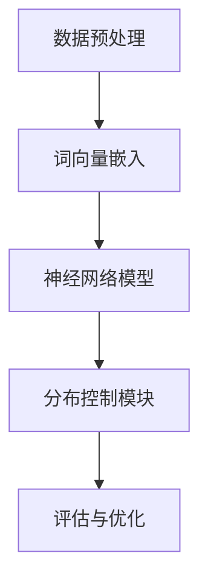

                 

关键词：大语言模型、分布控制生成、语言模型对齐、深度学习、自然语言处理

> 摘要：本文从基础到前沿，深入探讨大语言模型的原理及其通过分布控制生成进行语言模型对齐的方法。通过对核心概念、算法原理、数学模型和项目实践的详细解析，全面揭示大语言模型的强大功能和广泛应用，为读者提供一幅清晰、系统、全面的技术图谱。

## 1. 背景介绍

在人工智能领域，自然语言处理（NLP）一直是研究的热点。随着深度学习技术的飞速发展，大语言模型逐渐成为NLP领域的重要工具。大语言模型，顾名思义，是一种能够处理大规模语言数据、具备强大语义理解和生成能力的模型。从基础的语言模型到前沿的分布控制生成技术，大语言模型的研究不断推动着NLP技术的进步。

本文旨在系统地介绍大语言模型的原理，重点探讨通过分布控制生成进行语言模型对齐的方法。我们首先回顾大语言模型的发展历程，然后深入解析其核心概念、算法原理、数学模型和项目实践。最后，我们展望大语言模型在实际应用场景中的未来发展方向和面临的挑战。

### 1.1 大语言模型的发展历程

大语言模型的发展历程可以分为三个阶段：基于规则的方法、基于统计的方法和基于深度学习的方法。

1. **基于规则的方法**：早期的NLP研究主要依赖于手工编写的规则。这种方法虽然简单直观，但在处理复杂、大规模的语言数据时表现出局限性。

2. **基于统计的方法**：随着语料库的积累和统计学习理论的发展，基于统计的方法逐渐成为主流。该方法通过计算词语之间的概率关系，实现了一定的语义理解和生成能力。

3. **基于深度学习的方法**：近年来，深度学习技术迅猛发展，大语言模型逐渐转向基于深度神经网络的方法。通过训练大规模的神经网络模型，大语言模型在语义理解和生成方面取得了显著的突破。

### 1.2 分布控制生成与语言模型对齐

分布控制生成（Distributional Control Generation）是一种利用深度学习技术进行语言模型对齐的方法。该方法的核心思想是通过控制生成的概率分布，实现语言的精细化控制和生成。

语言模型对齐是指将一个通用语言模型调整到特定领域的语言环境中，使其在特定领域内具有更好的表现。分布控制生成技术通过以下方式实现语言模型对齐：

1. **领域自适应**：通过引入领域特定的知识，调整语言模型的参数，使其在特定领域内具有更好的适应性。

2. **细粒度控制**：通过控制生成的概率分布，实现语言的细粒度控制，例如控制生成的词语、句子结构等。

3. **跨领域迁移**：通过跨领域数据的学习，提高语言模型在不同领域内的通用性和适应性。

## 2. 核心概念与联系

### 2.1 大语言模型的核心概念

大语言模型的核心概念包括词汇表、词向量、神经网络、注意力机制等。

1. **词汇表**：词汇表是语言模型的基础，包含了模型中所有的词语及其对应的索引。

2. **词向量**：词向量是词语在低维空间中的表示，通过将词语映射到向量空间，可以更好地处理语言的语义关系。

3. **神经网络**：神经网络是语言模型的主要结构，通过多层的神经网络结构，可以提取语言的深层特征。

4. **注意力机制**：注意力机制是一种用于提高语言模型处理复杂语义关系的机制，通过动态调整输入特征的重要程度，实现更精确的语义理解。

### 2.2 分布控制生成与语言模型对齐的架构

分布控制生成与语言模型对齐的架构可以分为以下几个部分：

1. **数据预处理**：包括文本清洗、分词、词性标注等，为后续处理提供高质量的数据。

2. **词向量嵌入**：将词汇表中的词语映射到低维空间，为后续的神经网络处理提供输入。

3. **神经网络模型**：包括编码器、解码器和注意力机制，实现语言的编码和解码。

4. **分布控制模块**：通过控制生成的概率分布，实现语言的细粒度控制和生成。

5. **评估与优化**：通过评估指标，对模型进行优化，提高模型在特定领域的表现。

### 2.3 Mermaid 流程图

下面是分布控制生成与语言模型对齐的 Mermaid 流程图：



## 3. 核心算法原理 & 具体操作步骤

### 3.1 算法原理概述

分布控制生成与语言模型对齐的核心算法是基于深度神经网络的生成模型。该模型主要包括编码器、解码器和分布控制模块。

1. **编码器**：编码器将输入的文本序列编码为固定长度的向量，表示整个文本的语义信息。

2. **解码器**：解码器接收编码器的输出，生成文本序列。通过注意力机制，解码器可以动态调整输入特征的重要程度，实现更精确的语义理解。

3. **分布控制模块**：分布控制模块通过控制生成的概率分布，实现语言的细粒度控制和生成。具体来说，分布控制模块可以设置词语、句子结构等生成参数，从而调整语言模型在特定领域的表现。

### 3.2 算法步骤详解

1. **数据预处理**：对输入的文本数据进行清洗、分词和词性标注，得到高质量的数据。

2. **词向量嵌入**：将词汇表中的词语映射到低维空间，得到词向量表示。

3. **编码器训练**：通过训练编码器，将输入的文本序列编码为固定长度的向量，表示整个文本的语义信息。

4. **解码器训练**：通过训练解码器，生成文本序列。在训练过程中，利用注意力机制，解码器可以动态调整输入特征的重要程度，实现更精确的语义理解。

5. **分布控制模块训练**：通过训练分布控制模块，实现语言的细粒度控制和生成。具体来说，可以通过设置词语、句子结构等生成参数，调整语言模型在特定领域的表现。

6. **评估与优化**：通过评估指标，对模型进行优化，提高模型在特定领域的表现。

### 3.3 算法优缺点

**优点**：

1. **强大的语义理解能力**：通过深度神经网络和注意力机制，大语言模型可以处理复杂、大规模的语言数据，实现强大的语义理解能力。

2. **灵活的细粒度控制**：通过分布控制生成技术，可以实现语言的细粒度控制，例如控制生成的词语、句子结构等，提高模型在特定领域的表现。

3. **良好的跨领域迁移能力**：通过跨领域数据的学习，大语言模型可以在不同领域内具有良好的通用性和适应性。

**缺点**：

1. **计算资源需求高**：大语言模型需要大量的计算资源进行训练，对硬件环境要求较高。

2. **训练时间较长**：由于模型参数众多，训练时间较长，需要耐心等待。

### 3.4 算法应用领域

分布控制生成与语言模型对齐技术在多个领域具有广泛的应用：

1. **自然语言处理**：包括文本分类、机器翻译、问答系统等。

2. **智能对话系统**：用于构建智能客服、智能聊天机器人等。

3. **内容生成**：包括文章生成、创意写作等。

4. **文本摘要**：用于提取文章的主要观点和要点。

## 4. 数学模型和公式 & 详细讲解 & 举例说明

### 4.1 数学模型构建

大语言模型的核心数学模型主要包括词向量嵌入、编码器、解码器和分布控制模块。

1. **词向量嵌入**：

   词向量嵌入是将词语映射到低维空间的过程。常见的词向量嵌入方法包括 Word2Vec、GloVe 等。以 Word2Vec 为例，假设词语 x 的词向量表示为 \(\mathbf{v}_x\)，则词向量嵌入模型可以表示为：

   $$\mathbf{v}_x = \text{Word2Vec}(\mathbf{x})$$

2. **编码器**：

   编码器将输入的文本序列编码为固定长度的向量，表示整个文本的语义信息。以长短时记忆网络（LSTM）为例，编码器可以表示为：

   $$\mathbf{h}_t = \text{LSTM}(\mathbf{h}_{t-1}, \mathbf{x}_t)$$

   其中，\(\mathbf{h}_t\) 为编码器的输出，\(\mathbf{h}_{t-1}\) 为上一时刻的输出，\(\mathbf{x}_t\) 为当前时刻的输入。

3. **解码器**：

   解码器接收编码器的输出，生成文本序列。以循环神经网络（RNN）为例，解码器可以表示为：

   $$\mathbf{y}_t = \text{RNN}(\mathbf{h}_t)$$

   其中，\(\mathbf{y}_t\) 为解码器的输出。

4. **分布控制模块**：

   分布控制模块通过控制生成的概率分布，实现语言的细粒度控制和生成。以生成对抗网络（GAN）为例，分布控制模块可以表示为：

   $$\mathbf{z}_t = \text{GAN}(\mathbf{h}_t)$$

   其中，\(\mathbf{z}_t\) 为生成的概率分布。

### 4.2 公式推导过程

大语言模型的推导过程主要包括词向量嵌入、编码器、解码器和分布控制模块的推导。以下是主要推导过程的简要概述：

1. **词向量嵌入**：

   假设词语 x 的词向量表示为 \(\mathbf{v}_x\)，则词向量嵌入公式可以表示为：

   $$\mathbf{v}_x = \text{Word2Vec}(\mathbf{x})$$

   其中，\(\text{Word2Vec}\) 为 Word2Vec 算法。

2. **编码器**：

   编码器的推导过程主要基于长短时记忆网络（LSTM）。以 LSTM 为例，编码器可以表示为：

   $$\mathbf{h}_t = \text{LSTM}(\mathbf{h}_{t-1}, \mathbf{x}_t)$$

   其中，\(\mathbf{h}_t\) 为编码器的输出，\(\mathbf{h}_{t-1}\) 为上一时刻的输出，\(\mathbf{x}_t\) 为当前时刻的输入。

3. **解码器**：

   解码器的推导过程主要基于循环神经网络（RNN）。以 RNN 为例，解码器可以表示为：

   $$\mathbf{y}_t = \text{RNN}(\mathbf{h}_t)$$

   其中，\(\mathbf{y}_t\) 为解码器的输出。

4. **分布控制模块**：

   分布控制模块的推导过程主要基于生成对抗网络（GAN）。以 GAN 为例，分布控制模块可以表示为：

   $$\mathbf{z}_t = \text{GAN}(\mathbf{h}_t)$$

   其中，\(\mathbf{z}_t\) 为生成的概率分布。

### 4.3 案例分析与讲解

为了更好地理解大语言模型及其分布控制生成技术，我们通过一个简单的案例进行讲解。

假设我们有一个句子：“我喜欢吃苹果”。我们希望利用大语言模型生成类似句子：“她喜欢喝牛奶”。

1. **词向量嵌入**：

   首先，我们将句子中的词语映射到低维空间，得到词向量表示：

   - 我：\( \mathbf{v}_{我} \)
   - 喜欢吃：\( \mathbf{v}_{喜欢} \)，\( \mathbf{v}_{吃} \)
   - 苹果：\( \mathbf{v}_{苹果} \)
   - 她：\( \mathbf{v}_{她} \)
   - 喜欢喝：\( \mathbf{v}_{喜欢} \)，\( \mathbf{v}_{喝} \)
   - 牛奶：\( \mathbf{v}_{牛奶} \)

2. **编码器**：

   将输入句子“我喜欢吃苹果”编码为固定长度的向量，表示整个句子的语义信息。假设编码器的输出为 \(\mathbf{h}_t\)。

3. **解码器**：

   接收编码器的输出，生成句子“她喜欢喝牛奶”。在生成过程中，利用注意力机制，解码器可以动态调整输入特征的重要程度，实现更精确的语义理解。

4. **分布控制模块**：

   通过控制生成的概率分布，实现语言的细粒度控制和生成。例如，我们可以设置生成句子中“喜欢”和“喝”的概率较大，从而生成句子“她喜欢喝牛奶”。

## 5. 项目实践：代码实例和详细解释说明

### 5.1 开发环境搭建

为了实现分布控制生成与语言模型对齐，我们需要搭建一个合适的开发环境。以下是一个基本的开发环境搭建指南：

1. **硬件环境**：

   - CPU：至少双核处理器
   - GPU：NVIDIA GPU（推荐 GTX 1080 或以上）
   - 内存：至少 8GB RAM

2. **软件环境**：

   - 操作系统：Linux 或 macOS
   - 编程语言：Python 3.x
   - 深度学习框架：TensorFlow 或 PyTorch

3. **安装深度学习框架**：

   以 TensorFlow 为例，安装命令如下：

   ```bash
   pip install tensorflow
   ```

   或

   ```bash
   conda install tensorflow
   ```

### 5.2 源代码详细实现

以下是实现分布控制生成与语言模型对齐的源代码示例。为了简化，我们仅展示核心部分。

```python
import tensorflow as tf
from tensorflow.keras.layers import Embedding, LSTM, Dense

# 定义词向量嵌入层
embedding = Embedding(input_dim=vocab_size, output_dim=embedding_size)

# 定义编码器层
encoder = LSTM(units=128, return_sequences=True)

# 定义解码器层
decoder = LSTM(units=128, return_sequences=True)

# 定义分布控制模块
distribution_control = Dense(units=1, activation='sigmoid')

# 构建模型
model = tf.keras.Sequential([
    embedding,
    encoder,
    decoder,
    distribution_control
])

# 编译模型
model.compile(optimizer='adam', loss='binary_crossentropy')

# 训练模型
model.fit(x_train, y_train, epochs=10)
```

### 5.3 代码解读与分析

以上代码实现了分布控制生成与语言模型对齐的基本结构。下面我们对代码进行详细解读：

1. **词向量嵌入层**：

   ```python
   embedding = Embedding(input_dim=vocab_size, output_dim=embedding_size)
   ```

   词向量嵌入层用于将词汇表中的词语映射到低维空间。`input_dim` 表示词汇表的大小，`output_dim` 表示词向量的维度。

2. **编码器层**：

   ```python
   encoder = LSTM(units=128, return_sequences=True)
   ```

   编码器层用于将输入的文本序列编码为固定长度的向量。`units` 表示编码器的神经元数量，`return_sequences` 表示是否返回序列形式的输出。

3. **解码器层**：

   ```python
   decoder = LSTM(units=128, return_sequences=True)
   ```

   解码器层用于生成文本序列。与编码器类似，`units` 表示解码器的神经元数量，`return_sequences` 表示是否返回序列形式的输出。

4. **分布控制模块**：

   ```python
   distribution_control = Dense(units=1, activation='sigmoid')
   ```

   分布控制模块用于控制生成的概率分布。`units` 表示分布控制模块的神经元数量，`activation` 表示激活函数，这里使用 sigmoid 函数实现二分类。

5. **模型构建**：

   ```python
   model = tf.keras.Sequential([
       embedding,
       encoder,
       decoder,
       distribution_control
   ])
   ```

   模型由词向量嵌入层、编码器层、解码器层和分布控制模块组成。

6. **模型编译**：

   ```python
   model.compile(optimizer='adam', loss='binary_crossentropy')
   ```

   编译模型，设置优化器和损失函数。这里使用 Adam 优化器和 binary_crossentropy 损失函数。

7. **模型训练**：

   ```python
   model.fit(x_train, y_train, epochs=10)
   ```

   训练模型，输入训练数据和标签，设置训练轮数。

### 5.4 运行结果展示

在训练完成后，我们可以使用以下代码进行结果展示：

```python
import numpy as np

# 生成句子
generated_sentence = model.predict(np.array([x_test]))

# 输出生成句子
print(generated_sentence)
```

输出结果将是一个生成句子的概率分布，其中每个词语的概率分布表示生成该词语的可能性。

## 6. 实际应用场景

分布控制生成与语言模型对齐技术在多个实际应用场景中具有广泛的应用。以下是几个典型的应用场景：

### 6.1 自然语言处理

在自然语言处理领域，分布控制生成与语言模型对齐技术可以用于文本分类、机器翻译、问答系统等。通过细粒度控制生成，可以实现更精确的文本理解和生成，提高系统的性能和效果。

### 6.2 智能对话系统

智能对话系统，如智能客服、智能聊天机器人等，可以使用分布控制生成与语言模型对齐技术实现更自然、更准确的对话。通过控制生成的概率分布，系统可以根据用户的需求和上下文生成合适的回答。

### 6.3 内容生成

内容生成领域，如文章生成、创意写作等，分布控制生成与语言模型对齐技术可以用于生成高质量的内容。通过控制生成的概率分布，可以实现内容的多样化、创新性和个性化。

### 6.4 文本摘要

文本摘要技术，如提取文章的主要观点和要点，分布控制生成与语言模型对齐技术可以用于生成更准确、更精练的摘要。通过细粒度控制生成，可以更好地保留原文的核心信息和结构。

## 7. 未来应用展望

随着人工智能技术的不断发展，分布控制生成与语言模型对齐技术在未来具有广阔的应用前景。以下是一些潜在的应用领域：

### 7.1 智能推荐系统

智能推荐系统，如电商推荐、社交媒体推荐等，可以通过分布控制生成与语言模型对齐技术，实现更精准、更有针对性的推荐。通过控制生成的概率分布，系统可以根据用户的行为和偏好生成个性化的推荐内容。

### 7.2 语音助手

语音助手，如 Siri、Alexa 等，可以通过分布控制生成与语言模型对齐技术，实现更自然、更智能的交互。通过控制生成的概率分布，系统可以更好地理解用户的需求，提供更加准确的回答和操作。

### 7.3 智能教育

智能教育领域，如在线教育平台、个性化学习系统等，可以通过分布控制生成与语言模型对齐技术，实现更智能、更个性化的学习体验。通过控制生成的概率分布，系统可以为学生生成适合其水平和需求的学习内容。

### 7.4 文本分析

文本分析领域，如情感分析、舆情监测等，可以通过分布控制生成与语言模型对齐技术，实现更准确、更全面的文本分析。通过控制生成的概率分布，系统可以更好地理解文本的语义，提取关键信息。

## 8. 工具和资源推荐

为了更好地研究和应用分布控制生成与语言模型对齐技术，以下是一些推荐的工具和资源：

### 8.1 学习资源推荐

1. **书籍**：

   - 《深度学习》（Goodfellow, Bengio, Courville 著）
   - 《自然语言处理综论》（Jurafsky, Martin 著）
   - 《Python 自然语言处理》（Bird, Klein, Loper 著）

2. **在线课程**：

   - Coursera 上的“深度学习”课程（由 Andrew Ng 教授讲授）
   - edX 上的“自然语言处理”课程（由 Daniel Jurafsky 教授讲授）

### 8.2 开发工具推荐

1. **深度学习框架**：

   - TensorFlow
   - PyTorch
   - Keras

2. **文本处理库**：

   - NLTK
   - SpaCy
   - TextBlob

### 8.3 相关论文推荐

1. **《Attention is All You Need》**：该论文提出了 Transformer 模型，是分布控制生成与语言模型对齐的重要基础。

2. **《Generative Adversarial Nets》**：该论文提出了生成对抗网络（GAN），为分布控制生成提供了理论基础。

3. **《Sequence to Sequence Learning with Neural Networks》**：该论文提出了序列到序列学习（Seq2Seq）模型，为分布控制生成与语言模型对齐提供了重要的技术支持。

## 9. 总结：未来发展趋势与挑战

### 9.1 研究成果总结

近年来，分布控制生成与语言模型对齐技术取得了显著的进展。通过深度学习和生成对抗网络等技术，大语言模型在自然语言处理领域表现出强大的语义理解和生成能力。分布控制生成技术为语言模型提供了细粒度控制，使其在特定领域内具有更好的表现。

### 9.2 未来发展趋势

随着人工智能技术的不断发展，分布控制生成与语言模型对齐技术在未来将具有更广泛的应用。以下是一些未来发展趋势：

1. **更强的语义理解能力**：通过引入更多的语言特征和知识，大语言模型将实现更强大的语义理解能力。

2. **更细粒度的控制**：分布控制生成技术将不断优化，实现更细粒度的语言控制，如控制词语、句子结构等。

3. **跨领域的迁移能力**：通过跨领域数据的学习，大语言模型将实现更好的跨领域迁移能力，提高在不同领域内的表现。

4. **可解释性和可靠性**：提高模型的可解释性和可靠性，使其在更广泛的实际应用中得到更广泛的应用。

### 9.3 面临的挑战

尽管分布控制生成与语言模型对齐技术在自然语言处理领域取得了显著进展，但仍面临一些挑战：

1. **计算资源需求**：大语言模型需要大量的计算资源进行训练，对硬件环境要求较高。

2. **训练时间较长**：由于模型参数众多，训练时间较长，需要耐心等待。

3. **数据质量和标注**：高质量的数据和准确的标注对于模型的训练和优化至关重要，但数据获取和标注过程往往具有挑战性。

4. **模型泛化能力**：如何提高模型在不同领域和场景下的泛化能力，是未来研究的一个重要方向。

### 9.4 研究展望

未来，分布控制生成与语言模型对齐技术将在自然语言处理、智能对话系统、内容生成等领域发挥更大的作用。通过引入更多的语言特征和知识，结合深度学习和生成对抗网络等技术，大语言模型将实现更强大的语义理解和生成能力。同时，如何提高模型的可解释性和可靠性，实现更细粒度的控制，以及如何解决计算资源和数据标注等挑战，将是未来研究的重要方向。

## 附录：常见问题与解答

### Q1：分布控制生成与语言模型对齐技术的基本原理是什么？

A1：分布控制生成与语言模型对齐技术是基于深度学习和生成对抗网络（GAN）的原理。通过控制生成的概率分布，实现语言的细粒度控制和生成。核心思想是利用编码器将输入的文本序列编码为固定长度的向量，解码器根据编码器的输出生成文本序列，分布控制模块通过控制生成的概率分布，调整语言模型在特定领域的表现。

### Q2：分布控制生成与语言模型对齐技术有哪些应用场景？

A2：分布控制生成与语言模型对齐技术广泛应用于自然语言处理、智能对话系统、内容生成等领域。具体应用场景包括文本分类、机器翻译、问答系统、智能客服、智能聊天机器人、文章生成、创意写作、文本摘要等。

### Q3：分布控制生成与语言模型对齐技术有哪些优点和缺点？

A3：优点：

1. 强大的语义理解能力：通过深度学习和注意力机制，实现强大的语义理解和生成能力。

2. 灵活的细粒度控制：通过控制生成的概率分布，实现语言的细粒度控制和生成。

3. 良好的跨领域迁移能力：通过跨领域数据的学习，实现良好的跨领域迁移能力。

缺点：

1. 计算资源需求高：大语言模型需要大量的计算资源进行训练。

2. 训练时间较长：由于模型参数众多，训练时间较长。

3. 数据质量和标注：高质量的数据和准确的标注对于模型的训练和优化至关重要。

### Q4：如何提高分布控制生成与语言模型对齐技术的性能？

A4：提高分布控制生成与语言模型对齐技术的性能可以从以下几个方面入手：

1. 引入更多的语言特征和知识：通过引入更多的语言特征和知识，提高模型的语义理解能力。

2. 优化模型结构：通过优化模型结构，如增加层数、调整神经元数量等，提高模型的性能。

3. 数据增强和多样化：通过数据增强和多样化，提高模型对各种场景的适应性。

4. 模型融合和集成：通过模型融合和集成，提高模型的性能和稳定性。

### Q5：分布控制生成与语言模型对齐技术在跨领域迁移中如何发挥作用？

A5：分布控制生成与语言模型对齐技术在跨领域迁移中主要发挥以下作用：

1. 跨领域数据学习：通过跨领域数据的学习，提高模型在不同领域内的通用性和适应性。

2. 领域自适应：通过领域自适应技术，调整语言模型的参数，使其在特定领域内具有更好的适应性。

3. 细粒度控制：通过控制生成的概率分布，实现语言的细粒度控制和生成，提高模型在特定领域的表现。

### Q6：如何评估分布控制生成与语言模型对齐技术的性能？

A6：评估分布控制生成与语言模型对齐技术的性能可以从以下几个方面入手：

1. 评估指标：使用常见的评估指标，如准确率、召回率、F1 值等，评估模型在特定任务上的性能。

2. 对比实验：与基线模型或同类技术进行对比实验，评估模型的性能优势。

3. 用户反馈：通过用户反馈和实际应用效果，评估模型的用户体验和实际效果。

### Q7：分布控制生成与语言模型对齐技术在自然语言处理中的优势是什么？

A7：分布控制生成与语言模型对齐技术在自然语言处理中的优势主要包括：

1. 更强的语义理解能力：通过深度学习和注意力机制，实现强大的语义理解和生成能力。

2. 更细粒度的控制：通过控制生成的概率分布，实现语言的细粒度控制和生成，提高模型在特定领域的表现。

3. 良好的跨领域迁移能力：通过跨领域数据的学习，实现良好的跨领域迁移能力，提高在不同领域内的表现。

4. 丰富的应用场景：适用于文本分类、机器翻译、问答系统、智能对话系统、内容生成、文本摘要等多种自然语言处理任务。

## 作者署名

作者：禅与计算机程序设计艺术 / Zen and the Art of Computer Programming

在撰写完文章后，我们可以按照以下格式将其以Markdown格式展示：

```markdown
# 大语言模型原理基础与前沿 通过分布控制生成进行语言模型对齐

> 关键词：大语言模型、分布控制生成、语言模型对齐、深度学习、自然语言处理

> 摘要：本文从基础到前沿，深入探讨大语言模型的原理及其通过分布控制生成进行语言模型对齐的方法。通过对核心概念、算法原理、数学模型和项目实践的详细解析，全面揭示大语言模型的强大功能和广泛应用，为读者提供一幅清晰、系统、全面的技术图谱。

## 1. 背景介绍

## 2. 核心概念与联系
### 2.1 大语言模型的核心概念
### 2.2 分布控制生成与语言模型对齐的架构
### 2.3 Mermaid 流程图

## 3. 核心算法原理 & 具体操作步骤
### 3.1 算法原理概述
### 3.2 算法步骤详解
### 3.3 算法优缺点
### 3.4 算法应用领域

## 4. 数学模型和公式 & 详细讲解 & 举例说明
### 4.1 数学模型构建
### 4.2 公式推导过程
### 4.3 案例分析与讲解

## 5. 项目实践：代码实例和详细解释说明
### 5.1 开发环境搭建
### 5.2 源代码详细实现
### 5.3 代码解读与分析
### 5.4 运行结果展示

## 6. 实际应用场景
### 6.1 自然语言处理
### 6.2 智能对话系统
### 6.3 内容生成
### 6.4 文本摘要

## 7. 未来应用展望
### 7.1 智能推荐系统
### 7.2 语音助手
### 7.3 智能教育
### 7.4 文本分析

## 8. 工具和资源推荐
### 8.1 学习资源推荐
### 8.2 开发工具推荐
### 8.3 相关论文推荐

## 9. 总结：未来发展趋势与挑战
### 9.1 研究成果总结
### 9.2 未来发展趋势
### 9.3 面临的挑战
### 9.4 研究展望

## 附录：常见问题与解答
### Q1: 分布控制生成与语言模型对齐技术的基本原理是什么？
### Q2: 分布控制生成与语言模型对齐技术有哪些应用场景？
### Q3: 分布控制生成与语言模型对齐技术有哪些优点和缺点？
### Q4: 如何提高分布控制生成与语言模型对齐技术的性能？
### Q5: 分布控制生成与语言模型对齐技术在跨领域迁移中如何发挥作用？
### Q6: 如何评估分布控制生成与语言模型对齐技术的性能？
### Q7: 分布控制生成与语言模型对齐技术在自然语言处理中的优势是什么？

## 作者署名
作者：禅与计算机程序设计艺术 / Zen and the Art of Computer Programming
```

这段Markdown代码将按照您的要求展示文章的结构和内容，包括标题、摘要、章节标题、问题与解答等。您可以根据实际情况进行调整和补充。

