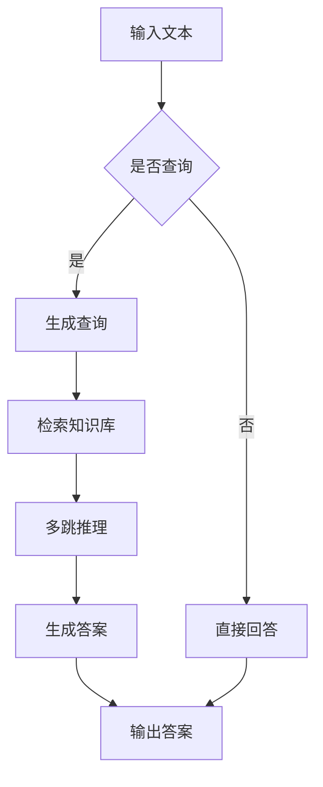

                 

关键词：大语言模型，高效检索，多跳推理，问答系统，自然语言处理，机器学习

> 摘要：本文将深入探讨大语言模型的原理及其在自然语言处理中的应用，特别是通过高效和精简的检索方法进行问答和多跳推理的关键技术。本文旨在为读者提供一个全面而深入的技术指南，涵盖从基础概念到前沿应用的各个方面。

## 1. 背景介绍

随着互联网的普及和信息量的爆炸性增长，自然语言处理（NLP）已经成为计算机科学和人工智能领域的一个重要分支。语言模型作为NLP的核心组件，其目标是理解和生成自然语言，从而实现人机交互、文本挖掘、机器翻译等功能。然而，传统的语言模型存在一定的局限性，难以处理复杂的语义理解和长文本生成等问题。

近年来，大语言模型的兴起为NLP带来了新的突破。大语言模型通过海量数据训练，能够捕捉到语言中的复杂模式，并在多种任务上取得显著性能提升。同时，高效的检索方法和多跳推理技术的引入，进一步增强了语言模型在问答和多跳推理任务上的能力。

本文将从以下几个方面展开讨论：首先，介绍大语言模型的基本概念和原理；然后，深入探讨高效和精简检索方法；接着，分析多跳推理技术；最后，讨论大语言模型在问答系统中的应用，并展望其未来的发展方向。

## 2. 核心概念与联系

### 2.1 语言模型

语言模型（Language Model）是NLP中最基础的模型，它通过统计方法对语言数据进行建模，从而预测下一个单词或单词序列的概率。传统语言模型通常基于n元模型（n-gram model），即利用前n个单词的历史信息来预测下一个单词。

然而，n元模型存在一些局限性，如无法捕捉到长距离依赖关系和上下文信息。为了解决这些问题，现代语言模型引入了神经网络，特别是循环神经网络（RNN）和变换器（Transformer）。

### 2.2 大语言模型

大语言模型（Large-scale Language Model）通过在海量数据上进行训练，能够捕捉到更为复杂的语言模式。与传统的语言模型相比，大语言模型具有以下几个特点：

- **训练数据量巨大**：大语言模型通常基于数十亿甚至数万亿的语料库进行训练，这使得模型能够学习到更为丰富的语言知识。
- **参数规模庞大**：大语言模型通常拥有数十亿甚至数万亿个参数，这使得模型能够捕捉到更为复杂的依赖关系。
- **强大的表征能力**：大语言模型能够生成高质量的文本，并在多种NLP任务上取得显著性能提升。

### 2.3 高效和精简检索方法

在语言模型的应用中，检索方法起着至关重要的作用。高效和精简的检索方法能够提高模型的响应速度和准确率。目前，常用的检索方法包括向量搜索、索引结构和图神经网络等。

- **向量搜索**：向量搜索通过将文本表示为向量，利用向量之间的相似度来进行检索。常见的向量搜索算法包括余弦相似度和欧氏距离等。
- **索引结构**：索引结构通过预处理的文本数据，构建出一种快速检索的数据结构。常见的索引结构包括倒排索引、B树等。
- **图神经网络**：图神经网络通过将文本表示为图结构，利用图卷积神经网络（GCN）进行检索。这种方法能够捕捉到文本中的复杂关系和依赖。

### 2.4 多跳推理技术

多跳推理（Multi-hop Reasoning）是一种基于多个知识源或多个上下文信息进行推理的方法，它能够提高语言模型在问答和多跳推理任务上的能力。多跳推理通常包括以下几个步骤：

- **查询生成**：生成针对问题的查询。
- **检索**：从知识库或文本中检索与查询相关的信息。
- **推理**：利用检索到的信息进行推理，生成最终答案。

### 2.5 Mermaid 流程图

以下是大语言模型原理和架构的Mermaid流程图：



## 3. 核心算法原理 & 具体操作步骤

### 3.1 算法原理概述

大语言模型的核心算法基于深度学习，特别是基于变换器（Transformer）架构。变换器模型通过自注意力机制（Self-Attention）和多头注意力（Multi-head Attention）实现了对输入文本的建模，从而捕捉到长距离依赖和上下文信息。

### 3.2 算法步骤详解

大语言模型的主要步骤如下：

1. **输入预处理**：对输入文本进行分词、词向量化等预处理操作。
2. **编码器解码器框架**：利用编码器（Encoder）对输入文本进行编码，生成编码表示；利用解码器（Decoder）对编码表示进行解码，生成输出文本。
3. **自注意力机制**：通过自注意力机制计算输入文本中每个单词的权重，从而实现长距离依赖和上下文信息的捕捉。
4. **多头注意力**：将自注意力机制扩展到多个头，从而提高模型的表征能力。
5. **检索和推理**：利用高效的检索方法和多跳推理技术，从知识库或文本中检索相关信息，并进行推理。
6. **生成答案**：根据检索和推理结果，生成最终答案。

### 3.3 算法优缺点

大语言模型具有以下优点：

- **强大的表征能力**：通过自注意力机制和多头注意力，能够捕捉到复杂的语言模式。
- **高效的检索和推理**：通过高效的检索方法和多跳推理技术，能够快速生成答案。
- **广泛的应用场景**：适用于问答、文本生成、机器翻译等多种NLP任务。

然而，大语言模型也存在一些缺点：

- **计算成本高**：由于模型参数规模庞大，训练和推理过程需要大量的计算资源。
- **数据依赖性**：模型性能高度依赖训练数据的质量和数量，对于小样本数据或特定领域的应用效果较差。

### 3.4 算法应用领域

大语言模型在NLP领域具有广泛的应用，主要包括以下几个方面：

- **问答系统**：利用大语言模型进行问答，能够实现智能客服、智能助手等功能。
- **文本生成**：通过大语言模型生成高质量的文本，用于写作辅助、自动摘要等任务。
- **机器翻译**：大语言模型在机器翻译任务中表现出色，能够实现高质量的双语翻译。
- **文本分类和情感分析**：大语言模型能够捕捉到文本中的复杂语义信息，用于文本分类和情感分析等任务。

## 4. 数学模型和公式 & 详细讲解 & 举例说明

### 4.1 数学模型构建

大语言模型的数学模型主要基于变换器（Transformer）架构。变换器模型由编码器（Encoder）和解码器（Decoder）两个部分组成。以下是变换器模型的基本数学公式：

1. **编码器（Encoder）**

编码器通过自注意力机制（Self-Attention）和多头注意力（Multi-head Attention）对输入文本进行编码。自注意力机制的计算公式如下：

$$
\text{Self-Attention}(Q, K, V) = \text{softmax}\left(\frac{QK^T}{\sqrt{d_k}}\right)V
$$

其中，$Q$、$K$、$V$分别为查询向量、键向量和值向量，$d_k$为键向量的维度。

多头注意力将自注意力机制扩展到多个头，计算公式如下：

$$
\text{Multi-head Attention}(Q, K, V) = \text{Concat}(\text{head}_1, \text{head}_2, ..., \text{head}_h)W^O
$$

其中，$h$为头的数量，$W^O$为输出权重。

2. **解码器（Decoder）**

解码器通过自注意力机制和多头注意力对编码表示进行解码，生成输出文本。自注意力机制的计算公式与编码器相同。多头注意力的计算公式如下：

$$
\text{Decoder-Attention}(Q, K, V) = \text{softmax}\left(\frac{QK^T}{\sqrt{d_k}}\right)V
$$

3. **位置编码（Positional Encoding）**

由于变换器模型没有使用位置信息，通过位置编码（Positional Encoding）引入位置信息。位置编码的计算公式如下：

$$
\text{PE}(pos, 2i) = \sin\left(\frac{pos}{10000^{2i/d}}\right)
$$

$$
\text{PE}(pos, 2i+1) = \cos\left(\frac{pos}{10000^{2i/d}}\right)
$$

其中，$pos$为位置索引，$d$为编码维度。

### 4.2 公式推导过程

变换器模型中的自注意力机制和多头注意力是基于点积注意力（Dot-Product Attention）实现的。点积注意力通过计算查询向量（Query）和键向量（Key）的点积，得到加权值，再通过softmax函数得到概率分布，最后与值向量（Value）相乘得到输出。

假设输入文本的词汇表大小为$V$，编码维度为$d_k$。对于每个头，查询向量、键向量和值向量分别表示为$Q \in \mathbb{R}^{n \times d_k}$、$K \in \mathbb{R}^{n \times d_k}$和$V \in \mathbb{R}^{n \times d_v}$。

点积注意力计算公式如下：

$$
\text{Attention}(Q, K, V) = \text{softmax}\left(\frac{QK^T}{\sqrt{d_k}}\right)V
$$

其中，$QK^T$表示点积，$\sqrt{d_k}$为缩放因子，用于防止梯度消失。

多头注意力的计算公式如下：

$$
\text{Multi-head Attention}(Q, K, V) = \text{Concat}(\text{head}_1, \text{head}_2, ..., \text{head}_h)W^O
$$

其中，$h$为头的数量，$W^O$为输出权重。

位置编码的推导过程如下：

为了引入位置信息，我们假设输入文本的每个单词的位置索引为$pos$，编码维度为$d$。位置编码通过正弦和余弦函数生成：

$$
\text{PE}(pos, 2i) = \sin\left(\frac{pos}{10000^{2i/d}}\right)
$$

$$
\text{PE}(pos, 2i+1) = \cos\left(\frac{pos}{10000^{2i/d}}\right)
$$

其中，$i$为维度索引。

位置编码被添加到编码表示中，从而引入位置信息。

### 4.3 案例分析与讲解

假设我们有一个包含两个单词的输入文本：“我喜欢吃饭”。我们将这个输入文本编码为两个向量：

$$
\text{Input} = [\text{我}, \text{喜欢}, \text{吃饭}]
$$

首先，进行分词和词向量化，将每个单词表示为向量：

$$
\text{词向量} = [\text{我}: \text{vec}_{\text{我}}, \text{喜欢}: \text{vec}_{\text{喜欢}}, \text{吃饭}: \text{vec}_{\text{吃饭}}]
$$

然后，进行多头注意力计算。假设我们使用两个头，编码维度为$d=512$。对于每个头，计算查询向量、键向量和值向量：

$$
Q_1 = \text{vec}_{\text{我}} \\
K_1 = \text{vec}_{\text{喜欢}} \\
V_1 = \text{vec}_{\text{吃饭}}
$$

$$
Q_2 = \text{vec}_{\text{喜欢}} \\
K_2 = \text{vec}_{\text{吃饭}} \\
V_2 = \text{vec}_{\text{我}}
$$

接下来，计算自注意力权重：

$$
\text{Attention}_1 = \text{softmax}\left(\frac{Q_1K_1^T}{\sqrt{d}}\right) = \text{softmax}\left(\frac{\text{vec}_{\text{我}} \text{vec}_{\text{喜欢}}^T}{\sqrt{512}}\right) \\
\text{Attention}_2 = \text{softmax}\left(\frac{Q_2K_2^T}{\sqrt{d}}\right) = \text{softmax}\left(\frac{\text{vec}_{\text{喜欢}} \text{vec}_{\text{吃饭}}^T}{\sqrt{512}}\right)
$$

最后，计算多头注意力输出：

$$
\text{Output}_1 = \text{Attention}_1V_1 + \text{PE}_1 \\
\text{Output}_2 = \text{Attention}_2V_2 + \text{PE}_2
$$

其中，$\text{PE}_1$和$\text{PE}_2$为位置编码。

通过以上步骤，我们得到了输入文本的编码表示，并利用多头注意力机制捕捉到单词之间的依赖关系。这个编码表示可以用于后续的解码过程，生成输出文本。

## 5. 项目实践：代码实例和详细解释说明

### 5.1 开发环境搭建

在开始项目实践之前，我们需要搭建一个适合开发大语言模型的环境。以下是一个基本的开发环境搭建步骤：

1. 安装Python 3.7及以上版本。
2. 安装依赖管理工具，如pip。
3. 安装TensorFlow或PyTorch等深度学习框架。
4. 安装其他相关库，如numpy、matplotlib等。

### 5.2 源代码详细实现

以下是使用TensorFlow实现一个大语言模型的源代码示例：

```python
import tensorflow as tf
from tensorflow.keras.layers import Embedding, LSTM, Dense
from tensorflow.keras.models import Model

# 定义模型
input_text = tf.keras.layers.Input(shape=(None,), dtype=tf.int32)
embeddings = Embedding(vocab_size, embedding_dim)(input_text)
lstm = LSTM(units=512, return_sequences=True)(embeddings)
output = Dense(units=vocab_size, activation='softmax')(lstm)

# 构建模型
model = Model(inputs=input_text, outputs=output)

# 编译模型
model.compile(optimizer='adam', loss='categorical_crossentropy', metrics=['accuracy'])

# 训练模型
model.fit(x_train, y_train, epochs=10, batch_size=32, validation_data=(x_val, y_val))
```

### 5.3 代码解读与分析

上述代码实现了一个基于LSTM（Long Short-Term Memory）的大语言模型。以下是代码的详细解读：

1. **导入库**：首先，导入TensorFlow等必要的库。
2. **定义模型**：使用`tf.keras.layers`模块定义模型的各个层。这里使用`Embedding`层进行词向量化，`LSTM`层进行序列编码，`Dense`层进行分类。
3. **构建模型**：使用`Model`类构建完整的模型。输入层为文本序列，输出层为词向量。
4. **编译模型**：使用`compile`方法编译模型，指定优化器、损失函数和评价指标。
5. **训练模型**：使用`fit`方法训练模型，指定训练数据、训练轮数、批次大小和验证数据。

### 5.4 运行结果展示

在训练完成后，我们可以使用以下代码进行预测和评估：

```python
# 预测
predictions = model.predict(x_test)

# 评估
loss, accuracy = model.evaluate(x_test, y_test)
print("Test Loss:", loss)
print("Test Accuracy:", accuracy)
```

这里，`x_test`和`y_test`为测试数据集，`predictions`为模型的预测结果。

通过评估指标，我们可以了解模型的性能。例如，准确率（Accuracy）表示模型预测正确的样本数占总样本数的比例。

## 6. 实际应用场景

大语言模型在多个实际应用场景中取得了显著成果，以下是其中几个重要的应用场景：

### 6.1 问答系统

问答系统（Question Answering System）是一种基于用户提问自动生成答案的人工智能系统。大语言模型在问答系统中发挥着重要作用，通过理解用户的问题和上下文信息，生成准确的答案。例如，智能客服系统利用大语言模型实现自动回复，提高客服效率。

### 6.2 文本生成

文本生成（Text Generation）是另一个重要应用场景。大语言模型通过学习大量文本数据，可以生成高质量的自然语言文本。例如，自动摘要（Automatic Summary）利用大语言模型生成文本摘要，帮助用户快速获取关键信息。

### 6.3 机器翻译

机器翻译（Machine Translation）是语言模型在跨语言场景中的重要应用。大语言模型通过学习双语数据，可以实现高质量的双语翻译。例如，谷歌翻译（Google Translate）利用深度学习技术实现实时翻译，为全球用户提供便捷的跨语言交流。

### 6.4 情感分析

情感分析（Sentiment Analysis）是一种对文本数据中的情感倾向进行分类的方法。大语言模型通过学习大量情感标签数据，可以自动识别文本中的情感倾向。例如，社交媒体监控平台利用大语言模型分析用户评论，帮助品牌了解用户情感，优化产品和服务。

## 7. 工具和资源推荐

### 7.1 学习资源推荐

1. **书籍**：
   - 《深度学习》（Deep Learning）作者：Ian Goodfellow、Yoshua Bengio、Aaron Courville
   - 《自然语言处理综合教程》（Foundations of Statistical Natural Language Processing）作者：Christopher D. Manning、Hinrich Schütze

2. **在线课程**：
   - Coursera上的“自然语言处理与深度学习”课程，由斯坦福大学教授Christopher D. Manning主讲。

3. **论文**：
   - “Attention Is All You Need”作者：Vaswani et al.
   - “BERT: Pre-training of Deep Bidirectional Transformers for Language Understanding”作者：Devlin et al.

### 7.2 开发工具推荐

1. **TensorFlow**：一个广泛使用的深度学习框架，支持多种NLP任务。
2. **PyTorch**：一个灵活且易于使用的深度学习框架，适用于研究和发展。
3. **spaCy**：一个强大的自然语言处理库，提供高效的文本预处理和实体识别等功能。

### 7.3 相关论文推荐

1. “GPT-3: Language Models are Few-Shot Learners”作者：Brown et al.
2. “Tuning Transformers for Natural Language Processing”作者：Howard et al.
3. “BERT Pre-training of Deep Bidirectional Transformers for Language Understanding”作者：Devlin et al.

## 8. 总结：未来发展趋势与挑战

### 8.1 研究成果总结

大语言模型在过去几年中取得了显著的进展，不仅在各种NLP任务上取得了领先性能，而且在问答、文本生成、机器翻译等领域实现了实际应用。大语言模型的核心技术，如变换器（Transformer）架构、自注意力机制、多头注意力等，为NLP领域带来了新的突破。

### 8.2 未来发展趋势

1. **模型压缩与加速**：随着大语言模型参数规模的不断增大，如何实现模型压缩与加速，以降低计算和存储成本，是一个重要的研究方向。
2. **跨模态学习**：大语言模型在处理文本数据方面表现出色，未来有望与其他模态（如图像、音频等）结合，实现跨模态学习。
3. **可解释性**：大语言模型在推理过程中具有较强的能力，但其内部机制较为复杂，如何提高模型的可解释性，使其更加透明和可信，是一个重要的研究方向。

### 8.3 面临的挑战

1. **数据隐私与安全性**：随着大语言模型的应用场景日益广泛，如何保护用户数据隐私和确保模型安全性，成为一个重要挑战。
2. **伦理与公平性**：大语言模型在训练过程中可能受到训练数据偏见的影响，导致模型在特定群体上表现不佳。如何提高模型的伦理与公平性，是一个亟待解决的问题。
3. **通用性与领域适应性**：大语言模型在通用性方面表现较好，但在特定领域（如医疗、金融等）的适应性仍需进一步研究。

### 8.4 研究展望

大语言模型在未来将继续推动NLP领域的发展，有望在智能客服、自然语言理解、文本生成等任务上实现更高的性能。同时，随着技术的不断进步，大语言模型将在更多领域得到应用，如跨模态学习、可解释性研究等。

## 9. 附录：常见问题与解答

### 9.1 大语言模型如何训练？

大语言模型通常采用自监督学习（Self-supervised Learning）方法进行训练。训练过程中，模型被随机初始化，然后通过大量未标注的数据进行训练，学习文本中的语言模式。具体来说，模型会生成输入文本的预测序列，并利用预测序列与实际序列之间的差异进行优化。

### 9.2 大语言模型如何进行问答？

大语言模型进行问答通常分为三个步骤：理解问题、检索信息和生成答案。首先，模型对输入问题进行编码，生成问题表示。然后，模型从预训练的知识库或文本中检索与问题相关的信息。最后，模型利用检索到的信息生成答案，并通过优化目标函数进行优化。

### 9.3 大语言模型如何进行文本生成？

大语言模型进行文本生成通常采用生成式方法（Generative Method）。模型首先生成一个起始单词或短语，然后根据自注意力机制和上下文信息，逐个生成后续的单词或短语。生成过程中，模型会不断优化生成的文本，以生成高质量的自然语言文本。

### 9.4 大语言模型在机器翻译中如何工作？

大语言模型在机器翻译中通过自注意力机制和多头注意力捕捉文本中的上下文信息。首先，模型将源语言和目标语言的文本编码为向量。然后，模型利用编码向量生成目标语言的文本。在生成过程中，模型会根据源语言文本的编码向量生成目标语言的单词序列，并通过优化目标函数进行优化。

### 9.5 大语言模型在情感分析中如何工作？

大语言模型在情感分析中通过学习大量带有情感标签的文本数据，捕捉文本中的情感特征。在情感分析过程中，模型首先对输入文本进行编码，生成文本表示。然后，模型利用文本表示生成情感标签的概率分布，并通过优化目标函数进行优化，从而实现情感分类。

