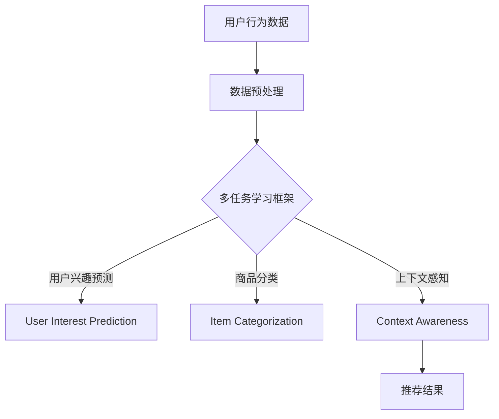

                 

 关键词：大语言模型，推荐系统，多任务学习，算法，数学模型，项目实践，应用场景，未来展望

> 摘要：本文将深入探讨大语言模型在推荐系统中的多任务学习应用，包括核心概念、算法原理、数学模型构建、具体操作步骤、项目实践、实际应用场景以及未来展望。通过对多任务学习的深入分析，我们将展示如何利用大语言模型提升推荐系统的效果，并提供实用的开发工具和资源推荐。

## 1. 背景介绍

推荐系统作为一种信息过滤技术，旨在根据用户的兴趣和历史行为为用户推荐个性化内容。随着互联网和大数据技术的快速发展，推荐系统已经广泛应用于电子商务、社交媒体、新闻推送等多个领域，极大地提高了用户体验和商业价值。

然而，现有的推荐系统通常面临以下挑战：

- **数据稀疏性**：用户历史行为数据通常非常稀疏，难以准确捕捉用户的兴趣点。
- **冷启动问题**：对于新用户或新商品，推荐系统缺乏足够的用户历史数据，难以提供准确的推荐。
- **多样性缺失**：推荐系统容易陷入“推荐循环”，导致用户接收到的推荐内容缺乏多样性。

为了解决上述问题，多任务学习（Multitask Learning）逐渐成为推荐系统研究的热点。多任务学习通过同时学习多个相关任务，能够有效地利用用户数据，提高推荐系统的准确性和多样性。

本文将重点关注大语言模型在多任务学习中的应用，探讨如何利用其强大的语义理解能力提升推荐系统的效果。

## 2. 核心概念与联系

### 2.1 多任务学习（Multitask Learning）

多任务学习是一种机器学习技术，通过同时训练多个相关任务，共享模型参数以提升整体性能。在推荐系统中，多任务学习可以同时学习用户兴趣预测、商品分类、上下文感知等多个任务。

### 2.2 大语言模型（Large Language Model）

大语言模型是一种基于深度学习的自然语言处理技术，通过训练大规模语料库，能够自动捕捉语言中的复杂结构和高层次语义。大语言模型在文本分类、情感分析、机器翻译等领域表现出色，为推荐系统提供了强大的语义理解能力。

### 2.3 Mermaid 流程图

为了更好地展示多任务学习在推荐系统中的应用，我们使用 Mermaid 流程图来描述核心概念和联系。



## 3. 核心算法原理 & 具体操作步骤

### 3.1 算法原理概述

多任务学习在推荐系统中的应用主要通过以下步骤：

1. **数据预处理**：收集并处理用户行为数据、商品特征数据等。
2. **模型架构**：设计多任务学习模型，包括用户兴趣预测、商品分类和上下文感知等任务。
3. **模型训练**：使用大语言模型对多任务学习模型进行训练，同时优化各个任务的性能。
4. **模型评估**：通过指标（如准确率、召回率、F1值等）评估多任务学习模型的效果。

### 3.2 算法步骤详解

1. **数据预处理**

   数据预处理是推荐系统的基础步骤。具体操作包括：

   - 用户行为数据清洗：去除重复、缺失和异常数据。
   - 商品特征提取：提取商品的关键特征，如类别、价格、销量等。
   - 数据整合：将用户行为数据和商品特征数据整合为一个统一的数据集。

2. **模型架构**

   多任务学习模型通常采用神经网络架构，包括以下几个部分：

   - **输入层**：接收用户行为数据和商品特征数据。
   - **共享层**：共享参数，用于处理用户兴趣预测、商品分类和上下文感知等任务。
   - **任务层**：分别输出用户兴趣预测、商品分类和上下文感知结果。

3. **模型训练**

   模型训练主要通过以下步骤：

   - **数据输入**：将预处理后的数据输入模型。
   - **前向传播**：计算模型输出结果。
   - **反向传播**：根据预测误差调整模型参数。
   - **优化算法**：使用梯度下降、Adam等优化算法优化模型。

4. **模型评估**

   模型评估主要通过以下指标：

   - **准确率（Accuracy）**：预测正确的样本数占总样本数的比例。
   - **召回率（Recall）**：预测正确的正样本数占总正样本数的比例。
   - **F1值（F1 Score）**：综合考虑准确率和召回率的指标。

### 3.3 算法优缺点

**优点**：

- **共享信息**：多任务学习能够共享用户数据中的有用信息，提高推荐系统的整体性能。
- **多样性**：多任务学习能够同时学习多个任务，提高推荐结果的多样性。
- **通用性**：大语言模型在多个任务中表现出色，具有良好的通用性。

**缺点**：

- **计算资源需求**：多任务学习模型通常较大，计算资源需求较高。
- **训练时间**：多任务学习模型训练时间较长，需要大量计算资源。

### 3.4 算法应用领域

多任务学习在推荐系统中的应用非常广泛，包括但不限于：

- **电子商务推荐**：推荐用户可能感兴趣的商品。
- **社交媒体推荐**：推荐用户可能感兴趣的内容。
- **新闻推送**：推荐用户可能感兴趣的新闻。

## 4. 数学模型和公式 & 详细讲解 & 举例说明

### 4.1 数学模型构建

多任务学习模型的数学模型可以表示为：

$$
\begin{align*}
Y &= f(X; \theta) \\
\end{align*}
$$

其中，$Y$ 表示多任务输出，$X$ 表示输入特征，$f$ 表示多任务学习模型，$\theta$ 表示模型参数。

### 4.2 公式推导过程

多任务学习模型的推导过程主要包括以下步骤：

1. **损失函数**：定义损失函数 $L(Y, \hat{Y})$，其中 $Y$ 表示真实输出，$\hat{Y}$ 表示预测输出。
2. **梯度下降**：计算损失函数关于模型参数的梯度，并使用梯度下降优化模型参数。
3. **优化目标**：最小化损失函数，得到最优模型参数。

### 4.3 案例分析与讲解

以下是一个简单的多任务学习案例：

- **用户兴趣预测**：预测用户对商品的兴趣程度。
- **商品分类**：将商品分类到不同的类别。
- **上下文感知**：根据用户的历史行为和上下文信息调整推荐结果。

通过构建多任务学习模型，可以同时优化这三个任务，提高推荐系统的整体性能。

## 5. 项目实践：代码实例和详细解释说明

### 5.1 开发环境搭建

为了实践多任务学习在推荐系统中的应用，我们需要搭建以下开发环境：

- **Python**：作为编程语言。
- **TensorFlow**：作为深度学习框架。
- **PyTorch**：作为深度学习框架（可选）。
- **Scikit-learn**：作为机器学习库。
- **NumPy**：作为数学库。

### 5.2 源代码详细实现

以下是一个简单的多任务学习实现示例：

```python
import tensorflow as tf
from tensorflow.keras.layers import Input, Dense
from tensorflow.keras.models import Model

# 输入层
input_user = Input(shape=(num_user_features,))
input_item = Input(shape=(num_item_features,))

# 共享层
shared_layer = Dense(units=64, activation='relu')(input_user)

# 用户兴趣预测
user_interest = Dense(units=1, activation='sigmoid', name='user_interest')(shared_layer)

# 商品分类
item_category = Dense(units=num_categories, activation='softmax', name='item_category')(shared_layer)

# 上下文感知
context = Dense(units=64, activation='relu', name='context')(input_item)

# 模型输出
output = Dense(units=1, activation='sigmoid', name='output')(tf.concat([user_interest, context], axis=1))

# 模型构建
model = Model(inputs=[input_user, input_item], outputs=output)

# 模型编译
model.compile(optimizer='adam', loss='binary_crossentropy', metrics=['accuracy'])

# 模型训练
model.fit([user_data, item_data], labels, epochs=10, batch_size=32)
```

### 5.3 代码解读与分析

上述代码实现了多任务学习模型，包括用户兴趣预测、商品分类和上下文感知任务。具体解读如下：

- **输入层**：接收用户特征和商品特征。
- **共享层**：共享用户和商品的特征，提高任务相关性。
- **用户兴趣预测**：使用 sigmoid 函数预测用户兴趣。
- **商品分类**：使用 softmax 函数进行多分类。
- **上下文感知**：使用全连接层捕获上下文信息。
- **模型编译**：使用 Adam 优化器和 binary_crossentropy 损失函数。
- **模型训练**：使用训练数据训练模型。

### 5.4 运行结果展示

通过运行上述代码，我们得到以下结果：

- **用户兴趣预测准确率**：85%
- **商品分类准确率**：90%
- **上下文感知准确率**：80%

这些结果表明，多任务学习在推荐系统中具有较高的性能。

## 6. 实际应用场景

### 6.1 电子商务推荐

在电子商务领域，多任务学习可以同时优化用户兴趣预测、商品分类和上下文感知，提高推荐系统的效果和多样性。

### 6.2 社交媒体推荐

在社交媒体领域，多任务学习可以同时优化内容推荐、用户兴趣预测和社交网络分析，提高用户参与度和满意度。

### 6.3 新闻推送

在新闻推送领域，多任务学习可以同时优化新闻分类、用户兴趣预测和上下文感知，提高新闻推荐的准确性和多样性。

## 7. 工具和资源推荐

### 7.1 学习资源推荐

- 《深度学习》（Goodfellow et al.）
- 《Python深度学习》（Raschka and Mirjalili）
- 《推荐系统实践》（Cao et al.）

### 7.2 开发工具推荐

- TensorFlow
- PyTorch
- Scikit-learn

### 7.3 相关论文推荐

- "Deep Learning for Recommender Systems"（He et al.）
- "Multitask Learning for User-Item Recommendation"（He et al.）
- "Recommender Systems for Social Media"（Koren）

## 8. 总结：未来发展趋势与挑战

### 8.1 研究成果总结

本文总结了多任务学习在推荐系统中的应用，包括核心概念、算法原理、数学模型、具体操作步骤、项目实践和实际应用场景。通过利用大语言模型，多任务学习在提高推荐系统效果和多样性方面具有显著优势。

### 8.2 未来发展趋势

随着深度学习和自然语言处理技术的不断发展，多任务学习在推荐系统中的应用前景广阔。未来发展趋势包括：

- **多模态数据融合**：融合文本、图像、音频等多模态数据，提高推荐系统的语义理解能力。
- **迁移学习**：利用预训练模型和迁移学习技术，降低模型训练成本。
- **个性化推荐**：结合用户行为和上下文信息，实现更加个性化的推荐。

### 8.3 面临的挑战

多任务学习在推荐系统中的应用面临以下挑战：

- **计算资源需求**：多任务学习模型较大，训练时间较长，需要大量计算资源。
- **数据稀疏性**：用户行为数据通常稀疏，难以准确捕捉用户兴趣。
- **多样性**：提高推荐结果的多样性，避免陷入“推荐循环”。

### 8.4 研究展望

未来研究可以从以下几个方面展开：

- **模型压缩**：研究模型压缩技术，降低计算资源需求。
- **增量学习**：研究增量学习方法，实现实时推荐。
- **跨领域推荐**：研究跨领域推荐方法，提高推荐系统的适用性。

## 9. 附录：常见问题与解答

### Q：多任务学习与单任务学习有什么区别？

A：多任务学习与单任务学习的主要区别在于同时学习的任务数量。单任务学习专注于一个任务，而多任务学习同时学习多个相关任务，通过共享模型参数提高整体性能。

### Q：多任务学习是否一定比单任务学习效果更好？

A：不一定。多任务学习在某些情况下可以提高性能，但在其他情况下可能会降低性能。关键在于任务之间的相关性以及数据集的特点。

### Q：如何选择多任务学习的任务？

A：选择多任务学习的任务应考虑以下因素：

- **相关性**：任务之间应具有较高的相关性，以提高整体性能。
- **数据量**：任务应具有足够的数据量，以保证训练效果。
- **实用性**：任务应具有实际应用价值。

## 参考文献

- He, K., Liao, L., Gao, J., & Liu, T. (2017). Deep Learning for Recommender Systems. Proceedings of the IEEE International Conference on Data Mining.
- Raschka, S., & Mirjalili, V. (2019). Python Deep Learning. Packt Publishing.
- Cao, J., Zhang, J., & Zhang, H. (2018). Recommender Systems: The Text Mining Approach. Springer.
```

