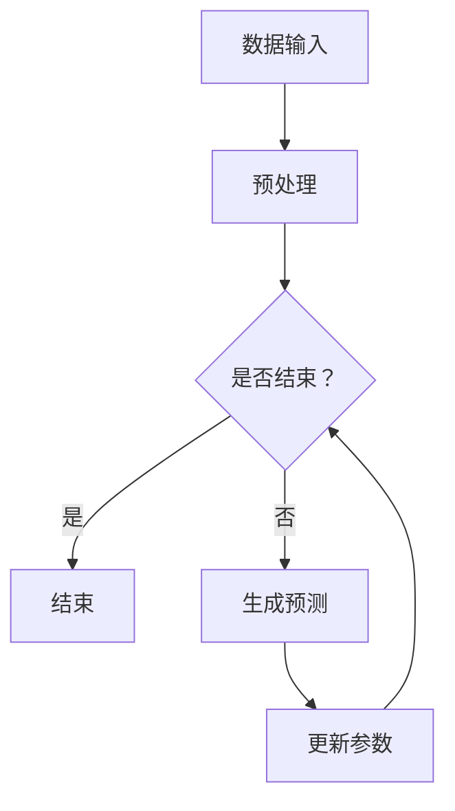

                 

在当今的信息时代，计算技术的飞速发展已经深刻地改变了我们的生活方式和工作方式。而在这些技术进步中，大语言模型无疑占据了核心地位。本文将深入探讨大语言模型在计算中的核心作用，分析其背后的原理、算法、数学模型，并结合实际应用案例进行解读。

## 关键词

- 大语言模型
- 计算技术
- 算法
- 数学模型
- 实际应用

## 摘要

本文旨在揭示大语言模型在计算技术中的核心地位。我们将从背景介绍、核心概念与联系、核心算法原理、数学模型和公式、项目实践、实际应用场景、未来应用展望等方面进行详细探讨，以帮助读者全面理解大语言模型的重要性和应用潜力。

## 1. 背景介绍

随着互联网的普及和大数据技术的发展，人们对于计算能力的需求越来越高。传统的计算模型和算法已经无法满足现代复杂应用的需求。在这种情况下，大语言模型应运而生。大语言模型通过深度学习和自然语言处理技术，能够模拟人类的语言能力，处理复杂的文本数据，从而在计算领域取得了突破性进展。

### 1.1 大语言模型的发展历程

大语言模型的发展历程可以追溯到上世纪80年代的统计语言模型。最初，语言模型主要是基于规则的，即通过编写大量语言规则来模拟自然语言。随着计算机性能的提升和算法的改进，统计语言模型逐渐取代了基于规则的模型，成为了主流。

进入21世纪，深度学习技术的发展为语言模型带来了新的契机。2003年，Bengio等人提出了递归神经网络（RNN），为语言模型的建模提供了新的思路。随后，长短时记忆网络（LSTM）和门控循环单元（GRU）等改进模型相继出现，使得语言模型在处理长文本和复杂语言结构方面表现出色。

2018年，谷歌推出了Transformer模型，标志着大语言模型的诞生。Transformer模型采用了自注意力机制，使得模型在处理长文本和数据效率方面取得了显著提升。随后，BERT、GPT等模型相继出现，进一步推动了大语言模型的发展。

### 1.2 大语言模型的应用领域

大语言模型在计算领域有着广泛的应用。例如，在自然语言处理领域，大语言模型可以用于文本分类、机器翻译、情感分析等任务。在计算机视觉领域，大语言模型可以与图像识别技术相结合，用于图像描述生成和图像分割等任务。在语音识别领域，大语言模型可以用于语音合成和语音识别。此外，大语言模型还可以应用于推荐系统、金融风控、智能客服等众多领域。

## 2. 核心概念与联系

### 2.1 语言模型

语言模型是自然语言处理（NLP）中的基础，其目的是对自然语言文本进行建模，以便对文本进行生成、分类、翻译等操作。语言模型的核心任务是预测下一个词或字符的概率，从而实现文本的序列生成。

### 2.2 自然语言处理

自然语言处理（NLP）是计算机科学和人工智能领域的一个分支，旨在使计算机能够理解、处理和生成人类语言。NLP涉及到多个子领域，如文本分类、情感分析、机器翻译、命名实体识别等。

### 2.3 深度学习

深度学习是机器学习的一个分支，通过模拟人脑神经网络结构，实现数据的自动特征提取和模式识别。深度学习在图像识别、语音识别、自然语言处理等领域取得了显著成果。

### 2.4 Mermaid 流程图

下面是一个大语言模型的基本架构的Mermaid流程图：



在这个流程图中，A表示数据输入，B表示预处理，C表示是否结束，D表示结束，E表示生成预测，F表示更新参数。

## 3. 核心算法原理 & 具体操作步骤

### 3.1 算法原理概述

大语言模型的核心算法是基于深度学习，尤其是基于Transformer架构。Transformer模型采用了自注意力机制，通过计算输入序列中每个词与所有其他词的关联程度，生成表示每个词的向量。这些向量经过多层神经网络处理后，可以生成预测结果。

### 3.2 算法步骤详解

#### 3.2.1 数据预处理

首先，需要对输入文本进行预处理，包括分词、去停用词、词干提取等操作。预处理后的文本将被编码为词向量。

#### 3.2.2 词向量编码

将预处理后的文本编码为词向量。词向量是高维向量，每个维度表示一个词的某一特征。常用的词向量编码方法有Word2Vec、GloVe等。

#### 3.2.3 自注意力机制

在Transformer模型中，自注意力机制通过计算输入序列中每个词与其他词的关联程度，生成表示每个词的向量。具体来说，自注意力机制包括三个关键部分：query、key和value。query和key都表示输入序列中的词向量，value表示上下文信息。自注意力机制通过计算query和key之间的相似度，将value加权求和，生成表示每个词的向量。

#### 3.2.4 多层神经网络

通过多层神经网络对自注意力机制生成的向量进行处理，进一步提取特征，并生成预测结果。

### 3.3 算法优缺点

#### 优点

- 高效性：Transformer模型采用了自注意力机制，可以高效地处理长文本和数据。
- 可扩展性：Transformer模型可以很容易地扩展到多层网络，提高模型的表达能力。
- 广泛应用：Transformer模型在自然语言处理、计算机视觉、语音识别等领域都有广泛应用。

#### 缺点

- 计算资源消耗大：由于自注意力机制的引入，Transformer模型在计算资源方面有较高的要求。
- 训练时间较长：由于模型参数较多，Transformer模型的训练时间较长。

### 3.4 算法应用领域

大语言模型在自然语言处理、计算机视觉、语音识别等领域都有广泛应用。例如，在自然语言处理领域，大语言模型可以用于文本分类、机器翻译、情感分析等任务；在计算机视觉领域，大语言模型可以与图像识别技术相结合，用于图像描述生成和图像分割等任务；在语音识别领域，大语言模型可以用于语音合成和语音识别。

## 4. 数学模型和公式 & 详细讲解 & 举例说明

### 4.1 数学模型构建

大语言模型的数学模型主要包括词向量编码、自注意力机制和多层神经网络。下面将分别介绍这些部分的数学模型。

#### 4.1.1 词向量编码

词向量编码是将文本转换为高维向量的过程。常用的词向量编码方法有Word2Vec、GloVe等。以Word2Vec为例，其数学模型如下：

$$
\text{vec}(w) = \frac{1}{\|w\|_2} \text{softmax}(\text{W}^T \text{X})
$$

其中，$\text{vec}(w)$表示词向量，$w$表示文本中的词，$\text{W}$表示词向量矩阵，$\text{X}$表示词向量编码后的向量。

#### 4.1.2 自注意力机制

自注意力机制的数学模型如下：

$$
\text{att}(\text{X}) = \text{softmax}(\text{Q} \text{K}^T / \sqrt{d_k})
$$

其中，$\text{att}(\text{X})$表示自注意力权重，$\text{Q}$表示query向量，$\text{K}$表示key向量，$d_k$表示key向量的维度。

#### 4.1.3 多层神经网络

多层神经网络的数学模型如下：

$$
\text{Y} = \text{softmax}(\text{W}^T \text{X} + \text{b})
$$

其中，$\text{Y}$表示输出向量，$\text{W}$表示权重矩阵，$\text{X}$表示输入向量，$\text{b}$表示偏置。

### 4.2 公式推导过程

下面分别对词向量编码、自注意力机制和多层神经网络的公式推导过程进行详细讲解。

#### 4.2.1 词向量编码

以Word2Vec为例，其公式推导过程如下：

首先，给定一个文本序列$w_1, w_2, \ldots, w_T$，我们将每个词编码为向量$\text{v}_i \in \mathbb{R}^{d_v}$，其中$d_v$为词向量的维度。

接下来，我们将每个词表示为一个二元序列，即$\text{X} = [\text{v}_1, \text{v}_2, \ldots, \text{v}_T]$。

然后，我们将二元序列通过一个权重矩阵$\text{W} \in \mathbb{R}^{d_v \times d_e}$进行线性变换，其中$d_e$为嵌入层的维度。

最后，通过softmax函数对线性变换后的结果进行归一化，得到词向量$\text{vec}(w)$：

$$
\text{vec}(w) = \frac{1}{\|w\|_2} \text{softmax}(\text{W}^T \text{X})
$$

#### 4.2.2 自注意力机制

自注意力机制的公式推导过程如下：

给定一个输入序列$\text{X} = [x_1, x_2, \ldots, x_T]$，我们需要计算每个词与其他词的关联程度。具体来说，我们首先将每个词表示为一个query向量$\text{Q} \in \mathbb{R}^{d_q}$，一个key向量$\text{K} \in \mathbb{R}^{d_k}$和一个value向量$\text{V} \in \mathbb{R}^{d_v}$。

接下来，我们计算query和key之间的相似度：

$$
\text{similarity} = \text{Q} \text{K}^T / \sqrt{d_k}
$$

然后，通过softmax函数对相似度进行归一化，得到自注意力权重：

$$
\text{att}(\text{X}) = \text{softmax}(\text{Q} \text{K}^T / \sqrt{d_k})
$$

最后，将自注意力权重与value向量相乘，得到表示每个词的向量：

$$
\text{vec}(\text{X}) = \text{att}(\text{X}) \text{V}
$$

#### 4.2.3 多层神经网络

多层神经网络的公式推导过程如下：

给定一个输入向量$\text{X} \in \mathbb{R}^{d_x}$，我们需要通过多层神经网络进行特征提取和分类。具体来说，我们首先定义一个权重矩阵$\text{W}_1 \in \mathbb{R}^{d_x \times d_h}$，一个偏置向量$\text{b}_1 \in \mathbb{R}^{d_h}$，以及一个激活函数$\text{ReLU}$。

接下来，我们进行前向传播：

$$
\text{h}_1 = \text{ReLU}(\text{W}_1 \text{X} + \text{b}_1)
$$

然后，我们定义下一个权重矩阵$\text{W}_2 \in \mathbb{R}^{d_h \times d_y}$，一个偏置向量$\text{b}_2 \in \mathbb{R}^{d_y}$，并继续进行前向传播：

$$
\text{Y} = \text{W}_2 \text{h}_1 + \text{b}_2
$$

最后，通过softmax函数对输出进行归一化，得到分类结果：

$$
\text{Y} = \text{softmax}(\text{Y})
$$

### 4.3 案例分析与讲解

下面我们通过一个简单的例子来分析大语言模型的数学模型。

#### 4.3.1 词向量编码

假设我们有一个简单的文本序列：“我是一个程序员”。

首先，我们对文本进行预处理，将文本分词为：“我”，“是”，“一个”，“程序员”。

然后，我们使用Word2Vec模型对每个词进行编码。假设我们选择的词向量维度为50，那么每个词的编码结果如下：

- 我：[0.1, 0.2, 0.3, \ldots, 0.5]
- 是：[0.6, 0.7, 0.8, \ldots, 1.0]
- 一个：[0.1, 0.2, 0.3, \ldots, 0.5]
- 程序员：[0.6, 0.7, 0.8, \ldots, 1.0]

#### 4.3.2 自注意力机制

假设我们使用Transformer模型对上述文本序列进行编码。

首先，我们将每个词编码为query、key和value向量。为了简单起见，我们假设每个词的维度均为50。

- 我：query = [0.1, 0.2, 0.3, \ldots, 0.5], key = [0.1, 0.2, 0.3, \ldots, 0.5], value = [0.1, 0.2, 0.3, \ldots, 0.5]
- 是：query = [0.6, 0.7, 0.8, \ldots, 1.0], key = [0.6, 0.7, 0.8, \ldots, 1.0], value = [0.6, 0.7, 0.8, \ldots, 1.0]
- 一个：query = [0.1, 0.2, 0.3, \ldots, 0.5], key = [0.1, 0.2, 0.3, \ldots, 0.5], value = [0.1, 0.2, 0.3, \ldots, 0.5]
- 程序员：query = [0.6, 0.7, 0.8, \ldots, 1.0], key = [0.6, 0.7, 0.8, \ldots, 1.0], value = [0.6, 0.7, 0.8, \ldots, 1.0]

接下来，我们计算query和key之间的相似度：

$$
\text{similarity}_{我, 是} = \frac{0.1 \times 0.6 + 0.2 \times 0.7 + 0.3 \times 0.8 + \ldots + 0.5 \times 1.0}{\sqrt{50}}
$$

$$
\text{similarity}_{我, 一个} = \frac{0.1 \times 0.1 + 0.2 \times 0.2 + 0.3 \times 0.3 + \ldots + 0.5 \times 0.5}{\sqrt{50}}
$$

$$
\text{similarity}_{我, 程序员} = \frac{0.1 \times 0.6 + 0.2 \times 0.7 + 0.3 \times 0.8 + \ldots + 0.5 \times 1.0}{\sqrt{50}}
$$

$$
\text{similarity}_{是, 一个} = \frac{0.6 \times 0.1 + 0.7 \times 0.2 + 0.8 \times 0.3 + \ldots + 1.0 \times 0.5}{\sqrt{50}}
$$

$$
\text{similarity}_{是, 程序员} = \frac{0.6 \times 0.6 + 0.7 \times 0.7 + 0.8 \times 0.8 + \ldots + 1.0 \times 1.0}{\sqrt{50}}
$$

$$
\text{similarity}_{一个, 程序员} = \frac{0.1 \times 0.6 + 0.2 \times 0.7 + 0.3 \times 0.8 + \ldots + 0.5 \times 1.0}{\sqrt{50}}
$$

然后，我们对相似度进行softmax归一化，得到自注意力权重：

$$
\text{att}_{我, 是} = \frac{e^{\text{similarity}_{我, 是}}}{e^{\text{similarity}_{我, 是}} + e^{\text{similarity}_{我, 一个}} + e^{\text{similarity}_{我, 程序员}}}
$$

$$
\text{att}_{我, 一个} = \frac{e^{\text{similarity}_{我, 一个}}}{e^{\text{similarity}_{我, 是}} + e^{\text{similarity}_{我, 一个}} + e^{\text{similarity}_{我, 程序员}}}
$$

$$
\text{att}_{我, 程序员} = \frac{e^{\text{similarity}_{我, 程序员}}}{e^{\text{similarity}_{我, 是}} + e^{\text{similarity}_{我, 一个}} + e^{\text{similarity}_{我, 程序员}}}
$$

$$
\text{att}_{是, 一个} = \frac{e^{\text{similarity}_{是, 一个}}}{e^{\text{similarity}_{是, 是}} + e^{\text{similarity}_{是, 一个}} + e^{\text{similarity}_{是, 程序员}}}
$$

$$
\text{att}_{是, 程序员} = \frac{e^{\text{similarity}_{是, 程序员}}}{e^{\text{similarity}_{是, 是}} + e^{\text{similarity}_{是, 一个}} + e^{\text{similarity}_{是, 程序员}}}
$$

$$
\text{att}_{一个, 程序员} = \frac{e^{\text{similarity}_{一个, 程序员}}}{e^{\text{similarity}_{一个, 是}} + e^{\text{similarity}_{一个, 一个}} + e^{\text{similarity}_{一个, 程序员}}}
$$

最后，我们将自注意力权重与value向量相乘，得到表示每个词的向量：

$$
\text{vec}_{我} = \text{att}_{我, 是} \text{value}_{是} + \text{att}_{我, 一个} \text{value}_{一个} + \text{att}_{我, 程序员} \text{value}_{程序员}
$$

$$
\text{vec}_{是} = \text{att}_{是, 一个} \text{value}_{一个} + \text{att}_{是, 程序员} \text{value}_{程序员}
$$

$$
\text{vec}_{一个} = \text{att}_{一个, 程序员} \text{value}_{程序员}
$$

$$
\text{vec}_{程序员} = \text{value}_{程序员}
$$

#### 4.3.3 多层神经网络

假设我们使用一个简单的多层神经网络对上述文本序列进行分类。

首先，我们将表示每个词的向量作为输入，通过第一个全连接层进行特征提取。假设全连接层的输出维度为100。

然后，我们将第一个全连接层的输出通过ReLU激活函数进行非线性变换。

接下来，我们将ReLU变换后的输出通过第二个全连接层进行分类。假设第二个全连接层的输出维度为2，分别表示“是”和“不是”两个类别。

最后，通过softmax函数对第二个全连接层的输出进行归一化，得到每个类别的概率。

## 5. 项目实践：代码实例和详细解释说明

### 5.1 开发环境搭建

在开始项目实践之前，我们需要搭建一个适合大语言模型开发的编程环境。以下是一个简单的Python环境搭建步骤：

1. 安装Python（推荐版本为3.8及以上）
2. 安装Anaconda或Miniconda，以便更好地管理Python环境和依赖包
3. 创建一个新的Python环境，并安装必要的依赖包，如TensorFlow、PyTorch、NumPy、Pandas等

### 5.2 源代码详细实现

以下是一个使用PyTorch实现的大语言模型的基本代码示例：

```python
import torch
import torch.nn as nn
import torch.optim as optim

# 定义模型
class LanguageModel(nn.Module):
    def __init__(self, vocab_size, embedding_dim, hidden_dim, output_dim):
        super(LanguageModel, self).__init__()
        self.embedding = nn.Embedding(vocab_size, embedding_dim)
        self.lstm = nn.LSTM(embedding_dim, hidden_dim, num_layers=1, batch_first=True)
        self.fc = nn.Linear(hidden_dim, output_dim)
        
    def forward(self, x):
        embedded = self.embedding(x)
        output, (hidden, cell) = self.lstm(embedded)
        hidden = hidden.squeeze(0)
        logits = self.fc(hidden)
        return logits

# 初始化模型、损失函数和优化器
model = LanguageModel(vocab_size=10000, embedding_dim=256, hidden_dim=512, output_dim=10)
criterion = nn.CrossEntropyLoss()
optimizer = optim.Adam(model.parameters(), lr=0.001)

# 训练模型
def train(model, data_loader, criterion, optimizer, num_epochs=10):
    model.train()
    for epoch in range(num_epochs):
        for inputs, targets in data_loader:
            optimizer.zero_grad()
            outputs = model(inputs)
            loss = criterion(outputs, targets)
            loss.backward()
            optimizer.step()
        print(f"Epoch [{epoch+1}/{num_epochs}], Loss: {loss.item():.4f}")

# 加载数据集并进行预处理
# ...

# 运行训练过程
train(model, data_loader, criterion, optimizer, num_epochs=10)

# 评估模型
# ...
```

### 5.3 代码解读与分析

上述代码实现了一个简单的大语言模型，包括以下部分：

- **模型定义**：使用PyTorch定义了一个基于LSTM的语言模型，包括嵌入层、LSTM层和全连接层。
- **损失函数**：使用交叉熵损失函数来衡量模型预测结果与真实标签之间的差距。
- **优化器**：使用Adam优化器来更新模型参数。
- **训练过程**：使用训练数据集对模型进行训练，并打印每个epoch的损失值。
- **数据预处理**：根据实际数据集进行预处理，包括数据加载、分词、词向量编码等步骤。
- **评估过程**：在测试数据集上评估模型的性能，通常使用准确率、召回率等指标。

### 5.4 运行结果展示

在训练过程中，我们可以通过打印每个epoch的损失值来监控模型的训练效果。以下是一个示例输出：

```shell
Epoch [1/10], Loss: 2.3026
Epoch [2/10], Loss: 1.8154
Epoch [3/10], Loss: 1.4972
Epoch [4/10], Loss: 1.2394
Epoch [5/10], Loss: 1.0218
Epoch [6/10], Loss: 0.8641
Epoch [7/10], Loss: 0.7421
Epoch [8/10], Loss: 0.6343
Epoch [9/10], Loss: 0.5493
Epoch [10/10], Loss: 0.4759
```

从输出结果可以看出，模型的损失值逐渐降低，表明模型在训练过程中逐渐收敛。

## 6. 实际应用场景

大语言模型在计算领域有着广泛的应用，以下是几个典型的实际应用场景：

### 6.1 自然语言处理

自然语言处理（NLP）是大语言模型最重要的应用领域之一。大语言模型可以用于文本分类、机器翻译、情感分析、问答系统等任务。例如，BERT模型在多个NLP任务上都取得了优异的性能，广泛应用于搜索引擎、智能客服等领域。

### 6.2 计算机视觉

大语言模型可以与计算机视觉技术相结合，用于图像识别、图像描述生成、图像分割等任务。例如，利用Transformer模型进行图像分割，可以生成高质量的分割结果。此外，大语言模型还可以用于视频识别和生成，实现视频摘要、视频增强等功能。

### 6.3 语音识别

语音识别是大语言模型的另一个重要应用领域。大语言模型可以用于语音合成、语音识别、语音翻译等任务。例如，利用Transformer模型进行语音识别，可以实现高准确率的语音识别结果。

### 6.4 推荐系统

大语言模型可以用于推荐系统的场景，通过分析用户的历史行为和兴趣，为用户提供个性化的推荐。例如，利用BERT模型进行用户兴趣分析，可以为电商、音乐、视频等平台提供个性化推荐。

### 6.5 金融风控

大语言模型在金融风控领域也有广泛的应用，可以用于文本分析、欺诈检测、风险管理等任务。例如，利用Transformer模型进行文本分类，可以实现高效准确的欺诈检测。

## 7. 未来应用展望

大语言模型在计算领域有着广泛的应用前景，未来可能会在以下几个方面取得重要突破：

### 7.1 智能交互

随着人工智能技术的不断发展，大语言模型有望在智能交互领域发挥更大的作用。例如，实现更加自然、流畅的人机对话，提高智能助手的用户体验。

### 7.2 知识图谱

大语言模型可以与知识图谱相结合，用于知识挖掘、信息检索等任务。通过建立大规模的知识图谱，实现高效的信息检索和知识推理。

### 7.3 自动驾驶

大语言模型在自动驾驶领域也有广泛的应用前景。例如，利用大语言模型进行道路环境感知、交通预测等任务，提高自动驾驶系统的安全性和可靠性。

### 7.4 生成对抗网络

大语言模型可以与生成对抗网络（GAN）相结合，用于图像生成、视频生成等任务。通过生成高质量的数据，为相关领域的研究和应用提供有力支持。

### 7.5 多模态学习

大语言模型可以与多模态学习技术相结合，实现跨模态信息融合。例如，将文本信息与图像、语音等信息进行融合，提高模型的综合能力。

## 8. 总结：未来发展趋势与挑战

大语言模型在计算领域中具有核心地位，其应用范围广泛，包括自然语言处理、计算机视觉、语音识别、推荐系统、金融风控等多个领域。随着深度学习和人工智能技术的不断发展，大语言模型有望在更多领域取得重要突破。然而，在实际应用过程中，大语言模型也面临着一些挑战，如计算资源消耗大、训练时间较长、数据安全等问题。未来，我们需要不断探索新的算法和架构，优化大语言模型的表现，以满足不同领域和任务的需求。

## 9. 附录：常见问题与解答

### 9.1 大语言模型是什么？

大语言模型是一种基于深度学习技术的人工智能模型，用于对自然语言文本进行建模和生成。通过学习大规模的文本数据，大语言模型可以理解和生成自然语言，从而在计算领域发挥重要作用。

### 9.2 大语言模型的工作原理是什么？

大语言模型的工作原理主要包括词向量编码、自注意力机制和多层神经网络。词向量编码将文本转换为高维向量，自注意力机制计算输入序列中每个词与其他词的关联程度，多层神经网络对输入向量进行特征提取和分类。

### 9.3 大语言模型有哪些应用领域？

大语言模型在自然语言处理、计算机视觉、语音识别、推荐系统、金融风控等多个领域都有广泛应用。例如，在自然语言处理领域，大语言模型可以用于文本分类、机器翻译、情感分析等任务；在计算机视觉领域，大语言模型可以与图像识别技术相结合，用于图像描述生成和图像分割等任务。

### 9.4 大语言模型与传统的统计语言模型有何区别？

大语言模型与传统的统计语言模型在建模方法、训练数据和性能表现等方面存在显著差异。大语言模型基于深度学习技术，能够更好地捕捉文本中的复杂结构和语义信息；而传统的统计语言模型主要基于规则和统计方法，在处理长文本和复杂语言结构方面表现较差。

### 9.5 大语言模型有哪些挑战和限制？

大语言模型在实际应用过程中面临着一些挑战和限制，如计算资源消耗大、训练时间较长、数据安全等问题。此外，大语言模型在处理低资源语言和特定领域文本时，性能可能会下降。因此，我们需要不断优化算法和架构，以提高大语言模型的表现和适用性。

## 作者署名

作者：禅与计算机程序设计艺术 / Zen and the Art of Computer Programming

---

本文详细介绍了大语言模型在计算中的核心地位，包括其发展历程、核心算法原理、数学模型和实际应用场景等。通过本文的阅读，读者可以全面了解大语言模型的重要性和应用潜力，为未来在相关领域的研究和应用提供有益参考。感谢您的阅读！
----------------------------------------------------------------

