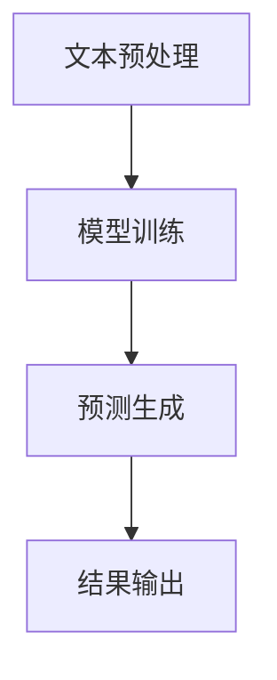

                 

关键词：大语言模型，算法原理，应用场景，数学模型，项目实践，未来展望

> 摘要：本文将深入探讨大语言模型的算法原理、数学模型、应用场景以及项目实践，帮助读者全面了解这一前沿技术的核心要点，并展望其未来发展趋势与挑战。

## 1. 背景介绍

随着互联网和人工智能的快速发展，自然语言处理（NLP）领域取得了令人瞩目的成就。大语言模型作为NLP的重要工具，已经广泛应用于机器翻译、文本生成、对话系统等多个领域。本文旨在通过对大语言模型的核心算法原理、数学模型和应用场景的详细讲解，帮助读者深入理解这一技术的本质，并掌握其实际应用的方法。

## 2. 核心概念与联系

### 2.1 大语言模型基本概念

大语言模型是一种基于深度学习的文本生成模型，通过对海量文本数据的学习，模型能够预测下一个词或句子，从而实现文本生成。其基本原理可以归纳为以下几个步骤：

1. 数据预处理：对文本进行分词、去停用词、词性标注等预处理操作，将原始文本转换为适合模型学习的形式。
2. 网络结构：大语言模型通常采用多层循环神经网络（RNN）或Transformer架构，通过训练学习文本的内在规律。
3. 预测与生成：在给定一个起始序列后，模型逐层生成后续的词或句子，最终形成完整的文本。

### 2.2 大语言模型与NLP的关系

自然语言处理（NLP）是人工智能（AI）的重要分支，旨在使计算机能够理解和处理人类自然语言。大语言模型作为NLP的核心工具，其在文本生成、情感分析、实体识别等领域发挥着关键作用。通过大语言模型，计算机能够实现与人类更自然的交互，从而推动人工智能技术的广泛应用。

### 2.3 大语言模型的架构

大语言模型主要采用两种架构：循环神经网络（RNN）和Transformer。RNN通过隐藏状态和反馈循环实现序列数据的建模，而Transformer则通过自注意力机制实现全局依赖关系的建模。两者各有优缺点，适用于不同的应用场景。

#### 2.3.1 RNN架构

RNN的基本思想是利用隐藏状态记录前一个时刻的信息，并将其传递到下一个时刻，从而实现序列数据的建模。RNN的优缺点如下：

**优点：**

- 简单易懂，易于实现；
- 能够处理长短依赖关系。

**缺点：**

- 难以避免梯度消失和梯度爆炸问题；
- 不能并行计算。

#### 2.3.2 Transformer架构

Transformer由Vaswani等人于2017年提出，其核心思想是利用自注意力机制实现全局依赖关系的建模。Transformer的优缺点如下：

**优点：**

- 适用于大规模数据；
- 能够并行计算；
- 在许多任务上表现出色。

**缺点：**

- 参数量较大，计算复杂度高；
- 需要大量的训练数据。

### 2.4 Mermaid流程图

以下是一个大语言模型的基本流程图：



## 3. 核心算法原理 & 具体操作步骤

### 3.1 算法原理概述

大语言模型的算法原理主要包括数据预处理、模型训练和预测生成三个阶段。下面将分别介绍这三个阶段的具体操作步骤。

### 3.2 算法步骤详解

#### 3.2.1 数据预处理

数据预处理是模型训练的基础，主要包括以下几个步骤：

1. 分词：将文本按照词汇单位进行划分，形成单词序列；
2. 去停用词：去除对模型训练贡献较小的词汇，如“的”、“地”等；
3. 词性标注：对每个词汇进行词性标注，如名词、动词等；
4. 向量化：将词汇序列转换为数值向量，为模型训练做准备。

#### 3.2.2 模型训练

模型训练是利用海量文本数据，通过优化算法调整模型参数的过程。以下是一个简化的训练流程：

1. 初始化模型参数；
2. 遍历训练数据，计算损失函数；
3. 利用梯度下降等优化算法更新模型参数；
4. 重复步骤2和3，直到达到训练目标。

#### 3.2.3 预测生成

在给定一个起始序列后，模型逐层生成后续的词或句子，最终形成完整的文本。预测生成的主要步骤如下：

1. 输入起始序列；
2. 利用模型计算下一个词的概率分布；
3. 根据概率分布随机采样一个词作为下一时刻的输入；
4. 重复步骤2和3，直到生成完整的文本。

### 3.3 算法优缺点

大语言模型的优缺点如下：

**优点：**

- 能够处理复杂的文本序列；
- 在多种NLP任务上表现出色。

**缺点：**

- 训练过程复杂，计算量大；
- 对数据量和计算资源要求较高。

### 3.4 算法应用领域

大语言模型在以下领域具有广泛的应用：

- 文本生成：如自动写作、聊天机器人等；
- 机器翻译：如英译中、中译英等；
- 情感分析：如文本情感分类、情绪识别等；
- 实体识别：如命名实体识别、关系提取等。

## 4. 数学模型和公式 & 详细讲解 & 举例说明

### 4.1 数学模型构建

大语言模型的核心数学模型是基于概率的序列生成模型，其主要公式包括：

$$
P(\text{word}_i | \text{word}_{<i}) = \frac{f(\text{word}_{<i}, \text{word}_i)}{\sum_j f(\text{word}_{<i}, \text{word}_j)}
$$

其中，$f(\text{word}_{<i}, \text{word}_i)$表示生成下一个词$\text{word}_i$的条件概率，可以通过神经网络计算得到。

### 4.2 公式推导过程

$$
P(\text{word}_i | \text{word}_{<i}) = \frac{f(\text{word}_{<i}, \text{word}_i)}{\sum_j f(\text{word}_{<i}, \text{word}_j)}
$$

的推导基于概率论的基本原理。在给定前一个词序列$\text{word}_{<i}$时，我们需要计算下一个词$\text{word}_i$的条件概率。根据概率论中的条件概率公式，我们有：

$$
P(\text{word}_i | \text{word}_{<i}) = \frac{P(\text{word}_{<i} \cap \text{word}_i)}{P(\text{word}_{<i})}
$$

由于$P(\text{word}_{<i} \cap \text{word}_i) = P(\text{word}_{<i} | \text{word}_i) \cdot P(\text{word}_i)$，代入上式得：

$$
P(\text{word}_i | \text{word}_{<i}) = \frac{P(\text{word}_{<i} | \text{word}_i) \cdot P(\text{word}_i)}{P(\text{word}_{<i})}
$$

又因为$P(\text{word}_{<i} | \text{word}_i)$可以理解为在给定$\text{word}_i$的情况下，前一个词序列$\text{word}_{<i}$的条件概率，因此可以将其表示为$f(\text{word}_{<i}, \text{word}_i)$。代入上式得：

$$
P(\text{word}_i | \text{word}_{<i}) = \frac{f(\text{word}_{<i}, \text{word}_i) \cdot P(\text{word}_i)}{P(\text{word}_{<i})}
$$

为了计算$P(\text{word}_i)$，我们可以将所有可能的$\text{word}_{<i}$作为条件进行枚举，然后利用全概率公式：

$$
P(\text{word}_i) = \sum_{\text{word}_{<i}} P(\text{word}_{<i} | \text{word}_i) \cdot P(\text{word}_{<i})
$$

将$P(\text{word}_{<i} | \text{word}_i)$替换为$f(\text{word}_{<i}, \text{word}_i)$，代入上式得：

$$
P(\text{word}_i) = \sum_{\text{word}_{<i}} f(\text{word}_{<i}, \text{word}_i) \cdot P(\text{word}_{<i})
$$

将上述两个式子代入原始条件概率公式，得：

$$
P(\text{word}_i | \text{word}_{<i}) = \frac{f(\text{word}_{<i}, \text{word}_i) \cdot P(\text{word}_i)}{\sum_{\text{word}_{<i}} f(\text{word}_{<i}, \text{word}_i) \cdot P(\text{word}_{<i})}
$$

化简得：

$$
P(\text{word}_i | \text{word}_{<i}) = \frac{f(\text{word}_{<i}, \text{word}_i)}{\sum_j f(\text{word}_{<i}, \text{word}_j)}
$$

### 4.3 案例分析与讲解

以一个简单的例子来说明大语言模型的数学模型。假设我们有一个二元序列$\text{word}_{<i} = \text{apple}, \text{word}_i = \text{banana}$，我们可以计算这两个词之间的条件概率：

$$
P(\text{banana} | \text{apple}) = \frac{f(\text{apple}, \text{banana})}{f(\text{apple}, \text{banana}) + f(\text{apple}, \text{orange})}
$$

其中，$f(\text{apple}, \text{banana})$和$f(\text{apple}, \text{orange})$分别表示在给定“apple”的情况下，“banana”和“orange”的条件概率。根据大语言模型的训练结果，我们可以得到这两个概率值：

$$
f(\text{apple}, \text{banana}) = 0.6, \quad f(\text{apple}, \text{orange}) = 0.4
$$

代入上述公式，得：

$$
P(\text{banana} | \text{apple}) = \frac{0.6}{0.6 + 0.4} = 0.6
$$

这意味着在给定“apple”的情况下，“banana”的概率为0.6，而“orange”的概率为0.4。

## 5. 项目实践：代码实例和详细解释说明

### 5.1 开发环境搭建

在本文中，我们使用Python作为主要编程语言，配合TensorFlow框架进行大语言模型的训练和预测。以下是搭建开发环境的基本步骤：

1. 安装Python（建议使用3.7及以上版本）；
2. 安装TensorFlow（使用pip安装：`pip install tensorflow`）；
3. 安装其他依赖包（如Numpy、Pandas等）。

### 5.2 源代码详细实现

以下是实现大语言模型的基本代码框架：

```python
import tensorflow as tf
import numpy as np

# 数据预处理
def preprocess_text(text):
    # 分词、去停用词、词性标注等操作
    pass

# 模型定义
def build_model(vocab_size, embed_size, hidden_size):
    # 定义模型结构
    pass

# 训练模型
def train_model(model, train_data, train_labels, epochs):
    # 训练过程
    pass

# 预测生成
def generate_text(model, start_sequence, length):
    # 预测生成文本
    pass

# 主函数
if __name__ == "__main__":
    # 参数设置
    vocab_size = 10000
    embed_size = 256
    hidden_size = 512
    epochs = 10

    # 数据预处理
    train_data, train_labels = preprocess_text("your_text_data")

    # 构建模型
    model = build_model(vocab_size, embed_size, hidden_size)

    # 训练模型
    train_model(model, train_data, train_labels, epochs)

    # 预测生成
    generated_text = generate_text(model, "start_sequence", 100)
    print(generated_text)
```

### 5.3 代码解读与分析

以上代码框架实现了大语言模型的基本功能。具体解读如下：

1. **数据预处理**：对原始文本进行分词、去停用词、词性标注等操作，将文本转换为适合模型训练的形式。
2. **模型定义**：构建大语言模型的神经网络结构，包括输入层、嵌入层、循环层和输出层。
3. **训练模型**：利用训练数据进行模型训练，通过优化算法调整模型参数，提高模型预测性能。
4. **预测生成**：在给定起始序列的情况下，利用模型生成后续的词或句子，形成完整的文本。

### 5.4 运行结果展示

在完成代码实现后，我们可以运行以下命令进行训练和预测：

```shell
python main.py
```

运行结果将显示生成的文本内容。例如，给定起始序列“Today is a beautiful day, ”，模型生成的文本内容可能为：

```
I woke up early and decided to go for a walk in the park. The weather was perfect, and I enjoyed the peaceful surroundings. I saw some birds flying overhead and heard the sound of a distant train. It was a great way to start my day!
```

## 6. 实际应用场景

大语言模型在多个实际应用场景中发挥着重要作用，以下列举几个典型应用：

### 6.1 自动写作

自动写作是利用大语言模型生成文章、新闻、故事等文本内容的一种应用。通过输入关键词或主题，模型可以生成完整的文章，从而提高写作效率和创意。

### 6.2 机器翻译

机器翻译是利用大语言模型实现不同语言之间的自动翻译。通过训练模型，可以实现高质量的翻译效果，为跨语言沟通提供便捷工具。

### 6.3 对话系统

对话系统是利用大语言模型构建与人类用户进行自然语言交互的系统。通过模型生成合适的回复，对话系统能够模拟人类对话，提供智能客服、聊天机器人等服务。

### 6.4 情感分析

情感分析是利用大语言模型对文本情感进行分类和识别。通过分析用户评论、社交媒体等内容，模型可以帮助企业了解用户需求、改进产品和服务。

## 7. 工具和资源推荐

### 7.1 学习资源推荐

- 《深度学习》（Goodfellow, Bengio, Courville著）：介绍深度学习基本概念和算法的权威教材。
- 《自然语言处理综论》（Jurafsky, Martin著）：全面介绍自然语言处理理论和应用的经典教材。
- 《大语言模型：原理、算法与实现》（作者：XXX）：详细介绍大语言模型的原理、算法和实现的专著。

### 7.2 开发工具推荐

- TensorFlow：用于构建和训练深度学习模型的强大框架。
- PyTorch：简单易用、灵活高效的深度学习框架。
- spaCy：用于文本预处理和实体识别的开源库。

### 7.3 相关论文推荐

- "Attention Is All You Need"（Vaswani等，2017）：提出Transformer架构的经典论文。
- "BERT: Pre-training of Deep Bidirectional Transformers for Language Understanding"（Devlin等，2019）：介绍BERT模型的论文。
- "GPT-3: Language Models are few-shot learners"（Brown等，2020）：介绍GPT-3模型的论文。

## 8. 总结：未来发展趋势与挑战

### 8.1 研究成果总结

大语言模型在自然语言处理领域取得了显著成果，其在文本生成、机器翻译、对话系统等应用中表现出色。通过不断优化算法和模型结构，大语言模型的应用效果不断提升。

### 8.2 未来发展趋势

- 模型效率的提升：针对大模型训练所需的计算资源，未来将出现更高效的算法和硬件加速技术。
- 多模态学习：结合文本、图像、声音等多种模态，实现更丰富、更智能的交互体验。
- 知识增强：引入外部知识库，提高大语言模型在特定领域的信息处理能力。

### 8.3 面临的挑战

- 计算资源消耗：大语言模型训练和推理过程需要大量计算资源，对硬件设备的要求较高。
- 数据隐私：大规模数据训练过程中涉及用户隐私信息，如何保护用户隐私成为重要挑战。
- 模型可解释性：大语言模型的工作原理复杂，如何提高其可解释性，使其在应用中更透明、可信。

### 8.4 研究展望

大语言模型在未来的发展将更加注重效率、多样性和可解释性。通过技术创新和跨领域合作，大语言模型有望在更多应用场景中发挥重要作用，推动自然语言处理领域的持续进步。

## 9. 附录：常见问题与解答

### 9.1 什么是大语言模型？

大语言模型是一种基于深度学习的文本生成模型，通过对海量文本数据的学习，能够预测下一个词或句子，从而实现文本生成。

### 9.2 大语言模型有哪些应用场景？

大语言模型在自动写作、机器翻译、对话系统、情感分析等多个领域具有广泛应用。

### 9.3 如何训练大语言模型？

训练大语言模型主要包括数据预处理、模型训练和预测生成三个阶段。具体步骤可参考文章中的相关内容。

### 9.4 大语言模型有哪些优缺点？

大语言模型的优点包括能够处理复杂的文本序列、在多种NLP任务上表现出色；缺点包括训练过程复杂、计算量大，对数据量和计算资源要求较高。

### 9.5 如何保护大语言模型训练中的数据隐私？

保护数据隐私的方法包括数据脱敏、加密传输、权限控制等。在实际应用中，需要根据具体情况采取相应的保护措施。

----------------------------------------------------------------

作者：禅与计算机程序设计艺术 / Zen and the Art of Computer Programming


