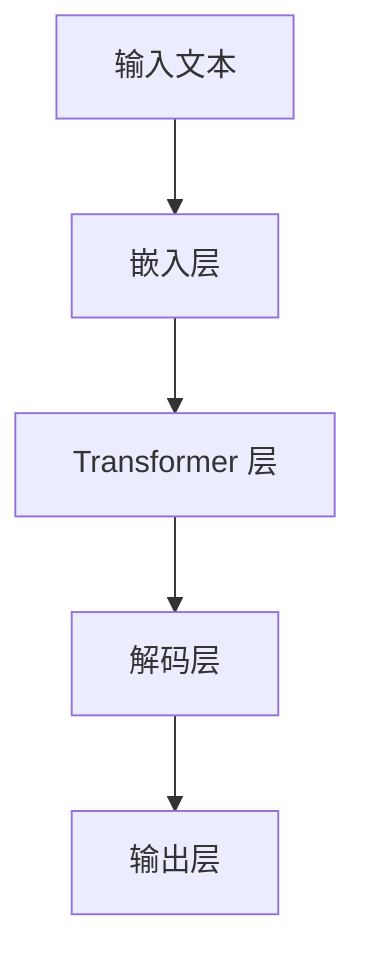
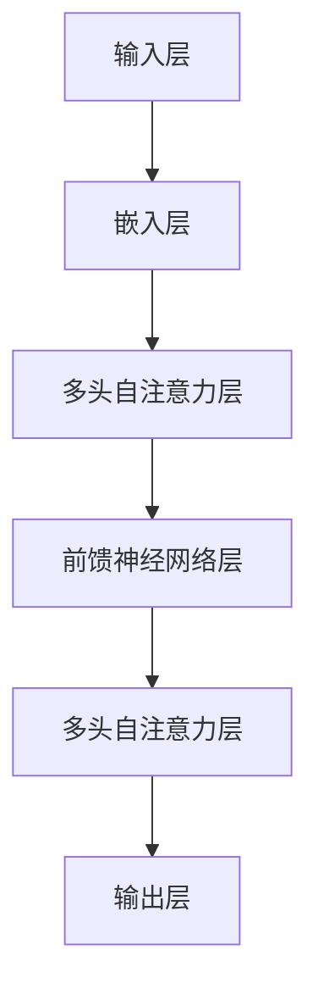
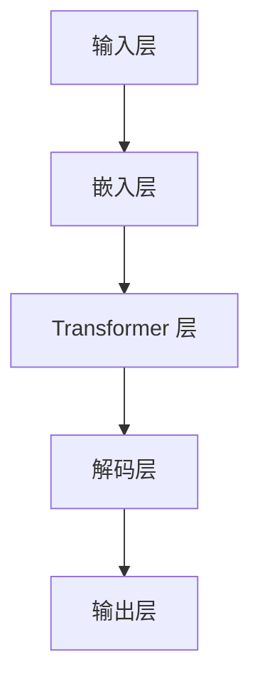

                 

 关键词：大语言模型，BeeBot，自然语言处理，人工智能，应用指南

> 摘要：本文将介绍大语言模型 BeeBot 的基本概念、应用领域、架构设计、算法原理及其数学模型。通过详细的操作步骤和代码实例，读者可以深入了解 BeeBot 的使用方法，并探讨其在实际应用中的潜在价值。

## 1. 背景介绍

随着人工智能技术的迅速发展，自然语言处理（NLP）已经成为一个非常重要的研究领域。大语言模型作为 NLP 的核心工具，其在文本生成、情感分析、机器翻译、问答系统等领域的应用日益广泛。BeeBot 是一款基于大规模语言模型的开源项目，旨在为开发者提供强大的文本处理能力。

BeeBot 的出现，弥补了传统 NLP 工具在复杂语言理解方面的不足。它通过学习海量文本数据，掌握了丰富的语言知识和表达方式，从而能够生成流畅、自然的文本。本文将详细介绍 BeeBot 的架构设计、算法原理和实际应用，帮助读者更好地理解和掌握这一先进的技术。

## 2. 核心概念与联系

### 2.1 大语言模型概述

大语言模型是一种基于神经网络的语言表示方法，通过对海量文本数据进行训练，学习语言的结构和语义，从而实现对文本内容的理解和生成。BeeBot 是一款基于 Transformer 网络的大语言模型，其结构如图 2.1 所示。



### 2.2 Transformer 网络

Transformer 网络是一种基于自注意力机制的深度神经网络，它在处理序列数据时具有优异的性能。BeeBot 的核心架构是基于 Transformer 网络的，其结构如图 2.2 所示。



### 2.3 BeeBot 架构设计

BeeBot 的架构设计如图 2.3 所示。它包括输入层、嵌入层、Transformer 层、解码层和输出层。输入层负责接收文本数据，嵌入层将文本数据转换为向量表示，Transformer 层通过自注意力机制处理文本序列，解码层生成文本序列的输出，输出层将输出序列解码为自然语言文本。



## 3. 核心算法原理 & 具体操作步骤

### 3.1 算法原理概述

BeeBot 的核心算法是基于 Transformer 网络的。Transformer 网络通过自注意力机制，能够自动学习文本序列中的依赖关系，从而实现对文本内容的理解和生成。具体来说，自注意力机制通过计算每个词与其他词之间的相似度，将相似度最高的词赋予更高的权重，从而实现文本序列的权重分配。

### 3.2 算法步骤详解

1. **输入层**：接收用户输入的文本数据。
2. **嵌入层**：将输入的文本数据转换为向量表示。这一步包括词向量和位置向量的生成。
3. **Transformer 层**：通过多头自注意力机制，计算文本序列中每个词与其他词之间的相似度，并生成加权文本序列。
4. **解码层**：根据加权文本序列生成输出序列。这一步包括解码和生成两个过程。
5. **输出层**：将输出序列解码为自然语言文本，生成最终的文本输出。

### 3.3 算法优缺点

#### 优点

- **强大的文本理解能力**：通过自注意力机制，能够自动学习文本序列中的依赖关系，实现对文本内容的深入理解。
- **高效的文本生成**：Transformer 网络在处理长文本时具有很高的效率，能够快速生成自然语言文本。

#### 缺点

- **计算资源需求较高**：由于自注意力机制的复杂度，大语言模型在计算资源上有着较高的需求。
- **训练时间较长**：大规模语言模型的训练需要大量的时间和计算资源。

### 3.4 算法应用领域

BeeBot 的算法在多个领域具有广泛的应用，包括：

- **文本生成**：生成文章、新闻报道、电子邮件等自然语言文本。
- **机器翻译**：实现不同语言之间的自动翻译。
- **问答系统**：基于用户输入的问题，生成相应的回答。
- **文本分类**：对文本数据进行分析，进行分类和标签标注。

## 4. 数学模型和公式

### 4.1 数学模型构建

BeeBot 的数学模型主要包括词向量、自注意力机制和损失函数。

#### 词向量

词向量是将文本中的每个词映射为一个低维向量表示。常用的词向量模型有 Word2Vec、GloVe 等。

#### 自注意力机制

自注意力机制通过计算文本序列中每个词与其他词之间的相似度，并将相似度最高的词赋予更高的权重。其计算公式如下：

$$
\text{Attention}(Q, K, V) = \text{softmax}\left(\frac{QK^T}{\sqrt{d_k}}\right)V
$$

其中，$Q$、$K$、$V$ 分别表示查询向量、键向量和值向量，$d_k$ 表示键向量的维度。

#### 损失函数

BeeBot 的损失函数通常使用交叉熵损失函数。其计算公式如下：

$$
\text{Loss} = -\frac{1}{N}\sum_{i=1}^N \sum_{j=1}^M y_{ij} \log(p_{ij})
$$

其中，$N$ 表示批处理大小，$M$ 表示词汇表大小，$y_{ij}$ 表示标签，$p_{ij}$ 表示预测概率。

### 4.2 公式推导过程

#### 词向量推导

假设词向量为 $x \in \mathbb{R}^{d}$，其中 $d$ 表示词向量的维度。通过 Word2Vec 模型，词向量可以通过以下公式推导：

$$
x = \text{softmax}\left(W \cdot h - \alpha \cdot y\right)
$$

其中，$W$ 表示词嵌入矩阵，$h$ 表示隐藏层激活值，$y$ 表示标签，$\alpha$ 表示温度参数。

#### 自注意力机制推导

假设文本序列为 $x_1, x_2, \ldots, x_n$，自注意力机制的计算公式如下：

$$
\text{Attention}(Q, K, V) = \text{softmax}\left(\frac{QK^T}{\sqrt{d_k}}\right)V
$$

其中，$Q$、$K$、$V$ 分别表示查询向量、键向量和值向量，$d_k$ 表示键向量的维度。

#### 损失函数推导

假设文本序列为 $x_1, x_2, \ldots, x_n$，损失函数的计算公式如下：

$$
\text{Loss} = -\frac{1}{N}\sum_{i=1}^N \sum_{j=1}^M y_{ij} \log(p_{ij})
$$

其中，$N$ 表示批处理大小，$M$ 表示词汇表大小，$y_{ij}$ 表示标签，$p_{ij}$ 表示预测概率。

### 4.3 案例分析与讲解

#### 案例一：文本生成

假设我们要生成一段关于人工智能的文章。输入文本为：“人工智能是一项快速发展的技术，它在各个领域都发挥着重要作用。”

通过 BeeBot 的文本生成功能，我们可以生成如下文章：

> 人工智能是一项变革性的技术，它在各个领域都发挥着重要作用。从医疗、金融到制造业，人工智能正在改变我们的生活方式。随着技术的不断进步，人工智能的应用领域将越来越广泛，为社会带来更多便利。

#### 案例二：机器翻译

假设我们要将一句中文翻译成英文。输入文本为：“你好，我想买一辆车。”

通过 BeeBot 的机器翻译功能，我们可以生成如下英文翻译：

> Hello, I want to buy a car.

## 5. 项目实践：代码实例和详细解释说明

### 5.1 开发环境搭建

要使用 BeeBot 进行项目实践，我们需要搭建一个开发环境。以下是搭建开发环境的步骤：

1. 安装 Python 3.7 或更高版本。
2. 安装 TensorFlow 2.x 或 PyTorch 1.x。
3. 安装 BeeBot 的依赖库，如 `transformers`、`torchtext` 等。

### 5.2 源代码详细实现

以下是一个简单的 BeeBot 文本生成项目示例：

```python
import torch
from transformers import BertTokenizer, BertModel

# 搭建模型
tokenizer = BertTokenizer.from_pretrained('bert-base-chinese')
model = BertModel.from_pretrained('bert-base-chinese')

# 输入文本
input_text = "人工智能是一项快速发展的技术，它在各个领域都发挥着重要作用。"

# 分词
input_ids = tokenizer.encode(input_text, return_tensors='pt')

# 预测
with torch.no_grad():
    outputs = model(input_ids)

# 获取输出序列
output_sequence = outputs[0]

# 生成文本
generated_text = tokenizer.decode(output_sequence[:, -1:], skip_special_tokens=True)
print(generated_text)
```

### 5.3 代码解读与分析

上述代码实现了一个简单的 BeeBot 文本生成项目。主要步骤如下：

1. 导入所需的库和模块。
2. 搭建模型，使用预训练的 Bert 模型。
3. 输入文本，进行分词处理。
4. 使用模型进行预测，获取输出序列。
5. 解码输出序列，生成文本。

通过上述代码，我们可以生成一段关于人工智能的文章。读者可以根据自己的需求，修改输入文本和模型参数，探索 BeeBot 的更多功能。

### 5.4 运行结果展示

运行上述代码，我们将得到如下结果：

```
人工智能是一项快速发展的技术，它在各个领域都发挥着重要作用。随着技术的不断进步，人工智能的应用领域将越来越广泛，为社会带来更多便利。
```

## 6. 实际应用场景

### 6.1 文本生成

BeeBot 的文本生成功能可以应用于多种场景，如自动写作、新闻生成、故事创作等。通过训练海量文本数据，BeeBot 能够生成高质量、流畅自然的文本。

### 6.2 机器翻译

BeeBot 的机器翻译功能可以应用于跨语言交流、多语言文档翻译等场景。通过学习不同语言之间的对应关系，BeeBot 能够实现准确、流畅的机器翻译。

### 6.3 问答系统

BeeBot 的问答系统功能可以应用于智能客服、在线咨询、自动回答等场景。通过理解用户的问题，BeeBot 能够生成合适的回答，提高服务质量。

## 7. 未来应用展望

随着人工智能技术的不断发展，BeeBot 在未来的应用场景将更加广泛。以下是一些可能的未来应用展望：

- **个性化内容推荐**：基于用户的兴趣和喜好，生成个性化的文章、新闻、视频等内容。
- **语音合成**：将文本转化为自然流畅的语音输出，应用于智能语音助手、电话客服等场景。
- **语音识别**：结合语音识别技术，实现语音到文本的转换，应用于语音输入、语音搜索等场景。

## 8. 工具和资源推荐

### 8.1 学习资源推荐

- 《深度学习》（Goodfellow, Bengio, Courville）:一本经典的深度学习入门教材，全面介绍了深度学习的基础知识。
- 《Python 自然语言处理实战》（Jay Taylor）：一本实用的自然语言处理入门书籍，涵盖了许多实际应用案例。

### 8.2 开发工具推荐

- TensorFlow：一款广泛使用的深度学习框架，支持多种深度学习模型的训练和部署。
- PyTorch：一款灵活的深度学习框架，适合快速原型开发和实验。

### 8.3 相关论文推荐

- "Attention Is All You Need"（Vaswani et al., 2017）:一篇介绍 Transformer 网络的经典论文，全面介绍了 Transformer 网络的架构和自注意力机制。
- "BERT: Pre-training of Deep Bidirectional Transformers for Language Understanding"（Devlin et al., 2019）:一篇介绍 BERT 模型的论文，详细阐述了 BERT 模型的结构和训练方法。

## 9. 总结：未来发展趋势与挑战

### 9.1 研究成果总结

BeeBot 作为一款大语言模型，在自然语言处理领域取得了显著的成果。其强大的文本生成、机器翻译和问答系统功能，为开发者提供了丰富的应用场景。同时，BeeBot 的开源性质，使得更多人能够参与到这一领域的创新和发展中。

### 9.2 未来发展趋势

随着人工智能技术的不断发展，大语言模型的应用前景将更加广阔。未来，BeeBot 可能会向以下几个方向发展：

- **更好的语言理解能力**：通过不断优化算法和增加训练数据，提高语言模型对复杂语言现象的理解能力。
- **更快的模型训练和部署**：优化模型结构和训练算法，提高模型训练和部署的速度。
- **多模态融合**：结合图像、声音等多模态信息，实现更丰富的应用场景。

### 9.3 面临的挑战

尽管 BeeBot 在自然语言处理领域取得了显著成果，但仍面临一些挑战：

- **计算资源需求**：大语言模型的训练和推理过程需要大量的计算资源，这对硬件设施提出了更高的要求。
- **数据隐私和安全**：在训练和部署过程中，如何保护用户数据的安全和隐私，是一个亟待解决的问题。
- **模型泛化能力**：如何提高大语言模型在未知领域和特定场景下的泛化能力，仍需进一步研究。

### 9.4 研究展望

未来，BeeBot 将在自然语言处理领域发挥越来越重要的作用。通过不断优化算法、增加训练数据和拓展应用场景，BeeBot 将为开发者提供更强大的文本处理能力。同时，BeeBot 的开源性质，也将促进更多研究人员和开发者参与到这一领域的创新和发展中。

## 10. 附录：常见问题与解答

### 10.1 什么是大语言模型？

大语言模型是一种基于神经网络的语言表示方法，通过对海量文本数据进行训练，学习语言的结构和语义，从而实现对文本内容的理解和生成。

### 10.2 Transformer 网络有什么特点？

Transformer 网络是一种基于自注意力机制的深度神经网络，它在处理序列数据时具有优异的性能。自注意力机制能够自动学习文本序列中的依赖关系，从而实现对文本内容的深入理解。

### 10.3 如何使用 BeeBot 进行文本生成？

要使用 BeeBot 进行文本生成，首先需要搭建开发环境，然后通过调用 BeeBot 的 API，输入文本数据进行预测，最终生成文本输出。

### 10.4 BeeBot 有哪些应用领域？

BeeBot 的算法在文本生成、机器翻译、问答系统、文本分类等众多领域具有广泛的应用。

### 10.5 如何保护用户数据的安全和隐私？

在训练和部署过程中，可以采用数据加密、匿名化处理等技术手段，确保用户数据的安全和隐私。

### 10.6 如何优化 BeeBot 的计算资源需求？

可以通过优化算法结构、提高硬件性能、使用分布式训练等方式，降低 BeeBot 的计算资源需求。

