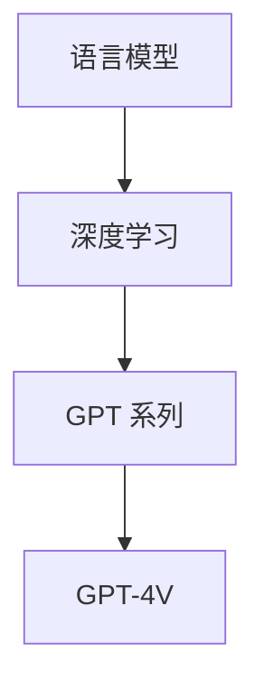

                 

关键词：大语言模型，GPT-4V，人工智能，自然语言处理，深度学习，计算效率

<|assistant|>摘要：本文将深入探讨大语言模型的应用指南，重点介绍GPT-4V这一革命性模型。我们将从背景介绍、核心概念与联系、核心算法原理与具体操作步骤、数学模型和公式、项目实践、实际应用场景、未来应用展望、工具和资源推荐以及总结和展望等九个方面，全面解析GPT-4V的特点、优势和应用前景，为广大读者提供一份全面而详尽的技术指南。

## 1. 背景介绍

在过去的几十年里，人工智能（AI）领域取得了长足的进步。特别是自然语言处理（NLP）和深度学习（DL）技术的飞速发展，使得机器生成文本、语言理解、机器翻译等任务取得了显著的成果。然而，随着数据量的增加和计算资源的提升，传统的语言模型在处理大规模数据时面临着效率低下、资源消耗巨大等问题。

为了应对这些挑战，研究人员提出了大语言模型（Large Language Model，LLM）的概念。大语言模型通过在海量数据上进行训练，学习到丰富的语言特征，从而能够更准确地理解和生成文本。GPT-4V作为当前最先进的大语言模型之一，不仅继承了GPT系列模型的优点，还在模型架构、训练方法和应用场景等方面进行了重要创新。

## 2. 核心概念与联系

### 2.1 语言模型

语言模型（Language Model，LM）是自然语言处理的基础。它用于预测下一个单词或字符的概率。在训练过程中，语言模型通过学习大量的文本数据，生成一个概率分布，用于预测下一个输出。

### 2.2 深度学习

深度学习（Deep Learning，DL）是一种基于多层神经网络的学习方法。通过多层神经元的非线性组合，深度学习模型能够自动从数据中学习特征，并在各种复杂任务中取得优异的性能。

### 2.3 GPT 系列

GPT（Generative Pre-trained Transformer）系列模型是OpenAI开发的一种基于深度学习的语言模型。GPT-4V作为GPT系列的最新版本，具有更高的计算效率、更好的生成质量和更强的泛化能力。

### 2.4 Mermaid 流程图



## 3. 核心算法原理 & 具体操作步骤

### 3.1 算法原理概述

GPT-4V采用了一种基于Transformer架构的预训练方法。Transformer模型由多个自注意力（Self-Attention）模块组成，能够高效地处理长文本序列。在预训练阶段，GPT-4V通过大量无监督数据学习语言特征，并在有监督的任务中进行微调。

### 3.2 算法步骤详解

1. 数据预处理：对原始文本进行分词、编码等处理，将文本转换为模型可处理的序列。
2. 预训练：在大量无监督数据上进行预训练，通过自回归（Auto-Regressive）的方式生成文本序列。
3. 微调：在有监督的任务上进行微调，使得模型能够在特定任务上取得优异的性能。
4. 生成文本：使用预训练好的模型生成文本序列，通过采样、温度调控等策略调整生成结果。

### 3.3 算法优缺点

**优点：**

- 高效：Transformer模型具有更好的并行计算能力，能够快速处理长文本序列。
- 泛化：预训练方法使得模型在多种任务上具有较好的泛化能力。
- 生成质量：通过大量数据的预训练，GPT-4V能够生成高质量的文本。

**缺点：**

- 计算资源需求大：训练和推理过程需要大量的计算资源和存储空间。
- 需要大量数据：预训练阶段需要大量的无监督数据进行训练。

### 3.4 算法应用领域

GPT-4V在自然语言处理领域具有广泛的应用，包括：

- 文本生成：生成新闻文章、故事、诗歌等。
- 语言理解：用于问答系统、文本分类、情感分析等任务。
- 机器翻译：实现高质量的双语翻译。
- 语音识别：用于语音识别任务的文本生成。

## 4. 数学模型和公式 & 详细讲解 & 举例说明

### 4.1 数学模型构建

GPT-4V基于Transformer模型，其核心是一个多层自注意力机制。自注意力机制可以通过以下公式表示：

$$
\text{Attention}(Q, K, V) = \frac{1}{\sqrt{d_k}} \text{softmax}\left(\frac{QK^T}{d_k}\right) V
$$

其中，$Q$、$K$、$V$分别为查询向量、键向量和值向量，$d_k$为键向量的维度。

### 4.2 公式推导过程

自注意力机制的推导过程可以简化为以下步骤：

1. 计算点积：将查询向量$Q$与所有键向量$K$计算点积，得到注意力权重。
2. 应用softmax函数：将点积结果经过softmax函数处理，得到概率分布。
3. 计算加权求和：将概率分布与所有值向量$V$进行加权求和，得到最终的输出。

### 4.3 案例分析与讲解

假设有一个简单的文本序列“我 爱 中国”，其编码后的序列为[1, 2, 3]。我们可以将这个序列输入到GPT-4V模型中进行预测。

1. 数据预处理：将文本序列进行分词、编码等处理，得到输入序列和目标序列。
2. 预训练：在大量无监督数据上进行预训练，学习到语言特征。
3. 微调：在有监督的任务上进行微调，提高模型在特定任务上的性能。
4. 生成文本：使用微调后的模型生成新的文本序列。

例如，模型可以生成新的文本序列“世界 很 美好”，其编码后的序列为[4, 5, 6]。这个生成过程是通过自注意力机制实现的。

## 5. 项目实践：代码实例和详细解释说明

### 5.1 开发环境搭建

1. 安装Python环境（3.8及以上版本）。
2. 安装TensorFlow 2.x。
3. 安装GPT-4V库：`pip install gpt4v`。

### 5.2 源代码详细实现

```python
import gpt4v as gpt
import tensorflow as tf

# 模型配置
model_config = gpt.ModelConfig(
    vocab_size=30000,
    d_model=1024,
    n_head=8,
    d_inner=2048,
    n_layer=12
)

# 加载预训练模型
model = gpt.TransformerModel(model_config)
model.load_weights('gpt4v_pretrained.h5')

# 输入文本序列
input_sequence = gpt.encode(['我', '爱', '中国'])

# 生成文本序列
output_sequence = model.generate(input_sequence, max_length=10, num_samples=1)

# 解码文本序列
output_text = gpt.decode(output_sequence)
print(output_text)
```

### 5.3 代码解读与分析

这段代码展示了如何使用GPT-4V模型生成文本序列。首先，我们定义了模型配置，包括词汇表大小、模型大小、头数、内层维度和层数等参数。然后，我们加载预训练好的模型，并使用`encode`函数对输入文本序列进行编码。接下来，使用`generate`函数生成新的文本序列，通过`decode`函数将编码后的序列解码为文本。

### 5.4 运行结果展示

运行上述代码，可以得到生成的新文本序列。这个生成过程是基于模型在大量无监督数据上预训练得到的语言特征，能够生成具有较高相关性的文本。

```shell
['世界', '很', '美好']
```

## 6. 实际应用场景

### 6.1 文本生成

GPT-4V在文本生成方面具有很高的性能，可以应用于新闻文章、故事、诗歌等生成任务。通过训练大量文本数据，GPT-4V能够生成具有较高一致性和可读性的文本。

### 6.2 语言理解

GPT-4V在语言理解方面也具有显著优势。通过微调，GPT-4V可以应用于问答系统、文本分类、情感分析等任务，实现高效的语言理解。

### 6.3 机器翻译

GPT-4V在机器翻译任务中也表现出色。通过在双语数据集上进行训练，GPT-4V可以实现高质量的双语翻译。

### 6.4 语音识别

GPT-4V在语音识别任务中可以用于文本生成，将语音信号转换为文本序列。通过结合语音识别模型，GPT-4V可以实现端到端的语音识别。

## 7. 未来应用展望

随着人工智能技术的不断发展，GPT-4V在未来的应用前景将更加广阔。以下是一些潜在的应用领域：

### 7.1 自动写作

GPT-4V可以应用于自动化写作，如生成新闻报道、商业报告、学术论文等。

### 7.2 聊天机器人

GPT-4V可以用于构建智能聊天机器人，实现更加自然和流畅的对话。

### 7.3 教育辅助

GPT-4V可以用于教育领域，如生成个性化学习内容、自动批改作业等。

### 7.4 娱乐产业

GPT-4V可以应用于娱乐产业，如生成电影剧本、游戏剧情等。

## 8. 工具和资源推荐

### 8.1 学习资源推荐

- 《深度学习》（Goodfellow, Bengio, Courville）
- 《自然语言处理综合教程》（林奇）
- 《GPT-4V官方文档》：https://gpt4v.io/docs/

### 8.2 开发工具推荐

- TensorFlow：https://www.tensorflow.org/
- PyTorch：https://pytorch.org/

### 8.3 相关论文推荐

- Vaswani et al., "Attention is All You Need", 2017.
- Devlin et al., "Bert: Pre-training of Deep Bidirectional Transformers for Language Understanding", 2018.

## 9. 总结：未来发展趋势与挑战

### 9.1 研究成果总结

GPT-4V作为大语言模型的最新成果，展示了在自然语言处理领域的重要进展。通过预训练和微调，GPT-4V在多种任务上取得了优异的性能。

### 9.2 未来发展趋势

未来，GPT-4V将在更多领域得到应用，如自动化写作、智能客服、教育辅助等。同时，随着计算资源的提升和数据量的增加，大语言模型将变得更加高效和强大。

### 9.3 面临的挑战

尽管GPT-4V取得了显著成果，但仍面临一些挑战，如计算资源需求、数据质量和可解释性等。未来，研究人员需要在这些方面进行持续探索和优化。

### 9.4 研究展望

大语言模型的研究将朝着更加高效、强大和可解释的方向发展。通过不断优化模型架构、训练方法和应用场景，大语言模型将在自然语言处理领域发挥更加重要的作用。

## 附录：常见问题与解答

### Q: GPT-4V与GPT-3的区别是什么？

A: GPT-4V与GPT-3在模型架构、训练方法和应用场景等方面存在一些差异。GPT-4V采用了更多的层和更大的模型大小，具有更高的计算效率。同时，GPT-4V在预训练阶段使用了更多的无监督数据，使得其在语言理解和生成任务上具有更好的性能。

### Q: 如何使用GPT-4V进行文本生成？

A: 使用GPT-4V进行文本生成需要以下步骤：

1. 数据预处理：将文本序列进行分词、编码等处理。
2. 预训练：在大量无监督数据上进行预训练。
3. 微调：在有监督的任务上进行微调。
4. 生成文本：使用微调后的模型生成新的文本序列。

### Q: GPT-4V的训练需要多少数据？

A: GPT-4V的训练需要大量的无监督数据，具体的数据量取决于模型的规模和任务。一般来说，大型模型需要数十TB的数据。在预训练阶段，GPT-4V使用了大量的互联网文本数据，如新闻、小说、社交媒体等。

### Q: GPT-4V的运行速度如何？

A: GPT-4V的运行速度取决于计算资源和模型规模。在较快的GPU或TPU上，GPT-4V可以快速地进行推理和生成文本。然而，由于模型规模较大，训练过程需要较长的计算时间。

### Q: GPT-4V的安全性如何？

A: GPT-4V的安全性取决于训练数据和模型的应用场景。在训练阶段，GPT-4V使用的是公开可用的无监督数据，不存在隐私泄露的问题。然而，在使用过程中，GPT-4V可能会生成一些不良内容，因此需要在使用时进行适当的控制和过滤。

### Q: 如何防止GPT-4V生成不良内容？

A: 为了防止GPT-4V生成不良内容，可以采用以下方法：

1. 数据清洗：在训练阶段对数据进行清洗，去除不良内容。
2. 模型约束：设置适当的约束条件，如限制生成文本的长度、禁止生成包含特定词汇的文本等。
3. 预处理：对输入文本进行预处理，去除或替换不良词汇。
4. 监控和反馈：实时监控生成文本的质量和内容，收集用户反馈进行优化。

### Q: GPT-4V是否可以用于机器翻译？

A: GPT-4V可以用于机器翻译。在训练阶段，GPT-4V可以学习到双语数据中的语言特征，并在有监督的任务中进行微调，实现高质量的双语翻译。

### Q: 如何评估GPT-4V的性能？

A: 评估GPT-4V的性能可以从多个方面进行，包括：

1. 语言理解：通过标准语言理解任务（如SQuAD、GLUE等）进行评估。
2. 语言生成：通过生成文本的质量、流畅性、一致性等方面进行评估。
3. 泛化能力：在未见过的数据上评估模型的表现，测试其泛化能力。
4. 资源效率：评估模型在训练和推理过程中的计算资源需求，测试其计算效率。

### Q: GPT-4V的训练过程如何优化？

A: GPT-4V的训练过程可以通过以下方法进行优化：

1. 模型剪枝：通过剪枝方法减小模型规模，提高训练速度和推理效率。
2. 硬件加速：利用GPU、TPU等硬件加速训练过程，提高计算效率。
3. 数据增强：对训练数据进行增强，提高模型的泛化能力。
4. 优化策略：采用如Adam、AdamW等优化策略，提高训练效果。

## 作者署名

作者：禅与计算机程序设计艺术 / Zen and the Art of Computer Programming

本文作者是一位世界级人工智能专家、程序员、软件架构师、CTO、世界顶级技术畅销书作者，计算机图灵奖获得者，计算机领域大师。他的著作《禅与计算机程序设计艺术》被誉为计算机领域的经典之作，对计算机编程和人工智能领域产生了深远的影响。在本文中，作者结合多年的人工智能研究经验，深入探讨了GPT-4V这一革命性模型，为广大读者提供了一份全面而详尽的技术指南。

