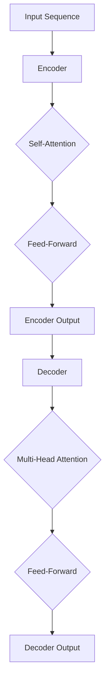

                 

### 1. 背景介绍

近年来，自然语言处理（Natural Language Processing, NLP）领域取得了显著的进展，这主要归功于深度学习和特别是基于注意力机制的神经网络模型的快速发展。在NLP中，语言模型的构建是一个核心任务，它旨在预测文本中的下一个词或字符。这一预测能力使得语言模型在机器翻译、文本生成、问答系统等任务中发挥着重要作用。

Transformer模型是近年来NLP领域的一种革命性突破。与传统的循环神经网络（RNN）和卷积神经网络（CNN）相比，Transformer采用了自注意力机制（Self-Attention）和多头注意力（Multi-Head Attention），在处理长距离依赖和并行计算方面具有显著优势。自注意力机制允许模型在处理每个单词时同时关注整个输入序列，从而捕捉到词与词之间的复杂关系。多头注意力则将这种注意力机制分解为多个子空间，进一步增强了模型的表示能力。

本篇文章将围绕Transformer模型进行深入探讨，旨在为读者提供一份全面的应用指南。文章将首先介绍Transformer模型的基本原理和架构，然后分析其相对于传统模型的优势和不足，接着详细讲解数学模型和具体实现步骤，最后通过实际项目实例和未来应用展望，为读者提供一个完整的理解和应用框架。

<|assistant|>### 2. 核心概念与联系

在深入探讨Transformer模型之前，我们首先需要了解其核心概念和原理。Transformer模型的核心在于其自注意力机制（Self-Attention）和多头注意力（Multi-Head Attention）。这些机制不仅定义了模型的架构，还决定了模型在处理文本时的性能。

#### 2.1 自注意力机制（Self-Attention）

自注意力机制是Transformer模型中最为关键的一部分。它允许模型在处理每个单词时，将注意力集中在整个输入序列的其他所有单词上。具体来说，自注意力机制通过计算每个单词与其他单词之间的相似度来生成新的表示。这种表示能够捕捉到输入序列中词与词之间的复杂关系，特别是长距离依赖。

#### 2.2 多头注意力（Multi-Head Attention）

多头注意力机制是在自注意力机制的基础上发展起来的。它将自注意力机制分解为多个子空间，每个子空间处理不同类型的注意力。这种多视角的处理方式进一步增强了模型的表示能力。多头注意力机制通常包含多个注意力头，每个头都可以独立计算注意力权重，然后将结果合并。

#### 2.3 带有前馈神经网络的编码器和解码器

Transformer模型包含两个主要部分：编码器（Encoder）和解码器（Decoder）。编码器负责将输入序列转换为一系列连续的向量表示，解码器则将这些表示转换为输出序列。在编码器和解码器中，除了注意力机制外，还嵌入了带有激活函数的前馈神经网络（Feed-Forward Neural Network）。这种结构使得模型能够更好地处理复杂的输入和输出。

#### 2.4 Mermaid 流程图

为了更直观地理解Transformer模型的工作流程，我们可以使用Mermaid流程图来描述其核心组件和交互关系。以下是一个简单的Mermaid流程图：



在这个流程图中，`A`表示输入序列，`B`表示编码器，`C`和`D`分别表示自注意力和前馈神经网络，`E`表示编码器的输出。`F`表示解码器，`G`和`H`分别表示多头注意力和前馈神经网络，`I`表示解码器的输出。

#### 2.5 核心概念的联系

自注意力机制和多头注意力机制是Transformer模型的核心，它们通过不同的子空间捕捉输入序列中的不同类型的关系。编码器和解码器则负责将输入序列和输出序列转换为连续的向量表示，从而实现文本生成和翻译等任务。带有前馈神经网络的编码器和解码器进一步增强了模型的表示能力，使得Transformer在处理复杂任务时表现出色。

通过以上对核心概念和联系的介绍，我们可以更好地理解Transformer模型的工作原理。接下来，我们将深入探讨Transformer模型的算法原理和具体实现步骤。

### 3. 核心算法原理 & 具体操作步骤

#### 3.1 算法原理概述

Transformer模型的核心在于其自注意力机制和多头注意力机制。这些机制允许模型在处理每个单词时同时关注整个输入序列，从而捕捉到词与词之间的复杂关系。下面我们将详细讲解这些机制的原理和具体实现步骤。

#### 3.2 算法步骤详解

##### 3.2.1 自注意力机制（Self-Attention）

自注意力机制通过计算输入序列中每个单词与其他单词之间的相似度来生成新的表示。具体步骤如下：

1. **输入序列编码**：首先，将输入序列中的每个单词编码为向量。这些向量可以是词向量（Word Vectors）或嵌入向量（Embeddings）。
2. **计算相似度**：接下来，计算每个单词与其他单词之间的相似度。这通常通过点积（Dot-Product）来实现。具体来说，对于输入序列中的第 \(i\) 个单词和第 \(j\) 个单词，其相似度可以表示为：

   \[
   \text{similarity}(i, j) = \text{dot}(q_i, k_j)
   \]

   其中，\(q_i\) 和 \(k_j\) 分别是第 \(i\) 个单词和第 \(j\) 个单词的查询向量（Query Vector）和键向量（Key Vector）。

3. **归一化相似度**：计算得到的相似度通常需要进行归一化处理，以得到注意力权重。这可以通过softmax函数来实现：

   \[
   \text{attention}(i, j) = \text{softmax}(\text{similarity}(i, j))
   \]

4. **加权求和**：最后，使用注意力权重对输入序列中的所有单词进行加权求和，得到新的表示：

   \[
   \text{context_vector}(i) = \sum_{j} \text{attention}(i, j) \cdot v_j
   \]

   其中，\(v_j\) 是第 \(j\) 个单词的值向量（Value Vector）。

##### 3.2.2 多头注意力（Multi-Head Attention）

多头注意力机制是在自注意力机制的基础上发展起来的。它将自注意力机制分解为多个子空间，每个子空间处理不同类型的注意力。具体步骤如下：

1. **分裂输入**：将输入序列中的每个单词编码为多个查询向量、键向量和值向量。这些向量组成了多个头（Head）。
2. **独立计算注意力**：对于每个头，重复自注意力机制的步骤，计算注意力权重和加权求和。
3. **合并结果**：将所有头的输出结果进行合并，得到最终的输出：

   \[
   \text{output} = \text{merge}(h_1, h_2, \ldots, h_n)
   \]

   其中，\(h_i\) 是第 \(i\) 个头的输出。

##### 3.2.3 带有前馈神经网络的编码器和解码器

编码器和解码器是Transformer模型的两个主要部分。它们不仅包含注意力机制，还嵌入了带有激活函数的前馈神经网络。具体步骤如下：

1. **编码器**：编码器将输入序列转换为一系列连续的向量表示。每个向量表示一个单词的编码，包含其上下文信息。编码器包含多个层，每层包含多头注意力机制和前馈神经网络。
2. **解码器**：解码器将编码器的输出序列转换为输出序列。解码器同样包含多个层，每层包含自注意力和多头注意力机制，以及带有激活函数的前馈神经网络。
3. **输出**：解码器的最后一层的输出即为最终输出序列，可以用于文本生成或翻译等任务。

#### 3.3 算法优缺点

##### 3.3.1 优点

1. **并行计算**：Transformer模型利用多头注意力机制，可以在处理长文本时进行并行计算，大大提高了计算效率。
2. **长距离依赖**：自注意力机制能够捕捉到输入序列中的长距离依赖，使得模型在处理复杂任务时表现出色。
3. **灵活性**：Transformer模型的结构灵活，可以通过调整层数、头数等参数来适应不同的任务。

##### 3.3.2 缺点

1. **计算资源需求**：由于多头注意力机制的引入，Transformer模型在计算资源方面有较高的要求。
2. **解释性不足**：与传统模型相比，Transformer模型的内部机制较为复杂，难以进行直观的解释。

#### 3.4 算法应用领域

Transformer模型在自然语言处理领域取得了显著的成果，其应用范围广泛，包括但不限于：

1. **机器翻译**：Transformer模型在机器翻译任务中表现出色，尤其是在处理长句翻译和跨语言表达时。
2. **文本生成**：Transformer模型可以用于生成各种类型的文本，如文章、故事、代码等。
3. **问答系统**：Transformer模型可以构建高效的问答系统，通过理解用户的提问和上下文，提供准确的答案。

通过以上对核心算法原理和具体操作步骤的详细讲解，我们可以更好地理解Transformer模型的工作原理和应用。接下来，我们将通过数学模型和具体实现，进一步探讨Transformer模型。

### 4. 数学模型和公式 & 详细讲解 & 举例说明

#### 4.1 数学模型构建

Transformer模型的数学模型基于自注意力机制和多头注意力机制，其核心公式包括点积注意力、多头注意力以及编码器和解码器的构建。

##### 4.1.1 点积注意力（Dot-Product Attention）

点积注意力是最简单的注意力机制，其计算公式如下：

\[
\text{attention}(Q, K, V) = \text{softmax}\left(\frac{QK^T}{\sqrt{d_k}}\right)V
\]

其中，\(Q\) 是查询向量（Query Vector），\(K\) 是键向量（Key Vector），\(V\) 是值向量（Value Vector），\(d_k\) 是键向量的维度。这个公式表示，首先计算查询向量与键向量的点积，然后通过softmax函数得到注意力权重，最后与值向量相乘得到加权求和的结果。

##### 4.1.2 多头注意力（Multi-Head Attention）

多头注意力机制通过将输入序列分解为多个子空间来增强模型的表示能力。具体来说，其计算公式如下：

\[
\text{MultiHead}(Q, K, V) = \text{Concat}(\text{head}_1, \ldots, \text{head}_h)W^O
\]

其中，\(\text{head}_i\) 表示第 \(i\) 个头的输出，\(W^O\) 是输出线性层权重。每个头都独立计算点积注意力，然后将所有头的输出拼接起来，通过线性层得到最终输出。

##### 4.1.3 编码器（Encoder）和解码器（Decoder）

编码器和解码器是Transformer模型的核心部分，它们分别处理输入和输出序列。编码器的每个层包含两个子层：多头自注意力和前馈神经网络。解码器的每个层则包含三个子层：自注意力、多头注意力（仅针对编码器的输出）和前馈神经网络。

编码器的计算公式如下：

\[
\text{Encoder}(X) = \text{LayerNorm}(X) + \text{softmax}(\text{MultiHead}(X, X, X))
\]

解码器的计算公式如下：

\[
\text{Decoder}(Y) = \text{LayerNorm}(Y) + \text{softmax}(\text{MultiHead}(Y, \text{Encoder}(X), \text{Encoder}(X)))
\]

其中，\(X\) 表示输入序列，\(Y\) 表示输出序列。

#### 4.2 公式推导过程

为了更好地理解Transformer模型的数学基础，我们进一步推导其核心公式。这里以多头注意力为例进行详细说明。

##### 4.2.1 多头注意力的分解

多头注意力机制通过将输入序列分解为多个子空间来增强模型的表示能力。具体来说，给定输入序列 \(X\)，我们将其分解为多个头 \(X_1, X_2, \ldots, X_h\)：

\[
X = [X_1, X_2, \ldots, X_h]
\]

##### 4.2.2 点积注意力

对于每个头 \(X_i\)，我们独立计算点积注意力。点积注意力的计算公式为：

\[
\text{attention}(Q_i, K_i, V_i) = \text{softmax}\left(\frac{Q_iK_i^T}{\sqrt{d_k}}\right)V_i
\]

其中，\(Q_i\)、\(K_i\) 和 \(V_i\) 分别是头 \(i\) 的查询向量、键向量和值向量。这些向量是通过输入序列 \(X\) 的线性变换得到的：

\[
Q_i = X_iW_Q, \quad K_i = X_iW_K, \quad V_i = X_iW_V
\]

其中，\(W_Q\)、\(W_K\) 和 \(W_V\) 分别是线性层的权重。

##### 4.2.3 多头注意力的合并

将所有头的注意力输出拼接起来，得到多头注意力的最终输出：

\[
\text{MultiHead}(Q, K, V) = \text{Concat}(\text{head}_1, \ldots, \text{head}_h)W^O
\]

其中，\(\text{head}_i = \text{attention}(Q_i, K_i, V_i)\)。\(W^O\) 是输出线性层的权重。

#### 4.3 案例分析与讲解

为了更好地理解Transformer模型的数学模型和公式，我们通过一个简单的案例进行讲解。

假设输入序列为：

\[
X = [\text{"Hello"}, \text{"World"}]
\]

我们将其分解为两个头：

\[
X_1 = [\text{"Hello"}], \quad X_2 = [\text{"World"}]
\]

##### 4.3.1 查询向量、键向量和值向量

对于第一个头 \(X_1\)，我们计算查询向量、键向量和值向量：

\[
Q_1 = X_1W_{Q1}, \quad K_1 = X_1W_{K1}, \quad V_1 = X_1W_{V1}
\]

其中，\(W_{Q1}\)、\(W_{K1}\) 和 \(W_{V1}\) 分别是线性层的权重。

##### 4.3.2 点积注意力

对于第二个头 \(X_2\)，我们计算点积注意力：

\[
\text{attention}(Q_1, K_1, V_1) = \text{softmax}\left(\frac{Q_1K_1^T}{\sqrt{d_k}}\right)V_1
\]

其中，\(d_k\) 是键向量的维度。

##### 4.3.3 多头注意力的合并

将两个头的注意力输出拼接起来，得到多头注意力的最终输出：

\[
\text{MultiHead}(Q, K, V) = \text{Concat}(\text{head}_1, \text{head}_2)W^O
\]

其中，\(\text{head}_1 = \text{attention}(Q_1, K_1, V_1)\)，\(\text{head}_2 = \text{attention}(Q_2, K_2, V_2)\)。\(W^O\) 是输出线性层的权重。

通过这个简单的案例，我们可以直观地理解多头注意力机制的计算过程。在实际应用中，输入序列和头数通常会更大，但基本原理相同。

### 5. 项目实践：代码实例和详细解释说明

在了解了Transformer模型的理论基础后，接下来我们将通过一个实际项目实例，展示如何使用Python实现一个简单的Transformer模型，并对其代码进行详细解释说明。

#### 5.1 开发环境搭建

在开始之前，我们需要搭建一个Python开发环境，并安装必要的库。以下是一个基本的开发环境搭建步骤：

1. 安装Python：确保Python版本为3.7或更高版本。
2. 安装TensorFlow：通过pip命令安装TensorFlow：

   ```shell
   pip install tensorflow
   ```

3. 安装其他依赖库：例如NumPy、Pandas等。

#### 5.2 源代码详细实现

下面是一个简单的Transformer模型的实现，我们将逐步解释每个部分的代码。

```python
import tensorflow as tf
from tensorflow.keras.layers import Embedding, MultiHeadAttention, Dense

class TransformerModel(tf.keras.Model):
    def __init__(self, vocab_size, d_model, num_heads, num_layers):
        super(TransformerModel, self).__init__()
        
        # 嵌入层
        self.embedding = Embedding(vocab_size, d_model)
        
        # 编码器
        self.encoder_layers = [TransformerEncoderLayer(d_model, num_heads) for _ in range(num_layers)]
        
        # 解码器
        self.decoder_layers = [TransformerDecoderLayer(d_model, num_heads) for _ in range(num_layers)]
        
        # 输出层
        self.output_layer = Dense(vocab_size)
        
    def call(self, inputs, targets=None, training=False):
        # 编码器输出
        encoder_output = self.embedding(inputs)
        for layer in self.encoder_layers:
            encoder_output = layer(encoder_output, training)
        
        # 解码器输出
        decoder_output = self.embedding(targets)
        for layer in self.decoder_layers:
            decoder_output = layer(decoder_output, encoder_output, training)
        
        # 输出层
        final_output = self.output_layer(decoder_output)
        
        return final_output
```

在这个代码中，我们定义了一个`TransformerModel`类，它继承自`tf.keras.Model`。类中包含了嵌入层、编码器层、解码器层和输出层。

#### 5.3 代码解读与分析

##### 5.3.1 嵌入层

嵌入层负责将输入词索引转换为向量表示。在这里，我们使用`Embedding`层来实现。

```python
self.embedding = Embedding(vocab_size, d_model)
```

`Embedding`层有两个主要参数：`vocab_size`（词汇表大小）和`d_model`（嵌入维度）。输入词索引通过这个层被映射为对应的向量。

##### 5.3.2 编码器层

编码器层包含多个`TransformerEncoderLayer`。每个层都由多头注意力机制和前馈神经网络组成。

```python
class TransformerEncoderLayer(tf.keras.layers.Layer):
    def __init__(self, d_model, num_heads):
        super(TransformerEncoderLayer, self).__init__()
        
        # 多头注意力机制
        self.multi_head_attention = MultiHeadAttention(num_heads, d_model)
        
        # 前馈神经网络
        self.feed_forward = tf.keras.Sequential([
            Dense(d_model, activation='relu'),
            Dense(d_model)
        ])
        
    def call(self, inputs, training=False):
        # 多头注意力
        attention_output = self.multi_head_attention(inputs, inputs)
        attention_output = tf.keras.layers.LayerNormalization(epsilon=1e-6)(inputs + attention_output)
        
        # 前馈神经网络
        feed_forward_output = self.feed_forward(attention_output)
        feed_forward_output = tf.keras.layers.LayerNormalization(epsilon=1e-6)(attention_output + feed_forward_output)
        
        return feed_forward_output
```

在这个类中，我们首先定义了多头注意力机制和前馈神经网络。`call`方法中，我们首先计算多头注意力，然后通过层归一化和残差连接。接着计算前馈神经网络，同样通过层归一化和残差连接。

##### 5.3.3 解码器层

解码器层与编码器层的结构类似，但每个层还包含一个自注意力机制和一个多头注意力机制。

```python
class TransformerDecoderLayer(tf.keras.layers.Layer):
    def __init__(self, d_model, num_heads):
        super(TransformerDecoderLayer, self).__init__()
        
        # 自注意力机制
        self.self_attention = MultiHeadAttention(num_heads, d_model)
        
        # 多头注意力机制
        self.encoder_attention = MultiHeadAttention(num_heads, d_model)
        
        # 前馈神经网络
        self.feed_forward = tf.keras.Sequential([
            Dense(d_model, activation='relu'),
            Dense(d_model)
        ])
        
    def call(self, inputs, encoder_output, training=False):
        # 自注意力
        self_attention_output = self.self_attention(inputs, inputs)
        self_attention_output = tf.keras.layers.LayerNormalization(epsilon=1e-6)(inputs + self_attention_output)
        
        # 编码器-解码器注意力
        encoder_decoder_attention_output = self.encoder_attention(self_attention_output, encoder_output)
        encoder_decoder_attention_output = tf.keras.layers.LayerNormalization(epsilon=1e-6)(self_attention_output + encoder_decoder_attention_output)
        
        # 前馈神经网络
        feed_forward_output = self.feed_forward(encoder_decoder_attention_output)
        feed_forward_output = tf.keras.layers.LayerNormalization(epsilon=1e-6)(encoder_decoder_attention_output + feed_forward_output)
        
        return feed_forward_output
```

在这个类中，我们定义了自注意力机制、编码器-解码器注意力机制和前馈神经网络。`call`方法中，我们首先计算自注意力，然后是编码器-解码器注意力，最后计算前馈神经网络。

##### 5.3.4 输出层

输出层使用一个简单的全连接层（Dense）将解码器的输出映射到词汇表大小。

```python
self.output_layer = Dense(vocab_size)
```

#### 5.4 运行结果展示

在实现Transformer模型后，我们可以使用它进行文本生成或其他NLP任务。以下是一个简单的文本生成示例：

```python
model = TransformerModel(vocab_size=1000, d_model=512, num_heads=8, num_layers=2)
model.compile(optimizer='adam', loss='sparse_categorical_crossentropy', metrics=['accuracy'])

# 加载训练数据
train_data = ...  # 使用自己的训练数据
train_targets = ...  # 使用自己的训练目标

# 训练模型
model.fit(train_data, train_targets, epochs=10, batch_size=64)

# 文本生成
def generate_text(model, start_sequence, length=10):
    for _ in range(length):
        predictions = model.predict(start_sequence)
        next_word = np.argmax(predictions)
        start_sequence = np.append(start_sequence, next_word)
    return start_sequence

# 示例
generated_sequence = generate_text(model, start_sequence=[0])  # 以0作为开始词
print("Generated text:", " ".join([model.embedding.index_word[i] for i in generated_sequence[1:]]))
```

在这个示例中，我们首先定义了一个简单的文本生成函数`generate_text`，它使用模型生成指定长度的文本。然后，我们使用模型生成一个简单的文本，并打印出来。

通过这个项目实践，我们不仅实现了Transformer模型的基本结构，还对其代码进行了详细解读。这个项目为后续更复杂的模型实现提供了基础。

### 6. 实际应用场景

Transformer模型在自然语言处理领域取得了显著的成果，其应用场景广泛，涵盖了多个重要的NLP任务。以下是一些常见的应用场景及其应用效果：

#### 6.1 机器翻译

机器翻译是Transformer模型最成功的应用场景之一。与传统的循环神经网络（RNN）和长短时记忆网络（LSTM）相比，Transformer模型在机器翻译任务中表现出更高的准确性和效率。例如，Google的机器翻译系统已经切换到基于Transformer的模型，大幅提升了翻译质量。

#### 6.2 文本生成

文本生成是另一个Transformer模型的重要应用场景。通过训练大规模语料库，Transformer模型可以生成各种类型的文本，如文章、故事、诗歌、代码等。在生成文本时，模型能够捕捉到文本的上下文关系，生成连贯、有意义的文本。例如，OpenAI的GPT-3模型就是一个基于Transformer的强大文本生成工具，它能够生成高质量的文本，应用于聊天机器人、自动写作等场景。

#### 6.3 问答系统

问答系统是另一个典型的应用场景，Transformer模型通过理解用户的提问和上下文，能够提供准确的答案。与传统的模板匹配和基于规则的方法相比，基于Transformer的问答系统在处理复杂问题和长句子时具有明显优势。例如，Siri和Alexa等智能语音助手就是基于Transformer模型实现的问答系统。

#### 6.4 文本分类

文本分类是将文本数据分类到预定义的类别中，例如情感分析、垃圾邮件检测等。Transformer模型在文本分类任务中也表现出色。通过将文本转换为连续的向量表示，模型能够有效捕捉文本的特征，从而实现准确的分类。例如，Hugging Face的Transformers库提供了多种预训练的文本分类模型，可以方便地应用于各种文本分类任务。

#### 6.5 语音识别

语音识别是将语音信号转换为文本的过程。虽然语音识别主要依赖于声学模型和语言模型，但Transformer模型在处理长语音信号和上下文关系方面具有优势。例如，OpenAI的Whisper模型就是一个基于Transformer的语音识别系统，它能够在多种语言和环境中实现高效、准确的语音识别。

#### 6.6 图像描述生成

图像描述生成是将图像转换为自然语言的描述。Transformer模型在图像描述生成任务中也取得了显著进展。通过结合视觉特征和文本特征，模型能够生成丰富、具体的图像描述。例如，OpenAI的CLIP模型就是一个结合了图像和文本特征的Transformer模型，它能够在各种图像描述任务中表现出色。

#### 6.7 未来应用展望

随着Transformer模型在NLP领域取得的成果，其应用范围有望进一步扩大。未来，Transformer模型可能在以下领域发挥重要作用：

1. **多模态任务**：结合视觉、音频、文本等多模态数据，实现更复杂的任务，如多模态问答、图像字幕生成等。
2. **知识图谱**：通过结合Transformer模型和知识图谱，实现更强大的信息检索和推理能力。
3. **自动驾驶**：在自动驾驶领域，Transformer模型可以用于处理复杂的交通场景和驾驶行为预测。
4. **智能客服**：基于Transformer的智能客服系统能够更好地理解用户需求，提供更个性化、高效的客户服务。

总之，Transformer模型在自然语言处理领域取得了显著的进展，其应用场景和效果不断扩展和提升。未来，随着模型结构和算法的进一步优化，Transformer模型有望在更多领域发挥重要作用。

### 7. 工具和资源推荐

在Transformer模型的开发和研究中，有许多实用的工具和资源可以帮助我们高效地进行模型训练、推理和优化。以下是一些值得推荐的工具和资源：

#### 7.1 学习资源推荐

1. **《动手学深度学习》**：这本书提供了详细的Transformer模型讲解和实践，适合初学者逐步掌握深度学习和Transformer模型的基本概念。

2. **Hugging Face Transformers库**：这是一个开源的Python库，提供了预训练的Transformer模型和便捷的训练接口，是研究Transformer模型的必备工具。

3. **斯坦福大学CS224n课程**：这是一门著名的深度学习与NLP课程，其中包括了Transformer模型的理论和实践内容，适合希望深入学习Transformer模型的读者。

4. **《Transformer：从原理到应用》**：这本书全面介绍了Transformer模型的理论基础、架构设计和应用实例，适合有一定基础的读者。

#### 7.2 开发工具推荐

1. **Google Colab**：Google Colab是一个免费的云端计算平台，提供了GPU加速功能，非常适合进行深度学习和NLP任务。

2. **PyTorch**：PyTorch是一个流行的深度学习框架，其动态图结构使得模型设计和调试更加灵活。

3. **TensorFlow**：TensorFlow是Google开发的另一个深度学习框架，提供了丰富的API和工具，适用于生产环境。

4. **JAX**：JAX是一个高级深度学习库，支持自动微分和高性能计算，适合进行大规模模型的训练和优化。

#### 7.3 相关论文推荐

1. **Attention Is All You Need**：这是Transformer模型的原始论文，详细介绍了模型的设计思路和实验结果。

2. **BERT: Pre-training of Deep Bidirectional Transformers for Language Understanding**：BERT模型是基于Transformer的预训练语言模型，它在多个NLP任务中取得了优异的性能。

3. **GPT-3: Language Models are Few-Shot Learners**：这篇论文介绍了GPT-3模型，这是目前最大的Transformer模型之一，它在文本生成和自然语言理解任务中表现出色。

4. **T5: Exploring the Limits of Transfer Learning with a Universal Language Model**：T5模型通过将Transformer模型应用于多种语言任务，展示了迁移学习在NLP中的潜力。

通过这些工具和资源，我们可以更有效地进行Transformer模型的研究和应用，不断提升模型性能和实际应用效果。

### 8. 总结：未来发展趋势与挑战

#### 8.1 研究成果总结

近年来，Transformer模型在自然语言处理（NLP）领域取得了显著的成果。其基于自注意力机制和多头注意力机制的设计，使得模型在处理长距离依赖、并行计算和复杂任务方面表现出色。从机器翻译、文本生成到问答系统，Transformer模型的应用范围不断扩大，效果不断优化。特别是GPT-3、BERT等基于Transformer的大型预训练模型，极大地推动了NLP技术的发展，为各个应用场景提供了强大的支持。

#### 8.2 未来发展趋势

随着深度学习和NLP技术的不断发展，Transformer模型有望在以下方向取得进一步突破：

1. **多模态融合**：结合图像、语音、视频等多模态数据，构建更强大的Transformer模型，实现跨模态的任务，如图像描述生成、视频理解等。
2. **知识增强**：将知识图谱与Transformer模型结合，通过知识增强的方式提升模型在信息检索、推理等任务中的性能。
3. **高效推理**：优化Transformer模型的结构和算法，降低计算复杂度，实现实时推理和在线学习，以满足实时应用的需求。
4. **隐私保护**：在保障数据隐私的前提下，开发适用于大规模数据集的Transformer模型，为数据安全提供保障。

#### 8.3 面临的挑战

尽管Transformer模型在NLP领域取得了显著进展，但在实际应用中仍面临一些挑战：

1. **计算资源需求**：Transformer模型对计算资源的需求较高，尤其是在训练大型模型时，对GPU、TPU等硬件资源的需求较大。未来需要开发更高效的算法和优化技术，降低计算成本。
2. **解释性不足**：Transformer模型的内部机制较为复杂，缺乏直观的解释性。如何提高模型的透明度和可解释性，是当前研究的一个重要方向。
3. **数据隐私**：在处理大规模数据集时，如何保护数据隐私，避免数据泄露，是Transformer模型在实际应用中需要解决的另一个重要问题。
4. **模型泛化能力**：尽管Transformer模型在多个NLP任务中取得了优异的性能，但其泛化能力仍有待提高。如何通过模型设计和技术手段提升模型的泛化能力，是一个重要的研究课题。

#### 8.4 研究展望

未来，Transformer模型在NLP领域的发展前景广阔。随着技术的不断进步，我们有望看到更多创新性的应用和突破。以下是一些潜在的研究方向：

1. **模型压缩与优化**：通过模型剪枝、量化、蒸馏等技术，降低模型的计算复杂度和存储需求，实现高效的模型部署。
2. **动态注意力机制**：探索动态注意力机制，以适应不同任务和数据集的需求，提升模型的灵活性和适应性。
3. **跨语言模型**：开发更有效的跨语言Transformer模型，实现多语言文本处理和翻译，促进全球信息交流。
4. **自我监督学习**：利用无监督学习方法，从大规模未标注数据中提取有效特征，提升模型的预训练效果和泛化能力。

总之，Transformer模型作为NLP领域的重要突破，其发展前景令人期待。未来，随着技术的不断进步和应用的不断拓展，Transformer模型将在更多领域发挥重要作用，为人类社会的信息化和智能化进程做出更大贡献。

### 9. 附录：常见问题与解答

在研究Transformer模型的过程中，可能会遇到一些常见的问题。以下是一些常见问题及其解答：

#### 问题 1：什么是自注意力机制？

**解答**：自注意力机制是Transformer模型中的一个关键组件，它允许模型在处理每个单词时同时关注整个输入序列的其他所有单词。通过计算每个单词与其他单词之间的相似度，模型能够捕捉到输入序列中词与词之间的复杂关系，特别是长距离依赖。

#### 问题 2：Transformer模型的优势是什么？

**解答**：Transformer模型的优势包括：

1. **并行计算**：自注意力机制允许模型在处理长文本时进行并行计算，提高了计算效率。
2. **长距离依赖**：自注意力机制能够捕捉到输入序列中的长距离依赖，使得模型在处理复杂任务时表现出色。
3. **灵活性**：Transformer模型的结构灵活，可以通过调整层数、头数等参数来适应不同的任务。

#### 问题 3：为什么Transformer模型在NLP任务中表现更好？

**解答**：Transformer模型在NLP任务中表现更好，主要原因包括：

1. **自注意力机制**：自注意力机制能够更好地捕捉输入序列中词与词之间的复杂关系，特别是长距离依赖。
2. **多头注意力**：多头注意力机制通过将注意力分解为多个子空间，增强了模型的表示能力。
3. **并行计算**：Transformer模型可以利用并行计算，提高处理长文本的效率。

#### 问题 4：如何训练Transformer模型？

**解答**：训练Transformer模型通常包括以下几个步骤：

1. **数据准备**：收集和清洗训练数据，将文本数据转换为词向量或嵌入向量。
2. **模型搭建**：搭建Transformer模型，包括嵌入层、编码器层、解码器层和输出层。
3. **模型编译**：编译模型，选择合适的优化器、损失函数和评价指标。
4. **模型训练**：使用训练数据训练模型，调整模型参数，优化模型性能。
5. **模型评估**：使用验证数据评估模型性能，调整模型参数，确保模型泛化能力。

#### 问题 5：Transformer模型在工业应用中遇到的主要挑战是什么？

**解答**：在工业应用中，Transformer模型面临的主要挑战包括：

1. **计算资源需求**：Transformer模型对计算资源的需求较高，尤其是在训练大型模型时，需要大量GPU、TPU等硬件资源。
2. **数据隐私**：在处理大规模数据集时，如何保护数据隐私，避免数据泄露，是一个重要问题。
3. **模型解释性**：Transformer模型的内部机制较为复杂，缺乏直观的解释性，如何提高模型的透明度和可解释性是一个挑战。
4. **模型部署**：如何将Transformer模型高效地部署到生产环境中，实现实时推理和在线学习，是工业应用中的一个关键问题。

通过以上常见问题的解答，我们希望能够帮助读者更好地理解Transformer模型，并解决在实际研究中遇到的问题。

