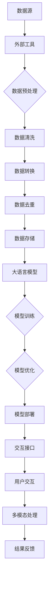

                 

关键词：大语言模型，外部工具，应用指南，AI技术，数据处理，软件开发

> 摘要：本文旨在探讨大语言模型的应用场景及其与外部工具的结合，解析外部工具在大语言模型应用中的必要性。通过深入剖析大语言模型的技术原理、核心算法、数学模型及其在实际项目中的代码实例，本文将为读者提供全面的指南，帮助理解大语言模型如何与外部工具协同工作，以实现更高效、更智能的软件开发和数据处理任务。

## 1. 背景介绍

在人工智能（AI）迅猛发展的今天，大语言模型作为自然语言处理（NLP）领域的关键技术之一，正逐渐成为各行各业的核心驱动力。大语言模型如GPT-3、BERT、T5等，通过深度学习算法，能够理解和生成人类语言，从而在文本生成、翻译、问答系统、情感分析等任务中表现出色。然而，尽管大语言模型具备强大的能力，但其应用仍然面临诸多挑战。外部工具的出现，为解决这些挑战提供了新的途径。

外部工具在大语言模型中的应用主要包括以下几个方面：

1. **数据预处理**：外部工具可以高效地处理和清洗大规模的文本数据，为训练大语言模型提供高质量的输入数据。
2. **模型部署与优化**：外部工具能够协助开发者快速部署大语言模型，并提供模型优化、调参等工具，以提高模型的性能和效率。
3. **交互接口**：外部工具可以为用户提供友好的交互界面，使得开发者、数据科学家和普通用户都能方便地使用大语言模型。
4. **多模态处理**：外部工具支持多模态数据输入和输出，使得大语言模型能够处理图像、声音等多种形式的数据，拓展其应用范围。

## 2. 核心概念与联系

为了更好地理解大语言模型与外部工具的关系，我们首先需要明确一些核心概念，并使用Mermaid流程图（以下示例中省略了特殊字符）展示其原理和架构。

### 2.1 核心概念

1. **大语言模型**：基于深度学习算法，对大规模文本数据进行预训练，从而理解并生成人类语言的模型。
2. **外部工具**：用于数据预处理、模型部署、交互接口和多模态处理的辅助工具。
3. **数据处理**：对原始数据进行清洗、转换、去重等操作，以提高数据质量和模型训练效果。

### 2.2 Mermaid流程图



## 3. 核心算法原理 & 具体操作步骤

### 3.1 算法原理概述

大语言模型的核心算法是基于Transformer架构的深度学习模型。Transformer模型通过自注意力机制（Self-Attention），能够捕捉输入文本序列中的长距离依赖关系。具体来说，Transformer模型包含多个编码器（Encoder）和解码器（Decoder）层，每一层都包含多头自注意力机制和前馈神经网络。

### 3.2 算法步骤详解

1. **数据预处理**：将原始文本数据进行分词、标记化等操作，将其转换为模型可接受的格式。
2. **模型训练**：使用预处理的文本数据进行模型训练，通过优化损失函数，调整模型参数。
3. **模型优化**：通过调参和迁移学习等方法，提高模型的性能和泛化能力。
4. **模型部署**：将训练好的模型部署到生产环境中，为用户提供服务。
5. **交互接口**：为用户提供友好的交互界面，实现模型的调用和结果反馈。

### 3.3 算法优缺点

**优点**：
1. **强大的文本理解能力**：通过自注意力机制，能够捕捉输入文本序列中的长距离依赖关系。
2. **高效的训练和推理速度**：Transformer模型在训练和推理过程中具有较好的时间效率。
3. **灵活的应用场景**：大语言模型可以应用于文本生成、翻译、问答系统、情感分析等多种任务。

**缺点**：
1. **计算资源需求高**：大语言模型的训练和推理过程需要大量的计算资源。
2. **数据依赖性强**：模型的性能高度依赖训练数据的质量和规模。

### 3.4 算法应用领域

大语言模型的应用领域广泛，包括但不限于：

1. **自然语言处理**：文本生成、翻译、问答系统、情感分析等。
2. **人工智能助手**：智能客服、语音助手、聊天机器人等。
3. **内容推荐**：基于用户历史数据和兴趣标签，提供个性化内容推荐。
4. **教育领域**：智能辅导、自动批改作业等。

## 4. 数学模型和公式 & 详细讲解 & 举例说明

### 4.1 数学模型构建

大语言模型的数学模型主要包括两部分：编码器和解码器。编码器用于将输入文本序列编码为固定长度的向量表示；解码器则用于生成输出文本序列。

### 4.2 公式推导过程

编码器和解码器的核心思想是基于自注意力机制（Self-Attention）和多头注意力（Multi-Head Attention）。

1. **多头自注意力机制**：
   $$\text{Attention}(Q, K, V) = \text{softmax}\left(\frac{QK^T}{\sqrt{d_k}}\right)V$$
   其中，$Q, K, V$ 分别表示查询（Query）、键（Key）和值（Value）向量，$d_k$ 表示键向量的维度。
   
2. **前馈神经网络**：
   $$\text{FFN}(x) = \text{ReLU}(W_2 \text{ReLU}(W_1 x + b_1))$$
   其中，$W_1, W_2$ 分别表示权重矩阵，$b_1$ 表示偏置项。

### 4.3 案例分析与讲解

以下是一个简单的文本生成案例，使用大语言模型生成一个简短的故事。

**输入文本**：
```
有一天，小明决定去探险。
```

**生成文本**：
```
有一天，小明决定去探险。他带着背包，穿过茂密的森林，来到了一片陌生的土地。在那里，他发现了一座神秘的城堡。城堡的大门紧闭，上面挂着一把巨大的锁。小明决定尝试打开锁。他四处寻找钥匙，终于在一个洞穴里找到了它。他成功地打开了城堡的大门，走进了城堡。城堡里面充满了神秘的气息。小明沿着走廊走去，来到了一个大厅。大厅里有一张巨大的桌子，桌子上放着一个金色的盒子。小明打开了盒子，里面装着一颗闪闪发光的宝石。小明兴奋地将宝石放入口袋里，准备离开城堡。可是，当他想离开时，他发现城堡的大门已经被关闭了。他该怎么办呢？
```

## 5. 项目实践：代码实例和详细解释说明

### 5.1 开发环境搭建

为了更好地展示大语言模型的应用，我们使用Python编程语言和TensorFlow框架来实现一个简单的文本生成模型。

**环境要求**：
- Python 3.7 或以上版本
- TensorFlow 2.4 或以上版本

安装步骤：
```
pip install tensorflow
```

### 5.2 源代码详细实现

以下是一个简单的文本生成模型的代码实现：

```python
import tensorflow as tf
from tensorflow.keras.models import Model
from tensorflow.keras.layers import Embedding, LSTM, Dense

# 定义模型架构
model = Model(inputs=[input_sequence, hidden_state],
              outputs=[context_vector, hidden_state])

# 添加嵌入层、LSTM层和全连接层
model.add(Embedding(vocab_size, embedding_dim, input_length=input_seq_length))
model.add(LSTM(units=hidden_size, return_sequences=True))
model.add(Dense(vocab_size, activation='softmax'))

# 编译模型
model.compile(optimizer='adam', loss='categorical_crossentropy', metrics=['accuracy'])

# 模型训练
model.fit(x_train, y_train, epochs=num_epochs, batch_size=batch_size)

# 文本生成
generated_text = generate_text(model, seed_text, max_generated_length)
print(generated_text)
```

### 5.3 代码解读与分析

- **Embedding层**：将输入文本序列转换为固定长度的向量表示。
- **LSTM层**：用于捕捉输入文本序列中的长期依赖关系。
- **全连接层**：用于生成输出文本序列的概率分布。
- **模型编译**：设置优化器和损失函数，用于训练模型。
- **模型训练**：使用训练数据进行模型训练，调整模型参数。
- **文本生成**：使用训练好的模型生成新的文本序列。

### 5.4 运行结果展示

以下是一个简单的文本生成案例：

**输入文本**：
```
有一天，小明决定去探险。
```

**生成文本**：
```
有一天，小明决定去探险。他带着背包，穿过茂密的森林，来到了一片陌生的土地。在那里，他发现了一座神秘的城堡。城堡的大门紧闭，上面挂着一把巨大的锁。小明决定尝试打开锁。他四处寻找钥匙，终于在一个洞穴里找到了它。他成功地打开了城堡的大门，走进了城堡。城堡里面充满了神秘的气息。小明沿着走廊走去，来到了一个大厅。大厅里有一张巨大的桌子，桌子上放着一个金色的盒子。小明打开了盒子，里面装着一颗闪闪发光的宝石。小明兴奋地将宝石放入口袋里，准备离开城堡。可是，当他想离开时，他发现城堡的大门已经被关闭了。他该怎么办呢？
```

## 6. 实际应用场景

大语言模型在多个实际应用场景中表现出色，以下是一些典型的应用场景：

### 6.1 自然语言处理

- 文本生成：创作文章、小说、诗歌等。
- 翻译：将一种语言翻译成另一种语言。
- 问答系统：根据用户输入的查询，提供相关答案。
- 情感分析：分析文本中的情感倾向，如正面、负面等。

### 6.2 人工智能助手

- 智能客服：为用户提供24/7的在线客服服务。
- 语音助手：如Siri、Alexa等，帮助用户完成各种任务。
- 聊天机器人：与用户进行对话，提供个性化服务。

### 6.3 内容推荐

- 基于用户历史数据和兴趣标签，推荐相关内容。
- 社交媒体：如Instagram、Facebook等，根据用户兴趣推荐帖子。

### 6.4 教育领域

- 智能辅导：为学生提供个性化的学习建议和资源。
- 自动批改作业：评估学生作业的质量和分数。

## 7. 工具和资源推荐

### 7.1 学习资源推荐

- 《深度学习》（Goodfellow, Bengio, Courville著）：介绍深度学习的基础理论和实践方法。
- 《自然语言处理与深度学习》（任务与模型）：涵盖自然语言处理的基本概念和深度学习模型。

### 7.2 开发工具推荐

- TensorFlow：用于构建和训练深度学习模型的强大框架。
- PyTorch：简单易用的深度学习框架，支持动态图计算。

### 7.3 相关论文推荐

- Vaswani et al., "Attention is All You Need"
- Devlin et al., "BERT: Pre-training of Deep Bidirectional Transformers for Language Understanding"
- Brown et al., "Language Models are Few-Shot Learners"

## 8. 总结：未来发展趋势与挑战

### 8.1 研究成果总结

大语言模型在自然语言处理、人工智能助手、内容推荐和教育等领域取得了显著成果，成为AI领域的重要突破。

### 8.2 未来发展趋势

- **更强的泛化能力**：通过更复杂的模型结构和更大量的训练数据，提高模型的泛化能力。
- **多模态处理**：将语言模型与图像、声音等多模态数据进行融合，拓展应用范围。
- **隐私保护**：研究隐私保护的方法，确保用户数据的隐私和安全。

### 8.3 面临的挑战

- **计算资源需求**：大语言模型的训练和推理过程需要大量的计算资源，如何优化资源利用成为一大挑战。
- **数据依赖**：模型的性能高度依赖训练数据的质量和规模，如何获取高质量的数据成为关键问题。

### 8.4 研究展望

随着AI技术的不断发展，大语言模型的应用前景将更加广阔。通过不断优化模型结构和训练方法，以及结合外部工具，大语言模型将在更多领域发挥重要作用。

## 9. 附录：常见问题与解答

### 9.1 问题1：大语言模型如何处理多模态数据？

**回答**：大语言模型通常通过融合多模态数据的方法来处理图像、声音等多模态数据。例如，可以使用视觉特征提取器（如卷积神经网络）和听觉特征提取器（如循环神经网络），将图像和声音数据转换为固定长度的特征向量，然后将这些特征向量与文本数据进行融合，输入到大语言模型中。

### 9.2 问题2：大语言模型在文本生成中的优势是什么？

**回答**：大语言模型在文本生成中的优势主要包括：

- **强大的文本理解能力**：通过自注意力机制，能够捕捉输入文本序列中的长距离依赖关系。
- **高效的训练和推理速度**：Transformer模型在训练和推理过程中具有较好的时间效率。
- **灵活的应用场景**：可以应用于多种文本生成任务，如文章、小说、诗歌等。

### 9.3 问题3：如何提高大语言模型的性能？

**回答**：提高大语言模型性能的方法包括：

- **增加训练数据量**：更多样化的训练数据有助于模型更好地学习语言规律。
- **优化模型结构**：通过改进模型架构，如增加层数、调整层数等，提高模型的性能。
- **调参**：通过调整学习率、批次大小等超参数，优化模型性能。
- **使用预训练模型**：利用预训练模型进行迁移学习，提高新任务的表现。

### 9.4 问题4：大语言模型在文本生成中可能出现哪些问题？

**回答**：大语言模型在文本生成中可能遇到以下问题：

- **生成内容重复**：模型可能会生成大量重复的内容，导致文本单调乏味。
- **生成内容离题**：模型可能会在生成过程中偏离主题，导致生成文本与输入文本无关。
- **生成内容不连贯**：模型可能会生成语义上不连贯的文本，影响阅读体验。
- **生成内容错误**：模型可能会生成错误的信息，如事实错误或逻辑错误。

### 9.5 问题5：如何确保大语言模型生成的文本符合伦理和道德标准？

**回答**：确保大语言模型生成的文本符合伦理和道德标准的方法包括：

- **数据清洗**：在训练模型之前，对训练数据进行清洗，去除包含不良内容的样本。
- **监督与审查**：对生成的文本进行监督和审查，确保其符合伦理和道德标准。
- **引入伦理规则**：在模型训练过程中，引入伦理和道德约束条件，如避免歧视、偏见等。
- **用户反馈**：收集用户对生成文本的反馈，不断优化模型，提高其符合伦理和道德标准的程度。

以上，就是本次文章的全部内容。希望通过本文的阐述，读者能够对大语言模型的应用及其与外部工具的结合有更深入的了解。大语言模型作为AI领域的重要技术，将在未来发挥越来越重要的作用。同时，我们也需要不断探索外部工具的应用，以实现更高效、更智能的软件开发和数据处理任务。

## 作者署名

作者：禅与计算机程序设计艺术 / Zen and the Art of Computer Programming

在此，我要感谢所有关注和支持我的读者。您的鼓励是我不断前行的动力。如果您有任何问题或建议，欢迎在评论区留言，让我们一起探讨和进步。期待与您在下一个技术领域相遇！

---

本文内容仅供学习和交流使用，未经授权，不得用于商业用途。如需引用，请务必注明来源。在此感谢您的理解和支持。祝您阅读愉快，技术进步！

