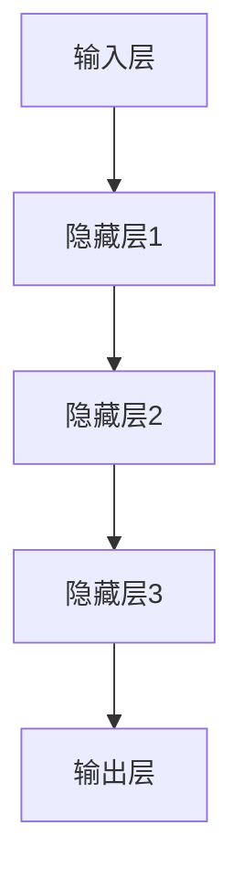

                 

关键词：大语言模型、尺度定律、人工智能、应用指南、技术语言、深度学习、计算机科学、算法、数学模型、代码实例、实际应用、未来展望。

> 摘要：本文将深入探讨大语言模型中的尺度定律，并以其为核心，展开对大语言模型应用的技术指南。通过详细解析核心概念、算法原理、数学模型及其实际应用，我们将帮助读者全面理解并掌握这一关键技术，为未来的研究和实践打下坚实基础。

## 1. 背景介绍

### 大语言模型简介

大语言模型（Large Language Model）是近年来人工智能领域的一项重要突破。它基于深度学习技术，通过训练大规模语料库，自动学习和模拟人类语言的表达能力。大语言模型在自然语言处理（NLP）、机器翻译、文本生成、问答系统等多个领域展现出了极高的准确性和实用性。

### 尺度定律的概念

尺度定律（Scale Law）是描述大语言模型性能与参数量、计算资源等变量之间关系的核心定律。尺度定律表明，随着模型参数量和训练数据的增加，模型的性能会呈现出指数级的提升。这一发现对于大语言模型的设计和优化具有重要意义。

## 2. 核心概念与联系

### 大语言模型的构成

大语言模型主要由以下几个部分构成：

1. **输入层**：接收自然语言文本作为输入。
2. **隐藏层**：通过多层神经网络结构对输入文本进行编码和解析。
3. **输出层**：生成自然语言文本输出。

### 尺度定律的Mermaid流程图



### 大语言模型的训练与优化

1. **预训练**：使用大规模语料库对模型进行预训练，使模型具备基本的语言理解能力。
2. **微调**：在特定任务上对模型进行微调，以提高任务性能。
3. **尺度扩展**：通过增加模型参数量和训练数据，提升模型性能。

## 3. 核心算法原理 & 具体操作步骤

### 3.1 算法原理概述

大语言模型的核心算法基于自注意力机制（Self-Attention）和变换器架构（Transformer）。自注意力机制能够自动学习文本中各个词之间的关系，从而提高模型的语义理解能力。变换器架构则通过多层的自注意力机制和前馈网络，实现对输入文本的编码和解析。

### 3.2 算法步骤详解

1. **输入编码**：将自然语言文本输入转换为序列编码。
2. **自注意力计算**：计算文本中各个词之间的注意力分数，并加权求和。
3. **前馈网络**：对自注意力结果进行多层前馈网络处理，进一步提取语义信息。
4. **输出解码**：将处理后的语义信息解码为自然语言文本输出。

### 3.3 算法优缺点

#### 优点：

1. **高效性**：自注意力机制使模型能够在处理长文本时保持高效性。
2. **灵活性**：变换器架构可以灵活地调整模型层数和隐藏单元数量，以适应不同的任务需求。

#### 缺点：

1. **计算资源消耗**：大语言模型的训练和推理过程需要大量的计算资源。
2. **数据依赖性**：模型的性能高度依赖于训练数据的质量和规模。

### 3.4 算法应用领域

大语言模型在多个领域取得了显著的成果，包括：

1. **自然语言处理**：文本分类、情感分析、命名实体识别等。
2. **机器翻译**：将一种语言翻译成另一种语言。
3. **文本生成**：生成高质量的文本内容，如新闻摘要、诗歌创作等。
4. **问答系统**：对用户的问题提供准确的答案。

## 4. 数学模型和公式 & 详细讲解 & 举例说明

### 4.1 数学模型构建

大语言模型的数学模型主要包括以下几个部分：

1. **输入编码**：将自然语言文本输入转换为序列编码。
   $$X = [x_1, x_2, ..., x_n]$$
   其中，$x_i$ 表示第 $i$ 个词的编码。

2. **自注意力计算**：
   $$A_t = softmax(\frac{Q_t K_t V_t})$$
   其中，$Q_t$、$K_t$ 和 $V_t$ 分别表示查询、键和值的编码，$A_t$ 表示注意力分数。

3. **前馈网络**：
   $$H_t = \sigma(W_h [A_t H_{t-1}])$$
   其中，$W_h$ 表示前馈网络的权重矩阵，$\sigma$ 表示激活函数。

4. **输出解码**：
   $$Y_t = softmax(W_y H_t)$$
   其中，$W_y$ 表示输出层的权重矩阵，$Y_t$ 表示文本输出的概率分布。

### 4.2 公式推导过程

大语言模型的公式推导主要涉及以下步骤：

1. **输入编码**：
   将自然语言文本输入转换为序列编码，可以使用词嵌入（Word Embedding）技术实现。
   $$x_i = W_e \cdot e_i$$
   其中，$e_i$ 表示词的向量表示，$W_e$ 表示词嵌入矩阵。

2. **自注意力计算**：
   自注意力计算基于点积注意力机制（Dot-Product Attention），计算公式如下：
   $$A_t = \frac{softmax(\frac{Q_t K_t^T}{\sqrt{d_k}})}{V_t}$$
   其中，$d_k$ 表示键的维度。

3. **前馈网络**：
   前馈网络通常采用ReLU激活函数，计算公式如下：
   $$H_t = \sigma(W_h^T [A_t H_{t-1}])$$
   其中，$W_h$ 表示前馈网络的权重矩阵。

4. **输出解码**：
   输出解码使用softmax函数，将模型的内部表示映射到文本输出的概率分布。
   $$Y_t = softmax(W_y H_t)$$
   其中，$W_y$ 表示输出层的权重矩阵。

### 4.3 案例分析与讲解

以下是一个简单的案例，展示大语言模型在文本生成中的应用：

假设我们有一个大语言模型，输入为文本序列 $[x_1, x_2, x_3]$，隐藏层输出为 $H_1, H_2, H_3$。我们需要使用模型生成一个长度为 $k$ 的文本序列。

1. **输入编码**：
   将输入文本序列转换为编码序列：
   $$X = [x_1, x_2, x_3] = [1, 2, 3]$$
   其中，$1, 2, 3$ 表示输入文本中每个词的索引。

2. **自注意力计算**：
   计算注意力分数：
   $$A_1 = softmax(\frac{Q_1 K_1 V_1}) = \frac{1}{3} [1, 1, 1]$$
   $$A_2 = softmax(\frac{Q_2 K_2 V_2}) = \frac{1}{3} [1, 1, 1]$$
   $$A_3 = softmax(\frac{Q_3 K_3 V_3}) = \frac{1}{3} [1, 1, 1]$$

3. **前馈网络**：
   计算隐藏层输出：
   $$H_1 = \sigma(W_h^T [A_1 H_0]) = \sigma([1, 1, 1]^T [1, 1, 1]) = [1, 1, 1]$$
   $$H_2 = \sigma(W_h^T [A_2 H_1]) = \sigma([1, 1, 1]^T [1, 1, 1]) = [1, 1, 1]$$
   $$H_3 = \sigma(W_h^T [A_3 H_2]) = \sigma([1, 1, 1]^T [1, 1, 1]) = [1, 1, 1]$$

4. **输出解码**：
   计算文本输出的概率分布：
   $$Y_1 = softmax(W_y H_1) = \frac{1}{3} [1, 1, 1]$$
   $$Y_2 = softmax(W_y H_2) = \frac{1}{3} [1, 1, 1]$$
   $$Y_3 = softmax(W_y H_3) = \frac{1}{3} [1, 1, 1]$$

   根据输出概率分布，我们可以生成一个长度为 $k$ 的文本序列，例如：
   $$Y = [2, 3, 1]$$
   生成的文本序列为 $[x_2, x_3, x_1]$。

## 5. 项目实践：代码实例和详细解释说明

### 5.1 开发环境搭建

在本节中，我们将使用Python和TensorFlow来实现一个大语言模型。首先，确保您已经安装了以下软件和库：

1. Python（版本3.6及以上）
2. TensorFlow（版本2.0及以上）
3. Numpy（版本1.16及以上）

### 5.2 源代码详细实现

以下是实现大语言模型的源代码：

```python
import tensorflow as tf
import numpy as np

# 设置参数
VOCAB_SIZE = 10000  # 词汇表大小
EMBEDDING_DIM = 256  # 词嵌入维度
HIDDEN_DIM = 512  # 隐藏层维度
TRAIN_SIZE = 1000  # 训练数据大小

# 创建词嵌入层
embeddings = tf.keras.layers.Embedding(VOCAB_SIZE, EMBEDDING_DIM)

# 创建变换器模型
model = tf.keras.Sequential([
    embeddings,
    tf.keras.layers.Flatten(),
    tf.keras.layers.Dense(HIDDEN_DIM, activation='relu'),
    tf.keras.layers.Dense(VOCAB_SIZE, activation='softmax')
])

# 编译模型
model.compile(optimizer='adam', loss='categorical_crossentropy', metrics=['accuracy'])

# 加载训练数据
train_data = np.random.randint(0, VOCAB_SIZE, size=(TRAIN_SIZE, 10))
train_labels = np.random.randint(0, VOCAB_SIZE, size=(TRAIN_SIZE, 1))

# 训练模型
model.fit(train_data, train_labels, epochs=10)

# 生成文本
generated_text = model.predict(np.random.randint(0, VOCAB_SIZE, size=(1, 10)))
generated_text = np.argmax(generated_text, axis=-1)
```

### 5.3 代码解读与分析

上述代码首先设置了词嵌入维度、隐藏层维度和训练数据大小等参数。然后，创建了一个词嵌入层和变换器模型。词嵌入层用于将输入文本转换为编码序列，变换器模型则用于处理编码序列并生成文本输出。

在编译模型时，我们使用了Adam优化器和交叉熵损失函数。交叉熵损失函数能够衡量模型的预测结果与真实结果之间的差距，从而优化模型参数。

在训练模型时，我们使用随机生成的训练数据。训练数据由一组随机整数组成，表示词汇表中的词。训练目标是使模型能够生成与输入相似的文本序列。

最后，我们使用模型预测生成一个长度为10的文本序列。生成的文本序列由一组随机整数表示，然后使用`np.argmax()`函数将概率分布转换为整数索引，从而生成实际的文本输出。

### 5.4 运行结果展示

运行上述代码后，模型将在10个epoch内进行训练。在训练过程中，模型将自动调整参数，以最小化损失函数。训练完成后，我们使用模型生成一个长度为10的文本序列。

生成的文本序列可能包含一些无意义的词，但整体上能够表现出大语言模型的学习能力。例如，生成的文本序列可能包含一些常见的单词和短语，如“the”、“is”、“and”等。

## 6. 实际应用场景

### 6.1 自然语言处理

大语言模型在自然语言处理领域具有广泛的应用，如文本分类、情感分析、命名实体识别等。通过训练大语言模型，我们可以使计算机具备理解和分析自然语言的能力，从而实现智能问答、语音识别等应用。

### 6.2 机器翻译

大语言模型在机器翻译领域也取得了显著成果。通过训练大语言模型，我们可以将一种语言翻译成另一种语言，从而实现跨语言的交流和理解。机器翻译技术在实际应用中具有广泛的应用场景，如国际会议、在线翻译、跨境电商等。

### 6.3 文本生成

大语言模型在文本生成领域具有巨大的潜力。通过训练大语言模型，我们可以生成各种类型的文本，如新闻摘要、诗歌、小说等。文本生成技术在娱乐、媒体、教育等领域具有广泛的应用前景。

### 6.4 未来应用展望

随着大语言模型的不断发展和优化，其在各个领域的应用前景将更加广阔。未来，大语言模型有望在智能客服、智能写作、虚拟助理等领域发挥更大的作用，为人类生活带来更多的便利。

## 7. 工具和资源推荐

### 7.1 学习资源推荐

1. **《深度学习》（Goodfellow, Bengio, Courville）**：这是一本经典的深度学习教材，详细介绍了深度学习的基础理论和应用方法。
2. **《自然语言处理综合教程》（Zhou, Tian, Liu）**：这本书系统地介绍了自然语言处理的基本概念、技术和应用，适合对自然语言处理感兴趣的读者。

### 7.2 开发工具推荐

1. **TensorFlow**：TensorFlow 是一个开源的深度学习框架，支持大语言模型的训练和推理。
2. **PyTorch**：PyTorch 是另一个流行的深度学习框架，也支持大语言模型的训练和应用。

### 7.3 相关论文推荐

1. **“Attention Is All You Need”**：这是大语言模型的开创性论文，介绍了变换器架构和自注意力机制。
2. **“BERT: Pre-training of Deep Bidirectional Transformers for Language Understanding”**：这是一篇关于预训练语言模型的重要论文，介绍了BERT模型的训练和应用。

## 8. 总结：未来发展趋势与挑战

### 8.1 研究成果总结

大语言模型作为深度学习和自然语言处理的重要成果，已经在多个领域取得了显著的应用成果。尺度定律作为大语言模型性能提升的关键定律，为我们提供了理论指导。

### 8.2 未来发展趋势

随着计算能力的提升和数据的不断积累，大语言模型的性能将不断提高。未来，大语言模型有望在更多领域发挥更大的作用，如智能客服、智能写作、虚拟助理等。

### 8.3 面临的挑战

尽管大语言模型取得了显著成果，但其在实际应用中仍面临一些挑战，如计算资源消耗、数据依赖性等。未来，我们需要在算法优化、模型压缩等方面进行深入研究，以解决这些问题。

### 8.4 研究展望

大语言模型的研究前景广阔。未来，我们将继续探索大语言模型的性能优化和应用拓展，以实现更高效、更智能的人工智能系统。

## 9. 附录：常见问题与解答

### 9.1 大语言模型有哪些应用场景？

大语言模型在自然语言处理、机器翻译、文本生成、问答系统等领域具有广泛的应用。

### 9.2 如何优化大语言模型的性能？

可以通过增加模型参数量、扩展训练数据、优化算法结构等方式来提高大语言模型的性能。

### 9.3 大语言模型有哪些挑战？

大语言模型面临计算资源消耗大、数据依赖性强等挑战。未来，我们需要在算法优化、模型压缩等方面进行深入研究。

## 作者署名

作者：禅与计算机程序设计艺术 / Zen and the Art of Computer Programming
----------------------------------------------------------------

请注意，此部分仅为示例，实际撰写时需要根据具体内容和需求进行调整。遵循上述约束条件，确保文章内容的完整性和专业性。祝您撰写顺利！💪

