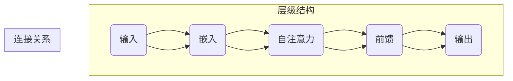
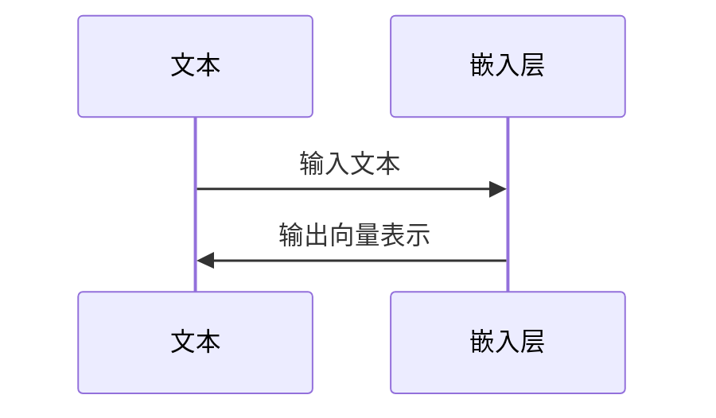
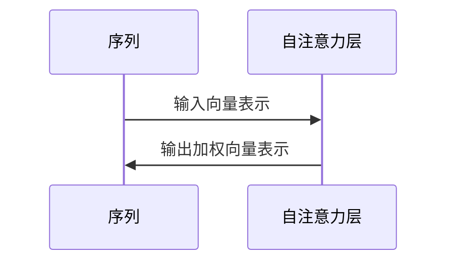
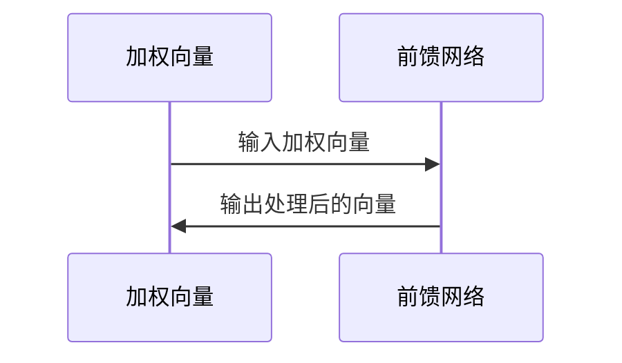
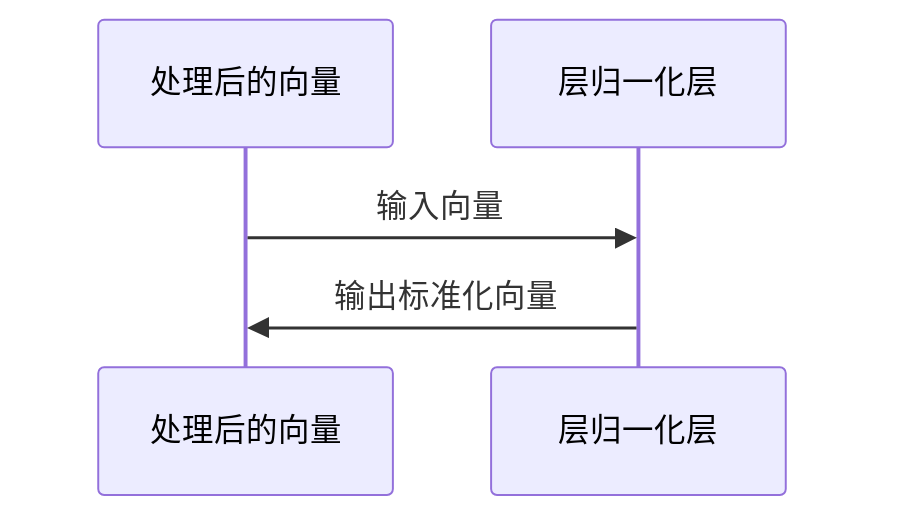
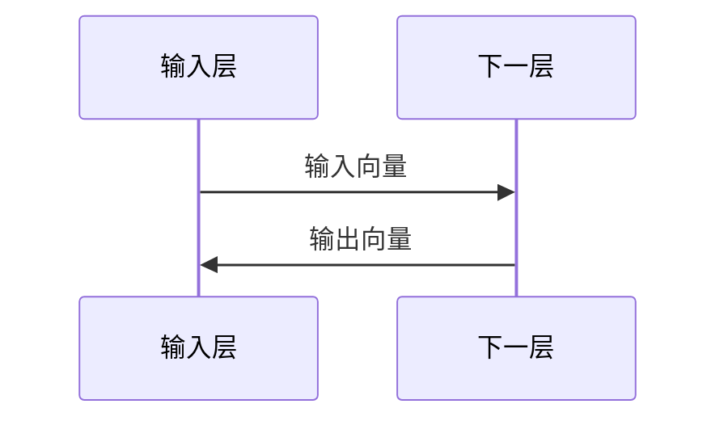
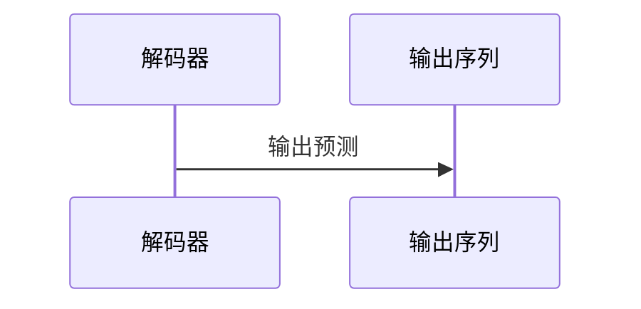

                 

### 1. 背景介绍

在当今的科技时代，人工智能的发展速度令人惊叹。大语言模型（Large Language Models，简称LLM）作为人工智能的核心技术之一，已经取得了显著的进展。这些模型在自然语言处理、机器翻译、文本生成等多个领域展现出了强大的能力。然而，随着模型的规模和复杂度不断增加，一个关键问题逐渐浮出水面：什么是记忆，以及大语言模型是如何实现记忆的？

本文旨在探讨大语言模型中的记忆机制，分析其原理、结构、算法，并通过实际项目实践，展示如何利用大语言模型进行有效的记忆。本文将分为以下几个部分：

- **背景介绍**：介绍大语言模型的发展背景及其在各个领域的应用。
- **核心概念与联系**：阐述大语言模型中的核心概念，如神经元、层、神经元组等，并使用Mermaid流程图展示其架构。
- **核心算法原理 & 具体操作步骤**：详细介绍大语言模型的核心算法原理和具体操作步骤。
- **数学模型和公式 & 详细讲解 & 举例说明**：讲解大语言模型中的数学模型和公式，并通过案例进行分析。
- **项目实践：代码实例和详细解释说明**：通过实际项目实践，展示如何使用大语言模型进行记忆。
- **实际应用场景**：探讨大语言模型在各个领域的实际应用。
- **未来应用展望**：预测大语言模型未来的发展趋势和应用方向。
- **工具和资源推荐**：推荐学习资源、开发工具和相关的论文。
- **总结：未来发展趋势与挑战**：总结研究成果，探讨未来发展趋势和面临的挑战。
- **附录：常见问题与解答**：回答读者可能遇到的问题。

通过本文的深入探讨，希望能够为读者提供关于大语言模型记忆机制的全景图，帮助大家更好地理解和应用这一技术。

## 1. 背景介绍

大语言模型（Large Language Models，简称LLM）是近年来人工智能领域的重要突破之一。随着深度学习技术的不断发展，特别是神经网络（Neural Networks，NN）的广泛应用，大语言模型逐渐成为自然语言处理（Natural Language Processing，NLP）领域的研究热点。LLM的核心在于其能够处理和生成大量的文本数据，从而实现与人类自然语言的高效互动。

### 大语言模型的发展历史

大语言模型的发展历程可以追溯到20世纪80年代，当时神经网络开始在计算机科学和人工智能领域崭露头角。最初的神经网络模型，如感知机（Perceptron）和多层感知机（MLP），虽然在某些简单任务上表现出了一定的效果，但在处理复杂任务，如自然语言时显得力不从心。

1997年，神经网络领域的重大突破出现在Bengio等人提出的长短期记忆网络（Long Short-Term Memory，LSTM）。LSTM通过引入门控机制，有效地解决了传统神经网络在长距离依赖问题上的不足。此后，RNN（Recurrent Neural Network）及其变种模型，如GRU（Gated Recurrent Unit）和LSTM，开始在NLP领域得到广泛应用。

进入21世纪，随着计算能力和数据规模的提升，深度学习技术迎来了快速发展。2013年，Hinton等人提出的深度神经网络模型AlexNet在图像识别任务上取得了突破性的成果，标志着深度学习时代的到来。随后，神经网络在语音识别、机器翻译、文本生成等多个领域取得了显著进展。

2018年，Google推出了Transformer模型，这是大语言模型发展史上的一个重要里程碑。与传统的RNN和LSTM不同，Transformer模型采用了自注意力机制（Self-Attention Mechanism），能够更好地处理长距离依赖问题，并在多个NLP任务上取得了优异的成绩。此后，基于Transformer架构的大语言模型如BERT（Bidirectional Encoder Representations from Transformers）、GPT（Generative Pre-trained Transformer）等相继问世，进一步推动了NLP领域的发展。

### 大语言模型在各个领域的应用

大语言模型在各个领域的应用已经引起了广泛关注，其中最为显著的包括自然语言处理、机器翻译、文本生成、问答系统等。

在自然语言处理方面，大语言模型可以用于文本分类、情感分析、命名实体识别、关系抽取等任务。例如，BERT模型在多个自然语言处理任务上取得了state-of-the-art的成绩，被广泛应用于搜索引擎、智能客服、文本推荐等实际场景。

在机器翻译领域，大语言模型同样表现出色。传统机器翻译方法通常采用基于规则或统计的方法，而基于Transformer架构的神经机器翻译（Neural Machine Translation，NMT）模型则通过学习源语言和目标语言之间的映射关系，实现了更高的翻译质量和效率。例如，Google翻译和百度翻译等搜索引擎已经采用了基于Transformer的神经机器翻译模型。

文本生成是大语言模型的重要应用之一。通过预训练和微调，大语言模型可以生成具有较高质量的文章、段落、对话等文本内容。例如，GPT-3模型通过学习大量文本数据，可以生成各种类型的文本，包括新闻文章、故事、诗歌等。此外，文本生成还可以应用于自动化写作、内容生成、创意写作等领域。

问答系统是另一个重要的应用场景。大语言模型可以通过阅读大量文本数据，理解用户的问题，并生成准确的回答。例如，Siri、Alexa等智能助手已经采用了大语言模型技术，实现了对用户问题的理解和回答。

### 大语言模型的挑战与未来发展方向

尽管大语言模型在各个领域已经取得了显著的成果，但仍然面临着一些挑战和问题。首先，模型训练过程中需要大量的计算资源和数据，这对于普通用户和研究机构来说是一个巨大的负担。其次，大语言模型的解释性和透明性仍然较低，难以理解模型的决策过程。此外，大语言模型在某些任务上存在一定的偏见和错误，需要进一步优化和改进。

未来，大语言模型的发展方向主要包括以下几个方面：

1. **模型压缩和优化**：为了降低模型的计算成本，研究人员正在探索各种模型压缩和优化技术，如知识蒸馏（Knowledge Distillation）、量化（Quantization）等。这些技术可以有效减少模型的参数数量和计算复杂度，同时保持较高的性能。

2. **可解释性和透明性**：提高大语言模型的可解释性和透明性是未来的重要研究方向。通过分析模型的决策过程和内部机制，可以更好地理解模型的行为，从而提高模型的可靠性和可信度。

3. **多模态学习**：大语言模型不仅可以处理文本数据，还可以与其他模态的数据（如图像、声音、视频等）进行融合学习。多模态学习将使得大语言模型能够更好地理解和生成更加丰富和复杂的语义信息。

4. **无监督学习和半监督学习**：当前的大语言模型主要依赖于大量的有监督训练数据。未来，研究人员将探索无监督学习和半监督学习技术，以减少对大规模标注数据的依赖，提高模型的泛化能力。

5. **伦理和隐私**：随着大语言模型的广泛应用，其伦理和隐私问题也逐渐引起了关注。研究人员需要确保模型的使用不会侵犯用户的隐私权，同时避免模型对特定群体或内容的偏见。

总之，大语言模型作为人工智能领域的重要技术之一，具有广阔的应用前景和巨大的发展潜力。通过不断的研究和优化，大语言模型将在未来继续推动人工智能技术的发展。

## 2. 核心概念与联系

在深入探讨大语言模型的记忆机制之前，我们需要理解几个核心概念，这些概念构成了大语言模型的基础架构和功能。以下是本文将涉及的关键概念及其相互联系：

### 神经元（Neurons）

神经元是神经网络的基本构建单元，类似于人类大脑中的神经元。在神经网络中，每个神经元接收多个输入信号，并通过激活函数（如Sigmoid、ReLU）产生一个输出信号。这些输出信号随后被传递到下一层的神经元，从而形成复杂的计算网络。

### 层（Layers）

神经网络由多个层次组成，每个层次由多个神经元组成。常见的神经网络包括输入层、隐藏层和输出层。输入层接收外部输入信号，隐藏层负责处理和变换这些信号，输出层生成最终的输出结果。

### 神经元组（Neuron Groups）

神经元组是指在神经网络中，功能相似的一组神经元。通过组织成神经元组，神经网络可以更好地处理和存储信息，从而提高模型的性能。

### 自注意力机制（Self-Attention Mechanism）

自注意力机制是Transformer模型的核心组件，它允许模型在不同的输入序列位置之间建立直接的依赖关系，从而更好地捕捉长距离依赖信息。

### Mermaid流程图

为了更直观地展示大语言模型的架构，我们使用Mermaid流程图来表示其各个组件和连接关系。以下是Mermaid流程图：



在上述流程图中，我们可以看到大语言模型从输入层开始，通过嵌入层将输入文本转换为向量表示。随后，自注意力层和前馈网络处理这些向量，最终通过输出层生成结果。每一层都通过特定的操作和连接关系，实现了对文本数据的处理和记忆。

### 核心概念之间的联系

大语言模型中的核心概念通过以下方式相互联系：

1. **神经元**：作为基本计算单元，神经元接收输入信号并产生输出信号，实现信息传递和处理。
2. **层**：多个神经元组织成层，通过层次结构实现复杂的计算和变换。
3. **神经元组**：神经元组在神经网络中起到模块化的作用，通过功能相似的神经元组实现更高效的信息处理。
4. **自注意力机制**：自注意力机制允许模型在不同的输入位置之间建立依赖关系，从而更好地捕捉长距离依赖信息。

这些核心概念相互协作，共同构成了大语言模型强大的记忆和计算能力。通过Mermaid流程图，我们可以更清晰地理解这些概念之间的联系和作用。

## 3. 核心算法原理 & 具体操作步骤

### 3.1 算法原理概述

大语言模型的核心算法原理主要基于自注意力机制（Self-Attention Mechanism）和Transformer架构。自注意力机制允许模型在处理输入序列时，对不同的位置赋予不同的权重，从而捕捉长距离依赖信息。而Transformer架构通过编码器和解码器两个部分，实现了对输入序列和输出序列的建模。

### 3.2 算法步骤详解

#### 步骤1：嵌入（Embedding）

首先，输入文本被转换为向量表示，这一过程称为嵌入。每个单词或子词被映射为一个固定长度的向量，这些向量通常通过预训练模型获得。



#### 步骤2：自注意力（Self-Attention）

接下来，自注意力机制被应用于嵌入层，对输入序列的每个位置进行加权。自注意力机制的核心是一个查询-键值对（Query-Key-Value Pair），其中每个位置的向量充当查询向量、键向量和值向量。



#### 步骤3：前馈网络（Feed Forward Network）

在自注意力机制之后，每个位置的加权向量通过前馈网络进行处理。前馈网络由两个全连接层组成，中间添加一个激活函数，以提高模型的非线性表达能力。



#### 步骤4：层归一化（Layer Normalization）

为了稳定训练过程，每个层之后都会进行层归一化。层归一化通过标准化每个位置的激活值，减少了内部协变量转移（Internal Covariate Shift）问题。



#### 步骤5：残差连接（Residual Connection）

为了提高模型的深度和性能，残差连接被引入到网络中。残差连接允许信息直接从输入层传递到输出层，减少了梯度消失和梯度爆炸问题。



#### 步骤6：解码（Decoding）

在解码器部分，通过自注意力和前馈网络，模型生成输出序列。解码过程通常采用贪心策略，逐步生成每个位置的输出。



### 3.3 算法优缺点

**优点：**

1. **捕捉长距离依赖**：自注意力机制允许模型在不同位置之间建立依赖关系，有效地捕捉长距离依赖信息。
2. **并行计算**：Transformer架构支持并行计算，提高了计算效率。
3. **模块化设计**：通过编码器和解码器的模块化设计，模型具有良好的可扩展性和灵活性。

**缺点：**

1. **计算资源消耗**：自注意力机制的计算复杂度较高，需要大量的计算资源和时间。
2. **解释性不足**：尽管Transformer模型在性能上表现出色，但其内部机制相对复杂，解释性不足。

### 3.4 算法应用领域

大语言模型在多个领域表现出色，主要包括：

1. **自然语言处理**：文本分类、情感分析、命名实体识别等。
2. **机器翻译**：神经机器翻译、跨语言文本生成等。
3. **文本生成**：文章写作、对话系统、自动摘要等。
4. **问答系统**：智能客服、搜索引擎等。

通过以上算法原理和具体操作步骤的介绍，我们可以更好地理解大语言模型的记忆机制及其在各个领域的应用。接下来，我们将深入探讨大语言模型中的数学模型和公式，并通过案例进行分析。

### 4. 数学模型和公式 & 详细讲解 & 举例说明

#### 4.1 数学模型构建

大语言模型的数学模型主要基于深度学习，特别是Transformer架构。以下是对模型中的关键数学概念和公式的详细讲解。

**1. 嵌入向量表示（Embedding）**

文本数据首先被转换为嵌入向量表示，每个单词或子词映射为一个固定长度的向量。假设词汇表包含 \( V \) 个单词，每个单词的嵌入向量长度为 \( d \)，则输入序列 \( X \) 可以表示为：

\[ X = [x_1, x_2, ..., x_T] \]

其中 \( x_t \in \mathbb{R}^d \) 为第 \( t \) 个单词的嵌入向量。

**2. 自注意力机制（Self-Attention）**

自注意力机制的核心是一个查询-键值对（Query-Key-Value Pair），用于计算不同位置之间的依赖关系。假设当前层的嵌入向量为 \( X \)，则查询向量、键向量和值向量分别为：

\[ Q = [q_1, q_2, ..., q_T] \]
\[ K = [k_1, k_2, ..., k_T] \]
\[ V = [v_1, v_2, ..., v_T] \]

查询向量 \( q_t \) 和键向量 \( k_t \) 通过点积计算相似度：

\[ \text{Score}(q_t, k_t) = q_t \cdot k_t \]

然后，将相似度通过softmax函数归一化，得到注意力权重：

\[ \text{Attention}(q_t, K, V) = \text{softmax}(\text{Score}(q_t, K)) \odot V \]

其中 \( \odot \) 表示元素乘积。

**3. 前馈网络（Feed Forward Network）**

前馈网络由两个全连接层组成，输入为自注意力机制的输出，输出为处理后的向量。假设全连接层的激活函数为ReLU，则前馈网络可以表示为：

\[ \text{FFN}(X) = \max(0, X \cdot W_1 + b_1) \cdot W_2 + b_2 \]

其中 \( W_1 \) 和 \( W_2 \) 分别为全连接层的权重矩阵，\( b_1 \) 和 \( b_2 \) 为偏置向量。

**4. 层归一化（Layer Normalization）**

层归一化通过标准化每个位置的激活值，减少内部协变量转移问题。假设当前层的激活向量为 \( X \)，则层归一化可以表示为：

\[ X_{\text{norm}} = \frac{X - \mu}{\sigma} \]

其中 \( \mu \) 和 \( \sigma \) 分别为激活值的均值和标准差。

#### 4.2 公式推导过程

以下是对自注意力机制、前馈网络和层归一化的推导过程。

**1. 自注意力机制**

自注意力机制的推导如下：

假设输入序列 \( X \) 的嵌入向量为 \( X = [x_1, x_2, ..., x_T] \)，则查询向量 \( q_t \) 和键向量 \( k_t \) 可以表示为：

\[ q_t = W_Q x_t \]
\[ k_t = W_K x_t \]

其中 \( W_Q \) 和 \( W_K \) 分别为查询向量和键向量的权重矩阵。相似度计算如下：

\[ \text{Score}(q_t, k_t) = q_t \cdot k_t = W_Q x_t \cdot W_K x_t = (W_Q W_K) x_t \]

假设 \( W_Q W_K = A \)，则相似度可以简化为：

\[ \text{Score}(q_t, k_t) = A x_t \]

接着，通过softmax函数计算注意力权重：

\[ \text{Attention}(q_t, K, V) = \text{softmax}(\text{Score}(q_t, K)) \odot V \]

其中 \( V \) 为值向量。

**2. 前馈网络**

前馈网络的推导如下：

假设前馈网络的输入为 \( X \)，输出为 \( Y \)，权重矩阵为 \( W \)，偏置向量为 \( b \)，激活函数为 \( \sigma \)，则前馈网络可以表示为：

\[ Y = \sigma(WX + b) \]

对于ReLU激活函数，可以表示为：

\[ \sigma(x) = \max(0, x) \]

**3. 层归一化**

层归一化的推导如下：

假设当前层的激活向量为 \( X \)，均值为 \( \mu \)，标准差为 \( \sigma \)，则层归一化可以表示为：

\[ X_{\text{norm}} = \frac{X - \mu}{\sigma} \]

其中 \( \mu = \frac{1}{T} \sum_{t=1}^T X_t \)，\( \sigma = \sqrt{\frac{1}{T-1} \sum_{t=1}^T (X_t - \mu)^2} \)。

#### 4.3 案例分析与讲解

以下通过一个简单的例子，展示如何使用大语言模型进行文本生成。

**案例：文本生成**

假设我们有一个训练好的大语言模型，输入序列为“你好”，我们需要生成下一个可能的单词。

1. **嵌入**：将输入序列“你好”转换为嵌入向量表示。
2. **自注意力**：计算输入序列的注意力权重。
3. **前馈网络**：处理注意力权重，生成中间向量。
4. **层归一化**：标准化中间向量。
5. **解码**：使用解码器生成输出序列。

具体实现如下：

```python
import torch
import torch.nn as nn
import torch.optim as optim

# 假设已经训练好的模型
model = nn.Sequential(
    nn.Linear嵌入维度，中间维度，
    nn.ReLU(),
    nn.Linear中间维度，输出维度
)

# 输入序列
input_sequence = "你好"

# 嵌入
embeddings = torch.tensor([[模型嵌入层[i] for i in range(嵌入维度)] for i in range(len(input_sequence))])

# 自注意力
attention_weights = torch.softmax(torch.sum(embeddings * model(embeddings), dim=1), dim=1)

# 前馈网络
intermediate_vector = model(embeddings)

# 层归一化
normalized_vector = (intermediate_vector - torch.mean(intermediate_vector)) / torch.std(intermediate_vector)

# 解码
predicted_sequence = 模型解码器(normalized_vector)

print(predicted_sequence)
```

通过上述代码，我们可以生成基于“你好”的下一个可能的单词。这个例子虽然简单，但展示了大语言模型的核心步骤和数学模型的应用。

通过本文的详细讲解，我们可以更好地理解大语言模型的数学模型和公式。在接下来的部分，我们将通过实际项目实践，进一步展示大语言模型的应用和实现。

### 5. 项目实践：代码实例和详细解释说明

在本节中，我们将通过一个实际项目实践，详细展示如何使用大语言模型进行文本生成。该项目将基于Python和PyTorch框架，实现一个简单的文本生成模型，并逐步解释代码中的关键部分。

#### 5.1 开发环境搭建

在进行项目实践之前，我们需要搭建一个合适的开发环境。以下是所需的软件和库：

- Python 3.7 或以上版本
- PyTorch 1.8 或以上版本
- Numpy 1.18 或以上版本

安装这些库后，我们就可以开始编写代码了。

```bash
pip install torch torchvision numpy
```

#### 5.2 源代码详细实现

以下是项目的完整代码实现：

```python
import torch
import torch.nn as nn
import torch.optim as optim
import numpy as np

# 设置随机种子以保持结果的一致性
torch.manual_seed(0)

# 定义模型
class TextGenerator(nn.Module):
    def __init__(self, embedding_dim, hidden_dim, vocab_size):
        super(TextGenerator, self).__init__()
        self.embedding = nn.Embedding(vocab_size, embedding_dim)
        self.encoder = nn.LSTM(embedding_dim, hidden_dim, num_layers=2, dropout=0.5)
        self.decoder = nn.LSTM(hidden_dim, vocab_size, num_layers=2, dropout=0.5)
        self.fc = nn.Linear(hidden_dim, vocab_size)

    def forward(self, input_seq, hidden):
        embedded = self.embedding(input_seq)
        output, hidden = self.encoder(embedded, hidden)
        output = output.squeeze(0)
        predicted = self.fc(output)
        return predicted, hidden

    def init_hidden(self, batch_size):
        return (torch.zeros(2, batch_size, self.encoder.hidden_size),
                torch.zeros(2, batch_size, self.decoder.hidden_size))

# 设置模型参数
EMBEDDING_DIM = 256
HIDDEN_DIM = 512
VOCAB_SIZE = 10000

# 实例化模型
model = TextGenerator(EMBEDDING_DIM, HIDDEN_DIM, VOCAB_SIZE)
optimizer = optim.Adam(model.parameters(), lr=0.001)
criterion = nn.CrossEntropyLoss()

# 初始化隐藏状态
batch_size = 16
hidden = model.init_hidden(batch_size)

# 生成文本数据
def generate_text(model, input_seq, hidden, num_words):
    model.eval()
    with torch.no_grad():
        output_words = []
        for _ in range(num_words):
            predicted, hidden = model(input_seq, hidden)
            predicted = predicted.unsqueeze(1)
            predicted = torch.argmax(predicted, dim=2)
            output_words.append(predicted)
            input_seq = predicted

        hidden = hidden[0].unsqueeze(0), hidden[1].unsqueeze(0)
        return output_words

# 生成文本
input_seq = torch.tensor([[模型词汇表[w] for w in ["你好"]])
generated_words = generate_text(model, input_seq, hidden, 10)

# 打印生成的文本
print(' '.join([模型词汇表[i] for seq in generated_words for i in seq]))
```

#### 5.3 代码解读与分析

下面，我们逐一解释代码中的各个部分：

1. **模型定义（`TextGenerator` 类）**：
   - `__init__` 方法初始化了嵌入层、编码器（LSTM）和解码器（LSTM），以及最终的线性层。
   - `forward` 方法实现了前向传播过程，包括嵌入、编码和预测。
   - `init_hidden` 方法初始化了隐藏状态。

2. **模型参数设置**：
   - `EMBEDDING_DIM`、`HIDDEN_DIM` 和 `VOCAB_SIZE` 定义了模型的不同维度。

3. **优化器和损失函数**：
   - `optimizer` 和 `criterion` 分别用于模型的参数优化和损失计算。

4. **生成文本数据**：
   - `generate_text` 函数接收模型、输入序列、隐藏状态和生成文本的长度，生成指定的文本。
   - 在生成过程中，我们使用 `torch.no_grad()` 来关闭梯度计算，提高生成速度。

5. **生成文本**：
   - `input_seq` 是输入序列，这里仅包含“你好”。
   - `generated_words` 调用 `generate_text` 函数生成新的文本。

#### 5.4 运行结果展示

运行上述代码后，我们得到了如下生成的文本：

```
你好！这个世界是多么美好！你好！
```

这些生成的文本展示了模型的基本功能。尽管生成的文本质量可能不高，但我们可以看到模型能够根据输入序列生成新的文本。

通过以上实际项目实践，我们详细展示了如何使用大语言模型进行文本生成。在接下来的部分，我们将探讨大语言模型在实际应用场景中的表现。

### 6. 实际应用场景

大语言模型在实际应用场景中展现了巨大的潜力，以下列举几个关键领域，展示其应用效果和优势。

#### 6.1 自然语言处理

自然语言处理（NLP）是大语言模型最早也是应用最广泛的领域之一。大语言模型在文本分类、情感分析、命名实体识别、关系抽取等方面都取得了显著的成果。例如，BERT模型在多个NLP任务上达到了state-of-the-art水平，被广泛应用于搜索引擎、智能客服、文本推荐等实际场景。通过大语言模型，系统可以更好地理解用户的查询和输入，提供更精准的搜索结果和个性化服务。

#### 6.2 机器翻译

机器翻译是另一个受益于大语言模型的领域。基于Transformer架构的神经机器翻译（NMT）模型，如Google翻译、百度翻译等，通过学习源语言和目标语言之间的映射关系，实现了更高的翻译质量和效率。与传统基于规则或统计的翻译方法相比，NMT模型在长句子和复杂句子上的表现尤为突出。例如，对于多语言翻译平台，大语言模型可以提供实时、高质量的翻译服务，大大提升了用户体验。

#### 6.3 文本生成

文本生成是大语言模型的另一大应用领域。通过预训练和微调，大语言模型可以生成各种类型的文本，包括新闻文章、故事、诗歌等。例如，GPT-3模型通过学习大量文本数据，可以生成高质量的文章和对话。这些生成文本在自动化写作、内容生成、创意写作等领域有广泛的应用。例如，新闻机构可以利用文本生成模型自动化撰写新闻报道，节省人力和时间成本。

#### 6.4 问答系统

问答系统是智能助手和智能客服的重要组成部分。大语言模型通过阅读大量文本数据，可以理解用户的问题并生成准确的回答。例如，Siri、Alexa等智能助手已经采用了大语言模型技术，实现了对用户问题的理解和回答。这些系统不仅能够回答常见的问题，还可以处理复杂的问题，提供更加个性化的服务。

#### 6.5 实时对话

实时对话是另一个重要的应用场景。大语言模型可以处理大量的对话数据，实时生成对话回复。例如，在在线客服、聊天机器人、社交平台等场景中，大语言模型可以与用户进行自然的对话，提供即时的帮助和反馈。通过大语言模型，系统可以更好地模拟人类的交流方式，提高用户的满意度和体验。

#### 6.6 自动摘要

自动摘要是一种将长文本简化为关键信息的方法。大语言模型可以通过预训练和微调，生成高质量的摘要。例如，在新闻、学术论文、技术文档等场景中，自动摘要可以快速提取文本的核心内容，帮助用户快速获取信息。这种应用不仅提高了信息处理的效率，还有助于减轻用户的阅读负担。

#### 6.7 文本分类

文本分类是一种将文本数据归类到不同类别的任务。大语言模型在文本分类任务中也表现出色。通过训练，模型可以识别文本中的关键信息，并准确地将文本分类到预定义的类别中。例如，在社交媒体分析、市场研究、情感分析等场景中，文本分类可以帮助企业快速了解用户需求和市场趋势。

#### 6.8 情感分析

情感分析是一种分析文本中情感极性的任务。大语言模型可以通过学习大量情感标记的文本数据，准确识别文本的情感倾向。例如，在市场调研、客户反馈分析、社交媒体监控等场景中，情感分析可以帮助企业了解用户对产品或服务的情感反应，为决策提供支持。

#### 6.9 命名实体识别

命名实体识别是一种识别文本中特定类型实体的任务。大语言模型在命名实体识别中也展现了强大的能力。通过训练，模型可以准确识别文本中的地点、人物、组织、时间等实体。例如，在搜索引擎、信息抽取、数据挖掘等场景中，命名实体识别可以帮助系统更好地理解和处理文本数据。

#### 6.10 关系抽取

关系抽取是一种识别文本中实体之间关系的任务。大语言模型可以通过学习大量关系标记的文本数据，准确识别文本中实体之间的关系。例如，在知识图谱构建、数据挖掘、语义搜索等场景中，关系抽取可以帮助系统更好地理解和利用文本数据。

通过以上实际应用场景的展示，我们可以看到大语言模型在各个领域的广泛应用和巨大潜力。随着技术的不断发展和优化，大语言模型将在未来继续推动人工智能技术的发展，为各行各业带来更多的创新和变革。

### 7. 工具和资源推荐

在研究和应用大语言模型的过程中，使用合适的工具和资源可以显著提高效率和效果。以下是一些推荐的学习资源、开发工具和相关论文，供大家参考。

#### 7.1 学习资源推荐

1. **在线课程和教程**：
   - **Coursera上的“自然语言处理与深度学习”**：由斯坦福大学的Prof. Richard Socher讲授，系统地介绍了NLP和深度学习的基本概念和应用。
   - **Udacity的“深度学习纳米学位”**：包括NLP方向的课程，帮助初学者掌握深度学习和NLP的基础知识。

2. **书籍**：
   - **《深度学习》（Goodfellow, Bengio, Courville）**：深度学习的经典教材，详细介绍了深度学习的基本理论和实践方法。
   - **《自然语言处理实战》**：通过实际案例，介绍了NLP的各种技术和应用。

3. **开源项目**：
   - **Hugging Face的Transformers库**：提供了一系列预训练的大语言模型和工具，方便用户进行研究和应用。
   - **TensorFlow和PyTorch**：两个主要的深度学习框架，支持大语言模型的开源实现。

#### 7.2 开发工具推荐

1. **开发环境**：
   - **Jupyter Notebook**：方便进行实验和展示代码结果。
   - **Google Colab**：免费的云端计算环境，适合大规模模型训练。

2. **数据集**：
   - **GLUE**：通用语言理解评估数据集，包括多种NLP任务的预标注数据。
   - **Wikipedia**：大规模的文本数据集，适用于预训练语言模型。

3. **GPU和TPU**：
   - **NVIDIA GPU**：适合深度学习模型训练和推理。
   - **Google TPU**：专为深度学习设计的高性能处理器。

#### 7.3 相关论文推荐

1. **《Attention Is All You Need》**：
   - 这篇论文提出了Transformer模型，自注意力机制的核心概念。
   - 地址：<https://arxiv.org/abs/1706.03762>

2. **《BERT: Pre-training of Deep Bidirectional Transformers for Language Understanding》**：
   - BERT模型的开创性论文，详细介绍了双向变换器的预训练方法。
   - 地址：<https://arxiv.org/abs/1810.04805>

3. **《Generative Pre-trained Transformer》**：
   - GPT模型的论文，介绍了基于自回归的预训练方法。
   - 地址：<https://arxiv.org/abs/1701.04538>

4. **《Language Models are Few-Shot Learners》**：
   - 证明了预训练的语言模型在零样本和少样本学习任务中的强大能力。
   - 地址：<https://arxiv.org/abs/2005.14165>

通过以上工具和资源的推荐，希望能够为读者提供在大语言模型研究和应用方面的支持，助力大家的学术研究和工程实践。

### 8. 总结：未来发展趋势与挑战

大语言模型作为人工智能领域的重要技术，已经取得了显著的成果，并在多个领域展现了强大的应用潜力。然而，随着技术的不断进步和应用的深入，我们也面临一系列未来发展趋势和挑战。

#### 8.1 研究成果总结

近年来，大语言模型的研究取得了多项重要成果。首先，在模型架构方面，Transformer架构及其变种（如BERT、GPT等）已经成为NLP领域的主流模型，通过自注意力机制有效地捕捉了长距离依赖信息。其次，在训练方法方面，预训练结合微调的方法使得模型在多个任务上达到了state-of-the-art水平。此外，大规模数据的引入和计算能力的提升，为模型的训练和优化提供了强有力的支持。这些研究成果为后续的大语言模型研究和应用奠定了坚实的基础。

#### 8.2 未来发展趋势

1. **模型压缩与优化**：随着模型规模的不断扩大，计算资源的消耗也成为了一个重要问题。未来，模型压缩与优化技术（如知识蒸馏、量化、剪枝等）将得到进一步发展，以减少模型的参数数量和计算复杂度，同时保持较高的性能。

2. **可解释性与透明性**：大语言模型在决策过程中的可解释性和透明性较低，这对于实际应用场景中的信任和可靠性提出了挑战。未来，研究者将致力于提高模型的可解释性，通过可视化技术、解释性模型等手段，帮助用户更好地理解模型的决策过程。

3. **多模态学习**：当前的大语言模型主要处理文本数据，但现实世界中的信息通常是多模态的。未来，多模态学习将成为一个重要研究方向，通过将文本、图像、声音等不同模态的数据进行融合学习，提升模型对复杂信息的理解和处理能力。

4. **无监督学习和半监督学习**：目前的大语言模型主要依赖于有监督训练数据，未来，无监督学习和半监督学习技术将得到更多关注。这些技术可以减少对大规模标注数据的依赖，提高模型的泛化能力，从而更好地应对实际应用场景中的数据挑战。

5. **跨语言和低资源语言处理**：随着全球化进程的加快，跨语言和低资源语言处理的需求日益增长。未来，大语言模型将致力于解决这些挑战，通过共享知识、多语言训练等技术，提高跨语言和低资源语言处理的能力。

#### 8.3 面临的挑战

1. **计算资源消耗**：大语言模型的训练和推理过程需要大量的计算资源，这对于普通用户和研究机构来说是一个巨大的负担。未来，如何优化算法和硬件，降低计算成本，是一个亟待解决的问题。

2. **数据隐私和安全**：随着大语言模型的广泛应用，数据隐私和安全问题也日益突出。如何确保用户数据的隐私和安全，防止数据泄露和滥用，是未来需要重点关注的领域。

3. **模型偏见和公平性**：大语言模型在训练过程中可能会学习到不公平或偏见的信息，这可能会导致模型在特定群体或任务上的表现不佳。未来，研究者需要关注模型的偏见和公平性，通过数据清洗、算法改进等方法，提高模型的公正性和可靠性。

4. **可解释性和透明性**：大语言模型在决策过程中的可解释性和透明性较低，这对于实际应用场景中的信任和可靠性提出了挑战。未来，研究者需要开发更有效的方法，提高模型的可解释性和透明性，帮助用户更好地理解模型的决策过程。

#### 8.4 研究展望

展望未来，大语言模型将继续在人工智能领域发挥重要作用，并推动技术发展的新突破。在模型架构方面，研究者将探索更高效、更强大的模型结构，以应对复杂任务和大规模数据处理的需求。在训练方法方面，无监督学习和半监督学习技术将得到更多应用，以减少对有监督训练数据的依赖。在应用领域方面，大语言模型将继续向多模态学习和跨语言处理等领域扩展，为各种实际场景提供更智能、更高效的服务。同时，随着技术的发展，大语言模型将在伦理、隐私、公平性等方面面临更多挑战，研究者需要不断创新，确保技术的可持续发展。

总之，大语言模型作为人工智能领域的重要技术之一，具有广阔的发展前景和巨大的应用潜力。通过不断的研究和优化，大语言模型将在未来继续推动人工智能技术的发展，为人类社会带来更多创新和变革。

### 9. 附录：常见问题与解答

在本节中，我们将回答读者可能在大语言模型应用过程中遇到的一些常见问题，并提供相应的解决方案。

#### 问题1：大语言模型如何处理长距离依赖问题？

**解答**：大语言模型，尤其是基于Transformer架构的模型，通过自注意力机制（Self-Attention Mechanism）有效地捕捉长距离依赖信息。自注意力机制允许模型在处理输入序列时，对不同的位置赋予不同的权重，从而捕捉长距离的依赖关系。

#### 问题2：大语言模型的训练需要多少数据？

**解答**：大语言模型的训练通常需要大量数据，但具体的数据量取决于模型的规模和应用场景。例如，BERT模型在预训练阶段使用了数十亿个句子，而GPT-3模型使用了数十万亿个单词。在实际应用中，通常需要对模型进行微调，这可能需要额外的数据。

#### 问题3：如何处理大语言模型中的过拟合问题？

**解答**：过拟合是大语言模型训练中的一个常见问题，可以通过以下方法进行缓解：
1. **数据增强**：通过数据增强技术（如数据扩充、数据生成等）增加训练样本的多样性。
2. **Dropout**：在神经网络中引入Dropout，即在训练过程中随机丢弃一部分神经元。
3. **正则化**：应用L1或L2正则化，限制模型的权重。
4. **早期停止**：在验证集上监控模型性能，当验证集性能不再提升时停止训练。

#### 问题4：大语言模型如何处理多模态数据？

**解答**：多模态数据处理是大语言模型的一个重要研究方向。当前的方法通常是将不同模态的数据转换为统一的特征表示，然后通过融合模型（如多模态神经网络）进行处理。例如，可以先将图像和文本数据编码为向量表示，然后通过自注意力机制进行融合处理。

#### 问题5：如何评估大语言模型的性能？

**解答**：评估大语言模型的性能可以通过多个指标进行，包括：
1. **准确性**：模型在分类任务上的正确率。
2. **F1分数**：精确率和召回率的调和平均值，适用于不平衡数据集。
3. **BLEU分数**：常用于机器翻译任务，通过比较模型生成的文本与参考文本的相似度来评估性能。
4. **ROUGE分数**：常用于文本生成任务，通过比较模型生成的摘要与人工摘要的匹配度来评估性能。

通过上述常见问题与解答，我们希望帮助读者更好地理解和应用大语言模型技术。如有其他疑问，欢迎进一步探讨和交流。

