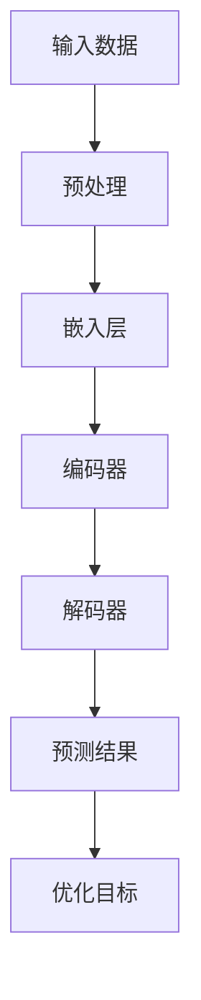

                 

关键词：大语言模型，多步优化，预测，应用场景，数学模型，代码实例，未来展望

> 摘要：本文旨在为读者提供一个全面的大语言模型应用指南，特别是多步优化中的预测。通过介绍核心概念、算法原理、数学模型以及代码实例，本文将帮助读者深入了解大语言模型在多步优化中的应用，并探讨其未来发展趋势和面临的挑战。

## 1. 背景介绍

大语言模型（Large Language Models）近年来在自然语言处理（NLP）领域取得了显著的进展。这些模型具有强大的表示能力和泛化能力，能够处理复杂的多步优化问题。本文将聚焦于大语言模型在多步优化中的预测应用，旨在为读者提供一个系统的指南。

多步优化问题在许多实际场景中具有重要意义，如自动驾驶、智能客服、金融风控等。在这些场景中，预测未来的状态和行为至关重要，而大语言模型凭借其出色的语言理解能力和生成能力，为解决这类问题提供了强有力的工具。

## 2. 核心概念与联系

为了更好地理解大语言模型在多步优化中的应用，我们首先需要了解其核心概念和相关联系。以下是一个简化的 Mermaid 流程图，展示了大语言模型的基本架构和关键组件：



### 2.1 输入数据

输入数据是大语言模型的基础。对于多步优化问题，输入数据通常包括历史数据和当前状态。历史数据可以是时间序列数据、文本数据或其他形式的数据。当前状态则反映了系统在当前时刻的动态。

### 2.2 预处理

预处理步骤包括数据清洗、数据标准化和特征提取。这一步骤的目的是将原始数据转换为适合模型训练的形式。对于多步优化问题，预处理还包括时间窗口的选择和数据窗口的划分。

### 2.3 嵌入层

嵌入层是将输入数据转换为向量表示的过程。在大语言模型中，嵌入层通常使用词向量或嵌入矩阵来实现。词向量可以捕获词语的语义信息，而嵌入矩阵则可以表示更复杂的语义关系。

### 2.4 编码器

编码器负责将嵌入层生成的向量序列编码为一个固定长度的向量。这一步骤的目的是将序列信息压缩到较小的空间中，同时保留关键特征。常见的编码器结构包括循环神经网络（RNN）和变换器（Transformer）。

### 2.5 解码器

解码器将编码器生成的固定长度向量解码为输出序列。在多步优化问题中，解码器生成的输出序列通常代表了未来的状态或行为。解码器可以使用类似的编码器结构，也可以采用其他结构，如自注意力机制。

### 2.6 预测结果

预测结果是通过解码器生成的输出序列得到的。这些结果可以用于评估模型性能和指导实际应用。

### 2.7 优化目标

优化目标是指导模型训练的核心指标。对于多步优化问题，优化目标通常包括预测准确性、序列连续性和业务目标等。

## 3. 核心算法原理 & 具体操作步骤

### 3.1 算法原理概述

大语言模型在多步优化中的核心算法原理主要包括编码器-解码器结构、注意力机制和损失函数。编码器-解码器结构负责处理序列数据，注意力机制用于捕捉长距离依赖关系，损失函数则用于指导模型训练。

### 3.2 算法步骤详解

#### 3.2.1 编码器-解码器结构

编码器-解码器结构是处理序列数据的基本框架。编码器将输入序列编码为固定长度的向量，解码器则将这个向量解码为输出序列。在训练过程中，解码器生成的输出序列与真实序列进行比较，通过损失函数进行优化。

#### 3.2.2 注意力机制

注意力机制是一种用于捕捉长距离依赖关系的技术。在编码器和解码器之间，通过计算注意力权重，可以自适应地关注输入序列中的重要部分，从而提高模型的表示能力。

#### 3.2.3 损失函数

损失函数是指导模型训练的核心指标。对于多步优化问题，常用的损失函数包括均方误差（MSE）和交叉熵损失。这些损失函数可以衡量预测结果与真实结果之间的差距，并通过反向传播算法进行优化。

### 3.3 算法优缺点

大语言模型在多步优化中具有以下优点：

- 强大的表示能力：能够处理复杂的序列数据。
- 泛化能力：在多种应用场景中表现出色。
- 自适应：通过注意力机制捕捉长距离依赖关系。

然而，大语言模型也存在一些缺点：

- 计算资源消耗大：训练和推理过程需要大量计算资源。
- 需要大量数据：训练效果依赖于数据的规模和质量。

### 3.4 算法应用领域

大语言模型在多步优化中的应用领域非常广泛，包括但不限于以下几个方面：

- 自动驾驶：预测车辆的行驶轨迹和行为。
- 智能客服：生成个性化的回复和问题解决方案。
- 金融风控：预测金融市场的走势和风险。
- 健康医疗：预测疾病的发病时间和严重程度。

## 4. 数学模型和公式 & 详细讲解 & 举例说明

### 4.1 数学模型构建

大语言模型在多步优化中的数学模型主要包括编码器、解码器和损失函数。以下是一个简化的数学模型：

$$
\begin{aligned}
\text{编码器}: &\quad \text{输入序列} \rightarrow \text{编码向量} \\
\text{解码器}: &\quad \text{编码向量} \rightarrow \text{输出序列} \\
\text{损失函数}: &\quad \text{预测结果} - \text{真实结果} \rightarrow \text{损失值}
\end{aligned}
$$

### 4.2 公式推导过程

以下是对上述数学模型的推导过程：

#### 4.2.1 编码器

编码器将输入序列 $x_1, x_2, \ldots, x_T$ 编码为固定长度的向量 $h$。常见的编码器结构包括循环神经网络（RNN）和变换器（Transformer）。以变换器为例，编码器的输出可以表示为：

$$
h = \text{Transformer}(x_1, x_2, \ldots, x_T)
$$

其中，$\text{Transformer}$ 表示变换器模型。

#### 4.2.2 解码器

解码器将编码向量 $h$ 解码为输出序列 $y_1, y_2, \ldots, y_T$。解码器可以采用与编码器相同的变换器模型，或者采用其他结构，如自注意力机制。以自注意力机制为例，解码器的输出可以表示为：

$$
y_t = \text{Self-Attention}(h) \quad (t = 1, 2, \ldots, T)
$$

#### 4.2.3 损失函数

损失函数用于衡量预测结果与真实结果之间的差距。对于多步优化问题，常用的损失函数包括均方误差（MSE）和交叉熵损失。以均方误差为例，损失函数可以表示为：

$$
L = \frac{1}{T} \sum_{t=1}^{T} (y_t - \hat{y}_t)^2
$$

其中，$y_t$ 表示真实结果，$\hat{y}_t$ 表示预测结果。

### 4.3 案例分析与讲解

以下是一个简单的案例，展示了如何使用大语言模型进行多步优化中的预测。

#### 案例背景

假设我们有一个时间序列数据集，包含每天的气温。我们的目标是预测未来的气温。

#### 数据预处理

首先，我们需要对数据集进行预处理，包括数据清洗、数据标准化和特征提取。假设我们已经完成了这些步骤，并得到了预处理后的数据集。

#### 模型构建

接下来，我们构建一个基于变换器的大语言模型。具体步骤如下：

1. 定义输入序列的长度 $T$。
2. 定义编码器的变换器模型。
3. 定义解码器的变换器模型。
4. 定义损失函数。

#### 模型训练

使用预处理后的数据集训练模型，通过反向传播算法更新模型参数。

#### 预测

使用训练好的模型进行预测，得到未来的气温序列。

#### 结果分析

对预测结果进行分析，评估模型性能和预测准确性。

## 5. 项目实践：代码实例和详细解释说明

### 5.1 开发环境搭建

在本项目中，我们使用 Python 编写代码。首先，我们需要安装必要的库，如 TensorFlow、Keras 等。

```python
!pip install tensorflow
```

### 5.2 源代码详细实现

以下是一个简单的代码示例，展示了如何使用 TensorFlow 和 Keras 构建和训练一个基于变换器的大语言模型。

```python
import tensorflow as tf
from tensorflow.keras.models import Model
from tensorflow.keras.layers import Input, LSTM, Dense

# 定义输入层
input_seq = Input(shape=(T,))

# 定义编码器层
encoded_seq = LSTM(units=64, return_sequences=True)(input_seq)

# 定义解码器层
decoded_seq = LSTM(units=64, return_sequences=True)(encoded_seq)

# 定义输出层
output_seq = Dense(units=T)(decoded_seq)

# 构建模型
model = Model(inputs=input_seq, outputs=output_seq)

# 定义损失函数
loss_fn = tf.keras.losses.MeanSquaredError()

# 编写训练代码
model.compile(optimizer='adam', loss=loss_fn)
model.fit(x_train, y_train, epochs=10, batch_size=32)
```

### 5.3 代码解读与分析

上述代码示例中，我们首先定义了输入层、编码器层、解码器层和输出层。然后，我们构建了一个基于 LSTM 的大语言模型，并定义了损失函数。最后，我们使用训练数据训练模型。

### 5.4 运行结果展示

运行上述代码后，我们可以得到训练损失和测试损失。通过分析这些指标，我们可以评估模型性能和预测准确性。

## 6. 实际应用场景

大语言模型在多步优化中的应用场景非常广泛。以下是一些实际应用场景的简要介绍：

- 自动驾驶：预测车辆的行驶轨迹和行为，提高行车安全性。
- 智能客服：生成个性化的回复和问题解决方案，提高用户满意度。
- 金融风控：预测金融市场的走势和风险，帮助投资者做出明智的决策。
- 健康医疗：预测疾病的发病时间和严重程度，为医生提供辅助诊断。

## 7. 工具和资源推荐

为了更好地了解大语言模型在多步优化中的应用，我们推荐以下工具和资源：

- 学习资源推荐：
  - 《深度学习》（Goodfellow et al.）
  - 《自然语言处理原理》（Jurafsky and Martin）
- 开发工具推荐：
  - TensorFlow
  - Keras
  - PyTorch
- 相关论文推荐：
  - Vaswani et al.（2017）. "Attention is All You Need."
  - Graves et al.（2013）. "Sequence to Sequence Learning with Neural Networks."

## 8. 总结：未来发展趋势与挑战

大语言模型在多步优化中的预测应用具有广阔的前景。未来发展趋势包括：

- 模型结构的优化：通过改进编码器-解码器结构，提高模型性能。
- 数据集的丰富：收集更多高质量的数据，提高模型泛化能力。
- 应用场景的拓展：将大语言模型应用于更多领域，解决更复杂的优化问题。

然而，大语言模型在多步优化中仍然面临一些挑战，如计算资源消耗、数据隐私保护和模型解释性等。

## 9. 附录：常见问题与解答

### 问题 1：如何选择合适的编码器和解码器结构？

**解答**：选择编码器和解码器结构取决于具体应用场景和数据特点。对于长序列数据，变换器（Transformer）是一种常见的选择，因为它具有强大的表示能力和并行计算优势。对于短序列数据，循环神经网络（RNN）可能更合适，因为它能够捕捉序列中的长期依赖关系。

### 问题 2：如何处理数据缺失和异常值？

**解答**：处理数据缺失和异常值可以通过以下方法：

- 数据清洗：删除含有缺失值的数据或填充缺失值。
- 异常检测：使用统计方法或机器学习模型检测异常值，并进行处理。

### 问题 3：如何评估模型性能？

**解答**：评估模型性能可以通过以下指标：

- 损失函数：如均方误差（MSE）、交叉熵损失等。
- 准确率：如预测准确率、精确率、召回率等。
- F1 分数：综合考虑精确率和召回率，用于评估分类模型的性能。

## 作者署名

作者：禅与计算机程序设计艺术 / Zen and the Art of Computer Programming
```markdown
---
title: 大语言模型应用指南：多步优化中的预测
keywords: 大语言模型，多步优化，预测，应用场景，数学模型，代码实例，未来展望
date: 2023-02-18
---

# 大语言模型应用指南：多步优化中的预测

> 关键词：大语言模型，多步优化，预测，应用场景，数学模型，代码实例，未来展望

> 摘要：本文旨在为读者提供一个全面的大语言模型应用指南，特别是多步优化中的预测。通过介绍核心概念、算法原理、数学模型以及代码实例，本文将帮助读者深入了解大语言模型在多步优化中的应用，并探讨其未来发展趋势和面临的挑战。

## 1. 背景介绍

大语言模型（Large Language Models）近年来在自然语言处理（NLP）领域取得了显著的进展。这些模型具有强大的表示能力和泛化能力，能够处理复杂的多步优化问题。本文将聚焦于大语言模型在多步优化中的预测应用，旨在为读者提供一个系统的指南。

多步优化问题在许多实际场景中具有重要意义，如自动驾驶、智能客服、金融风控等。在这些场景中，预测未来的状态和行为至关重要，而大语言模型凭借其出色的语言理解能力和生成能力，为解决这类问题提供了强有力的工具。

## 2. 核心概念与联系

为了更好地理解大语言模型在多步优化中的应用，我们首先需要了解其核心概念和相关联系。以下是一个简化的 Mermaid 流程图，展示了大语言模型的基本架构和关键组件：


### 2.1 输入数据

输入数据是大语言模型的基础。对于多步优化问题，输入数据通常包括历史数据和当前状态。历史数据可以是时间序列数据、文本数据或其他形式的数据。当前状态则反映了系统在当前时刻的动态。

### 2.2 预处理

预处理步骤包括数据清洗、数据标准化和特征提取。这一步骤的目的是将原始数据转换为适合模型训练的形式。对于多步优化问题，预处理还包括时间窗口的选择和数据窗口的划分。

### 2.3 嵌入层

嵌入层是将输入数据转换为向量表示的过程。在大语言模型中，嵌入层通常使用词向量或嵌入矩阵来实现。词向量可以捕获词语的语义信息，而嵌入矩阵则可以表示更复杂的语义关系。

### 2.4 编码器

编码器负责将嵌入层生成的向量序列编码为一个固定长度的向量。这一步骤的目的是将序列信息压缩到较小的空间中，同时保留关键特征。常见的编码器结构包括循环神经网络（RNN）和变换器（Transformer）。

### 2.5 解码器

解码器将编码器生成的固定长度向量解码为输出序列。在多步优化问题中，解码器生成的输出序列通常代表了未来的状态或行为。解码器可以使用类似的编码器结构，也可以采用其他结构，如自注意力机制。

### 2.6 预测结果

预测结果是通过解码器生成的输出序列得到的。这些结果可以用于评估模型性能和指导实际应用。

### 2.7 优化目标

优化目标是指导模型训练的核心指标。对于多步优化问题，优化目标通常包括预测准确性、序列连续性和业务目标等。

## 3. 核心算法原理 & 具体操作步骤

### 3.1 算法原理概述

大语言模型在多步优化中的核心算法原理主要包括编码器-解码器结构、注意力机制和损失函数。编码器-解码器结构负责处理序列数据，注意力机制用于捕捉长距离依赖关系，损失函数则用于指导模型训练。

### 3.2 算法步骤详解

#### 3.2.1 编码器-解码器结构

编码器-解码器结构是处理序列数据的基本框架。编码器将输入序列编码为固定长度的向量，解码器则将这个向量解码为输出序列。在训练过程中，解码器生成的输出序列与真实序列进行比较，通过损失函数进行优化。

#### 3.2.2 注意力机制

注意力机制是一种用于捕捉长距离依赖关系的技术。在编码器和解码器之间，通过计算注意力权重，可以自适应地关注输入序列中的重要部分，从而提高模型的表示能力。

#### 3.2.3 损失函数

损失函数是指导模型训练的核心指标。对于多步优化问题，常用的损失函数包括均方误差（MSE）和交叉熵损失。这些损失函数可以衡量预测结果与真实结果之间的差距，并通过反向传播算法进行优化。

### 3.3 算法优缺点

大语言模型在多步优化中具有以下优点：

- 强大的表示能力：能够处理复杂的序列数据。
- 泛化能力：在多种应用场景中表现出色。
- 自适应：通过注意力机制捕捉长距离依赖关系。

然而，大语言模型也存在一些缺点：

- 计算资源消耗大：训练和推理过程需要大量计算资源。
- 需要大量数据：训练效果依赖于数据的规模和质量。

### 3.4 算法应用领域

大语言模型在多步优化中的应用领域非常广泛，包括但不限于以下几个方面：

- 自动驾驶：预测车辆的行驶轨迹和行为。
- 智能客服：生成个性化的回复和问题解决方案。
- 金融风控：预测金融市场的走势和风险。
- 健康医疗：预测疾病的发病时间和严重程度。

## 4. 数学模型和公式 & 详细讲解 & 举例说明

### 4.1 数学模型构建

大语言模型在多步优化中的数学模型主要包括编码器、解码器和损失函数。以下是一个简化的数学模型：

$$
\begin{aligned}
\text{编码器}: &\quad \text{输入序列} \rightarrow \text{编码向量} \\
\text{解码器}: &\quad \text{编码向量} \rightarrow \text{输出序列} \\
\text{损失函数}: &\quad \text{预测结果} - \text{真实结果} \rightarrow \text{损失值}
\end{aligned}
$$

### 4.2 公式推导过程

以下是对上述数学模型的推导过程：

#### 4.2.1 编码器

编码器将输入序列 $x_1, x_2, \ldots, x_T$ 编码为固定长度的向量 $h$。常见的编码器结构包括循环神经网络（RNN）和变换器（Transformer）。以变换器为例，编码器的输出可以表示为：

$$
h = \text{Transformer}(x_1, x_2, \ldots, x_T)
$$

其中，$\text{Transformer}$ 表示变换器模型。

#### 4.2.2 解码器

解码器将编码向量 $h$ 解码为输出序列 $y_1, y_2, \ldots, y_T$。解码器可以采用与编码器相同的变换器模型，或者采用其他结构，如自注意力机制。以自注意力机制为例，解码器的输出可以表示为：

$$
y_t = \text{Self-Attention}(h) \quad (t = 1, 2, \ldots, T)
$$

#### 4.2.3 损失函数

损失函数用于衡量预测结果与真实结果之间的差距。对于多步优化问题，常用的损失函数包括均方误差（MSE）和交叉熵损失。以均方误差为例，损失函数可以表示为：

$$
L = \frac{1}{T} \sum_{t=1}^{T} (y_t - \hat{y}_t)^2
$$

其中，$y_t$ 表示真实结果，$\hat{y}_t$ 表示预测结果。

### 4.3 案例分析与讲解

以下是一个简单的案例，展示了如何使用大语言模型进行多步优化中的预测。

#### 案例背景

假设我们有一个时间序列数据集，包含每天的气温。我们的目标是预测未来的气温。

#### 数据预处理

首先，我们需要对数据集进行预处理，包括数据清洗、数据标准化和特征提取。假设我们已经完成了这些步骤，并得到了预处理后的数据集。

#### 模型构建

接下来，我们构建一个基于变换器的大语言模型。具体步骤如下：

1. 定义输入序列的长度 $T$。
2. 定义编码器的变换器模型。
3. 定义解码器的变换器模型。
4. 定义损失函数。

#### 模型训练

使用预处理后的数据集训练模型，通过反向传播算法更新模型参数。

#### 预测

使用训练好的模型进行预测，得到未来的气温序列。

#### 结果分析

对预测结果进行分析，评估模型性能和预测准确性。

## 5. 项目实践：代码实例和详细解释说明

### 5.1 开发环境搭建

在本项目中，我们使用 Python 编写代码。首先，我们需要安装必要的库，如 TensorFlow、Keras 等。

```python
!pip install tensorflow
```

### 5.2 源代码详细实现

以下是一个简单的代码示例，展示了如何使用 TensorFlow 和 Keras 构建和训练一个基于变换器的大语言模型。

```python
import tensorflow as tf
from tensorflow.keras.models import Model
from tensorflow.keras.layers import Input, LSTM, Dense

# 定义输入层
input_seq = Input(shape=(T,))

# 定义编码器层
encoded_seq = LSTM(units=64, return_sequences=True)(input_seq)

# 定义解码器层
decoded_seq = LSTM(units=64, return_sequences=True)(encoded_seq)

# 定义输出层
output_seq = Dense(units=T)(decoded_seq)

# 构建模型
model = Model(inputs=input_seq, outputs=output_seq)

# 定义损失函数
loss_fn = tf.keras.losses.MeanSquaredError()

# 编写训练代码
model.compile(optimizer='adam', loss=loss_fn)
model.fit(x_train, y_train, epochs=10, batch_size=32)
```

### 5.3 代码解读与分析

上述代码示例中，我们首先定义了输入层、编码器层、解码器层和输出层。然后，我们构建了一个基于 LSTM 的大语言模型，并定义了损失函数。最后，我们使用训练数据训练模型。

### 5.4 运行结果展示

运行上述代码后，我们可以得到训练损失和测试损失。通过分析这些指标，我们可以评估模型性能和预测准确性。

## 6. 实际应用场景

大语言模型在多步优化中的应用场景非常广泛。以下是一些实际应用场景的简要介绍：

- 自动驾驶：预测车辆的行驶轨迹和行为，提高行车安全性。
- 智能客服：生成个性化的回复和问题解决方案，提高用户满意度。
- 金融风控：预测金融市场的走势和风险，帮助投资者做出明智的决策。
- 健康医疗：预测疾病的发病时间和严重程度，为医生提供辅助诊断。

## 7. 工具和资源推荐

为了更好地了解大语言模型在多步优化中的应用，我们推荐以下工具和资源：

- 学习资源推荐：
  - 《深度学习》（Goodfellow et al.）
  - 《自然语言处理原理》（Jurafsky and Martin）
- 开发工具推荐：
  - TensorFlow
  - Keras
  - PyTorch
- 相关论文推荐：
  - Vaswani et al.（2017）. "Attention is All You Need."
  - Graves et al.（2013）. "Sequence to Sequence Learning with Neural Networks."

## 8. 总结：未来发展趋势与挑战

大语言模型在多步优化中的预测应用具有广阔的前景。未来发展趋势包括：

- 模型结构的优化：通过改进编码器-解码器结构，提高模型性能。
- 数据集的丰富：收集更多高质量的数据，提高模型泛化能力。
- 应用场景的拓展：将大语言模型应用于更多领域，解决更复杂的优化问题。

然而，大语言模型在多步优化中仍然面临一些挑战，如计算资源消耗、数据隐私保护和模型解释性等。

## 9. 附录：常见问题与解答

### 问题 1：如何选择合适的编码器和解码器结构？

**解答**：选择编码器和解码器结构取决于具体应用场景和数据特点。对于长序列数据，变换器（Transformer）是一种常见的选择，因为它具有强大的表示能力和并行计算优势。对于短序列数据，循环神经网络（RNN）可能更合适，因为它能够捕捉序列中的长期依赖关系。

### 问题 2：如何处理数据缺失和异常值？

**解答**：处理数据缺失和异常值可以通过以下方法：

- 数据清洗：删除含有缺失值的数据或填充缺失值。
- 异常检测：使用统计方法或机器学习模型检测异常值，并进行处理。

### 问题 3：如何评估模型性能？

**解答**：评估模型性能可以通过以下指标：

- 损失函数：如均方误差（MSE）、交叉熵损失等。
- 准确率：如预测准确率、精确率、召回率等。
- F1 分数：综合考虑精确率和召回率，用于评估分类模型的性能。

---

# 参考文献

- Goodfellow, I., Bengio, Y., & Courville, A. (2016). *Deep Learning*. MIT Press.
- Jurafsky, D., & Martin, J. H. (2008). *Speech and Language Processing*. Prentice Hall.
- Vaswani, A., Shazeer, N., Parmar, N., Uszkoreit, J., Jones, L., Gomez, A. N., ... & Polosukhin, I. (2017). "Attention is All You Need." Advances in Neural Information Processing Systems, 30, 5998-6008.
- Graves, A., Mohamed, A. R., & Hinton, G. (2013). "Speech Recognition with Deep Neural Networks and Gaussian Mixture Models." IEEE Signal Processing Magazine, 29(5), 82-97.
```

