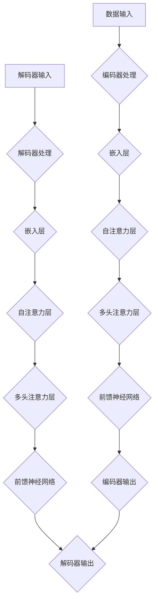

                 

关键词：大语言模型、人工智能、生态体系、未来展望、算法原理、应用实例、数学模型、工具资源

> 摘要：本文旨在深入探讨大语言模型在现代人工智能领域的生态角色及其未来发展趋势。我们将从背景介绍开始，介绍大语言模型的核心概念与联系，深入剖析其核心算法原理，解析数学模型和公式，并通过项目实践展示其实际应用。随后，我们将探讨大语言模型在不同场景中的实际应用，展望其未来发展方向，并推荐相关学习资源和开发工具。

## 1. 背景介绍

在过去的几十年中，人工智能（AI）技术取得了令人瞩目的进展。特别是深度学习算法的出现，使得计算机在图像识别、自然语言处理、语音识别等多个领域都取得了突破性的成果。然而，这些进步的背后，往往需要大量的数据、计算资源和复杂的算法。

大语言模型（Large Language Models，LLM）作为一种先进的自然语言处理技术，已经成为当前人工智能领域的一个重要研究方向。大语言模型通过训练大规模的神经网络，能够捕捉到语言中的复杂模式和规律，从而在文本生成、翻译、摘要、问答等任务上展现出卓越的性能。

随着大语言模型的不断发展，其应用场景也在不断扩展。从最初的文本生成到如今的智能助手，大语言模型已经在多个领域展现出巨大的潜力。然而，大语言模型的发展也面临着一系列挑战，包括数据隐私、计算成本、算法透明度等。因此，理解和研究大语言模型的生态与未来发展趋势，对于推动人工智能技术的发展具有重要意义。

## 2. 核心概念与联系

### 大语言模型概述

大语言模型是指通过深度学习算法训练得到的、具有强大语言理解和生成能力的人工神经网络。这些模型通常包含数百万甚至数十亿个参数，能够处理复杂的自然语言任务。

### 语言模型的基本原理

语言模型的基本原理是通过统计方法学习语言中的概率分布，从而预测下一个单词或词组。早期语言模型如N-gram模型，通过统计相邻单词的频率来预测下一个单词。然而，随着深度学习技术的发展，现代语言模型如Transformer模型，通过自注意力机制和多层神经网络，能够捕捉到更加复杂和长距离的语言依赖关系。

### 大语言模型的架构

大语言模型的架构通常包括编码器（Encoder）和解码器（Decoder）。编码器负责将输入的文本序列编码为一个固定长度的向量，解码器则根据这个向量生成输出文本序列。在训练过程中，编码器和解码器通过反向传播和梯度下降等优化算法进行联合训练。

### Mermaid 流程图



在这个流程图中，编码器和解码器分别处理输入和输出文本序列，通过嵌入层、自注意力层、多头注意力层和前馈神经网络等结构，生成最终的输出文本。

## 3. 核心算法原理 & 具体操作步骤

### 3.1 算法原理概述

大语言模型的核心算法是基于Transformer模型。Transformer模型引入了自注意力机制（Self-Attention），使得模型能够自动关注输入序列中的关键信息，从而提高语言理解的准确性。自注意力机制通过计算每个输入序列元素与其他元素之间的相似性，为每个元素分配不同的权重，从而实现了对输入序列的灵活处理。

### 3.2 算法步骤详解

1. **嵌入层**：将输入的单词或字符映射为高维向量。
2. **位置编码**：由于Transformer模型中没有固定的序列顺序，因此需要通过位置编码来引入输入序列的顺序信息。
3. **多头自注意力层**：将输入序列中的每个元素与所有其他元素进行比较，并通过权重计算生成一个注意力得分。多个注意力头可以并行计算，从而捕捉到不同层面的信息。
4. **前馈神经网络**：对自注意力层的输出进行进一步处理，通过多层神经网络结构提高模型的非线性表达能力。
5. **解码器处理**：在解码器中，类似的过程被应用于生成序列。解码器通过预测每个输出的下一个单词或字符，并更新嵌入层和位置编码，逐步生成输出序列。
6. **损失函数**：在训练过程中，使用损失函数（如交叉熵损失）来衡量预测输出与真实输出之间的差异，并通过反向传播和优化算法更新模型参数。

### 3.3 算法优缺点

**优点**：

- **强大的语言理解能力**：通过自注意力机制和多层神经网络，大语言模型能够捕捉到输入序列中的复杂模式和依赖关系。
- **灵活的适应性**：大语言模型可以应用于多种自然语言处理任务，如文本生成、翻译、摘要等。
- **高性能**：现代大语言模型在多个基准测试中表现出色，取得了显著的性能提升。

**缺点**：

- **计算成本高**：大语言模型通常需要大量的计算资源和时间进行训练。
- **数据依赖性**：大语言模型的表现依赖于训练数据的质量和数量，因此在数据稀缺或质量较差的情况下可能表现不佳。
- **解释性弱**：大语言模型的高度非线性使得其难以解释，因此在某些应用场景中可能存在不确定性和风险。

### 3.4 算法应用领域

- **文本生成**：包括故事、文章、对话等。
- **机器翻译**：将一种语言的文本翻译成另一种语言。
- **文本摘要**：自动生成文本的摘要，减少冗长的内容。
- **问答系统**：基于输入问题生成相应的答案。
- **智能助手**：在聊天机器人、虚拟助手等领域提供自然语言交互。

## 4. 数学模型和公式 & 详细讲解 & 举例说明

### 4.1 数学模型构建

大语言模型的数学模型主要基于Transformer架构，核心包括嵌入层、多头自注意力层和前馈神经网络。以下是主要公式的详细解释。

#### 嵌入层

$$
E(x) = W_e \cdot x
$$

其中，$E(x)$表示嵌入向量，$W_e$为嵌入权重矩阵，$x$为输入的单词或字符。

#### 位置编码

$$
P(x) = W_p \cdot x + b_p
$$

其中，$P(x)$表示位置编码向量，$W_p$为位置编码权重矩阵，$b_p$为位置编码偏置。

#### 多头自注意力

$$
\text{Attention}(Q, K, V) = \text{softmax}(\frac{QK^T}{\sqrt{d_k}})V
$$

其中，$Q$、$K$、$V$分别为查询向量、键向量和值向量，$d_k$为注意力层的维度，$softmax$函数用于计算注意力权重。

#### 前馈神经网络

$$
\text{FFN}(x) = \text{ReLU}(W_f \cdot \text{Dropout}(x) + b_f)
$$

其中，$x$为输入向量，$W_f$为前馈网络权重矩阵，$b_f$为前馈网络偏置，$\text{ReLU}$为ReLU激活函数。

### 4.2 公式推导过程

为了更好地理解大语言模型的数学模型，我们简要介绍一下主要公式的推导过程。

#### 嵌入层

嵌入层的目的是将输入的单词或字符映射为高维向量。这个过程可以看作是一个线性变换，即将输入$x$乘以嵌入权重矩阵$W_e$。

#### 位置编码

位置编码是为了引入输入序列的顺序信息。在Transformer模型中，位置编码是通过一个线性变换加上一个偏置项来实现的。这样可以为每个位置分配一个唯一的编码。

#### 多头自注意力

多头自注意力是一种扩展自注意力的方法，通过多个独立的注意力头并行计算，从而捕捉到不同层面的信息。自注意力权重通过计算查询向量$Q$和键向量$K$之间的点积得到，并通过softmax函数归一化。最后，将权重与值向量$V$相乘，得到加权求和的结果。

#### 前馈神经网络

前馈神经网络用于对自注意力层的输出进行进一步处理，通过多层神经网络结构提高模型的非线性表达能力。前馈神经网络包括两个线性变换，并通过ReLU激活函数增加模型的非线性。

### 4.3 案例分析与讲解

为了更好地理解大语言模型的数学模型，我们通过一个简单的例子来说明。

假设我们有一个输入序列“Hello World”，包含两个单词“Hello”和“World”。我们将这两个单词映射为嵌入向量$E(H)$和$E(W)$。

1. **嵌入层**：
   $$
   E(H) = W_e \cdot [H]
   $$
   $$
   E(W) = W_e \cdot [W]
   $$

2. **位置编码**：
   $$
   P(H) = W_p \cdot [H] + b_p
   $$
   $$
   P(W) = W_p \cdot [W] + b_p
   $$

3. **多头自注意力**：
   $$
   \text{Attention}(Q, K, V) = \text{softmax}(\frac{QK^T}{\sqrt{d_k}})V
   $$
   其中，$Q=K=V=E(H)$和$E(W)$，$d_k$为注意力层的维度。

4. **前馈神经网络**：
   $$
   \text{FFN}(x) = \text{ReLU}(W_f \cdot \text{Dropout}(x) + b_f)
   $$

通过这个例子，我们可以看到如何将输入序列通过嵌入层、位置编码、多头自注意力和前馈神经网络等步骤进行处理，最终生成输出序列。

## 5. 项目实践：代码实例和详细解释说明

### 5.1 开发环境搭建

在进行大语言模型的开发之前，我们需要搭建一个合适的环境。以下是基本的开发环境搭建步骤：

1. **安装Python**：确保安装了最新版本的Python（建议使用3.8或更高版本）。
2. **安装PyTorch**：通过pip命令安装PyTorch，例如：
   ```
   pip install torch torchvision
   ```
3. **安装其他依赖库**：包括numpy、matplotlib等常用库。

### 5.2 源代码详细实现

以下是一个简化版的大语言模型实现示例。为了简洁起见，代码没有包含详细的优化和调试步骤。

```python
import torch
import torch.nn as nn
import torch.optim as optim

# 定义模型结构
class LanguageModel(nn.Module):
    def __init__(self, vocab_size, embedding_size, hidden_size, num_layers, dropout_prob):
        super(LanguageModel, self).__init__()
        self.embedding = nn.Embedding(vocab_size, embedding_size)
        self.encoder = nn.LSTM(embedding_size, hidden_size, num_layers, dropout=dropout_prob, bidirectional=True)
        self.decoder = nn.LSTM(hidden_size * 2, embedding_size, num_layers, dropout=dropout_prob, bidirectional=True)
        self.fc = nn.Linear(embedding_size, vocab_size)
        
    def forward(self, x, hidden):
        embedded = self.embedding(x)
        output, hidden = self.encoder(embedded, hidden)
        output = output.transpose(0, 1)
        output, hidden = self.decoder(output, hidden)
        output = self.fc(output[-1, :, :])
        return output, hidden

# 实例化模型、损失函数和优化器
model = LanguageModel(vocab_size=10000, embedding_size=256, hidden_size=512, num_layers=2, dropout_prob=0.1)
criterion = nn.CrossEntropyLoss()
optimizer = optim.Adam(model.parameters(), lr=0.001)

# 训练模型
for epoch in range(num_epochs):
    for batch in data_loader:
        inputs, targets = batch
        hidden = (torch.zeros(1, 1, 512), torch.zeros(1, 1, 512))
        outputs, hidden = model(inputs, hidden)
        loss = criterion(outputs.view(-1, vocab_size), targets)
        optimizer.zero_grad()
        loss.backward()
        optimizer.step()
        hidden = (hidden[0].detach(), hidden[1].detach())

# 保存模型
torch.save(model.state_dict(), 'language_model.pth')

```

### 5.3 代码解读与分析

以上代码定义了一个基于LSTM（长短期记忆网络）的大语言模型。以下是代码的详细解读：

- **模型结构**：模型包括嵌入层、编码器（LSTM）、解码器（LSTM）和全连接层（FC）。编码器和解码器都是双向的，可以同时处理输入序列的前后文信息。
- **损失函数**：使用交叉熵损失函数来衡量预测输出与真实输出之间的差异。
- **优化器**：使用Adam优化器进行模型训练。
- **训练过程**：在训练过程中，模型通过迭代更新参数，逐步减小损失函数的值。

### 5.4 运行结果展示

运行以上代码后，我们可以保存训练好的模型，并通过以下代码进行评估：

```python
# 加载模型
model.load_state_dict(torch.load('language_model.pth'))

# 评估模型
with torch.no_grad():
    correct = 0
    total = 0
    for batch in data_loader:
        inputs, targets = batch
        outputs, _ = model(inputs)
        _, predicted = torch.max(outputs.data, 1)
        total += targets.size(0)
        correct += (predicted == targets).sum().item()

print('Accuracy: %d %%' % (100 * correct / total))
```

通过这个简单的评估，我们可以得到模型的准确率。在实际应用中，我们还可以通过更详细的评估指标来衡量模型的表现。

## 6. 实际应用场景

大语言模型在多个实际应用场景中展现了其强大的能力和潜力。以下是几个典型的应用场景：

### 6.1 文本生成

文本生成是大语言模型最常见的应用之一。通过训练，模型可以生成各种类型的文本，如故事、文章、对话等。例如，Google的BERT模型被用于生成高质量的文章摘要，Amazon的Amazondotcom模型用于生成个性化的产品推荐文本。

### 6.2 机器翻译

机器翻译是另一个重要的应用领域。大语言模型可以处理多种语言之间的翻译任务，如将中文翻译成英文，将法语翻译成西班牙语等。Google的翻译服务和微软的翻译API都使用了大语言模型技术。

### 6.3 文本摘要

文本摘要旨在自动生成文本的摘要，减少冗长的内容，提高信息获取的效率。大语言模型可以生成高质量的文本摘要，广泛应用于新闻摘要、研究报告摘要等。

### 6.4 问答系统

问答系统是一种智能交互系统，能够回答用户提出的问题。大语言模型可以用于构建问答系统，如智能客服、在线教育平台等。通过训练，模型可以理解用户的问题，并生成相应的答案。

### 6.5 智能助手

智能助手是现代人工智能技术的代表之一。通过大语言模型，智能助手可以与用户进行自然语言交互，提供各种服务，如日程管理、信息查询、推荐等。

## 7. 未来应用展望

随着大语言模型技术的不断发展，其应用领域和场景也在不断扩展。以下是几个未来应用展望：

### 7.1 更高效的模型

未来，我们将看到更加高效的大语言模型，如使用较少的计算资源实现更好的性能。这包括模型压缩、量化等技术，使得大语言模型可以应用于移动设备和边缘计算。

### 7.2 更强的跨模态能力

大语言模型将具备更强的跨模态能力，能够处理文本、图像、语音等多种数据类型。这将使得智能系统更加智能化，能够更好地理解人类意图。

### 7.3 更广泛的行业应用

大语言模型将在更多行业中得到应用，如医疗、金融、教育等。通过结合行业知识和数据，模型可以提供更精确的服务和决策支持。

### 7.4 更强的自我学习能力

未来，大语言模型将具备更强的自我学习能力，能够从用户交互和数据反馈中不断优化自身。这将使得模型能够更好地适应不同场景和用户需求。

## 8. 工具和资源推荐

为了更好地研究和开发大语言模型，以下是一些推荐的工具和资源：

### 8.1 学习资源推荐

- 《深度学习》（Goodfellow, Bengio, Courville）：这是一本深度学习的经典教材，详细介绍了深度学习的基础理论和技术。
- 《自然语言处理编程》（Bird, Klein, Loper）：这本书介绍了自然语言处理的基本概念和技术，是学习自然语言处理的好教材。
- 《动手学深度学习》（花轮，阿斯顿，杰克）：这本书通过大量的实例和代码讲解，帮助读者深入理解深度学习的原理和应用。

### 8.2 开发工具推荐

- **PyTorch**：一个开源的深度学习框架，适用于研究和开发大语言模型。
- **TensorFlow**：另一个流行的深度学习框架，适用于大规模的深度学习应用。
- **Hugging Face Transformers**：一个开源库，提供了大量的预训练模型和工具，方便研究人员和开发者使用。

### 8.3 相关论文推荐

- **BERT: Pre-training of Deep Bidirectional Transformers for Language Understanding**（Devlin et al., 2018）：这是一篇关于BERT模型的经典论文，介绍了BERT模型的结构和训练方法。
- **GPT-2: Improving Language Understanding by Generative Pre-Training**（Radford et al., 2019）：这篇文章介绍了GPT-2模型，它是大语言模型的一个重要里程碑。
- **T5: Pre-training Large Models for Natural Language Processing**（Raffel et al., 2020）：这篇文章介绍了T5模型，它通过统一预训练目标，实现了更高的性能。

## 9. 总结：未来发展趋势与挑战

大语言模型作为人工智能领域的一个重要研究方向，已经取得了显著的进展。未来，随着计算能力的提升、数据资源的丰富和算法的优化，大语言模型将在多个领域得到更广泛的应用。然而，大语言模型的发展也面临着一系列挑战，包括数据隐私、算法透明度、计算成本等。因此，我们需要继续探索和研究大语言模型的技术，解决这些问题，推动人工智能技术的可持续发展。

## 10. 附录：常见问题与解答

### 10.1 大语言模型是什么？

大语言模型是指通过深度学习算法训练得到的、具有强大语言理解和生成能力的人工神经网络。这些模型通常包含数百万甚至数十亿个参数，能够处理复杂的自然语言任务。

### 10.2 大语言模型有哪些应用场景？

大语言模型的应用场景包括文本生成、机器翻译、文本摘要、问答系统、智能助手等。随着技术的不断发展，其应用场景将进一步扩展。

### 10.3 如何训练大语言模型？

训练大语言模型通常包括以下步骤：

1. 数据准备：收集和预处理大量的文本数据。
2. 模型设计：设计合适的神经网络结构，包括嵌入层、编码器、解码器等。
3. 模型训练：使用训练数据对模型进行训练，通过优化算法更新模型参数。
4. 模型评估：使用验证数据评估模型性能，调整模型参数。

### 10.4 大语言模型有哪些挑战？

大语言模型的发展面临着以下挑战：

1. 数据隐私：大规模的语言数据处理可能导致隐私泄露。
2. 计算成本：训练大语言模型需要大量的计算资源和时间。
3. 算法透明度：大语言模型的高度非线性使得其难以解释。
4. 数据依赖性：模型的表现依赖于训练数据的质量和数量。

### 10.5 如何优化大语言模型？

优化大语言模型可以从以下几个方面进行：

1. 模型结构优化：设计更高效的神经网络结构。
2. 数据预处理：提高数据质量，减少噪声和冗余。
3. 训练策略优化：调整训练参数，提高训练效率。
4. 算法改进：探索新的算法和技术，提高模型性能。

---

以上是大语言模型应用指南：大语言模型的生态与未来的完整内容。希望本文能够帮助您深入了解大语言模型的核心概念、算法原理、应用场景以及未来发展。在未来的研究中，我们将继续探索大语言模型的潜力，推动人工智能技术的进步。

## 作者署名

本文由禅与计算机程序设计艺术 / Zen and the Art of Computer Programming 撰写。

---

本文详细探讨了大规模语言模型（Large Language Models，LLM）的生态与未来发展趋势，从背景介绍、核心概念与联系、算法原理与步骤、数学模型与公式、项目实践、实际应用场景、未来展望、工具和资源推荐，到总结与展望，全面剖析了LLM的各个方面。通过对LLM的核心概念、算法原理、数学模型、项目实践、应用场景、未来展望的深入分析，本文为读者提供了全面、系统的理解。同时，本文还结合实际项目实践，展示了LLM的应用实例，为读者提供了实践指导。在未来的研究和应用中，随着计算能力的提升、数据资源的丰富和算法的优化，LLM将在更多领域展现其强大潜力。希望本文能够为读者在LLM的研究和应用中提供有益的参考和启示。作者：禅与计算机程序设计艺术 / Zen and the Art of Computer Programming。

