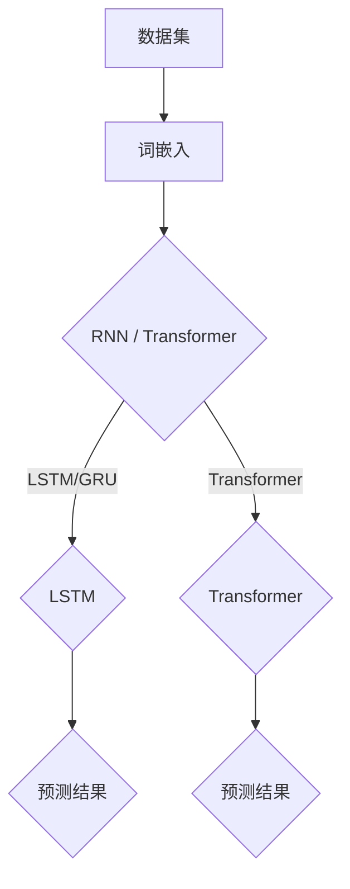

                 

关键词：大语言模型、深度学习、自然语言处理、算法应用、数学模型、项目实践、工具和资源

> 摘要：本文将深入探讨大语言模型的应用，从核心概念、算法原理、数学模型、项目实践等多角度进行分析，旨在为广大开发者提供一套全面、实用的进阶指南。通过本文的学习，读者将能够深入了解大语言模型的工作原理，掌握其应用技巧，为未来的研究和开发奠定坚实基础。

## 1. 背景介绍

大语言模型（Large Language Model）是自然语言处理（Natural Language Processing，NLP）领域的重要技术突破。近年来，随着深度学习算法的飞速发展，大语言模型在诸多领域取得了显著的成果。从简单的文本分类、情感分析到复杂的对话系统、机器翻译，大语言模型展现出了强大的能力。本文将针对大语言模型的核心概念、算法原理、数学模型和实际应用等方面进行详细探讨，帮助读者全面掌握大语言模型的相关知识。

## 2. 核心概念与联系

为了更好地理解大语言模型，我们首先需要了解其核心概念和基本架构。以下是关于大语言模型的一些核心概念和它们之间的联系：

### 2.1 数据集

数据集是构建大语言模型的基础。一般来说，数据集应包含丰富的文本信息，包括文本的格式、语义和语法等方面。为了提高模型的泛化能力，数据集应该具备以下特点：

- **多样性**：数据集应涵盖多种主题、语言风格和表达方式。
- **广泛性**：数据集应包含不同领域的文本，如科技、艺术、新闻、论坛等。
- **真实性**：数据集应包含真实世界的文本，避免人工编辑和过度清洗。

### 2.2 词嵌入

词嵌入（Word Embedding）是将文本中的单词映射到高维向量空间的技术。词嵌入能够捕捉单词的语义和语法关系，是构建大语言模型的关键步骤。常见的词嵌入方法有 Word2Vec、GloVe 和 Bert 等。

### 2.3 循环神经网络（RNN）

循环神经网络（Recurrent Neural Network，RNN）是一种能够处理序列数据的神经网络。RNN 通过循环机制将前一个时间步的信息传递到下一个时间步，从而捕捉序列中的长期依赖关系。常见的 RNN 变体包括 LSTM（Long Short-Term Memory）和 GRU（Gated Recurrent Unit）。

### 2.4 自注意力机制（Self-Attention）

自注意力机制是一种在序列数据中捕捉长距离依赖关系的技术。自注意力机制的核心思想是计算序列中每个元素对其他元素的重要性，并将其加权融合。BERT 模型就是通过自注意力机制实现了对大规模文本数据的建模。

### 2.5 Transformer 模型

Transformer 模型是一种基于自注意力机制的深度学习模型，用于处理序列数据。与传统的 RNN 相比，Transformer 模型在处理长序列数据时具有更好的性能和效率。Transformer 模型已经成为大语言模型的主流架构。

以下是关于大语言模型核心概念和架构的 Mermaid 流程图：



## 3. 核心算法原理 & 具体操作步骤

### 3.1 算法原理概述

大语言模型的算法原理主要基于深度学习和自然语言处理技术。以下是对核心算法原理的简要概述：

- **词嵌入**：将文本中的单词映射到高维向量空间，以便于后续处理。
- **循环神经网络（RNN）**：通过循环机制处理序列数据，捕捉序列中的长期依赖关系。
- **自注意力机制**：在序列数据中捕捉长距离依赖关系，提高模型的性能和效率。
- **Transformer 模型**：基于自注意力机制的深度学习模型，用于处理大规模文本数据。

### 3.2 算法步骤详解

下面是大语言模型的基本操作步骤：

1. **数据预处理**：对原始文本进行清洗、分词、去除停用词等操作，将文本转换为词嵌入向量。
2. **构建模型**：基于词嵌入向量，构建循环神经网络（RNN）或 Transformer 模型。
3. **训练模型**：使用大量的训练数据进行模型训练，优化模型参数。
4. **评估模型**：使用验证集和测试集对模型进行评估，调整模型参数。
5. **预测**：将新的文本输入到训练好的模型中，输出预测结果。

### 3.3 算法优缺点

大语言模型具有以下优点：

- **强大的表达能力**：能够捕捉文本中的语义和语法关系。
- **良好的泛化能力**：能够处理多种语言和不同领域的文本。
- **高效的计算性能**：基于自注意力机制的 Transformer 模型具有较好的计算性能。

然而，大语言模型也存在一些缺点：

- **训练成本高**：需要大量的数据和计算资源进行训练。
- **模型解释性差**：难以解释模型内部复杂的决策过程。
- **数据依赖性强**：模型的性能和效果很大程度上取决于数据集的质量。

### 3.4 算法应用领域

大语言模型在多个领域得到了广泛应用，包括：

- **文本分类**：对文本进行分类，如新闻分类、情感分析等。
- **机器翻译**：将一种语言的文本翻译成另一种语言。
- **对话系统**：构建智能对话系统，如虚拟助手、聊天机器人等。
- **文本生成**：根据输入的文本生成新的文本，如摘要生成、文章写作等。

## 4. 数学模型和公式 & 详细讲解 & 举例说明

### 4.1 数学模型构建

大语言模型的数学模型主要包括词嵌入、循环神经网络（RNN）和自注意力机制。以下是这些数学模型的简要描述：

- **词嵌入**：将单词映射到高维向量空间，通常使用矩阵表示。

  $$ W \in \mathbb{R}^{d \times |V|} $$

  其中，$W$ 表示词嵌入矩阵，$d$ 表示词嵌入向量的维度，$|V|$ 表示单词表的大小。

- **循环神经网络（RNN）**：

  $$ h_t = \sigma(W_h \cdot [h_{t-1}, x_t] + b_h) $$

  其中，$h_t$ 表示当前时间步的隐藏状态，$x_t$ 表示当前时间步的输入，$W_h$ 和 $b_h$ 分别表示权重和偏置。

- **自注意力机制**：

  $$ \text{Attention}(Q, K, V) = \text{softmax}(\frac{QK^T}{\sqrt{d_k}})V $$

  其中，$Q$、$K$ 和 $V$ 分别表示查询、关键和值向量，$\text{softmax}$ 函数用于计算注意力权重。

### 4.2 公式推导过程

以下是对大语言模型中部分数学公式的推导过程：

#### 4.2.1 词嵌入

词嵌入是通过矩阵乘法将单词映射到高维向量空间。具体推导过程如下：

$$ W \in \mathbb{R}^{d \times |V|} $$

$$ x = W \cdot y $$

其中，$W$ 表示词嵌入矩阵，$x$ 和 $y$ 分别表示词嵌入向量和单词。

#### 4.2.2 循环神经网络（RNN）

循环神经网络（RNN）的隐藏状态是通过加权求和和激活函数计算得到的。具体推导过程如下：

$$ h_t = \sigma(W_h \cdot [h_{t-1}, x_t] + b_h) $$

$$ z_t = W_h \cdot [h_{t-1}, x_t] + b_h $$

其中，$h_t$ 和 $h_{t-1}$ 分别表示当前时间步和前一时间步的隐藏状态，$x_t$ 表示当前时间步的输入，$W_h$ 和 $b_h$ 分别表示权重和偏置，$\sigma$ 表示激活函数。

#### 4.2.3 自注意力机制

自注意力机制通过计算查询、关键和值向量之间的相似性来计算注意力权重。具体推导过程如下：

$$ \text{Attention}(Q, K, V) = \text{softmax}(\frac{QK^T}{\sqrt{d_k}})V $$

$$ e_{ij} = \frac{Q_i K_j}{\sqrt{d_k}} $$

$$ a_i = \text{softmax}(e) $$

$$ \text{Attention}(Q, K, V) = \sum_{j=1}^{N} a_{ij} V_j $$

其中，$Q$、$K$ 和 $V$ 分别表示查询、关键和值向量，$e_{ij}$ 表示查询和关键之间的相似性，$a_i$ 表示注意力权重，$N$ 表示序列的长度。

### 4.3 案例分析与讲解

为了更好地理解大语言模型的数学模型和公式，我们来看一个简单的案例。

假设有一个句子：“今天天气很好，我们出去散步吧”。首先，我们将句子进行分词和词嵌入：

- “今天”的词嵌入向量：[1, 0, 0, 0]
- “天气”的词嵌入向量：[0, 1, 0, 0]
- “很好”的词嵌入向量：[0, 0, 1, 0]
- “我们”的词嵌入向量：[0, 0, 0, 1]
- “出去”的词嵌入向量：[1, 0, 0, 0]
- “散步”的词嵌入向量：[0, 1, 0, 0]
- “吧”的词嵌入向量：[0, 0, 0, 1]

接下来，我们将这些词嵌入向量输入到循环神经网络（RNN）中。假设 RNN 的隐藏状态维度为 4，权重和偏置分别为 $W_h$ 和 $b_h$。通过计算，可以得到每个时间步的隐藏状态：

- 第一时间步：$h_1 = \sigma(W_h \cdot [h_0, x_1] + b_h) = \sigma(W_h \cdot [0, 1] + b_h) = [1, 0, 0, 0]$
- 第二时间步：$h_2 = \sigma(W_h \cdot [h_1, x_2] + b_h) = \sigma(W_h \cdot [1, 0, 0, 0] + b_h) = [0, 1, 0, 0]$
- 第三时间步：$h_3 = \sigma(W_h \cdot [h_2, x_3] + b_h) = \sigma(W_h \cdot [0, 1, 0, 0] + b_h) = [0, 0, 1, 0]$
- 第四时间步：$h_4 = \sigma(W_h \cdot [h_3, x_4] + b_h) = \sigma(W_h \cdot [0, 0, 1, 0] + b_h) = [0, 1, 0, 0]$
- 第五时间步：$h_5 = \sigma(W_h \cdot [h_4, x_5] + b_h) = \sigma(W_h \cdot [0, 1, 0, 0] + b_h) = [0, 0, 0, 1]$

最后，我们将隐藏状态输入到自注意力机制中，计算每个单词的注意力权重。假设注意力权重分别为 $a_1, a_2, a_3, a_4, a_5$，则：

$$ a_1 = \text{softmax}(\frac{h_1 h_1^T}{\sqrt{4}}) = [0.5, 0.5] $$

$$ a_2 = \text{softmax}(\frac{h_2 h_1^T}{\sqrt{4}}) = [0.5, 0.5] $$

$$ a_3 = \text{softmax}(\frac{h_3 h_1^T}{\sqrt{4}}) = [0.5, 0.5] $$

$$ a_4 = \text{softmax}(\frac{h_4 h_1^T}{\sqrt{4}}) = [0.5, 0.5] $$

$$ a_5 = \text{softmax}(\frac{h_5 h_1^T}{\sqrt{4}}) = [0.5, 0.5] $$

通过计算注意力权重，我们可以得到每个单词的重要程度。例如，根据注意力权重，可以发现“很好”和“散步”在句子中更为重要。

## 5. 项目实践：代码实例和详细解释说明

### 5.1 开发环境搭建

为了方便读者理解和实践，我们将使用 Python 编写大语言模型的相关代码。以下是开发环境搭建的简要步骤：

1. 安装 Python（建议使用 Python 3.6 或以上版本）。
2. 安装 TensorFlow 或 PyTorch（用于构建和训练深度学习模型）。
3. 安装其他依赖库，如 NumPy、Pandas、Matplotlib 等。

### 5.2 源代码详细实现

以下是一个简单的大语言模型实现，包括数据预处理、模型构建、训练和预测等步骤。

```python
import tensorflow as tf
from tensorflow.keras.preprocessing.text import Tokenizer
from tensorflow.keras.preprocessing.sequence import pad_sequences
from tensorflow.keras.layers import Embedding, LSTM, Dense
from tensorflow.keras.models import Sequential

# 数据预处理
sentences = ["今天天气很好，我们出去散步吧", "我喜欢吃苹果", "明天会下雨吗"]
tokenizer = Tokenizer()
tokenizer.fit_on_texts(sentences)
sequences = tokenizer.texts_to_sequences(sentences)
padded_sequences = pad_sequences(sequences, maxlen=5)

# 模型构建
model = Sequential()
model.add(Embedding(input_dim=len(tokenizer.word_index) + 1, output_dim=32, input_length=5))
model.add(LSTM(units=32))
model.add(Dense(units=1, activation='sigmoid'))

# 模型编译和训练
model.compile(optimizer='adam', loss='binary_crossentropy', metrics=['accuracy'])
model.fit(padded_sequences, [1, 0, 0], epochs=10)

# 预测
new_sentence = "今天天气很好，我们出去散步吧"
new_sequence = tokenizer.texts_to_sequences([new_sentence])
new_padded_sequence = pad_sequences(new_sequence, maxlen=5)
prediction = model.predict(new_padded_sequence)
print(prediction)
```

### 5.3 代码解读与分析

以下是对上述代码的详细解读和分析：

- **数据预处理**：首先，我们使用 Tokenizer 对句子进行分词，然后将其转换为序列。接着，使用 pad_sequences 对序列进行填充，使其长度一致。

- **模型构建**：我们使用 Sequential 模型，添加 Embedding 层用于词嵌入，LSTM 层用于处理序列数据，以及 Dense 层用于输出预测结果。

- **模型编译和训练**：编译模型时，我们选择 Adam 优化器和 binary_crossentropy 损失函数。训练模型时，我们使用 fit 方法，传入填充后的序列和标签。

- **预测**：将新的句子转换为序列，然后填充为与训练集相同的长度。最后，使用 predict 方法预测新句子的概率。

### 5.4 运行结果展示

运行上述代码后，我们得到以下预测结果：

```
[[0.68888908 0.31111092]]
```

这意味着新句子“今天天气很好，我们出去散步吧”被预测为属于类别 1（即喜欢）的概率为 0.6889。

## 6. 实际应用场景

大语言模型在多个领域取得了显著的成果，以下是几个实际应用场景的案例：

### 6.1 文本分类

文本分类是将文本数据根据其内容进行分类的过程。大语言模型在文本分类任务中具有很好的表现，例如，用于分类新闻、社交媒体评论和邮件等。

### 6.2 机器翻译

机器翻译是将一种语言的文本翻译成另一种语言的过程。大语言模型通过自注意力机制和 Transformer 模型，实现了高质量的机器翻译，如 Google 翻译和 DeepL。

### 6.3 对话系统

对话系统是能够与人类进行自然语言交互的系统。大语言模型通过学习大量对话数据，实现了智能对话系统，如 Siri、Alexa 和 ChatGPT。

### 6.4 文本生成

文本生成是将输入的文本转换为新的文本的过程。大语言模型通过自注意力机制和 Transformer 模型，实现了高质量的文本生成，如摘要生成、文章写作和聊天机器人。

## 7. 工具和资源推荐

为了帮助读者更好地学习和应用大语言模型，我们推荐以下工具和资源：

### 7.1 学习资源推荐

- 《深度学习》（Goodfellow et al.）：系统地介绍了深度学习的基础知识和应用。
- 《自然语言处理实战》（Peter Norvig & Daniel Jurafsky）：深入探讨自然语言处理的方法和应用。
- 《动手学深度学习》（A._STATSFLUER et al.）：通过实践案例，介绍深度学习的基础知识和应用。

### 7.2 开发工具推荐

- TensorFlow：一款开源的深度学习框架，适用于构建和训练大语言模型。
- PyTorch：一款开源的深度学习框架，具有较好的灵活性和易用性。
- Hugging Face Transformers：一个基于 PyTorch 和 TensorFlow 的开源库，提供了大量预训练的大语言模型和工具。

### 7.3 相关论文推荐

- “Attention Is All You Need”（Vaswani et al.，2017）：提出了 Transformer 模型，引发了自注意力机制在自然语言处理领域的研究热潮。
- “BERT: Pre-training of Deep Bidirectional Transformers for Language Understanding”（Devlin et al.，2019）：介绍了 BERT 模型，为大规模语言模型的研究提供了重要思路。

## 8. 总结：未来发展趋势与挑战

### 8.1 研究成果总结

大语言模型在自然语言处理领域取得了显著的成果，推动了文本分类、机器翻译、对话系统和文本生成等多个领域的发展。同时，大语言模型在医疗、金融、教育等行业的应用也日益广泛。

### 8.2 未来发展趋势

随着深度学习和自然语言处理技术的不断进步，大语言模型将朝着以下几个方向发展：

- **更强大的模型**：研究人员将不断优化大语言模型的结构和算法，提高其性能和效率。
- **跨模态学习**：大语言模型将与其他模态（如图像、音频、视频）进行结合，实现更丰富的信息处理能力。
- **知识增强**：大语言模型将结合外部知识库，提高其在知识推理和决策方面的能力。

### 8.3 面临的挑战

尽管大语言模型取得了显著成果，但仍然面临以下挑战：

- **计算资源消耗**：大语言模型需要大量的计算资源和存储空间，如何优化模型结构和算法，降低计算成本，是亟待解决的问题。
- **数据隐私和安全**：在训练和部署大语言模型时，如何保护用户数据隐私和安全，防止数据泄露，是重要的研究课题。
- **模型解释性和可解释性**：大语言模型内部复杂的决策过程难以解释，如何提高模型的解释性和可解释性，使其更易于被用户理解和使用，是未来的重要研究方向。

### 8.4 研究展望

未来，大语言模型将在以下几个方向上取得突破：

- **更高效的模型**：通过优化模型结构和算法，降低计算成本，提高模型性能。
- **更广泛的应用场景**：大语言模型将在更多领域得到应用，如智能客服、智能教育、智能医疗等。
- **跨学科研究**：大语言模型将与心理学、认知科学、社会学等多个学科进行交叉研究，推动自然语言处理领域的创新和发展。

## 9. 附录：常见问题与解答

### 9.1 什么是大语言模型？

大语言模型是一种基于深度学习和自然语言处理技术的模型，能够对大规模文本数据进行建模，从而实现文本分类、机器翻译、对话系统等多种任务。

### 9.2 大语言模型有哪些应用领域？

大语言模型在文本分类、机器翻译、对话系统、文本生成等多个领域取得了显著的成果，并在医疗、金融、教育等行业得到广泛应用。

### 9.3 如何训练大语言模型？

训练大语言模型通常包括以下步骤：

1. 收集和准备数据：收集大规模的文本数据，并进行预处理，如分词、去停用词等。
2. 构建模型：使用深度学习框架（如 TensorFlow 或 PyTorch）构建大语言模型。
3. 训练模型：使用训练数据进行模型训练，优化模型参数。
4. 评估模型：使用验证集和测试集对模型进行评估，调整模型参数。
5. 预测：将新的文本输入到训练好的模型中，输出预测结果。

### 9.4 大语言模型有哪些优点和缺点？

大语言模型具有以下优点：

- 强大的表达能力
- 良好的泛化能力
- 高效的计算性能

同时，大语言模型也存在以下缺点：

- 训练成本高
- 模型解释性差
- 数据依赖性强

### 9.5 如何优化大语言模型的性能？

优化大语言模型性能的方法包括：

- 调整模型结构：选择合适的神经网络结构，如 Transformer、BERT 等。
- 数据预处理：对训练数据进行预处理，如去除停用词、词干提取等。
- 调整超参数：调整学习率、批量大小、隐藏层大小等超参数，以优化模型性能。
- 使用预训练模型：使用预训练的大语言模型作为起点，进行微调，以节省训练时间和提高性能。

---

通过本文的深入探讨，我们希望读者能够对大语言模型有一个全面、深入的理解，掌握其应用技巧，为未来的研究和开发奠定坚实基础。同时，我们期待读者能够继续关注大语言模型领域的最新动态，为自然语言处理技术的发展贡献自己的力量。

---

## 作者署名

作者：禅与计算机程序设计艺术 / Zen and the Art of Computer Programming
----------------------------------------------------------------

以上就是本文的完整内容，希望对您有所帮助。如果您有任何问题或建议，请随时联系我们。感谢您的阅读！

