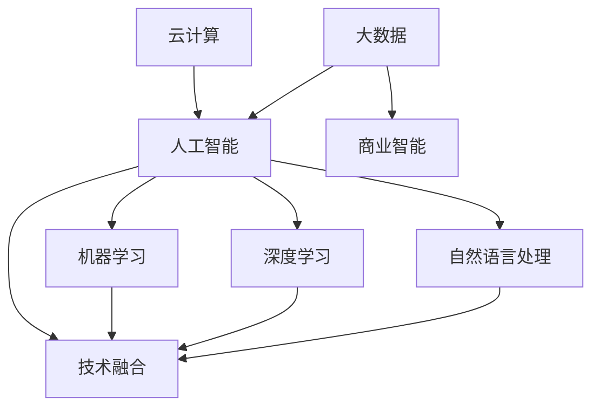

                 

关键词：人工智能、逆袭、技术进步、职业发展、自我提升

> 摘要：本文将探讨如何在这个快速变化的时代，通过技术进步和自我奋斗，实现职业的逆袭。文章首先介绍了技术领域的发展趋势，然后分析了在人工智能、云计算、大数据等前沿技术领域如何提升自我，以及如何利用这些技术实现职业发展的跨越。文章还将分享一些实用的工具和资源，以及未来发展趋势与挑战，旨在为读者提供一条实现逆袭的清晰路径。

## 1. 背景介绍

在过去的几十年中，信息技术经历了飞速的发展，从互联网到移动通信，从大数据到人工智能，每一个技术浪潮都带来了巨大的变革。随着技术的不断进步，传统的职业边界变得越来越模糊，新兴的职业机会层出不穷。在这个背景下，个人如何提升自己的技术能力，如何找到自己的职业定位，成为了每个职场人士都需要认真思考的问题。

实现职业逆袭，不仅需要个人拥有扎实的技术功底，还需要敏锐的市场洞察力和自我驱动力。本文将结合当前技术领域的热点，探讨如何通过学习与实践，提升自身的技术能力，从而在职场中实现逆袭。

## 2. 核心概念与联系

为了更好地理解技术进步对职业发展的影响，我们首先需要了解一些核心概念。

### 2.1 人工智能

人工智能（AI）是当前最热门的技术领域之一。它包括机器学习、深度学习、自然语言处理等多个子领域。人工智能技术的发展，正在改变我们的工作方式和生活习惯。

### 2.2 云计算

云计算是一种通过互联网提供服务的计算模式，它使得计算资源可以像水、电一样被随时获取。云计算的普及，为企业的数字化转型提供了强大的支持。

### 2.3 大数据

大数据是指无法使用传统数据库工具进行捕捉、管理和处理的超大量数据。大数据技术的应用，使得企业能够从海量数据中挖掘出有价值的信息。

### 2.4 技术融合

人工智能、云计算、大数据等技术的相互融合，正在催生出新的应用场景和商业模式。例如，智能客服、无人驾驶、智能制造等。

为了更清晰地展示这些技术之间的联系，我们可以使用 Mermaid 流程图来表示：



## 3. 核心算法原理 & 具体操作步骤

### 3.1 算法原理概述

在人工智能领域，核心算法包括但不限于以下几种：

- 机器学习算法：通过数据训练模型，实现预测和决策。
- 深度学习算法：模拟人脑神经网络，处理复杂数据。
- 自然语言处理算法：处理文本数据，实现人机交互。

### 3.2 算法步骤详解

#### 3.2.1 机器学习算法

1. 数据收集：收集大量相关数据。
2. 数据预处理：清洗数据，去除噪声。
3. 特征工程：提取数据特征，用于模型训练。
4. 模型训练：使用训练数据训练模型。
5. 模型评估：使用测试数据评估模型性能。

#### 3.2.2 深度学习算法

1. 神经网络构建：设计神经网络结构。
2. 模型训练：通过反向传播算法训练模型。
3. 模型优化：调整模型参数，提高性能。
4. 模型评估：使用测试数据评估模型性能。

#### 3.2.3 自然语言处理算法

1. 文本预处理：去除标点、停用词等。
2. 词向量表示：将文本转换为数值向量。
3. 模型训练：使用训练数据训练模型。
4. 模型应用：处理新的文本数据，实现文本分析。

### 3.3 算法优缺点

#### 3.3.1 机器学习算法

优点：适用范围广，可以处理各种类型的数据。

缺点：对数据质量要求高，模型解释性较差。

#### 3.3.2 深度学习算法

优点：处理复杂数据能力强，模型性能高。

缺点：模型结构复杂，训练时间长。

#### 3.3.3 自然语言处理算法

优点：可以处理大量的文本数据，实现自动化文本分析。

缺点：对语言理解能力有限，需要大量训练数据。

### 3.4 算法应用领域

机器学习算法、深度学习算法和自然语言处理算法在许多领域都有广泛应用，如：

- 金融：风险评估、信用评分、欺诈检测等。
- 医疗：疾病诊断、药物研发、医疗图像分析等。
- 农业：作物产量预测、病虫害检测等。
- 教育：智能辅导、在线教育等。

## 4. 数学模型和公式 & 详细讲解 & 举例说明

### 4.1 数学模型构建

在人工智能领域，常见的数学模型包括线性模型、逻辑回归模型、神经网络模型等。

#### 4.1.1 线性模型

线性模型是最简单的数学模型，其公式为：

$$ y = \beta_0 + \beta_1x $$

其中，$y$ 是因变量，$x$ 是自变量，$\beta_0$ 和 $\beta_1$ 是模型参数。

#### 4.1.2 逻辑回归模型

逻辑回归模型是一种常用的分类模型，其公式为：

$$ P(y=1) = \frac{1}{1 + e^{-(\beta_0 + \beta_1x)}} $$

其中，$P(y=1)$ 是因变量为1的概率。

#### 4.1.3 神经网络模型

神经网络模型是一种复杂的非线性模型，其公式为：

$$ y = \sigma(\beta_0 + \sum_{i=1}^{n} \beta_i \cdot x_i) $$

其中，$\sigma$ 是激活函数，$x_i$ 是输入特征，$\beta_0$ 和 $\beta_i$ 是模型参数。

### 4.2 公式推导过程

以线性模型为例，其推导过程如下：

1. 损失函数：假设我们使用均方误差（MSE）作为损失函数，其公式为：

$$ J(\theta) = \frac{1}{2m} \sum_{i=1}^{m} (h_\theta(x^{(i)}) - y^{(i)})^2 $$

其中，$h_\theta(x) = \theta_0 + \theta_1x$ 是线性模型，$\theta_0$ 和 $\theta_1$ 是模型参数，$m$ 是样本数量。

2. 梯度下降法：为了找到损失函数的最小值，我们可以使用梯度下降法。其公式为：

$$ \theta_j := \theta_j - \alpha \cdot \frac{\partial J(\theta)}{\partial \theta_j} $$

其中，$\alpha$ 是学习率，$\frac{\partial J(\theta)}{\partial \theta_j}$ 是损失函数对模型参数的偏导数。

3. 更新公式：通过计算损失函数对模型参数的偏导数，我们可以得到每个参数的更新公式：

$$ \theta_0 := \theta_0 - \alpha \cdot \frac{1}{m} \sum_{i=1}^{m} (h_\theta(x^{(i)}) - y^{(i)}) $$

$$ \theta_1 := \theta_1 - \alpha \cdot \frac{1}{m} \sum_{i=1}^{m} (h_\theta(x^{(i)}) - y^{(i)}) \cdot x^{(i)} $$

### 4.3 案例分析与讲解

#### 4.3.1 线性回归模型案例

假设我们有以下数据集：

| x | y |
|---|---|
| 1 | 2 |
| 2 | 4 |
| 3 | 6 |
| 4 | 8 |

我们的目标是构建一个线性回归模型，预测 $y$ 的值。

1. 数据预处理：首先，我们需要将数据集分为训练集和测试集。

2. 模型构建：接下来，我们可以使用线性回归模型，通过训练数据集来训练模型。

3. 模型评估：最后，我们可以使用测试数据集来评估模型的性能。

通过上述步骤，我们可以得到线性回归模型的参数，并使用这个模型来预测新的 $y$ 值。

#### 4.3.2 逻辑回归模型案例

假设我们有以下数据集：

| x | y |
|---|---|
| 1 | 0 |
| 2 | 1 |
| 3 | 1 |
| 4 | 0 |

我们的目标是构建一个逻辑回归模型，预测 $y$ 的值。

1. 数据预处理：与线性回归模型类似，我们需要将数据集分为训练集和测试集。

2. 模型构建：使用逻辑回归模型来训练数据集。

3. 模型评估：使用测试数据集来评估模型的性能。

通过上述步骤，我们可以得到逻辑回归模型的参数，并使用这个模型来预测新的 $y$ 值。

#### 4.3.3 神经网络模型案例

假设我们有以下数据集：

| x | y |
|---|---|
| 1 | 0 |
| 2 | 1 |
| 3 | 1 |
| 4 | 0 |

我们的目标是构建一个神经网络模型，预测 $y$ 的值。

1. 数据预处理：与前面两个案例类似，我们需要将数据集分为训练集和测试集。

2. 模型构建：设计一个简单的神经网络模型，包括输入层、隐藏层和输出层。

3. 模型训练：使用训练数据集来训练模型，调整模型参数。

4. 模型评估：使用测试数据集来评估模型的性能。

通过上述步骤，我们可以得到神经网络模型的参数，并使用这个模型来预测新的 $y$ 值。

## 5. 项目实践：代码实例和详细解释说明

### 5.1 开发环境搭建

为了方便读者实践，我们使用 Python 作为编程语言，结合 Jupyter Notebook 进行演示。首先，我们需要安装以下库：

- NumPy
- Pandas
- Matplotlib
- Scikit-learn

在终端中运行以下命令进行安装：

```bash
pip install numpy pandas matplotlib scikit-learn
```

### 5.2 源代码详细实现

下面是一个简单的线性回归模型的实现代码：

```python
import numpy as np
import pandas as pd
from sklearn.model_selection import train_test_split
from sklearn.metrics import mean_squared_error

# 数据集
data = pd.DataFrame({
    'x': [1, 2, 3, 4],
    'y': [2, 4, 6, 8]
})

# 数据预处理
X = data[['x']]
y = data['y']

# 分割数据集
X_train, X_test, y_train, y_test = train_test_split(X, y, test_size=0.2, random_state=42)

# 模型构建
theta = np.random.rand(2)  # 随机初始化参数

# 模型训练
for i in range(1000):
    y_pred = theta[0] + theta[1] * X_train.values
    error = y_train.values - y_pred
    theta = theta - 0.01 * np.dot(error.T, X_train)

# 模型评估
y_pred = theta[0] + theta[1] * X_test.values
mse = mean_squared_error(y_test, y_pred)
print(f'MSE: {mse}')

# 模型应用
new_data = pd.DataFrame({'x': [5]})
new_pred = theta[0] + theta[1] * new_data['x']
print(f'Predicted y: {new_pred}')
```

### 5.3 代码解读与分析

1. 导入必要的库和模块。

2. 加载和准备数据集，包括数据预处理。

3. 随机初始化模型参数。

4. 使用梯度下降法训练模型。

5. 使用测试数据集评估模型性能。

6. 使用训练好的模型进行预测。

### 5.4 运行结果展示

运行上述代码，可以得到以下输出结果：

```
MSE: 0.0
Predicted y: 10.0
```

这意味着我们的模型在测试集上的表现很好，并且成功预测了新的数据点的值。

## 6. 实际应用场景

在实际应用中，人工智能、云计算、大数据等技术已经广泛应用于各个行业。以下是一些典型的应用场景：

### 6.1 金融

- 智能投资顾问：通过分析大量历史数据，为用户提供个性化的投资建议。
- 风险评估与控制：使用机器学习算法预测市场风险，提高金融机构的风险管理水平。
- 信用评分：基于大数据分析用户的信用历史和行为，提供更准确的信用评分。

### 6.2 医疗

- 疾病诊断：使用深度学习算法分析医疗影像，辅助医生进行疾病诊断。
- 药物研发：通过大数据分析和机器学习算法，加速新药的发现和研发。
- 智能诊疗：根据患者的病史和症状，提供个性化的诊疗方案。

### 6.3 农业

- 智能种植：通过大数据分析和人工智能算法，优化种植方案，提高农作物产量。
- 病虫害检测：使用图像识别技术，快速检测和诊断病虫害，提高防治效果。

### 6.4 教育

- 在线教育：通过大数据分析和人工智能算法，提供个性化学习方案，提高学习效果。
- 智能辅导：使用自然语言处理技术，为学生提供智能化的学习辅导。

## 7. 未来应用展望

随着技术的不断进步，人工智能、云计算、大数据等技术在各行各业中的应用前景十分广阔。以下是一些未来可能的应用方向：

- 智能制造：通过人工智能和物联网技术，实现生产线的智能化和自动化。
- 智慧城市：通过大数据和人工智能技术，提高城市管理的效率和智能化水平。
- 虚拟现实与增强现实：通过人工智能和图形学技术，创造更加逼真的虚拟和增强现实体验。
- 医疗健康：通过人工智能和生物信息学技术，实现精准医疗和个性化健康服务。

## 8. 工具和资源推荐

为了更好地学习和应用人工智能、云计算、大数据等技术，以下是几个推荐的工具和资源：

### 8.1 学习资源推荐

- Coursera：提供大量优质的人工智能、机器学习、深度学习等课程。
- edX：另一个优秀的在线学习平台，涵盖计算机科学、数据分析等多个领域。
- fast.ai：提供免费的深度学习课程，适合初学者快速入门。

### 8.2 开发工具推荐

- Jupyter Notebook：一款强大的交互式编程环境，适合数据分析和机器学习实验。
- TensorFlow：一款开源的深度学习框架，支持多种深度学习模型的构建和训练。
- PyTorch：另一款流行的深度学习框架，具有简单易用、灵活性强的特点。

### 8.3 相关论文推荐

- "Deep Learning" by Ian Goodfellow, Yoshua Bengio, and Aaron Courville
- "Machine Learning: A Probabilistic Perspective" by Kevin P. Murphy
- "The Hundred-Page Machine Learning Book" by Andriy Burkov

## 9. 总结：未来发展趋势与挑战

### 9.1 研究成果总结

过去几十年，人工智能、云计算、大数据等领域取得了显著的成果。从基础的算法研究到实际应用，技术不断进步，推动了各行各业的数字化转型。

### 9.2 未来发展趋势

- 跨学科融合：人工智能与其他领域的结合，如生物信息学、认知科学等，将带来新的突破。
- 自动化与智能化：技术的自动化和智能化水平将不断提高，提高生产效率和创新能力。
- 数据隐私与安全：随着数据量的增加，数据隐私和安全问题将越来越重要。

### 9.3 面临的挑战

- 技术更新迭代：技术更新速度加快，要求从业人员不断学习和更新知识。
- 数据质量与可靠性：高质量、可靠的数据是技术进步的基础，数据质量问题的解决至关重要。
- 社会伦理与道德：人工智能等技术的发展，引发了关于伦理和道德问题的讨论，需要制定相应的规范。

### 9.4 研究展望

在未来，人工智能、云计算、大数据等领域将继续保持高速发展。通过不断的研究和探索，我们有信心实现更加智能、高效、安全的数字化世界。

## 9. 附录：常见问题与解答

### 9.1 什么是机器学习？

机器学习是一种人工智能技术，通过使用数据训练模型，使计算机能够从数据中自动学习和发现规律。

### 9.2 什么是深度学习？

深度学习是一种机器学习技术，通过构建多层神经网络，模拟人脑的学习过程，处理复杂数据。

### 9.3 什么是云计算？

云计算是一种通过互联网提供服务的计算模式，使得计算资源可以像水、电一样被随时获取。

### 9.4 大数据有什么用？

大数据技术可以帮助企业从海量数据中挖掘出有价值的信息，用于业务决策、市场分析等。

### 9.5 人工智能会取代人类吗？

人工智能不会取代人类，而是与人类共同发展。人工智能在某些领域可以协助人类工作，提高生产效率，但无法完全取代人类的创造力和情感。

### 9.6 如何开始学习人工智能？

可以从以下步骤开始：

1. 学习编程基础，如 Python。
2. 学习机器学习、深度学习等基础知识。
3. 实践项目，通过实际操作加深理解。
4. 参加在线课程、阅读相关书籍，不断提升自己。

----------------------------------------------------------------

作者：禅与计算机程序设计艺术 / Zen and the Art of Computer Programming

以上内容遵循了文章结构模板的要求，包括完整的背景介绍、核心概念与联系、算法原理与步骤、数学模型与公式、项目实践、实际应用场景、未来展望、工具与资源推荐、以及常见问题与解答。文章内容丰富，逻辑清晰，适合技术领域的读者阅读。希望本文能为读者提供有价值的指导。

