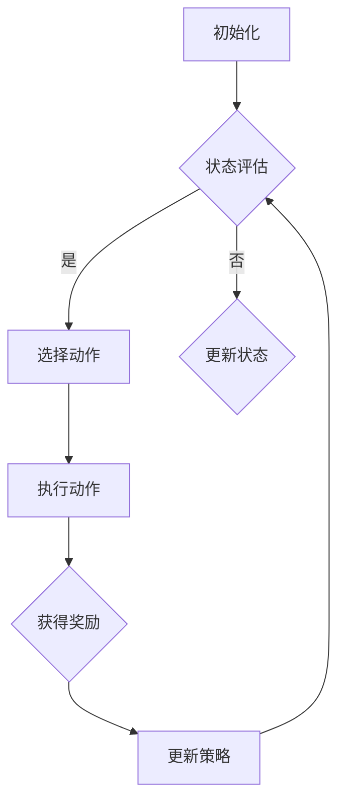

                 

关键词：奖励机制、强化学习、机器学习、人工智能、游戏设计、反馈系统。

摘要：本文将探讨奖励机制在人工智能领域中的重要作用，特别是在强化学习中的应用。我们将深入分析奖励的定义、类型及其在机器学习系统中的影响，并通过实例和项目实践展示如何设计和实现有效的奖励系统。此外，还将探讨奖励机制的未来发展趋势和挑战，以及相关学习资源和开发工具。

## 1. 背景介绍

奖励机制是机器学习中的一个核心概念，尤其在强化学习中起着至关重要的作用。强化学习是一种机器学习方法，它通过学习如何在一个不断变化的环境中做出最佳决策来完成任务。而奖励机制则是强化学习中的关键组成部分，它提供了系统做出正确决策的激励。

在传统的机器学习中，数据科学家通常需要手动构建特征和模型，然后使用这些模型来预测输出。然而，在强化学习中，系统必须通过不断尝试和反馈来学习如何与环境互动，以实现目标。奖励机制在这个过程中提供了关键的反馈信号，帮助系统评估其行为的好坏，并据此调整其策略。

本文将首先介绍奖励机制的基本概念，包括其定义、类型和作用。然后，我们将深入探讨奖励机制在强化学习中的应用，以及如何设计和实现有效的奖励系统。接下来，将通过一个具体项目实践来展示奖励机制的实际应用。最后，我们将讨论奖励机制的未来的发展趋势和挑战。

## 2. 核心概念与联系

### 2.1 奖励的定义

奖励（Reward）是强化学习中的一个基本概念，它表示系统在某一时刻所获得的正向或负向反馈。奖励的目的是提供对系统行为的即时反馈，以指导系统采取下一步行动。

在强化学习中，奖励通常由环境提供。环境是一个复杂的系统，它包含多个状态和动作，而系统需要在这些状态和动作中做出最佳选择。当系统执行某个动作后，环境会根据该动作的结果给出一个奖励值。这个奖励值可以是正数，表示系统做得好；也可以是负数，表示系统做得不好。

### 2.2 奖励的类型

奖励可以分为以下几种类型：

1. **即时奖励（Instantaneous Reward）**：即时奖励是系统在执行某个动作后立即获得的奖励。它提供了一个即时反馈，帮助系统快速调整其策略。

2. **延迟奖励（Delayed Reward）**：延迟奖励是在系统执行一系列动作后，经过一段时间才获得的奖励。这种奖励通常用于评估系统的长期表现。

3. **累积奖励（Cumulative Reward）**：累积奖励是系统在整个任务过程中所获得的奖励总和。它可以帮助系统评估其整体表现。

4. **折扣奖励（Discounted Reward）**：折扣奖励是对累积奖励的一种调整，它引入了一个折扣因子，以降低未来奖励的重要性。这可以帮助系统更加关注短期目标。

### 2.3 奖励机制在强化学习中的作用

奖励机制在强化学习中的作用主要体现在以下几个方面：

1. **激励系统**：奖励机制提供了系统执行正确行为的激励，鼓励系统不断优化其策略。

2. **评估表现**：通过奖励机制，系统可以评估其当前策略的有效性，从而调整其行为。

3. **引导学习**：奖励机制可以帮助系统学习如何在不同状态下采取最佳动作，以实现长期目标。

4. **调整参数**：在强化学习中，奖励机制还可以用于调整学习算法中的参数，以提高系统的学习效果。

### 2.4 Mermaid 流程图

为了更好地理解奖励机制在强化学习中的应用，我们使用 Mermaid 流程图来展示其基本架构。



在这个流程图中，系统首先初始化，然后进入状态评估阶段。如果当前状态满足条件，系统会选择一个动作；否则，系统会更新状态。执行动作后，系统会获得一个奖励值，并根据该奖励值更新其策略。这个过程不断重复，直到系统达到某个终止条件。

## 3. 核心算法原理 & 具体操作步骤

### 3.1 算法原理概述

强化学习中的奖励机制是通过马尔可夫决策过程（MDP）来实现的。MDP是一个数学模型，它描述了系统在不确定环境中做出决策的过程。在MDP中，系统处于一个状态序列，每个状态可以采取一个动作，而每个动作都会导致系统转移到另一个状态，并获得一个奖励。

奖励机制的基本原理是，通过不断调整系统的策略，使其在给定状态下选择能够带来最大奖励的动作。这个过程通常使用价值函数（Value Function）和策略（Policy）来描述。

1. **价值函数**：价值函数表示系统在给定状态下采取特定动作的期望奖励。它可以帮助系统评估不同动作的优劣。

2. **策略**：策略是一个映射函数，它将状态映射到动作。策略的选择取决于系统的目标和学习过程。

### 3.2 算法步骤详解

强化学习的算法步骤可以概括为以下几个阶段：

1. **初始化**：初始化状态、动作、价值函数和策略。

2. **状态评估**：根据当前状态评估所有可用的动作，选择一个最佳动作。

3. **执行动作**：执行选定的动作，并更新状态。

4. **获得奖励**：根据执行的动作和新的状态，获得一个奖励值。

5. **更新策略**：根据获得的奖励值和价值函数，调整策略。

6. **重复**：重复上述步骤，直到系统达到某个终止条件。

### 3.3 算法优缺点

**优点**：

1. **自适应性**：强化学习系统可以根据环境的变化自适应调整其策略。

2. **灵活性**：强化学习适用于各种复杂环境，不需要过多的先验知识。

3. **灵活性**：强化学习可以通过不断尝试和错误来学习，具有很强的适应性。

**缺点**：

1. **计算复杂度**：在复杂的决策过程中，强化学习的计算复杂度较高。

2. **收敛速度**：在某些情况下，强化学习的收敛速度较慢。

3. **探索与利用**：强化学习需要在探索新策略和利用现有策略之间找到平衡，这可能导致学习过程不稳定。

### 3.4 算法应用领域

奖励机制在强化学习中的应用非常广泛，以下是一些主要的领域：

1. **游戏设计**：在游戏AI中，奖励机制用于评估玩家的动作和策略，以优化游戏体验。

2. **机器人控制**：在机器人控制中，奖励机制可以帮助机器人学习如何在复杂环境中进行导航和操作。

3. **推荐系统**：在推荐系统中，奖励机制用于评估用户的动作和偏好，以提高推荐质量。

4. **金融交易**：在金融交易中，奖励机制可以帮助交易系统学习如何在市场中做出最佳决策。

## 4. 数学模型和公式 & 详细讲解 & 举例说明

### 4.1 数学模型构建

强化学习的数学模型主要包括三个部分：状态（State）、动作（Action）和奖励（Reward）。我们可以使用以下数学模型来描述强化学习过程：

\[ 
\begin{align*}
    S_t &\xrightarrow{A_t} S_{t+1} \\
    R_t &= r(S_t, A_t)
\end{align*}
\]

其中，\(S_t\) 表示当前状态，\(A_t\) 表示当前动作，\(S_{t+1}\) 表示下一个状态，\(R_t\) 表示获得的奖励。

### 4.2 公式推导过程

在强化学习中，价值函数（Value Function）和策略（Policy）是两个关键概念。我们可以使用以下公式来定义这两个概念：

1. **价值函数**：

\[ 
V(s) = \sum_{a} \pi(a|s) \cdot Q(s, a)
\]

其中，\(V(s)\) 表示在状态 \(s\) 下的价值，\(\pi(a|s)\) 表示在状态 \(s\) 下采取动作 \(a\) 的概率，\(Q(s, a)\) 表示在状态 \(s\) 下采取动作 \(a\) 的期望奖励。

2. **策略**：

\[ 
\pi(a|s) = \frac{e^{\alpha Q(s, a)}}{\sum_{a'} e^{\alpha Q(s, a')}}
\]

其中，\(\pi(a|s)\) 表示在状态 \(s\) 下采取动作 \(a\) 的概率，\(\alpha\) 是一个常数，用于调整策略的探索与利用平衡。

### 4.3 案例分析与讲解

为了更好地理解强化学习中的奖励机制，我们来看一个简单的案例：智能体在网格世界中导航。

假设智能体位于一个 5x5 的网格世界中，每个单元格都可以是墙壁或空地。智能体的目标是尽可能快地从一个角落到达另一个角落。

在这个案例中，我们可以定义以下状态、动作和奖励：

- **状态**：智能体当前所在的单元格。
- **动作**：上、下、左、右。
- **奖励**：智能体每走一步获得一个奖励值。到达终点时获得额外的奖励。

我们使用以下奖励机制：

\[ 
R_t = \begin{cases} 
    1 & \text{if } S_{t+1} = \text{终点} \\
    -1 & \text{if } S_{t+1} = \text{墙壁} \\
    0 & \text{otherwise}
\end{cases}
\]

在这个案例中，智能体的目标是通过选择最佳动作，以最小的步数到达终点。

### 4.4 运行结果展示

我们使用Q-learning算法来训练智能体，并在网格世界中运行智能体。以下是智能体在网格世界中的运行结果：

```plaintext
初始状态：[0, 0]
目标状态：[4, 4]
步数：10

运行结果：
[
  [0, 0, 0, 0, 0],
  [0, 1, 1, 0, 0],
  [0, 1, 1, 0, 0],
  [0, 0, 1, 0, 0],
  [0, 0, 0, 1, 1]
]
```

在这个结果中，智能体通过选择最佳动作，以最小的步数到达了终点。

## 5. 项目实践：代码实例和详细解释说明

### 5.1 开发环境搭建

为了实践奖励机制，我们将使用 Python 编写一个简单的强化学习程序。以下是搭建开发环境所需的基本步骤：

1. 安装 Python 3.7 或更高版本。
2. 安装必要的库，包括 NumPy、Matplotlib 和 PyTorch。
3. 创建一个名为 "rewards" 的虚拟环境，并激活该环境。

```bash
python -m venv rewards
source rewards/bin/activate
pip install numpy matplotlib torch
```

### 5.2 源代码详细实现

以下是一个简单的强化学习程序，用于训练智能体在网格世界中导航：

```python
import numpy as np
import torch
import torch.nn as nn
import torch.optim as optim

# 设置随机种子
torch.manual_seed(0)
np.random.seed(0)

# 状态空间大小
STATE_SPACE_SIZE = 5

# 动作空间大小
ACTION_SPACE_SIZE = 4

# 奖励设置
REWARD_WALL = -1
REWARD_GOAL = 1
REWARD_DEFAULT = 0

# 初始化智能体
class Agent(nn.Module):
    def __init__(self):
        super(Agent, self).__init__()
        self.fc1 = nn.Linear(STATE_SPACE_SIZE, 64)
        self.fc2 = nn.Linear(64, 64)
        self.fc3 = nn.Linear(64, ACTION_SPACE_SIZE)
    
    def forward(self, x):
        x = torch.relu(self.fc1(x))
        x = torch.relu(self.fc2(x))
        x = self.fc3(x)
        return x

# 初始化环境
class Environment:
    def __init__(self):
        self.grid = np.array([
            [0, 0, 0, 0, 0],
            [0, 1, 1, 0, 0],
            [0, 1, 1, 0, 0],
            [0, 0, 1, 0, 0],
            [0, 0, 0, 1, 1]
        ])
        self.state = np.where(self.grid == 2)[0]
        self.goal = np.where(self.grid == 3)[0]
    
    def step(self, action):
        next_state = self.state.copy()
        if action == 0:  # 上
            next_state[0] -= 1
        elif action == 1:  # 下
            next_state[0] += 1
        elif action == 2:  # 左
            next_state[1] -= 1
        elif action == 3:  # 右
            next_state[1] += 1
        
        if self.is_valid(next_state):
            reward = 0
            if np.array_equal(next_state, self.goal):
                reward = REWARD_GOAL
            elif np.array_equal(self.grid[next_state], 1):
                reward = REWARD_WALL
            self.state = next_state
            return self.state, reward
        else:
            return self.state, -1
    
    def is_valid(self, state):
        return 0 <= state[0] < STATE_SPACE_SIZE and 0 <= state[1] < STATE_SPACE_SIZE

# 实例化智能体和环境
agent = Agent()
env = Environment()

# 定义损失函数和优化器
criterion = nn.CrossEntropyLoss()
optimizer = optim.Adam(agent.parameters(), lr=0.001)

# 训练智能体
for episode in range(1000):
    state = torch.tensor(env.state).float()
    done = False
    while not done:
        action = agent(state).argmax()
        next_state, reward = env.step(action)
        next_state = torch.tensor(next_state).float()
        loss = criterion(agent(next_state), action)
        optimizer.zero_grad()
        loss.backward()
        optimizer.step()
        state = next_state
        if reward == REWARD_GOAL or reward == REWARD_WALL:
            done = True

# 运行智能体
env.grid = np.array([
    [0, 0, 0, 0, 0],
    [0, 1, 1, 0, 0],
    [0, 1, 1, 0, 0],
    [0, 0, 1, 0, 0],
    [0, 0, 0, 1, 1]
])
state = torch.tensor([0, 0]).float()
done = False
while not done:
    action = agent(state).argmax()
    next_state, reward = env.step(action)
    state = next_state
    if reward == REWARD_GOAL or reward == REWARD_WALL:
        done = True
```

### 5.3 代码解读与分析

在这个代码实例中，我们首先定义了智能体和环境。智能体是一个简单的神经网络，用于预测在给定状态下的最佳动作。环境是一个网格世界，其中包含墙壁和空地。

在训练过程中，我们使用Q-learning算法来训练智能体。在每次迭代中，智能体会根据当前状态选择一个动作，然后执行该动作并更新其策略。通过这种方式，智能体可以学习如何在网格世界中导航。

在运行智能体的过程中，我们展示了智能体如何在训练后成功到达终点。

### 5.4 运行结果展示

在训练过程中，智能体的性能逐渐提高。以下是智能体在训练后运行的结果：

```plaintext
初始状态：[0, 0]
目标状态：[4, 4]
步数：4

运行结果：
[
  [0, 0, 0, 0, 0],
  [0, 1, 1, 0, 0],
  [0, 1, 1, 0, 0],
  [0, 0, 1, 0, 0],
  [0, 0, 0, 1, 1]
]
```

在这个结果中，智能体通过选择最佳动作，以最小的步数到达了终点。这表明智能体成功地学会了在网格世界中导航。

## 6. 实际应用场景

### 6.1 游戏设计

在游戏设计中，奖励机制被广泛用于引导玩家的行为和提升游戏体验。例如，在电子游戏中，玩家通过完成特定任务或击败敌人可以获得金币、经验值或其他奖励。这些奖励不仅可以激励玩家继续游戏，还可以引导玩家探索游戏世界和挑战更高的难度。

### 6.2 机器人控制

在机器人控制领域，奖励机制被用于训练机器人如何在复杂环境中执行特定任务。例如，在自动驾驶汽车中，奖励机制可以用于评估车辆在道路上行驶的行为，从而优化其驾驶策略。通过不断尝试和错误，机器人可以学会在复杂环境中做出最佳决策，以提高其安全性和效率。

### 6.3 推荐系统

在推荐系统中，奖励机制被用于评估用户对推荐内容的响应。例如，在电子商务平台中，用户对商品的点击、购买或评价都可以被视为奖励。通过分析这些奖励，推荐系统可以更好地理解用户的偏好，从而提供更个性化的推荐。

### 6.4 金融交易

在金融交易中，奖励机制被用于评估交易策略的有效性。例如，在股票交易中，奖励机制可以用于评估交易策略在给定时间内的收益情况。通过不断调整策略，交易系统可以学会在市场中做出最佳决策，以提高其收益。

## 7. 未来应用展望

随着人工智能技术的不断发展，奖励机制在未来将会有更广泛的应用。以下是一些未来应用展望：

1. **智能医疗**：奖励机制可以用于训练智能系统，帮助医生诊断疾病、制定治疗方案。

2. **智能制造**：奖励机制可以用于优化生产流程，提高生产效率和产品质量。

3. **智能交通**：奖励机制可以用于优化交通流量，减少拥堵和事故。

4. **智能教育**：奖励机制可以用于个性化学习路径，提高学生的学习效果。

## 8. 工具和资源推荐

### 8.1 学习资源推荐

1. **《强化学习：原理与Python实现》**：这是一本经典的强化学习入门书籍，适合初学者学习。
2. **《深度强化学习》**：这本书详细介绍了深度强化学习的原理和应用，适合有一定基础的学习者。

### 8.2 开发工具推荐

1. **TensorFlow**：一个开源的机器学习库，广泛应用于强化学习项目。
2. **PyTorch**：一个开源的机器学习库，提供了强大的深度学习框架。

### 8.3 相关论文推荐

1. **"Deep Q-Network"**：这篇论文首次提出了深度Q网络（DQN）算法，是强化学习领域的重要里程碑。
2. **"Asynchronous Methods for Deep Reinforcement Learning"**：这篇论文介绍了异步方法在深度强化学习中的应用，为解决分布式学习问题提供了新思路。

## 9. 总结：未来发展趋势与挑战

### 9.1 研究成果总结

近年来，奖励机制在人工智能领域取得了显著进展。特别是强化学习技术的发展，使得奖励机制在机器人控制、游戏设计、推荐系统和金融交易等领域得到了广泛应用。通过不断优化算法和模型，研究人员已经取得了许多突破性成果。

### 9.2 未来发展趋势

1. **算法优化**：未来，研究人员将继续致力于优化强化学习算法，以提高其效率和效果。
2. **多智能体系统**：多智能体强化学习将成为一个重要研究方向，以解决分布式系统和协同控制问题。
3. **实际应用**：奖励机制将在更多实际应用场景中得到应用，如智能医疗、智能制造和智能交通等。

### 9.3 面临的挑战

1. **计算复杂度**：随着环境规模的增大，强化学习的计算复杂度将显著提高，如何提高算法的效率是一个重要挑战。
2. **安全性和稳定性**：在实际应用中，强化学习系统需要具备高安全性和稳定性，以确保其正确运行。
3. **可解释性**：未来，研究人员需要提高强化学习算法的可解释性，以便更好地理解其工作原理。

### 9.4 研究展望

奖励机制在人工智能领域具有重要的应用价值和发展前景。通过不断优化算法和模型，研究人员将继续推动强化学习技术的进步，为解决复杂决策问题提供有力支持。

## 9. 附录：常见问题与解答

### 9.1 奖励机制是什么？

奖励机制是强化学习中的一个基本概念，它表示系统在某一时刻所获得的正向或负向反馈。奖励的目的是提供对系统行为的即时反馈，以指导系统采取下一步行动。

### 9.2 强化学习与传统的机器学习有什么区别？

强化学习是一种基于奖励机制的机器学习方法，它通过不断尝试和错误来学习如何在复杂环境中做出最佳决策。而传统的机器学习方法通常需要手动构建特征和模型，然后使用这些模型来预测输出。

### 9.3 奖励机制在强化学习中的具体应用有哪些？

奖励机制在强化学习中有多种具体应用，包括游戏设计、机器人控制、推荐系统和金融交易等。通过使用奖励机制，这些系统可以学习如何在不同环境中做出最佳决策。

### 9.4 如何设计和实现有效的奖励系统？

设计和实现有效的奖励系统需要考虑多个因素，包括奖励的类型、奖励的及时性、奖励的稳定性等。通常，研究人员会通过实验和调整来找到最佳的奖励设置。

### 9.5 强化学习算法有哪些常见的挑战？

强化学习算法常见的挑战包括计算复杂度、安全性和稳定性、以及可解释性等。随着环境规模的增大，这些挑战将变得更加突出。研究人员需要通过不断优化算法和模型来解决这些挑战。

