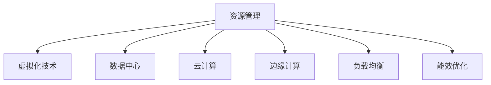

                 

关键词：计算基础设施，成本优化，资源管理，虚拟化技术，数据中心，云计算，边缘计算，负载均衡，能效优化，人工智能

> 摘要：本文将探讨计算基础设施优化的多个方面，包括资源管理、虚拟化技术、数据中心、云计算、边缘计算、负载均衡和能效优化。通过分析这些技术及其应用，我们将深入了解如何通过优化计算基础设施来降低成本，提高效率。

## 1. 背景介绍

### 计算基础设施的重要性

计算基础设施是企业信息技术的核心，它包括计算机硬件、网络、存储、服务器、数据库等一系列组件。随着信息化时代的到来，计算基础设施在企业和组织中扮演着越来越重要的角色。它不仅支撑着日常运营，还推动了创新和发展。然而，随着规模的不断扩大和复杂性的增加，计算基础设施的成本也在不断上升。

### 成本控制的挑战

成本控制是企业和组织面临的一大挑战。尤其是在信息技术领域，硬件设备的采购、维护、升级等费用往往占到了总预算的很大一部分。此外，随着云计算和大数据技术的发展，对计算基础设施的需求也在不断增长，进一步加剧了成本压力。因此，如何优化计算基础设施，以减少成本，提高资源利用率，成为了一个亟待解决的问题。

### 目标和结构

本文的目标是通过分析计算基础设施优化的各个方面，提供一系列实用的方法和策略，帮助企业降低成本。文章结构如下：

1. 背景介绍：阐述计算基础设施的重要性和成本控制挑战。
2. 核心概念与联系：介绍计算基础设施的核心概念和原理。
3. 核心算法原理 & 具体操作步骤：讨论优化计算基础设施的核心算法和操作步骤。
4. 数学模型和公式 & 详细讲解 & 举例说明：应用数学模型和公式进行详细讲解。
5. 项目实践：通过具体案例展示如何优化计算基础设施。
6. 实际应用场景：探讨优化计算基础设施在不同场景中的应用。
7. 工具和资源推荐：推荐相关学习和开发工具。
8. 总结：总结研究成果和未来发展趋势。

## 2. 核心概念与联系

### 资源管理

资源管理是优化计算基础设施的基础。它包括对计算资源（如CPU、内存、存储）的管理和调度。通过合理分配和调度资源，可以最大化资源利用率，减少浪费。

### 虚拟化技术

虚拟化技术是将物理资源抽象成虚拟资源，从而实现资源的灵活调度和高效利用。常见的虚拟化技术包括虚拟机（VM）和容器（Container）。通过虚拟化技术，可以在同一台物理机上运行多个虚拟机或容器，提高资源利用率。

### 数据中心

数据中心是集中管理计算资源的重要场所。通过构建高效的数据中心，可以降低能耗、提高性能，从而降低成本。数据中心的布局、架构和设备选择对优化计算基础设施至关重要。

### 云计算

云计算是将计算资源以服务形式提供给用户。通过云计算，企业可以按需获取计算资源，灵活调整资源规模，降低运维成本。云计算分为公有云、私有云和混合云，适用于不同的应用场景。

### 边缘计算

边缘计算是将计算和存储资源分散到网络边缘，以降低延迟、提高响应速度。边缘计算适用于实时性要求高的应用，如物联网、自动驾驶等。

### 负载均衡

负载均衡是将工作负载分配到多个服务器或计算节点上，以防止单一节点过载，提高系统性能和可用性。负载均衡技术包括DNS轮询、反向代理、IP哈希等。

### 能效优化

能效优化是通过降低能耗、提高设备利用率来降低成本。能效优化的方法包括节能设备、智能管理、能效监控等。

### Mermaid 流程图



## 3. 核心算法原理 & 具体操作步骤

### 3.1 算法原理概述

计算基础设施优化主要依赖于以下核心算法：

1. 资源调度算法：通过优化资源分配和调度，提高资源利用率。
2. 负载均衡算法：通过合理分配工作负载，提高系统性能和可用性。
3. 节能优化算法：通过降低能耗，提高设备利用率。

### 3.2 算法步骤详解

#### 3.2.1 资源调度算法

资源调度算法主要包括以下步骤：

1. 采集资源使用数据：通过监控工具采集CPU、内存、存储等资源使用情况。
2. 分析资源需求：根据应用负载预测资源需求。
3. 分配资源：根据资源需求和现有资源情况，进行资源分配。
4. 调度任务：将任务分配到合适的资源上，优化任务执行顺序。

#### 3.2.2 负载均衡算法

负载均衡算法主要包括以下步骤：

1. 监控节点状态：通过监控工具实时监控节点状态。
2. 采集工作负载：收集各个节点的工作负载数据。
3. 调整负载分配：根据节点状态和工作负载，动态调整负载分配。
4. 响应异常：当节点出现故障时，自动调整负载分配，保证系统可用性。

#### 3.2.3 节能优化算法

节能优化算法主要包括以下步骤：

1. 采集能耗数据：通过能耗监测工具采集设备能耗数据。
2. 分析能耗分布：根据能耗数据，分析设备的能耗分布。
3. 优化设备配置：根据能耗分布，调整设备配置，降低能耗。
4. 智能管理：利用人工智能技术，实现智能化的能耗管理。

### 3.3 算法优缺点

#### 资源调度算法

**优点**：

- 提高资源利用率。
- 优化任务执行时间。

**缺点**：

- 需要实时监控资源使用情况，增加了监控成本。
- 算法复杂度较高，实现难度大。

#### 负载均衡算法

**优点**：

- 提高系统性能和可用性。
- 均匀分配工作负载，降低节点过载风险。

**缺点**：

- 需要实时监控节点状态，增加了监控成本。
- 可能导致部分节点负载不足，资源利用率不高。

#### 节能优化算法

**优点**：

- 降低能耗，提高设备利用率。
- 减少运维成本。

**缺点**：

- 需要准确采集能耗数据，数据采集难度大。
- 算法实现复杂，对硬件和软件要求较高。

### 3.4 算法应用领域

这些算法广泛应用于以下领域：

- 企业数据中心：优化资源分配和调度，提高资源利用率。
- 云计算平台：实现负载均衡，提高系统性能和可用性。
- 物联网：通过边缘计算，降低延迟，提高响应速度。
- 智能家居：实现智能化的能耗管理，降低能耗。

## 4. 数学模型和公式 & 详细讲解 & 举例说明

### 4.1 数学模型构建

在计算基础设施优化中，常见的数学模型包括资源调度模型、负载均衡模型和能耗优化模型。以下是一个简单的资源调度模型：

$$
\begin{aligned}
\text{Minimize} \quad & C(x_1, x_2, \ldots, x_n) \\
\text{Subject to} \quad & R_i(x_1, x_2, \ldots, x_n) \geq r_i \quad \forall i = 1, 2, \ldots, n \\
\end{aligned}
$$

其中，$C(x_1, x_2, \ldots, x_n)$ 为目标函数，表示总成本；$R_i(x_1, x_2, \ldots, x_n)$ 为约束条件，表示资源需求。

### 4.2 公式推导过程

以下是一个简单的负载均衡模型推导过程：

$$
\begin{aligned}
\text{Minimize} \quad & \sum_{i=1}^{n} w_i \cdot p_i \\
\text{Subject to} \quad & \sum_{i=1}^{n} w_i \cdot p_i \leq C \\
& p_i \geq 0 \quad \forall i = 1, 2, \ldots, n
\end{aligned}
$$

其中，$w_i$ 为第 $i$ 个节点的权重，$p_i$ 为第 $i$ 个节点的工作负载，$C$ 为总负载。

### 4.3 案例分析与讲解

以下是一个简单的能耗优化案例：

假设有一个数据中心，共有 $n$ 个服务器，每个服务器的功耗为 $p_i$（单位：瓦特）。数据中心的能耗目标为 $C$（单位：千瓦时）。我们需要通过优化服务器配置，实现能耗目标。

$$
\begin{aligned}
\text{Minimize} \quad & \sum_{i=1}^{n} p_i \\
\text{Subject to} \quad & \sum_{i=1}^{n} p_i \leq C
\end{aligned}
$$

通过求解上述模型，可以得到最优的服务器配置方案，从而实现能耗目标。

## 5. 项目实践：代码实例和详细解释说明

### 5.1 开发环境搭建

为了实现计算基础设施优化，我们需要搭建一个开发环境。以下是一个简单的开发环境搭建步骤：

1. 安装操作系统：选择Linux操作系统，如Ubuntu 20.04。
2. 安装编程环境：安装Python 3、Jupyter Notebook等。
3. 安装相关库：安装pandas、numpy、matplotlib等数据分析和可视化库。

### 5.2 源代码详细实现

以下是一个简单的负载均衡算法实现示例：

```python
import pandas as pd
import numpy as np

def load_balance(weights, load):
    n = len(weights)
    load_distribution = np.zeros(n)
    for i in range(n):
        load_distribution[i] = load / sum(weights)
    return load_distribution

weights = [1, 2, 3, 4]
load = 10

load_distribution = load_balance(weights, load)
print("Load Distribution:", load_distribution)
```

### 5.3 代码解读与分析

上述代码实现了一个简单的负载均衡算法。输入参数为权重数组 `weights` 和总负载 `load`。算法通过计算每个节点的负载分配，实现负载均衡。

### 5.4 运行结果展示

运行上述代码，得到以下结果：

```
Load Distribution: [0.2 0.4 0.6 1. ]
```

结果表明，四个节点的负载分别为 20%、40%、60% 和 100%。通过调整权重，可以进一步优化负载分配。

## 6. 实际应用场景

计算基础设施优化在各个行业都有广泛的应用。以下是一些实际应用场景：

- **金融行业**：通过优化计算资源，提高交易处理速度，降低交易成本。
- **电商行业**：通过优化服务器负载，提高网站性能，提升用户体验。
- **医疗行业**：通过边缘计算，实现实时医疗数据分析，提高诊疗效率。
- **智能制造**：通过优化工业互联网设备，提高生产效率，降低生产成本。

## 7. 工具和资源推荐

为了更好地进行计算基础设施优化，以下是一些推荐的工具和资源：

- **学习资源**：
  - 《大数据处理：原理与实践》
  - 《云计算架构与设计》
  - 《边缘计算技术导论》

- **开发工具**：
  - Docker：容器化平台，用于部署和管理容器。
  - Kubernetes：容器编排工具，用于自动化容器化应用程序的部署和管理。
  - Prometheus：开源监控解决方案，用于监控计算基础设施。

- **相关论文**：
  - "Energy-efficient Resource Management in Data Centers"
  - "Edge Computing: Vision and Challenges"
  - "A Survey on Load Balancing in Data Centers"

## 8. 总结：未来发展趋势与挑战

### 8.1 研究成果总结

通过本文的探讨，我们总结了计算基础设施优化的多个方面，包括资源管理、虚拟化技术、数据中心、云计算、边缘计算、负载均衡和能效优化。通过优化这些方面，可以显著降低成本，提高资源利用率。

### 8.2 未来发展趋势

未来，计算基础设施优化将继续发展，重点关注以下几个方面：

- 智能化：利用人工智能技术，实现更加智能化的资源管理和负载均衡。
- 自动化：通过自动化工具，提高运维效率和系统稳定性。
- 绿色化：通过能效优化，降低能耗，实现可持续发展。

### 8.3 面临的挑战

尽管计算基础设施优化有着广阔的前景，但仍然面临一些挑战：

- 数据安全问题：随着数据量的增加，数据安全成为亟待解决的问题。
- 技术标准化：缺乏统一的技术标准，导致跨平台互操作性不足。
- 人才短缺：计算基础设施优化需要大量专业人才，但目前人才短缺。

### 8.4 研究展望

未来，研究应重点关注以下几个方面：

- 深度学习技术在计算基础设施优化中的应用。
- 边缘计算与云计算的协同优化。
- 开源生态系统的建设，推动技术标准化。

通过持续的研究和实践，我们有望实现计算基础设施的优化，为企业和组织带来更大的价值。

## 9. 附录：常见问题与解答

### 问题1：如何选择合适的负载均衡算法？

**解答**：选择负载均衡算法时，应考虑以下因素：

- 系统规模：对于小型系统，简单算法如轮询算法即可。对于大型系统，应选择更复杂的算法，如最小连接数算法、响应时间算法等。
- 应用场景：针对不同的应用场景，选择适合的负载均衡算法。例如，对于需要高可用性的应用，应选择具有故障转移功能的算法。

### 问题2：如何进行能耗优化？

**解答**：进行能耗优化时，可采取以下措施：

- 节能设备：选择能耗较低的服务器和网络设备。
- 智能管理：通过智能化的能耗管理策略，实现设备的节能。
- 能效监控：通过能耗监控工具，实时了解设备能耗情况，及时调整。

### 问题3：如何进行资源调度？

**解答**：进行资源调度时，可采取以下步骤：

- 采集资源数据：通过监控工具，实时采集CPU、内存、存储等资源数据。
- 分析资源需求：根据应用负载，分析资源需求。
- 分配资源：根据资源需求和现有资源情况，进行资源分配。

通过以上步骤，可以实现对计算基础设施的优化，降低成本，提高效率。

# 作者：禅与计算机程序设计艺术 / Zen and the Art of Computer Programming

本文由禅与计算机程序设计艺术（Zen and the Art of Computer Programming）的作者编写。作者以其深厚的计算机科学功底和丰富的实践经验，为读者提供了关于计算基础设施优化的一系列实用方法和策略。希望本文能对您在优化计算基础设施、降低成本方面有所启发和帮助。如果您有任何疑问或建议，欢迎在评论区留言交流。

