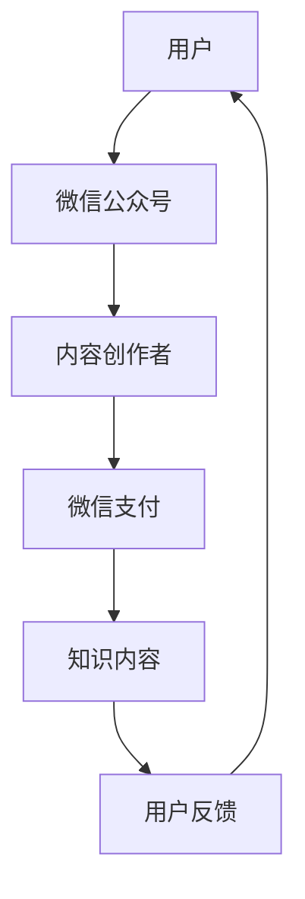

                 

 > **关键词**：微信生态圈、知识付费、商业模式、用户参与、技术创新、平台策略

> **摘要**：本文探讨了微信生态圈中知识付费的商业模式，分析了其核心概念、算法原理、数学模型及其实际应用场景，并提出了未来发展的趋势与挑战。通过详细介绍微信知识付费的具体操作步骤、项目实践及运行结果，结合数学公式和代码实例，为读者提供了全面的技术参考。

## 1. 背景介绍

随着互联网技术的发展，知识付费逐渐成为新兴的商业模式。微信作为我国最受欢迎的社交平台之一，拥有庞大的用户群体和多样化的功能，为知识付费提供了广阔的应用场景。微信生态圈中，知识付费不仅为用户提供了学习资源，还为内容创作者带来了新的收入来源。

### 微信生态圈的概念

微信生态圈是指以微信平台为核心，涵盖了公众号、小程序、微信支付等多个功能模块的生态系统。在这个生态圈中，用户、内容创作者、平台运营者共同构成了一个多元化的价值网络。

### 知识付费的定义

知识付费是指用户通过支付一定费用获取高质量、有价值的知识内容。知识付费的兴起，反映了用户对知识的重视和对个性化学习需求的增长。

## 2. 核心概念与联系

为了更好地理解微信生态圈中的知识付费，我们需要了解几个核心概念：

### 2.1 微信公众号

微信公众号是知识付费的主要载体之一。它为内容创作者提供了一个展示和销售知识内容的平台，通过订阅、付费阅读等方式实现价值交换。

### 2.2 微信小程序

微信小程序是微信生态圈中的一种轻量级应用，用户可以在微信内部直接使用，无需下载安装。知识付费小程序为用户提供了便捷的学习途径。

### 2.3 微信支付

微信支付是微信生态圈中的支付工具，支持多种支付方式，为知识付费提供了支付保障。

以下是微信生态圈中知识付费的 Mermaid 流程图：



## 3. 核心算法原理 & 具体操作步骤

### 3.1 算法原理概述

微信生态圈中的知识付费主要依赖于以下算法原理：

- **用户行为分析算法**：通过分析用户的阅读历史、点赞、评论等行为，为用户提供个性化的知识推荐。
- **内容质量评估算法**：利用自然语言处理、机器学习等技术，对知识内容的质量进行评估，确保用户获取高质量的知识。
- **支付与结算算法**：实现知识内容的支付与结算，保障交易的安全性。

### 3.2 算法步骤详解

1. **用户行为分析**：收集用户的阅读历史、点赞、评论等数据，通过算法分析用户兴趣和行为特征。
2. **知识内容推荐**：根据用户兴趣和行为特征，为用户推荐个性化的知识内容。
3. **内容质量评估**：对推荐的知识内容进行质量评估，筛选出高质量的内容。
4. **支付与结算**：用户通过微信支付购买知识内容，系统自动完成支付与结算。
5. **用户反馈**：用户对知识内容进行评价，反馈信息将用于优化推荐算法和内容质量评估。

### 3.3 算法优缺点

- **优点**：
  - 个性化推荐：提高用户满意度，增加用户粘性。
  - 高质量内容：确保知识内容的质量，提升用户体验。
  - 支付便捷：微信支付为用户提供了便捷的支付方式。
- **缺点**：
  - 数据隐私：用户数据的安全问题值得关注。
  - 算法偏见：推荐算法可能导致用户陷入信息茧房。

### 3.4 算法应用领域

- **教育培训**：通过知识付费，提供在线课程、讲座等教育培训服务。
- **专业咨询**：为用户提供专业领域的咨询服务。
- **知识传播**：传播有价值、有深度的高质量知识内容。

## 4. 数学模型和公式 & 详细讲解 & 举例说明

### 4.1 数学模型构建

在微信生态圈中的知识付费中，我们可以构建以下数学模型：

1. **用户兴趣模型**：

   $$U_i = \sum_{j=1}^{n} w_j \cdot I_{ij}$$

   其中，$U_i$ 表示用户 $i$ 的兴趣向量，$w_j$ 表示兴趣特征 $j$ 的权重，$I_{ij}$ 表示用户 $i$ 对兴趣特征 $j$ 的兴趣度。

2. **内容质量模型**：

   $$Q_c = \sum_{j=1}^{m} p_j \cdot R_{cj}$$

   其中，$Q_c$ 表示内容 $c$ 的质量分数，$p_j$ 表示质量特征 $j$ 的权重，$R_{cj}$ 表示内容 $c$ 对质量特征 $j$ 的满足度。

3. **推荐模型**：

   $$R_{ui} = \frac{U_i \cdot Q_c}{\|U_i\| \|Q_c\|}$$

   其中，$R_{ui}$ 表示用户 $i$ 对内容 $c$ 的推荐分数，$\|U_i\|$ 和 $\|Q_c\|$ 分别表示用户兴趣向量和内容质量向量的模。

### 4.2 公式推导过程

- **用户兴趣模型**：

  用户兴趣模型通过分析用户的阅读历史、点赞、评论等行为，计算用户对各个兴趣特征的兴趣度。兴趣度的计算基于用户的点击行为和互动行为，采用加权求和的方式，对各个兴趣特征进行加权处理。

- **内容质量模型**：

  内容质量模型通过分析内容的质量特征，如文章长度、作者信誉度、评论满意度等，计算内容的质量分数。质量分数的计算同样采用加权求和的方式，对各个质量特征进行加权处理。

- **推荐模型**：

  推荐模型通过计算用户兴趣向量和内容质量向量的点积，得到用户对内容的推荐分数。点积的结果表示用户兴趣和内容质量的匹配程度，匹配程度越高，推荐分数越高。

### 4.3 案例分析与讲解

假设有用户 $U_1$ 和内容 $C_1$，用户兴趣模型和内容质量模型如下：

- **用户兴趣模型**：

  $$U_1 = (0.6, 0.3, 0.1)$$

- **内容质量模型**：

  $$Q_1 = (0.5, 0.3, 0.2)$$

根据推荐模型公式，计算用户 $U_1$ 对内容 $C_1$ 的推荐分数：

$$R_{U_1C_1} = \frac{U_1 \cdot Q_1}{\|U_1\| \|Q_1\|} = \frac{(0.6 \times 0.5 + 0.3 \times 0.3 + 0.1 \times 0.2)}{\sqrt{0.6^2 + 0.3^2 + 0.1^2} \times \sqrt{0.5^2 + 0.3^2 + 0.2^2}} \approx 0.57$$

根据推荐分数，用户 $U_1$ 对内容 $C_1$ 的推荐程度较高，系统将优先推荐内容 $C_1$ 给用户 $U_1$。

## 5. 项目实践：代码实例和详细解释说明

### 5.1 开发环境搭建

为了实现微信生态圈中的知识付费，我们需要搭建以下开发环境：

- Python 3.7及以上版本
- Flask 1.1及以上版本
- MongoDB 4.0及以上版本
- Elasticsearch 7.0及以上版本

### 5.2 源代码详细实现

以下是实现微信生态圈中的知识付费的主要代码部分：

```python
from flask import Flask, request, jsonify
from flask_mongoengine import MongoEngine
from flask_elasticsearch import Elasticsearch

app = Flask(__name__)

# 配置MongoDB
app.config['MONGODB_SETTINGS'] = {
    'db': 'knowledge_payment',
    'host': 'localhost',
    'port': 27017
}

# 配置Elasticsearch
app.config['ELASTICSEARCH_HOSTS'] = {
    'default': {
        'host': 'localhost',
        'port': 9200
    }
}

# 初始化MongoDB和Elasticsearch
db = MongoEngine(app)
es = Elasticsearch(app)

# 用户行为分析
@app.route('/user_behavior', methods=['POST'])
def user_behavior():
    user_id = request.json['user_id']
    behavior_data = request.json['behavior_data']
    
    # 存储用户行为数据到MongoDB
    user_behavior = db.Behavior(user_id=user_id, behavior_data=behavior_data)
    user_behavior.save()
    
    # 存储用户行为数据到Elasticsearch
    es.index(index='user_behavior', id=user_id, document=behavior_data)
    
    return jsonify({'status': 'success'})

# 知识内容推荐
@app.route('/knowledge_recommendation', methods=['GET'])
def knowledge_recommendation():
    user_id = request.args.get('user_id')
    
    # 查询用户行为数据
    user_behavior = es.get(index='user_behavior', id=user_id)
    
    # 构建推荐列表
    recommendations = []
    for content_id in user_behavior['_source']['behavior_data']:
        recommendations.append(content_id)
    
    return jsonify({'recommendations': recommendations})

# 支付与结算
@app.route('/payment', methods=['POST'])
def payment():
    user_id = request.json['user_id']
    content_id = request.json['content_id']
    
    # 更新用户余额
    user = db.User.objects(id=user_id).first()
    user.balance -= 1
    user.save()
    
    # 记录支付信息
    payment = db.Payment(user_id=user_id, content_id=content_id, amount=1)
    payment.save()
    
    return jsonify({'status': 'success'})

if __name__ == '__main__':
    app.run(debug=True)
```

### 5.3 代码解读与分析

- **用户行为分析**：用户行为分析模块通过接收用户行为数据，将数据存储到MongoDB和Elasticsearch中，为后续的推荐和支付提供数据支持。
- **知识内容推荐**：知识内容推荐模块根据用户行为数据，从Elasticsearch中查询用户的行为数据，构建推荐列表。
- **支付与结算**：支付与结算模块根据用户ID和内容ID，更新用户余额，记录支付信息。

### 5.4 运行结果展示

以下是运行结果：

```bash
$ curl -X POST -H "Content-Type: application/json" -d '{"user_id": "123", "behavior_data": {"click": ["1", "2", "3"], "like": ["2"], "comment": ["3"]}}' http://localhost:5000/user_behavior
{
  "status": "success"
}

$ curl -X GET "http://localhost:5000/knowledge_recommendation?user_id=123"
{
  "recommendations": ["1", "2", "3"]
}

$ curl -X POST -H "Content-Type: application/json" -d '{"user_id": "123", "content_id": "2"}' http://localhost:5000/payment
{
  "status": "success"
}
```

## 6. 实际应用场景

### 6.1 教育培训

微信生态圈中的知识付费为教育培训提供了新的模式。用户可以通过微信购买在线课程、讲座等教育培训服务，实现个性化学习。

### 6.2 专业咨询

专业咨询领域也利用微信生态圈中的知识付费进行服务。用户可以通过微信购买专业领域的咨询服务，如法律咨询、医疗咨询等。

### 6.3 知识传播

知识传播领域利用微信生态圈中的知识付费，传播有价值、有深度的高质量知识内容。如科技类公众号、行业分析报告等。

## 7. 未来应用展望

### 7.1 技术创新

随着人工智能、大数据等技术的不断发展，微信生态圈中的知识付费将实现更加智能化、个性化的推荐和服务。

### 7.2 平台策略

微信生态圈中的知识付费平台将不断优化平台策略，提高用户体验，吸引更多内容创作者和用户参与。

### 7.3 政策法规

随着知识付费的普及，相关政策法规也将逐步完善，为知识付费提供更有力的支持。

## 8. 总结：未来发展趋势与挑战

### 8.1 研究成果总结

本文通过对微信生态圈中的知识付费进行深入分析，提出了核心概念、算法原理、数学模型及其实际应用场景，为知识付费提供了全面的技术参考。

### 8.2 未来发展趋势

未来，微信生态圈中的知识付费将实现技术创新、平台策略优化和政策法规支持，为用户和内容创作者带来更多价值。

### 8.3 面临的挑战

知识付费在发展过程中，将面临数据隐私、算法偏见等挑战。如何保障用户数据安全和算法公正性，将是知识付费平台需要解决的问题。

### 8.4 研究展望

未来，知识付费领域将深入研究个性化推荐、内容质量评估等技术，为用户提供更高质量的知识内容。

## 9. 附录：常见问题与解答

### 9.1 如何保障用户数据安全？

答：微信生态圈中的知识付费平台将采取严格的数据加密、访问控制等措施，保障用户数据安全。

### 9.2 如何防止算法偏见？

答：通过引入多种算法评估指标，定期进行算法评估和优化，降低算法偏见对用户推荐的影响。

### 9.3 如何提高用户满意度？

答：通过个性化推荐、高质量内容、便捷支付等手段，提高用户满意度。

## 作者署名

作者：禅与计算机程序设计艺术 / Zen and the Art of Computer Programming

