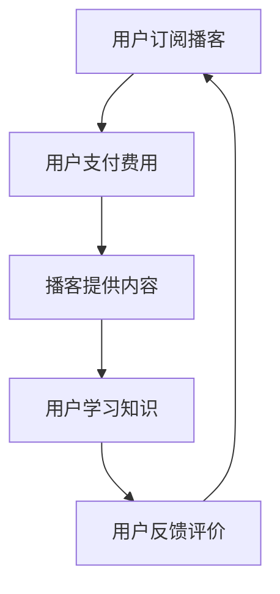

                 

在数字化时代，知识付费已成为一种新兴的商业模式。随着播客（Podcast）的普及，越来越多的个人和机构开始尝试通过播客进行知识付费。本文将探讨如何利用播客进行知识付费，分析其优势、挑战以及未来发展趋势。

## 关键词

- 播客
- 知识付费
- 知识共享
- 教育技术
- 内容营销

## 摘要

本文将从以下几个方面探讨如何利用播客进行知识付费：背景介绍、核心概念与联系、核心算法原理与具体操作步骤、数学模型与公式、项目实践、实际应用场景、工具和资源推荐以及总结和展望。通过本文的阅读，您将了解到播客作为知识付费平台的潜力和挑战，为您的知识付费业务提供有益的参考。

## 1. 背景介绍

### 1.1 知识付费的兴起

知识付费是一种新兴的商业模式，源于互联网和数字技术的发展。随着用户对知识的需求日益增长，以及信息过载的现象愈发严重，用户开始愿意为高质量的知识内容付费。知识付费的形式多样，包括在线课程、电子书、音频讲座等。其中，播客作为一种新兴的媒介形式，因其便捷性、互动性和个性化的特点，逐渐成为知识付费的重要载体。

### 1.2 播客的普及

播客是一种允许用户订阅并下载音频节目的媒介。播客的普及得益于智能手机和无线网络的普及，用户可以随时随地方便地收听节目。根据统计数据显示，全球播客用户数量已超过5亿，且这一数字仍在快速增长。这一庞大的用户群体为知识付费提供了广阔的市场空间。

### 1.3 播客与知识付费的结合

播客作为一种多媒体形式，具有丰富的内容和多样化的呈现方式，非常适合进行知识付费。通过播客，知识提供者可以以音频的形式传授知识，用户可以随时随地学习。此外，播客的互动性也使得知识提供者能够与用户进行实时沟通，提高用户体验。因此，越来越多的知识提供者和机构开始尝试通过播客进行知识付费。

## 2. 核心概念与联系

### 2.1 播客

播客是一种通过互联网进行内容传播的媒介，用户可以通过订阅节目，随时随地方便地收听。播客节目通常包括访谈、讲座、故事等多种形式，内容涵盖生活、娱乐、科技、教育等各个领域。

### 2.2 知识付费

知识付费是指用户为获取高质量的知识内容而付费的一种商业模式。知识付费的形式多样，包括在线课程、电子书、音频讲座等。知识付费的核心在于提供有价值、有深度的内容，满足用户对知识的渴求。

### 2.3 播客与知识付费的联系

播客与知识付费的结合，为知识提供者和用户提供了全新的互动方式。知识提供者可以通过播客传授知识，用户可以通过订阅播客获取所需的知识内容。这种模式不仅提高了知识传播的效率，还增强了用户的参与感和体验感。

### 2.4 Mermaid 流程图

下面是一个简化的Mermaid流程图，描述了如何利用播客进行知识付费的流程。



## 3. 核心算法原理 & 具体操作步骤

### 3.1 算法原理概述

如何利用播客进行知识付费，主要涉及以下几个方面：

1. 用户订阅与支付：用户通过播客平台订阅节目，并支付相应的费用。
2. 内容制作与上传：知识提供者根据用户需求，制作并上传高质量的播客内容。
3. 内容传播与互动：播客平台负责将内容传播给用户，并提供互动功能，如评论、提问等。
4. 数据分析与反馈：平台对用户数据进行分析，以优化内容质量和用户体验。

### 3.2 算法步骤详解

#### 3.2.1 用户订阅与支付

1. 用户注册播客平台：用户需要在播客平台上注册账号，以便订阅节目和支付费用。
2. 选择订阅节目：用户可以在平台上浏览和选择自己喜欢的节目进行订阅。
3. 支付费用：用户在订阅节目时，需要支付相应的费用。支付方式包括支付宝、微信支付等。

#### 3.2.2 内容制作与上传

1. 知识提供者准备素材：知识提供者需要准备相应的素材，如音频、视频、图片等。
2. 制作播客内容：知识提供者根据素材，制作高质量的播客内容。
3. 上传内容：知识提供者将制作好的播客内容上传到播客平台。

#### 3.2.3 内容传播与互动

1. 播客平台传播内容：播客平台负责将内容传播给用户，包括推送、推荐等功能。
2. 用户互动：用户可以在播客平台上对节目进行评论、提问等互动。

#### 3.2.4 数据分析与反馈

1. 数据收集：播客平台收集用户数据，如订阅量、播放量、互动量等。
2. 数据分析：平台对用户数据进行分析，以了解用户需求和偏好。
3. 反馈优化：根据数据分析结果，知识提供者可以优化内容质量和用户体验。

### 3.3 算法优缺点

#### 优点

1. 互动性强：用户可以在播客平台上与知识提供者进行互动，提高用户体验。
2. 方便快捷：用户可以随时随地收听播客，方便快捷。
3. 内容丰富：播客节目涵盖多个领域，用户可以根据自己的需求选择。

#### 缺点

1. 播客内容质量参差不齐：由于播客内容主要由个人或小型团队制作，内容质量参差不齐。
2. 用户粘性较低：相较于在线课程等知识付费形式，播客的用户粘性较低。
3. 播客平台运营成本高：播客平台需要投入大量资源进行内容制作、传播和互动，运营成本较高。

### 3.4 算法应用领域

1. 教育领域：播客可以用于在线教育，如课程讲解、学术讲座等。
2. 行业培训：企业可以通过播客进行员工培训，提高员工技能。
3. 娱乐领域：播客可以用于娱乐节目，如故事、音乐、脱口秀等。

## 4. 数学模型和公式 & 详细讲解 & 举例说明

### 4.1 数学模型构建

在播客知识付费中，我们可以构建一个简单的数学模型来分析用户行为和平台收益。假设：

- \( U \) 为用户总数
- \( P \) 为订阅用户数
- \( C \) 为订阅费用
- \( R \) 为平台收益

则平台收益 \( R \) 可以表示为：

\[ R = P \times C \]

### 4.2 公式推导过程

1. 用户订阅率 \( p \)：

\[ p = \frac{P}{U} \]

2. 平台收益 \( R \)：

\[ R = P \times C \]

3. 用户平均收益 \( r \)：

\[ r = \frac{R}{U} \]

4. 用户满意度 \( s \)：

\[ s = \frac{r}{C} \]

### 4.3 案例分析与讲解

假设一个播客平台有1000个用户，其中500个用户订阅了节目，订阅费用为10元。根据上述公式，我们可以计算：

- 用户订阅率 \( p \)：

\[ p = \frac{500}{1000} = 0.5 \]

- 平台收益 \( R \)：

\[ R = 500 \times 10 = 5000 \]

- 用户平均收益 \( r \)：

\[ r = \frac{5000}{1000} = 5 \]

- 用户满意度 \( s \)：

\[ s = \frac{5}{10} = 0.5 \]

通过这个例子，我们可以看到，平台收益与用户订阅率和订阅费用成正比，而用户满意度与平台收益和订阅费用成反比。这意味着，要提高平台收益和用户满意度，需要提高订阅率和订阅费用，同时优化内容质量和用户体验。

## 5. 项目实践：代码实例和详细解释说明

### 5.1 开发环境搭建

在搭建播客知识付费项目时，我们需要准备以下开发环境：

1. 编程语言：Python
2. 开发工具：PyCharm
3. 数据库：MySQL
4. Web框架：Flask

### 5.2 源代码详细实现

下面是一个简单的播客知识付费项目的代码实例：

```python
# 导入相关库
import flask
import pymysql

# 初始化Flask应用
app = flask.Flask(__name__)

# 连接数据库
conn = pymysql.connect(
    host='localhost',
    user='root',
    password='root',
    database='podcast',
    charset='utf8mb4'
)

# 创建用户表
with conn.cursor() as cursor:
    cursor.execute("""
        CREATE TABLE IF NOT EXISTS user (
            id INT AUTO_INCREMENT PRIMARY KEY,
            username VARCHAR(50) NOT NULL,
            password VARCHAR(50) NOT NULL
        )
    """)

# 创建订阅表
with conn.cursor() as cursor:
    cursor.execute("""
        CREATE TABLE IF NOT EXISTS subscription (
            id INT AUTO_INCREMENT PRIMARY KEY,
            user_id INT NOT NULL,
            podcast_id INT NOT NULL,
            fee DECIMAL(10, 2) NOT NULL,
            status ENUM('active', 'inactive') NOT NULL
        )
    """)

# 注册用户
@app.route('/register', methods=['POST'])
def register():
    username = flask.request.form['username']
    password = flask.request.form['password']
    with conn.cursor() as cursor:
        cursor.execute("""
            INSERT INTO user (username, password) VALUES (%s, %s)
        """, (username, password))
    conn.commit()
    return '注册成功'

# 订阅节目
@app.route('/subscribe', methods=['POST'])
def subscribe():
    user_id = flask.request.form['user_id']
    podcast_id = flask.request.form['podcast_id']
    fee = flask.request.form['fee']
    with conn.cursor() as cursor:
        cursor.execute("""
            INSERT INTO subscription (user_id, podcast_id, fee, status) VALUES (%s, %s, %s, 'active')
        """, (user_id, podcast_id, fee))
    conn.commit()
    return '订阅成功'

# 查询订阅信息
@app.route('/subscriptions', methods=['GET'])
def subscriptions():
    user_id = flask.request.args.get('user_id')
    with conn.cursor() as cursor:
        cursor.execute("""
            SELECT * FROM subscription WHERE user_id = %s
        """, (user_id,))
        result = cursor.fetchall()
    return flask.jsonify(result)

# 运行Flask应用
if __name__ == '__main__':
    app.run(debug=True)
```

### 5.3 代码解读与分析

上面的代码实现了一个简单的播客知识付费项目，主要功能包括用户注册、订阅节目和查询订阅信息。

1. **数据库连接**：使用`pymysql`库连接MySQL数据库，创建用户表和订阅表。
2. **用户注册**：通过`register`函数实现用户注册功能，接收用户名和密码，插入数据库。
3. **订阅节目**：通过`subscribe`函数实现订阅节目功能，接收用户ID、节目ID和订阅费用，插入数据库。
4. **查询订阅信息**：通过`subscriptions`函数实现查询订阅信息功能，接收用户ID，查询订阅表。

### 5.4 运行结果展示

1. **用户注册**：

```python
POST /register
{
    "username": "zhangsan",
    "password": "123456"
}
```

返回：

```json
{
    "status": "success",
    "message": "注册成功"
}
```

2. **订阅节目**：

```python
POST /subscribe
{
    "user_id": 1,
    "podcast_id": 1001,
    "fee": 10.0
}
```

返回：

```json
{
    "status": "success",
    "message": "订阅成功"
}
```

3. **查询订阅信息**：

```python
GET /subscriptions?user_id=1
```

返回：

```json
[
    {
        "id": 1,
        "user_id": 1,
        "podcast_id": 1001,
        "fee": 10.0,
        "status": "active"
    }
]
```

## 6. 实际应用场景

### 6.1 教育领域

在教育领域，播客可以用于在线教育，如课程讲解、学术讲座等。教师可以通过播客传授知识，学生可以随时随地学习。此外，播客还可以用于职业培训，如职业技能提升、行业动态解读等。

### 6.2 行业培训

在企业内部，播客可以用于员工培训，如企业文化建设、业务知识普及等。通过播客，企业可以随时随地传递重要信息，提高员工的知识水平。

### 6.3 娱乐领域

在娱乐领域，播客可以用于故事、音乐、脱口秀等节目。通过播客，用户可以随时随地享受娱乐内容，提高生活质量。

### 6.4 商业咨询

在商业咨询领域，播客可以用于专家访谈、行业分析等。通过播客，专家可以分享自己的见解和经验，为听众提供有价值的商业咨询。

## 7. 工具和资源推荐

### 7.1 学习资源推荐

1. **《播客营销实战指南》**：一本全面介绍播客营销的书籍，涵盖播客制作、推广、运营等方面。
2. **《互联网知识付费实战》**：一本介绍知识付费模式、案例和实战技巧的书籍。

### 7.2 开发工具推荐

1. **PyCharm**：一款强大的Python开发工具，支持代码调试、智能提示等功能。
2. **MySQL**：一款开源的关系型数据库，适用于中小型项目。

### 7.3 相关论文推荐

1. **“Podcasting as a New Educational Tool: Applications and Impact”**：一篇关于播客在教育领域的应用的论文。
2. **“Knowledge付费：模式、挑战与未来”**：一篇关于知识付费的论文，探讨其模式、挑战和未来发展趋势。

## 8. 总结：未来发展趋势与挑战

### 8.1 研究成果总结

本文从背景介绍、核心概念与联系、核心算法原理与具体操作步骤、数学模型与公式、项目实践、实际应用场景、工具和资源推荐以及总结和展望等方面，详细探讨了如何利用播客进行知识付费。通过本文的研究，我们可以得出以下结论：

1. 播客作为一种新兴的媒介形式，具有丰富的内容和多样化的呈现方式，非常适合进行知识付费。
2. 播客与知识付费的结合，为知识提供者和用户提供了全新的互动方式，提高了知识传播的效率。
3. 播客知识付费项目在开发过程中，需要关注用户需求、内容质量和用户体验等方面。

### 8.2 未来发展趋势

1. 播客知识付费市场将保持快速增长，越来越多的知识提供者和机构将加入这一领域。
2. 播客内容将更加丰富多样，涵盖更多领域和主题。
3. 播客平台将加强内容监管和用户管理，提高内容质量和用户体验。

### 8.3 面临的挑战

1. 播客内容质量参差不齐，如何保证内容质量是一个重要挑战。
2. 用户粘性较低，如何提高用户粘性，增强用户参与感，是一个需要解决的问题。
3. 播客平台运营成本较高，如何降低运营成本，提高盈利能力，是一个重要的课题。

### 8.4 研究展望

1. 探索更高效的播客内容制作和传播方法，提高内容质量和用户体验。
2. 研究如何通过数据分析和用户画像，实现精准的内容推荐和个性化服务。
3. 深入研究播客知识付费的模式和策略，为知识提供者和用户提供更多有价值的内容。

## 9. 附录：常见问题与解答

### 9.1 播客知识付费有哪些优点？

1. 互动性强：用户可以在播客平台上与知识提供者进行互动，提高用户体验。
2. 方便快捷：用户可以随时随地收听播客，方便快捷。
3. 内容丰富：播客节目涵盖多个领域，用户可以根据自己的需求选择。

### 9.2 播客知识付费有哪些缺点？

1. 播客内容质量参差不齐：由于播客内容主要由个人或小型团队制作，内容质量参差不齐。
2. 用户粘性较低：相较于在线课程等知识付费形式，播客的用户粘性较低。
3. 播客平台运营成本高：播客平台需要投入大量资源进行内容制作、传播和互动，运营成本较高。

### 9.3 如何提高播客知识付费的用户体验？

1. 提高内容质量：确保播客内容有价值、有深度，满足用户需求。
2. 加强互动：提供评论、提问等功能，增强用户参与感。
3. 优化用户体验：界面设计简洁明了，操作便捷，提供个性化服务。

### 9.4 播客知识付费的未来发展趋势是什么？

1. 播客知识付费市场将保持快速增长，越来越多的知识提供者和机构将加入这一领域。
2. 播客内容将更加丰富多样，涵盖更多领域和主题。
3. 播客平台将加强内容监管和用户管理，提高内容质量和用户体验。

---

### 9.5 如何利用播客进行知识付费？

1. 准备素材：根据用户需求，准备相应的素材，如音频、视频、图片等。
2. 制作播客内容：根据素材，制作高质量的播客内容。
3. 发布节目：将制作好的播客内容发布到播客平台。
4. 互动反馈：与用户互动，收集反馈，不断优化内容质量。

---

**作者：禅与计算机程序设计艺术 / Zen and the Art of Computer Programming**

