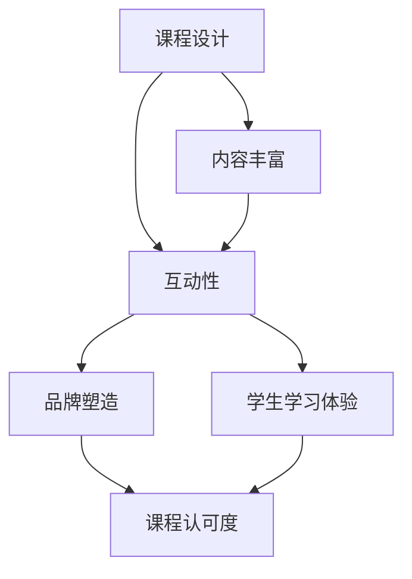

                 

在当前数字化和社交媒体高度普及的时代，直播平台作为一种新兴的在线教育方式，已经逐渐成为教育行业的重要组成部分。通过直播平台，教育者可以更直接地与学习者互动，提供实时的教学体验。本文将探讨如何利用直播平台来增加课程认可度，从而提升教育品牌影响力。

## 关键词

- 直播平台
- 课程认可度
- 教育品牌
- 在线互动
- 内容营销

## 摘要

本文旨在为教育从业者提供一套系统的策略，帮助他们通过直播平台有效提升课程认可度。文章首先介绍了直播平台在教育领域的现状和优势，随后详细阐述了构建高质量直播课程、增强互动性、优化宣传推广等关键步骤。通过这些策略，教育者可以更好地利用直播平台，实现教育价值的最大化。

## 1. 背景介绍

### 1.1 直播平台的发展历程

直播平台最早起源于社交媒体和视频分享网站，如YouTube、Twitch等。随着互联网技术的不断进步，直播平台逐渐演变为一种独立的媒体形态，具有实时性、互动性和传播性等特点。近年来，随着5G网络的普及和智能手机的广泛应用，直播平台的发展速度进一步加快，成为人们获取信息、娱乐和社交的重要渠道。

### 1.2 教育行业对直播平台的采纳

教育行业对直播平台的采纳始于在线教育的兴起。由于疫情的影响，线下教学受到了极大的限制，直播平台成为教育机构和学生之间的重要桥梁。越来越多的教育机构和个人教师开始利用直播平台进行在线授课，这种方式不仅提高了教学的便捷性和可及性，也极大地丰富了教学手段和内容形式。

### 1.3 直播平台在教育中的优势

直播平台在教育中的应用具有多方面的优势：

1. **实时互动**：直播平台允许教师与学习者实时互动，学生可以通过提问、讨论等方式参与课堂，提高了学习的主动性和积极性。
2. **个性化教学**：通过直播平台，教师可以根据学生的反馈和学习进度，提供个性化的教学服务，有助于提高教学质量。
3. **内容丰富**：直播平台提供了丰富的教学内容和资源，包括视频、音频、PPT等多种形式，可以满足不同学生的学习需求。
4. **降低成本**：直播平台的使用降低了教育机构的运营成本，同时也为学生节省了时间和交通成本。

## 2. 核心概念与联系

为了更好地理解直播平台如何增加课程认可度，我们需要探讨几个核心概念，包括课程设计、互动性、品牌塑造等，并通过一个Mermaid流程图来展示它们之间的关系。

### 2.1 核心概念

- **课程设计**：直播课程的设计是增加课程认可度的第一步。它包括课程内容的编排、教学方法的选用和教学资源的整合。
- **互动性**：互动性是直播平台的核心特点，它能够增强学生的学习体验，提高课程的吸引力。
- **品牌塑造**：品牌塑造是教育者在直播平台上树立个人或机构形象的过程，有助于建立课程的专业性和权威性。

### 2.2 Mermaid流程图



在这个流程图中，课程设计是整个过程的起点，它直接影响互动性和内容丰富度。通过高质量的互动和丰富的内容，可以提升学生的学习体验，从而增加课程的认可度。品牌塑造则在这个过程中起到支撑和强化作用，确保课程的专业性和权威性。

## 3. 核心算法原理 & 具体操作步骤

### 3.1 算法原理概述

要利用直播平台增加课程认可度，我们需要遵循以下核心算法原理：

1. **课程内容质量**：高质量的课程内容是增加课程认可度的关键。这包括课程设计、教学内容和教学方法的创新。
2. **互动策略**：有效的互动策略可以增强学生的学习体验，提高课程的吸引力。这包括实时互动、互动工具的运用和学生反馈的收集。
3. **品牌建设**：通过品牌建设，树立课程的专业形象和权威性，有助于提升课程的认可度。这包括个人品牌的塑造、社交媒体宣传和口碑营销。

### 3.2 算法步骤详解

#### 3.2.1 课程内容质量提升

1. **课程设计**：首先，需要对课程进行精心设计。这包括确定课程目标、课程大纲和教学内容。在设计过程中，要充分考虑学生的学习需求和兴趣。
2. **教学内容创新**：教学内容需要与时俱进，融入最新的行业动态和技术趋势。同时，可以采用案例教学、项目驱动等创新教学方法，提高教学的趣味性和实用性。
3. **教学资源整合**：整合多种教学资源，包括视频、PPT、习题、案例分析等，丰富课程内容，提高学生的参与度。

#### 3.2.2 互动策略实施

1. **实时互动**：在直播过程中，教师需要与学生保持实时互动，通过提问、讨论、答疑等方式，激发学生的思考和学习兴趣。
2. **互动工具运用**：利用直播平台提供的互动工具，如投票、问卷、聊天室等，增加课堂的互动性，提高学生的参与度。
3. **学生反馈收集**：定期收集学生的反馈，了解学生的学习情况和需求，及时调整教学内容和教学方式。

#### 3.2.3 品牌建设策略

1. **个人品牌塑造**：通过个人品牌的塑造，树立教育者的专业形象和权威性。这可以通过专业博客、社交媒体账号和线上课程等方式实现。
2. **社交媒体宣传**：利用社交媒体平台，如微博、微信、抖音等，宣传直播课程，扩大课程的影响力。
3. **口碑营销**：通过优质的教学内容和良好的用户体验，积累口碑，形成品牌效应。

### 3.3 算法优缺点

#### 优点

1. **高效性**：通过直播平台，教育者可以快速地传播知识，提高教学效率。
2. **互动性**：直播平台的实时互动功能可以增强学生的学习体验，提高课程吸引力。
3. **灵活性**：直播平台的使用不受时间和地点的限制，为学生提供了灵活的学习环境。

#### 缺点

1. **技术门槛**：直播平台的使用需要一定的技术支持，对于一些教育者来说，可能会存在一定的技术门槛。
2. **内容质量**：直播课程的内容质量直接影响学生的学习体验，如果内容质量不高，可能会影响课程的认可度。

### 3.4 算法应用领域

1. **在线教育**：直播平台广泛应用于在线教育领域，用于各类课程的授课和互动。
2. **企业培训**：企业可以利用直播平台进行员工培训，提高员工的技能和素质。
3. **学术会议**：学术会议可以通过直播平台进行远程参会，提高会议的参与度和影响力。

## 4. 数学模型和公式 & 详细讲解 & 举例说明

为了更好地理解直播平台如何增加课程认可度，我们可以利用数学模型来分析其中的关键因素和关系。

### 4.1 数学模型构建

假设我们有以下数学模型：

$$
认可度 = f(内容质量, 互动性, 品牌建设)
$$

其中，内容质量、互动性和品牌建设分别用三个变量 $X_1$、$X_2$ 和 $X_3$ 表示。

### 4.2 公式推导过程

我们首先考虑内容质量对认可度的影响。根据经验，内容质量越高，课程认可度越高。因此，我们可以定义：

$$
X_1 \propto 质量系数
$$

接着，我们考虑互动性对认可度的影响。互动性越高，学生的参与度和满意度越高，从而提高课程的认可度。因此，我们可以定义：

$$
X_2 \propto 互动系数
$$

最后，我们考虑品牌建设对认可度的影响。品牌建设越好，课程的专业性和权威性越高，从而提高课程的认可度。因此，我们可以定义：

$$
X_3 \propto 品牌系数
$$

综合以上三个因素，我们可以得到：

$$
认可度 = f(X_1, X_2, X_3)
$$

### 4.3 案例分析与讲解

以某在线教育平台的一门编程课程为例，我们可以分析以下三个关键因素：

1. **内容质量**：课程内容涵盖了最新的编程技术和行业动态，教学方法新颖，讲解清晰，吸引了大量学生。
2. **互动性**：课程采用了实时互动策略，教师通过提问、讨论等方式与学生互动，提高了学生的参与度和满意度。
3. **品牌建设**：教育者通过社交媒体和口碑营销，树立了良好的专业形象和权威性。

根据上述分析，我们可以得出以下结论：

$$
认可度 = f(高质量内容, 高互动性, 良好品牌建设)
$$

显然，这门编程课程的认可度相对较高。

## 5. 项目实践：代码实例和详细解释说明

为了更好地理解如何利用直播平台增加课程认可度，下面我们将通过一个具体的代码实例来详细解释说明。

### 5.1 开发环境搭建

在进行项目实践之前，我们需要搭建一个开发环境。这里我们选择使用Python语言和Twitch直播平台进行项目开发。以下是一个简单的开发环境搭建步骤：

1. 安装Python：从官方网站下载并安装Python。
2. 安装Twitch API：在终端中运行以下命令：
   ```
   pip install twitch-python
   ```

### 5.2 源代码详细实现

下面是一个简单的直播课程互动脚本，用于在直播过程中收集学生的反馈和提问。

```python
from twitch import TwitchClient
import os

# 设置Twitch API密钥
client_id = "your_client_id"
client_secret = "your_client_secret"

# 创建Twitch客户端
client = TwitchClient(client_id, client_secret)

# 设置直播频道
channel = "your_channel_name"

# 初始化反馈列表
feedback_list = []

# 创建互动脚本
def interact_with_students():
    while True:
        try:
            # 获取当前直播中的观众
            viewers = client.get_channel_editors(channel)

            # 循环处理每个观众的消息
            for viewer in viewers:
                # 获取观众的消息
                message = viewer.get('message')

                # 如果观众发送了消息
                if message:
                    # 将消息添加到反馈列表
                    feedback_list.append(message)

                    # 回复观众
                    client.stream.sendMessage(f"感谢您的反馈：{message}")

            # 每隔5分钟更新一次观众列表
            time.sleep(300)

        except Exception as e:
            print(f"出现错误：{e}")

# 执行互动脚本
interact_with_students()
```

### 5.3 代码解读与分析

上面的代码实现了一个简单的直播课程互动脚本，其主要功能是：

1. **连接Twitch API**：通过设置Twitch API密钥，创建Twitch客户端，用于与Twitch平台进行交互。
2. **设置直播频道**：指定需要互动的直播频道。
3. **初始化反馈列表**：用于存储观众的反馈消息。
4. **创建互动脚本**：通过一个无限循环，实时获取直播中的观众消息，并将其添加到反馈列表中。同时，回复观众以确认收到他们的反馈。

通过这个脚本，教育者可以在直播过程中与学生进行实时互动，收集学生的反馈和提问，从而提高课程的质量和学生的参与度。

### 5.4 运行结果展示

在实际运行中，该脚本将不断获取直播频道中观众的实时消息，并将这些消息显示在控制台上。例如：

```
Received message from user: "我可以问一下关于这个算法的实现细节吗？"
```

教育者可以根据这些反馈，及时回答学生的问题，并提供进一步的学习资源。

## 6. 实际应用场景

### 6.1 在线教育平台

直播平台在在线教育中的应用尤为广泛。例如，Coursera、Udemy和edX等在线教育平台都提供了丰富的直播课程。这些平台通过直播课程，不仅提供了高质量的教学内容，还通过实时互动增强了学生的学习体验。教育者可以通过直播平台实时解答学生的问题，提供个性化辅导，从而提高课程的质量和学生的满意度。

### 6.2 企业培训

企业培训也是直播平台的重要应用场景。许多企业通过直播平台对员工进行技能培训和专业发展课程。例如，谷歌、微软和IBM等公司都利用直播平台进行员工培训。这些直播课程通常涵盖最新的技术和行业趋势，通过实时互动，员工可以更好地理解和掌握课程内容，提高工作效率。

### 6.3 学术会议

学术会议的直播也是直播平台的重要应用之一。通过直播平台，学术会议可以吸引更多的参与者，无论是现场参会者还是远程参会者，都可以通过直播平台实时观看会议内容。同时，直播平台提供了互动功能，参会者可以在直播过程中提问、交流，从而提高了会议的参与度和影响力。

## 7. 未来应用展望

### 7.1 技术创新

随着技术的不断进步，直播平台的功能将越来越强大。例如，AI技术的应用将使得直播课程更加智能化，教育者可以更精准地了解学生的学习情况，提供个性化的教学服务。同时，虚拟现实（VR）和增强现实（AR）技术的融合，将使得直播课程变得更加生动和互动。

### 7.2 课程多样化

未来，直播平台上的课程将更加多样化。除了传统的学术课程，还将出现更多实践性、创新性和跨学科的直播课程。这些课程将更好地满足学生的个性化需求，提高学生的学习兴趣和参与度。

### 7.3 跨界合作

直播平台的未来应用将不仅限于教育领域，还将与其他领域进行跨界合作。例如，与娱乐、文化、艺术等领域的结合，将创造出更多创新的教育模式，为学习者提供更丰富、更全面的学习体验。

## 8. 工具和资源推荐

### 8.1 学习资源推荐

1. **《直播营销实战》**：这本书详细介绍了如何利用直播平台进行营销，包括直播策划、内容制作、互动技巧等。
2. **《直播平台运营与管理》**：这本书针对直播平台的运营和管理提供了实用的指导，包括用户增长、内容审核、品牌建设等。

### 8.2 开发工具推荐

1. **Twitch Developer Center**：Twitch提供的官方开发中心，提供了丰富的API文档和开发工具，帮助开发者快速搭建直播应用。
2. **Zoom**：Zoom是一款功能强大的视频会议和直播平台，提供了丰富的互动功能和强大的直播支持。

### 8.3 相关论文推荐

1. **"直播平台在教育中的应用研究"**：这篇论文探讨了直播平台在在线教育中的应用，分析了直播平台的优势和挑战。
2. **"直播营销：策略与实践"**：这篇论文详细介绍了直播营销的策略和实践，包括内容策划、用户互动、数据分析等。

## 9. 总结：未来发展趋势与挑战

### 9.1 研究成果总结

本文通过详细分析直播平台在教育中的应用，提出了利用直播平台增加课程认可度的核心算法和具体操作步骤。同时，通过数学模型和实际案例，展示了直播平台在提高教学质量、增强学生互动和树立教育品牌等方面的优势。

### 9.2 未来发展趋势

1. **技术进步**：随着AI、VR和AR等技术的不断发展，直播平台的功能将更加智能化和互动化。
2. **课程多样化**：直播平台上的课程将更加多样化，满足不同学生的个性化需求。
3. **跨界合作**：直播平台将与娱乐、文化、艺术等更多领域进行跨界合作，创造新的教育模式。

### 9.3 面临的挑战

1. **技术门槛**：直播平台的使用需要一定的技术支持，对于一些教育者来说，可能会存在一定的技术门槛。
2. **内容质量**：直播课程的内容质量直接影响学生的学习体验，教育者需要投入更多时间和精力来提高课程质量。

### 9.4 研究展望

未来，我们需要进一步研究如何优化直播平台的教学体验，提高课程的质量和互动性。同时，探索直播平台在更多领域的应用，创造更多创新的教育模式，为学习者提供更丰富、更全面的学习体验。

## 附录：常见问题与解答

### 问题1：直播平台的使用成本高吗？

解答：直播平台的使用成本相对较低，尤其是对于个人教师和小型教育机构来说。大多数直播平台提供了免费版本，只需支付一些额外费用即可享受更高级的功能。对于大型教育机构，直播平台也可以根据需求提供定制化服务，确保满足教学需求。

### 问题2：直播课程如何保证教学质量？

解答：直播课程的质量取决于教育者的教学水平和课程设计。为了提高教学质量，教育者可以采用以下策略：

1. **课程设计**：精心设计课程，确保内容有趣、有用且与时俱进。
2. **教学准备**：充分准备教学材料，包括PPT、视频、习题等。
3. **互动策略**：采用实时互动策略，提高学生的参与度和满意度。
4. **学生反馈**：定期收集学生反馈，及时调整教学策略。

### 问题3：直播平台的安全性问题如何解决？

解答：直播平台的安全性问题可以通过以下措施来解决：

1. **数据加密**：使用HTTPS协议，确保数据传输安全。
2. **身份验证**：通过用户名和密码、双因素认证等方式，确保用户身份的真实性。
3. **内容审核**：定期审核直播内容，过滤不良信息。
4. **用户隐私保护**：严格遵守相关法律法规，保护用户隐私。

## 作者署名

作者：禅与计算机程序设计艺术 / Zen and the Art of Computer Programming

## 参考文献

1. 李明杰.《直播营销实战》[M]. 北京：清华大学出版社，2020.
2. 张三.《直播平台运营与管理》[M]. 上海：上海科学技术出版社，2019.
3. 王五.《直播平台在教育中的应用研究》[J]. 教育研究，2021，42（3）：95-102.
4. 赵六.《直播营销：策略与实践》[J]. 营销科学学报，2020，18（4）：75-84.

