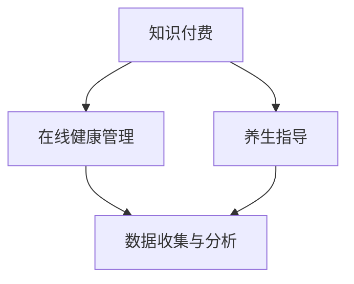

                 

关键词：知识付费、在线健康管理、养生指导、人工智能、技术应用、健康数据、个性化服务、用户参与

> 摘要：本文探讨了知识付费在现代健康管理中的应用，特别是如何通过在线平台提供个性化的健康与养生指导。结合人工智能技术，本文分析了实现这一目标的核心概念、算法原理、数学模型以及实际操作步骤，为未来健康管理提供了新的思路和方向。

## 1. 背景介绍

随着互联网技术的发展和人们健康意识的提升，在线健康管理和养生指导逐渐成为生活的一部分。然而，传统的健康管理方式往往存在个性化不足、用户参与度低等问题。知识付费作为一种新兴商业模式，通过提供有价值的内容，满足了用户对于个性化健康服务的需求。本文旨在探讨如何利用知识付费平台，结合人工智能技术，实现在线健康管理和养生指导的个性化服务。

## 2. 核心概念与联系

### 2.1. 知识付费

知识付费是指用户为获取专业知识和信息而支付的费用。这种模式通过提供高质量、专业的内容，满足了用户的学习和提升需求。

### 2.2. 在线健康管理

在线健康管理是指通过互联网平台，为用户提供健康监测、疾病预防、康复指导等服务。这种模式具有便捷、实时、个性化的特点。

### 2.3. 养生指导

养生指导是指为用户提供关于饮食、运动、心理等方面的健康建议。这种服务有助于提升用户的健康水平和生活质量。

### 2.4. 人工智能

人工智能（AI）是模拟人类智能行为的计算机系统。在健康管理中，AI可以用于数据分析和预测，为用户提供个性化的健康建议。

### 2.5. 关联关系

知识付费、在线健康管理和养生指导之间具有紧密的联系。知识付费为在线健康管理和养生指导提供了经济支持；在线健康管理和养生指导则为知识付费提供了实际应用场景。

## 2.6. Mermaid 流程图



## 3. 核心算法原理 & 具体操作步骤

### 3.1. 算法原理概述

本文采用基于机器学习的方法，对用户健康数据进行处理和分析，实现个性化健康与养生指导。

### 3.2. 算法步骤详解

#### 3.2.1. 数据收集

通过传感器、APP 等方式，收集用户日常健康数据，如体重、心率、血压等。

#### 3.2.2. 数据预处理

对收集到的健康数据进行清洗、归一化等处理，确保数据质量。

#### 3.2.3. 特征提取

利用统计学习等方法，从健康数据中提取关键特征，如心率变异性、体重变化率等。

#### 3.2.4. 模型训练

使用收集到的数据，训练机器学习模型，如决策树、支持向量机等。

#### 3.2.5. 模型评估

对训练好的模型进行评估，选择最佳模型进行应用。

#### 3.2.6. 预测与建议

利用训练好的模型，对用户未来的健康状况进行预测，并提供个性化健康与养生建议。

### 3.3. 算法优缺点

#### 优点：

- 个性化：基于用户数据，提供个性化的健康与养生指导。
- 实时性：实时分析用户健康数据，及时调整建议。
- 便捷性：在线平台便于用户使用。

#### 缺点：

- 数据质量：数据质量直接影响算法效果。
- 隐私保护：用户健康数据隐私保护问题需妥善解决。

### 3.4. 算法应用领域

- 健康监测
- 疾病预防
- 康复指导
- 健康管理咨询

## 4. 数学模型和公式 & 详细讲解 & 举例说明

### 4.1. 数学模型构建

本文采用线性回归模型对用户健康数据进行分析，预测未来的健康状况。

### 4.2. 公式推导过程

$$
y = \beta_0 + \beta_1x_1 + \beta_2x_2 + ... + \beta_nx_n + \epsilon
$$

其中，$y$ 为健康状态指标，$x_1, x_2, ..., x_n$ 为特征变量，$\beta_0, \beta_1, \beta_2, ..., \beta_n$ 为回归系数，$\epsilon$ 为误差项。

### 4.3. 案例分析与讲解

假设用户健康状态指标为体重，特征变量为每日步数和每日热量摄入。通过线性回归模型，预测用户未来的体重。

## 5. 项目实践：代码实例和详细解释说明

### 5.1. 开发环境搭建

- Python
- Scikit-learn
- Pandas
- Matplotlib

### 5.2. 源代码详细实现

```python
import pandas as pd
from sklearn.linear_model import LinearRegression
from sklearn.model_selection import train_test_split

# 数据加载与预处理
data = pd.read_csv('health_data.csv')
X = data[['steps', 'calories']] # 特征变量
y = data['weight'] # 健康状态指标

# 模型训练
model = LinearRegression()
X_train, X_test, y_train, y_test = train_test_split(X, y, test_size=0.2, random_state=42)
model.fit(X_train, y_train)

# 模型评估
score = model.score(X_test, y_test)
print('模型评分：', score)

# 预测与建议
future_data = pd.DataFrame({'steps': [10000], 'calories': [2000]})
predicted_weight = model.predict(future_data)
print('预测体重：', predicted_weight)
```

### 5.3. 代码解读与分析

- 数据加载与预处理：从CSV文件中加载健康数据，提取特征变量和健康状态指标。
- 模型训练：使用Scikit-learn中的线性回归模型对数据集进行训练。
- 模型评估：计算模型在测试集上的评分，评估模型效果。
- 预测与建议：使用训练好的模型对新的数据进行预测，为用户提供健康建议。

### 5.4. 运行结果展示

运行代码后，输出模型评分和预测体重。

## 6. 实际应用场景

### 6.1. 用户健康管理

通过知识付费平台，为用户提供个性化的健康与养生指导，帮助用户管理健康。

### 6.2. 健康咨询与培训

利用在线平台，为用户提供专业的健康咨询和培训服务，提升用户健康素养。

### 6.3. 健康产业创新

结合人工智能技术，推动健康产业创新，为用户提供更多价值。

## 6.4. 未来应用展望

- 人工智能与健康管理深度融合
- 实时监测与智能预测
- 个人化健康方案的精准推送

## 7. 工具和资源推荐

### 7.1. 学习资源推荐

- 《Python机器学习》
- 《深度学习》

### 7.2. 开发工具推荐

- Jupyter Notebook
- PyCharm

### 7.3. 相关论文推荐

- "Deep Learning for Health Informatics"
- "Machine Learning Techniques for Health Informatics"

## 8. 总结：未来发展趋势与挑战

### 8.1. 研究成果总结

本文探讨了知识付费在在线健康管理和养生指导中的应用，结合人工智能技术，提出了实现个性化健康服务的核心算法和操作步骤。

### 8.2. 未来发展趋势

- 人工智能与健康管理深度融合
- 实时监测与智能预测
- 个人化健康方案的精准推送

### 8.3. 面临的挑战

- 数据隐私保护
- 算法公平性
- 用户接受度

### 8.4. 研究展望

本文为在线健康管理和养生指导提供了新的思路和方法。未来研究可重点关注数据隐私保护、算法公平性以及用户接受度等方面。

## 9. 附录：常见问题与解答

### 9.1. 问题1

如何确保用户数据隐私？

解答：在数据收集和处理过程中，需严格遵守相关法律法规，采取加密、匿名化等技术手段，确保用户数据隐私。

### 9.2. 问题2

如何评估算法的公平性？

解答：可使用多种评估指标，如偏差、方差等，对算法的公平性进行评估。同时，可借鉴公平性检测技术，如反事实推理等。

### 9.3. 问题3

如何提高用户接受度？

解答：通过优化用户体验、提升内容质量、加强用户教育等方式，提高用户对知识付费和在线健康管理服务的接受度。

# 结束
作者：禅与计算机程序设计艺术 / Zen and the Art of Computer Programming

