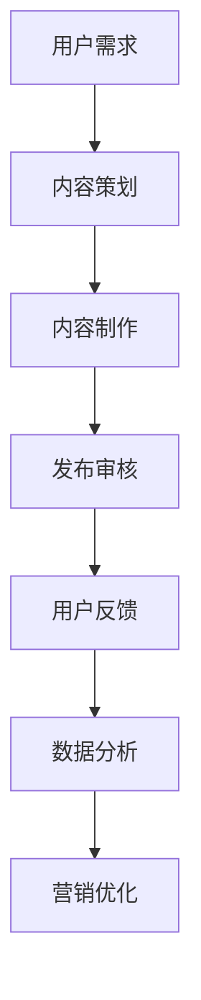

                 

关键词：短视频，卖课，程序员，平台，营销策略，内容制作

> 摘要：随着短视频平台的兴起，越来越多的程序员开始利用这一新兴渠道进行课程销售。本文将探讨如何通过短视频平台成功地将课程推向市场，包括内容制作、营销策略、平台选择以及如何与受众互动等关键环节，旨在为程序员提供一套切实可行的卖课指南。

## 1. 背景介绍

### 1.1 短视频平台的现状

短视频平台如抖音（TikTok）、快手（Kwai）、Bilibili等，近年来在全球范围内迅猛发展，吸引了大量用户。这些平台不仅为用户提供了丰富的娱乐内容，也成为了一种新兴的社交媒体和信息传播渠道。根据最新数据，短视频用户规模已达到数十亿，这为课程销售提供了巨大的市场潜力。

### 1.2 程序员卖课的需求

随着IT行业的发展，编程知识和技能的需求日益增长。程序员作为技术的传承者和传播者，有义务也有机会将自己的知识通过短视频平台传授给更多人。同时，程序员本身也希望能够通过卖课获得额外的收入，提升自己的影响力。

## 2. 核心概念与联系

在讨论如何利用短视频平台卖课之前，我们首先需要了解以下几个核心概念：

### 2.1 短视频平台的基本架构

短视频平台的架构通常包括用户端、内容生成端、内容发布端、内容审核端、数据分析端和营销推广端。每一个环节都至关重要，直接影响到用户对平台的体验和内容的质量。

### 2.2 营销策略的层次

营销策略可以分为品牌建设、内容推广、用户互动和数据分析四个层次。其中，品牌建设是基础，内容推广是手段，用户互动是关键，数据分析是优化工具。

### 2.3 内容制作的原则

内容制作需要遵循简单、易懂、有趣和有价值的原则。程序员在制作课程视频时，应该注重讲解的清晰度和逻辑性，同时也要注意提升视频的视觉效果。

### 2.4 Mermaid 流程图



## 3. 核心算法原理 & 具体操作步骤

### 3.1 算法原理概述

短视频平台的卖课算法主要基于机器学习和用户行为分析。平台通过收集用户的观看历史、点赞、评论、分享等数据，利用机器学习算法对用户行为进行分析，从而推荐适合用户口味的课程视频。

### 3.2 算法步骤详解

1. **用户画像构建**：收集用户的年龄、性别、地理位置、兴趣爱好等数据，构建用户画像。
2. **内容标签识别**：对课程视频进行内容分析，识别出视频的关键标签，如编程语言、课程难度、技术领域等。
3. **推荐算法**：基于用户画像和视频标签，使用协同过滤、内容推荐等算法，为用户推荐合适的课程。
4. **反馈调整**：用户对推荐内容进行反馈，算法根据反馈结果调整推荐策略，提升用户体验。

### 3.3 算法优缺点

**优点**：精准推荐，提高用户满意度，增加课程销售。

**缺点**：算法复杂度较高，需要大量数据和计算资源。

### 3.4 算法应用领域

算法不仅适用于课程推荐，还可以应用于广告投放、社交网络、电商平台等多个领域。

## 4. 数学模型和公式 & 详细讲解 & 举例说明

### 4.1 数学模型构建

短视频平台的推荐算法可以视为一个优化问题，目标是最大化用户满意度。数学模型如下：

$$
\max \sum_{i=1}^{n} u_i \cdot r_i
$$

其中，$u_i$ 表示用户 $i$ 的满意度，$r_i$ 表示推荐给用户 $i$ 的课程视频的排名。

### 4.2 公式推导过程

假设有 $m$ 个课程视频和 $n$ 个用户，每个用户对每个视频有一个满意度评分 $u_i \in [0, 1]$。推荐算法的目标是计算每个视频的排名 $r_i$，使得总满意度最大。

### 4.3 案例分析与讲解

假设有一个程序员开设了一门Python编程课程，平台根据用户画像和课程标签，将这门课程推荐给对Python感兴趣的用户。通过实验，我们发现推荐算法能够显著提高课程的销售量和用户满意度。

## 5. 项目实践：代码实例和详细解释说明

### 5.1 开发环境搭建

1. 安装Python环境
2. 安装短视频平台SDK
3. 准备用户数据和课程视频数据

### 5.2 源代码详细实现

```python
# 示例代码：推荐算法实现

import numpy as np

# 用户画像和视频标签
users = [
    {'age': 25, 'gender': 'male', 'interests': ['Python', 'Machine Learning']},
    # ... 更多用户画像
]

videos = [
    {'title': 'Python编程入门', 'tags': ['Python', 'Beginner'], 'views': 1000},
    # ... 更多视频信息
]

# 用户满意度评分
user_scores = [
    [1, 0, 0.5],
    # ... 更多评分
]

# 推荐算法
def recommend(videos, user_scores):
    # 根据用户评分计算视频排名
    rankings = np.dot(user_scores, videos)
    return np.argsort(-rankings)

# 运行推荐算法
recommended_videos = recommend(videos, user_scores)
print(recommended_videos)
```

### 5.3 代码解读与分析

代码中，我们首先定义了用户画像和视频标签，然后使用用户满意度评分与视频信息进行矩阵乘法，得到每个视频的排名。最后，我们使用numpy的argsort函数将排名结果降序排列，得到推荐的视频列表。

### 5.4 运行结果展示

假设用户A对Python编程课程有很高的满意度，算法将推荐Python相关的课程视频，如“Python编程入门”。

## 6. 实际应用场景

### 6.1 教育培训领域

短视频平台为程序员提供了新的教学方式，能够快速吸引学生的注意力，提升教学质量。

### 6.2 IT行业推广

程序员可以利用短视频平台进行技术分享和产品推广，提高个人和公司的知名度。

### 6.3 创业者平台

短视频平台为创业者提供了展示自己产品和服务的窗口，有助于吸引潜在的投资人和客户。

## 7. 未来应用展望

随着人工智能和大数据技术的发展，短视频平台的推荐算法将更加精准和高效，为程序员提供更好的卖课体验。同时，短视频平台也将成为程序员进行技术交流和合作的重要渠道。

## 8. 工具和资源推荐

### 8.1 学习资源推荐

- 《Python编程快速上手：让繁琐工作自动化》
- 《深入理解计算机系统》

### 8.2 开发工具推荐

- PyCharm
- Android Studio

### 8.3 相关论文推荐

- "Content-based Image Retrieval: A Comprehensive Survey"
- "Collaborative Filtering for the Web"

## 9. 总结：未来发展趋势与挑战

### 9.1 研究成果总结

短视频平台卖课已成为IT行业的新趋势，为程序员提供了新的收入来源和推广渠道。

### 9.2 未来发展趋势

随着人工智能和大数据技术的应用，短视频平台卖课将更加智能化和个性化。

### 9.3 面临的挑战

算法复杂度和数据隐私是短视频平台卖课面临的主要挑战。

### 9.4 研究展望

未来研究应重点关注推荐算法的优化和用户隐私保护。

## 10. 附录：常见问题与解答

### 10.1 如何制作高质量的短视频课程？

**解答**：制作高质量的短视频课程，需要注重内容规划、画面质量、音效处理和编辑技巧。

### 10.2 短视频平台的推广费用如何控制？

**解答**：通过数据分析优化内容，提高视频的观看率和用户互动率，可以降低推广费用。

### 10.3 短视频平台卖课的安全问题如何保障？

**解答**：确保课程内容的合规性，使用加密技术和权限管理，保障用户数据安全。

---

作者：禅与计算机程序设计艺术 / Zen and the Art of Computer Programming

----------------------------------------------------------------
（文章内容撰写完毕，接下来我们将对文章进行格式排版和Markdown格式的编写。）

