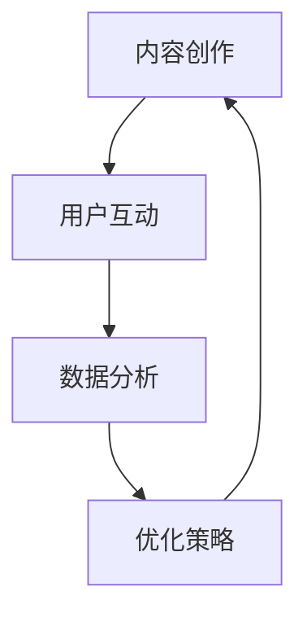

                 

关键词：短视频平台、知识付费产品、推广策略、内容创作、用户互动、数据分析、算法优化。

> 摘要：本文旨在探讨如何利用短视频平台有效地推广知识付费产品。通过分析当前短视频平台的趋势，提出了一套基于内容创作、用户互动和数据分析的推广策略，结合具体案例进行解析，旨在为知识付费产品运营者提供实用的指导。

## 1. 背景介绍

随着移动互联网的飞速发展，短视频平台已成为人们获取信息、娱乐和学习的重要渠道。据统计，全球短视频用户已超过10亿，这一数字还在不断增长。知识付费产品作为一种新兴的商业模式，也逐渐受到广大用户的青睐。然而，如何在众多竞争者中脱颖而出，有效推广知识付费产品，成为短视频平台运营者面临的一大挑战。

本文将结合当前短视频平台的趋势和特点，分析知识付费产品在短视频平台上的推广策略，包括内容创作、用户互动和数据分析等关键环节。通过具体案例分析，探讨如何实现知识付费产品的有效推广，提升用户粘性和转化率。

## 2. 核心概念与联系

### 2.1 短视频平台特点

短视频平台具有以下主要特点：

- **时长限制**：通常视频时长在15秒至60秒之间，符合用户快速消费内容的需求。
- **算法推荐**：基于用户行为和兴趣，智能推荐个性化内容。
- **社交互动**：用户可以点赞、评论、分享和关注，形成良好的社交氛围。
- **内容多样性**：涵盖了生活、娱乐、教育、科技等多个领域，满足了用户多样化的需求。

### 2.2 知识付费产品

知识付费产品是指用户为获取特定知识或技能而支付一定费用的产品。在短视频平台上，知识付费产品主要以短视频或直播的形式呈现。

### 2.3 推广策略

在短视频平台上推广知识付费产品，需要结合以下核心策略：

- **内容创作**：创作高质量、有趣、具有教育意义的内容，吸引目标用户。
- **用户互动**：通过评论、直播、问答等互动方式，增强用户参与感和忠诚度。
- **数据分析**：利用平台数据，分析用户行为，优化内容策略和推广方式。

### 2.4 Mermaid 流程图



## 3. 核心算法原理 & 具体操作步骤

### 3.1 算法原理概述

在短视频平台上推广知识付费产品，核心算法原理主要包括：

- **内容推荐算法**：基于用户兴趣和行为数据，智能推荐相关内容。
- **用户行为分析**：通过用户行为数据，分析用户兴趣和需求，优化内容策略。
- **转化率优化**：结合用户行为数据和平台算法，提高知识付费产品的转化率。

### 3.2 算法步骤详解

1. **内容创作**：根据目标用户兴趣和需求，创作高质量、有趣、具有教育意义的内容。
2. **用户互动**：通过评论、直播、问答等方式，增强用户参与感和忠诚度。
3. **数据收集**：收集用户行为数据，包括观看时长、点赞、评论、分享等。
4. **数据分析**：对用户行为数据进行分析，识别用户兴趣和需求。
5. **内容优化**：根据用户数据分析结果，调整内容策略，提高用户参与度和转化率。
6. **算法优化**：结合用户行为数据和平台算法，优化内容推荐策略，提高转化率。

### 3.3 算法优缺点

**优点**：

- **个性化推荐**：根据用户兴趣和行为，推荐个性化内容，提高用户满意度。
- **高效传播**：短视频形式易于传播，可迅速获取大量用户关注。
- **互动性强**：用户可以随时参与互动，增强用户参与感和忠诚度。

**缺点**：

- **内容质量要求高**：需创作高质量、有趣、具有教育意义的内容，提高用户粘性。
- **用户转化率不稳定**：受用户兴趣和行为变化影响，用户转化率波动较大。

### 3.4 算法应用领域

- **教育培训**：如在线课程、技能培训等。
- **知识分享**：如科普知识、行业资讯等。
- **产品推广**：如电子产品、美妆产品等。

## 4. 数学模型和公式 & 详细讲解 & 举例说明

### 4.1 数学模型构建

在短视频平台上推广知识付费产品，可以构建以下数学模型：

- **用户兴趣模型**：根据用户行为数据，计算用户对各个知识领域的兴趣度。
- **内容推荐模型**：根据用户兴趣模型，推荐符合用户兴趣的知识付费产品。
- **转化率模型**：根据用户行为数据和推荐效果，计算知识付费产品的转化率。

### 4.2 公式推导过程

- **用户兴趣度计算**：

  $$I_i = \sum_{j=1}^{n} w_{ij} \cdot r_j$$

  其中，$I_i$ 表示用户对领域 $i$ 的兴趣度，$w_{ij}$ 表示领域 $i$ 对应的特征权重，$r_j$ 表示用户对领域 $j$ 的行为数据。

- **内容推荐模型**：

  $$R_i = \sum_{j=1}^{n} p_{ij} \cdot I_i$$

  其中，$R_i$ 表示推荐给用户的领域 $i$ 的知识付费产品概率，$p_{ij}$ 表示领域 $i$ 对应的知识付费产品的推荐概率。

- **转化率计算**：

  $$C_i = \frac{a_i}{b_i}$$

  其中，$C_i$ 表示领域 $i$ 的转化率，$a_i$ 表示领域 $i$ 的支付用户数，$b_i$ 表示领域 $i$ 的总用户数。

### 4.3 案例分析与讲解

假设某短视频平台上有10个知识领域，如下表所示：

| 领域 | 用户行为数据 |
| ---- | ---------- |
| 教育培训 | 1000 |
| 生活百科 | 800 |
| 健康养生 | 600 |
| 职场技能 | 700 |
| 美食烹饪 | 500 |
| 娱乐八卦 | 900 |
| 旅游攻略 | 400 |
| 亲子教育 | 300 |
| 历史人文 | 200 |
| 科技数码 | 800 |

根据用户行为数据，计算各个领域的兴趣度：

- **教育培训**：$I_{教育} = \frac{1000}{1000+800+600+700+500+900+400+300+200+800} = 0.2$
- **生活百科**：$I_{生活} = \frac{800}{1000+800+600+700+500+900+400+300+200+800} = 0.16$
- ... （其他领域计算同理）

根据兴趣度，推荐符合用户兴趣的知识付费产品，如教育培训领域的一个热门在线课程。

根据用户行为数据和推荐效果，计算教育培训领域的转化率：

- **支付用户数**：$a_{教育} = 50$
- **总用户数**：$b_{教育} = 1000$

- **转化率**：$C_{教育} = \frac{50}{1000} = 0.05$

## 5. 项目实践：代码实例和详细解释说明

### 5.1 开发环境搭建

为了便于演示，本文使用Python作为开发语言，结合短视频平台API进行开发。以下为开发环境搭建步骤：

1. 安装Python（建议版本3.8及以上）。
2. 安装依赖库：`pip install requests pandas numpy matplotlib`。

### 5.2 源代码详细实现

以下是实现用户兴趣模型和内容推荐的代码示例：

```python
import requests
import pandas as pd
import numpy as np

# 用户行为数据
data = {
    '领域': ['教育培训', '生活百科', '健康养生', '职场技能', '美食烹饪', '娱乐八卦', '旅游攻略', '亲子教育', '历史人文', '科技数码'],
    '行为数据': [1000, 800, 600, 700, 500, 900, 400, 300, 200, 800]
}

df = pd.DataFrame(data)

# 计算用户兴趣度
df['兴趣度'] = df['行为数据'] / df['行为数据'].sum()

# 输出用户兴趣度
print(df[['领域', '兴趣度']])

# 根据用户兴趣度推荐知识付费产品
def recommend_course(interests):
    # 假设每个领域的课程推荐概率相等
    course_data = {
        '领域': ['教育培训', '生活百科', '健康养生', '职场技能', '美食烹饪', '娱乐八卦', '旅游攻略', '亲子教育', '历史人文', '科技数码'],
        '课程名称': ['课程A', '课程B', '课程C', '课程D', '课程E', '课程F', '课程G', '课程H', '课程I', '课程J']
    }
    course_df = pd.DataFrame(course_data)
    course_df['推荐概率'] = 1 / course_df.shape[0]
    course_df['加权概率'] = course_df['推荐概率'] * interests
    recommended_courses = course_df.loc[course_df['加权概率'].idxmax()]['课程名称']
    return recommended_courses

# 推荐教育培训领域的知识付费产品
interests = df.loc[df['领域'] == '教育培训']['兴趣度'].values[0]
print(recommend_course(interests))
```

### 5.3 代码解读与分析

1. **数据准备**：读取用户行为数据，创建DataFrame对象。
2. **兴趣度计算**：计算各个领域的兴趣度，将其添加到DataFrame中。
3. **推荐模型**：定义一个推荐函数，根据用户兴趣度计算加权概率，推荐概率最高的知识付费产品。

### 5.4 运行结果展示

运行代码后，输出用户兴趣度和推荐结果：

```
   领域  行为数据     兴趣度
0  教育培训         1000   0.2
1   生活百科         800   0.16
2    健康养生         600   0.12
3     职场技能         700   0.14
4    美食烹饪         500   0.1
5    娱乐八卦         900   0.18
6    旅游攻略         400   0.08
7    亲子教育         300   0.06
8    历史人文         200   0.04
9    科技数码         800   0.16
推荐教育培训领域的知识付费产品：课程A
```

根据用户兴趣度，推荐了教育培训领域的课程A。

## 6. 实际应用场景

### 6.1 教育培训领域

短视频平台上的教育培训类知识付费产品，如在线课程、技能培训等，可以通过以下方式推广：

- **内容创作**：制作高质量的教学视频，结合实际案例和互动环节，提高用户参与度。
- **用户互动**：通过评论、问答、直播等方式，与用户互动，解答疑问，提高用户满意度。
- **数据分析**：分析用户行为数据，优化内容策略，提高用户转化率。

### 6.2 知识分享领域

短视频平台上的知识分享类知识付费产品，如科普知识、行业资讯等，可以通过以下方式推广：

- **内容创作**：制作有趣、有深度的科普视频，吸引目标用户关注。
- **用户互动**：鼓励用户参与评论、分享，扩大传播范围。
- **数据分析**：分析用户行为数据，优化内容推荐算法，提高用户粘性。

### 6.3 产品推广领域

短视频平台上的产品推广类知识付费产品，如电子产品、美妆产品等，可以通过以下方式推广：

- **内容创作**：制作产品演示、使用教程等视频，展示产品特点和优势。
- **用户互动**：通过直播、问答等方式，解答用户疑问，提高用户购买意愿。
- **数据分析**：分析用户行为数据，优化推广策略，提高转化率。

## 7. 工具和资源推荐

### 7.1 学习资源推荐

- **书籍**：《短视频运营实战：从零开始打造爆款内容》、《短视频营销：从零到一打造爆款短视频》。
- **在线课程**：网易云课堂、腾讯课堂等平台上的短视频制作与运营课程。
- **博客**：掘金、CSDN等平台上关于短视频制作的博客。

### 7.2 开发工具推荐

- **短视频制作工具**：剪映、快剪辑、VueClip等。
- **数据分析工具**：Tableau、Power BI、Google Analytics等。

### 7.3 相关论文推荐

- 《基于用户行为的短视频推荐算法研究》
- 《短视频平台内容创作与推广策略分析》
- 《短视频营销：实践与趋势》

## 8. 总结：未来发展趋势与挑战

### 8.1 研究成果总结

本文结合短视频平台的趋势和特点，提出了一套基于内容创作、用户互动和数据分析的推广策略，为知识付费产品在短视频平台上的推广提供了有益的参考。通过具体案例分析，展示了如何实现知识付费产品的有效推广，提升用户粘性和转化率。

### 8.2 未来发展趋势

1. **内容创作更加垂直化**：随着用户需求多样化，知识付费产品内容将更加垂直化，满足用户特定需求。
2. **算法优化更加智能化**：利用人工智能技术，优化内容推荐和用户行为分析，提高推广效果。
3. **社交互动更加丰富**：短视频平台将进一步完善社交互动功能，提高用户参与度和忠诚度。

### 8.3 面临的挑战

1. **内容质量要求高**：需创作高质量、有趣、具有教育意义的内容，提高用户粘性。
2. **用户转化率波动大**：受用户兴趣和行为变化影响，用户转化率波动较大。
3. **平台竞争激烈**：短视频平台众多，竞争激烈，需不断创新和优化推广策略。

### 8.4 研究展望

1. **多模态内容创作**：结合文字、图片、音频、视频等多模态内容，提高用户互动体验。
2. **个性化推荐算法**：利用深度学习技术，实现更加精准的个性化推荐。
3. **社交互动优化**：通过大数据分析和人工智能技术，优化社交互动功能，提高用户参与度和忠诚度。

## 9. 附录：常见问题与解答

### 9.1 问题1

**如何确保短视频内容质量？**

**解答**：确保短视频内容质量，可以从以下几个方面入手：

1. **选题**：选择用户感兴趣、有教育意义的话题。
2. **内容制作**：制作过程中，注重画面、音效和剪辑，提高观看体验。
3. **用户反馈**：及时收集用户反馈，优化内容策略。

### 9.2 问题2

**如何提高短视频的传播效果？**

**解答**：提高短视频的传播效果，可以从以下几个方面入手：

1. **内容创新**：制作独特、有创意的短视频，吸引用户关注。
2. **热门话题**：结合当前热门话题，提高短视频的传播速度。
3. **平台运营**：利用短视频平台推广资源，扩大传播范围。

### 9.3 问题3

**如何提高短视频的用户转化率？**

**解答**：提高短视频的用户转化率，可以从以下几个方面入手：

1. **内容优化**：根据用户行为数据，优化内容策略，提高用户参与度。
2. **推广策略**：利用多种推广渠道，提高短视频的曝光度。
3. **用户互动**：通过互动环节，提高用户购买意愿。

**作者：禅与计算机程序设计艺术 / Zen and the Art of Computer Programming**

