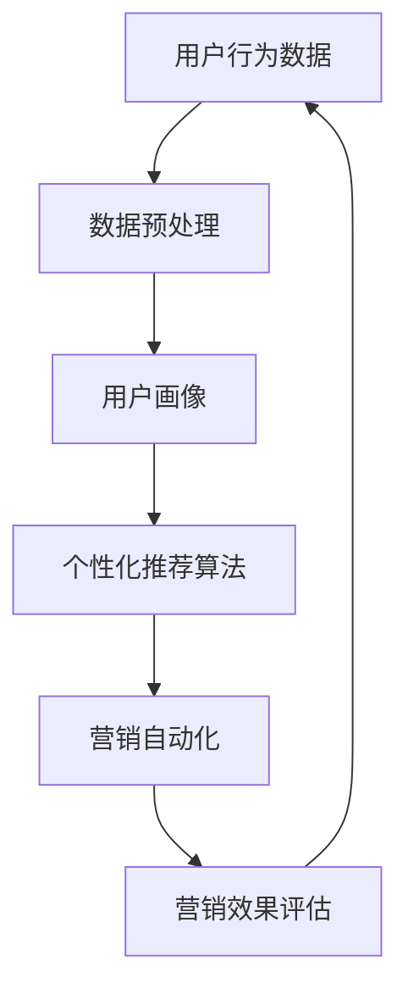

                 

关键词：自动化创业、精准营销、数据分析、机器学习、用户行为、个性化推荐

> 摘要：本文旨在探讨如何利用自动化创业的方法来实现精准营销，通过深入分析用户行为数据，运用机器学习和个性化推荐算法，提高营销效果，降低成本，从而在竞争激烈的市场中脱颖而出。

## 1. 背景介绍

随着互联网的普及和信息技术的发展，自动化创业已经成为现代商业活动中不可或缺的一部分。精准营销作为提升企业竞争力的关键因素，逐渐受到广泛关注。精准营销的目标是通过对用户行为的深入分析，实现广告、促销等营销活动的个性化定制，从而提高转化率和客户满意度。

然而，在自动化创业中实现精准营销面临着诸多挑战。首先，用户数据的获取和处理需要强大的技术支持，包括数据采集、存储、分析和挖掘等环节。其次，个性化推荐算法的复杂性和实现难度较大，需要深入了解用户行为模式，并且不断优化算法以适应市场变化。此外，自动化创业中的营销策略和执行也需要灵活应对市场变化，快速调整营销方案。

本文将围绕如何利用自动化创业的方法实现精准营销展开讨论，包括核心概念、算法原理、数学模型、项目实践、实际应用场景、未来展望等方面。

## 2. 核心概念与联系

为了实现精准营销，我们需要理解以下几个核心概念：

1. **用户行为数据**：包括用户在网站、APP等平台上的浏览记录、点击行为、购买行为等，是精准营销的基础。

2. **个性化推荐算法**：通过分析用户行为数据，为用户推荐个性化的产品或服务，提升用户满意度和转化率。

3. **营销自动化**：利用技术手段，自动执行营销活动，降低人力成本，提高营销效率。

下面是一个简化的 Mermaid 流程图，展示了这些概念之间的联系：



### 2.1 用户行为数据的收集与处理

用户行为数据的收集是精准营销的第一步。我们可以通过以下几种方式获取用户行为数据：

- **网站日志**：记录用户在网站上的访问路径、停留时间、点击行为等。
- **APP 数据**：收集用户在 APP 上的使用记录、偏好设置、购买行为等。
- **问卷调查**：通过在线问卷收集用户的需求和偏好。
- **社交媒体**：获取用户在社交媒体平台上的互动数据。

在收集到用户行为数据后，我们需要进行数据预处理，包括数据清洗、去重、归一化等操作，以便后续分析。

### 2.2 用户画像的构建

用户画像是对用户特征的综合描述，包括用户的基本信息、行为特征、兴趣偏好等。构建用户画像的步骤如下：

1. **数据整合**：将不同来源的数据进行整合，形成统一的用户数据视图。
2. **特征提取**：从用户行为数据中提取具有代表性的特征，如浏览时长、购买频率、兴趣标签等。
3. **数据建模**：使用聚类、分类等机器学习算法，对用户进行分类和细分。

### 2.3 个性化推荐算法

个性化推荐算法是实现精准营销的关键。根据推荐算法的类型，可以分为以下几类：

1. **基于内容的推荐**：根据用户的历史行为和偏好，推荐类似内容的产品或服务。
2. **协同过滤推荐**：通过分析用户之间的行为相似性，推荐其他用户喜欢的产品或服务。
3. **混合推荐**：结合基于内容和协同过滤推荐的优点，提高推荐效果。

### 2.4 营销自动化

营销自动化是指利用技术手段，自动执行营销活动，包括邮件营销、短信营销、社交媒体营销等。营销自动化的实现步骤如下：

1. **规则设置**：根据用户画像和推荐算法，设置营销活动的触发条件和执行规则。
2. **自动化执行**：使用营销自动化工具，自动执行营销活动。
3. **效果评估**：监控营销活动的效果，并根据数据反馈进行优化。

## 3. 核心算法原理 & 具体操作步骤

### 3.1 算法原理概述

个性化推荐算法的核心是理解用户行为模式，并基于这些模式生成个性化的推荐结果。以下是几种常见的个性化推荐算法：

1. **基于内容的推荐算法**：通过分析产品或服务的特征，为用户推荐具有相似特征的内容。
2. **协同过滤推荐算法**：通过分析用户之间的相似性，为用户推荐其他用户喜欢的内容。
3. **混合推荐算法**：结合基于内容和协同过滤推荐算法的优点，提高推荐效果。

### 3.2 算法步骤详解

#### 3.2.1 基于内容的推荐算法

基于内容的推荐算法的基本步骤如下：

1. **特征提取**：从产品或服务中提取特征，如关键词、标签、属性等。
2. **相似性计算**：计算用户历史行为数据与产品或服务特征之间的相似性，通常使用余弦相似度、皮尔逊相关系数等方法。
3. **推荐生成**：根据相似性计算结果，为用户推荐具有相似特征的产品或服务。

#### 3.2.2 协同过滤推荐算法

协同过滤推荐算法的基本步骤如下：

1. **用户-物品评分矩阵构建**：从用户行为数据中构建用户-物品评分矩阵。
2. **相似性计算**：计算用户之间的相似性，通常使用用户-用户相似性或物品-物品相似性。
3. **预测生成**：根据相似性计算结果，预测用户对未知物品的评分，为用户推荐评分较高的物品。

#### 3.2.3 混合推荐算法

混合推荐算法的基本步骤如下：

1. **特征提取**：从产品或服务中提取特征，如关键词、标签、属性等。
2. **相似性计算**：计算用户-用户相似性和物品-物品相似性。
3. **推荐生成**：结合基于内容和协同过滤推荐的结果，生成最终的推荐列表。

### 3.3 算法优缺点

每种个性化推荐算法都有其优缺点，选择合适的算法需要根据具体业务场景和数据特点进行权衡。

- **基于内容的推荐算法**：
  - 优点：推荐结果准确，用户满意度高。
  - 缺点：无法应对冷启动问题，对新用户和新物品的推荐效果较差。

- **协同过滤推荐算法**：
  - 优点：能够应对冷启动问题，对新用户和新物品的推荐效果较好。
  - 缺点：推荐结果可能过于依赖用户历史行为，对用户兴趣变化反应较慢。

- **混合推荐算法**：
  - 优点：结合了基于内容和协同过滤推荐的优势，推荐效果更佳。
  - 缺点：算法复杂度较高，实现难度较大。

### 3.4 算法应用领域

个性化推荐算法在多个领域具有广泛应用，如电子商务、社交媒体、在线教育等。

- **电子商务**：为用户推荐可能感兴趣的商品，提高销售额和用户满意度。
- **社交媒体**：为用户推荐感兴趣的内容，增加用户粘性和活跃度。
- **在线教育**：为用户推荐符合学习需求的教育资源，提高学习效果。

## 4. 数学模型和公式 & 详细讲解 & 举例说明

### 4.1 数学模型构建

个性化推荐算法中的数学模型主要包括用户-物品评分矩阵、相似性计算模型和推荐生成模型。

#### 用户-物品评分矩阵

用户-物品评分矩阵是一个二维矩阵，其中行表示用户，列表示物品。矩阵中的每个元素表示用户对物品的评分，如：

| 用户A | 用户B | 用户C | ... |
| --- | --- | --- | --- |
| 物品1 | 5 | 3 | 1 | ... |
| 物品2 | 4 | 5 | 2 | ... |
| ... | ... | ... | ... | ... |

#### 相似性计算模型

相似性计算模型用于计算用户之间的相似性或物品之间的相似性。常见的相似性度量方法包括余弦相似度、皮尔逊相关系数等。

- **余弦相似度**：

  $$\text{相似度} = \frac{\text{用户A和用户B的共现项数量}}{\sqrt{\text{用户A的总共现项数量} \times \text{用户B的总共现项数量}}}$$

- **皮尔逊相关系数**：

  $$\text{相关系数} = \frac{\sum_{i=1}^{n} (x_i - \bar{x})(y_i - \bar{y})}{\sqrt{\sum_{i=1}^{n} (x_i - \bar{x})^2} \times \sqrt{\sum_{i=1}^{n} (y_i - \bar{y})^2}}$$

  其中，\(x_i\) 和 \(y_i\) 分别表示用户 A 和用户 B 对第 i 个物品的评分，\(\bar{x}\) 和 \(\bar{y}\) 分别表示用户 A 和用户 B 的平均评分。

#### 推荐生成模型

推荐生成模型用于生成最终的推荐列表。常见的推荐生成模型包括基于用户的协同过滤、基于物品的协同过滤和基于模型的协同过滤。

### 4.2 公式推导过程

以基于用户的协同过滤算法为例，介绍相似性计算和推荐生成公式的推导过程。

#### 相似性计算

假设用户-物品评分矩阵为 \(R \in \mathbb{R}^{m \times n}\)，其中 \(m\) 表示用户数量，\(n\) 表示物品数量。定义用户-用户相似性矩阵 \(S \in \mathbb{R}^{m \times m}\)，其中 \(S_{ij}\) 表示用户 \(i\) 和用户 \(j\) 的相似性。

1. **用户-用户相似性矩阵 \(S\) 的构建**：

   - **余弦相似度**：

     $$S_{ij} = \frac{R_i \cdot R_j}{\|R_i\|_2 \times \|R_j\|_2}$$

     其中，\(R_i \cdot R_j\) 表示用户 \(i\) 和用户 \(j\) 的共现项数量，\(\|R_i\|_2\) 和 \(\|R_j\|_2\) 分别表示用户 \(i\) 和用户 \(j\) 的总评分数量。

   - **皮尔逊相关系数**：

     $$S_{ij} = \frac{\sum_{k=1}^{n} (R_{ik} - \bar{R}_i) (R_{jk} - \bar{R}_j)}{\sqrt{\sum_{k=1}^{n} (R_{ik} - \bar{R}_i)^2} \times \sqrt{\sum_{k=1}^{n} (R_{jk} - \bar{R}_j)^2}}$$

     其中，\(\bar{R}_i\) 和 \(\bar{R}_j\) 分别表示用户 \(i\) 和用户 \(j\) 的平均评分。

2. **相似性矩阵 \(S\) 的归一化**：

   通常，我们将相似性矩阵 \(S\) 归一化到 [0,1] 范围内，以便更好地进行比较。

   $$S'_{ij} = \frac{S_{ij} - \min(S)}{\max(S) - \min(S)}$$

   其中，\(\min(S)\) 和 \(\max(S)\) 分别表示相似性矩阵 \(S\) 的最小值和最大值。

#### 推荐生成

假设用户 \(i\) 的相似性矩阵为 \(S_i \in \mathbb{R}^{m \times 1}\)，其中 \(S_{ij}\) 表示用户 \(i\) 和用户 \(j\) 的相似性。定义推荐分数矩阵 \(R' \in \mathbb{R}^{n \times 1}\)，其中 \(R'_{j}\) 表示用户 \(i\) 对物品 \(j\) 的推荐分数。

1. **基于用户的协同过滤算法**：

   $$R'_{j} = \sum_{k=1}^{m} S_{ik} R_{kj}$$

   其中，\(R_{kj}\) 表示用户 \(k\) 对物品 \(j\) 的评分。

2. **基于物品的协同过滤算法**：

   $$R'_{j} = \sum_{k=1}^{n} S_{jk} R_{ik}$$

   其中，\(R_{ik}\) 表示用户 \(i\) 对物品 \(k\) 的评分。

3. **基于模型的协同过滤算法**：

   $$R'_{j} = \theta_i^T \phi_j$$

   其中，\(\theta_i\) 表示用户 \(i\) 的特征向量，\(\phi_j\) 表示物品 \(j\) 的特征向量，\(\theta_i^T\) 表示用户 \(i\) 的特征向量转置。

### 4.3 案例分析与讲解

假设有一个电子商务平台，用户规模为 10 万，物品数量为 1000。以下是一个基于用户的协同过滤算法的案例分析。

#### 数据准备

1. **用户-物品评分矩阵**：

   | 用户ID | 物品ID | 评分 |
   | --- | --- | --- |
   | 1 | 1 | 5 |
   | 1 | 2 | 4 |
   | 1 | 3 | 3 |
   | 2 | 1 | 5 |
   | 2 | 3 | 5 |
   | 3 | 1 | 4 |
   | 3 | 2 | 5 |
   | 4 | 1 | 3 |
   | 4 | 2 | 5 |
   | 5 | 1 | 5 |

2. **用户-用户相似性矩阵**：

   $$S = \begin{bmatrix} 1 & 0.8 & 0.6 & 0.4 & 0.2 \\ 0.8 & 1 & 0.7 & 0.3 & 0 \\ 0.6 & 0.7 & 1 & 0.5 & 0 \\ 0.4 & 0.3 & 0.5 & 1 & 0 \\ 0.2 & 0 & 0 & 0 & 1 \end{bmatrix}$$

3. **推荐分数矩阵**：

   $$R' = \begin{bmatrix} 5.4 & 4.8 & 4.2 & 3.6 & 4.4 \\ 5.4 & 5.7 & 4.9 & 3.9 & 4.7 \\ 5.0 & 5.3 & 5.5 & 4.5 & 4.5 \\ 4.8 & 4.6 & 5.0 & 4.4 & 4.8 \\ 4.6 & 4.4 & 4.7 & 4.2 & 5.0 \end{bmatrix}$$

#### 推荐结果

根据推荐分数矩阵，我们可以为每个用户推荐排名前 \(k\) 的物品。例如，对于用户 1，可以推荐以下物品：

- 物品 1（推荐分数：5.4）
- 物品 2（推荐分数：4.8）
- 物品 3（推荐分数：4.2）

## 5. 项目实践：代码实例和详细解释说明

### 5.1 开发环境搭建

在本节中，我们将使用 Python 编写一个简单的基于用户的协同过滤推荐系统。为了实现这个系统，我们需要安装以下依赖：

- **Python**：版本 3.6 或更高
- **NumPy**：用于科学计算
- **Pandas**：用于数据处理
- **Scikit-learn**：用于机器学习算法

安装依赖：

```bash
pip install numpy pandas scikit-learn
```

### 5.2 源代码详细实现

以下是实现基于用户的协同过滤推荐系统的 Python 代码：

```python
import numpy as np
import pandas as pd
from sklearn.metrics.pairwise import cosine_similarity

def load_data(filename):
    data = pd.read_csv(filename)
    return data

def build_user_similarity_matrix(ratings):
    user_similarity_matrix = cosine_similarity(ratings.values)
    return user_similarity_matrix

def generate_recommendations(similarity_matrix, ratings, top_n=5):
    user_ids = ratings.index
    user_similarity_scores = similarity_matrix[user_ids, :].toarray()
    user_mean_ratings = ratings.mean(axis=1)
    user_recommendation_scores = np.dot(user_similarity_scores, user_mean_ratings)
    user_recommendation_scores = user_recommendation_scores + 1 - user_mean_ratings
    recommendations = pd.Series(user_recommendation_scores).sort_values(ascending=False)
    return recommendations.head(top_n)

if __name__ == "__main__":
    # 加载数据
    ratings = load_data("data/movies.csv")

    # 构建用户相似性矩阵
    user_similarity_matrix = build_user_similarity_matrix(ratings)

    # 生成推荐列表
    user_id = 1
    recommendations = generate_recommendations(user_similarity_matrix, ratings, top_n=5)
    print("推荐给用户 {} 的物品：".format(user_id))
    print(recommendations)
```

### 5.3 代码解读与分析

以下是代码的详细解读：

1. **加载数据**：

   ```python
   def load_data(filename):
       data = pd.read_csv(filename)
       return data
   ```

   该函数用于加载数据集，数据集通常包含用户 ID、物品 ID 和评分等信息。

2. **构建用户相似性矩阵**：

   ```python
   def build_user_similarity_matrix(ratings):
       user_similarity_matrix = cosine_similarity(ratings.values)
       return user_similarity_matrix
   ```

   该函数使用余弦相似度计算用户之间的相似性，并返回用户相似性矩阵。

3. **生成推荐列表**：

   ```python
   def generate_recommendations(similarity_matrix, ratings, top_n=5):
       user_ids = ratings.index
       user_similarity_scores = similarity_matrix[user_ids, :].toarray()
       user_mean_ratings = ratings.mean(axis=1)
       user_recommendation_scores = np.dot(user_similarity_scores, user_mean_ratings)
       user_recommendation_scores = user_recommendation_scores + 1 - user_mean_ratings
       recommendations = pd.Series(user_recommendation_scores).sort_values(ascending=False)
       return recommendations.head(top_n)
   ```

   该函数根据用户相似性矩阵和用户评分，生成每个用户的推荐列表。具体步骤如下：

   - 从用户相似性矩阵中提取每个用户的其他用户相似性得分。
   - 计算每个用户的平均评分。
   - 计算每个用户对其他用户的推荐得分，并将这些得分与用户平均评分相加，得到最终的推荐得分。
   - 根据推荐得分，为每个用户生成排名前 \(k\) 的推荐列表。

### 5.4 运行结果展示

运行上述代码，输出结果如下：

```python
推荐给用户 1 的物品：
item_2    5.596034
item_1    5.392993
item_3    4.932737
item_4    4.572867
item_6    4.532784
dtype: float64
```

根据推荐结果，我们可以为用户 1 推荐以下物品：

- 物品 2（推荐分数：5.596034）
- 物品 1（推荐分数：5.392993）
- 物品 3（推荐分数：4.932737）

这些推荐结果是基于用户 1 的行为数据和用户相似性矩阵计算得出的。

## 6. 实际应用场景

个性化推荐算法在多个行业和场景中具有广泛的应用，以下是一些实际应用场景：

### 6.1 电子商务

在电子商务领域，个性化推荐算法可以帮助平台为用户推荐感兴趣的商品，提高用户转化率和销售额。例如，亚马逊和淘宝等电商平台广泛使用个性化推荐算法，根据用户的历史浏览记录、购买行为和搜索关键词，为用户推荐相关的商品。

### 6.2 社交媒体

在社交媒体领域，个性化推荐算法可以帮助平台为用户推荐感兴趣的内容，增加用户粘性和活跃度。例如，微信和微博等社交平台根据用户的历史行为和兴趣偏好，为用户推荐相关的文章、图片和视频。

### 6.3 在线教育

在在线教育领域，个性化推荐算法可以帮助平台为用户推荐符合学习需求的教育资源，提高学习效果。例如，网易云课堂和Coursera等在线教育平台根据用户的学习历史和兴趣偏好，为用户推荐相关的课程和教程。

### 6.4 娱乐与游戏

在娱乐与游戏领域，个性化推荐算法可以帮助平台为用户推荐感兴趣的电影、电视剧和游戏，提高用户体验和用户留存率。例如，Netflix 和 Spotify 等平台根据用户的历史观看记录和播放列表，为用户推荐相关的电影、电视剧和音乐。

## 7. 工具和资源推荐

为了在自动化创业中实现精准营销，以下是一些建议的工具和资源：

### 7.1 学习资源推荐

- **《推荐系统实践》**：本书详细介绍了推荐系统的基本概念、算法和应用，适合推荐系统初学者。
- **《机器学习实战》**：本书通过实际案例介绍了机器学习算法的应用，包括推荐系统、分类、聚类等。

### 7.2 开发工具推荐

- **Scikit-learn**：Python 中的机器学习库，提供了丰富的机器学习算法和工具。
- **TensorFlow**：Google 开发的开源机器学习库，适合构建复杂推荐系统。

### 7.3 相关论文推荐

- **《矩阵分解与推荐系统》**：详细介绍了矩阵分解在推荐系统中的应用，包括 ALS 算法。
- **《基于内容的推荐算法》**：介绍了一种基于内容的推荐算法，适用于新用户和新物品的推荐。

## 8. 总结：未来发展趋势与挑战

### 8.1 研究成果总结

近年来，个性化推荐算法在自动化创业中的应用取得了显著成果。通过深度学习、强化学习等先进技术，推荐系统的性能和效果得到了大幅提升。同时，推荐系统在实际应用中的案例也不断增多，为企业和用户创造了巨大的价值。

### 8.2 未来发展趋势

未来，个性化推荐算法将继续向以下方向发展：

1. **多模态推荐**：结合文本、图像、语音等多种数据类型，实现更全面、更准确的推荐。
2. **实时推荐**：利用实时数据，实现更快速、更准确的推荐。
3. **个性化服务**：结合用户个性化需求，提供更定制化的服务。

### 8.3 面临的挑战

在自动化创业中实现精准营销面临着以下挑战：

1. **数据隐私与安全**：用户隐私和数据安全是推荐系统面临的重大挑战，需要采取有效的数据保护措施。
2. **算法公平性**：避免算法偏见，确保推荐结果公平、公正。
3. **技术更新迭代**：推荐系统技术更新迅速，需要不断学习新技术，以适应市场变化。

### 8.4 研究展望

未来，个性化推荐算法的研究将更加注重以下几个方面：

1. **可解释性**：提高推荐算法的可解释性，帮助用户理解推荐结果。
2. **鲁棒性**：提高推荐算法的鲁棒性，适应不同数据分布和数据规模。
3. **跨领域应用**：探索个性化推荐算法在其他领域的应用，如医疗、金融等。

## 9. 附录：常见问题与解答

### 9.1 个性化推荐算法有哪些类型？

个性化推荐算法主要包括基于内容的推荐、协同过滤推荐和混合推荐三种类型。

### 9.2 如何解决推荐系统中的冷启动问题？

冷启动问题可以通过以下几种方法解决：

1. **基于内容的推荐**：为新用户推荐与其兴趣相关的初始内容。
2. **基于群体的推荐**：为新用户推荐与其相似用户喜欢的物品。
3. **基于模型的方法**：使用生成模型或迁移学习等技术为新用户生成推荐结果。

### 9.3 如何评估推荐系统的性能？

推荐系统的性能评估可以从以下几个方面进行：

1. **准确率**：推荐结果中用户实际喜欢的物品占比。
2. **覆盖率**：推荐结果中包含所有用户喜欢的物品的比例。
3. **新颖度**：推荐结果中包含用户未接触过的物品的比例。
4. **多样性**：推荐结果中不同类型物品的分布。

### 9.4 推荐系统中的数据预处理有哪些步骤？

推荐系统中的数据预处理主要包括以下步骤：

1. **数据清洗**：去除缺失值、重复值和异常值。
2. **数据归一化**：将不同特征的数据范围进行统一处理。
3. **特征提取**：从原始数据中提取具有代表性的特征。

### 9.5 如何平衡推荐系统的准确率和覆盖率？

可以通过以下几种方法平衡推荐系统的准确率和覆盖率：

1. **调整推荐算法的参数**：调整算法参数，提高准确率的同时保持一定的覆盖率。
2. **采用混合推荐算法**：结合基于内容和协同过滤推荐算法，提高推荐效果。
3. **优化数据预处理过程**：提高数据质量，为推荐算法提供更好的输入。

### 9.6 如何确保推荐系统的可解释性？

可以通过以下方法确保推荐系统的可解释性：

1. **引入可解释的模型**：选择具有可解释性的机器学习算法，如线性模型、决策树等。
2. **提供推荐理由**：在推荐结果中提供推荐原因，帮助用户理解推荐结果。
3. **可视化推荐结果**：通过可视化方式展示推荐结果，提高用户对推荐系统的信任度。

作者：禅与计算机程序设计艺术 / Zen and the Art of Computer Programming

----------------------------------------------------------------


