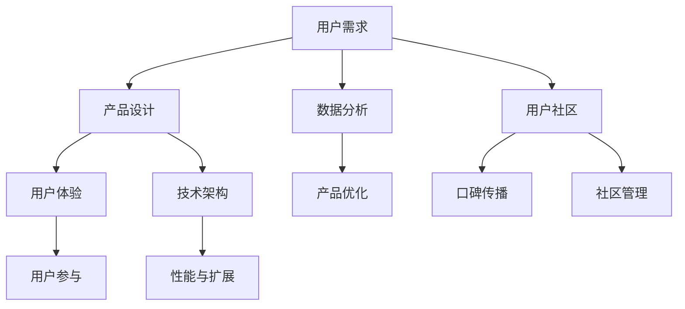

                 

关键词：自动化创业、用户社区、产品设计、数据分析、技术架构、用户参与

> 摘要：本文将探讨如何在自动化创业过程中打造用户社区，通过深入分析用户需求、产品设计、数据分析和技术架构，以及如何激发用户的参与，提供一套系统性的方法，帮助创业者在快速变化的市场中建立稳定的用户基础。

## 1. 背景介绍

在当今科技迅猛发展的时代，自动化技术在各个行业中的应用越来越广泛。自动化创业成为了一种趋势，众多创业者希望通过技术的力量，打造出具有竞争力的产品或服务。然而，成功的自动化创业并不仅仅是技术的创新，用户社区的建设同样至关重要。一个强大的用户社区不仅能够为产品提供反馈，还能通过用户的口碑传播，加速产品的发展。本文将从多个角度探讨如何在自动化创业中打造用户社区。

## 2. 核心概念与联系

在构建用户社区的过程中，理解以下几个核心概念是非常重要的：

- **用户需求**：了解用户需求是构建社区的基础，只有深刻理解用户的需求，才能提供符合用户期望的产品和服务。
- **产品设计**：产品设计不仅包括产品的功能，还包括用户交互体验，良好的产品设计能够吸引并留住用户。
- **数据分析**：通过数据分析，可以了解用户的偏好和行为模式，从而优化产品设计和运营策略。
- **技术架构**：技术架构的稳定性决定了产品的性能和可扩展性，也是支持用户社区发展的关键。

以下是构建用户社区的核心概念与联系的 Mermaid 流程图：



## 3. 核心算法原理 & 具体操作步骤

### 3.1 算法原理概述

构建用户社区的核心算法可以概括为以下几个步骤：

1. **用户需求分析**：通过调查问卷、用户访谈等方式收集用户需求。
2. **产品设计**：根据用户需求，设计产品功能和服务。
3. **数据分析**：对用户行为数据进行分析，优化产品设计。
4. **用户参与**：通过互动活动、用户反馈等手段激发用户参与。
5. **社区管理**：建立社区规则，维护社区氛围。

### 3.2 算法步骤详解

1. **用户需求分析**：

    $$ 
    用户需求 = 需求调查 + 用户访谈 + 竞争分析
    $$

2. **产品设计**：

    $$ 
    产品设计 = 功能设计 + 用户体验设计
    $$

3. **数据分析**：

    $$ 
    数据分析 = 用户行为分析 + 用户反馈分析
    $$

4. **用户参与**：

    $$ 
    用户参与 = 互动活动 + 用户反馈 + 用户贡献
    $$

5. **社区管理**：

    $$ 
    社区管理 = 社区规则制定 + 社区氛围维护
    $$

### 3.3 算法优缺点

**优点**：

- **快速响应**：通过用户需求分析和数据分析，可以快速调整产品设计和运营策略。
- **用户黏性**：良好的用户体验和用户参与可以增强用户对产品的忠诚度。

**缺点**：

- **数据隐私**：用户数据的收集和使用可能会引发隐私问题。
- **成本高**：构建和维护用户社区需要投入大量的人力、物力和财力。

### 3.4 算法应用领域

- **电子商务**：通过用户社区，提高用户购物体验和推荐效果。
- **社交媒体**：构建用户社区，增强用户黏性和活跃度。
- **在线教育**：通过用户社区，促进师生互动和知识共享。

## 4. 数学模型和公式 & 详细讲解 & 举例说明

### 4.1 数学模型构建

构建用户社区的数学模型主要包括以下几个部分：

1. **用户生命周期价值（CLV）**：

    $$ 
    CLV = 概率分布 \times 贡献度 \times 贡献周期
    $$

2. **用户参与度（Engagement）**：

    $$ 
    Engagement = 用户互动次数 \times 用户活跃度
    $$

### 4.2 公式推导过程

1. **用户生命周期价值（CLV）**：

    - **概率分布**：指用户在未来某个时间段内继续使用产品的概率。
    - **贡献度**：指用户在使用产品过程中对产品的价值贡献。
    - **贡献周期**：指用户产生价值的周期。

2. **用户参与度（Engagement）**：

    - **用户互动次数**：指用户在社区内的互动行为次数。
    - **用户活跃度**：指用户的活跃程度，可以通过用户在社区内的参与频率和深度来衡量。

### 4.3 案例分析与讲解

假设我们是一家提供在线教育服务的公司，想要通过构建用户社区来提高用户参与度和生命周期价值。以下是具体的案例分析：

1. **用户生命周期价值（CLV）**：

    - 概率分布：假设用户在未来一年内继续使用产品的概率为0.8。
    - 贡献度：每个用户每月平均消费100元。
    - 贡献周期：每个用户的平均贡献周期为12个月。

    $$ 
    CLV = 0.8 \times 100 \times 12 = 960元
    $$

2. **用户参与度（Engagement）**：

    - 用户互动次数：每个用户平均每天在社区内互动3次。
    - 用户活跃度：用户活跃度指数为0.8。

    $$ 
    Engagement = 3 \times 0.8 = 2.4
    $$

通过这个案例，我们可以看到，通过构建用户社区，可以有效提高用户的生命周期价值和参与度。接下来，我们将通过具体的代码实例，展示如何实现这一过程。

## 5. 项目实践：代码实例和详细解释说明

### 5.1 开发环境搭建

为了实现上述算法，我们需要搭建一个开发环境。以下是所需的软件和工具：

- Python 3.x
- Jupyter Notebook
- Pandas
- NumPy
- Matplotlib

### 5.2 源代码详细实现

以下是一个简单的 Python 代码实例，用于计算用户生命周期价值和用户参与度：

```python
import pandas as pd
import numpy as np
import matplotlib.pyplot as plt

# 假设我们有一个用户数据集，包括用户的消费金额、活跃度指数和互动次数
user_data = pd.DataFrame({
    'user_id': [1, 2, 3, 4, 5],
    'monthly_spending': [100, 150, 200, 300, 250],
    'activity_index': [0.6, 0.8, 0.7, 0.9, 0.5],
    'daily_interactions': [2, 3, 1, 4, 2]
})

# 计算用户生命周期价值（CLV）
CLV = (user_data['activity_index'] * user_data['monthly_spending'] * 12).rename('CLV')

# 计算用户参与度（Engagement）
Engagement = (user_data['daily_interactions'] * user_data['activity_index']).rename('Engagement')

# 合并两个计算结果
user_metrics = pd.concat([user_data, CLV, Engagement], axis=1)

# 可视化展示
user_metrics[['CLV', 'Engagement']].plot(kind='bar', figsize=(10, 6))
plt.title('User Life-Time Value and Engagement')
plt.xlabel('User ID')
plt.ylabel('Value')
plt.show()
```

### 5.3 代码解读与分析

1. **数据导入**：

    ```python
    user_data = pd.DataFrame({
        'user_id': [1, 2, 3, 4, 5],
        'monthly_spending': [100, 150, 200, 300, 250],
        'activity_index': [0.6, 0.8, 0.7, 0.9, 0.5],
        'daily_interactions': [2, 3, 1, 4, 2]
    })
    ```

    我们创建了一个名为 `user_data` 的 DataFrame，其中包含用户的ID、每月消费金额、活跃度指数和每日互动次数。

2. **计算用户生命周期价值（CLV）**：

    ```python
    CLV = (user_data['activity_index'] * user_data['monthly_spending'] * 12).rename('CLV')
    ```

    使用公式 `CLV = activity_index \times monthly_spending \times 12` 计算每个用户的生命周期价值，并将结果重命名为 `CLV`。

3. **计算用户参与度（Engagement）**：

    ```python
    Engagement = (user_data['daily_interactions'] * user_data['activity_index']).rename('Engagement')
    ```

    使用公式 `Engagement = daily_interactions \times activity_index` 计算每个用户的参与度，并将结果重命名为 `Engagement`。

4. **合并结果**：

    ```python
    user_metrics = pd.concat([user_data, CLV, Engagement], axis=1)
    ```

    将用户数据、CLV和Engagement合并到同一个DataFrame中。

5. **可视化展示**：

    ```python
    user_metrics[['CLV', 'Engagement']].plot(kind='bar', figsize=(10, 6))
    plt.title('User Life-Time Value and Engagement')
    plt.xlabel('User ID')
    plt.ylabel('Value')
    plt.show()
    ```

    使用 Matplotlib 绘制柱状图，展示每个用户的CLV和Engagement。

### 5.4 运行结果展示

运行上述代码后，将生成一个柱状图，展示每个用户的生命周期价值和参与度。通过分析图表，我们可以更直观地了解用户社区的表现，为产品优化提供依据。

## 6. 实际应用场景

构建用户社区在多个行业中都有广泛应用，以下是几个实际应用场景：

- **电子商务**：通过用户社区，提高用户购物体验和推荐效果。
- **社交媒体**：构建用户社区，增强用户黏性和活跃度。
- **在线教育**：通过用户社区，促进师生互动和知识共享。
- **医疗健康**：构建用户社区，提供医疗咨询和疾病管理。

### 6.1 电子商务

在电子商务领域，构建用户社区可以帮助商家更好地了解用户需求，提供个性化的推荐和服务。例如，亚马逊通过用户评价和社区讨论，为用户提供真实的购物体验和有价值的参考。

### 6.2 社交媒体

社交媒体平台如 Facebook、Twitter 和 Instagram 等都通过构建用户社区，增强用户黏性和活跃度。这些平台通过用户互动和内容分享，形成了一个强大的社交网络。

### 6.3 在线教育

在线教育平台如 Coursera、edX 等通过构建用户社区，促进师生互动和知识共享。学生可以在社区中提问、解答问题，分享学习经验和心得。

### 6.4 医疗健康

医疗健康领域通过构建用户社区，提供医疗咨询和疾病管理。患者可以在社区中分享病情、询问医生，获得专业意见和建议。

## 7. 工具和资源推荐

### 7.1 学习资源推荐

- 《用户增长方法论》
- 《数据驱动产品》
- 《产品经理实战手册》

### 7.2 开发工具推荐

- Jupyter Notebook：用于数据分析和原型设计。
- Git：用于版本控制和协作开发。
- Docker：用于容器化和环境配置。

### 7.3 相关论文推荐

- "Building Scalable Communities" by Martin Lindstrom
- "The Power of Community" by Susan. C. Park
- "Community Building in the Age of the Customer" by Josh Bernoff

## 8. 总结：未来发展趋势与挑战

在自动化创业中打造用户社区是未来发展的必然趋势。随着技术的进步，用户社区将越来越智能化和个性化。然而，这一过程也面临着一系列挑战：

- **数据隐私**：随着用户数据的收集和使用，如何保护用户隐私成为了一个重要问题。
- **社区管理**：如何建立有效的社区管理机制，维护社区氛围，防止恶意行为。
- **用户参与**：如何激发用户的参与热情，保持社区活力。

未来，我们需要在技术、管理和服务等方面不断创新，以应对这些挑战，构建一个稳定、健康、可持续发展的用户社区。

## 9. 附录：常见问题与解答

### 9.1 如何快速识别用户需求？

- **问卷调查**：通过设计有针对性的问卷，收集用户反馈。
- **用户访谈**：与目标用户进行深入交流，了解他们的需求和痛点。
- **数据分析**：分析现有用户数据，挖掘用户行为模式。

### 9.2 如何建立有效的社区管理机制？

- **设立明确的规则**：制定社区行为准则，明确用户行为规范。
- **社区志愿者管理**：招募和培训社区志愿者，协助管理社区。
- **技术手段**：利用自动化工具和算法，监控社区活动，及时处理违规行为。

### 9.3 如何激发用户参与热情？

- **互动活动**：举办有奖问答、线上竞赛等活动，吸引用户参与。
- **用户贡献**：鼓励用户分享经验和心得，建立用户贡献激励机制。
- **个性化推荐**：根据用户兴趣和行为，提供个性化内容，增加用户黏性。

---

作者：禅与计算机程序设计艺术 / Zen and the Art of Computer Programming
----------------------------------------------------------------


