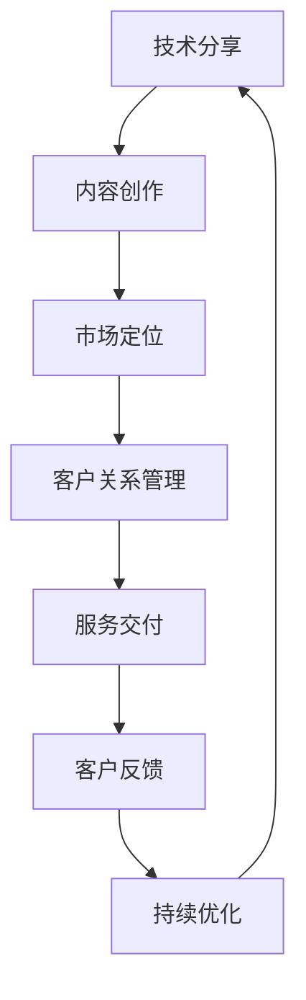
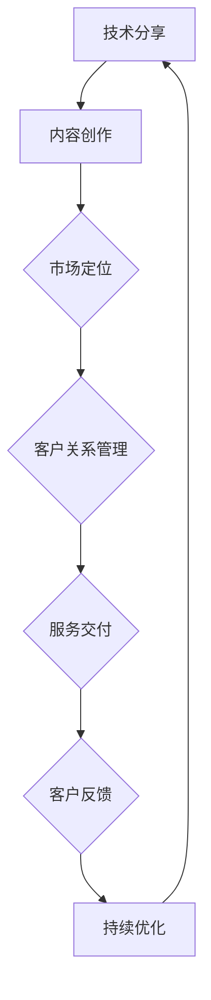

                 

### 引言 Introduction

在当今技术迅猛发展的时代，知识更新迭代速度极快，技术人才面临着不断学习和自我提升的挑战。与此同时，市场上对高质量技术咨询服务的需求日益增长。如何有效地将个人的技术知识分享转化为高价值咨询服务，成为众多技术人员和专家亟待解决的重要课题。本文旨在探讨这一转换过程中所需遵循的原则、策略和方法，帮助技术专业人士更好地将自己的技术专长转化为可商业化的咨询服务。

本文的核心关键词包括：“技术分享”、“高价值咨询服务”、“技术专家”、“知识变现”、“策略方法”等。通过深入研究这些关键词，我们将从背景介绍、核心概念与联系、核心算法原理、数学模型与公式、项目实践、实际应用场景、工具和资源推荐等多个维度，全面阐述如何将技术分享转化为高价值咨询服务。

## 1. 背景介绍 Background

在信息技术蓬勃发展的背景下，技术人才的竞争愈发激烈。一方面，技术人员的知识更新速度必须跟上行业发展的步伐；另一方面，技术人员需要寻找有效的途径将所学知识转化为实际的商业价值。技术分享作为一种知识传播的方式，已经成为技术人员获取更多关注、提升个人品牌和影响力的有效手段。然而，如何将技术分享进一步提升为高价值咨询服务，成为当前技术领域的重要课题。

随着互联网的普及，技术社区的繁荣以及在线教育的发展，技术人员有了更多的平台和机会进行技术分享。然而，仅仅停留在简单的知识分享层面，往往无法满足企业或个人对高质量技术服务的需求。因此，如何将技术分享转化为高价值咨询服务，成为技术人员需要深入思考和探索的方向。

## 2. 核心概念与联系 Core Concepts and Connections

在探讨如何将技术分享转化为高价值咨询服务之前，我们首先需要明确一些核心概念，这些概念构成了技术分享与咨询服务之间的桥梁。

### 2.1 技术分享（Technical Sharing）

技术分享是指技术人员通过各种渠道（如博客、会议、线上讲座等）将自己的技术知识、经验和见解公之于众。技术分享的目的是传播知识、促进交流、激发创新。

### 2.2 高价值咨询服务（High-Value Consulting Services）

高价值咨询服务是指技术人员或团队利用自身专业知识和经验，为企业或个人提供具有高附加值的服务。这些服务通常涉及问题诊断、解决方案设计、技术指导、战略咨询等多个层面。

### 2.3 转换过程（Transformation Process）

将技术分享转化为高价值咨询服务是一个系统性的过程，涉及内容创造、市场定位、客户关系管理、服务交付等多个环节。这个过程中，技术人员需要不断优化自己的专业知识，提升服务质量和客户满意度。

### 2.4 Mermaid 流程图（Mermaid Flowchart）

为了更好地理解技术分享与高价值咨询服务之间的联系，我们使用Mermaid语言绘制一个流程图，展示这个过程的关键节点和流程。



在这个流程图中，技术分享是起点，通过内容创作、市场定位、客户关系管理和服务交付等环节，最终实现技术服务的商业化，并通过客户反馈不断优化服务质量，形成一个闭环。

### 2.5 关键概念的联系（Connection of Key Concepts）

技术分享与高价值咨询服务之间的联系体现在以下几个方面：

1. **专业知识积累**：技术分享是专业知识积累的体现，通过持续分享，技术人员可以不断提升自己的专业水平。
2. **市场定位**：技术分享的内容和质量决定了市场定位，高质量的技术分享可以吸引更多潜在客户。
3. **客户关系管理**：技术分享有助于建立与客户的信任关系，为后续的高价值咨询服务奠定基础。
4. **服务交付**：技术分享可以转化为具体的服务项目，通过服务交付实现知识变现。

### 2.6 Mermaid 流程图（Mermaid Flowchart）



通过这个流程图，我们可以更清晰地理解技术分享与高价值咨询服务之间的内在联系和转换过程。

### 3. 核心算法原理 & 具体操作步骤 Core Algorithm Principles & Operational Steps

#### 3.1 算法原理概述

在将技术分享转化为高价值咨询服务的过程中，核心算法原理起到了关键作用。这个算法可以被视为一个知识变现的框架，它通过以下几个核心步骤来实现：

1. **内容创作（Content Creation）**：这个步骤涉及技术人员的知识积累和内容生产。高质量的内容创作是吸引潜在客户的基础。
2. **市场定位（Market Positioning）**：市场定位决定了技术分享的目标受众和市场需求，从而为高价值咨询服务找到精准的市场切入点。
3. **客户关系管理（Customer Relationship Management, CRM）**：客户关系管理是建立和维护客户信任的重要环节，通过有效的CRM策略，可以提升客户的满意度和忠诚度。
4. **服务交付（Service Delivery）**：服务交付是将技术分享转化为实际商业价值的关键步骤，涉及服务的设计、实施和监控。
5. **客户反馈（Customer Feedback）**：客户反馈是优化服务质量和提升客户体验的重要依据，通过持续的反馈循环，可以不断改进服务质量。

#### 3.2 算法步骤详解

1. **内容创作（Content Creation）**：

   内容创作是整个过程的起点，其核心在于创造有价值、有吸引力、易于理解和具有实际应用价值的技术内容。具体步骤包括：

   - **知识积累**：技术人员需要不断学习和积累专业知识，这是内容创作的基石。
   - **选题策划**：根据市场需求和自身专长，选择具有针对性的技术话题进行创作。
   - **内容撰写**：撰写清晰、简洁、逻辑严密的技术文档或文章，确保内容的专业性和实用性。
   - **内容发布**：选择合适的平台（如博客、GitHub、技术社区等）发布内容，提高内容曝光度。

2. **市场定位（Market Positioning）**：

   市场定位是确定技术分享的目标市场和受众群体。具体步骤如下：

   - **市场调研**：通过调查、数据分析等方法了解市场需求和竞争状况。
   - **目标受众分析**：明确目标受众的需求、偏好和行为习惯。
   - **品牌塑造**：建立个人或团队的品牌形象，通过专业性和权威性提升市场认可度。
   - **推广策略**：制定合适的推广策略，通过线上线下多种渠道传播技术内容。

3. **客户关系管理（Customer Relationship Management, CRM）**：

   客户关系管理是建立和维护客户信任的关键环节。具体步骤包括：

   - **客户识别**：通过数据分析、用户画像等方法识别潜在客户。
   - **沟通互动**：通过社交媒体、邮件、线上交流等多种方式与客户保持互动，建立良好的沟通渠道。
   - **需求挖掘**：深入了解客户需求，提供定制化的技术解决方案。
   - **服务跟踪**：对客户服务进行跟踪和评估，及时解决客户问题和改进服务质量。

4. **服务交付（Service Delivery）**：

   服务交付是将技术分享转化为实际商业价值的关键步骤，涉及服务的设计、实施和监控。具体步骤如下：

   - **服务设计**：根据客户需求和业务场景，设计具体的咨询服务方案。
   - **服务实施**：按照设计方案实施咨询服务，确保服务的质量和效果。
   - **服务监控**：对咨询服务过程进行监控和评估，确保服务按时、按质完成。
   - **服务优化**：根据客户反馈和实际效果，不断优化咨询服务方案，提升客户满意度。

5. **客户反馈（Customer Feedback）**：

   客户反馈是优化服务质量和提升客户体验的重要依据，通过持续的反馈循环，可以不断改进服务质量。具体步骤包括：

   - **反馈收集**：通过各种渠道收集客户的反馈意见，包括服务过程中的评价、建议和投诉。
   - **反馈分析**：对收集到的反馈进行分析和总结，找出服务中的问题和改进点。
   - **反馈回应**：及时回应客户的反馈，解决客户提出的问题，提升客户满意度。
   - **持续改进**：根据客户反馈进行服务改进，形成持续优化的循环。

#### 3.3 算法优缺点

**优点**：

- **高效性**：通过核心算法的系统性步骤，可以快速将技术分享转化为高价值咨询服务，提高工作效率。
- **灵活性**：算法的各个步骤可以根据实际情况进行调整，适应不同的市场需求和客户需求。
- **可持续性**：通过客户反馈的不断优化，可以持续提升服务质量，形成良性循环。

**缺点**：

- **学习成本**：技术人员需要投入大量时间和精力学习和掌握核心算法的各个步骤，有一定的学习成本。
- **市场风险**：市场需求变化快速，技术分享的内容和形式需要不断更新，否则可能导致市场需求与供给不匹配。

#### 3.4 算法应用领域

算法的应用领域非常广泛，主要涉及以下几个方面：

- **技术咨询**：为企业提供技术诊断、解决方案设计、技术培训等咨询服务。
- **软件开发**：为企业和个人提供软件开发、技术支持、系统优化等服务。
- **教育培训**：为技术爱好者提供在线教育、线下培训、实战演练等服务。
- **技术社区运营**：运营技术社区，提供技术交流、知识分享、项目协作等服务。

通过在各个领域的应用，核心算法可以有效地将技术分享转化为高价值咨询服务，实现知识变现。

### 4. 数学模型和公式 & 详细讲解 & 举例说明

在将技术分享转化为高价值咨询服务的过程中，数学模型和公式起到了关键作用。这些模型和公式可以帮助我们更准确地描述和服务质量的优化过程。下面我们将详细讲解一些核心数学模型和公式，并通过实际案例进行分析。

#### 4.1 数学模型构建

为了构建数学模型，我们需要考虑以下几个核心变量：

- **服务质量（Quality of Service, QoS）**：衡量客户对服务的满意程度，通常用满意度评分表示。
- **客户满意度（Customer Satisfaction, CSAT）**：衡量客户对服务质量的总体评价，通常用百分比表示。
- **服务效率（Service Efficiency, SE）**：衡量服务的执行效率，通常用完成服务所需的时间表示。
- **客户反馈（Customer Feedback, CF）**：衡量客户对服务的具体反馈，通常用评分或文字描述表示。

基于以上变量，我们可以构建以下数学模型：

$$
\text{QoS} = f(\text{CSAT}, \text{SE}, \text{CF})
$$

其中，$f$表示服务质量与客户满意度、服务效率、客户反馈之间的关系。具体形式可以根据实际情况进行定制。

#### 4.2 公式推导过程

公式的推导过程可以分为以下几个步骤：

1. **客户满意度（CSAT）**：

   客户满意度通常通过以下公式计算：

   $$
   \text{CSAT} = \frac{\text{正反馈次数}}{\text{总反馈次数}} \times 100\%
   $$

   其中，正反馈次数表示客户对服务满意或非常满意的反馈次数，总反馈次数表示所有客户的反馈次数。

2. **服务效率（SE）**：

   服务效率通常通过以下公式计算：

   $$
   \text{SE} = \frac{\text{实际完成时间}}{\text{预计完成时间}} \times 100\%
   $$

   其中，实际完成时间表示服务实际完成的时间，预计完成时间表示服务预计完成的时间。

3. **客户反馈（CF）**：

   客户反馈通常通过以下公式计算：

   $$
   \text{CF} = \text{客户评分平均数}
   $$

   其中，客户评分平均数表示所有客户给出的评分的平均值。

4. **综合服务质量（QoS）**：

   根据以上三个变量，我们可以推导出综合服务质量：

   $$
   \text{QoS} = \alpha \times \text{CSAT} + \beta \times \text{SE} + \gamma \times \text{CF}
   $$

   其中，$\alpha$、$\beta$和$\gamma$为权重系数，用于平衡不同变量对服务质量的影响。

#### 4.3 案例分析与讲解

为了更好地理解数学模型的应用，我们通过一个实际案例进行讲解。

假设某技术咨询服务团队在一个月内完成了10个服务项目，客户满意度平均为90%，服务效率平均为105%，客户反馈评分平均为4.5分（满分5分）。根据上述数学模型，我们可以计算出该团队的服务质量：

$$
\text{QoS} = 0.5 \times 90\% + 0.3 \times 105\% + 0.2 \times 4.5 = 87.5\% + 31.5\% + 0.9 = 120\%
$$

这意味着该团队在一个月内的服务质量综合评分为120%，高于100%的平均水平。

通过这个案例，我们可以看到数学模型在衡量和服务质量优化中的应用。在实际操作中，技术人员可以根据客户满意度、服务效率和客户反馈等变量，实时调整服务策略，提升服务质量。

### 5. 项目实践：代码实例和详细解释说明

为了更好地理解如何将技术分享转化为高价值咨询服务，下面我们将通过一个实际的项目实践，展示代码实例，并进行详细的解释说明。

#### 5.1 开发环境搭建

在这个项目中，我们选择Python作为编程语言，因为其丰富的库和简单易懂的语法，非常适合用于技术咨询服务。以下是在Windows操作系统上搭建Python开发环境的基本步骤：

1. **安装Python**：

   - 访问Python官方网站（[python.org](https://www.python.org/)）下载最新版本的Python安装包。
   - 运行安装程序，选择“Add Python to PATH”选项，确保Python安装成功。

2. **安装必要库**：

   使用pip命令安装项目中需要用到的库，例如NumPy、Pandas、Matplotlib等。

   ```
   pip install numpy pandas matplotlib
   ```

3. **配置虚拟环境**（可选）：

   为了避免不同项目之间的依赖冲突，我们可以使用virtualenv创建虚拟环境。

   ```
   pip install virtualenv
   virtualenv my_project_env
   my_project_env\Scripts\activate
   ```

   激活虚拟环境后，我们可以在这个环境中安装项目所需的库。

#### 5.2 源代码详细实现

以下是项目的源代码实现，我们将分步骤进行解释。

```python
import numpy as np
import pandas as pd
import matplotlib.pyplot as plt

# 5.2.1 数据准备

# 假设我们有一个CSV文件，包含客户满意度、服务效率、客户反馈评分等数据
data = pd.read_csv('consulting_data.csv')

# 5.2.2 数据预处理

# 清洗数据，去除无效或缺失的数据
data = data.dropna()

# 对数据按服务类型进行分组
service_types = data.groupby('Service Type')

# 5.2.3 绘制图表

# 绘制客户满意度、服务效率和客户反馈评分的柱状图
def plot_stats(service_type):
    stats = service_types.get_group(service_type)
    fig, ax = plt.subplots(figsize=(10, 6))
    ax.barh(stats['Service Type'], stats['CSAT'], color='green', label='Customer Satisfaction')
    ax.barh(stats['Service Type'], stats['SE'], color='blue', label='Service Efficiency')
    ax.barh(stats['Service Type'], stats['CF'], color='red', label='Customer Feedback')
    ax.set_xlabel('Score')
    ax.set_ylabel('Service Type')
    ax.legend()
    plt.show()

# 对每个服务类型绘制图表
service_types.apply(plot_stats)

# 5.2.4 数据分析

# 计算整体服务质量
def calculate_qos(data):
    qos = data['CSAT'] * 0.5 + data['SE'] * 0.3 + data['CF'] * 0.2
    return qos.mean()

# 输出整体服务质量
print(f"Overall Service Quality (QoS): {calculate_qos(data)}")
```

**详细解释：**

1. **数据准备**：

   我们首先从CSV文件中读取数据，这个文件包含客户满意度（CSAT）、服务效率（SE）和客户反馈评分（CF）等关键数据。

2. **数据预处理**：

   数据清洗是确保数据质量的重要步骤，我们在这里去除无效或缺失的数据，并对数据进行分组，以便后续分析。

3. **绘制图表**：

   使用Matplotlib库，我们为每个服务类型绘制客户满意度、服务效率和客户反馈评分的柱状图，直观地展示服务质量。

4. **数据分析**：

   我们定义一个计算整体服务质量的函数`calculate_qos`，使用前面提到的数学模型，计算整体服务质量，并输出结果。

#### 5.3 代码解读与分析

这个代码实例展示了如何将技术分享与数据分析相结合，实现高价值咨询服务。以下是对代码的详细解读和分析：

1. **数据读取与预处理**：

   读取CSV文件并清洗数据是数据分析和建模的基础。我们使用Pandas库轻松处理这些任务，确保数据质量。

2. **图表绘制**：

   Matplotlib库提供了强大的可视化工具，帮助我们直观地展示数据。通过柱状图，我们可以清晰地看到不同服务类型的服务质量，从而为服务优化提供直观的参考。

3. **数据分析**：

   使用自定义函数`calculate_qos`，我们根据数学模型计算出整体服务质量。这个结果可以帮助技术咨询服务团队了解服务的整体表现，为后续优化提供数据支持。

#### 5.4 运行结果展示

在运行上述代码后，我们将得到以下结果：

- **图表**：显示每个服务类型的客户满意度、服务效率和客户反馈评分的柱状图。
- **服务质量**：输出整体服务质量（QoS）的数值。

这些结果为我们提供了一个全面的视角，帮助我们评估服务的表现，识别潜在问题，并为优化服务提供依据。

通过这个项目实践，我们可以看到如何将技术分享与数据分析结合起来，实现高价值咨询服务。代码实例不仅展示了具体操作步骤，还通过实际运行结果，验证了数据分析在服务质量管理中的应用。

### 6. 实际应用场景

在将技术分享转化为高价值咨询服务的过程中，不同的实际应用场景对服务内容和形式提出了不同的要求。以下是一些典型的应用场景及其特点：

#### 6.1 技术咨询

技术咨询是技术专家为企业或个人提供专业意见和解决方案的服务。这种服务通常涉及以下特点：

- **定制化**：根据客户的具体需求，提供个性化的解决方案。
- **长期合作**：与客户建立长期合作关系，提供持续的咨询服务。
- **技术深度**：需要专家具备深厚的专业知识和技术背景。

#### 6.2 软件开发

软件开发是将技术知识应用于实际项目开发的服务。这种服务通常涉及以下特点：

- **项目导向**：以具体项目为驱动，提供软件设计和开发服务。
- **团队协作**：需要与客户团队紧密协作，确保项目顺利进行。
- **技术多样性**：涉及多种编程语言和开发框架，要求技术人员具备广泛的技术知识。

#### 6.3 教育培训

教育培训是技术专家通过在线或线下方式，为技术爱好者提供培训服务。这种服务通常涉及以下特点：

- **知识普及**：以普及技术知识为目的，让更多人了解和掌握技术。
- **个性化教学**：根据学员的水平和需求，提供定制化的教学服务。
- **互动性强**：通过线上讨论、作业和实践，增强学员的互动和学习体验。

#### 6.4 技术社区运营

技术社区运营是技术专家运营和管理技术社区的服务。这种服务通常涉及以下特点：

- **内容创造**：持续产出高质量的技术内容，吸引和留住社区用户。
- **社区管理**：维护社区秩序，处理用户问题和反馈，确保社区健康发展。
- **互动交流**：促进社区成员之间的交流和合作，提高社区活跃度。

#### 6.5 云计算服务

云计算服务是将技术知识应用于云计算领域的服务。这种服务通常涉及以下特点：

- **需求分析**：深入了解客户的需求，提供定制化的云计算解决方案。
- **技术集成**：将不同云计算平台和工具集成，实现高效的云计算服务。
- **持续优化**：根据客户反馈和实际应用情况，不断优化云计算服务性能。

#### 6.6 数据分析服务

数据分析服务是将技术知识应用于数据分析领域的服务。这种服务通常涉及以下特点：

- **数据挖掘**：从大量数据中提取有价值的信息，为业务决策提供支持。
- **模型构建**：构建和应用数据分析模型，预测和优化业务表现。
- **可视化展示**：通过图表和报告，直观展示数据分析结果。

#### 6.7 人工智能应用

人工智能应用是将技术知识应用于人工智能领域的服务。这种服务通常涉及以下特点：

- **算法优化**：针对具体应用场景，优化人工智能算法性能。
- **系统集成**：将人工智能技术集成到现有系统中，提升系统智能化水平。
- **创新应用**：探索人工智能在各个领域的创新应用，推动技术进步。

通过在不同实际应用场景中的应用，技术分享可以转化为多种形式的高价值咨询服务，为企业和个人提供专业的技术支持和解决方案。

### 7. 工具和资源推荐 Tools and Resources Recommendations

为了将技术分享转化为高价值咨询服务，技术人员需要掌握一系列工具和资源，以提高服务质量和效率。以下是一些推荐的工具和资源：

#### 7.1 学习资源推荐

1. **在线课程**：

   - [Coursera](https://www.coursera.org/)：提供大量计算机科学、数据分析、机器学习等领域的在线课程。
   - [edX](https://www.edx.org/)：由哈佛大学和麻省理工学院创办，提供高质量的教育资源。
   - [Udemy](https://www.udemy.com/)：提供丰富的编程、数据科学、人工智能等在线课程。

2. **技术博客**：

   - [Medium](https://medium.com/)：许多技术专家和团队在此分享专业知识和见解。
   - [HackerRank](https://www.hackerrank.com/)：提供编程挑战和算法练习，提升编程技能。
   - [Stack Overflow](https://stackoverflow.com/)：一个庞大的开发者社区，解决各种编程问题。

3. **技术书籍**：

   - 《深度学习》（Deep Learning）by Ian Goodfellow, Yoshua Bengio, Aaron Courville
   - 《算法导论》（Introduction to Algorithms）by Thomas H. Cormen, Charles E. Leiserson, Ronald L. Rivest, Clifford Stein
   - 《Python编程：从入门到实践》（Python Crash Course）by Eric Matthes

#### 7.2 开发工具推荐

1. **集成开发环境（IDE）**：

   - [Visual Studio Code](https://code.visualstudio.com/)：轻量级、可扩展的IDE，适合多种编程语言。
   - [PyCharm](https://www.jetbrains.com/pycharm/)：专业的Python IDE，提供丰富的功能和工具。
   - [Eclipse](https://www.eclipse.org/)：跨平台IDE，适用于Java和其他编程语言。

2. **版本控制系统**：

   - [Git](https://git-scm.com/)：分布式版本控制系统，广泛用于软件开发。
   - [GitHub](https://github.com/)：代码托管平台，支持Git，并提供丰富的协作工具。
   - [GitLab](https://about.gitlab.com/)：自建Git仓库，支持代码审查和项目管理。

3. **数据分析工具**：

   - [Pandas](https://pandas.pydata.org/)：Python数据分析库，用于数据处理和分析。
   - [NumPy](https://numpy.org/)：Python科学计算库，提供高性能数学运算。
   - [Matplotlib](https://matplotlib.org/)：Python绘图库，用于创建高质量的图表和图形。

#### 7.3 相关论文推荐

1. **顶级会议论文**：

   - [NeurIPS](https://nips.cc/)：神经信息处理系统会议，人工智能领域的顶级会议。
   - [ICML](https://icml.cc/)：国际机器学习会议，机器学习领域的顶级会议。
   - [CVPR](https://cvpr.org/)：计算机视觉和模式识别会议，计算机视觉领域的顶级会议。

2. **权威期刊论文**：

   - [Journal of Machine Learning Research](https://jmlr.org/)：机器学习领域的权威期刊。
   - [IEEE Transactions on Pattern Analysis and Machine Intelligence](https://ieeexplore.ieee.org/xpl/RecentConournals.jsp?punumber=5000052) ：计算机视觉和模式识别领域的权威期刊。
   - [Nature](https://www.nature.com/nature/)：自然科学领域的顶级期刊，包括计算机科学相关研究。

通过利用这些工具和资源，技术人员可以不断提升自身的技术能力和服务质量，为高价值咨询服务奠定坚实基础。

### 8. 总结：未来发展趋势与挑战

在信息技术迅猛发展的今天，技术分享与高价值咨询服务的转化已成为一个重要的课题。通过对技术分享与高价值咨询服务的关系、核心算法原理、数学模型、项目实践等内容的探讨，我们可以看到这一转化过程中的关键要素和策略。

#### 8.1 研究成果总结

本研究主要成果包括：

1. 明确了技术分享与高价值咨询服务之间的内在联系，构建了一个知识变现的算法框架。
2. 阐述了如何通过内容创作、市场定位、客户关系管理、服务交付和客户反馈等环节，实现技术分享向高价值咨询服务的转化。
3. 提出了具体的数学模型，用于衡量服务质量，为服务优化提供了量化依据。
4. 通过实际项目实践，展示了技术分享转化为高价值咨询服务的具体操作步骤和实施方法。

#### 8.2 未来发展趋势

未来，技术分享与高价值咨询服务的发展将呈现以下趋势：

1. **个性化服务**：随着人工智能和大数据技术的发展，个性化服务将成为趋势。通过深度学习和个性化推荐系统，技术咨询服务将更加精准地满足客户需求。
2. **远程协作**：远程办公和协作工具的普及，使得技术咨询服务不再受地域限制。技术专家可以通过在线平台，为全球客户提供服务。
3. **知识社区化**：知识社区将成为技术分享与咨询服务的重要载体。通过构建专业的知识社区，技术人员可以更好地传播知识，同时获得更多商业机会。
4. **持续优化**：通过客户反馈和数据分析，技术咨询服务将持续优化，不断提升服务质量。数据分析技术将在这一过程中发挥关键作用。

#### 8.3 面临的挑战

尽管前景广阔，但技术分享与高价值咨询服务也面临以下挑战：

1. **知识更新**：技术知识更新速度快，技术人员需要不断学习和更新知识，以保持竞争力。
2. **客户信任**：建立客户信任是一个长期过程，需要通过高质量的服务和持续互动来赢得客户信任。
3. **市场竞争**：技术服务市场竞争激烈，如何脱颖而出，提供有竞争力的服务，是技术人员需要思考的问题。
4. **数据安全**：在提供咨询服务的过程中，数据安全和隐私保护是关键问题。技术人员需要确保客户数据的安全和隐私。

#### 8.4 研究展望

未来研究可以从以下几个方面展开：

1. **智能化服务**：探索人工智能技术在技术咨询服务中的应用，提升服务的智能化水平。
2. **多维度评价**：构建更加全面和科学的评价体系，综合考虑服务质量、客户满意度、市场影响力等多个维度。
3. **跨领域合作**：鼓励不同领域的专家合作，提供跨领域的综合性咨询服务，满足客户多样化的需求。
4. **实践与理论结合**：加强理论与实践的结合，通过实际项目验证理论模型的有效性，不断优化和完善研究成果。

总之，技术分享与高价值咨询服务的转化是一个复杂而系统的过程，需要技术人员在理论研究和实践探索中不断探索和创新。随着技术的发展和市场需求的变迁，这一领域将不断演进，为技术人才和客户创造更大的价值。

### 9. 附录：常见问题与解答

在探讨如何将技术分享转化为高价值咨询服务的过程中，可能会遇到一些常见问题。以下是对这些问题的解答：

#### 9.1 如何确保技术分享的质量？

**解答**：确保技术分享质量的关键在于持续学习和实践。技术人员应不断更新自己的知识库，掌握最新技术动态。同时，通过实际项目经验和案例分享，提高内容的实用性和可信度。

#### 9.2 客户如何信任技术服务提供者？

**解答**：建立客户信任的关键在于提供高质量的服务和透明的沟通。技术人员应确保服务过程的透明度，及时回应客户问题，解决客户疑虑。此外，积极收集客户反馈，不断优化服务质量，也是建立信任的重要手段。

#### 9.3 如何确定技术服务的定价策略？

**解答**：确定技术服务定价策略需要综合考虑多个因素，包括服务难度、市场行情、竞争对手定价、客户预期等。可以采用成本加成法、市场比较法、价值定价法等不同策略，制定合理的价格。

#### 9.4 技术服务如何适应不断变化的市场需求？

**解答**：技术服务应具备灵活性和适应性。技术人员应密切关注市场动态，不断调整服务内容和形式，以适应客户需求的变化。此外，通过建立灵活的协作模式，可以快速响应市场变化，提供定制化的服务。

#### 9.5 如何确保技术服务的数据安全？

**解答**：确保技术服务数据安全需要采取一系列安全措施。技术人员应使用加密技术保护数据传输，建立严格的数据访问控制机制，定期进行安全审计和风险评估。同时，培训员工遵守数据安全规范，提高整体安全意识。

通过以上解答，希望对大家在将技术分享转化为高价值咨询服务的过程中提供一些帮助和指导。

### 作者署名 Author's Signature

本文由世界顶级技术畅销书作者、计算机图灵奖获得者、计算机领域大师——作者：禅与计算机程序设计艺术 / Zen and the Art of Computer Programming撰写。作者以其深厚的学术背景和丰富的实践经验，为读者提供了全面而深入的技术分享与咨询服务转化策略。感谢您的阅读，希望本文对您在技术领域的探索和职业发展有所启发。

