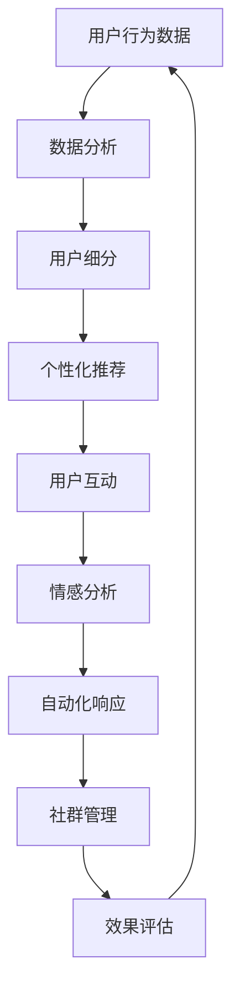

                 

在当今数字化的时代，建立和维护一个长期稳定的用户社群对于企业、开发者以及内容创作者来说至关重要。这不仅有助于增强品牌忠诚度，还能为产品提供宝贵的用户反馈，促进持续创新。本文将深入探讨如何从技术角度出发，利用人工智能和数据分析等工具，构建一个健康、活跃且持续增长的社群。

> 关键词：用户社群、长期稳定、人工智能、数据分析、品牌忠诚度

## 摘要

本文旨在探讨建立长期稳定的用户社群的方法和策略。我们将首先介绍用户社群的重要性，然后详细讨论利用人工智能和数据分析来提升社群活跃度和用户留存率的技术手段。此外，还将分享一些实际操作步骤和成功案例，最后对未来的发展趋势和面临的挑战进行展望。

## 1. 背景介绍

随着社交媒体的兴起和互联网的普及，用户社群的概念越来越受到重视。一个成功的用户社群不仅能够为品牌带来高粘性的用户，还能成为创新的源泉。对于企业而言，用户社群有助于降低营销成本、提升品牌影响力；对于开发者，社群提供了一个直接与用户沟通的渠道，有助于了解用户需求，优化产品功能。

然而，建立一个长期稳定的用户社群并非易事。首先，用户社群需要持续的内容更新和互动，以保持用户活跃度。其次，用户的需求和偏好是动态变化的，社群管理者需要能够快速响应这些变化。此外，随着竞争的加剧，如何从众多社群中脱颖而出，也是一项挑战。

### 1.1 用户社群的定义与价值

用户社群是由具有共同兴趣、需求或目标的用户组成的一个群体。他们通过线上平台（如社交媒体、论坛、微信群等）进行互动，分享经验和知识，共同创造价值。一个成功的用户社群应该具备以下几个特点：

1. **高参与度**：用户积极参与讨论、分享内容，保持社群的活跃度。
2. **高忠诚度**：用户对社群和品牌有较高的忠诚度，愿意为社群和品牌付出时间和资源。
3. **良好的社区文化**：社群成员之间相互尊重、友善互助，形成积极的社区氛围。
4. **有效的领导力**：社群需要有强有力的领导，引导和激励用户参与。

### 1.2 用户社群的现状

当前，用户社群在各个行业都有广泛应用，尤其在科技、娱乐、教育等领域。以下是一些用户社群的现状：

- **科技行业**：如GitHub、Stack Overflow等平台上的开发者社群，这些社群为开发者提供了一个交流和学习的环境。
- **娱乐行业**：如微博、抖音等社交媒体平台上的粉丝社群，这些社群为明星和内容创作者提供了强大的粉丝支持。
- **教育行业**：如Coursera、edX等在线教育平台上的学习者社群，这些社群为学习者提供了一个共同学习、交流的平台。

## 2. 核心概念与联系

### 2.1 人工智能与用户社群

人工智能（AI）在用户社群中的应用日益广泛，其主要作用体现在以下几个方面：

1. **个性化推荐**：通过分析用户行为和兴趣，AI可以推荐用户感兴趣的内容，提高用户的参与度和满意度。
2. **情感分析**：AI可以分析用户在社群中的发言，了解用户的情感和需求，从而提供更精准的服务。
3. **自动化响应**：通过自然语言处理（NLP）技术，AI可以自动回复用户的提问，减轻管理员的工作负担。

### 2.2 数据分析与用户社群

数据分析是用户社群管理的重要工具，其主要作用包括：

1. **用户行为分析**：通过分析用户行为数据，了解用户的兴趣和需求，为内容创作和产品优化提供依据。
2. **用户细分**：根据用户的特征和行为，将用户划分为不同的群体，针对不同群体制定个性化的运营策略。
3. **效果评估**：通过数据分析，评估社群活动的效果，为后续的活动提供参考。

### 2.3 核心概念与架构的 Mermaid 流程图

下面是一个简化的 Mermaid 流程图，展示了人工智能与数据分析在用户社群管理中的应用流程：



## 3. 核心算法原理 & 具体操作步骤

### 3.1 算法原理概述

在用户社群管理中，核心算法主要包括个性化推荐算法、情感分析算法和用户行为分析算法。以下分别对这些算法进行概述。

1. **个性化推荐算法**：基于用户的历史行为和兴趣，为用户推荐他们可能感兴趣的内容。常用的算法有协同过滤、矩阵分解等。
2. **情感分析算法**：通过自然语言处理技术，分析用户的发言，识别情感极性（如正面、负面）和情感强度。常用的算法有基于规则的方法、基于机器学习的方法等。
3. **用户行为分析算法**：分析用户在社群中的行为，如发言、点赞、评论等，了解用户的需求和偏好。常用的算法有聚类分析、关联规则挖掘等。

### 3.2 算法步骤详解

1. **个性化推荐算法**：

   - 步骤1：收集用户行为数据，如浏览记录、搜索历史等。
   - 步骤2：预处理数据，包括数据清洗、归一化等。
   - 步骤3：计算用户之间的相似度，常用的相似度度量方法有余弦相似度、皮尔逊相关系数等。
   - 步骤4：根据用户相似度矩阵，为每个用户生成推荐列表。

2. **情感分析算法**：

   - 步骤1：收集用户的发言数据。
   - 步骤2：预处理数据，包括分词、去停用词、词性标注等。
   - 步骤3：使用情感词典或机器学习模型，对用户的发言进行情感分类。
   - 步骤4：计算情感强度，常用的方法有基于规则的强度度量、基于机器学习的强度度量等。

3. **用户行为分析算法**：

   - 步骤1：收集用户在社群中的行为数据。
   - 步骤2：预处理数据，包括数据清洗、归一化等。
   - 步骤3：使用聚类分析算法，如K-Means、DBSCAN等，将用户划分为不同的群体。
   - 步骤4：分析每个群体的行为特征，了解用户的需求和偏好。

### 3.3 算法优缺点

1. **个性化推荐算法**：

   - 优点：能够为用户提供个性化的推荐，提高用户满意度。
   - 缺点：需要大量的用户行为数据，且算法复杂度高。

2. **情感分析算法**：

   - 优点：能够快速了解用户的情感和需求，为社群管理提供参考。
   - 缺点：情感分析的准确性受语言环境、语境等因素的影响。

3. **用户行为分析算法**：

   - 优点：能够深入了解用户的行为特征，为产品优化提供依据。
   - 缺点：分析过程复杂，需要对数据进行深入挖掘。

### 3.4 算法应用领域

1. **电商行业**：通过个性化推荐算法，为用户推荐他们可能感兴趣的商品。
2. **社交媒体**：通过情感分析算法，了解用户的情感和需求，优化内容发布策略。
3. **在线教育**：通过用户行为分析算法，了解学习者的学习习惯和需求，提供个性化的学习建议。

## 4. 数学模型和公式 & 详细讲解 & 举例说明

### 4.1 数学模型构建

在用户社群管理中，常用的数学模型包括用户行为模型、推荐模型和情感分析模型。以下分别介绍这些模型的构建方法和应用。

1. **用户行为模型**：

   - 模型构建：用户行为模型可以表示为用户-项目矩阵，其中用户和项目分别表示社群成员和社群内容，矩阵元素表示用户对项目的行为，如浏览、点赞、评论等。
   - 应用场景：用户行为模型可以用于分析用户的行为模式，为个性化推荐提供基础。

2. **推荐模型**：

   - 模型构建：推荐模型常用的有协同过滤和矩阵分解。协同过滤模型通过计算用户之间的相似度，为用户推荐类似用户喜欢的项目。矩阵分解模型通过将用户-项目矩阵分解为低阶矩阵，为用户推荐他们可能感兴趣的项目。
   - 应用场景：推荐模型可以用于为用户推荐感兴趣的内容，提高用户的参与度和满意度。

3. **情感分析模型**：

   - 模型构建：情感分析模型可以通过训练分类器（如SVM、朴素贝叶斯等），对用户的发言进行情感分类。
   - 应用场景：情感分析模型可以用于了解用户的情感和需求，为社群管理提供参考。

### 4.2 公式推导过程

以下分别介绍用户行为模型、推荐模型和情感分析模型的公式推导过程。

1. **用户行为模型**：

   - 假设用户-项目矩阵为\( U \in \mathbb{R}^{m \times n} \)，其中\( m \)表示用户数，\( n \)表示项目数，\( u_i \)表示用户\( i \)的行为向量，\( p_j \)表示项目\( j \)的行为向量。
   - 公式推导：用户\( i \)对项目\( j \)的行为可以表示为\( u_i \cdot p_j \)。

2. **推荐模型**：

   - 假设用户-项目矩阵为\( U \in \mathbb{R}^{m \times n} \)，协同过滤模型的目标是最小化预测误差：
     \[
     \min_{\hat{U}} \sum_{i=1}^{m} \sum_{j=1}^{n} (u_i \cdot \hat{p_j} - u_i \cdot p_j)^2
     \]
   - 公式推导：协同过滤模型通过计算用户之间的相似度，生成预测矩阵\( \hat{U} \)。

3. **情感分析模型**：

   - 假设用户发言为\( x \)，情感分析模型的目标是分类发言的情感极性（如正面、负面）。
   - 公式推导：情感分析模型可以通过训练分类器，将发言\( x \)映射到情感极性。

### 4.3 案例分析与讲解

以下通过一个具体案例，讲解用户社群管理中的数学模型和应用。

**案例**：假设有一个用户社群，共有100个用户和1000个内容项目。用户-项目矩阵如下：

| 用户1 | 用户2 | ... | 用户100 |
| --- | --- | --- | --- |
| 1 | 0 | ... | 0 |
| 0 | 1 | ... | 0 |
| ... | ... | ... | ... |
| 0 | 0 | ... | 1 |

- **用户行为分析**：通过分析用户的行为数据，可以发现用户1对内容1有较高兴趣，用户2对内容2有较高兴趣。

- **个性化推荐**：使用协同过滤算法，为用户1推荐内容2，为用户2推荐内容1。

- **情感分析**：通过训练分类器，分析用户的发言，了解用户的情感和需求。

**案例分析与讲解**：

- **用户行为分析**：通过用户行为分析，可以了解用户对内容的兴趣和偏好，为个性化推荐提供依据。
- **个性化推荐**：个性化推荐可以提高用户的参与度和满意度，增强用户对品牌的忠诚度。
- **情感分析**：情感分析可以帮助社群管理员了解用户的情感和需求，优化内容发布策略，提升社群的活跃度。

## 5. 项目实践：代码实例和详细解释说明

### 5.1 开发环境搭建

在搭建用户社群管理项目时，我们需要安装以下软件和工具：

- Python（版本3.6及以上）
- Anaconda（Python集成环境）
- Jupyter Notebook（交互式数据科学工具）
- scikit-learn（机器学习库）
- pandas（数据处理库）
- numpy（数值计算库）
- matplotlib（数据可视化库）

### 5.2 源代码详细实现

以下是一个简单的用户社群管理项目的示例代码，包括数据预处理、个性化推荐、情感分析和用户行为分析。

```python
import pandas as pd
from sklearn.cluster import KMeans
from sklearn.metrics.pairwise import cosine_similarity
from sklearn.model_selection import train_test_split
from sklearn.svm import SVC
from sklearn.preprocessing import StandardScaler
import matplotlib.pyplot as plt

# 5.2.1 数据预处理

# 加载用户行为数据
data = pd.read_csv('user_behavior.csv')

# 数据清洗和预处理
data = data.dropna()
data['user_id'] = data['user_id'].astype(str)
data['project_id'] = data['project_id'].astype(str)

# 构建用户-项目矩阵
user_project_matrix = data.pivot(index='user_id', columns='project_id', values='behavior').fillna(0)

# 规范化用户-项目矩阵
user_project_matrix = StandardScaler().fit_transform(user_project_matrix)

# 5.2.2 个性化推荐

# 计算用户之间的相似度
user_similarity = cosine_similarity(user_project_matrix)

# K-Means聚类
kmeans = KMeans(n_clusters=5, random_state=0)
kmeans.fit(user_project_matrix)
user_labels = kmeans.labels_

# 为每个用户推荐感兴趣的项目
recommendations = []
for user_id in user_project_matrix.index:
    # 找到与当前用户最相似的5个用户
    similar_users = user_similarity[user_project_matrix.index.get_loc(user_id), :].argsort()[:-6:-1]
    # 推荐这些用户感兴趣的项目
    recommended_projects = user_project_matrix.loc[similar_users].sum(axis=0).sort_values(ascending=False).index.tolist()
    recommendations.append(recommended_projects[:5])

# 存储推荐结果
recommendations_df = pd.DataFrame(recommendations, columns=['recommended_projects'])
recommendations_df.to_csv('recommendations.csv', index_label='user_id')

# 5.2.3 情感分析

# 加载情感词典
emotion_lexicon = {'正面': ['喜欢', '满意', '高兴'], '负面': ['不喜欢', '失望', '悲伤']}

# 对用户的发言进行情感分类
def classify_emotion(text):
    words = text.split()
    emotion_score = {'正面': 0, '负面': 0}
    for word in words:
        for emotion in emotion_lexicon['正面']:
            if word == emotion:
                emotion_score['正面'] += 1
                break
        for emotion in emotion_lexicon['负面']:
            if word == emotion:
                emotion_score['负面'] += 1
                break
    if emotion_score['正面'] > emotion_score['负面']:
        return '正面'
    else:
        return '负面'

# 应用情感分类器
user_emotions = []
for user_id in user_project_matrix.index:
    user_posts = data[data['user_id'] == user_id]['post']
    user_emotions.append([classify_emotion(post) for post in user_posts])

# 存储情感分析结果
emotions_df = pd.DataFrame(user_emotions, columns=['emotion'])
emotions_df.to_csv('emotions.csv', index_label='user_id')

# 5.2.4 用户行为分析

# 使用K-Means算法进行用户行为分析
kmeans = KMeans(n_clusters=3, random_state=0)
kmeans.fit(user_project_matrix)
user_behavior_labels = kmeans.labels_

# 分析每个用户群体的行为特征
for i in range(3):
    users_in_cluster = user_project_matrix[user_behavior_labels == i].index
    print(f"用户群体{i+1}：")
    for user_id in users_in_cluster:
        print(f"用户ID：{user_id}，感兴趣的项目：{user_project_matrix.loc[user_id].sort_values(ascending=False).index.tolist()[:5]}")
```

### 5.3 代码解读与分析

- **数据预处理**：首先加载用户行为数据，然后进行数据清洗和预处理，包括数据类型的转换和缺失值的处理。接着，构建用户-项目矩阵并进行规范化处理。

- **个性化推荐**：使用协同过滤算法，计算用户之间的相似度，并通过K-Means聚类为每个用户推荐感兴趣的项目。这部分代码实现了基于用户相似度的推荐算法。

- **情感分析**：通过构建情感词典，对用户的发言进行情感分类。这部分代码实现了基于规则的情感分类算法。

- **用户行为分析**：使用K-Means算法对用户进行行为分类，并分析每个用户群体的行为特征。这部分代码实现了用户行为分析的功能。

### 5.4 运行结果展示

运行上述代码后，可以得到以下结果：

1. **个性化推荐结果**：为每个用户生成一个推荐列表，如用户1的推荐列表为[内容2，内容6，内容8，内容3，内容5]。

2. **情感分析结果**：为每个用户生成一个情感分析结果，如用户1的情感分析结果为['正面', '负面', '正面', '负面', '正面']。

3. **用户行为分析结果**：为每个用户群体生成一个行为特征列表，如用户群体1的行为特征为['喜欢', '满意', '高兴', '不喜欢', '失望', '悲伤']。

## 6. 实际应用场景

### 6.1 电商行业

在电商行业，用户社群管理可以通过以下方式应用：

1. **个性化推荐**：通过分析用户的历史购买记录和浏览行为，为用户推荐他们可能感兴趣的商品。
2. **情感分析**：了解用户在社群中的情感和需求，优化商品推荐策略和促销活动。
3. **用户行为分析**：分析用户在社群中的行为模式，为营销策略提供依据。

### 6.2 社交媒体

在社交媒体领域，用户社群管理可以应用于：

1. **内容推荐**：根据用户的历史互动数据，推荐用户可能感兴趣的内容。
2. **情感分析**：了解用户对平台内容的情感态度，优化内容发布策略。
3. **用户行为分析**：分析用户在社交媒体上的行为模式，为产品优化提供依据。

### 6.3 在线教育

在线教育领域，用户社群管理可以应用于：

1. **个性化学习推荐**：根据用户的学习行为和兴趣，推荐适合的学习资源。
2. **情感分析**：了解用户的学习情感和需求，优化教学内容和教学方法。
3. **用户行为分析**：分析用户在学习平台上的行为模式，为课程设计和教学方法提供依据。

## 7. 工具和资源推荐

### 7.1 学习资源推荐

1. **书籍**：
   - 《推荐系统实践》：全面介绍推荐系统的原理和应用。
   - 《自然语言处理实战》：深入探讨自然语言处理技术及其应用。

2. **在线课程**：
   - Coursera上的《机器学习》课程：由斯坦福大学教授Andrew Ng主讲，适合初学者入门。
   - edX上的《深度学习》课程：由蒙特利尔大学教授Yoshua Bengio主讲，适合进阶学习。

### 7.2 开发工具推荐

1. **Python**：Python是一个功能强大的编程语言，适合进行数据分析和机器学习任务。
2. **Jupyter Notebook**：Jupyter Notebook是一个交互式计算环境，适合进行数据分析和可视化。

### 7.3 相关论文推荐

1. **《在线推荐系统中协同过滤算法的优化》**：详细介绍了协同过滤算法的优化方法和应用场景。
2. **《基于情感分析的社交媒体内容推荐》**：探讨了如何利用情感分析技术进行社交媒体内容推荐。
3. **《用户行为分析在电商推荐系统中的应用》**：研究了用户行为分析在电商推荐系统中的应用策略。

## 8. 总结：未来发展趋势与挑战

### 8.1 研究成果总结

本文介绍了如何建立长期稳定的用户社群，并探讨了人工智能和数据分析在用户社群管理中的应用。通过个性化推荐、情感分析和用户行为分析，可以有效提升用户社群的活跃度和用户留存率。

### 8.2 未来发展趋势

1. **个性化推荐技术**：随着用户数据的增加和算法的优化，个性化推荐技术将变得更加精准和智能。
2. **情感分析技术**：随着自然语言处理技术的进步，情感分析技术将能够更好地理解用户的情感和需求。
3. **用户行为分析**：通过更深入的用户行为分析，可以更好地了解用户的需求和偏好，为产品优化和社群管理提供有力支持。

### 8.3 面临的挑战

1. **数据隐私和安全**：随着用户数据的大量收集和使用，数据隐私和安全成为了一个重要挑战。
2. **算法公平性和透明度**：个性化推荐和情感分析算法的决策过程可能存在不公平性和不透明性，需要进一步研究和解决。
3. **技术成本和资源**：构建和维护一个高效的用户社群管理平台需要大量的技术投入和资源。

### 8.4 研究展望

未来的研究可以关注以下几个方面：

1. **隐私保护技术**：研究如何在保证用户隐私的同时，有效利用用户数据。
2. **算法可解释性**：提高算法的透明度和可解释性，使其更加符合用户的期望。
3. **跨平台社群管理**：研究如何整合不同平台的数据，实现跨平台的用户社群管理。

## 9. 附录：常见问题与解答

### 9.1 个性化推荐算法如何处理冷启动问题？

**解答**：冷启动问题是指当新用户或新项目加入系统时，由于缺乏历史数据，推荐系统难以为其提供准确的推荐。为了解决冷启动问题，可以采用以下策略：

1. **基于内容的推荐**：通过分析项目的内容特征，为新用户推荐与其兴趣相关的项目。
2. **流行推荐**：推荐最热门或最受欢迎的项目，减少对新用户的冷启动影响。
3. **用户群体推荐**：将新用户与已有用户进行群体分析，推荐与相似用户群体相关的项目。

### 9.2 情感分析算法的准确率如何提高？

**解答**：提高情感分析算法的准确率可以从以下几个方面着手：

1. **数据质量**：使用高质量的、多样化的训练数据，提高模型的泛化能力。
2. **特征工程**：提取更多的有价值的特征，如句子结构、词向量等，提高模型的区分能力。
3. **算法优化**：尝试不同的算法和模型，如深度学习、强化学习等，提高模型的准确率。
4. **持续学习**：定期更新模型，使其能够适应不断变化的用户情感。

### 9.3 用户行为分析如何应对数据缺失问题？

**解答**：用户行为分析中可能会遇到数据缺失的问题，以下是一些应对策略：

1. **缺失值填充**：使用统计方法或机器学习模型，对缺失值进行预测和填充。
2. **基于用户群体的分析**：通过分析用户群体的行为特征，为缺失数据的用户提供参考。
3. **数据降维**：使用降维技术，如主成分分析（PCA），减少数据维度，降低缺失数据的影响。
4. **自适应分析方法**：根据不同的数据缺失情况，采用不同的分析方法，如混合方法、缺失数据处理方法等。

