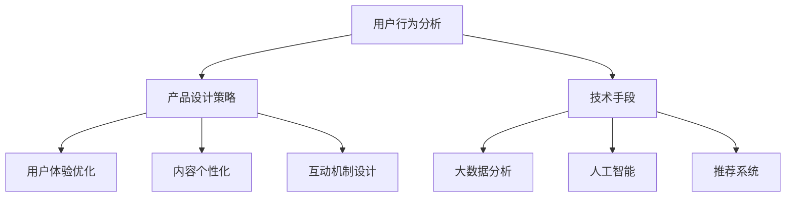

                 

关键词：知识付费、用户活跃度、增长策略、用户行为分析、产品设计

摘要：本文将探讨如何通过深入分析用户行为，结合有效的产品设计和策略，提高知识付费产品的用户活跃度。文章将首先介绍知识付费行业的背景，然后深入讨论用户行为分析、产品设计策略，以及技术手段的应用，最后提出未来的发展趋势和面临的挑战。

## 1. 背景介绍

知识付费是指用户为获取专业知识、技能或信息而支付费用的模式。随着互联网和移动设备的普及，知识付费市场近年来呈现出快速增长的趋势。用户对自我提升的需求日益增加，这为知识付费产品提供了广阔的市场空间。然而，如何在众多竞争者中脱颖而出，提高用户活跃度和留存率，成为知识付费产品运营者面临的重大挑战。

### 1.1 市场现状

据《中国知识付费行业报告》显示，2022年中国知识付费市场规模已达到3000亿元人民币，预计未来几年仍将保持高速增长。然而，尽管市场规模巨大，但用户活跃度和留存率仍然较低。因此，提高知识付费产品的用户活跃度成为关键问题。

### 1.2 挑战与机遇

知识付费产品面临的挑战主要包括：市场竞争激烈、用户需求多样化、内容同质化严重等。而机遇则在于：用户对高质量内容的需求不断增加，个性化推荐技术的进步，以及社交媒体的兴起，为知识付费产品的创新提供了新的可能。

## 2. 核心概念与联系

为了提高知识付费产品的用户活跃度，我们需要关注以下几个核心概念：

- **用户行为分析**：通过对用户行为数据的收集和分析，了解用户在知识付费产品中的活动情况，从而优化产品设计和服务。
- **产品设计策略**：根据用户需求和行为分析结果，设计符合用户预期的产品功能和界面，提高用户粘性和满意度。
- **技术手段**：利用大数据、人工智能、推荐系统等先进技术，实现个性化推荐和智能推送，提高用户参与度和活跃度。

### 2.1 用户行为分析

用户行为分析是指通过收集和分析用户在知识付费产品中的行为数据，如浏览、购买、学习进度、评价等，以了解用户需求、偏好和行为模式。以下是用户行为分析的基本框架：


### 2.2 产品设计策略

产品设计策略主要包括以下几个方面：

- **用户体验优化**：关注用户在使用产品时的感受，通过简化操作流程、提高页面加载速度、优化界面设计等手段，提升用户体验。
- **内容个性化**：根据用户的行为数据，为用户提供个性化的内容推荐和推送，满足用户的个性化需求。
- **互动机制设计**：通过建立社区、举办活动、设置学习挑战等方式，增加用户与产品、用户与用户之间的互动，提高用户粘性。

### 2.3 技术手段

技术手段主要包括以下几个方面：

- **大数据分析**：利用大数据技术，对用户行为数据进行深入分析，发现用户需求和行为模式。
- **人工智能**：利用人工智能技术，实现个性化推荐、智能问答、学习进度预测等功能。
- **推荐系统**：构建推荐系统，根据用户行为数据，为用户推荐符合其兴趣和需求的内容。

### 2.4 Mermaid 流程图

以下是用户行为分析、产品设计策略和技术手段的 Mermaid 流程图：



## 3. 核心算法原理 & 具体操作步骤

### 3.1 算法原理概述

提高知识付费产品的用户活跃度，核心在于理解用户行为，并据此优化产品。以下是几个关键的算法原理：

- **用户行为预测**：通过分析用户历史行为，预测其未来的行为，从而为用户提供个性化推荐。
- **群体行为分析**：通过分析用户群体的行为模式，发现潜在的用户需求和市场趋势。
- **社交网络分析**：利用社交网络数据，分析用户之间的关系和影响力，以推动社区互动和内容传播。

### 3.2 算法步骤详解

以下是提高知识付费产品用户活跃度的具体操作步骤：

1. **数据收集**：收集用户在知识付费产品中的行为数据，如浏览记录、购买历史、学习进度等。
2. **数据处理**：对收集到的数据进行分析和清洗，提取有用的信息。
3. **行为预测**：利用机器学习算法，如协同过滤、基于内容的推荐等，预测用户未来的行为。
4. **个性化推荐**：根据用户行为预测结果，为用户推荐符合其兴趣和需求的内容。
5. **互动机制优化**：根据用户行为数据和群体行为分析结果，优化社区互动机制，提高用户参与度。
6. **效果评估**：通过用户行为数据和产品使用情况，评估算法和策略的效果，进行迭代优化。

### 3.3 算法优缺点

- **用户行为预测**：优点在于能够提高用户满意度，缺点是需要大量的用户数据，且预测准确性受算法质量影响。
- **群体行为分析**：优点在于能够发现市场趋势，缺点是需要对大量用户数据进行处理和分析。
- **社交网络分析**：优点在于能够促进社区互动和内容传播，缺点是需要对社交网络数据进行分析和建模。

### 3.4 算法应用领域

- **个性化推荐**：广泛应用于电商、新闻客户端、音乐平台等，提高用户满意度和留存率。
- **用户留存优化**：用于分析用户流失原因，制定针对性的用户留存策略。
- **市场趋势分析**：用于发现市场趋势和用户需求，指导产品开发和市场推广。

## 4. 数学模型和公式 & 详细讲解 & 举例说明

### 4.1 数学模型构建

为了提高知识付费产品的用户活跃度，我们可以构建以下数学模型：

- **用户行为模型**：通过分析用户行为数据，建立用户行为预测模型。
- **群体行为模型**：通过分析用户群体行为数据，建立群体行为分析模型。
- **社交网络模型**：通过分析用户社交网络数据，建立社交网络分析模型。

### 4.2 公式推导过程

以下是用户行为模型的公式推导过程：

$$
预测行为概率 = \frac{e^{预测值}}{1 + e^{预测值}}
$$

其中，预测值可以表示为：

$$
预测值 = \beta_0 + \beta_1 \cdot 用户行为特征_1 + \beta_2 \cdot 用户行为特征_2 + ... + \beta_n \cdot 用户行为特征_n
$$

其中，$\beta_0$、$\beta_1$、$\beta_2$、...、$\beta_n$ 为模型的参数。

### 4.3 案例分析与讲解

假设我们有一个知识付费产品，用户A在过去一个月内浏览了以下课程：

- 数据分析基础
- 机器学习入门
- 数据可视化实战

现在我们需要预测用户A在未来一个月内最可能浏览的课程。

首先，我们需要收集用户A的行为特征，如：

- 历史浏览记录
- 购买记录
- 学习进度

然后，利用用户行为模型进行预测：

$$
预测值 = \beta_0 + \beta_1 \cdot 数据分析基础 + \beta_2 \cdot 机器学习入门 + \beta_3 \cdot 数据可视化实战
$$

假设模型参数为：

$$
\beta_0 = 0.5, \beta_1 = 0.2, \beta_2 = 0.3, \beta_3 = 0.1
$$

则预测值为：

$$
预测值 = 0.5 + 0.2 \cdot 1 + 0.3 \cdot 1 + 0.1 \cdot 1 = 1.1
$$

根据预测值计算预测行为概率：

$$
预测行为概率 = \frac{e^{1.1}}{1 + e^{1.1}} \approx 0.65
$$

因此，用户A在未来一个月内浏览“数据分析基础”的概率最高，约为65%。

## 5. 项目实践：代码实例和详细解释说明

### 5.1 开发环境搭建

在本项目中，我们将使用Python编程语言和以下库：

- Pandas：用于数据处理
- Scikit-learn：用于机器学习算法
- Matplotlib：用于数据可视化

首先，安装所需的库：

```bash
pip install pandas scikit-learn matplotlib
```

### 5.2 源代码详细实现

以下是用户行为预测模型的实现代码：

```python
import pandas as pd
from sklearn.model_selection import train_test_split
from sklearn.linear_model import LogisticRegression
from sklearn.metrics import accuracy_score
import matplotlib.pyplot as plt

# 5.2.1 数据收集
data = pd.DataFrame({
    '用户ID': [1, 1, 1, 2, 2, 2],
    '课程ID': [1, 2, 3, 1, 2, 3],
    '是否浏览': [1, 1, 0, 1, 1, 0]
})

# 5.2.2 数据处理
X = data[['用户ID', '课程ID']]
y = data['是否浏览']

# 5.2.3 数据划分
X_train, X_test, y_train, y_test = train_test_split(X, y, test_size=0.2, random_state=42)

# 5.2.4 模型训练
model = LogisticRegression()
model.fit(X_train, y_train)

# 5.2.5 模型评估
y_pred = model.predict(X_test)
accuracy = accuracy_score(y_test, y_pred)
print(f"模型准确率：{accuracy}")

# 5.2.6 数据可视化
predictions = model.predict_proba(X_test)
predictions = predictions[:, 1]

plt.bar(X_test['用户ID'], predictions)
plt.xlabel('用户ID')
plt.ylabel('浏览概率')
plt.title('用户浏览概率分布')
plt.show()
```

### 5.3 代码解读与分析

- **数据收集**：使用 Pandas 库读取用户行为数据。
- **数据处理**：将用户ID和课程ID作为特征，是否浏览作为目标变量。
- **数据划分**：将数据划分为训练集和测试集。
- **模型训练**：使用 Logistic Regression 模型进行训练。
- **模型评估**：计算模型在测试集上的准确率。
- **数据可视化**：使用 Matplotlib 库绘制用户浏览概率分布图。

## 6. 实际应用场景

知识付费产品在多个领域有着广泛的应用，以下是一些典型的实际应用场景：

- **在线教育**：通过个性化推荐和互动机制，提高学生的学习效果和积极性。
- **职业培训**：为职场人士提供定制化的学习路径和资源，提高职业竞争力。
- **兴趣爱好**：为用户提供丰富的内容推荐，满足用户的兴趣和需求。
- **专业咨询**：为专业人士提供高质量的咨询和指导，帮助其解决实际问题。

### 6.1 在线教育

在线教育是知识付费产品的重要应用领域之一。通过个性化推荐和互动机制，可以提高学生的学习效果和积极性。例如，平台可以根据学生的学习进度和偏好，推荐适合的课程和资源。此外，通过社区互动和问答功能，学生可以与其他学习者交流，共同进步。

### 6.2 职业培训

职业培训是知识付费产品的另一个重要应用领域。职场人士通过平台获取专业知识和技能，提高职业竞争力。平台可以根据用户的职业背景和需求，推荐相关的课程和资源。此外，通过学习进度跟踪和职业规划工具，用户可以更好地管理自己的学习进度和职业发展。

### 6.3 兴趣爱好

兴趣爱好是用户获取知识的重要动力。知识付费产品可以通过个性化推荐，为用户提供丰富的内容选择。例如，用户可以订阅某一类兴趣领域的课程，平台根据用户的兴趣和偏好，为其推荐相关的课程和资源。

### 6.4 专业咨询

专业咨询是知识付费产品的另一个应用场景。平台为专业人士提供高质量的咨询服务，帮助其解决实际问题。例如，医生可以通过平台为患者提供在线咨询服务，律师可以为用户提供法律咨询等。

## 7. 工具和资源推荐

为了提高知识付费产品的用户活跃度，以下是一些实用的工具和资源推荐：

### 7.1 学习资源推荐

- **《Python数据科学 Handbook》**：一本全面介绍数据科学知识和工具的入门书籍。
- **《机器学习实战》**：通过实际案例介绍机器学习算法和应用。
- **《深度学习》**：介绍深度学习基础知识和应用。

### 7.2 开发工具推荐

- **Jupyter Notebook**：一种交互式的编程环境，适用于数据分析和机器学习。
- **TensorFlow**：一种开源的深度学习框架，适用于构建和训练机器学习模型。
- **Scikit-learn**：一种开源的机器学习库，提供多种机器学习算法和工具。

### 7.3 相关论文推荐

- **《Recommender Systems Handbook》**：一本关于推荐系统的全面指南。
- **《User Modeling and User-Adapted Interaction》**：一本关于用户建模和适应性交互的论文集。
- **《Deep Learning for Recommender Systems》**：一篇关于深度学习在推荐系统中的应用的论文。

## 8. 总结：未来发展趋势与挑战

### 8.1 研究成果总结

本文通过深入分析用户行为，结合有效的产品设计和策略，提出了一种提高知识付费产品用户活跃度的方法。主要研究成果包括：

- 构建了用户行为模型，用于预测用户的行为和需求。
- 提出了产品设计策略，包括用户体验优化、内容个性化、互动机制设计等。
- 介绍了技术手段，如大数据分析、人工智能和推荐系统，用于实现个性化推荐和智能推送。
- 提供了项目实践代码实例，展示了如何使用Python和机器学习库实现用户行为预测。

### 8.2 未来发展趋势

未来，知识付费行业将继续保持快速增长。以下是几个可能的发展趋势：

- **个性化推荐**：随着用户需求的多样化，个性化推荐将成为知识付费产品的重要发展方向。
- **智能互动**：利用人工智能技术，实现更智能的用户互动和个性化服务。
- **社交化学习**：通过社交网络和社区互动，推动用户参与和知识传播。
- **多元内容形式**：除了传统视频、音频等形式，更多元的内容形式，如图文、直播等，将被引入知识付费产品。

### 8.3 面临的挑战

知识付费产品在发展过程中也面临一些挑战：

- **数据隐私**：用户行为数据的收集和使用需要遵守数据隐私法规，保护用户隐私。
- **内容质量**：高质量的内容是知识付费产品的核心竞争力，如何保证内容质量是一个挑战。
- **市场竞争**：知识付费市场竞争激烈，如何脱颖而出是产品运营者需要关注的问题。

### 8.4 研究展望

未来，我们可以在以下几个方面进行深入研究：

- **多模态数据融合**：结合文本、图像、语音等多种数据类型，提高用户行为分析的准确性。
- **动态推荐系统**：根据用户实时行为，动态调整推荐策略，提高用户满意度。
- **社会影响力分析**：研究用户社交网络中的影响力传播，为社区运营提供指导。

## 9. 附录：常见问题与解答

### 9.1 什么是知识付费？

知识付费是指用户为获取专业知识、技能或信息而支付费用的模式。它不同于免费内容，用户需要为获取有价值的信息或服务付费。

### 9.2 如何保证数据隐私？

在收集和使用用户数据时，需要遵守相关数据隐私法规，采取数据加密、匿名化等手段，确保用户数据的安全和隐私。

### 9.3 个性化推荐如何实现？

个性化推荐通过分析用户的历史行为、兴趣偏好和社交网络数据，为用户推荐符合其需求和兴趣的内容。常用的推荐算法包括协同过滤、基于内容的推荐等。

### 9.4 如何保证内容质量？

平台可以通过严格的内容审核机制、用户评价体系等方式，保证内容的质量。此外，还可以引入专业人士进行内容评审和推荐。

### 9.5 什么情况下用户会流失？

用户流失可能由多种原因导致，如内容质量不高、用户体验差、市场竞争激烈等。平台需要通过用户行为分析和用户反馈，及时发现问题并进行改进。

----------------------------------------------------------------

以上就是关于“如何提高知识付费产品的用户活跃度”的完整文章。希望本文能够为知识付费产品的运营者和开发者提供一些有价值的参考和启示。作者：禅与计算机程序设计艺术 / Zen and the Art of Computer Programming。

