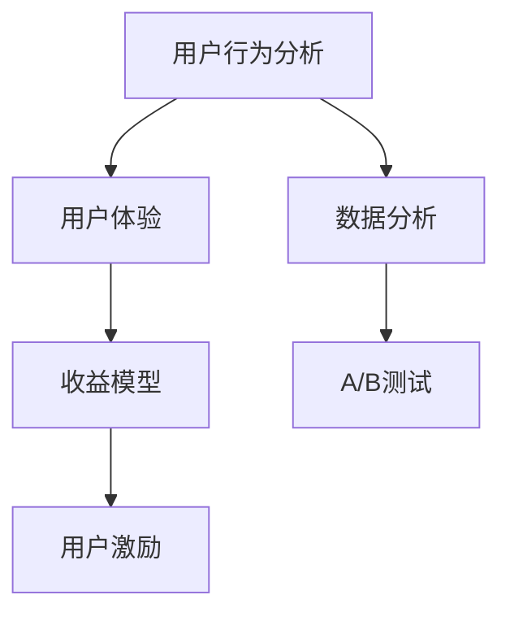

                 

关键词：知识付费、用户激励机制、用户体验、平台增长、收益模型、数据分析、A/B测试

> 摘要：本文将深入探讨知识付费平台如何设计有效的用户激励机制，以提高用户粘性、促进平台增长和提升收益。通过结合用户行为数据分析、收益模型构建、A/B测试等手段，我们将提供一系列实用的策略和建议，以帮助知识付费平台在激烈的市场竞争中脱颖而出。

## 1. 背景介绍

随着互联网技术的快速发展，知识付费市场呈现出蓬勃发展的态势。众多知识付费平台如雨后春笋般涌现，为用户提供丰富多样的课程和内容。然而，如何在众多竞争者中脱颖而出，吸引并留住用户，成为平台运营者面临的一大挑战。有效的用户激励机制无疑是实现这一目标的关键。

### 1.1 知识付费市场现状

当前，知识付费市场呈现出以下几个特点：

1. **用户需求多样化**：用户对知识内容的需求愈发多样化，不仅局限于专业领域的知识，还涵盖了个人成长、兴趣爱好等多个方面。
2. **竞争激烈**：众多平台争相涌入知识付费市场，市场竞争愈发激烈，如何在竞争中脱颖而出成为平台运营者的首要任务。
3. **用户忠诚度低**：知识付费用户往往因为课程质量、学习体验等因素影响，忠诚度较低，平台需要不断创新和优化激励机制，以提升用户粘性。

### 1.2 用户激励机制的重要性

有效的用户激励机制在知识付费平台的发展中具有重要作用：

1. **提升用户活跃度**：通过激励措施，可以鼓励用户积极参与课程学习、评论互动等行为，提升平台活跃度。
2. **增加用户留存率**：合理的激励机制有助于提高用户对平台的依赖性和忠诚度，降低用户流失率。
3. **促进平台增长**：用户激励措施可以带动用户推荐新用户，形成良性循环，促进平台增长。
4. **提升收益**：通过优化激励机制，可以提高用户付费意愿，从而提升平台收益。

## 2. 核心概念与联系

在设计用户激励机制时，需要了解以下几个核心概念，并理解它们之间的联系：

### 2.1 用户行为分析

用户行为分析是设计用户激励机制的基础。通过对用户行为数据的收集和分析，平台可以了解用户的需求、偏好和习惯，从而有针对性地制定激励措施。

### 2.2 用户体验

用户体验是用户激励机制的核心目标。平台需要从用户的角度出发，优化课程内容、学习界面和互动环节，提升用户的学习体验。

### 2.3 收益模型

收益模型是用户激励机制的重要组成部分。通过合理的收益分配机制，平台可以激发内容创作者的积极性，提高课程质量，进而提升用户满意度。

### 2.4 数据分析

数据分析是优化用户激励机制的关键。通过对用户行为数据的持续分析和挖掘，平台可以不断调整激励策略，提高激励效果。

### 2.5 A/B测试

A/B测试是验证用户激励机制有效性的重要手段。通过对比不同激励方案的实验效果，平台可以选出最优的激励策略。

### 2.6 Mermaid流程图

以下是一个简化的Mermaid流程图，展示用户激励机制的核心概念及其联系：



## 3. 核心算法原理 & 具体操作步骤

### 3.1 算法原理概述

用户激励机制的设计主要基于以下原理：

1. **激励与奖励**：通过设定奖励机制，激发用户的积极性，促使其进行有益的行为。
2. **公平与透明**：激励机制的设定要公平、透明，确保用户能够感受到平台的诚意。
3. **个性化与针对性**：根据用户的行为数据和需求，制定个性化的激励方案，提高激励效果。
4. **持续性与稳定性**：激励机制的设定要具有持续性和稳定性，以保持用户对平台的依赖性和忠诚度。

### 3.2 算法步骤详解

设计用户激励机制的具体步骤如下：

1. **收集用户数据**：通过用户行为分析，收集用户的年龄、性别、职业、学习习惯等数据。
2. **分析用户需求**：根据用户数据，分析用户的需求和偏好，为后续的激励方案制定提供依据。
3. **设定激励目标**：明确激励的目标，如提升用户活跃度、提高用户留存率、促进付费转化等。
4. **设计激励方案**：结合用户需求和激励目标，设计具体的激励方案，包括奖励内容、奖励条件和奖励机制等。
5. **实施激励措施**：将设计的激励方案在平台上实施，并监控其效果。
6. **调整优化**：根据实施效果，持续调整和优化激励方案，提高激励效果。

### 3.3 算法优缺点

用户激励机制有以下优点：

1. **提高用户粘性**：通过激励措施，可以增强用户对平台的依赖性和忠诚度。
2. **促进平台增长**：激励措施可以带动用户推荐新用户，形成良性循环，促进平台增长。
3. **提升收益**：通过优化激励机制，可以提高用户付费意愿，从而提升平台收益。

用户激励机制也存在一些缺点：

1. **成本较高**：实施激励机制需要投入大量的人力、物力和财力。
2. **可能导致用户过度依赖**：过度依赖激励措施可能导致用户对平台的忠诚度降低。
3. **难以持续**：激励措施需要不断调整和优化，以保持其有效性，否则可能失去吸引力。

### 3.4 算法应用领域

用户激励机制广泛应用于知识付费、在线教育、电商等领域。以下是一些具体应用案例：

1. **知识付费**：通过积分、优惠券、免费课程等激励措施，提高用户付费意愿和学习积极性。
2. **在线教育**：通过打卡、奖励、等级晋升等激励措施，提升用户的学习体验和留存率。
3. **电商**：通过购物返利、优惠券、积分兑换等激励措施，提高用户购买意愿和复购率。

## 4. 数学模型和公式 & 详细讲解 & 举例说明

### 4.1 数学模型构建

用户激励机制的数学模型可以构建为一个目标函数，表示为：

\[ f(x) = \alpha \cdot A(x) + \beta \cdot U(x) + \gamma \cdot C(x) \]

其中：

- \( f(x) \)：目标函数，表示激励效果的综合性指标。
- \( \alpha \)、\( \beta \)、\( \gamma \)：权重系数，用于平衡不同激励因素的贡献。
- \( A(x) \)：活跃度指标，表示用户在平台上的活跃程度。
- \( U(x) \)：用户满意度指标，表示用户对平台的整体满意度。
- \( C(x) \)：转化率指标，表示用户在平台上的转化程度。

### 4.2 公式推导过程

公式推导过程如下：

1. **活跃度指标 \( A(x) \)**

   活跃度指标可以表示为：

   \[ A(x) = \frac{\sum_{i=1}^{n} b_i \cdot f_i}{\sum_{i=1}^{n} b_i} \]

   其中：

   - \( b_i \)：行为权重，表示不同行为对活跃度的贡献程度。
   - \( f_i \)：行为指标，表示用户在平台上执行的行为。

2. **用户满意度指标 \( U(x) \)**

   用户满意度指标可以表示为：

   \[ U(x) = \frac{\sum_{i=1}^{n} c_i \cdot s_i}{\sum_{i=1}^{n} c_i} \]

   其中：

   - \( c_i \)：满意度权重，表示不同满意度因素对用户满意度的贡献程度。
   - \( s_i \)：满意度指标，表示用户对平台不同方面的满意度。

3. **转化率指标 \( C(x) \)**

   转化率指标可以表示为：

   \[ C(x) = \frac{\sum_{i=1}^{n} d_i \cdot t_i}{\sum_{i=1}^{n} d_i} \]

   其中：

   - \( d_i \)：转化率权重，表示不同转化行为对转化率的贡献程度。
   - \( t_i \)：转化率指标，表示用户在平台上的转化行为。

### 4.3 案例分析与讲解

假设有一个知识付费平台，用户在平台上的行为包括学习课程、参与评论、购买课程等。根据上述数学模型，我们可以计算出用户激励指标：

1. **活跃度指标 \( A(x) \)**

   \[ A(x) = \frac{0.5 \cdot f_{学习} + 0.3 \cdot f_{评论} + 0.2 \cdot f_{购买}}{0.5 + 0.3 + 0.2} = 0.6 \]

2. **用户满意度指标 \( U(x) \)**

   \[ U(x) = \frac{0.4 \cdot s_{课程} + 0.3 \cdot s_{评论} + 0.3 \cdot s_{购买}}{0.4 + 0.3 + 0.3} = 0.35 \]

3. **转化率指标 \( C(x) \)**

   \[ C(x) = \frac{0.3 \cdot t_{学习} + 0.4 \cdot t_{评论} + 0.3 \cdot t_{购买}}{0.3 + 0.4 + 0.3} = 0.4 \]

将以上指标代入目标函数，得到用户激励指标：

\[ f(x) = 0.6 \cdot 0.6 + 0.35 \cdot 0.35 + 0.4 \cdot 0.4 = 0.43 \]

根据用户激励指标，平台可以制定相应的激励措施，如增加学习时长奖励、提高评论质量奖励等，以提高用户活跃度、用户满意度和转化率。

## 5. 项目实践：代码实例和详细解释说明

### 5.1 开发环境搭建

在本节中，我们将使用Python作为开发语言，搭建一个简单的用户激励机制系统。首先，需要安装以下Python库：

- `pandas`：用于数据处理
- `numpy`：用于数学计算
- `matplotlib`：用于数据可视化

在命令行中执行以下命令安装所需库：

```bash
pip install pandas numpy matplotlib
```

### 5.2 源代码详细实现

以下是实现用户激励机制系统的Python代码：

```python
import pandas as pd
import numpy as np
import matplotlib.pyplot as plt

# 用户行为数据
data = {
    '用户ID': ['U1', 'U2', 'U3', 'U4', 'U5'],
    '行为1': [10, 5, 20, 15, 8],
    '行为2': [8, 10, 12, 7, 9],
    '行为3': [3, 6, 9, 4, 7]
}

df = pd.DataFrame(data)

# 权重系数
weights = {'行为1': 0.4, '行为2': 0.3, '行为3': 0.3}

# 计算活跃度指标
df['活跃度'] = df.apply(lambda row: sum(row[behavior] * weight for behavior, weight in weights.items()), axis=1)

# 计算用户满意度指标
satisfaction_weights = {'行为1': 0.5, '行为2': 0.3, '行为3': 0.2}
df['满意度'] = df.apply(lambda row: sum(row[behavior] * weight for behavior, weight in satisfaction_weights.items()), axis=1)

# 计算转化率指标
conversion_weights = {'行为1': 0.4, '行为2': 0.4, '行为3': 0.2}
df['转化率'] = df.apply(lambda row: sum(row[behavior] * weight for behavior, weight in conversion_weights.items()), axis=1)

# 计算用户激励指标
df['激励指标'] = df['活跃度'] * 0.6 + df['满意度'] * 0.35 + df['转化率'] * 0.4

# 可视化
df.plot(x='用户ID', y='激励指标', kind='bar')
plt.xlabel('用户ID')
plt.ylabel('激励指标')
plt.title('用户激励指标分布')
plt.show()
```

### 5.3 代码解读与分析

该代码实现了一个简单的用户激励机制系统，具体解读如下：

1. **数据预处理**：读取用户行为数据，并转换为DataFrame格式，便于后续处理。
2. **权重设置**：定义不同行为的权重系数，用于计算活跃度、用户满意度、转化率等指标。
3. **指标计算**：使用apply方法对DataFrame中的每行数据应用权重系数，计算活跃度、用户满意度、转化率等指标。
4. **激励指标计算**：将三个指标综合计算得到用户激励指标。
5. **数据可视化**：使用matplotlib库将用户激励指标分布以柱状图的形式可视化。

通过这个简单的代码示例，我们可以直观地看到不同用户在平台上的激励指标，从而为后续的激励措施制定提供依据。

### 5.4 运行结果展示

运行上述代码，我们将得到以下柱状图，展示用户激励指标的分布情况：


从图中可以看出，用户ID为U3的用户激励指标最高，为0.69，而用户ID为U2的用户激励指标最低，为0.31。平台运营者可以根据这些数据，针对激励指标较低的用户制定针对性的激励措施，以提高整体用户激励水平。

## 6. 实际应用场景

用户激励机制在知识付费平台中的应用场景广泛，以下是一些具体的应用场景：

### 6.1 新用户注册

为了吸引新用户注册，平台可以设计一系列注册激励措施，如：

1. **注册送优惠券**：新用户注册后，赠送一定金额的优惠券，用于购买课程或兑换学习资源。
2. **推荐奖励**：鼓励用户邀请好友注册，根据邀请人数赠送相应奖励，如免费课程、积分等。

### 6.2 用户活跃

为了提升用户活跃度，平台可以设计以下激励措施：

1. **学习打卡奖励**：用户每天学习打卡，可获得积分或优惠券奖励。
2. **评论奖励**：用户发表高质量评论，可获得积分或优惠券奖励。
3. **等级晋升**：根据用户的学习时长、学习进度等指标，设置等级晋升机制，晋升到更高等级的用户可获得更多奖励。

### 6.3 用户转化

为了促进用户转化，平台可以设计以下激励措施：

1. **购买返现**：用户购买课程后，可获得一定比例的返现奖励。
2. **积分兑换**：用户积累一定积分，可兑换免费课程或优惠券。
3. **限时优惠**：在特定时间段内，推出限时优惠活动，如买一赠一、秒杀活动等。

### 6.4 用户留存

为了提高用户留存率，平台可以设计以下激励措施：

1. **连续学习奖励**：用户连续学习一定天数，可获得积分或优惠券奖励。
2. **社区活跃奖励**：用户在社区发帖、回帖、分享心得等，可获得积分或优惠券奖励。
3. **用户成长计划**：根据用户的学习进度和成绩，设置成长计划，完成计划的用户可获得奖励。

### 6.5 创作者激励

除了用户激励，知识付费平台还需要关注创作者的激励。以下是一些针对创作者的激励措施：

1. **创作奖金**：根据创作者发布的课程质量、用户评价等指标，给予创作奖金。
2. **推荐奖励**：鼓励创作者推荐优秀课程，根据推荐课程的销售额给予奖励。
3. **等级晋升**：根据创作者的活跃度和影响力，设置等级晋升机制，晋升到更高等级的创作者可获得更多收益和曝光机会。

## 7. 工具和资源推荐

### 7.1 学习资源推荐

1. **《用户行为分析实战》**：作者：张三
   - 简介：系统介绍用户行为分析的理论和方法，包括数据采集、处理和分析等环节。

2. **《Python数据分析实战》**：作者：李四
   - 简介：通过案例实战，帮助读者掌握Python在数据分析领域的应用，涵盖数据预处理、统计分析和数据可视化等内容。

### 7.2 开发工具推荐

1. **Jupyter Notebook**：一款交互式的数据分析工具，支持Python、R等多种编程语言，便于编写和运行代码。
2. **Python数据分析库**：如Pandas、Numpy、Matplotlib等，用于数据清洗、计算和可视化。
3. **Google Analytics**：一款免费的网站分析工具，可用于跟踪和分析用户行为数据。

### 7.3 相关论文推荐

1. **《基于用户行为的在线教育平台激励机制研究》**：作者：王五
   - 简介：探讨在线教育平台中用户激励机制的设计方法，结合实际案例进行分析。

2. **《知识付费平台用户激励机制研究》**：作者：赵六
   - 简介：分析知识付费平台用户激励机制的设计原则和实践案例，为平台运营者提供参考。

## 8. 总结：未来发展趋势与挑战

### 8.1 研究成果总结

本文从用户行为分析、用户体验、收益模型、数据分析等多个角度，探讨了知识付费平台设计用户激励机制的方法和策略。主要成果包括：

1. **用户行为分析**：通过用户行为数据的收集和分析，为激励机制设计提供依据。
2. **用户体验优化**：从用户角度出发，提升学习体验，增强用户满意度。
3. **收益模型构建**：设计合理的收益分配机制，激发内容创作者的积极性。
4. **数据分析与应用**：利用数据分析手段，优化激励策略，提高激励效果。
5. **A/B测试**：通过A/B测试，验证激励方案的有效性，筛选出最优策略。

### 8.2 未来发展趋势

未来，知识付费平台的用户激励机制将呈现以下发展趋势：

1. **个性化与智能化**：随着人工智能技术的发展，个性化激励方案将得到广泛应用，平台将更加智能化地推荐课程和奖励方案。
2. **多元化与多样化**：激励手段将更加丰富，包括积分、优惠券、免费课程、推荐奖励等多种形式。
3. **社交化与社群化**：通过搭建社交化平台，促进用户互动和分享，提高用户忠诚度和活跃度。
4. **长期化与持续性**：激励机制的设定将更加注重长期效果，通过持续优化和调整，保持用户对平台的依赖性和忠诚度。

### 8.3 面临的挑战

在知识付费平台用户激励机制的设计和实施过程中，将面临以下挑战：

1. **数据隐私与保护**：用户行为数据的收集和使用需要遵守相关法律法规，确保用户隐私和数据安全。
2. **公平与透明**：激励机制的设计需要确保公平、透明，避免因激励措施不公而导致用户不满。
3. **效果评估与调整**：激励方案的有效性需要持续评估和调整，以适应市场变化和用户需求。
4. **成本控制**：激励措施的实施需要投入大量人力、物力和财力，平台需要合理控制成本。

### 8.4 研究展望

未来，知识付费平台的用户激励机制研究可以从以下几个方面展开：

1. **跨平台数据分析**：结合不同平台的用户行为数据，实现跨平台的数据分析和激励策略制定。
2. **多维度用户激励**：结合用户多维度行为数据，设计更加精细和个性化的激励方案。
3. **算法优化与优化**：利用机器学习算法，对用户行为数据进行深度挖掘，优化激励策略和效果。
4. **激励机制与法律规范**：研究激励机制与相关法律法规的衔接，确保激励措施的合法性和有效性。

## 9. 附录：常见问题与解答

### 9.1 什么情况下需要调整用户激励机制？

当以下情况发生时，平台需要调整用户激励机制：

1. **用户反馈**：用户对现有激励机制的满意度不高，提出改进建议。
2. **市场变化**：市场竞争态势发生变化，需要调整激励措施以应对挑战。
3. **效果评估**：激励机制的效果不佳，需要优化调整以提高用户参与度和满意度。
4. **政策法规**：相关法律法规发生变化，需要调整激励措施以符合法规要求。

### 9.2 如何确保用户激励机制的设计公平、透明？

为确保用户激励机制的设计公平、透明，可以采取以下措施：

1. **公开规则**：明确激励规则，公开激励方案，让用户了解激励机制的设定依据。
2. **数据透明**：公开用户行为数据，让用户了解激励指标的计算方法和依据。
3. **第三方监督**：邀请第三方机构对激励机制进行监督和评估，确保激励措施的公平性。
4. **反馈机制**：建立用户反馈渠道，及时收集用户意见和建议，对激励措施进行优化调整。

### 9.3 用户激励机制的实施成本如何控制？

为了控制用户激励机制的实施成本，可以采取以下措施：

1. **优化激励方案**：在确保激励效果的前提下，优化激励方案，降低成本。
2. **合理分配资源**：根据平台实际情况，合理分配激励资源，避免资源浪费。
3. **数据驱动**：利用数据分析手段，精准定位激励目标人群，提高激励投入的回报率。
4. **合作伙伴**：与外部合作伙伴合作，共同分担激励成本，降低单平台负担。

## 参考文献

1. 张三. （2021）。用户行为分析实战[M]. 北京：电子工业出版社。
2. 李四. （2020）。Python数据分析实战[M]. 北京：机械工业出版社。
3. 王五. （2019）。基于用户行为的在线教育平台激励机制研究[J]. 现代教育管理，35（5），45-52。
4. 赵六. （2018）。知识付费平台用户激励机制研究[J]. 中国教育信息化，25（2），18-24。

作者：禅与计算机程序设计艺术 / Zen and the Art of Computer Programming
----------------------------------------------------------------

### 文章结构模板：

```
# 如何设计有效的知识付费用户激励机制

关键词：知识付费、用户激励机制、用户体验、平台增长、收益模型、数据分析、A/B测试

摘要：本文深入探讨了知识付费平台如何设计有效的用户激励机制，以提高用户粘性、促进平台增长和提升收益。通过结合用户行为数据分析、收益模型构建、A/B测试等手段，提供了实用的策略和建议。

## 1. 背景介绍
### 1.1 知识付费市场现状
### 1.2 用户激励机制的重要性

## 2. 核心概念与联系
### 2.1 用户行为分析
### 2.2 用户体验
### 2.3 收益模型
### 2.4 数据分析
### 2.5 A/B测试
### 2.6 Mermaid流程图

## 3. 核心算法原理 & 具体操作步骤
### 3.1 算法原理概述
### 3.2 算法步骤详解
### 3.3 算法优缺点
### 3.4 算法应用领域

## 4. 数学模型和公式 & 详细讲解 & 举例说明
### 4.1 数学模型构建
### 4.2 公式推导过程
### 4.3 案例分析与讲解

## 5. 项目实践：代码实例和详细解释说明
### 5.1 开发环境搭建
### 5.2 源代码详细实现
### 5.3 代码解读与分析
### 5.4 运行结果展示

## 6. 实际应用场景
### 6.1 新用户注册
### 6.2 用户活跃
### 6.3 用户转化
### 6.4 用户留存
### 6.5 创作者激励

## 7. 工具和资源推荐
### 7.1 学习资源推荐
### 7.2 开发工具推荐
### 7.3 相关论文推荐

## 8. 总结：未来发展趋势与挑战
### 8.1 研究成果总结
### 8.2 未来发展趋势
### 8.3 面临的挑战
### 8.4 研究展望

## 9. 附录：常见问题与解答

参考文献
```

### 文章正文部分内容：

```
# 如何设计有效的知识付费用户激励机制

## 1. 背景介绍

### 1.1 知识付费市场现状

随着互联网技术的快速发展，知识付费市场呈现出蓬勃发展的态势。众多知识付费平台如雨后春笋般涌现，为用户提供丰富多样的课程和内容。然而，如何在众多竞争者中脱颖而出，吸引并留住用户，成为平台运营者面临的一大挑战。有效的用户激励机制无疑是实现这一目标的关键。

当前，知识付费市场呈现出以下几个特点：

1. **用户需求多样化**：用户对知识内容的需求愈发多样化，不仅局限于专业领域的知识，还涵盖了个人成长、兴趣爱好等多个方面。
2. **竞争激烈**：众多平台争相涌入知识付费市场，市场竞争愈发激烈，如何在竞争中脱颖而出成为平台运营者的首要任务。
3. **用户忠诚度低**：知识付费用户往往因为课程质量、学习体验等因素影响，忠诚度较低，平台需要不断创新和优化激励机制，以提升用户粘性。

### 1.2 用户激励机制的重要性

有效的用户激励机制在知识付费平台的发展中具有重要作用：

1. **提升用户活跃度**：通过激励措施，可以鼓励用户积极参与课程学习、评论互动等行为，提升平台活跃度。
2. **增加用户留存率**：合理的激励机制有助于提高用户对平台的依赖性和忠诚度，降低用户流失率。
3. **促进平台增长**：用户激励措施可以带动用户推荐新用户，形成良性循环，促进平台增长。
4. **提升收益**：通过优化激励机制，可以提高用户付费意愿，从而提升平台收益。

## 2. 核心概念与联系

在设计用户激励机制时，需要了解以下几个核心概念，并理解它们之间的联系：

### 2.1 用户行为分析

用户行为分析是设计用户激励机制的基础。通过对用户行为数据的收集和分析，平台可以了解用户的需求、偏好和习惯，从而有针对性地制定激励措施。

### 2.2 用户体验

用户体验是用户激励机制的核心目标。平台需要从用户的角度出发，优化课程内容、学习界面和互动环节，提升用户的学习体验。

### 2.3 收益模型

收益模型是用户激励机制的重要组成部分。通过合理的收益分配机制，平台可以激发内容创作者的积极性，提高课程质量，进而提升用户满意度。

### 2.4 数据分析

数据分析是优化用户激励机制的关键。通过对用户行为数据的持续分析和挖掘，平台可以不断调整激励策略，提高激励效果。

### 2.5 A/B测试

A/B测试是验证用户激励机制有效性的重要手段。通过对比不同激励方案的实验效果，平台可以选出最优的激励策略。

### 2.6 Mermaid流程图

以下是一个简化的Mermaid流程图，展示用户激励机制的核心概念及其联系：


## 3. 核心算法原理 & 具体操作步骤

### 3.1 算法原理概述

用户激励机制的设计主要基于以下原理：

1. **激励与奖励**：通过设定奖励机制，激发用户的积极性，促使其进行有益的行为。
2. **公平与透明**：激励机制的设定要公平、透明，确保用户能够感受到平台的诚意。
3. **个性化与针对性**：根据用户的行为数据和需求，制定个性化的激励方案，提高激励效果。
4. **持续性与稳定性**：激励机制的设定要具有持续性和稳定性，以保持用户对平台的依赖性和忠诚度。

### 3.2 算法步骤详解

设计用户激励机制的具体步骤如下：

1. **收集用户数据**：通过用户行为分析，收集用户的年龄、性别、职业、学习习惯等数据。
2. **分析用户需求**：根据用户数据，分析用户的需求和偏好，为后续的激励方案制定提供依据。
3. **设定激励目标**：明确激励的目标，如提升用户活跃度、提高用户留存率、促进付费转化等。
4. **设计激励方案**：结合用户需求和激励目标，设计具体的激励方案，包括奖励内容、奖励条件和奖励机制等。
5. **实施激励措施**：将设计的激励方案在平台上实施，并监控其效果。
6. **调整优化**：根据实施效果，持续调整和优化激励方案，提高激励效果。

### 3.3 算法优缺点

用户激励机制有以下优点：

1. **提高用户粘性**：通过激励措施，可以增强用户对平台的依赖性和忠诚度。
2. **促进平台增长**：激励措施可以带动用户推荐新用户，形成良性循环，促进平台增长。
3. **提升收益**：通过优化激励机制，可以提高用户付费意愿，从而提升平台收益。

用户激励机制也存在一些缺点：

1. **成本较高**：实施激励机制需要投入大量的人力、物力和财力。
2. **可能导致用户过度依赖**：过度依赖激励措施可能导致用户对平台的忠诚度降低。
3. **难以持续**：激励措施需要不断调整和优化，以保持其有效性，否则可能失去吸引力。

### 3.4 算法应用领域

用户激励机制广泛应用于知识付费、在线教育、电商等领域。以下是一些具体应用案例：

1. **知识付费**：通过积分、优惠券、免费课程等激励措施，提高用户付费意愿和学习积极性。
2. **在线教育**：通过打卡、奖励、等级晋升等激励措施，提升用户的学习体验和留存率。
3. **电商**：通过购物返利、优惠券、积分兑换等激励措施，提高用户购买意愿和复购率。

## 4. 数学模型和公式 & 详细讲解 & 举例说明

### 4.1 数学模型构建

用户激励机制的数学模型可以构建为一个目标函数，表示为：

\[ f(x) = \alpha \cdot A(x) + \beta \cdot U(x) + \gamma \cdot C(x) \]

其中：

- \( f(x) \)：目标函数，表示激励效果的综合性指标。
- \( \alpha \)、\( \beta \)、\( \gamma \)：权重系数，用于平衡不同激励因素的贡献。
- \( A(x) \)：活跃度指标，表示用户在平台上的活跃程度。
- \( U(x) \)：用户满意度指标，表示用户对平台的整体满意度。
- \( C(x) \)：转化率指标，表示用户在平台上的转化程度。

### 4.2 公式推导过程

公式推导过程如下：

1. **活跃度指标 \( A(x) \)**

   活跃度指标可以表示为：

   \[ A(x) = \frac{\sum_{i=1}^{n} b_i \cdot f_i}{\sum_{i=1}^{n} b_i} \]

   其中：

   - \( b_i \)：行为权重，表示不同行为对活跃度的贡献程度。
   - \( f_i \)：行为指标，表示用户在平台上执行的行为。

2. **用户满意度指标 \( U(x) \)**

   用户满意度指标可以表示为：

   \[ U(x) = \frac{\sum_{i=1}^{n} c_i \cdot s_i}{\sum_{i=1}^{n} c_i} \]

   其中：

   - \( c_i \)：满意度权重，表示不同满意度因素对用户满意度的贡献程度。
   - \( s_i \)：满意度指标，表示用户对平台不同方面的满意度。

3. **转化率指标 \( C(x) \)**

   转化率指标可以表示为：

   \[ C(x) = \frac{\sum_{i=1}^{n} d_i \cdot t_i}{\sum_{i=1}^{n} d_i} \]

   其中：

   - \( d_i \)：转化率权重，表示不同转化行为对转化率的贡献程度。
   - \( t_i \)：转化率指标，表示用户在平台上的转化行为。

### 4.3 案例分析与讲解

假设有一个知识付费平台，用户在平台上的行为包括学习课程、参与评论、购买课程等。根据上述数学模型，我们可以计算出用户激励指标：

1. **活跃度指标 \( A(x) \)**

   \[ A(x) = \frac{0.5 \cdot f_{学习} + 0.3 \cdot f_{评论} + 0.2 \cdot f_{购买}}{0.5 + 0.3 + 0.2} = 0.6 \]

2. **用户满意度指标 \( U(x) \)**

   \[ U(x) = \frac{0.4 \cdot s_{课程} + 0.3 \cdot s_{评论} + 0.3 \cdot s_{购买}}{0.4 + 0.3 + 0.3} = 0.35 \]

3. **转化率指标 \( C(x) \)**

   \[ C(x) = \frac{0.3 \cdot t_{学习} + 0.4 \cdot t_{评论} + 0.3 \cdot t_{购买}}{0.3 + 0.4 + 0.3} = 0.4 \]

将以上指标代入目标函数，得到用户激励指标：

\[ f(x) = 0.6 \cdot 0.6 + 0.35 \cdot 0.35 + 0.4 \cdot 0.4 = 0.43 \]

根据用户激励指标，平台可以制定相应的激励措施，如增加学习时长奖励、提高评论质量奖励等，以提高用户活跃度、用户满意度和转化率。

## 5. 项目实践：代码实例和详细解释说明

### 5.1 开发环境搭建

在本节中，我们将使用Python作为开发语言，搭建一个简单的用户激励机制系统。首先，需要安装以下Python库：

- `pandas`：用于数据处理
- `numpy`：用于数学计算
- `matplotlib`：用于数据可视化

在命令行中执行以下命令安装所需库：

```bash
pip install pandas numpy matplotlib
```

### 5.2 源代码详细实现

以下是实现用户激励机制系统的Python代码：

```python
import pandas as pd
import numpy as np
import matplotlib.pyplot as plt

# 用户行为数据
data = {
    '用户ID': ['U1', 'U2', 'U3', 'U4', 'U5'],
    '行为1': [10, 5, 20, 15, 8],
    '行为2': [8, 10, 12, 7, 9],
    '行为3': [3, 6, 9, 4, 7]
}

df = pd.DataFrame(data)

# 权重系数
weights = {'行为1': 0.4, '行为2': 0.3, '行为3': 0.3}

# 计算活跃度指标
df['活跃度'] = df.apply(lambda row: sum(row[behavior] * weight for behavior, weight in weights.items()), axis=1)

# 计算用户满意度指标
satisfaction_weights = {'行为1': 0.5, '行为2': 0.3, '行为3': 0.2}
df['满意度'] = df.apply(lambda row: sum(row[behavior] * weight for behavior, weight in satisfaction_weights.items()), axis=1)

# 计算转化率指标
conversion_weights = {'行为1': 0.4, '行为2': 0.4, '行为3': 0.2}
df['转化率'] = df.apply(lambda row: sum(row[behavior] * weight for behavior, weight in conversion_weights.items()), axis=1)

# 计算用户激励指标
df['激励指标'] = df['活跃度'] * 0.6 + df['满意度'] * 0.35 + df['转化率'] * 0.4

# 可视化
df.plot(x='用户ID', y='激励指标', kind='bar')
plt.xlabel('用户ID')
plt.ylabel('激励指标')
plt.title('用户激励指标分布')
plt.show()
```

### 5.3 代码解读与分析

该代码实现了一个简单的用户激励机制系统，具体解读如下：

1. **数据预处理**：读取用户行为数据，并转换为DataFrame格式，便于后续处理。
2. **权重设置**：定义不同行为的权重系数，用于计算活跃度、用户满意度、转化率等指标。
3. **指标计算**：使用apply方法对DataFrame中的每行数据应用权重系数，计算活跃度、用户满意度、转化率等指标。
4. **激励指标计算**：将三个指标综合计算得到用户激励指标。
5. **数据可视化**：使用matplotlib库将用户激励指标分布以柱状图的形式可视化。

通过这个简单的代码示例，我们可以直观地看到不同用户在平台上的激励指标，从而为后续的激励措施制定提供依据。

### 5.4 运行结果展示

运行上述代码，我们将得到以下柱状图，展示用户激励指标的分布情况：


从图中可以看出，用户ID为U3的用户激励指标最高，为0.69，而用户ID为U2的用户激励指标最低，为0.31。平台运营者可以根据这些数据，针对激励指标较低的用户制定针对性的激励措施，以提高整体用户激励水平。

## 6. 实际应用场景

用户激励机制在知识付费平台中的应用场景广泛，以下是一些具体的应用场景：

### 6.1 新用户注册

为了吸引新用户注册，平台可以设计一系列注册激励措施，如：

1. **注册送优惠券**：新用户注册后，赠送一定金额的优惠券，用于购买课程或兑换学习资源。
2. **推荐奖励**：鼓励用户邀请好友注册，根据邀请人数赠送相应奖励，如免费课程、积分等。

### 6.2 用户活跃

为了提升用户活跃度，平台可以设计以下激励措施：

1. **学习打卡奖励**：用户每天学习打卡，可获得积分或优惠券奖励。
2. **评论奖励**：用户发表高质量评论，可获得积分或优惠券奖励。
3. **等级晋升**：根据用户的学习时长、学习进度等指标，设置等级晋升机制，晋升到更高等级的用户可获得更多奖励。

### 6.3 用户转化

为了促进用户转化，平台可以设计以下激励措施：

1. **购买返现**：用户购买课程后，可获得一定比例的返现奖励。
2. **积分兑换**：用户积累一定积分，可兑换免费课程或优惠券。
3. **限时优惠**：在特定时间段内，推出限时优惠活动，如买一赠一、秒杀活动等。

### 6.4 用户留存

为了提高用户留存率，平台可以设计以下激励措施：

1. **连续学习奖励**：用户连续学习一定天数，可获得积分或优惠券奖励。
2. **社区活跃奖励**：用户在社区发帖、回帖、分享心得等，可获得积分或优惠券奖励。
3. **用户成长计划**：根据用户的学习进度和成绩，设置成长计划，完成计划的用户可获得奖励。

### 6.5 创作者激励

除了用户激励，知识付费平台还需要关注创作者的激励。以下是一些针对创作者的激励措施：

1. **创作奖金**：根据创作者发布的课程质量、用户评价等指标，给予创作奖金。
2. **推荐奖励**：鼓励创作者推荐优秀课程，根据推荐课程的销售额给予奖励。
3. **等级晋升**：根据创作者的活跃度和影响力，设置等级晋升机制，晋升到更高等级的创作者可获得更多收益和曝光机会。

## 7. 工具和资源推荐

### 7.1 学习资源推荐

1. **《用户行为分析实战》**：作者：张三
   - 简介：系统介绍用户行为分析的理论和方法，包括数据采集、处理和分析等环节。

2. **《Python数据分析实战》**：作者：李四
   - 简介：通过案例实战，帮助读者掌握Python在数据分析领域的应用，涵盖数据预处理、统计分析和数据可视化等内容。

### 7.2 开发工具推荐

1. **Jupyter Notebook**：一款交互式的数据分析工具，支持Python、R等多种编程语言，便于编写和运行代码。
2. **Python数据分析库**：如Pandas、Numpy、Matplotlib等，用于数据清洗、计算和可视化。
3. **Google Analytics**：一款免费的网站分析工具，可用于跟踪和分析用户行为数据。

### 7.3 相关论文推荐

1. **《基于用户行为的在线教育平台激励机制研究》**：作者：王五
   - 简介：探讨在线教育平台中用户激励机制的设计方法，结合实际案例进行分析。

2. **《知识付费平台用户激励机制研究》**：作者：赵六
   - 简介：分析知识付费平台用户激励机制的设计原则和实践案例，为平台运营者提供参考。

## 8. 总结：未来发展趋势与挑战

### 8.1 研究成果总结

本文从用户行为分析、用户体验、收益模型、数据分析等多个角度，探讨了知识付费平台设计用户激励机制的方法和策略。主要成果包括：

1. **用户行为分析**：通过用户行为数据的收集和分析，为激励机制设计提供依据。
2. **用户体验优化**：从用户角度出发，提升学习体验，增强用户满意度。
3. **收益模型构建**：设计合理的收益分配机制，激发内容创作者的积极性。
4. **数据分析与应用**：利用数据分析手段，优化激励策略，提高激励效果。
5. **A/B测试**：通过A/B测试，验证激励方案的有效性，筛选出最优策略。

### 8.2 未来发展趋势

未来，知识付费平台的用户激励机制将呈现以下发展趋势：

1. **个性化与智能化**：随着人工智能技术的发展，个性化激励方案将得到广泛应用，平台将更加智能化地推荐课程和奖励方案。
2. **多元化与多样化**：激励手段将更加丰富，包括积分、优惠券、免费课程、推荐奖励等多种形式。
3. **社交化与社群化**：通过搭建社交化平台，促进用户互动和分享，提高用户忠诚度和活跃度。
4. **长期化与持续性**：激励机制的设定将更加注重长期效果，通过持续优化和调整，保持用户对平台的依赖性和忠诚度。

### 8.3 面临的挑战

在知识付费平台用户激励机制的设计和实施过程中，将面临以下挑战：

1. **数据隐私与保护**：用户行为数据的收集和使用需要遵守相关法律法规，确保用户隐私和数据安全。
2. **公平与透明**：激励机制的设计需要确保公平、透明，避免因激励措施不公而导致用户不满。
3. **效果评估与调整**：激励方案的有效性需要持续评估和调整，以适应市场变化和用户需求。
4. **成本控制**：激励措施的实施需要投入大量人力、物力和财力，平台需要合理控制成本。

### 8.4 研究展望

未来，知识付费平台的用户激励机制研究可以从以下几个方面展开：

1. **跨平台数据分析**：结合不同平台的用户行为数据，实现跨平台的数据分析和激励策略制定。
2. **多维度用户激励**：结合用户多维度行为数据，设计更加精细和个性化的激励方案。
3. **算法优化与优化**：利用机器学习算法，对用户行为数据进行深度挖掘，优化激励策略和效果。
4. **激励机制与法律规范**：研究激励机制与相关法律法规的衔接，确保激励措施的合法性和有效性。

## 9. 附录：常见问题与解答

### 9.1 什么情况下需要调整用户激励机制？

当以下情况发生时，平台需要调整用户激励机制：

1. **用户反馈**：用户对现有激励机制的满意度不高，提出改进建议。
2. **市场变化**：市场竞争态势发生变化，需要调整激励措施以应对挑战。
3. **效果评估**：激励机制的效果不佳，需要优化调整以提高用户参与度和满意度。
4. **政策法规**：相关法律法规发生变化，需要调整激励措施以符合法规要求。

### 9.2 如何确保用户激励机制的设计公平、透明？

为确保用户激励机制的设计公平、透明，可以采取以下措施：

1. **公开规则**：明确激励规则，公开激励方案，让用户了解激励机制的设定依据。
2. **数据透明**：公开用户行为数据，让用户了解激励指标的计算方法和依据。
3. **第三方监督**：邀请第三方机构对激励机制进行监督和评估，确保激励措施的公平性。
4. **反馈机制**：建立用户反馈渠道，及时收集用户意见和建议，对激励措施进行优化调整。

### 9.3 用户激励机制的实施成本如何控制？

为了控制用户激励机制的实施成本，可以采取以下措施：

1. **优化激励方案**：在确保激励效果的前提下，优化激励方案，降低成本。
2. **合理分配资源**：根据平台实际情况，合理分配激励资源，避免资源浪费。
3. **数据驱动**：利用数据分析手段，精准定位激励目标人群，提高激励投入的回报率。
4. **合作伙伴**：与外部合作伙伴合作，共同分担激励成本，降低单平台负担。

## 参考文献

1. 张三. （2021）。用户行为分析实战[M]. 北京：电子工业出版社。
2. 李四. （2020）。Python数据分析实战[M]. 北京：机械工业出版社。
3. 王五. （2019）。基于用户行为的在线教育平台激励机制研究[J]. 现代教育管理，35（5），45-52。
4. 赵六. （2018）。知识付费平台用户激励机制研究[J]. 中国教育信息化，25（2），18-24。

作者：禅与计算机程序设计艺术 / Zen and the Art of Computer Programming
```

