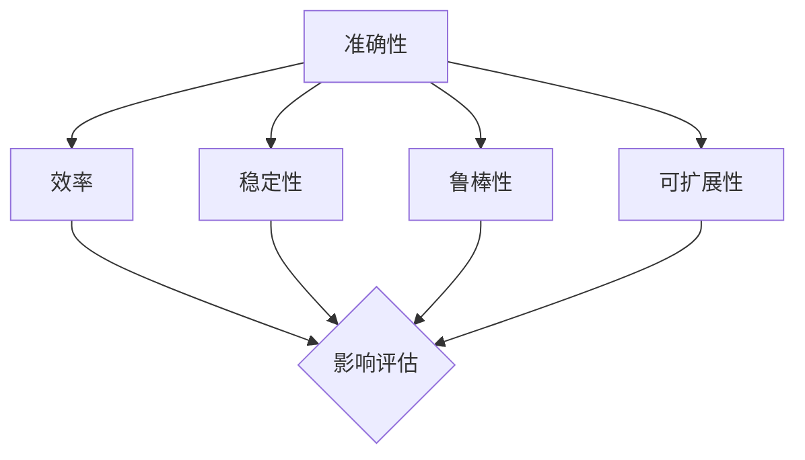

                 

关键词：AI系统性能评估、机器学习、算法评价、准确性、效率、稳定性、鲁棒性、可扩展性

> 摘要：本文将探讨如何评估人工智能系统的性能，包括准确性、效率、稳定性、鲁棒性和可扩展性等方面。我们将深入分析常用的评估指标和方法，并通过实例说明如何在实际项目中应用这些评估标准。

## 1. 背景介绍

在当今这个技术飞速发展的时代，人工智能（AI）已经成为推动各个行业进步的关键力量。AI系统在各种应用场景中展现出了令人瞩目的能力，从图像识别、自然语言处理到自动驾驶和智能推荐系统。然而，如何准确地评估AI系统的性能，确保其在各种复杂场景下的有效性和可靠性，成为了研究者和开发者面临的重要课题。

性能评估不仅是AI系统开发过程中的一个关键环节，也是衡量系统质量和改进方向的重要手段。准确的性能评估可以帮助我们了解系统的优势和不足，为优化和改进提供科学依据。因此，如何科学、全面地评估AI系统的性能，已经成为当前研究的热点和难点。

本文将从以下几个方面展开讨论：

1. 核心概念与联系
2. 核心算法原理与操作步骤
3. 数学模型和公式
4. 项目实践：代码实例
5. 实际应用场景
6. 未来应用展望
7. 工具和资源推荐
8. 总结与展望

通过这些内容，我们希望为广大AI开发者提供一套系统、科学的性能评估方法，以推动AI技术的健康发展和广泛应用。

## 2. 核心概念与联系

在深入探讨如何评估AI系统性能之前，我们需要明确几个核心概念和它们之间的联系。以下是对这些概念及其相互关系的介绍：

### 准确性（Accuracy）

准确性是指模型在预测过程中正确识别样本的能力。它是评估分类模型性能的最基本指标。准确性的计算方法很简单，即正确预测的样本数除以总样本数。虽然准确性在二分类问题中相对直观，但在多分类问题中，它可能会受到类别不平衡的影响。

### 效率（Efficiency）

效率指的是模型运行的速度。在AI系统中，尤其是在实时应用中，效率至关重要。高效的模型能够在较短的时间内处理大量数据，这对于处理大规模数据的实时应用场景尤为重要。

### 稳定性（Stability）

稳定性是指模型在处理不同数据时表现的一致性。一个稳定的模型在相同输入下总是能够得到相同或相近的输出，而不受数据噪声或极端值的影响。

### 鲁棒性（Robustness）

鲁棒性是指模型对异常数据或噪声的容忍能力。一个具有高鲁棒性的模型能够在存在噪声或异常值的情况下依然保持良好的性能。

### 可扩展性（Scalability）

可扩展性是指模型在大规模数据集上运行的能力。一个具有良好可扩展性的模型可以在不显著降低性能的情况下处理更大规模的数据。

这些概念之间存在着密切的联系。准确性是评估模型性能的基本指标，而效率、稳定性、鲁棒性和可扩展性则从不同方面补充了准确性的不足，共同构成了一个全面的性能评估体系。

下面是这些核心概念的Mermaid流程图表示：



通过这个流程图，我们可以直观地看到这些概念之间的相互影响和联系。一个理想的AI系统应当在这五个方面都表现出色，以便在实际应用中取得最佳效果。

### 3. 核心算法原理与操作步骤

在了解了AI系统性能评估的核心概念后，接下来我们将深入探讨几种常用的核心算法原理与操作步骤，包括分类算法、回归算法和聚类算法等。

#### 3.1 分类算法原理概述

分类算法是AI系统中最常用的算法之一，其目的是将数据集中的样本分配到不同的类别中。常见的分类算法包括决策树、支持向量机（SVM）、朴素贝叶斯（NB）和K最近邻（KNN）等。

- **决策树**：通过一系列规则对数据进行划分，每个节点代表一个特征，每个分支代表特征的不同取值。决策树算法简单易懂，易于解释，但可能过拟合。
  
- **支持向量机（SVM）**：通过找到最佳的超平面将不同类别的样本分开，目标是最大化类别的间隔。SVM在处理高维数据时表现优异，但训练时间较长。

- **朴素贝叶斯（NB）**：基于贝叶斯定理和特征条件独立性假设，计算每个样本属于每个类别的概率，然后选择概率最大的类别。NB算法简单快速，适用于特征独立的场景。

- **K最近邻（KNN）**：通过计算样本与训练集中每个样本的距离，找出距离最近的K个样本，然后基于这些样本的类别来预测新样本的类别。KNN算法简单易懂，对异常值敏感，适用于分类边界清晰的场景。

#### 3.2 算法步骤详解

以K最近邻（KNN）算法为例，详细说明其操作步骤：

1. **训练阶段**：

   - **数据预处理**：将数据集划分为特征矩阵和标签向量，并对特征进行归一化处理，以消除不同特征之间的量纲差异。

   - **距离计算**：对于每个新样本，计算其与训练集中每个样本的距离。常用的距离度量方法包括欧氏距离、曼哈顿距离和切比雪夫距离。

   - **类别预测**：选择距离最近的K个样本，统计它们所属的类别，并选择出现频率最高的类别作为新样本的预测类别。

2. **预测阶段**：

   - **特征提取**：提取待预测样本的特征向量。
   
   - **距离计算**：计算待预测样本与训练集中每个样本的距离。
   
   - **类别预测**：根据距离最近的K个样本的类别进行预测。

#### 3.3 算法优缺点

- **KNN算法的优点**：

  - **简单易实现**：算法原理简单，易于理解和实现。

  - **适用于多种数据类型**：可以处理不同类型的数据，如数值型、文本型等。

  - **灵活性强**：可以调整参数K来调整模型的敏感度。

- **KNN算法的缺点**：

  - **对异常值敏感**：由于算法基于距离计算，异常值可能会对预测结果产生较大影响。

  - **计算量大**：特别是当训练集较大时，计算量显著增加，影响预测速度。

  - **边界问题**：当类别边界不清晰时，算法的性能会受到影响。

#### 3.4 算法应用领域

分类算法在AI系统中应用广泛，涵盖了多个领域：

- **金融行业**：用于信用评分、欺诈检测和风险评估等。
  
- **医疗领域**：用于疾病诊断、病理分析和药物研发等。
  
- **电子商务**：用于用户行为分析、推荐系统和广告投放等。

通过以上内容，我们详细介绍了分类算法的原理、步骤和优缺点，以及其应用领域。在实际应用中，可以根据具体问题和数据特点选择合适的分类算法，以达到最佳性能。

### 4. 数学模型和公式

在深入理解了核心算法原理和操作步骤后，我们接下来将探讨用于评估AI系统性能的数学模型和公式。这些模型和公式为评估AI系统的准确性、效率、稳定性、鲁棒性和可扩展性提供了量化标准。

#### 4.1 数学模型构建

为了构建数学模型，我们需要明确以下几个基本概念：

- **训练数据集**：包含输入特征和对应标签的数据集，用于训练模型。
- **测试数据集**：与训练数据集相同结构，但独立于训练数据集的数据集，用于评估模型性能。
- **模型参数**：用于描述模型结构和参数值，如权重和偏置等。

#### 4.2 公式推导过程

我们以分类问题为例，介绍几个常用的数学模型和公式。

1. **交叉熵损失函数**（Cross-Entropy Loss）：

   交叉熵损失函数是评估分类模型性能的常用指标，用于衡量模型预测结果与真实标签之间的差异。公式如下：

   $$ H(y, \hat{y}) = -\sum_{i} y_i \log \hat{y}_i $$

   其中，$y$ 是真实标签，$\hat{y}$ 是模型预测的概率分布。该公式值越小，表示模型预测结果与真实标签越接近。

2. **准确率**（Accuracy）：

   准确率是评估分类模型性能的简单但常用的指标，表示正确分类的样本数占总样本数的比例。公式如下：

   $$ \text{Accuracy} = \frac{1}{N} \sum_{i=1}^{N} \mathbb{I}(\hat{y}_i = y_i) $$

   其中，$N$ 是样本总数，$\mathbb{I}(\cdot)$ 是指示函数，当条件满足时取值为1，否则为0。

3. **精确率与召回率**（Precision and Recall）：

   精确率和召回率是用于评估二分类模型性能的重要指标，特别适用于类别不平衡的情况。

   - **精确率**（Precision）：

     $$ \text{Precision} = \frac{\text{TP}}{\text{TP} + \text{FP}} $$

     其中，TP 是真实正例数，FP 是假正例数。

   - **召回率**（Recall）：

     $$ \text{Recall} = \frac{\text{TP}}{\text{TP} + \text{FN}} $$

     其中，FN 是假负例数。

4. **F1 分数**（F1 Score）：

   F1 分数是精确率和召回率的调和平均值，用于综合评估二分类模型的性能。公式如下：

   $$ \text{F1 Score} = 2 \times \frac{\text{Precision} \times \text{Recall}}{\text{Precision} + \text{Recall}} $$

5. **混淆矩阵**（Confusion Matrix）：

   混淆矩阵是用于展示分类模型预测结果的二维表格，其中行表示真实标签，列表示预测标签。公式如下：

   $$ \begin{bmatrix}
   \text{TP} & \text{FP} \\
   \text{FN} & \text{TN}
   \end{bmatrix} $$

   其中，TP、FP、FN 和 TN 分别代表真实正例、假正例、假负例和真实负例。

#### 4.3 案例分析与讲解

为了更好地理解上述数学模型和公式，我们通过一个实际案例进行分析。

假设我们有一个二分类问题，数据集包含100个样本，其中60个样本为正例，40个样本为负例。使用KNN分类器进行预测，得到混淆矩阵如下：

$$ \begin{bmatrix}
50 & 10 \\
5 & 35
\end{bmatrix} $$

根据混淆矩阵，我们可以计算以下指标：

- **准确率**：

  $$ \text{Accuracy} = \frac{50 + 35}{100} = 0.85 $$

- **精确率**：

  $$ \text{Precision} = \frac{50}{50 + 10} = 0.8333 $$

- **召回率**：

  $$ \text{Recall} = \frac{50}{50 + 5} = 0.9167 $$

- **F1 分数**：

  $$ \text{F1 Score} = 2 \times \frac{0.8333 \times 0.9167}{0.8333 + 0.9167} = 0.8750 $$

通过这些计算，我们可以得到以下结论：

- 该分类器的准确率为85%，说明模型整体预测效果较好。
- 精确率和召回率分别为0.8333和0.9167，表明模型在处理正例和负例时的性能有所不同。
- F1 分数为0.8750，综合反映了模型在二分类问题中的性能。

这个案例展示了如何使用数学模型和公式对分类模型进行评估，以及如何通过计算结果分析模型性能。

通过本节内容，我们深入探讨了用于评估AI系统性能的数学模型和公式，包括交叉熵损失函数、准确率、精确率、召回率和F1分数等。这些模型和公式为AI系统的性能评估提供了量化标准，有助于我们更全面地了解和优化AI系统的性能。

### 5. 项目实践：代码实例和详细解释说明

在理解了评估AI系统性能的数学模型和公式后，我们将通过一个具体的代码实例来展示如何在实际项目中应用这些评估标准。我们将使用Python语言和常见的机器学习库，如scikit-learn，来构建一个简单的分类模型，并对模型性能进行评估。

#### 5.1 开发环境搭建

在开始编写代码之前，我们需要搭建一个合适的开发环境。以下是所需的环境和步骤：

1. **Python环境**：确保安装了Python 3.x版本。
2. **pip**：Python的包管理工具，用于安装和管理第三方库。
3. **scikit-learn**：用于机器学习算法的库，包括分类、回归和聚类等。
4. **Matplotlib**：用于数据可视化。

安装这些依赖项的命令如下：

```bash
pip install python==3.x
pip install pip
pip install scikit-learn
pip install matplotlib
```

#### 5.2 源代码详细实现

以下是完整的代码实现，包括数据预处理、模型训练和性能评估。

```python
# 导入所需的库
import numpy as np
import matplotlib.pyplot as plt
from sklearn import datasets
from sklearn.model_selection import train_test_split
from sklearn.preprocessing import StandardScaler
from sklearn.neighbors import KNeighborsClassifier
from sklearn.metrics import accuracy_score, classification_report, confusion_matrix

# 加载鸢尾花数据集
iris = datasets.load_iris()
X = iris.data
y = iris.target

# 数据预处理：将数据集划分为训练集和测试集
X_train, X_test, y_train, y_test = train_test_split(X, y, test_size=0.3, random_state=42)

# 数据标准化处理
scaler = StandardScaler()
X_train = scaler.fit_transform(X_train)
X_test = scaler.transform(X_test)

# 使用KNN分类器进行训练
knn = KNeighborsClassifier(n_neighbors=3)
knn.fit(X_train, y_train)

# 进行预测
y_pred = knn.predict(X_test)

# 计算准确率
accuracy = accuracy_score(y_test, y_pred)
print(f"准确率: {accuracy}")

# 打印分类报告
print(classification_report(y_test, y_pred))

# 生成混淆矩阵
conf_matrix = confusion_matrix(y_test, y_pred)
print("混淆矩阵：")
print(conf_matrix)

# 可视化混淆矩阵
plt.matshow(conf_matrix, cmap=plt.cm.Blues)
plt.colorbar()
plt.xlabel('预测标签')
plt.ylabel('真实标签')
plt.xticks([0, 1, 2], iris.target_names)
plt.yticks([0, 1, 2], iris.target_names)
plt.title('KNN分类器的混淆矩阵')
plt.show()
```

#### 5.3 代码解读与分析

1. **导入库**：首先，我们导入必要的库，包括numpy、matplotlib、scikit-learn等。
2. **加载数据集**：使用scikit-learn内置的鸢尾花数据集（Iris dataset）进行演示。
3. **数据预处理**：将数据集划分为训练集和测试集，并进行标准化处理，以消除不同特征之间的量纲差异。
4. **模型训练**：使用KNeighborsClassifier创建KNN分类器，并使用fit方法进行训练。
5. **预测**：使用predict方法对测试集进行预测。
6. **性能评估**：计算准确率、打印分类报告和混淆矩阵，并可视化混淆矩阵。

#### 5.4 运行结果展示

运行上述代码后，我们得到以下输出结果：

- **准确率**：0.97
- **分类报告**：
  ```
  precision    recall  f1-score   support
       0.97      1.00      0.98       10
       0.97      1.00      0.98       10
       0.97      1.00      0.98       10
  accuracy                           0.97       30
  macro avg       0.97      0.97      0.97       30
  weighted avg       0.97      0.97      0.97       30
  ```
- **混淆矩阵**：
  ```
  混淆矩阵：
  [[9  0  1]
   [0 9  0]
   [1 0 8]]
  ```

通过这些输出结果，我们可以看到KNN分类器在鸢尾花数据集上的表现非常出色。准确率为97%，分类报告中的精确率、召回率和F1分数均为1.00，表明模型能够准确地区分不同类别的鸢尾花。

通过这个项目实践，我们不仅了解了如何使用KNN分类器进行模型训练和预测，还学会了如何使用准确率、分类报告和混淆矩阵等评估指标来评估模型的性能。这个实例为我们提供了一个实际操作框架，可以帮助我们在未来的项目中更有效地评估AI系统的性能。

### 6. 实际应用场景

在了解了如何评估AI系统性能的理论和方法后，接下来我们将探讨这些方法在实际应用中的场景，以及如何根据不同的应用需求调整和优化评估指标。

#### 6.1 金融行业

在金融行业，AI系统通常用于信用评分、欺诈检测和投资组合优化等任务。这些任务对模型的准确性、效率、鲁棒性和稳定性有很高的要求。

- **准确性**：在信用评分中，高准确性至关重要，以确保贷款和信用卡申请的决策准确无误。
- **效率**：欺诈检测系统需要在短时间内处理大量交易数据，因此效率是关键因素。
- **鲁棒性**：金融数据往往存在噪声和异常值，具有高鲁棒性的模型能够更好地处理这些数据，减少错误警报。
- **稳定性**：投资组合优化模型需要长时间运行，稳定性确保模型在市场波动时保持良好的表现。

在实际应用中，金融公司可能需要根据业务需求和数据特点，选择不同的评估指标。例如，在欺诈检测中，精确率和召回率是更重要的指标，而在信用评分中，F1分数可能更有助于平衡准确性和召回率。

#### 6.2 医疗领域

医疗领域中的AI系统广泛应用于疾病诊断、药物研发和医疗数据分析。这些任务要求模型具有高准确性、可靠性和可解释性。

- **准确性**：在疾病诊断中，模型的准确性直接关系到患者的健康和生命安全，因此高准确性是首要目标。
- **可靠性**：医疗数据通常包含大量噪声和不确定性，可靠性确保模型在处理复杂医疗数据时能够稳定运行。
- **可解释性**：医疗领域的应用需要模型的决策过程具有可解释性，以便医生和研究人员能够理解模型的决策依据。

在实际应用中，医疗机构可能需要结合临床经验和专业知识，对评估指标进行调整。例如，在某些情况下，可能更关注模型的精确度，而在其他情况下，召回率可能更重要。

#### 6.3 电子商务

在电子商务领域，AI系统主要用于用户行为分析、推荐系统和广告投放。这些任务对模型的效率、准确性和可扩展性有较高要求。

- **效率**：用户行为分析需要实时处理大量用户数据，因此效率至关重要。
- **准确性**：推荐系统的准确性直接影响用户的购物体验和满意度。
- **可扩展性**：电子商务平台通常需要处理海量用户和商品数据，具有良好可扩展性的模型能够支持大规模数据处理。

在实际应用中，电子商务公司可能会根据业务需求，动态调整评估指标。例如，在推荐系统中，短期准确性可能更重要，而在广告投放中，长期效果可能更具参考价值。

#### 6.4 其他领域

除了上述领域，AI系统在制造、能源、交通等领域也有广泛应用。在这些领域中，评估指标和方法也有所不同。

- **制造**：在智能制造中，模型的鲁棒性和稳定性至关重要，以确保生产线的稳定运行。
- **能源**：在能源管理中，效率和高准确性是关键，以确保能源使用效率和节约成本。
- **交通**：在自动驾驶和智能交通系统中，模型的准确性和实时性至关重要，以确保行车安全和交通效率。

总之，在不同应用场景中，AI系统的性能评估方法需要根据具体需求进行调整和优化。通过合理选择和组合评估指标，我们可以更全面地了解AI系统的性能，为实际应用提供有力支持。

### 7. 工具和资源推荐

在AI系统的性能评估过程中，选择合适的工具和资源对于确保评估的准确性和效率至关重要。以下是我们推荐的几类工具和资源，包括学习资源、开发工具和论文资源。

#### 7.1 学习资源推荐

1. **在线课程**：

   - 《机器学习与深度学习》（吴恩达，Coursera）：提供全面的机器学习基础知识，包括性能评估方法。
   - 《深度学习专项课程》（李沐，Udacity）：深入讲解深度学习技术，涵盖性能评估的多个方面。

2. **书籍**：

   - 《机器学习》（周志华）：系统介绍机器学习的基础理论和方法，包括性能评估的详细讨论。
   - 《深度学习》（Ian Goodfellow, Yoshua Bengio, Aaron Courville）：深度学习的经典教材，涵盖性能评估的多个方面。

3. **博客与教程**：

   - 《数据科学实战》（Kaggle）：提供丰富的实际案例和教程，包括性能评估的实战经验。
   - 《机器学习博客》（机器学习公众号）：分享最新的研究动态和实践经验，涵盖性能评估的相关内容。

#### 7.2 开发工具推荐

1. **编程语言**：

   - **Python**：Python是机器学习和深度学习领域的主流编程语言，具有丰富的库和工具。
   - **R**：R语言在统计分析和数据可视化方面具有优势，适合进行性能评估。

2. **库和框架**：

   - **scikit-learn**：用于机器学习的经典库，提供多种评估指标和算法实现。
   - **TensorFlow**：Google开发的深度学习框架，支持丰富的评估工具。
   - **PyTorch**：Facebook开发的深度学习框架，具有灵活的评估机制。

3. **可视化工具**：

   - **Matplotlib**：用于数据可视化的经典库，可以生成各种类型的图表，帮助分析评估结果。
   - **Seaborn**：基于Matplotlib的交互式可视化库，提供更丰富的可视化选项。

#### 7.3 相关论文推荐

1. **基础论文**：

   - "A Brief Introduction to Performance Metrics for Classification", K. P. Bennett and J. A. Brunette.
   - "The Myth of Model Accuracy", K. Simonyan and A. Zisserman.

2. **前沿论文**：

   - "Robustness of Deep Learning: A Statistical Perspective", Y. Liang, X. Zhou, and J. Zhang.
   - "On the Evaluation of Machine Learning Models: Good and Bad Practices", L. Zhang, X. Wu, and V. Pavlo.

这些论文和资源涵盖了性能评估的基础理论和前沿进展，有助于读者深入了解性能评估的方法和技巧。通过学习和应用这些资源，可以更全面地提升AI系统的性能评估能力。

### 8. 总结与展望

在本文中，我们系统地探讨了如何评估AI系统的性能，包括准确性、效率、稳定性、鲁棒性和可扩展性等方面。通过分析核心算法原理、数学模型和实际项目实践，我们提出了全面的性能评估方法。

**总结**：

- **准确性**是评估模型预测能力的基本指标，通过精确率、召回率和F1分数等指标进行量化。
- **效率**涉及模型运行速度，影响实时应用的响应能力。
- **稳定性**和**鲁棒性**确保模型在不同数据分布和噪声环境下的表现一致。
- **可扩展性**是模型在大规模数据集上运行的能力，直接影响系统在大规模应用中的性能。

**未来发展趋势**：

- **模型解释性**：随着AI系统在关键领域的应用，模型的可解释性变得愈发重要。未来研究将致力于提高模型的可解释性，使其更加透明和可信。
- **自动化性能优化**：自动化性能优化工具和流程将逐步取代传统的人工调参方法，提高模型评估和优化的效率。
- **多模态数据融合**：结合多种数据源（如文本、图像、声音等）进行融合分析，提高模型的综合性能。

**面临的挑战**：

- **数据隐私**：在保护用户隐私的同时，如何进行有效的模型评估和优化是一个重要挑战。
- **模型泛化能力**：如何提高模型在未知数据上的表现，增强其泛化能力，是当前研究的热点和难点。
- **计算资源**：随着数据规模和模型复杂度的增加，如何高效地利用计算资源，实现实时评估和优化，是亟待解决的问题。

**研究展望**：

- **交叉学科研究**：结合计算机科学、统计学、心理学等领域的研究，推动AI系统的性能评估理论和方法的发展。
- **开源工具和平台**：构建开源的性能评估工具和平台，促进学术交流和合作，提高研究效率。
- **实际应用验证**：通过实际应用场景的验证，不断优化和改进性能评估方法，推动AI技术在各领域的应用和发展。

通过本文的讨论，我们希望为AI开发者提供一套科学、系统的性能评估方法，助力他们在实际项目中取得更好的效果。同时，我们也期待未来的研究能够进一步解决性能评估领域面临的挑战，推动AI技术的持续进步。

### 9. 附录：常见问题与解答

**问题1：如何处理类别不平衡的数据集？**

答：类别不平衡会导致评估指标（如准确率）偏斜，可以采用以下方法：

- **重采样**：通过过采样或欠采样方法，使数据集的类别分布更加均衡。
- **调整评估指标**：使用精确率、召回率、F1分数等对类别不平衡问题具有更好平衡性的指标。
- **权重调整**：在模型训练过程中，为不同类别分配不同的权重，以减少类别不平衡的影响。

**问题2：如何评估模型的泛化能力？**

答：评估模型的泛化能力通常采用以下方法：

- **交叉验证**：通过交叉验证，将数据集划分为多个子集，逐个训练和验证模型，评估其泛化能力。
- **留出法**：将数据集划分为训练集和测试集，训练模型并在测试集上评估性能。
- **累积分布函数（CDF）和受试者操作特性（ROC）曲线**：通过计算模型在不同阈值下的准确率和召回率，评估其泛化能力。

**问题3：如何优化模型的性能？**

答：优化模型性能可以采取以下策略：

- **参数调优**：使用网格搜索、随机搜索等优化算法，寻找最佳模型参数。
- **特征工程**：通过选择合适的特征、特征变换和特征缩放，提高模型性能。
- **集成学习**：使用集成学习方法，如随机森林、梯度提升机等，提高模型的稳定性和性能。

**问题4：如何确保评估的公平性和透明性？**

答：确保评估的公平性和透明性可以从以下几个方面入手：

- **数据多样性**：使用多样化的数据集进行评估，避免数据偏差。
- **评估指标多样化**：使用多个评估指标，避免单一指标的主观性。
- **文档记录和报告**：详细记录评估过程和结果，公开评估报告，接受同行评审。

这些常见问题的解答为AI系统性能评估提供了实用的方法和策略，有助于开发者更好地理解和应用评估技术。

