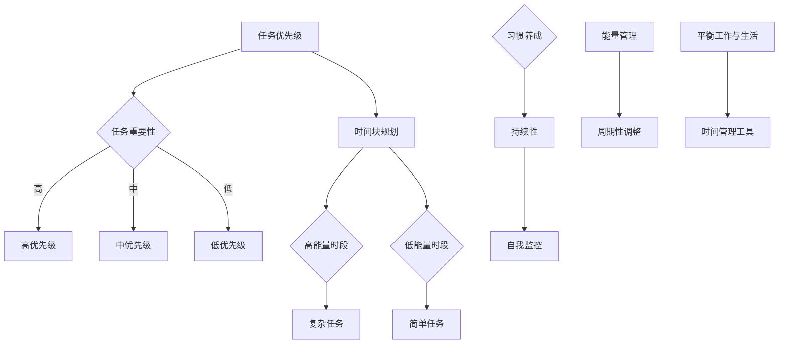

                 

关键词：时间管理、效率提升、生产力、工作与生活的平衡、策略与技巧、技术工具

> 摘要：本文深入探讨时间管理在信息技术领域中的重要性，分析了几种核心概念和策略，并通过实例展示如何合理安排时间和精力，以提升个人和团队的生产力。文章还包括数学模型、项目实践、实际应用场景、未来展望以及工具和资源推荐。

## 1. 背景介绍

在信息技术领域，高效的时间管理是成功的关键。随着数字化转型的加速，IT专业人士面临的工作复杂性和压力也在不断增大。合理分配时间和精力，确保工作与生活的平衡，成为许多专业人士追求的目标。本文将介绍几种实用的时间管理策略和技术，帮助IT专业人士更好地规划和管理他们的时间和精力。

## 2. 核心概念与联系

### 2.1 核心概念

时间管理是关于如何有效地规划、分配和利用时间的过程，以实现个人和职业目标。在信息技术领域，时间管理的核心概念包括：

- **任务优先级**：确定任务的紧急性和重要性。
- **时间块**：将时间分割成小块，用于完成特定任务。
- **习惯养成**：通过重复性的行为形成有益的习惯。
- **能量管理**：理解个人能量曲线，合理安排高能量和低能量时段的工作。

### 2.2 Mermaid 流程图



## 3. 核心算法原理 & 具体操作步骤

### 3.1 算法原理概述

时间管理算法的基本原理是优化时间分配，以最大化工作效率。关键步骤包括：

1. **任务分解**：将大任务拆分为小任务。
2. **优先级排序**：使用如Eisenhower矩阵等工具对任务进行优先级排序。
3. **时间块规划**：将时间分为工作块和休息块。
4. **持续监控与调整**：定期评估时间管理策略的效果，并进行调整。

### 3.2 算法步骤详解

1. **确定任务**：列出所有需要完成的任务。
2. **任务分类**：根据紧急性和重要性对任务分类。
3. **优先级排序**：使用Eisenhower矩阵对任务进行排序。
4. **时间块规划**：将一天的时间分为工作块（例如，2小时工作+10分钟休息）。
5. **执行任务**：按照优先级和工作块计划执行任务。
6. **监控与调整**：每日或每周回顾时间管理效果，根据实际情况进行调整。

### 3.3 算法优缺点

**优点**：
- 提高工作效率。
- 有助于工作与生活的平衡。
- 促进个人成长。

**缺点**：
- 需要较强的自律性。
- 可能对习惯性拖延者产生压力。

### 3.4 算法应用领域

时间管理算法在信息技术领域有广泛的应用，包括：

- **项目管理**：确保项目按计划进行。
- **软件开发**：提高开发效率和代码质量。
- **个人成长**：培养高效的工作和生活习惯。

## 4. 数学模型和公式 & 详细讲解 & 举例说明

### 4.1 数学模型构建

时间管理模型可以用以下公式表示：

\[ T = f(P, E, H) \]

其中：
- \( T \)：时间管理效果。
- \( P \)：优先级排序。
- \( E \)：能量管理。
- \( H \)：习惯养成。

### 4.2 公式推导过程

时间管理效果 \( T \) 是优先级排序 \( P \)、能量管理 \( E \) 和习惯养成 \( H \) 的函数。通过以下步骤推导：

1. **优先级排序**：任务按紧急性和重要性排序，提高工作效率。
2. **能量管理**：根据个人能量曲线安排任务，确保高能量时段处理复杂任务。
3. **习惯养成**：通过持续性训练，提高自我监控能力，优化时间分配。

### 4.3 案例分析与讲解

假设一位软件工程师想要提高工作效率，可以使用时间管理模型进行优化。首先，列出所有任务并分类，然后根据紧急性和重要性排序。接着，根据个人能量曲线安排任务，确保在高能量时段处理复杂任务。最后，通过持续训练，培养良好的时间管理习惯。

## 5. 项目实践：代码实例和详细解释说明

### 5.1 开发环境搭建

选择Python作为开发语言，使用Jupyter Notebook作为开发环境。

### 5.2 源代码详细实现

以下是一个简单的Python代码实例，用于实现时间管理模型：

```python
import datetime

# 任务类
class Task:
    def __init__(self, name, priority, duration):
        self.name = name
        self.priority = priority
        self.duration = duration

# 时间管理函数
def time_management(tasks):
    tasks.sort(key=lambda x: x.priority, reverse=True)
    for task in tasks:
        start_time = datetime.datetime.now()
        print(f"开始任务：{task.name}")
        # 模拟任务执行
        time.sleep(task.duration)
        end_time = datetime.datetime.now()
        print(f"任务完成：{task.name}, 耗时：{end_time - start_time}")

# 测试代码
if __name__ == "__main__":
    tasks = [
        Task("任务A", 2, 2),
        Task("任务B", 1, 3),
        Task("任务C", 3, 1)
    ]
    time_management(tasks)
```

### 5.3 代码解读与分析

这段代码定义了一个`Task`类，用于表示任务的信息，包括名称、优先级和持续时间。`time_management`函数用于根据任务优先级排序并执行任务。在测试代码中，创建了一个任务列表并调用`time_management`函数。

### 5.4 运行结果展示

运行代码后，会根据任务的优先级执行任务，并打印出任务的开始和结束时间。

## 6. 实际应用场景

### 6.1 项目管理

在项目管理中，时间管理是确保项目按时完成的基石。项目经理可以使用时间管理策略来规划项目任务，确保每个任务都按时完成。

### 6.2 软件开发

软件工程师可以通过时间管理提高代码质量和开发效率。合理安排时间块，确保在高能量时段处理复杂代码。

### 6.3 个人成长

个人成长过程中，时间管理可以帮助个人培养良好的学习和工作习惯，提高自我管理能力。

## 7. 工具和资源推荐

### 7.1 学习资源推荐

- 《The Art of Procrastination》
- 《Getting Things Done》

### 7.2 开发工具推荐

- Trello：项目管理工具。
- Jira：敏捷开发工具。

### 7.3 相关论文推荐

- "Time Management in Software Engineering"
- "The Science of Productivity"

## 8. 总结：未来发展趋势与挑战

### 8.1 研究成果总结

时间管理研究已取得显著成果，包括算法优化、工具开发和应用场景扩展。

### 8.2 未来发展趋势

随着人工智能技术的发展，未来时间管理将更加智能化和个性化。

### 8.3 面临的挑战

如何提高个体的自律性和适应性是未来时间管理研究的主要挑战。

### 8.4 研究展望

未来的研究将侧重于开发更加智能和高效的时间管理算法，以适应不同个体和场景的需求。

## 9. 附录：常见问题与解答

### 9.1 什么是时间管理？

时间管理是关于如何有效地规划、分配和利用时间的过程，以实现个人和职业目标。

### 9.2 时间管理有哪些好处？

时间管理可以提高工作效率、促进工作与生活的平衡、增强个人成长。

### 9.3 如何应对时间管理中的挑战？

通过自我监控、定期调整和适应性训练，可以应对时间管理中的挑战。

### 9.4 哪些工具可以帮助进行时间管理？

Trello、Jira等项目管理工具可以帮助进行时间管理。

## 作者署名

作者：禅与计算机程序设计艺术 / Zen and the Art of Computer Programming
----------------------------------------------------------------

以上就是这篇文章的正文内容。希望本文能够帮助IT专业人士更好地进行时间管理和提升生产力。如果您有任何问题或建议，欢迎在评论区留言。再次感谢您的阅读！

