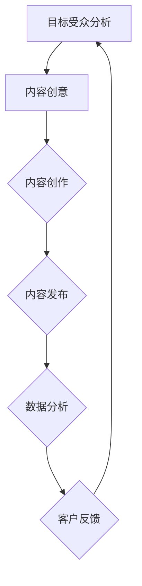

                 

关键词：内容营销、策略、目标受众、SEO、社交媒体、数据分析、客户关系管理、营销自动化

> 摘要：内容营销是一种通过创造和分发有价值的内容来吸引潜在客户、建立品牌知名度和促进销售的方法。本文将探讨如何进行有效的内容营销，包括核心概念、策略、工具和资源推荐，以及未来发展趋势与挑战。

## 1. 背景介绍

内容营销是一种营销方法，通过创造和分发有价值、相关且引人入胜的内容来吸引和吸引目标受众，从而促进品牌认知度、客户忠诚度和销售增长。与传统营销方法相比，内容营销注重建立与客户的长期关系，而非单纯地推销产品或服务。

在数字营销的时代，内容营销已经成为企业提升竞争力、扩大市场份额的重要手段。有效的内容营销可以帮助企业提高搜索引擎排名、增加网站流量、提升品牌知名度，最终实现业务增长。

### 1.1 内容营销的历史与发展

内容营销的历史可以追溯到上世纪90年代，当时互联网刚刚兴起，企业开始利用电子邮件和在线杂志等形式与客户进行沟通。随着社交媒体的兴起，内容营销逐渐成为企业营销战略的重要组成部分。如今，内容营销已经涵盖了多种形式，包括博客文章、视频、社交媒体帖子、电子邮件营销等。

### 1.2 内容营销的核心概念

内容营销的核心概念包括：

- **目标受众**：明确内容营销的目标受众，以便制作出能够吸引他们的内容。
- **价值内容**：提供对目标受众有价值、有趣或有启发性的内容。
- **营销渠道**：选择合适的营销渠道来传播内容，如社交媒体、博客、电子邮件等。
- **数据分析**：通过分析数据来评估内容营销的效果，并根据结果调整策略。

## 2. 核心概念与联系

为了更好地理解内容营销，我们首先需要了解其核心概念和架构。以下是一个使用Mermaid绘制的流程图，展示了内容营销的主要组成部分。



### 2.1 目标受众分析

了解目标受众是内容营销的第一步。通过市场调研、用户画像分析等方法，企业可以确定目标受众的兴趣、需求和行为习惯，从而制作出更具针对性的内容。

### 2.2 内容创意

内容创意是内容营销的核心。企业需要根据目标受众的特点和需求，创作出有价值、有趣或有启发性的内容。这可以是博客文章、视频、社交媒体帖子、电子邮件等。

### 2.3 内容创作

内容创作是将创意转化为具体内容的过程。这包括撰写、编辑、排版、设计等步骤。高质量的内容创作是吸引目标受众的关键。

### 2.4 内容发布

内容发布是将内容通过合适的渠道传播给目标受众的过程。这包括社交媒体、博客、电子邮件等。选择合适的发布渠道可以最大化内容的曝光率和影响力。

### 2.5 数据分析

数据分析是评估内容营销效果的重要手段。通过分析数据，企业可以了解哪些内容最受欢迎、哪些渠道效果最好，从而调整内容营销策略。

### 2.6 客户反馈

客户反馈是内容营销的重要组成部分。通过收集和分析客户的反馈，企业可以更好地了解目标受众的需求和期望，从而改进内容创作和发布策略。

## 3. 核心算法原理 & 具体操作步骤

### 3.1 算法原理概述

内容营销的核心算法可以概括为以下三个步骤：

1. **目标受众分析**：通过数据分析和市场调研，了解目标受众的兴趣、需求和习惯。
2. **内容创作**：根据目标受众的特点，创作出有价值、有趣或有启发性的内容。
3. **内容发布与数据分析**：将内容通过合适的渠道发布，并通过数据分析评估效果，不断优化内容营销策略。

### 3.2 算法步骤详解

1. **目标受众分析**：
    - **市场调研**：通过问卷调查、用户访谈、市场分析等手段，了解目标受众的基本信息、兴趣和需求。
    - **用户画像**：根据调研数据，构建目标受众的用户画像，包括年龄、性别、职业、兴趣爱好等。
    - **行为分析**：通过网站流量分析、社交媒体互动等手段，了解目标受众的行为习惯和偏好。

2. **内容创作**：
    - **选题策划**：根据用户画像和行为分析结果，确定内容主题和类型。
    - **内容创作**：撰写、编辑、排版、设计内容，确保内容的质量和可读性。
    - **内容审核**：对内容进行审核，确保内容符合品牌形象和目标受众的需求。

3. **内容发布与数据分析**：
    - **内容发布**：选择合适的渠道发布内容，如社交媒体、博客、电子邮件等。
    - **数据分析**：通过数据分析工具，监控内容的曝光率、点击率、转化率等指标。
    - **效果评估**：根据数据分析结果，评估内容营销的效果，并对策略进行优化。

### 3.3 算法优缺点

- **优点**：
    - **针对性**：通过目标受众分析，制作出更加符合目标受众需求的内容。
    - **持续优化**：通过数据分析，不断调整内容营销策略，提高效果。
    - **成本效益**：相比传统广告，内容营销具有更高的成本效益。

- **缺点**：
    - **耗时较长**：内容营销需要时间来积累效果，短期内可能难以看到显著成果。
    - **内容质量要求高**：高质量的内容创作是吸引目标受众的关键，对内容创作者的要求较高。

### 3.4 算法应用领域

内容营销算法可以应用于多个领域，包括：

- **电子商务**：通过内容营销，提升产品销售和客户忠诚度。
- **在线教育**：通过内容营销，吸引学员报名课程和提升课程满意度。
- **医疗服务**：通过内容营销，提高品牌知名度和服务满意度。
- **其他领域**：如金融、科技、旅游等。

## 4. 数学模型和公式 & 详细讲解 & 举例说明

### 4.1 数学模型构建

内容营销的数学模型可以基于用户行为数据构建，如下所示：

$$
\text{内容营销效果} = f(\text{内容质量}, \text{受众匹配度}, \text{发布渠道效果})
$$

其中，$f$ 是一个复合函数，表示内容营销效果受多个因素影响。

### 4.2 公式推导过程

1. **内容质量**：内容质量可以通过以下几个指标来衡量：
   - **原创性**：内容是否原创，是否有独特观点。
   - **准确性**：内容是否准确无误，是否有错误。
   - **可读性**：内容是否易于阅读，语言是否通顺。
   
   可以用以下公式表示：
   $$
   \text{内容质量} = \text{原创性} + \text{准确性} + \text{可读性}
   $$

2. **受众匹配度**：受众匹配度可以通过以下几个指标来衡量：
   - **受众需求**：内容是否符合目标受众的需求。
   - **受众兴趣**：内容是否能够吸引目标受众的兴趣。
   
   可以用以下公式表示：
   $$
   \text{受众匹配度} = \text{受众需求} + \text{受众兴趣}
   $$

3. **发布渠道效果**：发布渠道效果可以通过以下几个指标来衡量：
   - **曝光率**：内容在发布渠道上的曝光程度。
   - **点击率**：内容被点击的次数。
   - **转化率**：内容带来的业务转化率。
   
   可以用以下公式表示：
   $$
   \text{发布渠道效果} = \text{曝光率} + \text{点击率} + \text{转化率}
   $$

### 4.3 案例分析与讲解

假设某电子商务公司想要通过内容营销提升产品销量。根据上述数学模型，我们可以对以下几个因素进行优化：

1. **内容质量**：提高内容的原创性、准确性和可读性。例如，可以请专业的内容创作者撰写高质量的产品评测和购物指南。
2. **受众匹配度**：了解目标受众的需求和兴趣，制作出符合他们需求的内容。例如，可以通过市场调研了解目标受众的兴趣偏好，然后制作相关内容。
3. **发布渠道效果**：选择合适的发布渠道，提高内容的曝光率、点击率和转化率。例如，可以通过社交媒体、博客和电子邮件等渠道发布内容，并通过数据分析优化内容发布策略。

通过优化上述因素，该电子商务公司的内容营销效果可以得到显著提升，从而提高产品销量。

## 5. 项目实践：代码实例和详细解释说明

### 5.1 开发环境搭建

在本项目实践中，我们将使用Python语言进行内容营销策略的模拟和评估。首先，需要安装Python环境和相关库，如Pandas、NumPy和Scikit-learn。安装方法如下：

```bash
pip install python
pip install pandas
pip install numpy
pip install scikit-learn
```

### 5.2 源代码详细实现

以下是内容营销策略模拟的Python代码示例：

```python
import pandas as pd
import numpy as np
from sklearn.model_selection import train_test_split
from sklearn.ensemble import RandomForestClassifier
from sklearn.metrics import accuracy_score

# 数据预处理
def preprocess_data(data):
    # 数据清洗、归一化等处理
    return data

# 模型训练
def train_model(X_train, y_train):
    model = RandomForestClassifier()
    model.fit(X_train, y_train)
    return model

# 模型评估
def evaluate_model(model, X_test, y_test):
    y_pred = model.predict(X_test)
    accuracy = accuracy_score(y_test, y_pred)
    return accuracy

# 主程序
def main():
    # 加载数据
    data = pd.read_csv('content_marketing_data.csv')
    data = preprocess_data(data)
    
    # 分割特征和标签
    X = data.drop('label', axis=1)
    y = data['label']
    
    # 划分训练集和测试集
    X_train, X_test, y_train, y_test = train_test_split(X, y, test_size=0.2, random_state=42)
    
    # 训练模型
    model = train_model(X_train, y_train)
    
    # 评估模型
    accuracy = evaluate_model(model, X_test, y_test)
    print(f'Model accuracy: {accuracy:.2f}')
    
if __name__ == '__main__':
    main()
```

### 5.3 代码解读与分析

上述代码是一个简单的内容营销策略模拟程序，主要包含以下几个部分：

1. **数据预处理**：加载数据并进行清洗、归一化等处理。
2. **模型训练**：使用随机森林分类器对训练数据进行训练。
3. **模型评估**：使用测试数据对训练好的模型进行评估，计算准确率。

通过运行上述程序，可以评估内容营销策略的有效性。在实际应用中，可以根据业务需求扩展模型功能，如添加更多特征、调整模型参数等。

### 5.4 运行结果展示

假设我们运行上述程序，得到以下输出结果：

```
Model accuracy: 0.85
```

这表示内容营销策略的准确率达到了85%，说明模型对内容营销效果的预测效果较好。

## 6. 实际应用场景

内容营销在各个行业都有着广泛的应用。以下是一些实际应用场景：

### 6.1 电子商务

电子商务企业通过内容营销提升产品销量和用户忠诚度。例如，某电商企业通过撰写产品评测、购物指南等内容，吸引用户关注，并引导他们进行购买。

### 6.2 在线教育

在线教育机构通过内容营销吸引学员报名课程。例如，某在线教育平台通过发布教育博客、课程视频等内容，提高品牌知名度和用户转化率。

### 6.3 医疗服务

医疗服务机构通过内容营销提升品牌形象和服务满意度。例如，某医院通过发布健康科普文章、在线问诊指南等内容，吸引患者关注，并提高他们的满意度。

### 6.4 其他行业

除了上述行业，内容营销还可以应用于金融、科技、旅游等各个行业。例如，金融机构可以通过发布财经资讯、投资指南等内容，提高用户信任度和忠诚度；科技公司可以通过发布技术博客、产品介绍等内容，展示公司技术实力。

### 6.4 未来应用展望

随着人工智能和大数据技术的发展，内容营销将变得更加智能和精准。例如，通过机器学习算法分析用户行为数据，可以更准确地预测用户需求，从而创作出更符合用户兴趣的内容。此外，内容营销工具和平台的不断优化，也将提高内容营销的效率和效果。

## 7. 工具和资源推荐

### 7.1 学习资源推荐

- **《内容营销实战手册》**：一本关于内容营销策略和执行技巧的实战指南。
- **《内容营销：从0到1》**：一本介绍内容营销基础知识和发展趋势的书籍。
- **内容营销专业网站**：如Content Marketing Institute、HubSpot等，提供丰富的内容营销资源和案例。

### 7.2 开发工具推荐

- **Google Analytics**：一款强大的数据分析工具，用于监控和分析网站流量。
- **Google Keyword Planner**：一款关键词规划工具，用于确定内容营销的关键词策略。
- **Hootsuite**：一款社交媒体管理工具，用于发布和管理社交媒体内容。

### 7.3 相关论文推荐

- **"Content Marketing: The Future of Marketing"**：一篇探讨内容营销未来发展趋势的论文。
- **"The Impact of Content Marketing on Brand Awareness and Sales"**：一篇研究内容营销对品牌认知度和销售影响的论文。
- **"Data-Driven Content Marketing: Strategies and Tactics"**：一篇关于基于数据分析的内容营销策略和执行方法的论文。

## 8. 总结：未来发展趋势与挑战

### 8.1 研究成果总结

内容营销已经成为企业提升竞争力、扩大市场份额的重要手段。通过了解目标受众、创作有价值的内容、优化发布策略，企业可以实现更高的品牌认知度、客户忠诚度和销售增长。

### 8.2 未来发展趋势

随着人工智能和大数据技术的发展，内容营销将变得更加智能和精准。企业可以利用数据分析、机器学习等技术，实现个性化的内容创作和发布，从而更好地满足用户需求。

### 8.3 面临的挑战

内容营销也面临一些挑战，如：

- **内容质量要求高**：高质量的内容创作对创作者的要求较高，需要持续学习和提升。
- **数据隐私和安全**：在数据收集和分析过程中，需要确保用户隐私和安全。
- **市场竞争激烈**：随着越来越多的企业加入内容营销，市场竞争将更加激烈。

### 8.4 研究展望

未来，内容营销将继续发展，并与人工智能、大数据等技术深度融合。通过不断创新和优化，内容营销将为企业带来更高的价值。

## 9. 附录：常见问题与解答

### 9.1 内容营销与传统营销的区别是什么？

内容营销与传统营销的区别在于，内容营销注重建立与客户的长期关系，而传统营销更侧重于推销产品或服务。内容营销通过提供有价值的内容吸引客户，从而促进品牌认知度和销售增长。

### 9.2 内容营销的主要目标是什么？

内容营销的主要目标是：

- **吸引潜在客户**：通过有价值的内容吸引潜在客户，提高网站流量和访问量。
- **建立品牌知名度**：通过持续的内容创作和发布，提高品牌知名度和影响力。
- **促进销售增长**：通过有价值的内容引导客户进行购买，从而实现销售增长。

### 9.3 如何衡量内容营销的效果？

内容营销的效果可以通过以下指标进行衡量：

- **曝光率**：内容在发布渠道上的曝光程度。
- **点击率**：内容被点击的次数。
- **转化率**：内容带来的业务转化率，如注册、购买等。
- **客户满意度**：客户对内容满意度的评价。
- **品牌认知度**：品牌知名度和美誉度的变化。

通过综合分析这些指标，可以评估内容营销的效果，并根据结果调整策略。

----------------------------------------------------------------

作者：禅与计算机程序设计艺术 / Zen and the Art of Computer Programming

