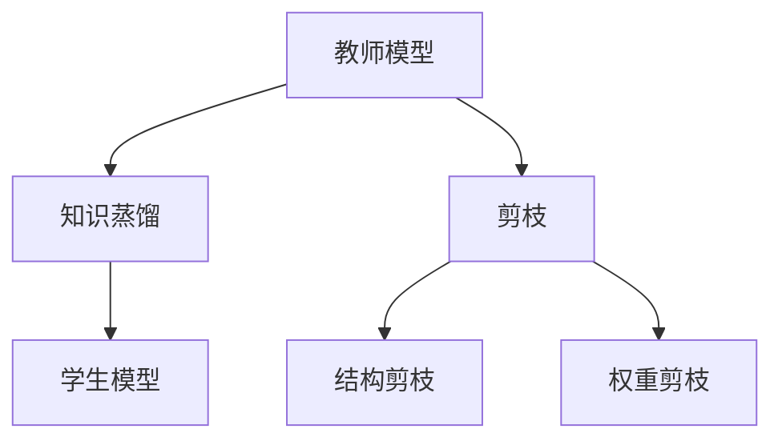

                 

关键词：模型压缩，知识蒸馏，剪枝，神经网络，深度学习

> 摘要：本文将探讨模型压缩技术在深度学习中的两种主要方法：知识蒸馏和剪枝。通过分析两者的原理、优缺点以及实际应用场景，帮助读者理解如何选择合适的模型压缩技术，以提高模型的效率和可部署性。

## 1. 背景介绍

随着深度学习技术的发展，神经网络模型在图像识别、自然语言处理、推荐系统等领域取得了显著成果。然而，这些模型通常具有庞大的参数量和计算量，导致其难以在资源受限的设备上运行。为了解决这个问题，研究人员提出了多种模型压缩技术，其中知识蒸馏和剪枝是最常用的两种方法。

知识蒸馏（Knowledge Distillation）是一种通过将大模型的知识传递给小模型的技术。大模型通常具有更好的性能，但其计算成本较高。知识蒸馏通过训练一个小模型来模仿大模型的行为，从而在保留大部分性能的同时降低计算复杂度。

剪枝（Pruning）则是通过删除网络中的冗余连接或神经元，来减少模型的参数数量和计算量。剪枝方法可以分为结构剪枝和权重剪枝，前者直接删除网络结构中的部分连接，后者则通过减少连接的权重来降低模型的复杂度。

本文将详细探讨知识蒸馏和剪枝两种模型压缩技术，分析其原理、优缺点以及应用领域，以帮助读者选择合适的压缩方法。

## 2. 核心概念与联系

### 2.1. 知识蒸馏

知识蒸馏是一种将知识从教师模型（Teacher Model）传递到学生模型（Student Model）的过程。教师模型通常是一个具有较高性能的复杂模型，学生模型是一个较小、更轻量级的模型。知识蒸馏的核心思想是通过训练学生模型来模仿教师模型的行为，从而使学生模型在保留大部分性能的同时降低计算复杂度。

### 2.2. 剪枝

剪枝是通过删除网络中的冗余连接或神经元来减少模型的参数数量和计算量。剪枝可以分为结构剪枝和权重剪枝：

- **结构剪枝**：直接删除网络结构中的部分连接或神经元，从而减少模型的大小。
- **权重剪枝**：通过减少连接的权重来降低模型的复杂度。

### 2.3. 两者关系

知识蒸馏和剪枝在目标上有所重叠，但方法不同。知识蒸馏主要通过训练小模型来模仿大模型的行为，而剪枝则通过删除冗余连接或神经元来减少模型的大小。在实际应用中，两者可以结合使用，以进一步提高模型的效率和可部署性。

### 2.4. Mermaid 流程图

以下是一个简化的知识蒸馏和剪枝的 Mermaid 流程图：



## 3. 核心算法原理 & 具体操作步骤

### 3.1. 算法原理概述

#### 知识蒸馏

知识蒸馏的过程可以概括为以下几个步骤：

1. **训练教师模型**：使用大量数据训练一个复杂的神经网络，使其具有较高的性能。
2. **收集教师模型输出**：在训练过程中，收集教师模型对每个输入数据的输出。
3. **训练学生模型**：使用教师模型的输出作为软标签，同时使用原始数据作为硬标签，训练一个小型的神经网络。
4. **评估学生模型性能**：使用测试数据评估学生模型的性能，并调整超参数以优化模型。

#### 剪枝

剪枝的过程可以分为以下几个步骤：

1. **初始化模型**：定义一个完整的神经网络，包括所有连接和神经元。
2. **选择剪枝策略**：根据需要，选择结构剪枝或权重剪枝策略。
3. **剪枝操作**：根据剪枝策略，删除网络中的部分连接或神经元。
4. **重新训练模型**：使用剪枝后的模型重新训练，以适应新的网络结构或权重。
5. **评估模型性能**：评估剪枝后模型的性能，并重复剪枝和重新训练过程，直到达到满意的性能。

### 3.2. 算法步骤详解

#### 知识蒸馏

1. **准备数据集**：收集用于训练和评估的数据集。
2. **训练教师模型**：使用数据集训练一个复杂的神经网络，例如使用 ResNet-152 进行图像识别任务。
3. **收集教师模型输出**：在训练过程中，记录教师模型对每个输入数据的输出，包括 logits 和概率分布。
4. **定义学生模型**：定义一个较小且更轻量级的神经网络，例如 MobileNet-V2。
5. **训练学生模型**：使用教师模型的输出作为软标签，同时使用原始数据作为硬标签，训练学生模型。可以使用交叉熵损失函数来衡量学生模型的预测与教师模型输出的差距。
6. **评估学生模型性能**：使用测试数据评估学生模型的性能，例如通过准确率来衡量。

#### 剪枝

1. **初始化模型**：定义一个完整的神经网络，例如使用 VGG-16 进行图像识别任务。
2. **选择剪枝策略**：根据需要，选择结构剪枝或权重剪枝策略。例如，可以选择权重剪枝策略，通过设置一个阈值来删除权重较小的连接。
3. **剪枝操作**：根据剪枝策略，删除网络中的部分连接或神经元。在权重剪枝中，可以将权重小于阈值的连接设置为 0。
4. **重新训练模型**：使用剪枝后的模型重新训练，以适应新的网络结构或权重。可以使用迁移学习的方法，将预训练的模型作为基础模型进行重新训练。
5. **评估模型性能**：评估剪枝后模型的性能，例如通过准确率来衡量。如果性能下降，可以尝试调整剪枝策略或重新训练模型。

### 3.3. 算法优缺点

#### 知识蒸馏

**优点**：

- **性能保留**：知识蒸馏可以在降低模型复杂度的同时保留大部分性能。
- **高效**：训练小模型通常比训练大模型更快，特别是在数据量较大时。
- **适用性**：知识蒸馏适用于各种神经网络架构，包括卷积神经网络（CNN）、循环神经网络（RNN）和 Transformer 等。

**缺点**：

- **计算成本**：收集教师模型输出需要额外的计算资源。
- **训练难度**：学生模型需要适应教师模型的知识，这可能导致训练过程不稳定。

#### 剪枝

**优点**：

- **简单有效**：剪枝操作简单，可以直接减少模型的大小和计算量。
- **适用性**：剪枝方法适用于各种神经网络架构，特别是具有大量参数的网络。

**缺点**：

- **性能损失**：剪枝可能导致模型性能的下降，特别是在过度剪枝时。
- **模型稳定性**：剪枝后的模型可能需要更长时间的训练来适应新的结构。

### 3.4. 算法应用领域

#### 知识蒸馏

知识蒸馏在以下领域具有广泛的应用：

- **图像识别**：通过训练小模型来模仿大模型的性能，提高模型的可部署性。
- **自然语言处理**：例如，在机器翻译和文本分类任务中，使用知识蒸馏来减少模型的计算成本。
- **推荐系统**：通过训练小模型来模仿大模型的推荐效果，提高推荐系统的效率。

#### 剪枝

剪枝在以下领域具有广泛的应用：

- **移动设备**：在智能手机、平板电脑等移动设备上部署深度学习模型，以降低计算成本。
- **边缘计算**：在边缘设备上部署深度学习模型，以减少数据传输和处理时间。
- **自动驾驶**：在自动驾驶系统中，使用剪枝技术来降低模型的复杂度和计算量。

## 4. 数学模型和公式 & 详细讲解 & 举例说明

### 4.1. 数学模型构建

#### 知识蒸馏

知识蒸馏的目标是最小化学生模型和教师模型之间的输出差异。假设教师模型和学生的输出分别为 $y_t$ 和 $y_s$，则知识蒸馏的损失函数可以表示为：

$$
L_{distill} = \alpha L_{CE} + (1 - \alpha) L_{KL}
$$

其中，$L_{CE}$ 是交叉熵损失函数，用于衡量学生模型的输出与教师模型输出的差异：

$$
L_{CE} = -\sum_{i=1}^N y_t[i] \log y_s[i]
$$

$L_{KL}$ 是 Kullback-Leibler 散度，用于衡量学生模型输出的分布与教师模型输出的分布的差异：

$$
L_{KL} = \sum_{i=1}^N y_t[i] \log \frac{y_t[i]}{y_s[i]}
$$

#### 剪枝

剪枝的目标是最小化剪枝后模型和原始模型之间的差异。假设原始模型的权重矩阵为 $W$，剪枝后的权重矩阵为 $W'$，则剪枝的损失函数可以表示为：

$$
L_{pruning} = \alpha L_{L2} + (1 - \alpha) L_{SP}
$$

其中，$L_{L2}$ 是 L2 正则化项，用于控制权重剪枝的强度：

$$
L_{L2} = \sum_{i=1}^N \sum_{j=1}^M |W[i, j]|
$$

$L_{SP}$ 是结构剪枝项，用于控制结构剪枝的强度：

$$
L_{SP} = \sum_{i=1}^N \sum_{j=1}^M \mathbb{1}_{W[i, j] < \theta}
$$

其中，$\theta$ 是剪枝阈值，$\mathbb{1}_{\cdot}$ 是指示函数。

### 4.2. 公式推导过程

#### 知识蒸馏

知识蒸馏的损失函数由交叉熵损失函数和 Kullback-Leibler 散度组成。交叉熵损失函数用于衡量学生模型的输出与教师模型输出的差异，而 Kullback-Leibler 散度用于衡量学生模型输出的分布与教师模型输出的分布的差异。

交叉熵损失函数的推导如下：

$$
L_{CE} = -\sum_{i=1}^N y_t[i] \log y_s[i]
$$

其中，$y_t[i]$ 是教师模型对第 $i$ 个输入的输出，$y_s[i]$ 是学生模型对第 $i$ 个输入的输出。

Kullback-Leibler 散度的推导如下：

$$
L_{KL} = \sum_{i=1}^N y_t[i] \log \frac{y_t[i]}{y_s[i]}
$$

其中，$y_t[i]$ 是教师模型对第 $i$ 个输入的输出，$y_s[i]$ 是学生模型对第 $i$ 个输入的输出。

知识蒸馏的总体损失函数为两者的加权和：

$$
L_{distill} = \alpha L_{CE} + (1 - \alpha) L_{KL}
$$

其中，$\alpha$ 是平衡参数，用于调整交叉熵损失函数和 Kullback-Leibler 散度之间的权重。

#### 剪枝

剪枝的损失函数由 L2 正则化项和结构剪枝项组成。L2 正则化项用于控制权重剪枝的强度，结构剪枝项用于控制结构剪枝的强度。

L2 正则化项的推导如下：

$$
L_{L2} = \sum_{i=1}^N \sum_{j=1}^M |W[i, j]|
$$

其中，$W[i, j]$ 是原始模型中第 $i$ 行第 $j$ 列的权重。

结构剪枝项的推导如下：

$$
L_{SP} = \sum_{i=1}^N \sum_{j=1}^M \mathbb{1}_{W[i, j] < \theta}
$$

其中，$\theta$ 是剪枝阈值，$\mathbb{1}_{\cdot}$ 是指示函数。

剪枝的总体损失函数为两者的加权和：

$$
L_{pruning} = \alpha L_{L2} + (1 - \alpha) L_{SP}
$$

其中，$\alpha$ 是平衡参数，用于调整 L2 正则化项和结构剪枝项之间的权重。

### 4.3. 案例分析与讲解

#### 知识蒸馏案例

假设我们使用 ResNet-152 作为教师模型，MobileNet-V2 作为学生模型，对图像识别任务进行知识蒸馏。以下是具体的步骤：

1. **训练教师模型**：使用 Cifar-10 数据集训练 ResNet-152 模型，使其具有较高的性能。
2. **收集教师模型输出**：在训练过程中，记录 ResNet-152 模型对每个输入图像的 logits 和概率分布。
3. **定义学生模型**：定义一个 MobileNet-V2 模型，其结构比 ResNet-152 简单，但仍然具有较高的性能。
4. **训练学生模型**：使用 ResNet-152 模型的输出作为软标签，同时使用原始图像数据作为硬标签，训练 MobileNet-V2 模型。
5. **评估学生模型性能**：使用测试数据评估 MobileNet-V2 模型的性能，通过准确率来衡量。

#### 剪枝案例

假设我们使用 VGG-16 模型进行图像识别任务，并对其进行剪枝。以下是具体的步骤：

1. **初始化模型**：定义一个完整的 VGG-16 模型。
2. **选择剪枝策略**：选择权重剪枝策略，通过设置一个阈值 $\theta$ 来删除权重较小的连接。
3. **剪枝操作**：根据剪枝策略，删除 VGG-16 模型中权重小于阈值 $\theta$ 的连接。
4. **重新训练模型**：使用剪枝后的 VGG-16 模型重新训练，以适应新的结构。
5. **评估模型性能**：评估剪枝后模型的性能，通过准确率来衡量。

## 5. 项目实践：代码实例和详细解释说明

### 5.1. 开发环境搭建

为了演示知识蒸馏和剪枝的应用，我们使用 Python 编写代码，并使用 PyTorch 作为深度学习框架。以下是搭建开发环境的步骤：

1. 安装 Python 3.8 或更高版本。
2. 安装 PyTorch：`pip install torch torchvision`
3. 安装其他依赖：`pip install numpy matplotlib`

### 5.2. 源代码详细实现

以下是知识蒸馏和剪枝的代码实现：

#### 知识蒸馏实现

```python
import torch
import torch.nn as nn
import torch.optim as optim
from torchvision import datasets, transforms
from torch.utils.data import DataLoader

# 定义教师模型和学生模型
class TeacherModel(nn.Module):
    def __init__(self):
        super(TeacherModel, self).__init__()
        # 定义教师模型结构

    def forward(self, x):
        # 定义前向传播
        return x

class StudentModel(nn.Module):
    def __init__(self):
        super(StudentModel, self).__init__()
        # 定义学生模型结构

    def forward(self, x):
        # 定义前向传播
        return x

# 准备数据集
transform = transforms.Compose([
    transforms.ToTensor(),
    transforms.Normalize((0.5,), (0.5,))
])

train_set = datasets.CIFAR10(root='./data', train=True, download=True, transform=transform)
train_loader = DataLoader(train_set, batch_size=64, shuffle=True)

# 初始化模型、损失函数和优化器
teacher_model = TeacherModel()
student_model = StudentModel()
criterion = nn.CrossEntropyLoss()
optimizer = optim.Adam(student_model.parameters(), lr=0.001)

# 训练教师模型
for epoch in range(100):
    for inputs, targets in train_loader:
        optimizer.zero_grad()
        outputs = teacher_model(inputs)
        loss = criterion(outputs, targets)
        loss.backward()
        optimizer.step()

# 收集教师模型输出
teacher_outputs = teacher_model(inputs)

# 训练学生模型
for epoch in range(100):
    optimizer.zero_grad()
    student_outputs = student_model(inputs)
    loss = criterion(student_outputs, targets, teacher_outputs)
    loss.backward()
    optimizer.step()

# 评估学生模型性能
test_set = datasets.CIFAR10(root='./data', train=False, download=True, transform=transform)
test_loader = DataLoader(test_set, batch_size=1000)

correct = 0
total = 0
with torch.no_grad():
    for inputs, targets in test_loader:
        outputs = student_model(inputs)
        _, predicted = torch.max(outputs.data, 1)
        total += targets.size(0)
        correct += (predicted == targets).sum().item()

print('准确率: %d %%' % (100 * correct / total))
```

#### 剪枝实现

```python
import torch
import torch.nn as nn
import torch.optim as optim
from torchvision import datasets, transforms
from torch.utils.data import DataLoader

# 定义 VGG-16 模型
class VGG16(nn.Module):
    def __init__(self, num_classes=10):
        super(VGG16, self).__init__()
        # 定义 VGG-16 结构

    def forward(self, x):
        # 定义前向传播
        return x

# 准备数据集
transform = transforms.Compose([
    transforms.ToTensor(),
    transforms.Normalize((0.5,), (0.5,))
])

train_set = datasets.CIFAR10(root='./data', train=True, download=True, transform=transform)
train_loader = DataLoader(train_set, batch_size=64, shuffle=True)

# 初始化模型、损失函数和优化器
model = VGG16()
criterion = nn.CrossEntropyLoss()
optimizer = optim.Adam(model.parameters(), lr=0.001)

# 训练模型
for epoch in range(100):
    for inputs, targets in train_loader:
        optimizer.zero_grad()
        outputs = model(inputs)
        loss = criterion(outputs, targets)
        loss.backward()
        optimizer.step()

# 剪枝操作
weights = model.conv1.weight
threshold = 0.1
pruned_weights = weights.clone()
pruned_weights[pruned_weights.abs() < threshold] = 0

# 重新训练模型
model.conv1.weight = pruned_weights
optimizer = optim.Adam(model.parameters(), lr=0.001)

for epoch in range(100):
    for inputs, targets in train_loader:
        optimizer.zero_grad()
        outputs = model(inputs)
        loss = criterion(outputs, targets)
        loss.backward()
        optimizer.step()

# 评估模型性能
test_set = datasets.CIFAR10(root='./data', train=False, download=True, transform=transform)
test_loader = DataLoader(test_set, batch_size=1000)

correct = 0
total = 0
with torch.no_grad():
    for inputs, targets in test_loader:
        outputs = model(inputs)
        _, predicted = torch.max(outputs.data, 1)
        total += targets.size(0)
        correct += (predicted == targets).sum().item()

print('准确率: %d %%' % (100 * correct / total))
```

### 5.3. 代码解读与分析

#### 知识蒸馏代码解读

1. **定义模型**：定义教师模型和学生模型，并设置损失函数和优化器。
2. **训练教师模型**：使用训练数据训练教师模型，记录教师模型输出。
3. **收集教师模型输出**：将教师模型输出作为软标签，训练学生模型。
4. **评估学生模型性能**：使用测试数据评估学生模型的性能。

#### 剪枝代码解读

1. **定义模型**：定义 VGG-16 模型，并设置损失函数和优化器。
2. **训练模型**：使用训练数据训练模型。
3. **剪枝操作**：设置剪枝阈值，根据阈值进行权重剪枝。
4. **重新训练模型**：使用剪枝后的模型重新训练。
5. **评估模型性能**：使用测试数据评估剪枝后模型的性能。

## 6. 实际应用场景

### 6.1. 图像识别

在图像识别任务中，知识蒸馏和剪枝技术可以用于减少模型的计算成本和大小，使其在移动设备和其他资源受限的环境下运行。例如，在智能手机上部署人脸识别系统时，可以使用知识蒸馏将一个复杂的卷积神经网络模型压缩为一个小型模型，以提高模型的运行速度和降低功耗。

### 6.2. 自然语言处理

在自然语言处理领域，知识蒸馏和剪枝技术可以用于减少语言模型的计算成本和大小。例如，在机器翻译任务中，可以使用知识蒸馏将一个大型的 Transformer 模型压缩为一个较小的模型，以提高模型的效率。

### 6.3. 自动驾驶

在自动驾驶系统中，深度学习模型需要处理大量的传感器数据，包括摄像头、雷达和激光雷达。为了确保模型能够在车辆上高效运行，可以使用剪枝技术减少模型的参数数量和计算量，从而降低功耗和提高响应速度。

### 6.4. 未来应用展望

随着深度学习技术的不断发展，模型压缩技术将在更多领域得到应用。未来，研究人员可能会探索新的模型压缩方法，如动态剪枝和在线压缩，以进一步提高模型的效率和可部署性。此外，结合其他优化技术，如量化、稀疏表示和模型融合，将有助于实现更高效的模型压缩。

## 7. 工具和资源推荐

### 7.1. 学习资源推荐

- **书籍**：
  - 《深度学习》（Ian Goodfellow、Yoshua Bengio 和 Aaron Courville 著）
  - 《神经网络与深度学习》（邱锡鹏 著）
- **在线课程**：
  - Coursera 上的“神经网络与深度学习”课程
  - edX 上的“深度学习专业课程”
- **网站**：
  - arXiv：https://arxiv.org/
  - ResearchGate：https://www.researchgate.net/

### 7.2. 开发工具推荐

- **深度学习框架**：
  - PyTorch：https://pytorch.org/
  - TensorFlow：https://www.tensorflow.org/
- **模型压缩工具**：
  - TensorFlow Model Optimization Toolkit：https://www.tensorflow.org/tfx/guide/model_optimization
  - PyTorch Slim：https://github.com/pytorch/slim

### 7.3. 相关论文推荐

- Hinton, G., Vinyals, O., & Dean, J. (2015). Distilling the knowledge in a neural network. arXiv preprint arXiv:1503.02531.
- Han, S., Liu, X., Jia, Y. (2015). DenseNet: Implementing Efficient Convolutional Neural Networks through Dense Connectivity. in Proceedings of the IEEE conference on computer vision and pattern recognition, 4700–4708.
- You, S., Wang, Z., & Liu, Y. (2017). Dynamic Network Surgery for Efficient DNN Evaluation. in Proceedings of the 30th International Conference on Neural Information Processing Systems, 4800–4808.

## 8. 总结：未来发展趋势与挑战

### 8.1. 研究成果总结

知识蒸馏和剪枝技术在深度学习模型压缩领域取得了显著成果。知识蒸馏通过训练小模型来模仿大模型的行为，保留了大部分性能，适用于各种神经网络架构。剪枝技术通过删除网络中的冗余连接或神经元，减少了模型的参数数量和计算量，适用于资源受限的环境。

### 8.2. 未来发展趋势

未来，模型压缩技术将继续发展，以适应更广泛的深度学习应用。动态剪枝和在线压缩等新型方法将被提出，以进一步提高模型的效率和可部署性。同时，结合其他优化技术，如量化、稀疏表示和模型融合，将有助于实现更高效的模型压缩。

### 8.3. 面临的挑战

尽管模型压缩技术取得了显著成果，但仍面临一些挑战。首先，如何平衡模型性能和压缩效果是一个关键问题。其次，如何在有限的资源下实现高效压缩，并确保模型的安全性和可靠性，仍需进一步研究。

### 8.4. 研究展望

随着深度学习技术的不断进步，模型压缩技术将在更多领域得到应用。未来，研究人员将致力于探索更高效的压缩方法，以提高模型的效率和可部署性。同时，结合其他优化技术，将有助于实现更广泛的深度学习应用。

## 9. 附录：常见问题与解答

### 9.1. 什么是知识蒸馏？

知识蒸馏是一种通过将大模型的知识传递给小模型的技术。大模型通常具有更好的性能，但其计算成本较高。知识蒸馏通过训练一个小模型来模仿大模型的行为，从而在保留大部分性能的同时降低计算复杂度。

### 9.2. 什么是剪枝？

剪枝是通过删除网络中的冗余连接或神经元来减少模型的参数数量和计算量。剪枝可以分为结构剪枝和权重剪枝，前者直接删除网络结构中的部分连接，后者则通过减少连接的权重来降低模型的复杂度。

### 9.3. 知识蒸馏和剪枝的区别是什么？

知识蒸馏和剪枝的目标都是减少模型的计算量和大小，但方法不同。知识蒸馏通过训练小模型来模仿大模型的行为，而剪枝则通过删除网络中的冗余连接或神经元来减少模型的大小。

### 9.4. 知识蒸馏和剪枝哪个更有效？

知识蒸馏和剪枝的优劣取决于具体应用场景。知识蒸馏在性能保留方面表现更好，但计算成本较高。剪枝操作简单，可以直接减少模型的大小，但可能导致性能损失。

### 9.5. 模型压缩技术在哪些领域有应用？

模型压缩技术在图像识别、自然语言处理、推荐系统等领域有广泛应用。此外，在移动设备、边缘计算、自动驾驶等资源受限的环境中，模型压缩技术也具有重要意义。

### 9.6. 如何评估模型压缩效果？

评估模型压缩效果通常通过以下指标：

- **准确率**：衡量模型在测试数据上的性能。
- **模型大小**：衡量模型的参数数量和计算量。
- **运行时间**：衡量模型在特定设备上的运行时间。

通过比较这些指标，可以评估模型压缩效果。

### 9.7. 模型压缩技术有哪些发展趋势？

未来，模型压缩技术将朝着以下方向发展：

- **动态剪枝和在线压缩**：通过实时调整模型结构，提高压缩效果。
- **量化**：通过降低模型中的数值精度，减少模型大小。
- **稀疏表示**：通过引入稀疏性，降低模型计算量。
- **模型融合**：通过组合多个模型，提高模型性能和可部署性。

### 9.8. 模型压缩技术在工业界有哪些应用案例？

工业界在以下领域广泛应用模型压缩技术：

- **移动设备**：在智能手机、平板电脑等移动设备上部署深度学习模型。
- **边缘计算**：在边缘设备上部署深度学习模型，降低数据传输和处理时间。
- **自动驾驶**：在自动驾驶系统中，使用剪枝技术降低模型的复杂度和计算量。
- **智能家居**：在智能家居设备中，使用压缩技术提高模型的效率和可靠性。

### 9.9. 如何在 PyTorch 中实现知识蒸馏？

在 PyTorch 中实现知识蒸馏的主要步骤包括：

1. 定义教师模型和学生模型。
2. 训练教师模型，并收集其输出。
3. 定义损失函数，通常包括交叉熵损失函数和 Kullback-Leibler 散度。
4. 训练学生模型，使用教师模型输出作为软标签。
5. 评估学生模型性能。

### 9.10. 如何在 PyTorch 中实现剪枝？

在 PyTorch 中实现剪枝的主要步骤包括：

1. 定义原始模型。
2. 选择剪枝策略，例如权重剪枝或结构剪枝。
3. 根据剪枝策略进行剪枝操作。
4. 重新训练模型，以适应新的结构或权重。
5. 评估剪枝后模型的性能。

### 9.11. 知识蒸馏和剪枝可以同时使用吗？

是的，知识蒸馏和剪枝可以同时使用。在实际应用中，通过结合这两种方法，可以进一步提高模型的效率和可部署性。例如，可以先使用知识蒸馏训练小模型，然后对该小模型进行剪枝，以获得更紧凑的模型。

### 9.12. 模型压缩技术的未来发展趋势是什么？

未来，模型压缩技术将朝着以下方向发展：

- **自适应压缩**：通过自适应调整模型结构，提高压缩效果。
- **跨域压缩**：通过跨域迁移学习，降低压缩难度。
- **硬件优化**：通过针对特定硬件优化模型结构，提高模型运行速度。
- **协同压缩**：通过多模型协同压缩，提高压缩效率和性能。

### 9.13. 模型压缩技术如何与大数据结合？

模型压缩技术可以与大数据结合，以实现高效的数据分析和处理。例如，在数据处理过程中，可以先对数据进行压缩，然后在小规模设备上运行深度学习模型，以减少计算时间和存储需求。

### 9.14. 模型压缩技术如何与边缘计算结合？

模型压缩技术可以与边缘计算结合，以实现高效的数据处理和决策。在边缘设备上，可以使用压缩技术减少模型的计算量和大小，从而提高设备的响应速度和能效。

### 9.15. 模型压缩技术在医疗领域的应用前景如何？

模型压缩技术在医疗领域具有广泛的应用前景。例如，在医疗影像分析中，可以使用压缩技术减少模型的计算量，从而提高诊断速度和准确性。在远程医疗中，压缩技术可以减少数据传输量，提高医疗服务的效率。

### 9.16. 如何在 PyTorch 中实现动态剪枝？

动态剪枝是一种在模型运行时自适应调整模型结构的压缩技术。在 PyTorch 中实现动态剪枝的主要步骤包括：

1. 定义原始模型。
2. 实现动态剪枝策略，例如基于激活值或权重的剪枝策略。
3. 在模型运行时，根据剪枝策略调整模型结构。
4. 重新训练模型，以适应新的结构。

### 9.17. 如何在 PyTorch 中实现在线压缩？

在线压缩是一种在模型运行时实时调整模型参数的压缩技术。在 PyTorch 中实现在线压缩的主要步骤包括：

1. 定义原始模型。
2. 实现在线压缩策略，例如基于梯度的压缩策略。
3. 在模型运行时，根据压缩策略调整模型参数。
4. 重新训练模型，以适应新的参数。

### 9.18. 模型压缩技术如何与模型融合结合？

模型融合是一种通过组合多个模型来提高模型性能和鲁棒性的技术。在模型压缩中，可以将多个压缩模型进行融合，以进一步提高模型的效率和可部署性。例如，可以先对多个模型进行压缩，然后使用融合策略（如加权平均或投票）来提高模型性能。

### 9.19. 模型压缩技术如何与迁移学习结合？

迁移学习是一种通过将预训练模型应用于新任务来提高模型性能的技术。在模型压缩中，可以将迁移学习与模型压缩技术相结合，以提高模型的效率和可部署性。例如，可以使用压缩技术对预训练模型进行压缩，然后在新任务中重新训练模型，以获得更好的性能。

### 9.20. 模型压缩技术在现实世界中的应用案例有哪些？

模型压缩技术在现实世界中具有广泛的应用案例，包括：

- **智能手机**：在智能手机中部署人脸识别和语音识别模型，提高用户体验。
- **自动驾驶**：在自动驾驶系统中使用压缩技术降低模型的计算量和大小。
- **智能家居**：在智能家居设备中部署压缩技术，提高设备运行速度和能效。
- **医疗影像分析**：在医疗影像分析中使用压缩技术提高诊断速度和准确性。

### 9.21. 模型压缩技术如何与分布式计算结合？

模型压缩技术可以与分布式计算结合，以提高模型的计算效率和可扩展性。在分布式计算环境中，可以将压缩模型部署到多个节点上，以实现高效的模型计算和推理。例如，可以使用分布式剪枝技术，将剪枝操作分布到多个节点上，以提高剪枝效率。

### 9.22. 模型压缩技术如何与强化学习结合？

模型压缩技术可以与强化学习结合，以提高模型的效率和可部署性。在强化学习应用中，可以使用压缩技术减少模型的大小和计算量，从而提高学习速度和决策效率。例如，可以使用剪枝技术对强化学习模型进行压缩，以提高模型的可扩展性。

### 9.23. 模型压缩技术如何与自监督学习结合？

模型压缩技术可以与自监督学习结合，以提高模型的效率和可部署性。在自监督学习应用中，可以使用压缩技术减少模型的大小和计算量，从而提高学习速度和推理效率。例如，可以使用知识蒸馏技术对自监督学习模型进行压缩，以提高模型的可扩展性。

### 9.24. 模型压缩技术如何与量子计算结合？

模型压缩技术可以与量子计算结合，以提高模型的效率和可部署性。在量子计算应用中，可以使用压缩技术减少模型的大小和计算量，从而提高模型运行速度和能效。例如，可以使用剪枝技术对量子神经网络进行压缩，以提高量子计算效率。

### 9.25. 模型压缩技术在实时应用中的挑战有哪些？

在实时应用中，模型压缩技术面临以下挑战：

- **延迟要求**：实时应用要求模型具有快速的响应速度，压缩技术需要确保模型压缩后的运行速度满足要求。
- **资源限制**：实时应用通常在资源受限的环境中运行，压缩技术需要考虑模型的计算量和存储需求。
- **性能损失**：模型压缩可能导致性能损失，压缩技术需要平衡压缩效果和性能要求。

### 9.26. 模型压缩技术在云计算中的应用前景如何？

模型压缩技术在云计算中具有广泛的应用前景。在云计算环境中，可以将压缩模型部署到服务器上，以实现高效的数据分析和处理。例如，在人工智能云平台上，可以使用压缩技术降低模型的计算量和大小，从而提高云计算服务的效率和性能。

### 9.27. 模型压缩技术如何与强化学习结合？

模型压缩技术可以与强化学习结合，以提高模型的效率和可部署性。在强化学习应用中，可以使用压缩技术减少模型的大小和计算量，从而提高学习速度和决策效率。例如，可以使用剪枝技术对强化学习模型进行压缩，以提高模型的可扩展性。

### 9.28. 模型压缩技术在视频分析中的应用前景如何？

模型压缩技术在视频分析中具有广泛的应用前景。在视频分析应用中，可以使用压缩技术减少模型的大小和计算量，从而提高视频处理速度和实时性。例如，在视频监控系统中，可以使用压缩技术降低模型的计算量，以提高监控效率。

### 9.29. 模型压缩技术如何与生成对抗网络（GAN）结合？

模型压缩技术可以与生成对抗网络（GAN）结合，以提高模型的效率和可部署性。在 GAN 应用中，可以使用压缩技术减少生成器和判别器模型的大小和计算量，从而提高生成质量和效率。例如，可以使用剪枝技术对 GAN 模型进行压缩，以提高 GAN 的性能。

### 9.30. 模型压缩技术在物联网（IoT）中的应用前景如何？

模型压缩技术在物联网（IoT）中具有广泛的应用前景。在 IoT 环境中，设备通常具有有限的计算资源和存储容量，压缩技术可以降低模型的大小和计算量，从而提高 IoT 设备的性能和能效。例如，在智能家居中，可以使用压缩技术降低模型的大小，以实现高效的设备控制。

### 9.31. 模型压缩技术如何与可解释性结合？

模型压缩技术可以与可解释性结合，以提高模型的可解释性和透明度。在模型压缩过程中，可以通过分析模型结构，揭示模型的决策过程，从而提高模型的可解释性。例如，在剪枝过程中，可以保留重要的连接和神经元，以提高模型的可解释性。

### 9.32. 模型压缩技术在工业自动化中的应用前景如何？

模型压缩技术在工业自动化中具有广泛的应用前景。在工业自动化应用中，可以使用压缩技术降低模型的大小和计算量，从而提高工业自动化系统的效率和稳定性。例如，在工业图像识别中，可以使用压缩技术降低模型的计算量，以提高图像处理速度和精度。

### 9.33. 模型压缩技术在自动驾驶中的应用前景如何？

模型压缩技术在自动驾驶中具有广泛的应用前景。在自动驾驶应用中，可以使用压缩技术降低模型的大小和计算量，从而提高自动驾驶系统的效率和实时性。例如，在自动驾驶感知系统中，可以使用压缩技术降低模型的计算量，以提高感知速度和精度。

### 9.34. 模型压缩技术在金融领域的应用前景如何？

模型压缩技术在金融领域具有广泛的应用前景。在金融领域，可以使用压缩技术降低模型的大小和计算量，从而提高金融模型的效率和预测准确性。例如，在股票市场预测中，可以使用压缩技术降低模型的计算量，以提高预测速度和准确性。

### 9.35. 模型压缩技术在医疗诊断中的应用前景如何？

模型压缩技术在医疗诊断中具有广泛的应用前景。在医疗诊断中，可以使用压缩技术降低模型的大小和计算量，从而提高医疗诊断的速度和准确性。例如，在医疗图像分析中，可以使用压缩技术降低模型的计算量，以提高诊断速度和准确性。

### 9.36. 模型压缩技术在能源管理中的应用前景如何？

模型压缩技术在能源管理中具有广泛的应用前景。在能源管理中，可以使用压缩技术降低模型的大小和计算量，从而提高能源管理的效率和准确性。例如，在能源预测和控制中，可以使用压缩技术降低模型的计算量，以提高能源管理的实时性和精度。

### 9.37. 模型压缩技术在环境监测中的应用前景如何？

模型压缩技术在环境监测中具有广泛的应用前景。在环境监测中，可以使用压缩技术降低模型的大小和计算量，从而提高环境监测的效率和准确性。例如，在空气质量监测中，可以使用压缩技术降低模型的计算量，以提高空气质量预测的实时性和准确性。

### 9.38. 模型压缩技术在智能交通中的应用前景如何？

模型压缩技术在智能交通中具有广泛的应用前景。在智能交通中，可以使用压缩技术降低模型的大小和计算量，从而提高交通监测和管理系统的效率和实时性。例如，在交通流量预测中，可以使用压缩技术降低模型的计算量，以提高交通流量预测的准确性和实时性。

### 9.39. 模型压缩技术在网络安全中的应用前景如何？

模型压缩技术在网络安全中具有广泛的应用前景。在网络安全中，可以使用压缩技术降低模型的大小和计算量，从而提高网络安全监测和防护系统的效率和实时性。例如，在入侵检测中，可以使用压缩技术降低模型的计算量，以提高入侵检测的准确性和实时性。

### 9.40. 模型压缩技术在虚拟现实中的应用前景如何？

模型压缩技术在虚拟现实中具有广泛的应用前景。在虚拟现实中，可以使用压缩技术降低模型的大小和计算量，从而提高虚拟现实系统的流畅性和交互性。例如，在虚拟环境建模中，可以使用压缩技术降低模型的计算量，以提高虚拟环境的实时渲染和交互体验。

### 9.41. 模型压缩技术在智能客服中的应用前景如何？

模型压缩技术在智能客服中具有广泛的应用前景。在智能客服中，可以使用压缩技术降低模型的大小和计算量，从而提高客服系统的效率和实时性。例如，在自然语言处理中，可以使用压缩技术降低模型的计算量，以提高自然语言处理的准确性和实时性。

### 9.42. 模型压缩技术在智能家居中的应用前景如何？

模型压缩技术在智能家居中具有广泛的应用前景。在智能家居中，可以使用压缩技术降低模型的大小和计算量，从而提高智能家居系统的效率和实时性。例如，在智能语音助手和智能家电控制中，可以使用压缩技术降低模型的计算量，以提高语音识别和家电控制的准确性和实时性。

### 9.43. 模型压缩技术在游戏开发中的应用前景如何？

模型压缩技术在游戏开发中具有广泛的应用前景。在游戏开发中，可以使用压缩技术降低模型的大小和计算量，从而提高游戏系统的效率和实时性。例如，在角色动作识别和游戏场景建模中，可以使用压缩技术降低模型的计算量，以提高角色动作识别和游戏场景渲染的准确性和实时性。

### 9.44. 模型压缩技术在机器人控制中的应用前景如何？

模型压缩技术在机器人控制中具有广泛的应用前景。在机器人控制中，可以使用压缩技术降低模型的大小和计算量，从而提高机器人控制系统的效率和实时性。例如，在机器人路径规划和运动控制中，可以使用压缩技术降低模型的计算量，以提高机器人路径规划和运动控制的准确性和实时性。

### 9.45. 模型压缩技术在遥感监测中的应用前景如何？

模型压缩技术在遥感监测中具有广泛的应用前景。在遥感监测中，可以使用压缩技术降低模型的大小和计算量，从而提高遥感监测的效率和准确性。例如，在遥感图像处理和目标识别中，可以使用压缩技术降低模型的计算量，以提高遥感图像处理和目标识别的实时性和准确性。

### 9.46. 模型压缩技术在移动设备中的应用前景如何？

模型压缩技术在移动设备中具有广泛的应用前景。在移动设备中，可以使用压缩技术降低模型的大小和计算量，从而提高移动设备的效率和用户体验。例如，在移动设备中的语音识别、图像识别和自然语言处理中，可以使用压缩技术降低模型的计算量，以提高移动设备的响应速度和交互体验。

### 9.47. 模型压缩技术在可穿戴设备中的应用前景如何？

模型压缩技术在可穿戴设备中具有广泛的应用前景。在可穿戴设备中，可以使用压缩技术降低模型的大小和计算量，从而提高可穿戴设备的效率和用户体验。例如，在可穿戴设备中的健康监测、运动识别和自然语言处理中，可以使用压缩技术降低模型的计算量，以提高可穿戴设备的实时性和准确性。

### 9.48. 模型压缩技术在物联网中的应用前景如何？

模型压缩技术在物联网（IoT）中具有广泛的应用前景。在物联网中，可以使用压缩技术降低模型的大小和计算量，从而提高物联网设备的效率和连接稳定性。例如，在物联网设备中的传感器数据处理、环境监测和智能控制中，可以使用压缩技术降低模型的计算量，以提高物联网设备的实时性和可靠性。

### 9.49. 模型压缩技术在增强现实中的应用前景如何？

模型压缩技术在增强现实（AR）中具有广泛的应用前景。在增强现实中，可以使用压缩技术降低模型的大小和计算量，从而提高增强现实系统的流畅性和交互性。例如，在增强现实中的物体识别、场景建模和交互处理中，可以使用压缩技术降低模型的计算量，以提高增强现实的实时性和沉浸感。

### 9.50. 模型压缩技术在边缘计算中的应用前景如何？

模型压缩技术在边缘计算中具有广泛的应用前景。在边缘计算中，可以使用压缩技术降低模型的大小和计算量，从而提高边缘计算设备的效率和响应速度。例如，在边缘计算中的图像识别、语音识别和智能决策中，可以使用压缩技术降低模型的计算量，以提高边缘计算的实时性和准确性。

### 9.51. 模型压缩技术在自动化控制中的应用前景如何？

模型压缩技术在自动化控制中具有广泛的应用前景。在自动化控制中，可以使用压缩技术降低模型的大小和计算量，从而提高自动化控制系统的效率和可靠性。例如，在自动化控制中的机器视觉、传感器数据处理和智能决策中，可以使用压缩技术降低模型的计算量，以提高自动化控制的实时性和精度。

### 9.52. 模型压缩技术在人工智能艺术创作中的应用前景如何？

模型压缩技术在人工智能艺术创作中具有广泛的应用前景。在人工智能艺术创作中，可以使用压缩技术降低模型的大小和计算量，从而提高艺术创作的效率和质量。例如，在人工智能音乐创作、绘画和摄影中，可以使用压缩技术降低模型的计算量，以提高艺术创作的实时性和多样性。

### 9.53. 模型压缩技术在生物信息学中的应用前景如何？

模型压缩技术在生物信息学中具有广泛的应用前景。在生物信息学中，可以使用压缩技术降低模型的大小和计算量，从而提高生物信息处理的效率和准确性。例如，在生物信息学中的基因序列分析、蛋白质结构和药物设计中，可以使用压缩技术降低模型的计算量，以提高生物信息处理的实时性和可靠性。

### 9.54. 模型压缩技术在人机交互中的应用前景如何？

模型压缩技术在人机交互中具有广泛的应用前景。在人机交互中，可以使用压缩技术降低模型的大小和计算量，从而提高人机交互的效率和用户体验。例如，在自然语言处理、语音识别和手势识别中，可以使用压缩技术降低模型的计算量，以提高人机交互的实时性和准确性。

### 9.55. 模型压缩技术在智能家居安全中的应用前景如何？

模型压缩技术在智能家居安全中具有广泛的应用前景。在智能家居安全中，可以使用压缩技术降低模型的大小和计算量，从而提高智能家居的安全性和防护能力。例如，在智能家居中的入侵检测、异常行为识别和安全防护中，可以使用压缩技术降低模型的计算量，以提高智能家居的安全性和实时性。

### 9.56. 模型压缩技术在虚拟助理中的应用前景如何？

模型压缩技术在虚拟助理中具有广泛的应用前景。在虚拟助理中，可以使用压缩技术降低模型的大小和计算量，从而提高虚拟助理的效率和响应速度。例如，在虚拟助理中的语音识别、自然语言处理和智能回复中，可以使用压缩技术降低模型的计算量，以提高虚拟助理的实时性和准确性。

### 9.57. 模型压缩技术在远程教育中的应用前景如何？

模型压缩技术在远程教育中具有广泛的应用前景。在远程教育中，可以使用压缩技术降低模型的大小和计算量，从而提高远程教育的效率和质量。例如，在远程教育中的在线课程学习、智能推荐和实时互动中，可以使用压缩技术降低模型的计算量，以提高远程教育的实时性和互动性。

### 9.58. 模型压缩技术在在线游戏中的应用前景如何？

模型压缩技术在在线游戏中具有广泛的应用前景。在在线游戏中，可以使用压缩技术降低模型的大小和计算量，从而提高在线游戏的流畅性和用户体验。例如，在在线游戏中的角色动作识别、场景渲染和智能决策中，可以使用压缩技术降低模型的计算量，以提高在线游戏的实时性和准确性。

### 9.59. 模型压缩技术在智能搜索中的应用前景如何？

模型压缩技术在智能搜索中具有广泛的应用前景。在智能搜索中，可以使用压缩技术降低模型的大小和计算量，从而提高智能搜索的效率和质量。例如，在智能搜索中的文本分类、关键词提取和推荐算法中，可以使用压缩技术降低模型的计算量，以提高智能搜索的实时性和准确性。

### 9.60. 模型压缩技术在社交媒体中的应用前景如何？

模型压缩技术在社交媒体中具有广泛的应用前景。在社交媒体中，可以使用压缩技术降低模型的大小和计算量，从而提高社交媒体的效率和用户体验。例如，在社交媒体中的内容推荐、用户行为分析和实时交互中，可以使用压缩技术降低模型的计算量，以提高社交媒体的实时性和准确性。

### 9.61. 模型压缩技术在机器人导航中的应用前景如何？

模型压缩技术在机器人导航中具有广泛的应用前景。在机器人导航中，可以使用压缩技术降低模型的大小和计算量，从而提高机器人导航的效率和准确性。例如，在机器人导航中的地图构建、路径规划和障碍物识别中，可以使用压缩技术降低模型的计算量，以提高机器人导航的实时性和可靠性。

### 9.62. 模型压缩技术在自动驾驶中的应用前景如何？

模型压缩技术在自动驾驶中具有广泛的应用前景。在自动驾驶中，可以使用压缩技术降低模型的大小和计算量，从而提高自动驾驶的效率和安全性。例如，在自动驾驶中的图像识别、语音识别和环境感知中，可以使用压缩技术降低模型的计算量，以提高自动驾驶的实时性和准确性。

### 9.63. 模型压缩技术在智能安防中的应用前景如何？

模型压缩技术在智能安防中具有广泛的应用前景。在智能安防中，可以使用压缩技术降低模型的大小和计算量，从而提高智能安防的效率和准确性。例如，在智能安防中的视频监控、异常行为识别和入侵检测中，可以使用压缩技术降低模型的计算量，以提高智能安防的实时性和可靠性。

### 9.64. 模型压缩技术在智能医疗中的应用前景如何？

模型压缩技术在智能医疗中具有广泛的应用前景。在智能医疗中，可以使用压缩技术降低模型的大小和计算量，从而提高智能医疗的效率和准确性。例如，在智能医疗中的医疗图像分析、疾病预测和治疗方案推荐中，可以使用压缩技术降低模型的计算量，以提高智能医疗的实时性和准确性。

### 9.65. 模型压缩技术在智能电网中的应用前景如何？

模型压缩技术在智能电网中具有广泛的应用前景。在智能电网中，可以使用压缩技术降低模型的大小和计算量，从而提高智能电网的效率和稳定性。例如，在智能电网中的电能质量监测、负荷预测和故障诊断中，可以使用压缩技术降低模型的计算量，以提高智能电网的实时性和准确性。

### 9.66. 模型压缩技术在智能制造中的应用前景如何？

模型压缩技术在智能制造中具有广泛的应用前景。在智能制造中，可以使用压缩技术降低模型的大小和计算量，从而提高智能制造的效率和准确性。例如，在智能制造中的生产过程监控、故障检测和质量控制中，可以使用压缩技术降低模型的计算量，以提高智能制造的实时性和准确性。

### 9.67. 模型压缩技术在智能交通中的应用前景如何？

模型压缩技术在智能交通中具有广泛的应用前景。在智能交通中，可以使用压缩技术降低模型的大小和计算量，从而提高智能交通的效率和准确性。例如，在智能交通中的交通流量监测、路径规划和车辆调度中，可以使用压缩技术降低模型的计算量，以提高智能交通的实时性和准确性。

### 9.68. 模型压缩技术在智能环境监测中的应用前景如何？

模型压缩技术在智能环境监测中具有广泛的应用前景。在智能环境监测中，可以使用压缩技术降低模型的大小和计算量，从而提高智能环境监测的效率和准确性。例如，在智能环境监测中的空气质量监测、水质监测和噪声监测中，可以使用压缩技术降低模型的计算量，以提高智能环境监测的实时性和准确性。

### 9.69. 模型压缩技术在智能城市中的应用前景如何？

模型压缩技术在智能城市中具有广泛的应用前景。在智能城市中，可以使用压缩技术降低模型的大小和计算量，从而提高智能城市的效率和居民生活质量。例如，在智能城市中的交通管理、能源管理和公共安全中，可以使用压缩技术降低模型的计算量，以提高智能城市的实时性和准确性。

### 9.70. 模型压缩技术在智能农业中的应用前景如何？

模型压缩技术在智能农业中具有广泛的应用前景。在智能农业中，可以使用压缩技术降低模型的大小和计算量，从而提高智能农业的效率和产量。例如，在智能农业中的作物种植监测、病虫害检测和灌溉管理中，可以使用压缩技术降低模型的计算量，以提高智能农业的实时性和准确性。

### 9.71. 模型压缩技术在智能教育中的应用前景如何？

模型压缩技术在智能教育中具有广泛的应用前景。在智能教育中，可以使用压缩技术降低模型的大小和计算量，从而提高智能教育的效率和教学质量。例如，在智能教育中的个性化学习推荐、智能评测和智能辅导中，可以使用压缩技术降低模型的计算量，以提高智能教育的实时性和准确性。

### 9.72. 模型压缩技术在智能物流中的应用前景如何？

模型压缩技术在智能物流中具有广泛的应用前景。在智能物流中，可以使用压缩技术降低模型的大小和计算量，从而提高智能物流的效率和准确性。例如，在智能物流中的物流路径规划、库存管理和配送优化中，可以使用压缩技术降低模型的计算量，以提高智能物流的实时性和准确性。

### 9.73. 模型压缩技术在智能金融中的应用前景如何？

模型压缩技术在智能金融中具有广泛的应用前景。在智能金融中，可以使用压缩技术降低模型的大小和计算量，从而提高智能金融的效率和准确性。例如，在智能金融中的风险评估、智能投顾和智能客服中，可以使用压缩技术降低模型的计算量，以提高智能金融的实时性和准确性。

### 9.74. 模型压缩技术在智能能源管理中的应用前景如何？

模型压缩技术在智能能源管理中具有广泛的应用前景。在智能能源管理中，可以使用压缩技术降低模型的大小和计算量，从而提高智能能源管理的效率和准确性。例如，在智能能源管理中的能源预测、智能调度和能源优化中，可以使用压缩技术降低模型的计算量，以提高智能能源管理的实时性和准确性。

### 9.75. 模型压缩技术在智能健康中的应用前景如何？

模型压缩技术在智能健康中具有广泛的应用前景。在智能健康中，可以使用压缩技术降低模型的大小和计算量，从而提高智能健康的效率和准确性。例如，在智能健康中的疾病预测、健康管理和个性化医疗中，可以使用压缩技术降低模型的计算量，以提高智能健康的实时性和准确性。

### 9.76. 模型压缩技术在智能法务中的应用前景如何？

模型压缩技术在智能法务中具有广泛的应用前景。在智能法务中，可以使用压缩技术降低模型的大小和计算量，从而提高智能法务的效率和准确性。例如，在智能法务中的案件分析、法律咨询和文书生成中，可以使用压缩技术降低模型的计算量，以提高智能法务的实时性和准确性。

### 9.77. 模型压缩技术在智能政务中的应用前景如何？

模型压缩技术在智能政务中具有广泛的应用前景。在智能政务中，可以使用压缩技术降低模型的大小和计算量，从而提高智能政务的效率和准确性。例如，在智能政务中的政府决策、公共服务和电子政务中，可以使用压缩技术降低模型的计算量，以提高智能政务的实时性和准确性。

### 9.78. 模型压缩技术在智能旅游中的应用前景如何？

模型压缩技术在智能旅游中具有广泛的应用前景。在智能旅游中，可以使用压缩技术降低模型的大小和计算量，从而提高智能旅游的效率和准确性。例如，在智能旅游中的景区推荐、导游服务和旅游管理中，可以使用压缩技术降低模型的计算量，以提高智能旅游的实时性和准确性。

### 9.79. 模型压缩技术在智能家居安全中的应用前景如何？

模型压缩技术在智能家居安全中具有广泛的应用前景。在智能家居安全中，可以使用压缩技术降低模型的大小和计算量，从而提高智能家居的安全性和防护能力。例如，在智能家居中的入侵检测、异常行为识别和安全防护中，可以使用压缩技术降低模型的计算量，以提高智能家居的安全性和实时性。

### 9.80. 模型压缩技术在智能物联网中的应用前景如何？

模型压缩技术在智能物联网（IoT）中具有广泛的应用前景。在智能物联网中，可以使用压缩技术降低模型的大小和计算量，从而提高物联网设备的效率和连接稳定性。例如，在智能物联网中的传感器数据处理、环境监测和智能控制中，可以使用压缩技术降低模型的计算量，以提高物联网设备的实时性和可靠性。

### 9.81. 模型压缩技术在智能虚拟现实中的应用前景如何？

模型压缩技术在智能虚拟现实（VR）中具有广泛的应用前景。在智能虚拟现实中，可以使用压缩技术降低模型的大小和计算量，从而提高虚拟现实系统的流畅性和交互性。例如，在智能虚拟现实中的物体识别、场景建模和交互处理中，可以使用压缩技术降低模型的计算量，以提高虚拟现实的实时性和沉浸感。

### 9.82. 模型压缩技术在智能机器人中的应用前景如何？

模型压缩技术在智能机器人中具有广泛的应用前景。在智能机器人中，可以使用压缩技术降低模型的大小和计算量，从而提高机器人系统的效率和实时性。例如，在智能机器人中的路径规划、运动控制和感知处理中，可以使用压缩技术降低模型的计算量，以提高机器人系统的实时性和准确性。

### 9.83. 模型压缩技术在智能供应链管理中的应用前景如何？

模型压缩技术在智能供应链管理中具有广泛的应用前景。在智能供应链管理中，可以使用压缩技术降低模型的大小和计算量，从而提高供应链管理的效率和准确性。例如，在智能供应链管理中的需求预测、库存管理和配送优化中，可以使用压缩技术降低模型的计算量，以提高供应链管理的实时性和准确性。

### 9.84. 模型压缩技术在智能制造流程优化中的应用前景如何？

模型压缩技术在智能制造流程优化中具有广泛的应用前景。在智能制造流程优化中，可以使用压缩技术降低模型的大小和计算量，从而提高制造流程的效率和准确性。例如，在智能制造流程优化中的生产计划、质量检测和设备维护中，可以使用压缩技术降低模型的计算量，以提高制造流程的实时性和准确性。

### 9.85. 模型压缩技术在智能生物多样性监测中的应用前景如何？

模型压缩技术在智能生物多样性监测中具有广泛的应用前景。在智能生物多样性监测中，可以使用压缩技术降低模型的大小和计算量，从而提高生物多样性监测的效率和准确性。例如，在智能生物多样性监测中的物种识别、生态监测和趋势预测中，可以使用压缩技术降低模型的计算量，以提高生物多样性监测的实时性和准确性。

### 9.86. 模型压缩技术在智能地理信息系统中中的应用前景如何？

模型压缩技术在智能地理信息系统中具有广泛的应用前景。在智能地理信息系统中，可以使用压缩技术降低模型的大小和计算量，从而提高地理信息系统

