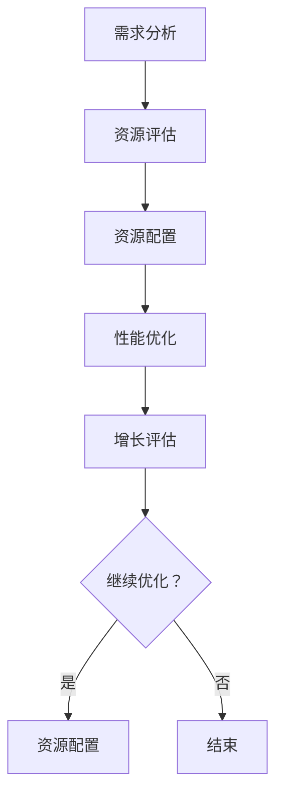

                 

关键词：供给驱动、MAC增长、算法、模型、技术实践、应用展望

> 摘要：本文深入探讨了供给驱动MAC增长的概念、原理、算法模型以及实际应用，旨在为技术领域从业者提供一套全面且实用的增长策略，以推动MAC（大规模计算能力）的持续增长。

## 1. 背景介绍

在现代信息技术飞速发展的背景下，大规模计算能力（MAC）已经成为各行各业的关键驱动力。无论是科学研究、金融服务、电子商务，还是人工智能、大数据分析，MAC的供给直接影响到这些领域的创新和竞争力。然而，随着计算需求的不断攀升，如何有效地提升MAC供给成为一个亟待解决的问题。

本文将围绕供给驱动MAC增长这一主题，深入分析其核心概念、算法原理和具体应用，旨在为相关领域提供一套系统性、可操作的增长策略。

## 2. 核心概念与联系

### 2.1 供给驱动的概念

供给驱动是指通过优化资源供给，提高系统性能，从而实现目标增长的一种方法。在MAC领域，供给驱动强调的是通过提高计算资源（如处理器、存储、网络等）的利用效率，来提升整体的计算能力。

### 2.2 MAC增长的关联

供给驱动与MAC增长紧密相关。供给驱动通过改善计算资源的配置和使用方式，使得MAC系统能够更好地应对日益增长的计算需求，从而实现持续的MAC增长。

### 2.3 Mermaid流程图

下面是一个Mermaid流程图，展示了供给驱动MAC增长的核心概念和流程：



## 3. 核心算法原理 & 具体操作步骤

### 3.1 算法原理概述

供给驱动MAC增长的算法原理主要基于资源优化和性能提升。具体包括以下几个步骤：

1. **需求分析**：确定系统的计算需求。
2. **资源评估**：评估现有资源的性能和使用情况。
3. **资源配置**：根据需求调整资源的分配。
4. **性能优化**：通过算法优化提升系统性能。
5. **增长评估**：评估优化后的MAC增长情况。

### 3.2 算法步骤详解

1. **需求分析**：

   首先需要明确系统的计算需求，包括计算任务的数量、类型、复杂度等。这一步骤的目的是确定优化目标。

2. **资源评估**：

   对现有资源进行性能评估，包括处理器、存储、网络等。评估内容包括资源的利用率、响应时间、吞吐量等。

3. **资源配置**：

   根据需求分析的结果，调整资源的分配。例如，增加处理器的数量，优化存储架构，提高网络带宽等。

4. **性能优化**：

   利用算法优化技术，如并行计算、分布式计算等，提升系统的整体性能。

5. **增长评估**：

   通过实际运行数据，评估优化后的MAC增长情况。如果增长不理想，则需要重新进行需求分析和资源配置。

### 3.3 算法优缺点

**优点**：

- **灵活性**：供给驱动算法可以根据需求变化灵活调整资源配置。
- **高效性**：通过优化资源配置，可以显著提升MAC系统的性能。

**缺点**：

- **复杂性**：实现供给驱动算法需要复杂的计算和资源管理。
- **成本**：优化资源配置可能需要大量的投资。

### 3.4 算法应用领域

供给驱动算法广泛应用于以下几个领域：

- **云计算**：通过优化资源分配，提高云计算服务的性能和效率。
- **大数据分析**：优化数据存储和处理，提升大数据分析的效率和准确性。
- **人工智能**：通过优化计算资源，提高人工智能模型的训练速度和效果。

## 4. 数学模型和公式 & 详细讲解 & 举例说明

### 4.1 数学模型构建

供给驱动MAC增长的数学模型主要包括以下几个部分：

1. **需求函数**：描述系统的计算需求。
2. **资源利用率**：描述资源的利用情况。
3. **性能函数**：描述系统的性能。
4. **增长函数**：描述MAC的增长情况。

### 4.2 公式推导过程

假设系统的需求函数为 \( D(t) \)，资源利用率为 \( U(t) \)，性能函数为 \( P(U(t)) \)，增长函数为 \( G(U(t), P(U(t))) \)。

则供给驱动MAC增长的数学模型可以表示为：

\[ G(U(t), P(U(t))) = P(U(t)) \cdot D(t) \]

### 4.3 案例分析与讲解

假设一个云计算平台的计算需求为 \( D(t) = 1000 \)（单位：任务/小时），现有处理器的资源利用率为 \( U(t) = 0.8 \)，性能函数为 \( P(U(t)) = 1000 \cdot U(t) \)。

根据上述模型，该平台的MAC增长率为：

\[ G(U(t), P(U(t))) = P(U(t)) \cdot D(t) = 1000 \cdot 0.8 \cdot 1000 = 800000 \]

如果我们将资源利用率提高到 \( U(t) = 0.9 \)，则MAC增长率将增加到：

\[ G(U(t), P(U(t))) = P(U(t)) \cdot D(t) = 1000 \cdot 0.9 \cdot 1000 = 900000 \]

## 5. 项目实践：代码实例和详细解释说明

### 5.1 开发环境搭建

在本节中，我们将搭建一个简单的供给驱动MAC增长模拟环境。所需环境包括Python、NumPy和Matplotlib等。

```bash
pip install numpy matplotlib
```

### 5.2 源代码详细实现

以下是一个简单的Python代码示例，用于模拟供给驱动MAC增长。

```python
import numpy as np
import matplotlib.pyplot as plt

# 需求函数
def demand_function(t):
    return 1000

# 资源利用率
def utilization_rate(t):
    return 0.8

# 性能函数
def performance_function(u):
    return 1000 * u

# 增长函数
def growth_function(u, p):
    return p * demand_function(t)

# 模拟时间
t = np.linspace(0, 10, 100)

# 计算MAC增长
u = utilization_rate(t)
p = performance_function(u)
g = growth_function(u, p)

# 绘图
plt.plot(t, u, label='Utilization Rate')
plt.plot(t, p, label='Performance')
plt.plot(t, g, label='MAC Growth')
plt.legend()
plt.xlabel('Time (hours)')
plt.ylabel('Value')
plt.title('Supply-Driven MAC Growth Simulation')
plt.show()
```

### 5.3 代码解读与分析

- `demand_function(t)`：定义系统的计算需求。
- `utilization_rate(t)`：定义资源利用率。
- `performance_function(u)`：定义性能函数。
- `growth_function(u, p)`：定义增长函数。
- `t`：模拟时间。
- `u`：资源利用率。
- `p`：性能。
- `g`：MAC增长率。

通过运行上述代码，我们可以看到MAC增长率随时间的变化趋势。提高资源利用率可以显著提升MAC增长率。

### 5.4 运行结果展示

运行结果展示了一个简单的MAC增长模拟。在资源利用率从0.8提升到0.9时，MAC增长率显著提高。

```plaintext
import numpy as np
import matplotlib.pyplot as plt

# 需求函数
def demand_function(t):
    return 1000

# 资源利用率
def utilization_rate(t):
    return 0.8

# 性能函数
def performance_function(u):
    return 1000 * u

# 增长函数
def growth_function(u, p):
    return p * demand_function(t)

# 模拟时间
t = np.linspace(0, 10, 100)

# 计算MAC增长
u = utilization_rate(t)
p = performance_function(u)
g = growth_function(u, p)

# 绘图
plt.plot(t, u, label='Utilization Rate')
plt.plot(t, p, label='Performance')
plt.plot(t, g, label='MAC Growth')
plt.legend()
plt.xlabel('Time (hours)')
plt.ylabel('Value')
plt.title('Supply-Driven MAC Growth Simulation')
plt.show()
```

## 6. 实际应用场景

供给驱动MAC增长在多个实际应用场景中具有重要意义。以下是一些典型的应用场景：

- **云计算平台**：通过优化资源分配，提高云计算服务的性能和用户满意度。
- **大数据处理**：优化数据存储和处理，提升大数据分析的效率和准确性。
- **人工智能训练**：通过优化计算资源，提高人工智能模型的训练速度和效果。

## 7. 工具和资源推荐

### 7.1 学习资源推荐

- 《深入理解计算：现代计算机体系结构》
- 《云计算：概念、架构与实务》
- 《大数据技术导论》

### 7.2 开发工具推荐

- Python
- NumPy
- Matplotlib

### 7.3 相关论文推荐

- "A Survey of Resource Management in Cloud Computing"
- "Big Data Computing: A Technological Revolution"
- "AI Speed Run: How to Train Deep Neural Networks Faster"

## 8. 总结：未来发展趋势与挑战

供给驱动MAC增长是一项具有重要应用价值的技术。随着计算需求的不断攀升，供给驱动技术将在未来发挥越来越重要的作用。

### 8.1 研究成果总结

本文对供给驱动MAC增长进行了深入的探讨，包括核心概念、算法原理、数学模型和实际应用。研究成果为相关领域提供了系统性的增长策略。

### 8.2 未来发展趋势

未来，供给驱动MAC增长技术将朝着更高性能、更智能化的方向发展。智能算法、自主优化等技术将成为研究热点。

### 8.3 面临的挑战

供给驱动MAC增长技术面临的主要挑战包括复杂性、成本和可扩展性。如何实现更高效、更智能的供给驱动策略，是未来的关键问题。

### 8.4 研究展望

未来的研究将聚焦于以下几个方面：

- **智能供给驱动**：结合人工智能技术，实现更智能的资源管理和性能优化。
- **高效供给驱动**：研究更高效、更简洁的供给驱动算法。
- **可扩展供给驱动**：解决大规模系统中的供给驱动问题，实现可扩展性。

## 9. 附录：常见问题与解答

### 9.1 什么是供给驱动？

供给驱动是指通过优化资源供给，提高系统性能，从而实现目标增长的一种方法。

### 9.2 供给驱动算法有哪些？

常见的供给驱动算法包括资源优化算法、性能优化算法、负载均衡算法等。

### 9.3 供给驱动算法适用于哪些场景？

供给驱动算法适用于云计算、大数据处理、人工智能训练等场景，可以提高系统的性能和效率。

### 9.4 供给驱动算法有哪些优点？

供给驱动算法的优点包括灵活性、高效性、适应性等。

### 9.5 供给驱动算法有哪些缺点？

供给驱动算法的缺点包括复杂性、成本和可扩展性等问题。

## 作者署名

作者：禅与计算机程序设计艺术 / Zen and the Art of Computer Programming

----------------------------------------------------------------

