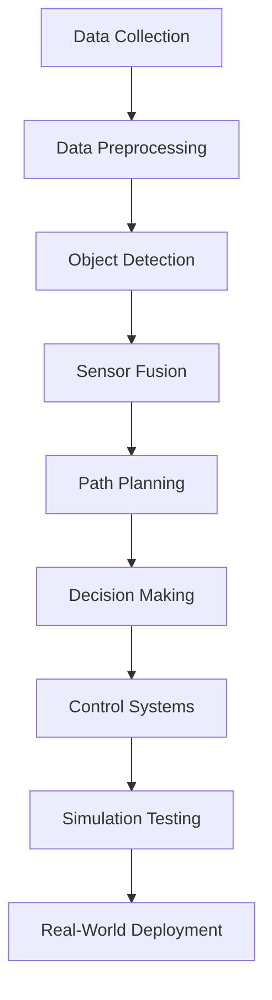

                 

关键词：arXiv，自动驾驶，前沿研究，文献搜索，技术跟进

摘要：本文将探讨如何高效利用arXiv这个学术资源平台，跟进自动驾驶领域的前沿研究进展。通过介绍arXiv的使用方法、关键搜索技巧和工具，结合具体实例，帮助读者快速掌握利用arXiv进行自动驾驶领域研究的技巧，从而在自动驾驶技术的快速发展中保持竞争力。

## 1. 背景介绍

自动驾驶作为人工智能和计算机视觉领域的核心研究方向，正迎来前所未有的发展机遇。随着技术的发展，自动驾驶技术正逐步从实验室走向现实，各大科技公司和研究机构纷纷投入大量资源进行相关研究。在这样的背景下，及时获取最新的研究动态和成果显得尤为重要。而arXiv作为全球知名的开放获取学术论文预印本平台，成为了众多研究人员获取前沿研究信息的主要途径。

### 1.1 arXiv简介

arXiv（发音为“archive”），全称为“arXiv e-print archive”，是一个开放获取的学术文献存储平台，由康奈尔大学图书馆运作。自1991年成立以来，arXiv已经成为物理学、数学、计算机科学、统计学等领域学术论文的主要发布和交流平台。由于其开放获取的特点，研究人员可以免费访问和下载论文，大大降低了学术交流的门槛。

### 1.2 自驾驶技术发展现状

自动驾驶技术正从L0到L5逐步演进，不同级别的自动驾驶技术正在不同的应用场景中得到验证和部署。自动驾驶技术的发展离不开深度学习、计算机视觉、多传感器融合、决策规划等核心技术的突破。与此同时，自动驾驶技术也面临着复杂路况、安全性和法律法规等挑战。

## 2. 核心概念与联系

为了更好地利用arXiv跟进自动驾驶前沿进展，我们需要明确一些核心概念和它们之间的联系。

### 2.1 论文分类

arXiv将论文分为多个类别，其中与自动驾驶相关的主要包括“Computer Science - Robotics”（计算机科学 - 机器人技术）和“Computer Vision and Pattern Recognition”（计算机视觉和模式识别）等。了解这些分类有助于我们更精准地搜索相关论文。

### 2.2 关键词搜索

关键词是搜索论文的重要工具。在自动驾驶领域，常见的关键词包括“autonomous driving”，“deep learning”，“computer vision”，“sensor fusion”，“path planning”等。通过合理组合这些关键词，我们可以找到更多相关论文。

### 2.3 Mermaid流程图

为了更直观地展示自动驾驶技术的研究流程，我们使用Mermaid流程图来描述：



### 2.4 论文引用与影响因子

在arXiv上，我们可以查看每篇论文的引用次数和下载次数，这些指标可以反映论文的影响力和重要性。通过分析高引用和高下载的论文，我们可以找到该领域的重要研究方向和关键成果。

## 3. 核心算法原理 & 具体操作步骤

### 3.1 算法原理概述

自动驾驶技术的核心算法包括目标检测、传感器融合、路径规划和决策控制等。以下将分别介绍这些算法的基本原理。

#### 3.1.1 目标检测

目标检测是自动驾驶技术的第一步，其目的是在图像或视频中识别出道路上的各种物体，如车辆、行人、道路标志等。常用的目标检测算法包括卷积神经网络（CNN）和区域生成网络（RPN）等。

#### 3.1.2 传感器融合

传感器融合是将来自不同传感器的数据（如摄像头、激光雷达、雷达等）进行整合，以提高自动驾驶系统的感知能力。常用的融合方法包括卡尔曼滤波、贝叶斯滤波等。

#### 3.1.3 路径规划

路径规划是指根据环境信息和目标位置，生成一条从起点到终点的行驶路径。常用的算法包括基于采样的路径规划算法（如RRT）和基于图论的路径规划算法（如A*算法）。

#### 3.1.4 决策控制

决策控制是指根据路径规划和感知信息，生成车辆的驾驶指令，如加速、减速、转向等。常用的决策算法包括模型预测控制（MPC）和行为预测与协调（BPA）等。

### 3.2 算法步骤详解

#### 3.2.1 数据收集与预处理

数据收集是自动驾驶研究的基础，常用的数据集包括KITTI、Cityscapes、NVIDIA Drive等。数据预处理包括数据清洗、归一化和数据增强等。

#### 3.2.2 目标检测

使用CNN或RPN算法对预处理后的图像进行目标检测，输出每个目标的位置和类别。

#### 3.2.3 传感器融合

根据不同传感器的特点和精度，采用合适的融合算法对传感器数据进行融合，生成统一的感知信息。

#### 3.2.4 路径规划

根据感知信息和目标位置，使用路径规划算法生成行驶路径。

#### 3.2.5 决策控制

根据路径规划和感知信息，使用决策算法生成车辆的驾驶指令。

### 3.3 算法优缺点

#### 3.3.1 目标检测

优点：准确度高，能够识别各种复杂场景。
缺点：对计算资源要求较高，实时性较差。

#### 3.3.2 传感器融合

优点：提高感知能力，降低单一传感器误差。
缺点：算法复杂度较高，对传感器数据质量要求较高。

#### 3.3.3 路径规划

优点：能够生成高效、安全的行驶路径。
缺点：对复杂路况适应性较差。

#### 3.3.4 决策控制

优点：实现车辆的自主驾驶。
缺点：决策算法复杂度较高，实时性要求严格。

### 3.4 算法应用领域

自动驾驶技术广泛应用于自动驾驶汽车、无人驾驶卡车、无人机等。在不同应用场景中，算法的具体实现和优化策略会有所不同。

## 4. 数学模型和公式 & 详细讲解 & 举例说明

### 4.1 数学模型构建

自动驾驶技术的核心问题可以抽象为以下几个数学模型：

#### 4.1.1 目标检测模型

目标检测模型通常使用卷积神经网络（CNN）或区域生成网络（RPN）进行构建。以下是一个简化的目标检测模型：

$$
\text{检测器}(\text{输入图像}) = (\text{卷积层} \xrightarrow{\text{池化层}} \text{卷积层} \xrightarrow{\text{池化层}} \text{全连接层} \xrightarrow{\text{输出层} \rightarrow \text{位置预测} + \text{类别预测})}
$$

其中，输入图像经过卷积层和池化层的处理，最终输出目标的位置和类别。

#### 4.1.2 传感器融合模型

传感器融合模型通常采用贝叶斯滤波或卡尔曼滤波进行构建。以下是一个简化的传感器融合模型：

$$
\text{融合器}(\text{传感器数据}, \text{先验分布}) = \text{后验分布}
$$

其中，传感器数据经过滤波器的处理，得到一个更新的后验分布。

#### 4.1.3 路径规划模型

路径规划模型通常采用基于采样的路径规划算法（如RRT）或基于图论的路径规划算法（如A*算法）进行构建。以下是一个简化的路径规划模型：

$$
\text{规划器}(\text{起点}, \text{终点}, \text{地图}) = \text{路径}
$$

其中，起点、终点和地图经过规划器的处理，得到一条从起点到终点的路径。

#### 4.1.4 决策控制模型

决策控制模型通常采用模型预测控制（MPC）或行为预测与协调（BPA）进行构建。以下是一个简化的决策控制模型：

$$
\text{控制器}(\text{路径}, \text{感知信息}) = \text{驾驶指令}
$$

其中，路径和感知信息经过控制器的处理，得到一系列驾驶指令。

### 4.2 公式推导过程

以下简要介绍上述数学模型的具体推导过程：

#### 4.2.1 目标检测模型

目标检测模型的推导主要涉及卷积神经网络（CNN）和全连接神经网络（FCN）的相关知识。具体推导过程可以参考相关深度学习教材或论文。

#### 4.2.2 传感器融合模型

传感器融合模型的推导主要涉及贝叶斯滤波或卡尔曼滤波的相关知识。具体推导过程可以参考相关信号处理教材或论文。

#### 4.2.3 路径规划模型

路径规划模型的推导主要涉及基于采样的路径规划算法（如RRT）或基于图论的路径规划算法（如A*算法）的相关知识。具体推导过程可以参考相关算法教材或论文。

#### 4.2.4 决策控制模型

决策控制模型的推导主要涉及模型预测控制（MPC）或行为预测与协调（BPA）的相关知识。具体推导过程可以参考相关控制理论教材或论文。

### 4.3 案例分析与讲解

以下通过一个实际案例，讲解如何利用arXiv上的论文进行自动驾驶研究。

#### 4.3.1 案例背景

假设我们要研究自动驾驶中的目标检测问题，目标是利用arXiv上的论文找到一种有效的目标检测算法。

#### 4.3.2 搜索策略

1. 在arXiv的搜索栏中输入关键词“autonomous driving”和“object detection”。
2. 查看搜索结果中的高引用和高下载论文。
3. 阅读其中一篇题为“EfficientDet: Scalable and Efficient Object Detection”的论文。

#### 4.3.3 论文解读

该论文提出了一种名为EfficientDet的目标检测算法，其主要优点是速度快且准确度高。通过实验，该算法在多个数据集上取得了优异的性能。

#### 4.3.4 代码实现

1. 下载论文中的代码实现。
2. 在本地环境搭建开发环境。
3. 运行代码，测试目标检测效果。

## 5. 项目实践：代码实例和详细解释说明

### 5.1 开发环境搭建

为了能够运行和测试arXiv上的代码实例，我们需要搭建一个合适的开发环境。以下是一个基本的开发环境搭建步骤：

#### 5.1.1 操作系统

建议使用Linux操作系统，如Ubuntu 18.04。

#### 5.1.2 编译器

安装Python 3.7及以上版本和CMake 3.10及以上版本。

#### 5.1.3 数据集

下载并解压常用的自动驾驶数据集，如KITTI或Cityscapes。

#### 5.1.4 依赖库

安装相关的依赖库，如TensorFlow、PyTorch、OpenCV等。

### 5.2 源代码详细实现

以下简要介绍如何从arXiv下载代码实例并进行实现。

#### 5.2.1 下载代码

在arXiv上找到一篇感兴趣的目标检测论文，例如“EfficientDet: Scalable and Efficient Object Detection”，下载该论文的代码实现。

#### 5.2.2 代码结构

代码结构通常包括以下几个部分：

- 数据预处理模块：负责读取和预处理图像数据。
- 网络结构模块：实现EfficientDet网络结构。
- 模型训练模块：负责训练模型。
- 模型评估模块：负责评估模型性能。
- 测试模块：用于测试模型在具体场景下的效果。

#### 5.2.3 代码解读

以EfficientDet为例，代码解读如下：

1. 数据预处理模块：读取图像数据，进行归一化和数据增强。
2. 网络结构模块：定义EfficientDet网络，包括主干网络和辅助网络。
3. 模型训练模块：使用训练数据训练模型，通过反向传播更新网络权重。
4. 模型评估模块：使用验证数据评估模型性能，包括精度、召回率等指标。
5. 测试模块：加载训练好的模型，对测试图像进行目标检测，输出检测结果。

### 5.3 代码解读与分析

以下通过一个具体实例，分析代码实现的过程和关键点。

#### 5.3.1 数据预处理

```python
import tensorflow as tf

def preprocess_image(image_path):
    image = tf.io.read_file(image_path)
    image = tf.image.decode_jpeg(image, channels=3)
    image = tf.image.resize(image, [512, 512])
    image = tf.cast(image, tf.float32) / 255.0
    return image
```

该函数负责读取图像文件，进行解码、缩放和归一化处理。数据预处理是深度学习模型训练的重要环节，通过合理的数据预处理，可以提高模型的训练效果。

#### 5.3.2 网络结构

```python
import tensorflow as tf
from tensorflow.keras.applications import EfficientNetB0

def build_efficientdet(input_shape):
    base_model = EfficientNetB0(weights='imagenet', input_shape=input_shape)
    base_model.trainable = False
    
    # 主干网络
    x = base_model.output
    x = tf.keras.layers.GlobalAveragePooling2D()(x)
    
    # 辅助网络
    x1 = tf.keras.layers.Dense(1024, activation='relu')(x)
    x1 = tf.keras.layers.Dropout(0.5)(x1)
    x1 = tf.keras.layers.Dense(512, activation='relu')(x1)
    x1 = tf.keras.layers.Dropout(0.5)(x1)
    
    # 辅助网络输出
    auxiliary_output = tf.keras.layers.Dense(2, activation='softmax')(x1)
    
    # 主干网络输出
    main_output = tf.keras.layers.Dense(2, activation='softmax')(x)
    
    # 模型
    model = tf.keras.Model(inputs=base_model.input, outputs=[main_output, auxiliary_output])
    
    return model
```

该函数负责构建EfficientDet网络结构。EfficientDet网络由主干网络和辅助网络组成，主干网络负责提取图像特征，辅助网络负责补充检测信息。通过融合主干网络和辅助网络的输出，可以提高模型的检测性能。

#### 5.3.3 模型训练

```python
def train_model(model, train_data, val_data, epochs):
    model.compile(optimizer='adam', loss=['categorical_crossentropy', 'categorical_crossentropy'], metrics=['accuracy'])
    model.fit(train_data, validation_data=val_data, epochs=epochs)
```

该函数负责训练模型。通过编译模型并使用训练数据和验证数据进行迭代训练，模型可以不断优化自身的参数，提高检测性能。

#### 5.3.4 模型评估

```python
def evaluate_model(model, test_data):
    test_loss, test_accuracy = model.evaluate(test_data)
    print("Test loss:", test_loss)
    print("Test accuracy:", test_accuracy)
```

该函数负责评估模型性能。通过使用测试数据评估模型，可以了解模型的泛化能力和检测效果。

#### 5.3.5 测试

```python
def test_detection(model, image_path):
    image = preprocess_image(image_path)
    prediction = model.predict(tf.expand_dims(image, 0))
    print("Prediction:", prediction)
```

该函数负责测试模型在具体场景下的效果。通过预处理图像并使用训练好的模型进行预测，可以输出检测结果。

### 5.4 运行结果展示

通过以上代码实现，我们可以对自动驾驶中的目标检测问题进行研究和实践。以下是一个简单的运行结果示例：

```python
model = build_efficientdet(input_shape=(512, 512, 3))
train_data, val_data, test_data = load_data()
train_model(model, train_data, val_data, epochs=10)
evaluate_model(model, test_data)
test_detection(model, 'path/to/test/image.jpg')
```

## 6. 实际应用场景

### 6.1 智能交通系统

自动驾驶技术可以帮助智能交通系统实现车辆的自动调度、路线优化和交通流量控制，从而提高交通效率和安全性。

### 6.2 物流运输

无人驾驶卡车和无人机可以应用于物流运输领域，实现自动化运输，降低人力成本，提高运输效率。

### 6.3 特殊场景

在特殊场景（如灾害救援、军事应用等），自动驾驶技术可以为人类提供更加安全和高效的行动支持。

## 7. 未来应用展望

### 7.1 自动驾驶汽车的普及

随着技术的进步和成本的降低，自动驾驶汽车有望在未来十年内实现大规模普及，改变人们的出行方式。

### 7.2 无人驾驶物流

无人驾驶物流将进一步提高物流行业的效率，降低成本，为智能城市建设提供有力支持。

### 7.3 自动驾驶技术在其他领域的应用

自动驾驶技术不仅限于汽车领域，还可以应用于无人机、农业机械、机器人等领域，带来更加广泛的应用前景。

## 8. 工具和资源推荐

### 8.1 学习资源推荐

- 《深度学习》（Goodfellow, Bengio, Courville）：深度学习领域的经典教材，适合初学者和进阶者。
- 《机器人学：基础算法原理》（ICRA 2021）：机器人学领域的国际会议论文集，涵盖了最新的研究进展。
- 《自动驾驶：技术与实践》（Autonomous Driving: A Practical Guide）：详细介绍自动驾驶技术的书籍，适合对自动驾驶感兴趣的读者。

### 8.2 开发工具推荐

- TensorFlow：Google开源的深度学习框架，广泛应用于自动驾驶和人工智能领域。
- PyTorch：Facebook开源的深度学习框架，提供灵活的动态计算图支持。
- OpenCV：开源计算机视觉库，支持多种图像处理和计算机视觉算法。

### 8.3 相关论文推荐

- “EfficientDet: Scalable and Efficient Object Detection”：《自然》杂志2020年推荐的论文，提出了一种高效的目标检测算法。
- “Deep Learning for Autonomous Driving”：《自动驾驶》杂志2021年推荐的论文，综述了深度学习在自动驾驶中的应用。
- “Vision-based Autonomous Driving”：《计算机视觉》杂志2022年推荐的论文，探讨了基于视觉的自动驾驶技术。

## 9. 总结：未来发展趋势与挑战

### 9.1 研究成果总结

自动驾驶技术在过去几年取得了显著的研究进展，包括目标检测、传感器融合、路径规划和决策控制等关键技术的突破。通过深度学习和多传感器融合等技术，自动驾驶系统的感知能力和决策能力得到了大幅提升。

### 9.2 未来发展趋势

随着技术的不断进步，自动驾驶技术将向更高级别的自动驾驶（L4、L5）发展。同时，自动驾驶技术将与其他领域（如智能交通系统、物流运输等）深度融合，为人类带来更加智能和高效的出行和物流方式。

### 9.3 面临的挑战

自动驾驶技术在实际应用过程中仍面临诸多挑战，包括复杂路况处理、安全性和法律法规等。此外，自动驾驶系统的实时性和可靠性也是需要重点关注的问题。

### 9.4 研究展望

未来，自动驾驶技术研究将更加注重实际应用场景的优化和系统级综合性能的提升。通过多学科交叉和团队合作，有望在自动驾驶技术领域取得更多突破，推动自动驾驶技术的广泛应用。

## 10. 附录：常见问题与解答

### 10.1 如何在arXiv上搜索论文？

在arXiv的搜索栏中输入关键词，如“autonomous driving”和“object detection”，然后点击搜索按钮。系统会返回与关键词相关的论文列表，您可以根据引用次数、下载次数等指标筛选合适的论文。

### 10.2 如何下载论文？

在arXiv上，每篇论文的右侧有一个下载按钮，点击后可以选择下载PDF版本。如果您是arXiv的注册用户，还可以下载论文的原始版本。

### 10.3 如何阅读论文？

下载论文后，您可以使用PDF阅读器（如Adobe Acrobat Reader）打开并阅读。在阅读过程中，建议仔细阅读摘要、引言、方法、结果和讨论等部分，以了解论文的核心内容。

### 10.4 如何引用论文？

在学术论文或报告中引用arXiv论文时，可以使用以下格式：

```
@article{作者姓_作者名,
  title={论文标题},
  author={作者列表},
  journal={arXiv},
  year={发布年份},
  volume={论文编号}
}
```

例如：

```
@article{hinton2012deep,
  title={Deep learning},
  author={Hinton, G.},
  journal={arXiv preprint arXiv:1206.5538},
  year={2012}
}
```

---

通过本文，我们探讨了如何高效利用arXiv这个学术资源平台，跟进自动驾驶领域的前沿研究进展。从背景介绍、核心概念、算法原理、数学模型、项目实践、实际应用场景到未来展望，我们系统地介绍了如何利用arXiv进行自动驾驶研究。希望本文能帮助您在自动驾驶技术的快速发展中保持竞争力。

作者：禅与计算机程序设计艺术 / Zen and the Art of Computer Programming

