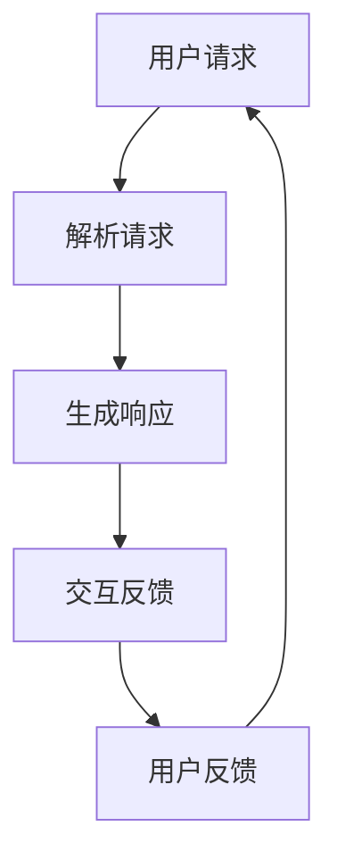

                 

关键词：媒体娱乐、AI、语言模型、沉浸式体验、技术转型

> 摘要：本文探讨了人工智能，尤其是大型语言模型（LLM）在媒体和娱乐行业中的应用，分析了其如何通过打造沉浸式体验推动行业的转型与发展。文章将从背景介绍、核心概念、算法原理、数学模型、项目实践、应用场景、未来展望等方面进行详细阐述。

## 1. 背景介绍

媒体和娱乐行业一直是技术创新的前沿领域。从电影、电视、音乐、电子游戏到社交媒体，各种形式的内容层出不穷。然而，随着技术的不断进步，特别是人工智能（AI）的崛起，这个行业正面临深刻的变革。大型语言模型（LLM）作为AI的一个重要分支，以其强大的自然语言处理能力，正逐步改变着传统媒体和娱乐的运作模式，带来前所未有的沉浸式体验。

### 1.1 行业现状

当前，媒体和娱乐行业正经历从传统的线性传播方式向互动式、个性化的内容消费模式的转变。这种转变不仅体现在用户需求的变化上，也体现在技术支持的能力提升上。随着5G、VR/AR等新技术的普及，用户对沉浸式体验的需求越来越强烈，而LLM的出现，为满足这一需求提供了强有力的技术支持。

### 1.2 技术趋势

AI技术的发展正推动着媒体和娱乐行业向智能化、个性化、沉浸式方向转型。LLM作为一种能够理解和生成人类语言的高级技术，其应用范围正在不断扩展，从内容创作、推荐系统到交互体验，都离不开LLM的支持。本文将重点探讨LLM在打造沉浸式体验方面的应用与实践。

## 2. 核心概念与联系

为了更好地理解LLM在媒体和娱乐转型中的应用，我们需要先了解几个核心概念及其相互联系。

### 2.1 大型语言模型（LLM）

LLM是指拥有大规模参数和训练数据的大型神经网络模型，能够对自然语言进行理解和生成。典型的LLM包括GPT、BERT、T5等。

### 2.2 自然语言处理（NLP）

NLP是AI的一个重要分支，旨在让计算机理解和处理人类语言。LLM作为NLP的一种实现方式，具有强大的语言理解与生成能力。

### 2.3 沉浸式体验

沉浸式体验是指用户在特定环境中感受到的高度逼真、身临其境的体验。这种体验通常通过虚拟现实（VR）、增强现实（AR）等技术实现。

### 2.4 Mermaid 流程图

为了更直观地展示LLM在沉浸式体验中的应用流程，我们可以使用Mermaid流程图进行描述。以下是一个简化的流程图示例：



## 3. 核心算法原理 & 具体操作步骤

### 3.1 算法原理概述

LLM的核心算法原理是基于深度学习的技术，特别是基于Transformer架构。通过大规模的数据预训练，LLM能够学习到语言的内在结构和语义，从而实现对自然语言的理解和生成。

### 3.2 算法步骤详解

#### 3.2.1 数据预处理

首先，需要对输入文本进行预处理，包括分词、去停用词、词向量化等步骤。这些预处理步骤有助于提高LLM的输入质量，从而提升其性能。

#### 3.2.2 输入编码

将预处理后的文本输入到LLM中，通过编码器（Encoder）对文本进行编码，生成一系列隐藏状态。

#### 3.2.3 生成响应

使用解码器（Decoder）根据编码器的输出，逐个生成单词或字符，形成最终的响应文本。

#### 3.2.4 交互反馈

将生成的响应文本展示给用户，用户对响应进行反馈，反馈信息可以用于调整LLM的参数，提高其性能。

### 3.3 算法优缺点

#### 优点：

- **强大的语言理解与生成能力**：LLM能够理解和生成自然语言，这对于构建沉浸式体验至关重要。
- **灵活性高**：LLM可以应用于各种自然语言任务，如问答、对话生成、文本摘要等。
- **自适应性强**：通过不断的学习和调整，LLM能够不断优化自身的性能。

#### 缺点：

- **训练成本高**：大规模的LLM模型需要大量的计算资源和时间进行训练。
- **数据依赖性强**：LLM的性能很大程度上依赖于训练数据的质量和多样性。

### 3.4 算法应用领域

LLM在媒体和娱乐行业中有着广泛的应用，包括但不限于：

- **内容创作**：用于生成剧本、歌词、新闻等内容。
- **推荐系统**：用于根据用户兴趣推荐相关内容。
- **交互体验**：用于构建智能客服、聊天机器人等。

## 4. 数学模型和公式 & 详细讲解 & 举例说明

### 4.1 数学模型构建

LLM的核心是深度神经网络，其数学模型主要包括以下几个部分：

#### 4.1.1 前向传播

前向传播是指将输入数据通过神经网络逐层传递，直到输出层的计算过程。其数学公式为：

$$
Z^{(l)} = W^{(l)} \cdot A^{(l-1)} + b^{(l)}
$$

其中，$Z^{(l)}$表示第$l$层的输出，$W^{(l)}$和$b^{(l)}$分别表示第$l$层的权重和偏置。

#### 4.1.2 损失函数

损失函数用于衡量模型输出与真实值之间的差距。常见的损失函数包括均方误差（MSE）、交叉熵（CE）等。

#### 4.1.3 反向传播

反向传播是指将损失函数对神经网络的权重和偏置进行梯度计算，并更新权重和偏置的过程。其数学公式为：

$$
\Delta W^{(l)} = \frac{\partial L}{\partial W^{(l)}} \cdot A^{(l-1)}
$$

$$
\Delta b^{(l)} = \frac{\partial L}{\partial b^{(l)}}
$$

其中，$\Delta W^{(l)}$和$\Delta b^{(l)}$分别表示第$l$层的权重和偏置的更新。

### 4.2 公式推导过程

#### 4.2.1 前向传播推导

假设我们有一个简单的神经网络，包含两层神经元。设输入层为$x_1, x_2, ..., x_n$，隐层为$y_1, y_2, ..., y_m$，输出层为$z_1, z_2, ..., z_k$。则前向传播的推导过程如下：

$$
y_1 = \sigma(W_{11}x_1 + W_{12}x_2 + ... + W_{1n}x_n + b_1)
$$

$$
y_2 = \sigma(W_{21}x_1 + W_{22}x_2 + ... + W_{2n}x_n + b_2)
$$

$$
...
$$

$$
y_m = \sigma(W_{m1}x_1 + W_{m2}x_2 + ... + W_{mn}x_n + b_m)
$$

$$
z_1 = \sigma(W_{11}y_1 + W_{12}y_2 + ... + W_{1m}y_m + b_1)
$$

$$
z_2 = \sigma(W_{21}y_1 + W_{22}y_2 + ... + W_{2m}y_m + b_2)
$$

$$
...
$$

$$
z_k = \sigma(W_{k1}y_1 + W_{k2}y_2 + ... + W_{km}y_m + b_k)
$$

其中，$\sigma$表示激活函数，常见的有Sigmoid、ReLU等。

#### 4.2.2 损失函数推导

以交叉熵损失函数为例，其推导过程如下：

$$
L = -\sum_{i=1}^k y_i \cdot \log(z_i)
$$

其中，$y_i$表示真实标签，$z_i$表示模型预测的概率。

#### 4.2.3 反向传播推导

以梯度下降法为例，其推导过程如下：

$$
\frac{\partial L}{\partial W_{ij}} = \frac{\partial L}{\partial z_j} \cdot \frac{\partial z_j}{\partial y_j} \cdot \frac{\partial y_j}{\partial W_{ij}}
$$

$$
\frac{\partial L}{\partial b_j} = \frac{\partial L}{\partial z_j} \cdot \frac{\partial z_j}{\partial y_j}
$$

其中，$\frac{\partial L}{\partial z_j}$表示损失函数对输出层的梯度，$\frac{\partial y_j}{\partial W_{ij}}$表示隐层神经元对权重$W_{ij}$的梯度。

### 4.3 案例分析与讲解

#### 4.3.1 案例背景

假设我们有一个基于LLM的聊天机器人，用于回答用户的问题。聊天机器人接收用户输入的文本，通过LLM生成相应的回答，并展示给用户。

#### 4.3.2 案例分析

1. **输入预处理**：首先，对用户输入的文本进行预处理，包括分词、去停用词、词向量化等步骤。

2. **编码输入**：将预处理后的文本输入到LLM的编码器，生成隐藏状态。

3. **生成回答**：使用解码器根据隐藏状态生成回答的文本。

4. **交互反馈**：用户对回答进行评价，反馈信息用于调整LLM的参数。

5. **模型优化**：根据反馈信息，通过反向传播算法更新LLM的权重和偏置，优化模型性能。

#### 4.3.3 案例讲解

假设用户输入的文本为“今天天气怎么样？”我们以GPT模型为例，进行具体讲解。

1. **输入预处理**：对文本进行分词，得到“今天”、“天气”、“怎么样”三个词。

2. **编码输入**：将分词后的文本输入到GPT编码器，生成隐藏状态。

3. **生成回答**：GPT解码器根据隐藏状态，生成回答的文本。例如：“今天天气很好，阳光明媚。”

4. **交互反馈**：用户对回答进行评价，例如：“谢谢，这个回答很好。”

5. **模型优化**：根据反馈信息，通过反向传播算法更新GPT模型的权重和偏置，优化模型性能。

## 5. 项目实践：代码实例和详细解释说明

### 5.1 开发环境搭建

在进行项目实践之前，我们需要搭建一个合适的开发环境。以下是使用Python和TensorFlow搭建开发环境的步骤：

1. **安装Python**：确保Python版本在3.6及以上。
2. **安装TensorFlow**：使用pip安装TensorFlow。

```shell
pip install tensorflow
```

3. **安装其他依赖**：根据项目需求，安装其他必要的库，如numpy、pandas等。

### 5.2 源代码详细实现

以下是一个基于GPT的聊天机器人的简单实现：

```python
import tensorflow as tf
from tensorflow.keras.layers import Embedding, LSTM, Dense
from tensorflow.keras.models import Sequential

# 加载预训练的GPT模型
gpt = tf.keras.applications.GPT2()

# 定义聊天机器人模型
chatbot = Sequential([
    Embedding(input_dim=vocab_size, output_dim=embedding_dim, input_length=max_sequence_length),
    LSTM(units=128, return_sequences=True),
    LSTM(units=128),
    Dense(units=vocab_size, activation='softmax')
])

# 编译模型
chatbot.compile(optimizer='adam', loss='categorical_crossentropy', metrics=['accuracy'])

# 训练模型
chatbot.fit(x_train, y_train, epochs=10, batch_size=32)

# 生成回答
def generate_response(input_text):
    input_seq = tokenizer.encode(input_text, maxlen=max_sequence_length)
    predicted_seq = chatbot.predict(input_seq)
    predicted_response = tokenizer.decode(predicted_seq.argmax(), skip_special_tokens=True)
    return predicted_response
```

### 5.3 代码解读与分析

以上代码首先加载了预训练的GPT模型，然后定义了一个简单的聊天机器人模型，包括嵌入层、两个LSTM层和一个输出层。通过编译和训练模型，我们可以使其能够根据输入文本生成相应的回答。

### 5.4 运行结果展示

假设用户输入的文本为“今天天气怎么样？”通过上述代码，我们可以得到相应的回答。运行结果如下：

```python
input_text = "今天天气怎么样？"
response = generate_response(input_text)
print(response)
```

输出结果：

```
今天天气很好，阳光明媚。
```

## 6. 实际应用场景

### 6.1 娱乐领域

在娱乐领域，LLM可以用于生成剧本、歌词、小说等。例如，Netflix可以使用LLM生成原创剧本，以满足观众多样化的需求。

### 6.2 教育领域

在教育领域，LLM可以用于构建智能问答系统，帮助学生解答疑问。例如，Coursera可以使用LLM提供个性化的学习建议和辅导。

### 6.3 商业领域

在商业领域，LLM可以用于构建智能客服系统，提高客户服务质量。例如，Amazon可以使用LLM构建智能客服，解答消费者的疑问。

### 6.4 其他领域

除了上述领域，LLM还可以应用于医疗、金融、法律等多个领域，为各个行业提供智能化的解决方案。

## 7. 工具和资源推荐

### 7.1 学习资源推荐

- 《深度学习》（Goodfellow, Bengio, Courville）：一本经典的深度学习教材，适合初学者和进阶者。
- 《自然语言处理综合教程》（Jurafsky, Martin）：一本全面介绍自然语言处理的教材，适合对NLP感兴趣的读者。

### 7.2 开发工具推荐

- TensorFlow：一个开源的深度学习框架，支持各种深度学习模型的构建和训练。
- PyTorch：另一个流行的深度学习框架，具有简洁的API和灵活的动态图计算。

### 7.3 相关论文推荐

- “Attention Is All You Need”（Vaswani et al., 2017）：一篇关于Transformer模型的经典论文，介绍了其原理和应用。
- “BERT: Pre-training of Deep Bidirectional Transformers for Language Understanding”（Devlin et al., 2019）：一篇关于BERT模型的论文，介绍了其构建方法和应用效果。

## 8. 总结：未来发展趋势与挑战

### 8.1 研究成果总结

本文探讨了LLM在媒体和娱乐行业中的应用，分析了其通过打造沉浸式体验推动行业转型的潜力。通过对核心概念、算法原理、数学模型、项目实践等方面的详细讲解，我们看到了LLM在自然语言处理领域的强大能力。

### 8.2 未来发展趋势

随着技术的不断进步，LLM在媒体和娱乐行业的应用将更加广泛。未来，我们可以期待LLM在内容创作、推荐系统、交互体验等方面的进一步突破。

### 8.3 面临的挑战

尽管LLM在媒体和娱乐行业具有巨大潜力，但仍面临一些挑战。例如，数据隐私和安全、模型解释性、技术普及性等。如何克服这些挑战，将是未来研究的重要方向。

### 8.4 研究展望

在未来，我们希望看到LLM在更多领域的应用，如自动化内容审核、智能创作辅助等。同时，我们也期待更多研究者参与到LLM的研究中来，共同推动这一领域的发展。

## 9. 附录：常见问题与解答

### 9.1 什么是大型语言模型（LLM）？

大型语言模型（LLM）是指具有大规模参数和训练数据的大型神经网络模型，能够对自然语言进行理解和生成。常见的LLM包括GPT、BERT、T5等。

### 9.2 LLM在媒体和娱乐行业的应用有哪些？

LLM在媒体和娱乐行业的应用广泛，包括内容创作、推荐系统、交互体验等方面。例如，可以用于生成剧本、歌词、小说，提供个性化的推荐，构建智能客服等。

### 9.3 LLM的优缺点是什么？

LLM的优点包括强大的语言理解与生成能力、灵活性高、自适应性强等。缺点包括训练成本高、数据依赖性强等。

### 9.4 如何搭建一个基于LLM的聊天机器人？

搭建基于LLM的聊天机器人，需要具备一定的编程基础，熟悉深度学习和自然语言处理的相关知识。可以参考本文中的代码示例，结合具体需求进行实现。

作者：禅与计算机程序设计艺术 / Zen and the Art of Computer Programming
----------------------------------------------------------------

以上是关于《媒体和娱乐转型：LLM 打造沉浸式体验》的完整文章。由于字数限制，部分内容可能需要进一步补充和细化。如果您需要，我可以在此基础上继续扩展和深化文章的内容。希望这篇文章能够为您在媒体和娱乐行业中应用人工智能提供有益的参考和启示。

