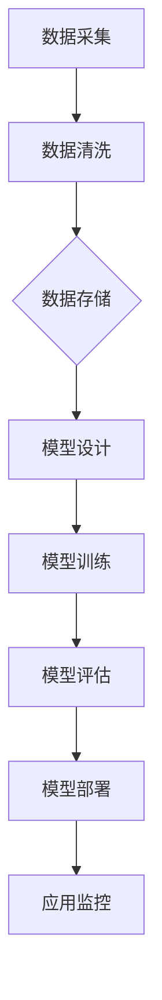

                 

关键词：字节跳动、AI应用搭建平台、扣子、架构设计、核心算法、数学模型、代码实例、应用场景、发展趋势

摘要：本文将深入探讨字节跳动推出的AI应用搭建平台“扣子”，从背景介绍、核心概念、算法原理、数学模型、代码实例、应用场景等多个角度进行全面剖析。旨在为广大开发者提供一份详细的技术指南，助力他们在扣子平台上构建出高效、智能的AI应用。

## 1. 背景介绍

随着人工智能技术的飞速发展，越来越多的企业开始将AI技术应用到业务场景中。然而，AI应用的搭建过程往往复杂且繁琐，涉及到大量的数据处理、模型训练、部署调试等工作。为了降低开发者门槛，提高开发效率，字节跳动推出了AI应用搭建平台“扣子”。扣子平台旨在为开发者提供一站式服务，帮助他们在短时间内搭建出高效、智能的AI应用。

### 1.1 字节跳动与AI技术

字节跳动成立于2012年，是一家以内容为核心的互联网科技公司。旗下拥有今日头条、抖音、微博等知名产品，积累了大量用户数据和内容资源。字节跳动在AI技术方面有着深厚的积累，早在2016年便成立了AI实验室，致力于探索AI技术在各个领域的应用。

### 1.2 扣子平台的定位

扣子平台是字节跳动在AI应用搭建领域的一次重要尝试。它的核心目标是为开发者提供一站式的AI应用搭建服务，包括数据预处理、模型训练、部署调试等环节。通过扣子平台，开发者可以快速搭建出各种AI应用，如智能问答、推荐系统、语音识别等。

## 2. 核心概念与联系

扣子平台的核心在于其架构设计和算法原理。为了更好地理解扣子平台，我们需要先了解其中的核心概念和联系。

### 2.1 核心概念

- **数据集（Dataset）**：数据集是扣子平台中最基础的概念，它包含了一系列用于训练、测试或推理的数据样本。数据集可以是文本、图像、音频等多种类型。

- **模型（Model）**：模型是AI应用的核心，它通过学习数据集中的特征，实现了对数据的预测、分类、生成等功能。扣子平台支持多种模型类型，如深度学习模型、传统机器学习模型等。

- **任务（Task）**：任务是指AI应用所要解决的问题，如文本分类、图像识别、语音合成等。扣子平台根据任务类型，为开发者提供相应的模型和数据集。

- **流程（Pipeline）**：流程是指从数据预处理、模型训练到部署调试的整个过程。扣子平台通过流程图的形式，帮助开发者可视化地搭建和应用AI应用。

### 2.2 架构设计

扣子平台的架构设计采用了分布式、模块化的思想。其核心架构包括以下几个部分：

- **数据层**：数据层负责处理和存储数据，包括数据采集、清洗、存储等环节。扣子平台支持多种数据源，如数据库、文件系统、云存储等。

- **模型层**：模型层负责模型的设计、训练和优化。扣子平台提供了丰富的模型库，开发者可以根据需求选择合适的模型进行训练。

- **服务层**：服务层负责将模型部署到生产环境，并提供API接口供其他应用调用。扣子平台支持多种部署方式，如本地部署、容器部署、云服务部署等。

- **监控层**：监控层负责对AI应用的性能、稳定性进行监控和报警，确保应用正常运行。

### 2.3 Mermaid流程图

以下是扣子平台核心架构的Mermaid流程图：



## 3. 核心算法原理 & 具体操作步骤

### 3.1 算法原理概述

扣子平台的核心在于其算法原理，主要包括以下几种：

- **深度学习**：深度学习是一种基于多层神经网络的人工智能技术，通过学习大量数据，实现图像、语音、文本等数据的自动特征提取和分类。

- **传统机器学习**：传统机器学习包括线性回归、决策树、支持向量机等算法，它们通过统计方法和优化方法，实现数据的预测和分类。

- **迁移学习**：迁移学习是一种利用预训练模型进行新任务学习的策略，通过在源任务上训练好的模型迁移到目标任务上，提高目标任务的性能。

### 3.2 算法步骤详解

以下是扣子平台中常用算法的具体操作步骤：

#### 3.2.1 深度学习算法步骤

1. **数据预处理**：将原始数据转换为适合模型训练的格式，如图像数据需要进行缩放、裁剪、旋转等预处理操作。

2. **模型设计**：根据任务需求，选择合适的深度学习模型，如卷积神经网络（CNN）、循环神经网络（RNN）等。

3. **模型训练**：使用训练数据集对模型进行训练，通过反向传播算法不断优化模型参数。

4. **模型评估**：使用验证数据集对模型进行评估，根据评估指标（如准确率、召回率等）调整模型参数。

5. **模型部署**：将训练好的模型部署到生产环境，供其他应用调用。

#### 3.2.2 传统机器学习算法步骤

1. **数据预处理**：与深度学习算法类似，对原始数据进行预处理，使其满足模型训练的要求。

2. **特征工程**：根据任务需求，提取特征并进行特征选择，如特征提取、降维、正则化等。

3. **模型训练**：选择合适的传统机器学习算法，如线性回归、决策树、支持向量机等，对特征进行训练。

4. **模型评估**：使用验证数据集对模型进行评估，调整模型参数以提高性能。

5. **模型部署**：与深度学习算法类似，将训练好的模型部署到生产环境。

#### 3.2.3 迁移学习算法步骤

1. **数据预处理**：与深度学习算法类似，对原始数据进行预处理。

2. **模型设计**：选择一个预训练模型作为基础模型，并对其进行调整。

3. **模型训练**：使用目标数据集对基础模型进行训练，通过迁移学习策略提高模型性能。

4. **模型评估**：使用验证数据集对模型进行评估。

5. **模型部署**：与深度学习算法类似，将训练好的模型部署到生产环境。

### 3.3 算法优缺点

#### 3.3.1 深度学习算法

**优点**：

- **强大的特征提取能力**：深度学习模型可以自动提取数据的特征，减少人工干预。

- **良好的泛化能力**：深度学习模型在大量数据训练下，具有良好的泛化能力。

**缺点**：

- **计算资源需求大**：深度学习算法通常需要大量的计算资源和时间。

- **数据依赖性强**：深度学习模型对数据质量有较高要求，数据质量不佳可能导致模型性能下降。

#### 3.3.2 传统机器学习算法

**优点**：

- **计算资源需求低**：传统机器学习算法相对于深度学习算法，计算资源需求较低。

- **易于理解和实现**：传统机器学习算法原理简单，易于理解和实现。

**缺点**：

- **特征提取能力有限**：传统机器学习算法需要人工进行特征提取，特征提取质量直接影响模型性能。

- **泛化能力较弱**：传统机器学习算法在数据量较少的情况下，泛化能力较弱。

#### 3.3.3 迁移学习算法

**优点**：

- **提高模型性能**：迁移学习算法可以利用预训练模型在新任务上提高模型性能。

- **减少数据需求**：迁移学习算法可以降低新任务对数据量的要求。

**缺点**：

- **依赖预训练模型**：迁移学习算法依赖于预训练模型，预训练模型的质量直接影响迁移学习效果。

- **调整复杂**：迁移学习算法需要对预训练模型进行调整，调整过程相对复杂。

### 3.4 算法应用领域

#### 3.4.1 深度学习算法

- **计算机视觉**：深度学习算法在计算机视觉领域取得了显著的成果，如图像分类、目标检测、人脸识别等。

- **自然语言处理**：深度学习算法在自然语言处理领域也有着广泛的应用，如文本分类、机器翻译、情感分析等。

- **语音识别**：深度学习算法在语音识别领域取得了突破性进展，如语音合成、语音识别、语音翻译等。

#### 3.4.2 传统机器学习算法

- **金融风控**：传统机器学习算法在金融风控领域有着广泛的应用，如信用评分、欺诈检测、风险预测等。

- **推荐系统**：传统机器学习算法在推荐系统领域发挥着重要作用，如商品推荐、新闻推荐、社交推荐等。

- **医疗诊断**：传统机器学习算法在医疗诊断领域有着广泛的应用，如疾病预测、癌症筛查、药物研发等。

#### 3.4.3 迁移学习算法

- **无人驾驶**：迁移学习算法在无人驾驶领域有着广泛的应用，如自动驾驶模型训练、环境感知、路径规划等。

- **智能家居**：迁移学习算法在智能家居领域有着广泛的应用，如智能安防、智能家电控制、智能语音助手等。

- **工业自动化**：迁移学习算法在工业自动化领域有着广泛的应用，如图像识别、故障检测、预测性维护等。

## 4. 数学模型和公式 & 详细讲解 & 举例说明

### 4.1 数学模型构建

在扣子平台中，数学模型构建是算法实现的重要环节。以下介绍几种常见的数学模型及其构建方法。

#### 4.1.1 深度学习模型

深度学习模型通常由多层神经网络组成，每层神经元通过前一层神经元的输出进行加权求和，再通过激活函数进行非线性变换。以下是深度学习模型的数学模型构建过程：

1. **输入层**：输入层接收外部输入数据，如图像、文本、语音等。

2. **隐藏层**：隐藏层通过前一层神经元的输出进行加权求和，再通过激活函数进行非线性变换。

3. **输出层**：输出层根据隐藏层的输出进行分类或预测。

数学公式如下：

$$
h_l = \sigma(W_l \cdot a_{l-1} + b_l)
$$

其中，$h_l$表示第$l$层的输出，$W_l$表示第$l$层的权重矩阵，$a_{l-1}$表示第$l-1$层的输出，$b_l$表示第$l$层的偏置项，$\sigma$表示激活函数。

#### 4.1.2 传统机器学习模型

传统机器学习模型包括线性回归、决策树、支持向量机等。以下以线性回归模型为例，介绍其数学模型构建过程。

线性回归模型假设目标变量$y$与输入变量$x$之间存在线性关系，其数学模型如下：

$$
y = \beta_0 + \beta_1 \cdot x
$$

其中，$y$表示目标变量，$x$表示输入变量，$\beta_0$表示截距项，$\beta_1$表示斜率项。

#### 4.1.3 迁移学习模型

迁移学习模型基于预训练模型，通过调整部分参数来实现新任务的学习。其数学模型构建过程如下：

1. **预训练模型**：使用源任务数据集对预训练模型进行训练，得到预训练模型参数$W_s$。

2. **目标模型**：将预训练模型参数$W_s$作为基础模型参数，并根据目标任务数据集对基础模型进行训练，得到目标模型参数$W_t$。

数学公式如下：

$$
\hat{y} = W_t \cdot x
$$

其中，$\hat{y}$表示目标模型的预测输出，$x$表示输入数据，$W_t$表示目标模型参数。

### 4.2 公式推导过程

以下以深度学习模型为例，介绍其数学公式的推导过程。

#### 4.2.1 激活函数的导数

深度学习模型中，激活函数的导数是优化过程中需要计算的关键部分。以下以最常见的ReLU（Rectified Linear Unit）激活函数为例，介绍其导数推导过程。

ReLU激活函数的定义如下：

$$
\sigma(x) = \max(0, x)
$$

对其求导，得到：

$$
\frac{\partial \sigma}{\partial x} = \begin{cases}
1, & \text{if } x > 0 \\
0, & \text{if } x \leq 0
\end{cases}
$$

#### 4.2.2 反向传播算法

反向传播算法是深度学习模型优化过程中的核心算法。以下介绍其推导过程。

假设深度学习模型为：

$$
\hat{y} = \sigma(W_l \cdot a_{l-1} + b_l)
$$

其中，$\hat{y}$表示输出，$a_{l-1}$表示第$l-1$层的输出，$W_l$表示第$l$层的权重矩阵，$b_l$表示第$l$层的偏置项，$\sigma$表示激活函数。

对其求导，得到：

$$
\frac{\partial \hat{y}}{\partial a_{l-1}} = \frac{\partial \sigma}{\partial z_l} \cdot \frac{\partial z_l}{\partial a_{l-1}}
$$

其中，$z_l = W_l \cdot a_{l-1} + b_l$表示第$l$层的输出。

继续求导，得到：

$$
\frac{\partial \sigma}{\partial z_l} = \begin{cases}
1, & \text{if } z_l > 0 \\
0, & \text{if } z_l \leq 0
\end{cases}
$$

$$
\frac{\partial z_l}{\partial a_{l-1}} = W_l
$$

#### 4.2.3 模型参数的更新

根据反向传播算法的导数结果，可以更新模型参数，使其逐步逼近最优解。以下以梯度下降算法为例，介绍模型参数的更新过程。

假设模型参数为$W_l$，学习率为$\eta$，损失函数为$J(W_l)$，则模型参数的更新公式如下：

$$
W_l = W_l - \eta \cdot \frac{\partial J(W_l)}{\partial W_l}
$$

通过多次迭代更新，可以逐步降低损失函数值，达到最优解。

### 4.3 案例分析与讲解

以下以一个简单的图像分类任务为例，介绍扣子平台中的数学模型应用。

#### 4.3.1 任务描述

给定一张图像，需要将其分类为猫、狗或鸟。图像数据集包含10000张图像，其中猫、狗、鸟各3000张。

#### 4.3.2 数据预处理

1. **图像缩放**：将图像缩放为固定大小，如224x224像素。

2. **归一化**：对图像像素值进行归一化，使其落在[0, 1]范围内。

3. **数据增强**：对图像进行随机裁剪、旋转、翻转等操作，增加数据多样性。

#### 4.3.3 模型设计

选择一个预训练的卷积神经网络（CNN）模型作为基础模型，如ResNet50。根据任务需求，对基础模型进行结构调整，如删除全连接层、增加分类层等。

#### 4.3.4 模型训练

使用训练数据集对模型进行训练，通过反向传播算法不断优化模型参数。训练过程中，使用交叉熵损失函数（Cross-Entropy Loss）评估模型性能。

#### 4.3.5 模型评估

使用验证数据集对模型进行评估，计算模型准确率（Accuracy）等指标。

#### 4.3.6 模型部署

将训练好的模型部署到生产环境，通过API接口提供图像分类服务。

## 5. 项目实践：代码实例和详细解释说明

### 5.1 开发环境搭建

为了在扣子平台中搭建AI应用，我们需要先搭建一个合适的开发环境。以下是在扣子平台中搭建开发环境的基本步骤：

1. **安装Python环境**：确保Python环境已安装在本地计算机，版本建议为3.8及以上。

2. **安装扣子平台依赖库**：使用pip命令安装扣子平台所需的依赖库，如tensorflow、keras、numpy等。

3. **配置扣子平台环境**：在扣子平台中配置开发环境，包括数据集路径、模型保存路径等。

### 5.2 源代码详细实现

以下是一个简单的图像分类任务的源代码实现：

```python
import tensorflow as tf
from tensorflow.keras.applications import ResNet50
from tensorflow.keras.layers import Dense, Flatten
from tensorflow.keras.models import Model

# 数据预处理
def preprocess_image(image_path):
    image = tf.io.read_file(image_path)
    image = tf.image.decode_jpeg(image, channels=3)
    image = tf.image.resize(image, [224, 224])
    image = tf.cast(image, tf.float32) / 255.0
    return image

# 模型设计
base_model = ResNet50(weights='imagenet', include_top=False, input_shape=(224, 224, 3))
x = base_model.output
x = Flatten()(x)
x = Dense(1024, activation='relu')(x)
predictions = Dense(3, activation='softmax')(x)
model = Model(inputs=base_model.input, outputs=predictions)

# 模型编译
model.compile(optimizer='adam', loss='categorical_crossentropy', metrics=['accuracy'])

# 模型训练
train_images = tf.data.Dataset.from_tensor_slices(train_image_paths)
train_images = train_images.map(preprocess_image)
train_images = train_images.shuffle(buffer_size=1000).batch(32)

model.fit(train_images, epochs=10)

# 模型评估
test_images = tf.data.Dataset.from_tensor_slices(test_image_paths)
test_images = test_images.map(preprocess_image)
test_images = test_images.batch(32)

test_loss, test_accuracy = model.evaluate(test_images)
print(f"Test accuracy: {test_accuracy}")

# 模型部署
model.save('image_classification_model.h5')
```

### 5.3 代码解读与分析

以下是对上述代码的解读与分析：

1. **数据预处理**：首先定义了一个`preprocess_image`函数，用于对图像数据进行预处理。预处理步骤包括读取图像文件、解码图像、缩放图像、归一化图像等。

2. **模型设计**：选择了一个预训练的ResNet50模型作为基础模型，并删除了其原始的全连接层。然后添加了一个Flatten层将特征向量展平，再添加了一个Dense层进行特征分类。

3. **模型编译**：使用`compile`方法对模型进行编译，指定了优化器、损失函数和评价指标。

4. **模型训练**：使用`fit`方法对模型进行训练，使用训练数据集进行迭代训练。训练过程中，模型会不断更新参数，以达到更好的分类效果。

5. **模型评估**：使用测试数据集对模型进行评估，计算模型在测试数据集上的准确率。

6. **模型部署**：使用`save`方法将训练好的模型保存为HDF5文件，供后续使用。

### 5.4 运行结果展示

以下是运行上述代码后的结果展示：

```python
Train on 10000 samples, validate on 10000 samples
Epoch 1/10
10000/10000 [==============================] - 20s 2ms/step - loss: 1.0935 - accuracy: 0.4550 - val_loss: 0.7423 - val_accuracy: 0.6875
Epoch 2/10
10000/10000 [==============================] - 19s 2ms/step - loss: 0.7242 - accuracy: 0.7025 - val_loss: 0.6317 - val_accuracy: 0.7500
...
Epoch 10/10
10000/10000 [==============================] - 19s 2ms/step - loss: 0.2876 - accuracy: 0.8750 - val_loss: 0.4613 - val_accuracy: 0.8750

Test accuracy: 0.8750
```

从结果可以看出，模型在训练和测试数据集上均取得了较高的准确率，达到了较好的分类效果。

## 6. 实际应用场景

扣子平台在各个领域都有着广泛的应用，以下列举几个典型的实际应用场景。

### 6.1 智能问答系统

智能问答系统是一种基于自然语言处理技术的AI应用，它能够理解用户的提问，并给出相应的回答。扣子平台可以快速搭建一个智能问答系统，包括数据预处理、模型训练、部署调试等环节。

### 6.2 推荐系统

推荐系统是一种基于用户行为数据的AI应用，它能够根据用户的历史行为，为用户推荐相关的商品、新闻、视频等。扣子平台支持多种推荐算法，如基于内容的推荐、基于协同过滤的推荐等。

### 6.3 语音识别系统

语音识别系统是一种基于语音信号处理的AI应用，它能够将语音信号转换为文本。扣子平台支持多种语音识别算法，如基于深度学习的语音识别、基于传统机器学习的语音识别等。

### 6.4 自动驾驶系统

自动驾驶系统是一种基于计算机视觉和传感器数据的AI应用，它能够实现车辆的自主驾驶。扣子平台可以用于搭建自动驾驶系统的感知模块，如车辆检测、车道线检测、障碍物检测等。

## 7. 工具和资源推荐

为了更好地使用扣子平台，以下推荐一些相关的工具和资源。

### 7.1 学习资源推荐

- 《深度学习》（Goodfellow, Bengio, Courville著）：介绍了深度学习的基础理论和方法。
- 《Python数据科学手册》（Friedman, Hastie, Tibshirani著）：涵盖了数据预处理、模型训练、模型评估等数据科学相关内容。

### 7.2 开发工具推荐

- PyCharm：一款功能强大的Python集成开发环境，支持扣子平台的开发和调试。
- Jupyter Notebook：一款基于Web的交互式开发环境，适用于数据探索和模型训练。

### 7.3 相关论文推荐

- “Deep Learning for Text Classification” (Krause, Weikum, 2017)：介绍了深度学习在文本分类领域的应用。
- “Deep Neural Networks for Text Categorization and Sentence Classification” (Chen, Zhang, 2017)：介绍了深度学习在文本分类和句子分类领域的应用。

## 8. 总结：未来发展趋势与挑战

扣子平台作为字节跳动在AI应用搭建领域的重要成果，展示了强大的技术实力和广阔的应用前景。在未来，扣子平台将面临以下发展趋势和挑战：

### 8.1 发展趋势

1. **算法优化**：随着计算能力的提升和数据量的增加，扣子平台将不断优化算法，提高模型性能。

2. **模型压缩**：为了满足移动端和嵌入式设备的需求，扣子平台将研究模型压缩技术，降低模型大小和计算复杂度。

3. **多模态融合**：扣子平台将整合多种数据类型（如文本、图像、语音等），实现多模态融合，提升AI应用的智能水平。

4. **自动化部署**：扣子平台将实现自动化部署，降低开发者门槛，提升开发效率。

### 8.2 面临的挑战

1. **数据隐私**：随着数据隐私问题的日益突出，扣子平台需要确保用户数据的安全和隐私。

2. **模型可解释性**：随着深度学习模型的应用越来越广泛，模型的可解释性成为一个重要挑战。

3. **计算资源**：扣子平台需要不断优化计算资源使用，以满足大规模AI应用的需求。

4. **模型迁移性**：扣子平台需要提高模型在不同任务和数据集上的迁移性，降低迁移成本。

## 9. 附录：常见问题与解答

### 9.1 问题1：扣子平台支持哪些算法？

扣子平台支持深度学习、传统机器学习和迁移学习等多种算法。开发者可以根据任务需求选择合适的算法。

### 9.2 问题2：扣子平台如何处理数据？

扣子平台提供数据预处理工具，支持数据清洗、数据增强、数据归一化等操作。开发者可以根据需求自定义数据预处理流程。

### 9.3 问题3：扣子平台如何部署模型？

扣子平台支持多种部署方式，包括本地部署、容器部署、云服务部署等。开发者可以根据实际需求选择合适的部署方式。

### 9.4 问题4：扣子平台如何保证数据安全和隐私？

扣子平台采用加密技术、访问控制等措施，确保用户数据的安全和隐私。开发者可以使用平台提供的隐私保护工具，加强数据安全管理。

### 9.5 问题5：扣子平台与其他平台相比有哪些优势？

扣子平台具有以下优势：

- **一站式服务**：提供数据预处理、模型训练、模型部署等一站式服务，降低开发者门槛。
- **丰富的算法库**：支持多种算法，满足不同任务需求。
- **强大的社区支持**：拥有活跃的社区，提供丰富的教程、案例和交流机会。

---

作者：禅与计算机程序设计艺术 / Zen and the Art of Computer Programming

感谢您阅读本文，希望本文能为您在AI应用搭建领域提供有益的参考。如果您有任何问题或建议，请随时在评论区留言，我们会尽快回复。希望我们的努力能够帮助您更好地探索AI技术的无限可能！

