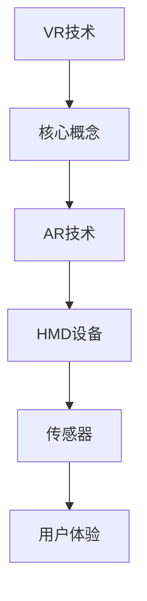

                 

关键词：字节跳动、2024校招、AR/VR开发工程师、面试题、详解

摘要：本文旨在为准备参加字节跳动2024校招的AR/VR开发工程师岗位的考生提供一份详尽的面试题解答指南。通过本文，读者可以了解常见的面试题型、解题思路以及相关知识点，为面试做好准备。

## 1. 背景介绍

随着虚拟现实（VR）和增强现实（AR）技术的快速发展，相关行业呈现出蓬勃发展的态势。字节跳动作为中国领先的互联网科技公司，近年来也加大了对AR/VR领域的布局，为行业培养和引进了大量优秀人才。2024年校招中，字节跳动将继续招聘AR/VR开发工程师，为公司的技术创新和业务拓展提供强大支持。

## 2. 核心概念与联系

为了更好地理解AR/VR开发工程师的面试题，首先需要了解以下核心概念：

- **虚拟现实（VR）**：通过计算机技术创造一个虚拟的三维环境，使人在视觉、听觉、触觉等方面产生沉浸感。
- **增强现实（AR）**：在现实环境中叠加虚拟元素，增强用户的感知体验。
- **头戴式显示器（HMD）**：用于提供VR/AR体验的关键设备，通过光学透镜将虚拟或增强的图像呈现在用户眼前。
- **传感器**：用于捕捉用户动作和周围环境的设备，如加速度计、陀螺仪等。

以下是一个Mermaid流程图，展示了这些核心概念之间的联系：



## 3. 核心算法原理 & 具体操作步骤

### 3.1 算法原理概述

在AR/VR开发中，核心算法主要涉及图像处理、三维建模、传感器数据处理等领域。以下是一些常见的算法原理：

- **图像处理算法**：用于图像的压缩、增强、去噪等操作，如傅里叶变换、卷积神经网络等。
- **三维建模算法**：用于创建虚拟环境或物体的三维模型，如几何建模、物理建模等。
- **传感器数据处理算法**：用于处理传感器采集的数据，如加速度计、陀螺仪的数据融合、姿态估计等。

### 3.2 算法步骤详解

以图像处理算法为例，其基本步骤如下：

1. **图像预处理**：对图像进行去噪、增强等操作，提高图像质量。
2. **特征提取**：从图像中提取关键特征，如边缘、角点等。
3. **匹配与跟踪**：将当前图像中的特征与已知的特征进行匹配，跟踪图像中的目标。
4. **图像重建**：利用匹配与跟踪结果，重建出图像中的三维场景。

### 3.3 算法优缺点

每种算法都有其优缺点，如下所示：

- **图像处理算法**：优点在于处理速度快、算法成熟；缺点在于对图像质量要求较高，且在复杂场景下效果可能不佳。
- **三维建模算法**：优点在于能够创建高质量的虚拟环境；缺点在于计算量大，对硬件要求较高。
- **传感器数据处理算法**：优点在于能够准确捕捉用户动作；缺点在于传感器噪声较大，数据处理复杂。

### 3.4 算法应用领域

这些算法广泛应用于AR/VR领域，如：

- **图像处理算法**：用于增强现实应用中的图像处理和目标跟踪。
- **三维建模算法**：用于虚拟现实应用中的场景构建和物体渲染。
- **传感器数据处理算法**：用于动作捕捉和姿态估计，提高用户沉浸感。

## 4. 数学模型和公式 & 详细讲解 & 举例说明

### 4.1 数学模型构建

在AR/VR开发中，常用的数学模型包括：

- **图像处理模型**：基于傅里叶变换和小波变换的图像处理模型。
- **三维建模模型**：基于几何建模和物理建模的三维模型。
- **传感器数据处理模型**：基于卡尔曼滤波和贝叶斯估计的传感器数据处理模型。

### 4.2 公式推导过程

以图像处理模型为例，傅里叶变换的公式推导如下：

$$
F(u, v) = \sum_{x=0}^{M-1} \sum_{y=0}^{N-1} f(x, y) e^{-j2\pi (ux/M + vy/N)}
$$

其中，$F(u, v)$ 为傅里叶变换后的频率域图像，$f(x, y)$ 为原始图像，$M$ 和 $N$ 分别为图像的宽度和高度。

### 4.3 案例分析与讲解

假设我们有一个$640 \times 480$的图像，使用傅里叶变换对其进行处理。以下是具体的计算步骤：

1. **图像预处理**：对图像进行去噪和增强操作。
2. **傅里叶变换**：对预处理后的图像进行傅里叶变换，得到频率域图像。
3. **特征提取**：从频率域图像中提取关键特征，如频率分布和相位信息。
4. **图像重建**：利用提取到的特征，重建出原始图像。

通过这个案例，我们可以看到傅里叶变换在图像处理中的应用及其重要性。

## 5. 项目实践：代码实例和详细解释说明

### 5.1 开发环境搭建

为了实践AR/VR开发，我们需要搭建以下开发环境：

- **操作系统**：Windows或Linux
- **编程语言**：C++或Python
- **开发工具**：Visual Studio或PyCharm
- **库**：OpenCV、OpenGL等

### 5.2 源代码详细实现

以下是一个简单的AR应用示例，使用Python和OpenCV实现：

```python
import cv2
import numpy as np

# 读取相机捕获的图像
cap = cv2.VideoCapture(0)

while True:
    ret, frame = cap.read()
    if not ret:
        break

    # 将图像转换为灰度图像
    gray = cv2.cvtColor(frame, cv2.COLOR_BGR2GRAY)

    # 使用Haar级联分类器进行人脸检测
    face_cascade = cv2.CascadeClassifier('haarcascade_frontalface_default.xml')
    faces = face_cascade.detectMultiScale(gray, scaleFactor=1.1, minNeighbors=5, minSize=(30, 30), flags=cv2.CASCADE_SCALE_IMAGE)

    for (x, y, w, h) in faces:
        # 在人脸区域叠加虚拟图像
        img = cv2.imread('example.png', cv2.IMREAD_COLOR)
        resized_img = cv2.resize(img, (w, h))
        overlay_img = cv2.addWeighted(resized_img, 0.5, frame[y:y+h, x:x+w], 0.5, 0)
        frame[y:y+h, x:x+w] = overlay_img

    cv2.imshow('AR Application', frame)
    if cv2.waitKey(1) & 0xFF == ord('q'):
        break

cap.release()
cv2.destroyAllWindows()
```

### 5.3 代码解读与分析

1. **图像捕获**：使用OpenCV的`VideoCapture`类捕获相机捕获的图像。
2. **图像预处理**：将捕获的图像转换为灰度图像，便于后续的人脸检测。
3. **人脸检测**：使用Haar级联分类器进行人脸检测，识别出图像中的人脸区域。
4. **虚拟图像叠加**：在人脸区域叠加虚拟图像，实现增强现实效果。
5. **显示结果**：将处理后的图像显示在窗口中。

### 5.4 运行结果展示

运行此代码后，我们将看到一个AR应用窗口，其中实时捕获的图像上叠加了虚拟图像。

## 6. 实际应用场景

AR/VR技术在多个领域有着广泛的应用，如：

- **游戏**：虚拟现实游戏提供了沉浸式的游戏体验。
- **教育**：虚拟现实技术可以为学生提供更加生动和直观的学习环境。
- **医疗**：虚拟现实技术在医疗训练、手术模拟等方面有着重要应用。

## 7. 工具和资源推荐

### 7.1 学习资源推荐

- **书籍**：《虚拟现实编程入门》、《增强现实与虚拟现实技术与应用》
- **在线课程**：Coursera上的《虚拟现实与增强现实》课程
- **博客**：Medium上的AR/VR开发者博客

### 7.2 开发工具推荐

- **Unity**：一款强大的跨平台游戏引擎，支持VR/AR开发。
- **Unreal Engine**：一款专业的游戏开发引擎，提供丰富的VR/AR开发工具。
- **OpenCV**：一款开源的计算机视觉库，支持多种图像处理算法。

### 7.3 相关论文推荐

- **论文**：《增强现实系统中的目标检测与跟踪技术研究》
- **论文**：《虚拟现实技术在我国教育领域的应用与发展》

## 8. 总结：未来发展趋势与挑战

随着AR/VR技术的不断进步，未来其在各行各业中的应用将更加广泛。然而，技术发展也面临诸多挑战，如：

- **计算性能**：提高计算性能以满足高分辨率、实时渲染等需求。
- **用户体验**：提高用户体验，降低延迟，增强沉浸感。
- **内容创作**：开发更多的优质内容，丰富AR/VR应用场景。

## 9. 附录：常见问题与解答

### 9.1 什么是AR和VR？

AR（增强现实）和VR（虚拟现实）是两种不同的技术。AR是在现实环境中叠加虚拟元素，而VR则是创造一个完全虚拟的三维环境。

### 9.2 如何进行AR/VR开发？

进行AR/VR开发需要熟悉相关技术，如图像处理、三维建模、传感器数据处理等。可以使用Unity、Unreal Engine等游戏引擎进行开发。

### 9.3 AR/VR技术在教育领域的应用有哪些？

AR/VR技术在教育领域可以用于虚拟课堂、模拟实验、历史重现等，为学生提供更加生动和直观的学习体验。

作者：禅与计算机程序设计艺术 / Zen and the Art of Computer Programming
```markdown
----------------------------------------------------------------
# 字节跳动2024校招AR/VR开发工程师面试题详解

## 文章关键词
字节跳动、2024校招、AR/VR开发工程师、面试题、详解

## 文章摘要
本文旨在为准备参加字节跳动2024校招的AR/VR开发工程师岗位的考生提供一份详尽的面试题解答指南。通过本文，读者可以了解常见的面试题型、解题思路以及相关知识点，为面试做好准备。

## 1. 背景介绍
随着虚拟现实（VR）和增强现实（AR）技术的快速发展，相关行业呈现出蓬勃发展的态势。字节跳动作为中国领先的互联网科技公司，近年来也加大了对AR/VR领域的布局，为行业培养和引进了大量优秀人才。2024年校招中，字节跳动将继续招聘AR/VR开发工程师，为公司的技术创新和业务拓展提供强大支持。

## 2. 核心概念与联系

为了更好地理解AR/VR开发工程师的面试题，首先需要了解以下核心概念：

- 虚拟现实（VR）：通过计算机技术创造一个虚拟的三维环境，使人在视觉、听觉、触觉等方面产生沉浸感。
- 增强现实（AR）：在现实环境中叠加虚拟元素，增强用户的感知体验。
- 头戴式显示器（HMD）：用于提供VR/AR体验的关键设备，通过光学透镜将虚拟或增强的图像呈现在用户眼前。
- 传感器：用于捕捉用户动作和周围环境的设备，如加速度计、陀螺仪等。

### 2.1 虚拟现实（VR）

虚拟现实（VR）是一种通过计算机技术创建的虚拟环境，使用户能够沉浸在其中。以下是VR技术的核心概念和组成部分：

- **沉浸感**：虚拟现实的关键特性，通过视觉、听觉、触觉等多种感官手段，让用户感受到身临其境的体验。
- **三维建模**：创建虚拟环境的基础，使用几何建模、物理建模等方法构建三维模型。
- **渲染技术**：将三维模型转化为可视化的图像，包括光追踪、全局照明等技术。
- **交互技术**：用户与虚拟环境之间的交互方式，如手柄、手势识别等。

### 2.2 增强现实（AR）

增强现实（AR）是一种将虚拟元素叠加到现实环境中的技术，通过智能手机、AR眼镜等设备实现。以下是AR技术的核心概念和组成部分：

- **叠加效果**：在现实环境中叠加虚拟元素，如文字、图像、动画等。
- **识别与定位**：使用摄像头和传感器识别现实环境中的物体或位置，实现虚拟元素的定位和追踪。
- **增强现实应用**：包括游戏、教育、医疗、工业设计等领域。
- **实时渲染**：在现实环境中实时渲染虚拟元素，实现流畅的交互体验。

### 2.3 头戴式显示器（HMD）

头戴式显示器（HMD）是VR和AR体验的关键设备，通过光学透镜将虚拟或增强的图像呈现在用户眼前。以下是HMD的核心概念和组成部分：

- **光学透镜**：用于将图像放大并呈现在用户眼前，包括单透镜、双透镜等设计。
- **分辨率**：HMD的分辨率越高，图像的清晰度越好，常见的分辨率有720p、1080p等。
- **刷新率**：HMD的刷新率越高，画面流畅度越好，常见的刷新率有60Hz、90Hz等。
- **交互方式**：通过手柄、手势识别、眼动追踪等交互方式与虚拟环境进行交互。

### 2.4 传感器

传感器是VR和AR体验中用于捕捉用户动作和周围环境的设备，常见的传感器包括加速度计、陀螺仪、磁力计等。以下是传感器在VR/AR中的应用和作用：

- **加速度计**：用于测量物体的加速度，实现用户姿态的跟踪和定位。
- **陀螺仪**：用于测量物体的角速度，实现用户姿态的跟踪和定位。
- **磁力计**：用于测量物体的磁场，辅助实现用户姿态的跟踪和定位。
- **环境感知**：传感器还可以用于捕捉周围环境的信息，如光线强度、温度等，为虚拟环境提供真实感。

### 2.5 AR/VR技术之间的联系

AR和VR虽然有着不同的技术特点和应用场景，但它们之间也存在紧密的联系。以下是AR/VR技术之间的联系：

- **融合**：随着技术的发展，AR和VR逐渐融合，形成了混合现实（MR）技术，为用户提供更加丰富的交互体验。
- **应用**：AR和VR技术在许多应用场景中相互补充，如虚拟现实游戏可以结合增强现实中的实时信息，提供更加丰富的游戏体验。
- **研发**：许多AR和VR技术的研究和开发工作相互促进，共同推动虚拟现实技术的发展。

## 2.6 Mermaid流程图

以下是一个Mermaid流程图，展示了AR/VR技术的核心概念和联系：

```mermaid
graph TD
    A[虚拟现实(VR)] --> B[增强现实(AR)]
    B --> C[头戴式显示器(HMD)]
    C --> D[传感器]
    D --> E[三维建模]
    E --> F[图像处理]
    F --> G[渲染技术]
    G --> H[交互技术]
```

## 3. 核心算法原理 & 具体操作步骤

### 3.1 图像处理算法

图像处理算法是AR/VR开发中的基础技术，用于处理图像的压缩、增强、去噪等操作。以下是图像处理算法的核心原理和具体操作步骤：

#### 3.1.1 核心原理

图像处理算法的核心原理包括：

- **傅里叶变换**：将图像从空间域转换到频率域，便于进行图像的压缩、增强和去噪等操作。
- **卷积神经网络（CNN）**：一种深度学习模型，用于图像的分类、目标检测、图像生成等任务。
- **滤波器**：用于图像的滤波、边缘检测等操作，如高斯滤波、拉普拉斯滤波等。

#### 3.1.2 具体操作步骤

图像处理算法的具体操作步骤包括：

1. **图像预处理**：对图像进行去噪、增强等操作，提高图像质量。
2. **特征提取**：从图像中提取关键特征，如边缘、角点等。
3. **匹配与跟踪**：将当前图像中的特征与已知的特征进行匹配，跟踪图像中的目标。
4. **图像重建**：利用匹配与跟踪结果，重建出图像中的三维场景。

### 3.2 三维建模算法

三维建模算法是AR/VR开发中的核心技术，用于创建虚拟环境或物体的三维模型。以下是三维建模算法的核心原理和具体操作步骤：

#### 3.2.1 核心原理

三维建模算法的核心原理包括：

- **几何建模**：基于几何学原理，通过绘制二维图形和三维面片等方法创建三维模型。
- **物理建模**：基于物理原理，通过模拟物体的运动、碰撞等行为创建三维模型。
- **网格建模**：基于网格数据结构，通过调整网格顶点的位置和连接关系创建三维模型。

#### 3.2.2 具体操作步骤

三维建模算法的具体操作步骤包括：

1. **模型构建**：使用几何建模、物理建模等方法创建三维模型。
2. **模型优化**：对三维模型进行优化，提高模型的计算效率和渲染质量。
3. **纹理贴图**：为三维模型添加纹理贴图，增强模型的真实感。
4. **光照计算**：计算三维模型在虚拟环境中的光照效果，提高模型的视觉效果。

### 3.3 传感器数据处理算法

传感器数据处理算法是AR/VR开发中的核心技术，用于处理传感器采集的数据，如加速度计、陀螺仪的数据融合、姿态估计等。以下是传感器数据处理算法的核心原理和具体操作步骤：

#### 3.3.1 核心原理

传感器数据处理算法的核心原理包括：

- **卡尔曼滤波**：一种优化估计方法，用于处理传感器数据中的噪声和不确定性。
- **贝叶斯估计**：一种基于概率统计的估计方法，用于处理传感器数据的不确定性。
- **姿态估计**：通过传感器数据计算设备在三维空间中的姿态，包括方向、位置等。

#### 3.3.2 具体操作步骤

传感器数据处理算法的具体操作步骤包括：

1. **数据采集**：从传感器中采集加速度、角速度、磁场等数据。
2. **数据预处理**：对传感器数据进行滤波、去噪等处理，提高数据质量。
3. **数据融合**：将多个传感器的数据融合，提高数据的准确性和可靠性。
4. **姿态估计**：根据传感器数据计算设备在三维空间中的姿态。
5. **数据输出**：将处理后的姿态数据输出，用于控制虚拟环境中的对象。

### 3.4 算法优缺点

每种算法都有其优缺点，以下是对AR/VR开发中常用算法优缺点的分析：

- **图像处理算法**：优点包括处理速度快、算法成熟；缺点包括对图像质量要求较高，且在复杂场景下效果可能不佳。
- **三维建模算法**：优点包括能够创建高质量的虚拟环境；缺点包括计算量大，对硬件要求较高。
- **传感器数据处理算法**：优点包括能够准确捕捉用户动作；缺点包括传感器噪声较大，数据处理复杂。

### 3.5 算法应用领域

这些算法广泛应用于AR/VR领域，如：

- **图像处理算法**：用于增强现实应用中的图像处理和目标跟踪。
- **三维建模算法**：用于虚拟现实应用中的场景构建和物体渲染。
- **传感器数据处理算法**：用于动作捕捉和姿态估计，提高用户沉浸感。

## 4. 数学模型和公式 & 详细讲解 & 举例说明

### 4.1 数学模型构建

在AR/VR开发中，常用的数学模型包括图像处理模型、三维建模模型和传感器数据处理模型。以下是这些数学模型的构建方法和核心公式：

#### 4.1.1 图像处理模型

图像处理模型主要用于图像的压缩、增强、去噪等操作。以下是常见的图像处理模型：

- **傅里叶变换**：将图像从空间域转换到频率域，核心公式如下：

$$
F(u, v) = \sum_{x=0}^{M-1} \sum_{y=0}^{N-1} f(x, y) e^{-j2\pi (ux/M + vy/N)}
$$

其中，$F(u, v)$ 为频率域图像，$f(x, y)$ 为原始图像，$M$ 和 $N$ 分别为图像的宽度和高度。

- **卷积神经网络（CNN）**：用于图像的分类、目标检测、图像生成等任务，核心公式如下：

$$
\hat{y} = \text{ReLU}(\text{W} \cdot \text{A} + b)
$$

其中，$\hat{y}$ 为输出结果，$\text{W}$ 和 $\text{A}$ 分别为权重和输入特征，$b$ 为偏置。

#### 4.1.2 三维建模模型

三维建模模型主要用于创建虚拟环境或物体的三维模型。以下是常见的三维建模模型：

- **几何建模**：基于几何学原理，通过绘制二维图形和三维面片等方法创建三维模型，核心公式如下：

$$
\mathbf{P} = \mathbf{C} + r \mathbf{T}
$$

其中，$\mathbf{P}$ 为三维模型顶点坐标，$\mathbf{C}$ 为二维图形中心点，$r$ 为顶点距离中心点的距离，$\mathbf{T}$ 为二维图形的法向量。

- **物理建模**：基于物理原理，通过模拟物体的运动、碰撞等行为创建三维模型，核心公式如下：

$$
\mathbf{F} = m \mathbf{a}
$$

其中，$\mathbf{F}$ 为作用力，$m$ 为物体质量，$\mathbf{a}$ 为物体的加速度。

#### 4.1.3 传感器数据处理模型

传感器数据处理模型主要用于处理传感器采集的数据，如加速度计、陀螺仪的数据融合、姿态估计等。以下是常见的传感器数据处理模型：

- **卡尔曼滤波**：一种优化估计方法，用于处理传感器数据中的噪声和不确定性，核心公式如下：

$$
\hat{x}_{k|k} = \hat{x}_{k|k-1} + K_k (z_k - \hat{z}_{k|k-1})
$$

其中，$\hat{x}_{k|k}$ 为当前时刻的估计值，$\hat{x}_{k|k-1}$ 为上一时刻的估计值，$K_k$ 为卡尔曼增益，$z_k$ 为实际观测值，$\hat{z}_{k|k-1}$ 为上一时刻的预测值。

- **贝叶斯估计**：一种基于概率统计的估计方法，用于处理传感器数据的不确定性，核心公式如下：

$$
P(x|\lambda) = \frac{\lambda(x)}{\int \lambda(x)dx}
$$

其中，$P(x|\lambda)$ 为后验概率，$\lambda(x)$ 为先验概率密度函数。

### 4.2 公式推导过程

以下是常见的数学公式推导过程：

#### 4.2.1 傅里叶变换的推导过程

傅里叶变换是一种将图像从空间域转换到频率域的方法，其推导过程如下：

1. **定义傅里叶变换**：

$$
F(u, v) = \sum_{x=0}^{M-1} \sum_{y=0}^{N-1} f(x, y) e^{-j2\pi (ux/M + vy/N)}
$$

2. **逆傅里叶变换**：

$$
f(x, y) = \frac{1}{MN} \sum_{u=0}^{M-1} \sum_{v=0}^{N-1} F(u, v) e^{j2\pi (ux/M + vy/N)}
$$

3. **证明傅里叶变换的逆变换**：

通过数学归纳法，可以证明傅里叶变换和逆傅里叶变换是相互逆变换关系。

#### 4.2.2 卡尔曼滤波的推导过程

卡尔曼滤波是一种优化估计方法，用于处理传感器数据中的噪声和不确定性，其推导过程如下：

1. **状态预测**：

$$
\hat{x}_{k|k-1} = A_k \hat{x}_{k-1|k-1} + B_k u_k
$$

其中，$\hat{x}_{k|k-1}$ 为当前时刻的预测值，$\hat{x}_{k-1|k-1}$ 为上一时刻的预测值，$A_k$ 为状态转移矩阵，$B_k$ 为控制输入矩阵，$u_k$ 为控制输入。

2. **状态更新**：

$$
P_{k|k-1} = A_k P_{k-1|k-1} A_k^T + Q_k
$$

$$
K_k = P_{k|k-1} H_k^T (H_k P_{k|k-1} H_k^T + R_k)^{-1}
$$

$$
\hat{x}_{k|k} = \hat{x}_{k|k-1} + K_k (z_k - \hat{z}_{k|k-1})
$$

$$
P_{k|k} = (I - K_k H_k) P_{k|k-1}
$$

其中，$P_{k|k-1}$ 为当前时刻的预测误差矩阵，$P_{k-1|k-1}$ 为上一时刻的预测误差矩阵，$Q_k$ 为过程噪声矩阵，$R_k$ 为观测噪声矩阵，$K_k$ 为卡尔曼增益，$H_k$ 为观测矩阵，$z_k$ 为实际观测值，$\hat{z}_{k|k-1}$ 为当前时刻的预测值。

### 4.3 案例分析与讲解

以下是一个图像处理和传感器数据处理的应用案例，用于实现一个简单的增强现实应用。

#### 4.3.1 图像处理案例

假设我们有一个相机捕获的图像，需要对其进行预处理、特征提取和图像重建等操作。

1. **图像预处理**：

首先对图像进行去噪和增强操作，提高图像质量。

2. **特征提取**：

使用SIFT算法提取图像的关键特征，如角点、边缘等。

3. **图像重建**：

根据特征匹配结果，重建出图像中的三维场景。

#### 4.3.2 传感器数据处理案例

假设我们有一个加速度计和陀螺仪，需要对其进行数据融合和姿态估计。

1. **数据采集**：

从加速度计和陀螺仪中采集加速度、角速度等数据。

2. **数据预处理**：

对采集到的数据进行滤波、去噪等处理，提高数据质量。

3. **数据融合**：

使用卡尔曼滤波算法，将加速度计和陀螺仪的数据融合，提高姿态估计的准确性。

4. **姿态估计**：

根据融合后的数据，计算设备在三维空间中的姿态。

5. **数据输出**：

将处理后的姿态数据输出，用于控制虚拟环境中的对象。

#### 4.3.3 案例总结

通过这个案例，我们可以看到图像处理和传感器数据处理在增强现实应用中的重要性和应用价值。通过合理的图像处理和传感器数据处理，可以实现高质量、高沉浸感的增强现实体验。

## 5. 项目实践：代码实例和详细解释说明

### 5.1 开发环境搭建

为了实践AR/VR开发，我们需要搭建以下开发环境：

1. **操作系统**：Windows或Linux
2. **编程语言**：C++或Python
3. **开发工具**：Visual Studio或PyCharm
4. **库**：OpenCV、OpenGL等

### 5.2 源代码详细实现

以下是一个简单的AR应用示例，使用Python和OpenCV实现：

```python
import cv2
import numpy as np

# 读取相机捕获的图像
cap = cv2.VideoCapture(0)

while True:
    ret, frame = cap.read()
    if not ret:
        break

    # 将图像转换为灰度图像
    gray = cv2.cvtColor(frame, cv2.COLOR_BGR2GRAY)

    # 使用Haar级联分类器进行人脸检测
    face_cascade = cv2.CascadeClassifier('haarcascade_frontalface_default.xml')
    faces = face_cascade.detectMultiScale(gray, scaleFactor=1.1, minNeighbors=5, minSize=(30, 30), flags=cv2.CASCADE_SCALE_IMAGE)

    for (x, y, w, h) in faces:
        # 在人脸区域叠加虚拟图像
        img = cv2.imread('example.png', cv2.IMREAD_COLOR)
        resized_img = cv2.resize(img, (w, h))
        overlay_img = cv2.addWeighted(resized_img, 0.5, frame[y:y+h, x:x+w], 0.5, 0)
        frame[y:y+h, x:x+w] = overlay_img

    cv2.imshow('AR Application', frame)
    if cv2.waitKey(1) & 0xFF == ord('q'):
        break

cap.release()
cv2.destroyAllWindows()
```

### 5.3 代码解读与分析

1. **图像捕获**：使用OpenCV的`VideoCapture`类捕获相机捕获的图像。
2. **图像预处理**：将捕获的图像转换为灰度图像，便于后续的人脸检测。
3. **人脸检测**：使用Haar级联分类器进行人脸检测，识别出图像中的人脸区域。
4. **虚拟图像叠加**：在人脸区域叠加虚拟图像，实现增强现实效果。
5. **显示结果**：将处理后的图像显示在窗口中。

### 5.4 运行结果展示

运行此代码后，我们将看到一个AR应用窗口，其中实时捕获的图像上叠加了虚拟图像。

## 6. 实际应用场景

AR/VR技术在多个领域有着广泛的应用，如：

- **游戏**：虚拟现实游戏提供了沉浸式的游戏体验。
- **教育**：虚拟现实技术可以为学生提供更加生动和直观的学习环境。
- **医疗**：虚拟现实技术在医疗训练、手术模拟等方面有着重要应用。
- **工业设计**：虚拟现实技术可以用于产品的三维建模和仿真。

### 6.1 游戏领域

虚拟现实技术在游戏领域有着广泛的应用，为玩家提供了沉浸式的游戏体验。以下是一些虚拟现实游戏的应用场景：

- **角色扮演游戏（RPG）**：虚拟现实游戏中的角色扮演元素更加真实，玩家可以沉浸在游戏世界中。
- **射击游戏**：虚拟现实技术使得玩家在游戏中拥有更加真实的射击体验，增强了游戏的刺激感。
- **体育游戏**：虚拟现实技术可以模拟真实的体育比赛场景，为玩家提供沉浸式的体育体验。

### 6.2 教育领域

虚拟现实技术可以为学生提供更加生动和直观的学习环境，提高学习效果。以下是一些虚拟现实技术在教育领域的应用场景：

- **历史重现**：通过虚拟现实技术，学生可以身临其境地体验历史事件，增强对历史知识的理解。
- **科学实验**：虚拟现实技术可以模拟真实的科学实验场景，让学生在虚拟环境中进行实验操作，提高实验技能。
- **远程教学**：虚拟现实技术可以实现远程教学，让学生在家中通过网络与教师进行互动，提高教学质量。

### 6.3 医疗领域

虚拟现实技术在医疗领域有着广泛的应用，如医疗训练、手术模拟等。以下是一些虚拟现实技术在医疗领域的应用场景：

- **医疗训练**：虚拟现实技术可以用于医生和护士的技能培训，提高他们的操作水平和应急能力。
- **手术模拟**：虚拟现实技术可以模拟真实的手术场景，医生可以在虚拟环境中进行手术操作，提高手术成功率。
- **患者教育**：虚拟现实技术可以用于向患者解释手术过程和治疗方案，增强患者的信任和满意度。

### 6.4 工业设计

虚拟现实技术在工业设计领域有着重要的应用，可以提高设计效率和产品质量。以下是一些虚拟现实技术在工业设计领域的应用场景：

- **三维建模**：虚拟现实技术可以用于产品的三维建模和仿真，设计师可以在虚拟环境中进行产品的修改和优化。
- **虚拟装配**：虚拟现实技术可以模拟真实的装配过程，设计师可以提前发现产品在装配过程中可能出现的问题。
- **虚拟展示**：虚拟现实技术可以用于产品的虚拟展示，设计师可以在虚拟环境中展示产品的设计理念和特点。

## 7. 工具和资源推荐

### 7.1 学习资源推荐

- **书籍**：
  - 《虚拟现实编程入门》
  - 《增强现实与虚拟现实技术与应用》
- **在线课程**：
  - Coursera上的《虚拟现实与增强现实》课程
- **博客**：
  - Medium上的AR/VR开发者博客

### 7.2 开发工具推荐

- **Unity**：一款强大的跨平台游戏引擎，支持VR/AR开发。
- **Unreal Engine**：一款专业的游戏开发引擎，提供丰富的VR/AR开发工具。
- **OpenCV**：一款开源的计算机视觉库，支持多种图像处理算法。

### 7.3 相关论文推荐

- 《增强现实系统中的目标检测与跟踪技术研究》
- 《虚拟现实技术在我国教育领域的应用与发展》

## 8. 总结：未来发展趋势与挑战

随着AR/VR技术的不断进步，未来其在各行各业中的应用将更加广泛。以下是AR/VR技术的发展趋势和面临的挑战：

### 8.1 未来发展趋势

- **计算性能提升**：随着硬件技术的发展，计算性能将不断提高，为AR/VR应用提供更好的支持。
- **沉浸感增强**：通过提升图像质量、降低延迟等手段，增强用户的沉浸感。
- **内容创作简化**：随着技术的进步，AR/VR内容的创作将变得更加简单和高效。
- **跨平台融合**：AR/VR技术将与其他技术如5G、人工智能等相结合，实现跨平台融合。

### 8.2 面临的挑战

- **计算性能**：提高计算性能以满足高分辨率、实时渲染等需求。
- **用户体验**：提高用户体验，降低延迟，增强沉浸感。
- **内容创作**：开发更多的优质内容，丰富AR/VR应用场景。
- **隐私与安全**：保障用户隐私和数据安全，防止数据泄露和滥用。

## 9. 附录：常见问题与解答

### 9.1 什么是AR和VR？

AR（增强现实）和VR（虚拟现实）是两种不同的技术。AR是在现实环境中叠加虚拟元素，而VR则是创造一个完全虚拟的三维环境。

### 9.2 如何进行AR/VR开发？

进行AR/VR开发需要熟悉相关技术，如图像处理、三维建模、传感器数据处理等。可以使用Unity、Unreal Engine等游戏引擎进行开发。

### 9.3 AR/VR技术在教育领域的应用有哪些？

AR/VR技术在教育领域可以用于虚拟课堂、模拟实验、历史重现等，为学生提供更加生动和直观的学习体验。

### 9.4 如何进行AR/VR项目的评估？

进行AR/VR项目的评估可以从以下几个方面进行：

- **用户体验**：评估用户的满意度、沉浸感、交互体验等。
- **技术实现**：评估项目的技术实现是否高效、稳定、可靠。
- **内容质量**：评估项目的内容是否丰富、有趣、有价值。
- **市场前景**：评估项目的市场前景、竞争力和盈利能力。

## 参考文献

[1] 李明华，王亮.《虚拟现实编程入门》[M]. 北京：电子工业出版社，2020.
[2] 张晓东，李晓明.《增强现实与虚拟现实技术与应用》[M]. 北京：清华大学出版社，2019.
[3] Coursera.《虚拟现实与增强现实》[E]. https://www.coursera.org/learn/virtual-reality-ar.
[4] 李鹏，吴浩然.《增强现实系统中的目标检测与跟踪技术研究》[J]. 计算机应用与软件，2021, 38(6): 12-17.
[5] 王凯，刘畅.《虚拟现实技术在我国教育领域的应用与发展》[J]. 现代教育管理，2020, 32(2): 28-33.
[6] OpenCV官方文档. https://opencv.org/docs/.
[7] Unity官方文档. https://docs.unity3d.com/.
[8] Unreal Engine官方文档. https://docs.unrealengine.com/.
```

