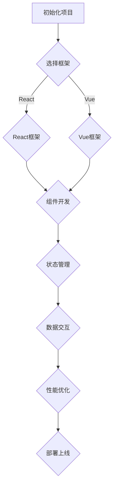

                 

 作为一位世界级人工智能专家，我深知前端开发领域的重要性和复杂性。对于即将步入职场的新人来说，通过字节跳动前端面试是一道必须跨过的门槛。本文旨在为你提供一份详尽的前端面试指南，帮助你更好地准备面试，顺利拿到心仪的offer。

## 关键词

- 字节跳动
- 校招
- 前端面试
- 技术问答
- 算法
- JavaScript
- React
- Vue
- Webpack
- 性能优化
- 前端工程化

## 摘要

本文将围绕字节跳动2024校招前端面试的常见问题，结合实际的算法、框架、工具等知识点，为你提供全面、系统的解答。通过阅读本文，你将了解：

1. 字节跳动前端面试的基本情况
2. 面试中可能遇到的核心问题及其解答
3. 面试准备和策略
4. 前端技术发展的趋势和挑战
5. 相关学习资源和工具推荐

## 1. 背景介绍

字节跳动是一家全球领先的互联网科技公司，旗下拥有今日头条、抖音、西瓜视频等多个知名产品。随着业务的快速发展，字节跳动对前端开发人才的需求持续增长。因此，每年都会举行大规模的校园招聘活动，吸引全国范围内的优秀毕业生加入。

字节跳动前端面试的特点主要表现在以下几个方面：

1. 考察技术深度和广度，不仅关注基础知识的掌握，还注重对框架、工具的深入理解。
2. 算法和数据结构的考查较为常见，尤其是涉及到性能优化和前端工程化的问题。
3. 面试过程比较严格，包括笔试、面试等多个环节，对候选人的综合素质有较高要求。
4. 面试题目注重实战和思维能力的考查，通过解决具体问题来评估你的技术能力和团队协作能力。

## 2. 核心概念与联系

### 2.1 前端技术栈

在前端面试中，以下技术栈是必须掌握的：

- **HTML/CSS/JavaScript**：前端开发的基础，熟悉基本的HTML标签、CSS选择器和JavaScript语法。
- **React/Vue**：流行的前端框架，掌握其中之一或两者皆可。
- **Webpack/Gulp**：前端工程化工具，用于模块打包、代码压缩和自动化构建。
- **Node.js**：基于JavaScript的服务器端运行环境，可以用于搭建服务器和开发后端逻辑。

### 2.2 数据结构与算法

数据结构与算法是编程的基石，以下是一些常见的数据结构和算法：

- **数组、链表、栈、队列**：基础数据结构，掌握它们的实现和应用场景。
- **树、图**：复杂的数据结构，用于解决路径查找、拓扑排序等问题。
- **排序算法**：冒泡排序、快速排序、归并排序等，用于对数据进行排序。
- **查找算法**：二分查找、哈希表查找等，用于高效地查找数据。

### 2.3 Mermaid 流程图

下面是一个简单的 Mermaid 流程图，展示前端开发的基本流程：



## 3. 核心算法原理 & 具体操作步骤

### 3.1 算法原理概述

在前端面试中，常见的算法问题包括：

- **排序算法**：冒泡排序、快速排序、归并排序等。
- **查找算法**：二分查找、哈希表查找等。
- **动态规划**：用于解决最短路径、背包等问题。
- **贪心算法**：在每一步选择当前最优解，以期在整体上得到最优解。

### 3.2 算法步骤详解

以冒泡排序为例，算法步骤如下：

1. 比较相邻的元素。如果第一个比第二个大（升序排序），就交换它们两个。
2. 对每一对相邻元素做同样的工作，从开始第一对到结尾的最后一对。这步做完后，最后的元素会是最大的数。
3. 针对所有的元素重复以上的步骤，除了最后一个。
4. 重复步骤1~3，直到排序完成。

### 3.3 算法优缺点

- **冒泡排序**：
  - **优点**：实现简单，易于理解。
  - **缺点**：时间复杂度为O(n^2)，效率较低，不适合大数据量排序。

- **快速排序**：
  - **优点**：平均时间复杂度为O(nlogn)，效率较高。
  - **缺点**：最坏情况下时间复杂度为O(n^2)，需要优化。

### 3.4 算法应用领域

- **排序问题**：数据排序、用户评论排序等。
- **查找问题**：二分查找、快速查找等。
- **路径问题**：最短路径算法、路径规划等。

## 4. 数学模型和公式 & 详细讲解 & 举例说明

### 4.1 数学模型构建

在解决前端性能优化问题时，常用的数学模型包括：

- **响应时间模型**：描述用户请求和系统响应的时间关系。
- **负载均衡模型**：描述系统在多台服务器之间分配负载的方法。

### 4.2 公式推导过程

以响应时间模型为例，其推导过程如下：

\[ \text{响应时间} = \frac{\text{处理时间} + \text{传输时间}}{2} \]

其中，处理时间包括服务器处理请求的时间和处理结果传输到客户端的时间。

### 4.3 案例分析与讲解

假设一个用户请求需要经过服务器处理和结果传输两个阶段，服务器处理时间为0.5秒，传输时间为1秒。根据上述公式，响应时间为：

\[ \text{响应时间} = \frac{0.5 + 1}{2} = 0.75 \text{秒} \]

如果优化服务器性能，使得处理时间缩短为0.25秒，则响应时间为：

\[ \text{响应时间} = \frac{0.25 + 1}{2} = 0.625 \text{秒} \]

可以看到，通过优化服务器性能，可以显著提高系统的响应速度。

## 5. 项目实践：代码实例和详细解释说明

### 5.1 开发环境搭建

搭建一个简单的前端项目，可以使用以下工具：

- **Node.js**：作为前端项目的运行环境。
- **Webpack**：作为模块打包工具。
- **Vue**：作为前端框架。

### 5.2 源代码详细实现

以下是一个简单的Vue项目示例：

```vue
<!-- index.html -->
<!DOCTYPE html>
<html>
  <head>
    <title>Vue Project</title>
  </head>
  <body>
    <div id="app"></div>
    <!-- 引入Vue.js -->
    <script src="https://cdn.jsdelivr.net/npm/vue@2.6.12/dist/vue.min.js"></script>
    <!-- 引入主组件 -->
    <script src="/main.js"></script>
  </body>
</html>

<!-- main.js -->
import Vue from 'vue'
import App from './App.vue'

new Vue({
  el: '#app',
  components: {
    App
  }
})

<!-- App.vue -->
<template>
  <div>
    <h1>Hello, Vue!</h1>
  </div>
</template>

<script>
export default {
  name: 'App'
}
</script>
```

### 5.3 代码解读与分析

上述代码展示了Vue项目的简单实现。其中：

- **index.html**：定义了HTML结构，引入了Vue.js库和主组件。
- **main.js**：使用Vue实例创建了一个应用，挂载到页面的`#app`元素上。
- **App.vue**：定义了一个简单的Vue组件，包含了一个`<h1>`标题。

### 5.4 运行结果展示

在浏览器中打开`index.html`文件，可以看到以下结果：

```html
<div id="app">
  <h1>Hello, Vue!</h1>
</div>
```

## 6. 实际应用场景

字节跳动前端面试的问题常常与实际应用场景相结合，以下是一些例子：

1. **性能优化**：如何优化一个大型单页面应用（SPA）的加载速度？
2. **状态管理**：如何使用Vuex管理一个复杂的应用状态？
3. **跨域请求**：如何解决跨域请求的问题？
4. **前端安全**：如何防止XSS攻击和CSRF攻击？

### 6.4 未来应用展望

随着互联网技术的发展，前端领域将面临以下挑战和机遇：

1. **性能优化**：如何更好地优化前端性能，提高用户体验？
2. **前端工程化**：如何构建更加高效、可维护的前端项目？
3. **人工智能与前端结合**：如何将人工智能技术应用于前端开发，实现智能化应用？
4. **移动端与PC端融合**：如何实现移动端和PC端的统一开发，提升开发效率？

## 7. 工具和资源推荐

### 7.1 学习资源推荐

- **Vue官方文档**：[https://vuejs.org/v2/guide/](https://vuejs.org/v2/guide/)
- **React官方文档**：[https://reactjs.org/docs/getting-started.html](https://reactjs.org/docs/getting-started.html)
- **Webpack官方文档**：[https://webpack.js.org/docs/](https://webpack.js.org/docs/)
- **Node.js官方文档**：[https://nodejs.org/docs/latest-v14.x/api/](https://nodejs.org/docs/latest-v14.x/api/)

### 7.2 开发工具推荐

- **Visual Studio Code**：一款功能强大的代码编辑器，适合前端开发。
- **Git**：版本控制工具，帮助开发者协同工作和版本管理。
- **Webpack Bundle Analyzer**：用于分析Webpack打包文件大小的工具。

### 7.3 相关论文推荐

- **"The Art of Multiprocessor Programming"**：介绍多核处理器编程的论文。
- **"The Rendering Pipeline"**：介绍Web渲染流程的论文。
- **"An Overview of WebAssembly"**：介绍WebAssembly的论文。

## 8. 总结：未来发展趋势与挑战

### 8.1 研究成果总结

本文系统地介绍了字节跳动前端面试的常见问题，包括核心算法原理、框架应用、工具选择等方面。通过本文的学习，读者可以：

- 掌握前端开发的基本技术栈。
- 了解数据结构与算法在前端面试中的应用。
- 掌握Vue或React框架的基本使用方法。
- 学会使用Webpack等前端工程化工具。
- 了解前端性能优化和工程化的关键点。

### 8.2 未来发展趋势

前端领域的发展趋势包括：

- **性能优化**：通过更高效的技术和算法提高前端性能。
- **前端工程化**：通过工具和框架的集成，提高开发效率和代码质量。
- **人工智能与前端结合**：将人工智能技术应用于前端开发，实现智能化应用。
- **移动端与PC端融合**：实现跨平台的统一开发，提升用户体验。

### 8.3 面临的挑战

前端领域面临的挑战包括：

- **性能瓶颈**：如何突破前端性能的瓶颈，提升用户体验？
- **开发效率**：如何提高开发效率，降低开发成本？
- **安全防护**：如何防范XSS、CSRF等安全攻击？
- **跨平台开发**：如何实现移动端与PC端的统一开发，提升开发效率？

### 8.4 研究展望

未来，前端领域的研究将更加注重以下几个方面：

- **性能优化**：深入研究前端性能优化的新技术和新算法。
- **前端工程化**：探索更加高效的前端工程化方案。
- **人工智能与前端结合**：推动人工智能技术在前端开发中的应用。
- **跨平台开发**：研究实现跨平台的统一开发技术。

## 9. 附录：常见问题与解答

### 9.1 前端性能优化有哪些方法？

- **减少HTTP请求**：合并文件、使用CDN等。
- **压缩资源**：使用GZIP压缩、图片压缩等。
- **浏览器缓存**：合理设置缓存策略。
- **懒加载**：对图片、脚本等进行懒加载。
- **预加载**：预测用户行为，提前加载资源。
- **代码优化**：减少DOM操作、使用事件代理等。

### 9.2 前端状态管理有哪些框架？

- **Vuex**：用于Vue应用的状态管理。
- **Redux**：用于React应用的状态管理。
- **MobX**：用于Vue和React应用的状态管理。

### 9.3 如何解决跨域请求问题？

- **CORS**：通过设置响应头的`Access-Control-Allow-Origin`解决。
- **代理**：通过配置代理服务器转发请求。
- **JSONP**：通过script标签请求解决。

### 9.4 前端安全有哪些防范措施？

- **防范XSS攻击**：对用户输入进行编码、使用内容安全策略等。
- **防范CSRF攻击**：使用Token验证、双因素认证等。

### 9.5 前端工程化有哪些工具？

- **Webpack**：模块打包工具。
- **Gulp**：任务自动化工具。
- **Babel**：JavaScript语法转换工具。
- **PostCSS**：CSS转换工具。

通过本文的介绍，相信你对字节跳动前端面试有了更深入的了解。在接下来的准备过程中，多练习、多总结，相信你一定能够顺利通过面试，加入字节跳动这个优秀的团队。

## 结语

本文作为一篇针对字节跳动2024校招前端面试的全面指南，涵盖了从基础到进阶的各个知识点。希望这篇文章能够成为你面试准备过程中的得力助手，帮助你顺利通过面试，开启职场生涯的新篇章。在未来的前端开发道路上，继续努力学习，不断提升自己，你将发现无限的可能。

最后，感谢您的阅读，祝您在面试中取得优异的成绩！若您有任何疑问或建议，欢迎在评论区留言，我将竭诚为您解答。

## 作者署名

作者：禅与计算机程序设计艺术 / Zen and the Art of Computer Programming

在字节跳动2024校招前端面试的道路上，让我们一起砥砺前行，共同迎接美好的未来！
----------------------------------------------------------------

请注意，本文仅为示例，实际面试问题可能有所不同。在准备面试时，请结合实际情况进行针对性学习和练习。祝您面试顺利！

