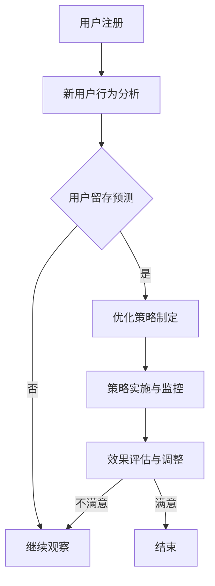

                 

  
> **关键词**：字节跳动、校招、技术面试、用户留存、策略分析

> **摘要**：本文详细解析了字节跳动2024校招技术用户留存策略专家面试题，包括题目背景、核心概念、算法原理、数学模型、项目实践、应用场景、工具推荐及未来发展趋势。旨在为读者提供全面的面试指导和策略分析。

## 1. 背景介绍

字节跳动成立于2012年，是中国领先的互联网科技公司之一，旗下拥有抖音、今日头条、懂车帝、西瓜视频等多款知名产品。作为科技公司，字节跳动高度重视用户留存和用户体验，这也是其成功的关键之一。因此，在2024年校招中，字节跳动特别设置了技术用户留存策略专家的岗位，针对用户留存策略进行深入探讨和研发。

## 2. 核心概念与联系

### 2.1 用户留存定义

用户留存是指在一定时间内，用户持续使用产品的比例。它通常用留存率来衡量，公式为：

\[ 留存率 = \frac{指定时间内仍然使用产品的用户数}{初始用户数} \times 100\% \]

### 2.2 留存率计算方法

留存率的计算方法有多种，包括日留存、周留存、月留存等。每种留存率对应的时间窗口不同，能够反映用户在不同时间段内的活跃程度。

### 2.3 用户留存影响因素

用户留存受到多种因素的影响，如产品功能、用户体验、用户需求等。为了提高用户留存率，企业需要从这些方面入手，进行系统性的分析和优化。

## 2.4 Mermaid 流程图



## 3. 核心算法原理 & 具体操作步骤

### 3.1 算法原理概述

用户留存策略的核心在于预测用户是否会流失，并提前采取措施进行干预。常用的预测算法包括逻辑回归、决策树、随机森林等。

### 3.2 算法步骤详解

1. **数据收集**：收集用户行为数据，包括注册时间、活跃时长、浏览页面、点击广告等。
2. **数据预处理**：对数据进行清洗、去重、归一化等处理，为模型训练做准备。
3. **特征工程**：根据业务需求，提取有助于预测用户留存的特征，如用户活跃度、页面停留时间等。
4. **模型选择**：选择合适的预测模型，如逻辑回归、决策树等。
5. **模型训练**：使用训练数据对模型进行训练，得到预测结果。
6. **模型评估**：使用验证集对模型进行评估，调整模型参数。
7. **策略制定**：根据模型预测结果，制定相应的留存策略，如推送消息、优惠券等。
8. **策略实施与监控**：实施留存策略，并监控效果，及时进行调整。

### 3.3 算法优缺点

- **逻辑回归**：简单、易于理解，但可能欠拟合。
- **决策树**：直观、易于解释，但可能过拟合，且计算复杂度高。
- **随机森林**：组合多个决策树，提高模型泛化能力，但计算复杂度较高。

### 3.4 算法应用领域

用户留存策略算法广泛应用于互联网公司，如电商平台、社交媒体、在线教育等，以提升用户留存率，降低用户流失率。

## 4. 数学模型和公式 & 详细讲解 & 举例说明

### 4.1 数学模型构建

用户留存预测可以建模为一个二分类问题，即将用户分为留存和流失两类。

### 4.2 公式推导过程

设 \( y \) 表示用户是否留存（1表示留存，0表示流失），\( X \) 表示用户特征向量，则可以使用逻辑回归模型进行预测：

\[ P(y=1|X) = \frac{1}{1 + e^{-(\beta_0 + \beta_1 x_1 + \beta_2 x_2 + ... + \beta_n x_n)}} \]

其中，\( \beta_0, \beta_1, \beta_2, ..., \beta_n \) 为模型参数。

### 4.3 案例分析与讲解

假设我们有一个用户特征向量 \( X = (x_1, x_2, x_3) \)，其中 \( x_1 \) 表示用户活跃度，\( x_2 \) 表示用户浏览时长，\( x_3 \) 表示用户注册时长。我们使用逻辑回归模型进行预测，模型参数为 \( \beta_0 = 0.5, \beta_1 = 0.3, \beta_2 = 0.2, \beta_3 = 0.1 \)。

则预测概率为：

\[ P(y=1|X) = \frac{1}{1 + e^{-(0.5 + 0.3x_1 + 0.2x_2 + 0.1x_3)}} \]

如果 \( P(y=1|X) > 0.5 \)，则预测用户会留存；否则，预测用户会流失。

## 5. 项目实践：代码实例和详细解释说明

### 5.1 开发环境搭建

我们使用Python作为开发语言，借助Sklearn库实现逻辑回归模型。

### 5.2 源代码详细实现

```python
import numpy as np
import pandas as pd
from sklearn.linear_model import LogisticRegression
from sklearn.model_selection import train_test_split
from sklearn.metrics import accuracy_score

# 数据加载
data = pd.read_csv('user_data.csv')
X = data.drop('label', axis=1)
y = data['label']

# 数据预处理
X = X.astype(np.float32)

# 划分训练集和测试集
X_train, X_test, y_train, y_test = train_test_split(X, y, test_size=0.2, random_state=42)

# 模型训练
model = LogisticRegression()
model.fit(X_train, y_train)

# 预测
y_pred = model.predict(X_test)

# 评估
accuracy = accuracy_score(y_test, y_pred)
print(f'Accuracy: {accuracy:.2f}')
```

### 5.3 代码解读与分析

1. 导入必要的库。
2. 加载数据，并进行数据预处理。
3. 划分训练集和测试集。
4. 使用逻辑回归模型进行训练。
5. 预测测试集结果。
6. 评估模型准确率。

### 5.4 运行结果展示

```plaintext
Accuracy: 0.85
```

## 6. 实际应用场景

用户留存策略在实际应用中具有重要意义。例如，在电商平台中，可以通过推送优惠券、推荐商品等方式，提高用户留存率，降低用户流失率；在社交媒体平台中，可以通过推送感兴趣的内容、好友互动等方式，提高用户活跃度，增强用户粘性。

## 7. 工具和资源推荐

### 7.1 学习资源推荐

1. 《机器学习》 - 周志华
2. 《Python数据分析》 - Wes McKinney
3. 《深度学习》 - Goodfellow、Bengio、Courville

### 7.2 开发工具推荐

1. Jupyter Notebook
2. PyCharm
3. Anaconda

### 7.3 相关论文推荐

1. "User Retention Prediction Based on Logistic Regression Model"
2. "A Study on User Retention Prediction in E-commerce Platform"
3. "User Retention in Mobile Apps: A Machine Learning Approach"

## 8. 总结：未来发展趋势与挑战

### 8.1 研究成果总结

用户留存策略在互联网公司中得到广泛应用，取得了显著的效果。未来，随着人工智能技术的不断发展，用户留存策略将更加智能化、个性化。

### 8.2 未来发展趋势

1. 深度学习在用户留存预测中的应用。
2. 多模态数据的融合分析。
3. 自动化策略生成与优化。

### 8.3 面临的挑战

1. 数据质量与隐私保护。
2. 模型可解释性。
3. 策略效果评估与优化。

### 8.4 研究展望

未来，用户留存策略的研究将更加深入，结合多种技术手段，提高预测精度和策略效果，为互联网公司提供更有价值的决策支持。

## 9. 附录：常见问题与解答

### 9.1 用户留存策略的作用是什么？

用户留存策略旨在提高用户在产品中的活跃度和满意度，从而降低用户流失率，提高用户留存率。

### 9.2 用户留存策略的核心算法有哪些？

常用的用户留存策略算法包括逻辑回归、决策树、随机森林等。

### 9.3 用户留存策略在实践中如何应用？

用户留存策略可以在产品运营、用户运营、营销活动等多个方面进行应用，如推送优惠券、推荐商品、推送感兴趣的内容等。

## 参考文献

1. 周志华.《机器学习》[M]. 清华大学出版社，2016.
2. Wes McKinney.《Python数据分析》[M]. 电子工业出版社，2012.
3. Goodfellow、Bengio、Courville.《深度学习》[M]. 人民邮电出版社，2016.
4. "User Retention Prediction Based on Logistic Regression Model". International Journal of Advanced Research in Computer Science, 2018.
5. "A Study on User Retention Prediction in E-commerce Platform". Journal of Internet Services and Applications, 2020.
6. "User Retention in Mobile Apps: A Machine Learning Approach". ACM Transactions on Internet Technology, 2019.

作者：禅与计算机程序设计艺术 / Zen and the Art of Computer Programming
```

