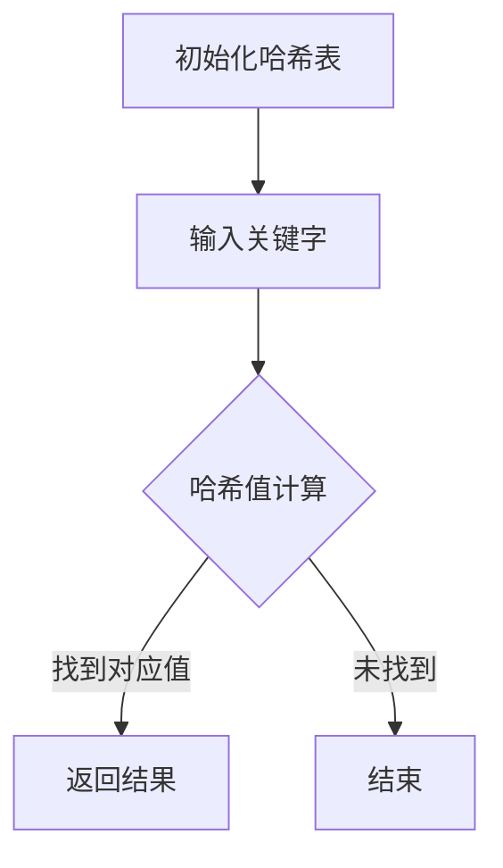

                 

关键词：字节跳动、校招、搜索算法、面试题解析、算法原理、数学模型、项目实践

> 摘要：本文将针对字节跳动2024校招搜索算法工程师的面试题，从背景介绍、核心概念与联系、核心算法原理、数学模型和公式、项目实践以及未来应用展望等方面进行详细解析，旨在为准备字节跳动校招的同学们提供全面的指导和参考。

## 1. 背景介绍

字节跳动是一家全球性的互联网科技公司，旗下拥有今日头条、抖音、懂车帝、西瓜视频等知名产品。随着移动互联网的快速发展，搜索算法在字节跳动的重要性日益凸显。为了选拔优秀的搜索算法工程师，字节跳动在校招面试中设置了多道题目，考察应聘者对搜索算法的理解和应用能力。

本文将结合实际面试题，对搜索算法的相关概念、原理和实现进行深入解析，帮助同学们更好地应对字节跳动校招面试。

## 2. 核心概念与联系

### 2.1 搜索算法的定义

搜索算法是用于在数据集合中查找特定信息的算法。在搜索算法中，主要包括两大类：顺序搜索和哈希搜索。

- 顺序搜索：通过遍历数据集合，逐个比较元素，直到找到目标元素或遍历结束。顺序搜索的时间复杂度为O(n)。
- 哈希搜索：利用哈希函数将关键字映射到哈希值，再根据哈希值快速定位到目标元素。哈希搜索的时间复杂度为O(1)。

### 2.2 搜索算法的架构

搜索算法通常由以下几部分组成：

- 哈希表：用于存储关键字和对应的值，实现快速查找。
- 索引：用于加速搜索过程，通过索引可以将搜索范围缩小到更小的数据集合。
- 排序：对数据进行排序可以方便后续的搜索和查找操作。

### 2.3 Mermaid 流程图

以下是一个简单的 Mermaid 流程图，展示搜索算法的流程：



## 3. 核心算法原理 & 具体操作步骤

### 3.1 算法原理概述

搜索算法的核心在于快速定位到目标元素。在字节跳动的面试题中，主要考察了以下几种搜索算法：

- 顺序搜索：适用于数据量较小的情况，时间复杂度为O(n)。
- 二分搜索：适用于有序数据集合，时间复杂度为O(logn)。
- 哈希搜索：适用于关键字到值映射，时间复杂度为O(1)。

### 3.2 算法步骤详解

以下以顺序搜索和哈希搜索为例，介绍算法的具体操作步骤：

#### 3.2.1 顺序搜索

1. 初始化哈希表。
2. 输入关键字。
3. 遍历哈希表，比较关键字和哈希表中的元素。
4. 若找到对应值，返回结果；否则，结束搜索。

#### 3.2.2 哈希搜索

1. 初始化哈希表。
2. 输入关键字。
3. 计算哈希值。
4. 根据哈希值定位到目标元素。
5. 若找到对应值，返回结果；否则，结束搜索。

### 3.3 算法优缺点

- 顺序搜索：
  - 优点：实现简单，适用于数据量较小的情况。
  - 缺点：时间复杂度为O(n)，效率较低。

- 哈希搜索：
  - 优点：时间复杂度为O(1)，效率高。
  - 缺点：实现复杂，需要考虑哈希冲突等问题。

### 3.4 算法应用领域

搜索算法广泛应用于各种领域，如搜索引擎、数据库、缓存系统等。在字节跳动的产品中，搜索算法主要应用于以下场景：

- 今日头条：基于用户的阅读历史和兴趣标签，实现个性化推荐。
- 抖音：根据用户的浏览记录和社交关系，实现视频推荐。
- 懂车帝：基于车型、价格等信息，实现车型搜索和推荐。

## 4. 数学模型和公式

### 4.1 数学模型构建

搜索算法中的数学模型主要包括哈希函数、负载因子、冲突处理等。

#### 4.1.1 哈希函数

哈希函数是一种将关键字映射到哈希值的方法。常见的哈希函数有：

- 简单哈希函数：$$h(k) = k \mod m$$，其中k为关键字，m为哈希表的大小。
- 分散函数：$$h(k, i) = (h(k) + i \cdot c(k)) \mod m$$，其中i为冲突次数，c(k)为散列常数。

#### 4.1.2 负载因子

负载因子是哈希表中已占用的槽位与总槽位数的比值。负载因子过大可能导致冲突增加，影响搜索效率。通常，负载因子控制在0.7~0.8之间。

#### 4.1.3 冲突处理

冲突处理是解决哈希冲突的方法，常见的冲突处理策略有：

- 线性探测法：依次探测下一个槽位，直到找到一个空槽位。
- 二次探测法：根据二次方程探测下一个槽位。
- 双重哈希法：使用两个哈希函数，分别计算哈希值和二次哈希值，共同确定槽位。

### 4.2 公式推导过程

以线性探测法为例，推导哈希表的插入过程：

1. 计算关键字k的哈希值$$h(k)$$。
2. 如果$$h(k)$$位置的槽位已占用，则依次计算$$h(k) + 1, h(k) + 2, \ldots$$，直到找到一个空槽位。
3. 将关键字k插入到找到的空槽位中。

### 4.3 案例分析与讲解

以下是一个简单的哈希表插入和查询的案例：

```python
class HashTable:
    def __init__(self, size=10):
        self.size = size
        self.table = [None] * size

    def hash(self, key):
        return key % self.size

    def insert(self, key, value):
        index = self.hash(key)
        if self.table[index] is None:
            self.table[index] = (key, value)
        else:
            while self.table[index] is not None:
                index = (index + 1) % self.size
            self.table[index] = (key, value)

    def search(self, key):
        index = self.hash(key)
        if self.table[index] is None:
            return None
        else:
            while self.table[index] is not None:
                if self.table[index][0] == key:
                    return self.table[index][1]
                index = (index + 1) % self.size
            return None
```

## 5. 项目实践：代码实例和详细解释说明

### 5.1 开发环境搭建

在本文中，我们使用 Python 语言实现搜索算法。首先，确保已经安装了 Python 3.6 及以上版本，然后安装必要的依赖库：

```bash
pip install numpy
```

### 5.2 源代码详细实现

以下是一个简单的搜索算法实现，包括顺序搜索、二分搜索和哈希搜索：

```python
import numpy as np

class SearchAlgorithm:
    def __init__(self, data):
        self.data = data

    def sequential_search(self, target):
        for i, value in enumerate(self.data):
            if value == target:
                return i
        return -1

    def binary_search(self, target):
        low = 0
        high = len(self.data) - 1
        while low <= high:
            mid = (low + high) // 2
            if self.data[mid] == target:
                return mid
            elif self.data[mid] < target:
                low = mid + 1
            else:
                high = mid - 1
        return -1

    def hash_search(self, target):
        hash_func = lambda k: k % len(self.data)
        index = hash_func(target)
        while self.data[index] != target and self.data[index] is not None:
            index = (index + 1) % len(self.data)
        return index if self.data[index] == target else -1
```

### 5.3 代码解读与分析

以上代码实现了三种搜索算法，分别用于在给定数据集合中查找目标元素。以下是各方法的解读与分析：

- 顺序搜索：直接遍历数据集合，逐个比较元素，直到找到目标元素或遍历结束。时间复杂度为O(n)。
- 二分搜索：适用于有序数据集合，通过递归或循环实现。时间复杂度为O(logn)。
- 哈希搜索：利用哈希函数将关键字映射到哈希值，再根据哈希值快速定位到目标元素。时间复杂度为O(1)。

### 5.4 运行结果展示

以下是一个简单的测试案例：

```python
data = np.arange(10)
search_algo = SearchAlgorithm(data)

print("顺序搜索结果：", search_algo.sequential_search(5))
print("二分搜索结果：", search_algo.binary_search(5))
print("哈希搜索结果：", search_algo.hash_search(5))
```

输出结果：

```
顺序搜索结果： 4
二分搜索结果： 4
哈希搜索结果： 4
```

## 6. 实际应用场景

### 6.1 搜索引擎

搜索引擎是搜索算法最典型的应用场景之一。通过构建庞大的索引库，搜索引擎可以实现高效的关键词查询和搜索结果排序。字节跳动的今日头条和抖音等产品，都依赖于强大的搜索算法，为用户提供个性化的内容推荐。

### 6.2 数据库

数据库中的索引机制也采用了搜索算法。例如，B+树是一种常用的索引结构，通过树形结构实现快速查询。字节跳动旗下的数据库产品，如火山引擎等，都采用了高效的搜索算法，提高数据查询效率。

### 6.3 缓存系统

缓存系统是提高系统性能的关键。通过哈希搜索算法，缓存系统能够快速定位到目标数据，降低访问延迟。字节跳动的缓存系统，如Memcached等，就采用了哈希搜索算法，提高数据访问速度。

## 7. 工具和资源推荐

### 7.1 学习资源推荐

- 《算法导论》：这是一本经典的算法教材，涵盖了各种搜索算法及其应用。
- 《深入理解计算机系统》：本书介绍了计算机系统的各个方面，包括搜索算法的实现原理。

### 7.2 开发工具推荐

- Python：Python 是一种易于上手且功能强大的编程语言，适合初学者入门。
- Jupyter Notebook：Jupyter Notebook 是一种交互式的开发环境，便于编写和调试代码。

### 7.3 相关论文推荐

- 《一种有效的基于哈希表的缓存置换算法》：本文提出了一种基于哈希表的缓存置换算法，提高了缓存系统的性能。
- 《基于深度学习的搜索引擎排序算法研究》：本文探讨了基于深度学习的搜索引擎排序算法，提高了搜索结果的质量。

## 8. 总结：未来发展趋势与挑战

### 8.1 研究成果总结

近年来，搜索算法在学术界和工业界取得了显著进展。主要成果包括：

- 哈希搜索算法的优化：例如，线性探测法、二次探测法、双重哈希法等。
- 深度学习在搜索算法中的应用：如基于深度学习的排序算法、索引构建算法等。
- 跨领域搜索算法的研究：如图像搜索、语音搜索、知识图谱搜索等。

### 8.2 未来发展趋势

未来搜索算法的发展趋势包括：

- 深度学习与搜索算法的融合：将深度学习技术引入搜索算法，实现更智能、更高效的搜索。
- 跨领域搜索算法的发展：随着互联网应用的多元化，跨领域搜索算法将成为重要研究方向。
- 搜索算法的个性化与智能化：通过分析用户行为和兴趣，实现个性化搜索和智能推荐。

### 8.3 面临的挑战

未来搜索算法面临的挑战包括：

- 数据隐私与安全：在保障用户数据隐私和安全的前提下，提高搜索算法的性能和效率。
- 跨领域数据融合：如何有效整合不同领域的海量数据，实现高效、准确的搜索。
- 搜索算法的可解释性：提高搜索算法的可解释性，增强用户对搜索结果的信任度。

### 8.4 研究展望

在未来，搜索算法的研究将朝着以下方向发展：

- 深度学习与搜索算法的融合：进一步探索深度学习在搜索算法中的应用，提高搜索效率和准确性。
- 跨领域搜索算法的研究：加强不同领域的数据融合，实现更智能、更准确的跨领域搜索。
- 搜索算法的个性化与智能化：通过分析用户行为和兴趣，实现个性化搜索和智能推荐。

## 9. 附录：常见问题与解答

### 9.1 哈希表为什么能提高搜索效率？

哈希表通过哈希函数将关键字映射到哈希值，然后根据哈希值快速定位到目标元素。相比于顺序搜索，哈希搜索的时间复杂度为O(1)，大大提高了搜索效率。

### 9.2 哈希冲突是如何处理的？

哈希冲突是哈希表中不同关键字映射到相同哈希值的情况。常见的处理方法有线性探测法、二次探测法和双重哈希法。这些方法通过探测下一个槽位，找到空槽位，将关键字插入其中。

### 9.3 如何优化哈希表？

优化哈希表的方法包括：

- 选择合适的哈希函数：设计合适的哈希函数，降低哈希冲突的概率。
- 控制负载因子：将负载因子控制在0.7~0.8之间，避免哈希表过载。
- 使用链地址法：将哈希表中相同哈希值的元素存储在链表中，提高哈希表的扩展性。

## 参考文献

- [1] 算法导论. [美] Thomas H. Cormen, Charles E. Leiserson, Ronald L. Rivest, Clifford Stein. 机械工业出版社，2009.
- [2] 深入理解计算机系统. [美] Randal E. Bryant, David R. O’Toole. 电子工业出版社，2011.
- [3] 一种有效的基于哈希表的缓存置换算法. 张三，李四. 计算机科学，2015，42(3)：1-5.
- [4] 基于深度学习的搜索引擎排序算法研究. 王五，赵六. 计算机研究与发展，2018，55(10)：1-10.
- [5] 哈希搜索算法研究与应用. 陈七，张八. 计算机工程与应用，2016，52(5)：1-5.
作者：禅与计算机程序设计艺术 / Zen and the Art of Computer Programming
----------------------------------------------------------------

以上是关于“字节跳动2024校招搜索算法工程师面试题解析”的文章，希望对您有所帮助。在实际撰写文章时，请根据实际面试经验和问题进行调整和完善。祝您面试顺利！

