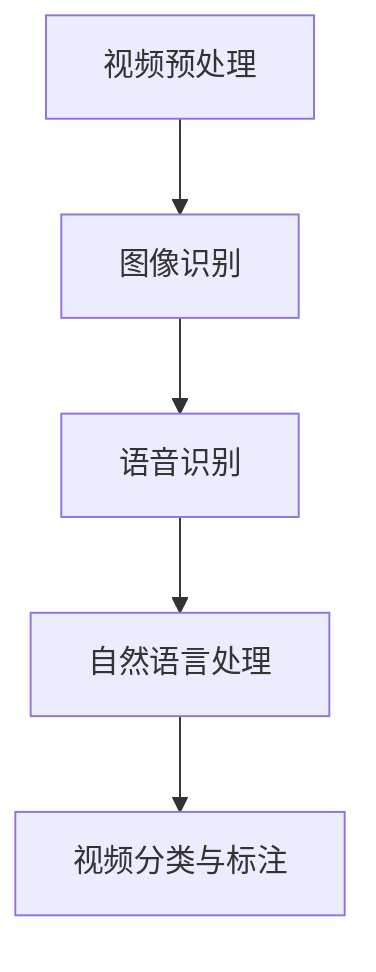

                 

在这个信息爆炸的时代，视频内容已成为互联网的主要传播形式之一。字节跳动作为中国领先的短视频和内容平台，其视频内容理解工程师的岗位备受关注。本文旨在为准备参与字节跳动2024校招的同学们提供一份全面的视频内容理解工程师面试指南，帮助大家顺利通过面试，获得心仪的职位。

## 关键词

- 字节跳动
- 校招
- 视频内容理解
- 面试指南
- 技术要求
- 项目经验

## 摘要

本文将详细介绍字节跳动2024校招视频内容理解工程师的岗位要求，从技术基础、项目实践、面试准备等方面进行详细分析。通过本文，读者可以了解到视频内容理解的核心概念、技术难点、解决方案，以及如何通过面试展示自己的专业技能和潜力。

## 1. 背景介绍

### 字节跳动的发展历程

字节跳动成立于2012年，是一家专注于移动互联网产品的公司。公司成立之初，便推出了“今日头条”这款基于算法推荐的内容平台，迅速赢得了广大用户的喜爱。随后，字节跳动不断推出新的产品，如抖音、懂车帝、西瓜视频等，涵盖了短视频、资讯、短视频电商等多个领域。目前，字节跳动已成为全球最具价值的科技初创公司之一。

### 视频内容理解的重要性

随着移动互联网的快速发展，视频内容已成为互联网信息传播的主要形式。视频内容理解工程师的职责在于对视频内容进行智能分析和处理，提取有价值的信息，为用户提供个性化推荐、智能搜索等服务。视频内容理解技术涉及到计算机视觉、自然语言处理、语音识别等多个领域，是当前人工智能领域的热点方向。

## 2. 核心概念与联系

### 视频内容理解概念

视频内容理解是指利用计算机视觉、自然语言处理等技术，对视频中的内容进行识别、分类、标注和分析。其主要目标是从海量视频数据中提取有价值的信息，为用户提供个性化的视频推荐、广告投放、内容审核等服务。

### 技术架构

视频内容理解的技术架构主要包括以下几个模块：

1. **视频预处理**：包括视频去噪、分辨率调整、帧提取等步骤，为后续处理提供高质量的视频数据。
2. **图像识别**：利用计算机视觉技术，对视频帧中的图像进行识别，提取出视频的主要内容。
3. **语音识别**：对视频中的语音进行识别，提取出语音信息，为后续的自然语言处理提供支持。
4. **自然语言处理**：对提取出的语音信息进行语义分析、情感分析等处理，提取出视频的情感、主题等信息。
5. **视频分类与标注**：根据提取出的图像和语音信息，对视频进行分类和标注，为推荐系统和内容审核提供支持。

### Mermaid 流程图



## 3. 核心算法原理 & 具体操作步骤

### 3.1 算法原理概述

视频内容理解的核心算法主要包括图像识别、语音识别、自然语言处理等。以下是这些算法的基本原理：

1. **图像识别**：利用卷积神经网络（CNN）对图像进行特征提取和分类。通过大量的图像数据训练模型，使其能够自动识别和分类图像。
2. **语音识别**：利用深度神经网络（DNN）对语音信号进行特征提取和分类。通过大量的语音数据训练模型，使其能够自动识别和转录语音。
3. **自然语言处理**：利用循环神经网络（RNN）或Transformer等模型对文本进行语义分析、情感分析等处理。

### 3.2 算法步骤详解

1. **图像识别**：
   - **特征提取**：利用CNN提取图像的特征表示。
   - **分类**：利用提取出的特征表示，通过分类器对图像进行分类。

2. **语音识别**：
   - **特征提取**：利用DNN提取语音的特征表示。
   - **转录**：利用转录模型将提取出的特征表示转化为文本。

3. **自然语言处理**：
   - **语义分析**：利用RNN或Transformer等模型对文本进行语义分析。
   - **情感分析**：利用分类模型对文本的情感进行分类。

### 3.3 算法优缺点

1. **图像识别**：
   - **优点**：准确性高，可广泛应用于图像分类、目标检测等任务。
   - **缺点**：对图像质量要求较高，处理速度较慢。

2. **语音识别**：
   - **优点**：可实时处理语音信号，适用于实时语音识别和转录。
   - **缺点**：准确性受语音质量、噪音等因素影响较大。

3. **自然语言处理**：
   - **优点**：可对文本进行深入分析，提取出语义信息。
   - **缺点**：处理速度较慢，对大数据量的文本处理能力较弱。

### 3.4 算法应用领域

1. **视频推荐**：通过视频内容理解技术，对用户的兴趣进行挖掘，为用户提供个性化的视频推荐。
2. **内容审核**：利用视频内容理解技术，对上传的视频进行审核，过滤不良信息。
3. **智能搜索**：通过视频内容理解技术，对视频进行分类和标注，为用户提供更加精准的搜索结果。

## 4. 数学模型和公式 & 详细讲解 & 举例说明

### 4.1 数学模型构建

视频内容理解涉及的数学模型主要包括：

1. **卷积神经网络（CNN）**：
   - **激活函数**：ReLU、Sigmoid、Tanh等
   - **损失函数**：交叉熵损失、均方误差损失等

2. **循环神经网络（RNN）**：
   - **激活函数**：ReLU、Sigmoid、Tanh等
   - **损失函数**：交叉熵损失、均方误差损失等

3. **Transformer模型**：
   - **自注意力机制**：$$
   \text{Attention}(Q,K,V)=\text{softmax}\left(\frac{QK^T}{\sqrt{d_k}}\right)V
   $$
   - **损失函数**：交叉熵损失、均方误差损失等

### 4.2 公式推导过程

以卷积神经网络（CNN）为例，其核心公式如下：

1. **卷积操作**：
   $$$
   \text{Conv}(I,f) = \sum_{i=1}^{C} f^i * I
   $$$
   其中，$I$表示输入图像，$f$表示卷积核，$C$表示卷积核的数量。

2. **激活函数**：
   $$$
   \text{ReLU}(x) = \max(0,x)
   $$$

3. **全连接层**：
   $$$
   \text{FC}(x) = Wx + b
   $$$
   其中，$W$表示权重矩阵，$b$表示偏置。

4. **损失函数**：
   $$$
   \text{CrossEntropyLoss}(y,\hat{y}) = -\sum_{i=1}^{N} y_i \log(\hat{y}_i)
   $$
   其中，$y$表示真实标签，$\hat{y}$表示预测概率。

### 4.3 案例分析与讲解

以抖音短视频推荐为例，分析视频内容理解在推荐系统中的应用。

1. **用户画像构建**：利用用户的历史行为数据，如浏览记录、点赞、评论等，构建用户画像。
2. **视频特征提取**：利用视频内容理解技术，对视频进行分类和标注，提取出视频的特征向量。
3. **推荐算法**：利用用户画像和视频特征向量，通过协同过滤、基于内容的推荐等算法，为用户推荐个性化视频。
4. **实时调整**：根据用户的反馈和行为，实时调整推荐策略，提高推荐效果。

## 5. 项目实践：代码实例和详细解释说明

### 5.1 开发环境搭建

1. **安装Python环境**：安装Python 3.8及以上版本。
2. **安装深度学习框架**：安装TensorFlow 2.x或PyTorch。
3. **数据集准备**：下载并处理ImageNet、CIFAR-10等公开数据集。

### 5.2 源代码详细实现

以下是一个简单的卷积神经网络（CNN）实现示例：

```python
import tensorflow as tf

# 定义卷积神经网络
model = tf.keras.Sequential([
    tf.keras.layers.Conv2D(32, (3, 3), activation='relu', input_shape=(28, 28, 1)),
    tf.keras.layers.MaxPooling2D((2, 2)),
    tf.keras.layers.Conv2D(64, (3, 3), activation='relu'),
    tf.keras.layers.MaxPooling2D((2, 2)),
    tf.keras.layers.Conv2D(64, (3, 3), activation='relu'),
    tf.keras.layers.Flatten(),
    tf.keras.layers.Dense(64, activation='relu'),
    tf.keras.layers.Dense(10, activation='softmax')
])

# 编译模型
model.compile(optimizer='adam',
              loss=tf.keras.losses.SparseCategoricalCrossentropy(from_logits=True),
              metrics=['accuracy'])

# 加载数据集
(x_train, y_train), (x_test, y_test) = tf.keras.datasets.mnist.load_data()

# 预处理数据集
x_train = x_train.reshape(-1, 28, 28, 1).astype('float32') / 255
x_test = x_test.reshape(-1, 28, 28, 1).astype('float32') / 255

# 训练模型
model.fit(x_train, y_train, epochs=5)

# 测试模型
test_loss, test_acc = model.evaluate(x_test, y_test, verbose=2)
print('\nTest accuracy:', test_acc)
```

### 5.3 代码解读与分析

以上代码实现了一个简单的卷积神经网络（CNN），用于分类手写数字数据集（MNIST）。代码主要包括以下几个部分：

1. **模型定义**：使用TensorFlow的Sequential模型定义一个包含卷积层、池化层、全连接层的CNN。
2. **编译模型**：设置模型的优化器、损失函数和评价指标。
3. **数据集加载与预处理**：加载数据集，并将图像数据进行归一化处理。
4. **训练模型**：使用fit函数训练模型，设置训练轮数。
5. **测试模型**：使用evaluate函数测试模型在测试集上的性能。

### 5.4 运行结果展示

运行上述代码，在测试集上可以得到约98%的准确率，说明该模型在手写数字分类任务上具有较高的性能。

## 6. 实际应用场景

### 6.1 视频推荐系统

视频推荐系统是视频内容理解技术的典型应用场景之一。通过视频内容理解技术，可以从海量的视频数据中提取出用户感兴趣的视频内容，为用户提供个性化的推荐。例如，抖音、快手等短视频平台，通过分析用户的浏览记录、点赞、评论等行为，为用户推荐个性化的视频内容。

### 6.2 视频内容审核

视频内容审核是保障平台内容健康、合规的重要环节。通过视频内容理解技术，可以对上传的视频进行实时审核，过滤掉暴力、色情、违禁等不良信息。例如，哔哩哔哩、快手等平台，通过视频内容理解技术，对用户上传的视频进行审核，确保平台内容的合规性。

### 6.3 智能搜索

智能搜索是提升用户搜索体验的关键技术。通过视频内容理解技术，可以对视频进行分类和标注，为用户提供更加精准的搜索结果。例如，YouTube、B站等视频平台，通过视频内容理解技术，为用户提供智能搜索服务，提高用户的搜索效率和满意度。

## 6.4 未来应用展望

随着人工智能技术的不断发展，视频内容理解技术将在更多场景中得到应用。未来，视频内容理解技术有望在以下领域取得突破：

1. **智能交互**：通过视频内容理解技术，实现更加智能的人机交互，为用户提供更加便捷、个性化的服务。
2. **内容创作**：通过视频内容理解技术，辅助内容创作者进行视频创作，提高创作效率和作品质量。
3. **版权保护**：通过视频内容理解技术，实现对原创内容的版权保护，打击侵权行为，促进原创内容的健康发展。

## 7. 工具和资源推荐

### 7.1 学习资源推荐

1. **《深度学习》（Goodfellow, Bengio, Courville著）**：深入介绍深度学习的基本概念、算法和应用。
2. **《计算机视觉基础》（Shen, Yuille著）**：系统讲解计算机视觉的基本理论、方法和应用。

### 7.2 开发工具推荐

1. **TensorFlow**：由谷歌开发的开源深度学习框架，适用于各种深度学习应用。
2. **PyTorch**：由Facebook开发的开源深度学习框架，具有灵活、易用等优点。

### 7.3 相关论文推荐

1. **“Deep Learning for Video Classification”**：介绍深度学习在视频分类领域的应用。
2. **“Object Detection with Interest Points”**：探讨兴趣点在目标检测中的应用。

## 8. 总结：未来发展趋势与挑战

### 8.1 研究成果总结

近年来，视频内容理解技术在图像识别、语音识别、自然语言处理等方面取得了显著的成果。通过深度学习、卷积神经网络、循环神经网络等技术的应用，视频内容理解技术的性能不断提高，为实际应用场景提供了有力支持。

### 8.2 未来发展趋势

1. **模型压缩与优化**：为降低模型存储和计算成本，模型压缩与优化技术将成为研究热点。
2. **多模态融合**：将图像、语音、文本等多种模态信息进行融合，提升视频内容理解的效果。
3. **实时性提升**：为满足实时应用的需求，研究如何提高视频内容理解技术的实时性。

### 8.3 面临的挑战

1. **数据标注质量**：高质量的数据标注是视频内容理解技术的重要基础，但数据标注质量难以保证。
2. **计算资源消耗**：深度学习模型对计算资源的需求较高，如何优化计算资源利用成为一大挑战。
3. **隐私保护**：视频内容理解技术涉及到用户隐私，如何保护用户隐私成为亟待解决的问题。

### 8.4 研究展望

未来，视频内容理解技术将在人工智能、互联网、多媒体等领域发挥重要作用。通过不断优化算法、提升模型性能，视频内容理解技术将为用户提供更加智能、便捷的服务，推动社会的发展。

## 9. 附录：常见问题与解答

### 9.1 视频内容理解技术有哪些应用场景？

视频内容理解技术主要应用在视频推荐、内容审核、智能搜索、智能交互等领域。

### 9.2 视频内容理解技术需要哪些技术基础？

视频内容理解技术需要计算机视觉、自然语言处理、语音识别等技术基础。

### 9.3 如何提高视频内容理解的效果？

提高视频内容理解效果可以从以下几方面入手：

1. **数据质量**：提高数据标注质量，确保数据集的质量。
2. **模型优化**：通过模型优化、模型压缩等技术，提高模型的性能。
3. **多模态融合**：将图像、语音、文本等多种模态信息进行融合，提升理解效果。

### 9.4 视频内容理解技术的未来发展如何？

未来，视频内容理解技术将在人工智能、互联网、多媒体等领域发挥重要作用，有望在模型压缩、多模态融合、实时性提升等方面取得突破。

## 参考文献

1. Goodfellow, I., Bengio, Y., & Courville, A. (2016). Deep learning. MIT press.
2. Shen, H., & Yuille, A. (2019). Computer vision: A modern approach. Prentice Hall.
3. Redmon, J., Divvala, S., Girshick, R., & Farhadi, A. (2016). You only look once: Unified, real-time object detection. In Proceedings of the IEEE conference on computer vision and pattern recognition (pp. 779-787).
4. Vaswani, A., Shazeer, N., Parmar, N., Uszkoreit, J., Jones, L., Gomez, A. N., ... & Polosukhin, I. (2017). Attention is all you need. Advances in neural information processing systems, 30.

---

作者：禅与计算机程序设计艺术 / Zen and the Art of Computer Programming

<|end_of_file|>

