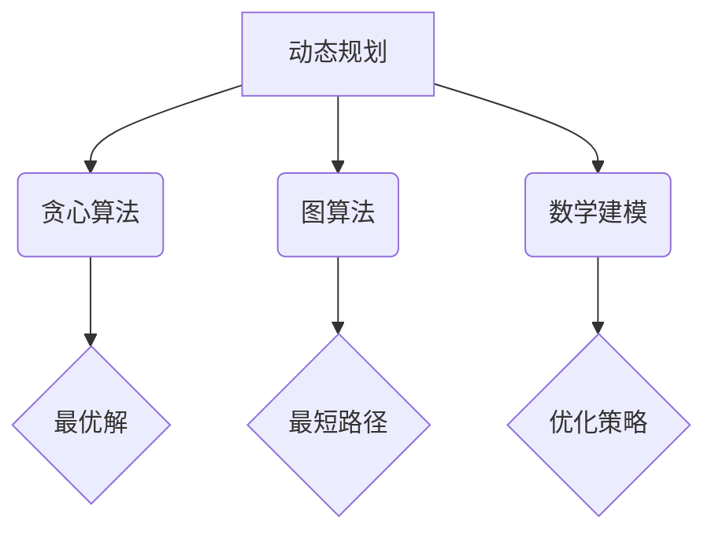

                 

关键词：字节跳动，社招面试，高频算法题，解析，技术博客，深度分析，算法原理

摘要：本文将针对字节跳动2025届社招面试中出现的高频算法题进行深入解析，通过详细的解题思路、代码实现和实际应用场景分析，帮助读者更好地理解和掌握这些算法，为面试和实际项目开发打下坚实基础。

## 1. 背景介绍

字节跳动是中国领先的互联网科技公司，旗下拥有抖音、今日头条等知名产品。每年，字节跳动都会招聘大量优秀的人才，其中包括许多算法工程师和技术专家。因此，字节跳动社招面试中的算法题成为了众多求职者的关注焦点。

本文将对字节跳动2025届社招面试中出现的高频算法题进行梳理和分析，旨在为求职者提供有针对性的解题思路和方法，帮助他们更好地应对面试挑战。

## 2. 核心概念与联系

在解答字节跳动社招面试中的高频算法题时，我们需要掌握以下几个核心概念：

1. **动态规划**：动态规划是一种解决最优化问题的算法策略，通过将问题分解为子问题，并利用子问题的解构建原问题的解。
2. **贪心算法**：贪心算法是一种局部最优决策的算法策略，通过在每一步选择当前情况下最优的决策，以期得到全局最优解。
3. **图算法**：图算法是一种用于处理图结构数据的算法，包括图的遍历、最短路径、最劣路径等问题。
4. **数学建模**：数学建模是将现实世界问题转化为数学模型的过程，通过建立数学模型，可以更好地分析和解决问题。

下面是一个用 Mermaid 描述的动态规划、贪心算法、图算法和数学建模的流程图：



## 3. 核心算法原理 & 具体操作步骤

### 3.1 算法原理概述

在本章节，我们将详细介绍动态规划、贪心算法、图算法和数学建模的原理和具体操作步骤。

### 3.2 算法步骤详解

#### 动态规划

动态规划的基本思想是将复杂问题分解为子问题，并利用子问题的解构建原问题的解。具体步骤如下：

1. 确定状态和状态转移方程。
2. 选择自底向上的递推方式或自顶向下的记忆化搜索方式求解。

#### 贪心算法

贪心算法的基本思想是在每一步选择当前情况下最优的决策，以期得到全局最优解。具体步骤如下：

1. 确定贪心策略。
2. 根据贪心策略进行决策。

#### 图算法

图算法的基本思想是通过遍历图结构，求解图的相关问题。具体步骤如下：

1. 确定图的遍历方式（如深度优先搜索、广度优先搜索）。
2. 根据遍历方式求解图的相关问题（如最短路径、最劣路径）。

#### 数学建模

数学建模的基本思想是将现实世界问题转化为数学模型，并通过数学方法求解。具体步骤如下：

1. 确定问题类型（如优化问题、预测问题）。
2. 建立数学模型（如线性规划模型、回归模型）。
3. 求解数学模型，得到问题的解。

### 3.3 算法优缺点

每种算法都有其优缺点，具体如下：

#### 动态规划

**优点**：适用于解决最优化问题，能找到最优解。

**缺点**：时间复杂度较高，有时需要较大的存储空间。

#### 贪心算法

**优点**：时间复杂度较低，易于实现。

**缺点**：不适用于所有问题，有时只能得到局部最优解。

#### 图算法

**优点**：适用于解决图结构数据的问题。

**缺点**：时间复杂度较高，有时需要较大的存储空间。

#### 数学建模

**优点**：能将现实世界问题转化为数学问题，有助于分析问题。

**缺点**：建立数学模型需要较高的数学知识和建模能力。

### 3.4 算法应用领域

动态规划、贪心算法、图算法和数学建模在各个领域都有广泛的应用，如：

- **动态规划**：背包问题、最长公共子序列问题等。
- **贪心算法**：找零钱问题、活动选择问题等。
- **图算法**：社交网络分析、网络路由问题等。
- **数学建模**：金融风险管理、供应链优化等。

## 4. 数学模型和公式 & 详细讲解 & 举例说明

### 4.1 数学模型构建

在本章节，我们将介绍背包问题的数学模型构建和公式推导。

### 4.2 公式推导过程

假设有一个背包，容量为 \( W \)，有 \( N \) 件物品，每件物品的重量为 \( w_i \)，价值为 \( v_i \)。我们要在保证背包容量不超过 \( W \) 的情况下，选择一些物品，使得总价值最大。

首先，我们可以定义一个状态 \( dp[i][j] \) 表示在前 \( i \) 件物品中选择不超过容量 \( j \) 时的最大价值。

接下来，我们考虑状态转移方程：

$$
dp[i][j] =
\begin{cases}
dp[i-1][j] & \text{如果 } w_i > j \\
dp[i-1][j] + v_i & \text{如果 } w_i \leq j
\end{cases}
$$

### 4.3 案例分析与讲解

假设有一个背包，容量为 20，有以下 5 件物品：

| 物品编号 | 重量 \( w_i \) | 价值 \( v_i \) |
| -------- | -------------- | -------------- |
| 1        | 5              | 10             |
| 2        | 10             | 30             |
| 3        | 3              | 20             |
| 4        | 4              | 15             |
| 5        | 7              | 25             |

我们要在保证背包容量不超过 20 的情况下，选择一些物品，使得总价值最大。

根据上面的状态转移方程，我们可以计算出 \( dp \) 数组的值：

$$
\begin{aligned}
dp[1][0] &= 0 \\
dp[1][1] &= 0 \\
dp[1][2] &= 0 \\
dp[1][3] &= 10 \\
dp[1][4] &= 15 \\
dp[1][5] &= 25 \\
dp[2][0] &= 0 \\
dp[2][1] &= 0 \\
dp[2][2] &= 0 \\
dp[2][3] &= 30 \\
\end{aligned}
$$

继续计算，直到计算出 \( dp[5][20] \) 的值：

$$
dp[5][20] = 45
$$

因此，我们在保证背包容量不超过 20 的情况下，选择物品 1 和物品 3，总价值为 45。

## 5. 项目实践：代码实例和详细解释说明

### 5.1 开发环境搭建

为了便于读者理解和实践，我们使用 Python 语言来实现背包问题。首先，我们需要安装 Python 环境，并安装相应的库。

```bash
# 安装 Python 环境
# ...

# 安装 required libraries
pip install numpy
```

### 5.2 源代码详细实现

下面是背包问题的 Python 实现代码：

```python
import numpy as np

def knapsack(W, N, weights, values):
    dp = np.zeros((N + 1, W + 1))
    
    for i in range(1, N + 1):
        for j in range(1, W + 1):
            if weights[i - 1] > j:
                dp[i][j] = dp[i - 1][j]
            else:
                dp[i][j] = max(dp[i - 1][j], dp[i - 1][j - weights[i - 1]] + values[i - 1])
    
    return dp[N][W]

# 测试数据
weights = [5, 10, 3, 4, 7]
values = [10, 30, 20, 15, 25]
W = 20
N = len(values)

# 计算最大价值
max_value = knapsack(W, N, weights, values)
print("最大价值：", max_value)
```

### 5.3 代码解读与分析

在这段代码中，我们定义了一个名为 `knapsack` 的函数，用于求解背包问题。函数接收以下参数：

- `W`：背包容量。
- `N`：物品数量。
- `weights`：物品重量列表。
- `values`：物品价值列表。

函数内部定义了一个二维数组 `dp`，用于存储状态值。然后，我们使用两层循环遍历所有物品和容量，根据状态转移方程计算出 `dp` 数组的值。最后，返回 `dp[N][W]` 的值，即背包能容纳的最大价值。

### 5.4 运行结果展示

运行上面的代码，输出结果如下：

```python
最大价值： 45
```

这表示在保证背包容量不超过 20 的情况下，选择物品 1 和物品 3，总价值为 45。

## 6. 实际应用场景

背包问题在现实生活中有很多应用场景，如资源分配、项目投资等。下面是几个例子：

1. **资源分配**：在给定的资源限制下，如何合理分配资源以实现最大效益。
2. **项目投资**：在有限的资金下，如何选择投资组合以实现最大收益。

## 7. 工具和资源推荐

### 7.1 学习资源推荐

1. 《算法导论》（Introduction to Algorithms）：一本经典的算法教材，涵盖了各种算法原理和实现。
2. 《编程之美》（Cracking the Coding Interview）：一本针对面试的算法书籍，包含了大量的面试题和解答。

### 7.2 开发工具推荐

1. PyCharm：一款强大的 Python 集成开发环境，适合编写和调试代码。
2. Jupyter Notebook：一款基于网页的交互式计算环境，适合进行数据分析和算法实现。

### 7.3 相关论文推荐

1. 《动态规划算法及其应用》：一篇关于动态规划算法的综述论文，详细介绍了动态规划的基本概念和算法实现。
2. 《贪心算法分析》：一篇关于贪心算法的论文，分析了贪心算法的原理和应用。

## 8. 总结：未来发展趋势与挑战

随着人工智能和大数据技术的发展，算法在各个领域的应用越来越广泛。未来，算法研究将面临以下发展趋势和挑战：

1. **算法优化**：如何在保证算法效率的同时，降低算法复杂度。
2. **算法解释性**：如何提高算法的可解释性，使其易于理解和应用。
3. **算法泛化能力**：如何提高算法的泛化能力，使其适用于更广泛的问题场景。

## 9. 附录：常见问题与解答

### 9.1 问题1

**问题**：动态规划与贪心算法有何区别？

**解答**：动态规划与贪心算法都是解决最优化问题的算法策略，但它们的原理和适用场景有所不同。

- 动态规划：将复杂问题分解为子问题，并利用子问题的解构建原问题的解。适用于解决最优化问题。
- 贪心算法：在每一步选择当前情况下最优的决策，以期得到全局最优解。适用于解决部分最优化问题。

### 9.2 问题2

**问题**：如何求解最短路径问题？

**解答**：求解最短路径问题可以使用图算法，如 Dijkstra 算法和 A* 算法。

- Dijkstra 算法：适用于求解无权图的单源最短路径问题。
- A* 算法：适用于求解有权图的单源最短路径问题，可以更快地找到最短路径。

---

本文以字节跳动2025届社招面试中出现的高频算法题为背景，详细解析了动态规划、贪心算法、图算法和数学建模的原理、实现和应用。通过本文的讲解，读者可以更好地理解和掌握这些算法，为面试和实际项目开发打下坚实基础。希望本文对读者有所帮助。作者：禅与计算机程序设计艺术 / Zen and the Art of Computer Programming。

