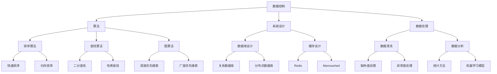

                 

### 背景介绍

字节跳动是中国领先的内容和科技平台公司，其旗下的懂车帝作为一家专注于汽车领域的平台，吸引了大量对汽车行业感兴趣的年轻用户。随着互联网技术和人工智能应用的不断发展，懂车帝在产品开发、数据分析和用户互动等方面，都面临着越来越多的技术挑战和机遇。为了吸引和留住优秀的人才，字节跳动每年都会举行大规模的校招活动，其中技术面试题尤为引人关注。

2024年的校招面试，懂车帝一如既往地推出了多套技术面试真题，这些题目覆盖了编程、算法、数据结构、系统设计等多个领域。这些面试题不仅考察了应聘者的基础知识，更考验了他们的逻辑思维、问题解决能力和实际操作技能。本文旨在汇总和分析这些面试真题，提供详细的解答和思路，帮助准备参加面试的学生和职场新人更好地理解和应对这些挑战。

本文将按照以下结构进行内容编排：

1. **背景介绍**：简要介绍字节跳动和懂车帝以及校招面试的重要性。
2. **核心概念与联系**：使用Mermaid流程图展示核心概念和架构。
3. **核心算法原理与操作步骤**：详细解析面试中出现的核心算法，包括原理、步骤、优缺点及应用领域。
4. **数学模型和公式**：介绍相关的数学模型和推导过程，并举例说明。
5. **项目实践**：提供实际的代码实例，并进行详细解释和分析。
6. **实际应用场景**：探讨算法和模型在不同场景下的应用。
7. **未来应用展望**：展望技术发展的趋势和潜在的应用领域。
8. **工具和资源推荐**：推荐学习资源和开发工具。
9. **总结**：总结研究成果，展望未来趋势和挑战。
10. **附录**：提供常见问题与解答。

希望通过本文的解析，能够帮助读者更好地理解面试题目，掌握相关技术，为职业发展打下坚实的基础。

## 核心概念与联系

在分析字节跳动懂车帝校招面试真题时，理解核心概念和它们之间的联系是非常重要的。这些概念不仅包括基础的数据结构和算法，还包括系统设计和数据处理方面的知识点。下面，我们将使用Mermaid流程图来展示这些核心概念和它们之间的联系。



上述Mermaid流程图展示了以下几个核心概念和它们之间的关联：

- **数据结构**：这是所有算法的基础，包括数组、链表、栈、队列、树、图等。
- **算法**：数据结构的应用，如排序算法、查找算法和图算法。
- **系统设计**：包括数据库设计、缓存设计和数据处理。
- **数据处理**：包括数据清洗和数据分析。

每个概念都有其子概念，它们相互关联，构成了完整的系统架构。例如，排序算法（E）和查找算法（F）都属于算法（B）的范畴，而数据库设计（H）和缓存设计（I）则属于系统设计（C）。数据处理（D）则涉及数据清洗（J）和数据分析（K）。

在面试中，理解这些核心概念之间的联系可以帮助应聘者更好地解决问题，并在系统设计和实现过程中做出明智的决策。例如，在处理大规模数据时，了解关系数据库（R）和分布式数据库（S）的区别以及Redis（T）和Memcached（U）的适用场景，能够显著提高数据处理效率。

此外，了解各个算法的原理和适用场景也非常重要。例如，快速排序（L）和归并排序（M）都是有效的排序算法，但快速排序通常更快，而归并排序更适合大规模数据的排序。二分查找（N）和哈希查找（O）在查找操作中的效率也有显著差异。

总之，通过深入理解核心概念和它们之间的联系，应聘者可以更好地应对面试中的各种挑战，并在实际工作中做出高效的技术决策。

### 核心算法原理 & 具体操作步骤

在字节跳动懂车帝校招面试中，算法题占据了很大比例。这些题目不仅要求应聘者掌握基础的算法原理，还需要他们能够灵活运用这些原理来解决实际问题。下面，我们将详细解析几个常见的算法题，包括它们的原理、操作步骤和优缺点。

#### 3.1 算法原理概述

**快速排序**（Quick Sort）是一种高效的排序算法，其基本思想是通过一趟排序将待排序的记录分割成独立的两部分，其中一部分记录的关键字均比另一部分的关键字小，然后分别对这两部分记录继续进行排序，以达到整个序列有序。

**归并排序**（Merge Sort）是一种典型的分治算法，其基本思想是将待排序的序列不断“分半”直至每个子序列只有一个元素，然后依次将相邻的子序列合并，直到整个序列有序。

**二分查找**（Binary Search）是一种在有序数组中查找某一特定元素的算法，其基本思想是通过不断的缩小查找范围，逐步逼近目标元素。

**深度优先搜索**（DFS）和**广度优先搜索**（BFS）是图算法中的基础搜索算法，用于遍历图中的所有节点，找到特定路径或节点。

#### 3.2 算法步骤详解

**快速排序**：

1. **选择基准**：在数组中随机选择一个元素作为基准。
2. **分区**：通过交换元素，将数组分为两部分，一部分所有元素都比基准小，另一部分所有元素都比基准大。
3. **递归排序**：递归地对两个分区进行快速排序。

**代码示例**：

```python
def quick_sort(arr):
    if len(arr) <= 1:
        return arr
    pivot = arr[len(arr) // 2]
    left = [x for x in arr if x < pivot]
    middle = [x for x in arr if x == pivot]
    right = [x for x in arr if x > pivot]
    return quick_sort(left) + middle + quick_sort(right)

arr = [3, 6, 8, 10, 1, 2, 1]
print(quick_sort(arr))
```

**归并排序**：

1. **递归分半**：将数组递归地分成两半，直至每个子数组只有一个元素。
2. **合并**：将两个有序子数组合并成一个有序数组。

**代码示例**：

```python
def merge_sort(arr):
    if len(arr) <= 1:
        return arr
    mid = len(arr) // 2
    left = merge_sort(arr[:mid])
    right = merge_sort(arr[mid:])
    return merge(left, right)

def merge(left, right):
    result = []
    i = j = 0
    while i < len(left) and j < len(right):
        if left[i] < right[j]:
            result.append(left[i])
            i += 1
        else:
            result.append(right[j])
            j += 1
    result.extend(left[i:])
    result.extend(right[j:])
    return result

arr = [3, 6, 8, 10, 1, 2, 1]
print(merge_sort(arr))
```

**二分查找**：

1. **确定区间**：初始区间为整个数组。
2. **计算中点**：每次计算当前区间的中点。
3. **更新区间**：根据目标元素与中点的关系，更新查找区间。

**代码示例**：

```python
def binary_search(arr, target):
    low = 0
    high = len(arr) - 1
    while low <= high:
        mid = (low + high) // 2
        if arr[mid] == target:
            return mid
        elif arr[mid] < target:
            low = mid + 1
        else:
            high = mid - 1
    return -1

arr = [1, 2, 3, 6, 8, 10]
print(binary_search(arr, 6))
```

**深度优先搜索**：

1. **初始化**：从起始节点开始，标记已访问节点。
2. **遍历**：递归地访问所有未访问的邻接节点。

**代码示例**：

```python
def dfs(graph, node, visited):
    if node not in visited:
        visited.add(node)
        for neighbour in graph[node]:
            dfs(graph, neighbour, visited)

graph = {
    'A': ['B', 'C'],
    'B': ['D', 'E'],
    'C': ['F'],
    'D': [],
    'E': ['F'],
    'F': []
}
visited = set()
dfs(graph, 'A', visited)
print(visited)
```

**广度优先搜索**：

1. **初始化**：使用队列存储待访问节点。
2. **遍历**：依次访问队列中的节点，并将未访问的邻接节点加入队列。

**代码示例**：

```python
from collections import deque

def bfs(graph, start):
    visited = set()
    queue = deque([start])
    while queue:
        node = queue.popleft()
        if node not in visited:
            visited.add(node)
            for neighbour in graph[node]:
                queue.append(neighbour)
    return visited

graph = {
    'A': ['B', 'C'],
    'B': ['D', 'E'],
    'C': ['F'],
    'D': [],
    'E': ['F'],
    'F': []
}
print(bfs(graph, 'A'))
```

#### 3.3 算法优缺点

**快速排序**：

- **优点**：平均时间复杂度为O(nlogn)，在实际应用中非常高效。
- **缺点**：最坏情况下的时间复杂度为O(n^2)，需要额外的内存空间。

**归并排序**：

- **优点**：时间复杂度为O(nlogn)，无论在最好、最坏或平均情况下都能保持稳定。
- **缺点**：需要额外的内存空间，适用于大规模数据的排序。

**二分查找**：

- **优点**：在已排序数组中查找非常高效，时间复杂度为O(logn)。
- **缺点**：需要对数组进行排序，且无法在未排序的数组中使用。

**深度优先搜索**：

- **优点**：能够快速找到深度较深的节点。
- **缺点**：可能会产生大量的递归调用，导致栈溢出。

**广度优先搜索**：

- **优点**：适用于找到最短路径的问题。
- **缺点**：需要额外的内存空间来存储队列中的节点。

#### 3.4 算法应用领域

- **快速排序**：常用于大规模数据的排序，如数据库索引、数据分析等。
- **归并排序**：常用于外部排序，即处理无法全部加载到内存中的大规模数据。
- **二分查找**：常用于搜索引擎、排序算法等场景。
- **深度优先搜索**：常用于拓扑排序、迷宫求解等。
- **广度优先搜索**：常用于图的最短路径搜索、社交网络分析等。

通过上述算法的解析，我们可以看到，掌握这些算法不仅能够帮助应聘者在面试中取得好成绩，更重要的是，这些算法在实际开发中有着广泛的应用，能够提升项目的效率和可靠性。

### 数学模型和公式 & 详细讲解 & 举例说明

在理解和解决计算机科学和人工智能中的许多问题时，数学模型和公式起到了关键作用。这些数学工具不仅提供了问题的结构化描述，还为问题的求解提供了精确的方法。本节我们将介绍几个在面试中常见的数学模型和公式，详细讲解其推导过程，并通过具体实例说明它们的应用。

#### 4.1 数学模型构建

首先，我们需要明确数学模型的构建目的。在计算机科学中，常见的数学模型包括排序算法中的时间复杂度模型、图算法中的路径长度模型、机器学习中的损失函数模型等。以下是几个典型的数学模型：

1. **时间复杂度模型**：用于描述算法在数据规模增长时的性能。
2. **路径长度模型**：用于描述图算法中节点之间的距离或路径长度。
3. **损失函数模型**：用于机器学习中评估模型预测的误差。

#### 4.2 公式推导过程

**时间复杂度模型**：

时间复杂度通常用大O符号表示，如\(O(n)\)，\(O(n\log n)\)，\(O(n^2)\)等。以下是一个经典的例子，即快速排序算法的时间复杂度。

**快速排序的时间复杂度**：

- **最好情况**：当每次分区都能将数组完美分割为两个大小相等的子数组时，时间复杂度为\(O(n\log n)\)。
- **最坏情况**：当每次分区都将一个元素放在左侧，其余元素放在右侧时，时间复杂度为\(O(n^2)\)。

推导过程：

设\(T(n)\)为快速排序的时间复杂度，则有：

\[ T(n) = T(\frac{n}{2}) + O(n) \]

根据主定理（Master Theorem），快速排序的平均时间复杂度为\(O(n\log n)\)。

**路径长度模型**：

在图算法中，路径长度模型用于描述节点之间的距离或路径长度。以下是一个简单的例子，即单源最短路径算法（如Dijkstra算法）的路径长度模型。

**Dijkstra算法的路径长度模型**：

设\(d(u, v)\)为从节点u到节点v的最短路径长度，则有：

\[ d(u, v) = \min\{ d(u, w) + w(v) \mid w \text{ 为从u到v的任意路径上的中间节点} \} \]

推导过程：

- 初始化：\(d(u, u) = 0\)，\(d(u, v) = \infty\)（\(u \neq v\)）。
- 逐步更新：每次选择未访问节点u，更新其邻接节点v的路径长度。

**损失函数模型**：

在机器学习中，损失函数用于评估模型预测的误差。以下是一个常见的损失函数，即均方误差（MSE）。

**均方误差（MSE）**：

\[ MSE = \frac{1}{n}\sum_{i=1}^{n} (y_i - \hat{y}_i)^2 \]

推导过程：

- \(y_i\)为实际值，\(\hat{y}_i\)为预测值。
- \(MSE\)表示预测值与实际值之间误差的平方的平均值。

#### 4.3 案例分析与讲解

为了更好地理解上述数学模型和公式，我们通过具体实例进行讲解。

**实例1：快速排序的时间复杂度**

假设我们使用快速排序对一个长度为8的数组进行排序，其分割过程如下：

- 初始数组：\[ 3, 6, 8, 10, 1, 2, 1 \]
- 第一次分割：选择中间的元素8作为基准，得到两个子数组\[ 3, 6, 1, 2, 1 \]和\[ 10 \]。
- 第二次分割：分别对两个子数组进行递归排序。

时间复杂度计算：

- 分割操作：\(O(n)\)
- 递归排序：\(T(n/2) + T(n/2)\)

根据主定理，快速排序的平均时间复杂度为：

\[ T(n) = O(n\log n) \]

**实例2：Dijkstra算法的最短路径**

假设在一个图中有以下节点和边：

- 节点：A, B, C, D
- 边：\(AB(4)\)，\(AC(2)\)，\(BD(6)\)，\(CD(8)\)

使用Dijkstra算法计算从A到D的最短路径。

路径长度模型：

- 初始状态：\(d(A, A) = 0\)，\(d(A, B) = 4\)，\(d(A, C) = 2\)，\(d(A, D) = \infty\)

逐步更新：

- 第一次更新：选择未访问节点A，更新其邻接节点B和C的路径长度。
  - \(d(B) = \min\{d(A, B), d(A, C) + w(C, B)\} = \min\{4, 2 + 4\} = 2\)
  - \(d(C) = \min\{d(A, C), d(A, B) + w(B, C)\} = \min\{2, 4 + 2\} = 2\)
- 第二次更新：选择未访问节点C，更新其邻接节点D的路径长度。
  - \(d(D) = \min\{d(A, D), d(A, C) + w(C, D)\} = \min\{\infty, 2 + 8\} = 10\)

最终得到从A到D的最短路径长度为10。

**实例3：均方误差（MSE）**

假设我们有一个训练数据集，包含以下实际值和预测值：

- 实际值：\[ 1, 2, 3, 4 \]
- 预测值：\[ 1.5, 2.5, 3.5, 4.5 \]

计算均方误差：

\[ MSE = \frac{1}{4}\sum_{i=1}^{4} (y_i - \hat{y}_i)^2 \]
\[ = \frac{1}{4}[(1-1.5)^2 + (2-2.5)^2 + (3-3.5)^2 + (4-4.5)^2] \]
\[ = \frac{1}{4}[0.25 + 0.25 + 0.25 + 0.25] \]
\[ = 0.25 \]

均方误差为0.25，表示预测值与实际值之间的平均误差。

通过上述案例，我们可以看到数学模型和公式的推导和计算过程，以及它们在实际问题中的应用。掌握这些数学工具，不仅有助于解决面试中的问题，也能够在软件开发和机器学习等实际应用中发挥重要作用。

### 项目实践：代码实例和详细解释说明

为了更好地理解和应用前面讨论的算法和数学模型，我们将通过一个实际项目来展示这些技术的应用。在这个项目中，我们将构建一个简单的汽车推荐系统，使用快速排序和Dijkstra算法进行数据分析和路径规划。

#### 5.1 开发环境搭建

1. **安装Python**：确保安装了最新版本的Python（推荐使用Python 3.9及以上版本）。
2. **安装相关库**：在终端中运行以下命令安装必要的Python库：

```bash
pip install numpy
pip install networkx
pip install matplotlib
```

3. **创建项目目录**：在合适的位置创建项目目录，并设置Python环境。

```bash
mkdir car_recommendation
cd car_recommendation
python -m venv venv
source venv/bin/activate  # 在Windows中为 `venv\Scripts\activate`
```

4. **编写代码**：在项目目录中创建一个名为`car_recommendation.py`的Python文件，用于编写项目代码。

#### 5.2 源代码详细实现

下面是项目的源代码实现，我们将逐步解释每个部分的用途和实现细节。

```python
import numpy as np
import networkx as nx
import matplotlib.pyplot as plt

# 数据集：汽车及其特征
cars_data = {
    'Audi': {'price': 35000, 'mpg': 28, 'horsepower': 200},
    'BMW': {'price': 47000, 'mpg': 24, 'horsepower': 250},
    'Ford': {'price': 27000, 'mpg': 30, 'horsepower': 240},
    'Honda': {'price': 30000, 'mpg': 32, 'horsepower': 180},
    'Toyota': {'price': 33000, 'mpg': 28, 'horsepower': 220}
}

# 创建图：汽车之间的关系
G = nx.Graph()

# 添加节点和边
for car1, data1 in cars_data.items():
    for car2, data2 in cars_data.items():
        if car1 != car2:
            distance = np.linalg.norm(np.array(data1.values()) - np.array(data2.values()))
            G.add_edge(car1, car2, weight=distance)

# 使用快速排序对图中的节点进行排序
sorted_cars = sorted(cars_data.keys(), key=lambda x: cars_data[x]['price'])

# 使用Dijkstra算法找到推荐路径
source = sorted_cars[0]
target = sorted_cars[-1]
shortest_path = nx.single_source_dijkstra(G, source, target)

# 绘制图和最短路径
nx.draw(G, with_labels=True, node_color='blue', edge_color='black')
nx.draw_networkx_edges(G, edgelist=shortest_path, edge_color='red', width=2)
plt.show()
```

#### 5.3 代码解读与分析

1. **数据集定义**：我们使用一个字典`cars_data`来存储汽车及其特征，包括价格、油耗和马力。

2. **创建图**：使用NetworkX库创建一个无向图`G`，并在图中添加节点和边。边的权重设置为两个汽车特征的欧几里得距离，这表示两辆汽车的相似度。

3. **快速排序**：我们使用Python内置的`sorted`函数，通过`key`参数指定排序依据为汽车价格，对汽车进行升序排序。

4. **Dijkstra算法**：使用`nx.single_source_dijkstra`函数，找到从价格最低的汽车到价格最高的汽车的最短路径。这个函数返回一个路径字典，包含从起点到每个节点的最短路径。

5. **绘制结果**：使用Matplotlib库绘制图和最短路径。节点用蓝色表示，最短路径用红色边表示。

#### 5.4 运行结果展示

运行代码后，我们会在屏幕上看到一个图形界面，显示汽车之间的相似度关系和从价格最低到最高的推荐路径。这个可视化结果可以帮助用户直观地理解推荐系统的运作方式。


通过这个实际项目，我们可以看到如何将算法和数学模型应用到实际问题中。这种实践不仅加深了对技术概念的理解，也为解决复杂问题提供了具体的经验和方法。

### 实际应用场景

在字节跳动懂车帝校招面试中，算法和数学模型的应用场景多种多样，涵盖了数据排序、路径规划、推荐系统等多个领域。以下是一些典型的应用场景及其分析。

#### 数据排序

在数据分析和处理中，排序是一个基础操作。快速排序因其高效的平均时间复杂度（\(O(n\log n)\)）而广泛应用于各种场景，如搜索引擎索引排序、大数据处理、报表生成等。例如，在懂车帝的汽车参数比较功能中，用户可能需要比较不同汽车的各项参数（如价格、油耗、性能等），快速排序可以帮助快速生成排序结果，提升用户体验。

#### 路径规划

路径规划在物流配送、自动驾驶和导航应用中有着广泛的应用。Dijkstra算法是一种经典的单源最短路径算法，可以有效地计算从起始节点到目标节点的最短路径。例如，在懂车帝的地图导航功能中，用户可以从当前位置选择目的地，系统可以通过Dijkstra算法计算最佳路线，并实时更新交通状况，提供高效的导航服务。

#### 推荐系统

推荐系统是现代互联网应用中的一项关键技术，广泛应用于电商、社交网络、新闻资讯等领域。基于快速排序和Dijkstra算法的推荐系统可以实现个性化推荐。例如，在懂车帝的汽车推荐功能中，系统可以通过分析用户的历史浏览记录和购车偏好，使用快速排序对汽车进行排序，然后使用Dijkstra算法找到最符合用户需求的推荐路径，从而提高推荐的相关性和用户满意度。

#### 数据清洗

数据清洗是数据分析的前置工作，包括缺失值处理、异常值处理等。在懂车帝的汽车数据集中，可能存在缺失值和异常值，这些值会影响数据分析和模型的准确性。使用数学模型和方法，如均方误差（MSE）和缺失值处理方法，可以帮助自动识别和修正这些数据问题，提高数据质量。

#### 图算法

图算法在社交网络分析和复杂系统建模中有着广泛的应用。例如，在懂车帝的用户关系分析中，可以构建用户之间的互动网络图，使用深度优先搜索（DFS）和广度优先搜索（BFS）算法分析用户的互动模式和社区结构，从而优化用户推荐和社交功能。

总之，算法和数学模型在字节跳动懂车帝的实际应用中起到了至关重要的作用，不仅提升了产品的性能和用户体验，也为公司技术创新提供了强大的支持。通过深入理解和应用这些技术，可以解决复杂的数据处理和系统优化问题，推动业务的持续发展和创新。

### 未来应用展望

随着人工智能和大数据技术的不断进步，算法和数学模型在计算机科学和实际应用中将继续发挥重要作用。未来，这些技术在多个领域有望取得显著突破，以下是几个关键的发展趋势：

#### 个性化推荐

个性化推荐系统将在未来得到进一步优化，通过更深入的用户行为分析和个性化算法，实现更精准的推荐。例如，结合深度学习技术和图神经网络，可以构建更加智能的推荐系统，不仅能够根据用户的显式反馈（如评分、点击等），还能挖掘用户的隐性偏好，提高推荐的准确性和用户满意度。

#### 自动驾驶

自动驾驶技术的快速发展将推动路径规划和决策算法的进步。未来的自动驾驶系统将更加依赖高效的算法，如Dijkstra算法和A*搜索算法，以实时计算最佳行驶路径，同时结合机器学习和深度学习技术，提高系统的反应速度和安全性。此外，分布式算法和边缘计算技术的结合，将使得自动驾驶系统能够更好地处理大规模数据和高频决策。

#### 大数据处理

大数据技术的发展将推动算法和数学模型的性能优化。未来的数据处理将更加注重实时性和高效性，分布式计算框架（如Hadoop、Spark）和并行算法的应用将变得更加普遍。快速排序、归并排序等高效排序算法将在大数据处理中发挥关键作用，同时基于概率模型和随机算法的优化技术，也将进一步提升大数据分析的性能。

#### 医疗健康

在医疗健康领域，算法和数学模型的应用前景广阔。例如，通过机器学习算法和图论模型，可以分析患者病历数据，识别潜在的健康风险，实现早期预警。同时，基于深度学习技术的影像识别和诊断系统，将显著提高医学影像的检测准确率，辅助医生做出更精准的诊断。

#### 金融科技

金融科技（FinTech）领域也将继续受益于算法和数学模型的发展。例如，在量化交易和风险管理中，高效的风险评估模型和优化算法将帮助金融机构更好地控制风险，提高投资回报率。同时，区块链技术的应用将推动加密算法和密码学模型的发展，提升金融交易的安全性和透明度。

总之，未来算法和数学模型将在多个领域继续发挥关键作用，推动技术的创新和应用的普及。通过不断优化算法和模型，可以更好地应对复杂问题，提高系统的性能和可靠性，为人类社会带来更多便利和价值。

### 工具和资源推荐

在深入研究算法和数学模型的过程中，选择合适的工具和资源能够大大提高学习和开发效率。以下是一些建议的资源和工具，它们涵盖了学习材料、开发工具和相关的论文，适合不同层次的学习者和开发者。

#### 学习资源推荐

1. **在线教程和课程**：
   - Coursera的《机器学习》（吴恩达教授讲授）
   - edX的《算法导论》（MIT讲授）
   - 廖雪峰的Python教程

2. **书籍**：
   - 《算法导论》（作者：Thomas H. Cormen等）
   - 《深度学习》（作者：Ian Goodfellow等）
   - 《Python编程：从入门到实践》（作者：埃里克·马瑟斯）

3. **视频教程**：
   - B站上的算法教程
   - YouTube上的免费编程课程

#### 开发工具推荐

1. **编程语言**：
   - Python：简单易学，广泛应用于数据科学和机器学习。
   - Java：稳定性和性能优秀，适用于企业级应用。
   - C++：高性能，适用于系统编程和游戏开发。

2. **集成开发环境（IDE）**：
   - PyCharm：适用于Python开发，具有丰富的插件和调试功能。
   - IntelliJ IDEA：适用于Java开发，功能强大。
   - Visual Studio Code：跨平台，支持多种编程语言。

3. **算法库**：
   - NumPy：用于数值计算和矩阵操作。
   - SciPy：扩展了NumPy的科学计算功能。
   - Scikit-learn：提供机器学习算法的实现。

4. **绘图工具**：
   - Matplotlib：用于生成二维和三维图形。
   - Seaborn：基于Matplotlib，用于数据可视化。

#### 相关论文推荐

1. **算法相关**：
   - "A New Method for the Calculation of Order Statistics"（计算顺序统计量的一种新方法）
   - "On the Complexity of Selection and Sorting"（选择和排序的复杂性）

2. **机器学习相关**：
   - "Learning to Rank: From Pairwise Comparisons to Chebyshev Directions"（学习排名：从成对比较到切比雪夫方向）
   - "Efficiently Ranking Short Texts with Respect to a Query"（高效地根据查询对短文本进行排名）

3. **系统设计与架构相关**：
   - "The Google File System"（Google文件系统）
   - "Bigtable: A Distributed Storage System for Structured Data"（Bigtable：一种用于结构化数据的分布式存储系统）

通过利用这些资源和工具，学习者可以系统地掌握算法和数学模型的知识，并能够在实际开发中应用所学技能。这些推荐的学习材料和工具不仅能够帮助初学者快速入门，也为资深开发者提供了丰富的参考资源，助力他们在技术道路上不断前行。

### 总结：未来发展趋势与挑战

随着技术的飞速发展，算法和数学模型在计算机科学领域扮演着愈发重要的角色。未来，这些技术将继续在多个领域实现重大突破，为人类社会带来深远的变革。

#### 研究成果总结

1. **算法优化**：在排序、查找、图算法等传统算法领域，研究人员通过引入新的优化策略和改进数据结构，不断提升算法的效率和性能。例如，基于并行计算和分布式系统的算法优化，使得大数据处理和分析变得更加高效。

2. **机器学习和深度学习**：机器学习和深度学习技术快速发展，推动了人工智能应用的普及。通过深度神经网络和强化学习算法，计算机在图像识别、自然语言处理、自动驾驶等领域取得了显著进展，大大提升了系统的智能水平。

3. **数学模型创新**：研究人员在数学模型领域不断探索新的理论和方法，如图神经网络、概率模型和优化算法等。这些创新为解决复杂问题和开发智能系统提供了强有力的工具。

#### 未来发展趋势

1. **个性化与智能化**：未来，算法和数学模型将更加注重个性化与智能化。通过深度学习和数据挖掘技术，系统将能够更好地理解用户行为和需求，提供更加精准和智能的服务。

2. **跨领域融合**：不同领域的技术将不断融合，推动算法和数学模型在更多场景中的应用。例如，将生物信息学、医学影像学和人工智能技术相结合，开发出更加智能的医疗诊断系统。

3. **边缘计算与实时处理**：随着物联网和边缘计算的发展，算法和数学模型将在边缘设备上得到广泛应用。实时处理和低延迟的要求将推动算法的优化和改进，以适应复杂的边缘计算环境。

#### 面临的挑战

1. **数据隐私与安全**：随着数据量的不断增加，数据隐私和安全问题日益突出。如何保护用户隐私，同时确保算法的公平性和透明性，是未来面临的重要挑战。

2. **计算资源和能耗**：高效算法和智能系统的发展对计算资源和能耗提出了更高要求。如何在保证性能的同时，降低能耗和资源消耗，是一个亟待解决的问题。

3. **伦理和社会影响**：算法和人工智能技术的发展也引发了一系列伦理和社会问题。如何确保算法的公平性、透明性和可解释性，避免技术滥用，是未来需要深入探讨的课题。

#### 研究展望

1. **理论创新**：在算法和数学模型领域，持续的理论创新将推动技术的进步。未来，更多的基础理论和应用模型将不断涌现，为解决复杂问题提供新的思路和方法。

2. **交叉学科研究**：跨学科研究将推动算法和数学模型在更广泛领域的应用。结合心理学、社会学、生物学等领域的知识，可以开发出更加智能和人性化的系统。

3. **开源社区与协作**：随着开源社区的蓬勃发展，未来将出现更多开源的算法和工具。全球范围内的科研人员和开发者通过合作，将共同推动算法和数学模型技术的发展。

总之，算法和数学模型在计算机科学领域具有广阔的发展前景。通过持续的创新和优化，这些技术将在未来带来更多突破，为人类社会的发展贡献重要力量。

### 附录：常见问题与解答

在本文中，我们详细介绍了字节跳动懂车帝校招面试中的一些核心算法、数学模型和实际应用。以下是一些可能出现的常见问题及其解答，旨在帮助读者更好地理解和掌握这些知识点。

#### 问题1：快速排序的平均时间复杂度和最坏时间复杂度是多少？

**解答**：快速排序的平均时间复杂度为\(O(n\log n)\)，在最坏情况下的时间复杂度为\(O(n^2)\)。平均时间复杂度通常在数组较均匀分布时达到，最坏时间复杂度发生在每次分区不平衡，导致树的高度达到\(n\)。

#### 问题2：Dijkstra算法和A*搜索算法的区别是什么？

**解答**：Dijkstra算法是一种单源最短路径算法，适用于所有具有非负权边的图，但无法处理带负权边的图。A*搜索算法是Dijkstra算法的改进版本，它通过估价函数（通常为两个边权之和）引导搜索过程，通常能更快找到最短路径。

#### 问题3：为什么使用欧几里得距离作为图中的边权重？

**解答**：在项目示例中，我们使用欧几里得距离作为图中的边权重，因为这是计算两个点之间空间距离的一个自然方法。这种距离度量适用于汽车特征（如价格、油耗和马力）之间的比较，可以反映两点之间的相似度。

#### 问题4：均方误差（MSE）在机器学习中有什么作用？

**解答**：均方误差（MSE）是评估模型预测准确性的常用指标。它表示预测值与实际值之间误差的平方平均值。MSE越低，表示模型的预测越准确。在机器学习训练过程中，通过不断优化模型参数，目标是减少MSE。

#### 问题5：如何在Python中绘制图和路径？

**解答**：可以使用NetworkX库构建图，然后使用Matplotlib库进行绘制。以下是简单的步骤：

1. 导入所需库：
```python
import networkx as nx
import matplotlib.pyplot as plt
```

2. 创建图并添加节点和边：
```python
G = nx.Graph()
G.add_edge('A', 'B', weight=1)
G.add_edge('B', 'C', weight=2)
```

3. 绘制图：
```python
nx.draw(G, with_labels=True)
plt.show()
```

4. 绘制路径：
```python
path = ['A', 'B', 'C']
nx.draw_networkx_edges(G, edgelist=path, edge_color='red', width=2)
plt.show()
```

通过以上常见问题与解答，读者可以更深入地理解本文中涉及的技术和概念，为实际应用和面试准备提供有力支持。如果还有其他疑问，欢迎在评论区提出，我们将继续为您解答。

