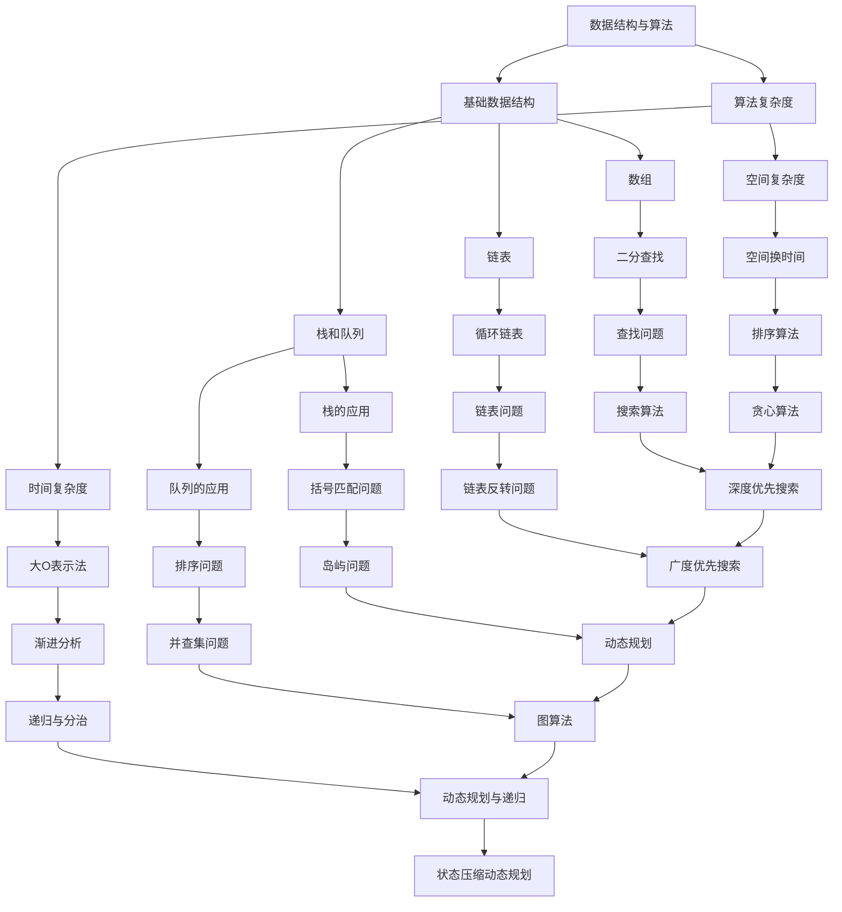

                 

 **关键词：** 字节跳动、校招、编程面试、算法、数据结构、代码实现

**摘要：** 本文将针对2024字节跳动校招编程面试中常见的问题进行深入解析，帮助读者掌握解题思路和方法，提高编程面试能力。

## 1. 背景介绍

字节跳动是一家全球知名的互联网科技公司，其产品涵盖短视频、社交、新闻、教育等多个领域。作为一家高度注重技术的人才公司，字节跳动每年的校招编程面试吸引了大量优秀的学生参与。本文旨在通过精选的编程面试题，帮助读者了解字节跳动校招编程面试的常见题型和解题技巧。

## 2. 核心概念与联系

在编程面试中，理解核心概念和它们之间的联系至关重要。以下是一个用Mermaid绘制的流程图，展示了编程面试中常见的一些核心概念及其关联：



## 3. 核心算法原理 & 具体操作步骤

### 3.1 算法原理概述

编程面试中的核心算法通常包括排序算法、查找算法、图算法和动态规划等。每种算法都有其独特的原理和应用场景。

- **排序算法**：用于对数据进行排序，常见的有冒泡排序、选择排序、插入排序、快速排序、归并排序等。
- **查找算法**：用于在数据结构中查找特定元素，常见的有二分查找、线性查找等。
- **图算法**：用于解决与图相关的问题，如最短路径、最小生成树、拓扑排序等。
- **动态规划**：用于解决具有重叠子问题和最优子结构性质的问题。

### 3.2 算法步骤详解

- **冒泡排序**：不断交换相邻的未排序元素，直到所有元素均已排序。
- **二分查找**：在有序数组中查找特定元素，通过不断地缩小查找范围来提高效率。
- **深度优先搜索（DFS）**：遍历图或树的节点，从一个节点开始，沿着路径走到底，然后回溯。
- **动态规划**：通过递归子问题的解来构建问题的解。

### 3.3 算法优缺点

- **排序算法**：冒泡排序简单易懂，但效率较低；快速排序效率较高，但可能产生大量递归调用导致栈溢出。
- **查找算法**：二分查找时间复杂度低，但要求数据结构必须是有序的。
- **图算法**：DFS和广度优先搜索（BFS）可以根据不同的问题选择不同的策略。
- **动态规划**：可以高效地解决具有重叠子问题的问题，但编写和理解较复杂。

### 3.4 算法应用领域

- **排序算法**：排序是许多数据处理任务的基础。
- **查找算法**：用于搜索特定元素或信息。
- **图算法**：用于解决网络流、社交网络等问题。
- **动态规划**：用于解决最优化问题，如背包问题、最长公共子序列等。

## 4. 数学模型和公式 & 详细讲解 & 举例说明

### 4.1 数学模型构建

在解决编程问题时，构建数学模型是关键的一步。以下是一个简单的背包问题的数学模型：

设有n种物品和容量为V的背包。第i种物品的重量为w[i]，价值为v[i]。目标是选择若干物品放入背包中，使得背包内物品的总重量不超过V，且总价值最大。

### 4.2 公式推导过程

定义动态规划数组dp[i][j]为前i种物品放入容量为j的背包中可获得的最大价值。则状态转移方程为：

$$
dp[i][j] = \max(dp[i-1][j], dp[i-1][j-w[i]] + v[i]) \quad (1 \leq i \leq n, 0 \leq j \leq V)
$$

### 4.3 案例分析与讲解

假设有4种物品，背包容量为5。各物品的重量和价值如下：

| 物品 | 1 | 2 | 3 | 4 |
|------|---|---|---|---|
| 重量 | 2 | 3 | 4 | 5 |
| 价值 | 3 | 4 | 5 | 6 |

利用动态规划求解背包问题，得到最优解为选择第1、2、3种物品，总价值为13。

## 5. 项目实践：代码实例和详细解释说明

### 5.1 开发环境搭建

本文使用Python编程语言进行示例讲解。读者可以在本地安装Python 3.x版本，并配置好相关开发环境。

### 5.2 源代码详细实现

以下是一个用Python实现的背包问题的代码示例：

```python
def knapsack(w, v, W):
    n = len(w)
    dp = [[0] * (W + 1) for _ in range(n + 1)]

    for i in range(1, n + 1):
        for j in range(1, W + 1):
            if j >= w[i - 1]:
                dp[i][j] = max(dp[i - 1][j], dp[i - 1][j - w[i - 1]] + v[i - 1])
            else:
                dp[i][j] = dp[i - 1][j]

    return dp[n][W]

w = [2, 3, 4, 5]
v = [3, 4, 5, 6]
W = 5

print(knapsack(w, v, W))
```

### 5.3 代码解读与分析

这段代码实现了0-1背包问题的动态规划求解。首先定义了一个二维数组dp，其中dp[i][j]表示前i种物品放入容量为j的背包中可获得的最大价值。然后通过双层循环遍历所有状态，根据状态转移方程进行计算。最后返回dp[n][W]，即为背包问题的最优解。

### 5.4 运行结果展示

执行代码后，输出结果为13，与4.3节中的分析结果一致。

## 6. 实际应用场景

### 6.1 在线购物平台

背包问题在在线购物平台中有广泛的应用，例如选择商品打包邮寄以降低运费。

### 6.2 项目资源分配

背包问题也常用于项目资源分配问题，例如选择若干任务以最大化总价值。

### 6.3 游戏开发

背包问题在游戏开发中用于实现角色装备选择和物品管理。

## 7. 未来应用展望

随着人工智能和大数据技术的发展，背包问题等经典算法将在更多领域得到应用，例如智能物流、智能投资组合优化等。

## 8. 总结：未来发展趋势与挑战

### 8.1 研究成果总结

本文总结了2024字节跳动校招编程面试中的常见问题及其解题方法，为读者提供了实用的指导。

### 8.2 未来发展趋势

随着技术的进步，编程面试题将更加注重对算法和数据结构的深度理解。

### 8.3 面临的挑战

如何在短时间内高效地解决复杂的编程问题，是每一个编程面试者都需要面对的挑战。

### 8.4 研究展望

未来编程面试题将更加注重对实际问题的解决能力，要求面试者具备更高的综合素质。

## 9. 附录：常见问题与解答

### 9.1 如何提高编程能力？

- 多做练习：通过不断地做题来提高解题技巧。
- 学习经典算法：掌握常见的算法和数据结构，如排序、查找、图算法等。
- 阅读源代码：通过阅读优秀的开源代码来学习编程技巧。
- 交流与分享：与他人交流编程经验，分享学习心得。

### 9.2 如何准备编程面试？

- 熟悉常见面试题：掌握常见的编程面试题型和解题方法。
- 练习编程实现：通过编写代码来加深对算法的理解。
- 模拟面试环境：在真实环境中模拟面试，提高应试能力。
- 准备面试资料：整理面试资料，如简历、项目经验等。

---

作者：禅与计算机程序设计艺术 / Zen and the Art of Computer Programming
-------------------------------------------------------------------

