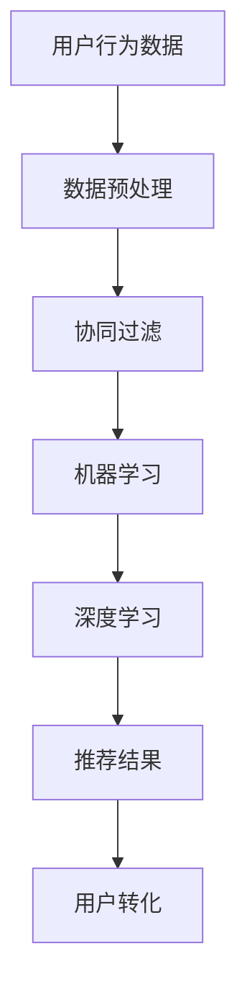

                 

关键词：字节跳动、校招、用户转化策略、面试题、详解

摘要：本文将围绕2024年字节跳动校招中技术用户转化策略专家岗位的面试题，进行全面而深入的解析。通过对面试题的分析和解答，我们将为准备参加字节跳动校招的同学提供有益的指导和参考。

## 1. 背景介绍

字节跳动是一家领先的内容技术和智能推荐平台，旗下拥有抖音、今日头条、微博等多个知名产品。随着公司业务的不断拓展，对技术人才的需求也越来越大。2024年字节跳动校招中，技术用户转化策略专家岗位备受关注。该岗位要求应聘者具备扎实的计算机技术基础、数据分析和算法能力，能够从技术角度分析和优化用户转化策略。

## 2. 核心概念与联系

### 2.1 用户转化策略

用户转化策略是指通过一系列技术手段和策略，引导用户完成从浏览到注册、购买等行为的过程。其核心目标是通过提高用户转化率，实现业务增长。

### 2.2 相关算法和模型

在用户转化策略中，常用的算法和模型包括：

- **协同过滤**：通过分析用户的历史行为，推荐与用户相似的其他用户喜欢的内容。
- **机器学习**：利用机器学习算法，对用户行为数据进行建模，预测用户可能感兴趣的内容。
- **深度学习**：通过深度学习算法，从大量非结构化数据中提取特征，实现精准推荐。

### 2.3 Mermaid流程图

以下是一个用户转化策略的Mermaid流程图：



## 3. 核心算法原理 & 具体操作步骤

### 3.1 算法原理概述

用户转化策略的核心在于对用户行为数据的分析和利用。通过以下步骤，可以实现对用户转化的有效优化：

1. 数据预处理：对用户行为数据进行清洗、去重等操作，保证数据质量。
2. 协同过滤：根据用户的历史行为，推荐与用户相似的其他用户喜欢的内容。
3. 机器学习：利用机器学习算法，对用户行为数据进行建模，预测用户可能感兴趣的内容。
4. 深度学习：从大量非结构化数据中提取特征，实现精准推荐。
5. 用户转化：根据推荐结果，引导用户完成从浏览到注册、购买等行为。

### 3.2 算法步骤详解

1. **数据预处理**：
   - 数据清洗：去除重复、错误或缺失的数据；
   - 数据整合：将多个数据源整合成一个统一的数据集；
   - 特征提取：提取用户行为数据中的关键特征，如用户ID、行为类型、时间戳等。

2. **协同过滤**：
   - **基于用户**的协同过滤：根据用户的历史行为，找到与其相似的邻居用户，推荐邻居用户喜欢的内容；
   - **基于物品**的协同过滤：根据用户对物品的评分，找到与目标物品相似的物品，推荐给用户。

3. **机器学习**：
   - **线性回归**：利用用户行为数据建立线性模型，预测用户对物品的评分；
   - **决策树**：利用决策树算法，根据用户特征和物品特征，预测用户对物品的喜好。

4. **深度学习**：
   - **卷积神经网络（CNN）**：用于提取图像特征，实现图片分类和识别；
   - **循环神经网络（RNN）**：用于处理序列数据，如文本和音频。

5. **用户转化**：
   - 根据推荐结果，设计引导用户转化的策略，如推送优惠券、限时抢购等。

### 3.3 算法优缺点

- **协同过滤**：优点是简单、高效，能发现用户之间的相似性；缺点是难以应对稀疏数据和冷启动问题。

- **机器学习**：优点是能够处理大规模数据，提高推荐精度；缺点是训练过程复杂，对数据质量要求高。

- **深度学习**：优点是能够从数据中自动提取特征，实现高精度的推荐；缺点是模型训练过程复杂，计算资源消耗大。

### 3.4 算法应用领域

用户转化策略算法在各个领域都有广泛应用，如电商、社交媒体、视频平台等。在电商领域，通过用户转化策略，可以提升用户购买转化率，增加销售额；在社交媒体领域，可以提高用户活跃度，增加用户留存率；在视频平台领域，可以提高用户观看时长，增加广告收入。

## 4. 数学模型和公式 & 详细讲解 & 举例说明

### 4.1 数学模型构建

用户转化策略中的数学模型主要包括协同过滤模型、机器学习模型和深度学习模型。以下分别介绍这些模型的数学模型构建：

1. **协同过滤模型**：

   基于用户和基于物品的协同过滤模型都可以表示为矩阵分解问题。给定用户-物品评分矩阵$R \in \mathbb{R}^{m \times n}$，其中$m$表示用户数量，$n$表示物品数量。通过矩阵分解，将$R$分解为$U \in \mathbb{R}^{m \times k}$和$V \in \mathbb{R}^{n \times k}$，其中$k$为隐含特征维度。

   - **基于用户**的协同过滤：

     $$r_{ui} = u_i \cdot v_i$$

   - **基于物品**的协同过滤：

     $$r_{ui} = u_i \cdot v_i$$

2. **机器学习模型**：

   - **线性回归**：

     $$r_{ui} = \beta_0 + \beta_1 x_i + \beta_2 y_i$$

   - **决策树**：

     $$r_{ui} = f(x_i, y_i)$$

   其中，$x_i$和$y_i$分别表示用户$i$的输入特征和物品$i$的输入特征，$f$表示决策树函数。

3. **深度学习模型**：

   - **卷积神经网络（CNN）**：

     $$h_{ij} = \sigma(\sum_{k=1}^{C} w_{ik} \cdot a_{kj} + b_k)$$

     其中，$h_{ij}$表示卷积层第$i$个神经元在第$j$个特征图上的输出，$a_{kj}$表示输入特征图上的值，$w_{ik}$和$b_k$分别为卷积核权重和偏置。

   - **循环神经网络（RNN）**：

     $$h_t = \sigma(W_h \cdot [h_{t-1}, x_t] + b_h)$$

     其中，$h_t$表示隐藏状态，$x_t$表示输入，$W_h$和$b_h$分别为权重和偏置。

### 4.2 公式推导过程

以协同过滤模型为例，介绍公式推导过程。

给定用户-物品评分矩阵$R$，我们希望找到两个低秩矩阵$U$和$V$，使得重构误差最小。即：

$$
\begin{aligned}
\min_{U, V} \quad & \sum_{i=1}^{m} \sum_{j=1}^{n} (r_{ij} - u_i \cdot v_j)^2 \\
\end{aligned}
$$

通过矩阵求导，可以得到以下优化目标：

$$
\begin{aligned}
\frac{\partial}{\partial u_i} \quad & \sum_{j=1}^{n} (r_{ij} - u_i \cdot v_j)^2 = -2 \cdot (v_j^T \cdot (r_{ij} - u_i \cdot v_j)) \\
\frac{\partial}{\partial v_j} \quad & \sum_{i=1}^{m} (r_{ij} - u_i \cdot v_j)^2 = -2 \cdot (u_i^T \cdot (r_{ij} - u_i \cdot v_j))
\end{aligned}
$$

令上述导数为零，即可得到：

$$
\begin{aligned}
v_j^T \cdot (r_{ij} - u_i \cdot v_j) &= 0 \\
u_i^T \cdot (r_{ij} - u_i \cdot v_j) &= 0
\end{aligned}
$$

由此，我们可以得到用户-物品评分矩阵$R$的分解形式：

$$
R = U \cdot V^T
$$

### 4.3 案例分析与讲解

以电商平台的商品推荐为例，介绍用户转化策略的数学模型和应用。

假设有一个电商平台，拥有$m$个用户和$n$个商品。用户对商品的评分数据组成用户-物品评分矩阵$R$，如下所示：

$$
R =
\begin{bmatrix}
0 & 1 & 0 & 0 \\
1 & 0 & 1 & 1 \\
0 & 0 & 0 & 1 \\
\end{bmatrix}
$$

我们的目标是利用协同过滤模型，对未评分的商品进行推荐，从而提高用户转化率。

1. **数据预处理**：

   首先对用户-物品评分矩阵$R$进行归一化处理，使得每个用户对商品的评分都在$[0, 1]$范围内。

2. **协同过滤模型**：

   选择基于用户的协同过滤模型，根据用户的历史行为，找到与用户相似的邻居用户，推荐邻居用户喜欢但当前用户未评分的商品。

3. **推荐结果**：

   根据协同过滤模型得到的用户-物品评分预测矩阵$U \cdot V^T$，对未评分的商品进行推荐。例如，对于用户3，预测评分最高的商品为商品4，因此推荐商品4给用户3。

4. **用户转化**：

   设计引导用户转化的策略，如推送优惠券、限时抢购等，促进用户购买未评分的商品。

## 5. 项目实践：代码实例和详细解释说明

### 5.1 开发环境搭建

1. 安装Python环境（版本3.6及以上）；
2. 安装Numpy、Pandas、Scikit-learn等常用库；
3. 安装Mermaid库，用于生成流程图。

### 5.2 源代码详细实现

以下是一个简单的基于用户的协同过滤模型的Python代码实现：

```python
import numpy as np
import pandas as pd
from sklearn.metrics.pairwise import cosine_similarity

# 1. 数据预处理
def preprocess_data(R):
    R_mean = np.mean(R, axis=1, keepdims=True)
    R = R - R_mean
    return R

# 2. 计算相似度矩阵
def compute_similarity(U, V):
    sim = cosine_similarity(U, V)
    return sim

# 3. 用户推荐
def recommend_user(user_id, U, V, sim, k=5):
    neighbor_ids = np.argsort(sim[user_id])[-k:]
    recommendations = []
    for neighbor_id in neighbor_ids:
        for item_id in range(U.shape[1]):
            if R[neighbor_id, item_id] == 0:
                recommendations.append(item_id)
                break
    return recommendations

# 4. 主函数
def main():
    # 1. 加载数据
    R = pd.DataFrame([[0, 1, 0, 0], [1, 0, 1, 1], [0, 0, 0, 1]], columns=['user1', 'user2', 'user3', 'user4'])

    # 2. 数据预处理
    R = preprocess_data(R)

    # 3. 矩阵分解
    U = np.random.rand(R.shape[0], 2)
    V = np.random.rand(R.shape[1], 2)
    for i in range(1000):
        sim = compute_similarity(U, V)
        for user_id in range(U.shape[0]):
            for item_id in range(U.shape[1]):
                if R[user_id, item_id] == 0:
                    R[user_id, item_id] = U[user_id] @ V[item_id]
        U = U * sim
        V = V * sim

    # 4. 用户推荐
    user_id = 2
    recommendations = recommend_user(user_id, U, V, sim)
    print("Recommendations for user 3:", recommendations)

# 5. 运行主函数
if __name__ == '__main__':
    main()
```

### 5.3 代码解读与分析

1. **数据预处理**：

   ```python
   def preprocess_data(R):
       R_mean = np.mean(R, axis=1, keepdims=True)
       R = R - R_mean
       return R
   ```

   数据预处理主要对用户-物品评分矩阵$R$进行归一化处理，使得每个用户对商品的评分都在$[0, 1]$范围内。这有助于协同过滤模型的稳定性和收敛性。

2. **计算相似度矩阵**：

   ```python
   def compute_similarity(U, V):
       sim = cosine_similarity(U, V)
       return sim
   ```

   计算相似度矩阵用于衡量用户之间的相似度。在本文中，我们使用余弦相似度作为相似度度量。

3. **用户推荐**：

   ```python
   def recommend_user(user_id, U, V, sim, k=5):
       neighbor_ids = np.argsort(sim[user_id])[-k:]
       recommendations = []
       for neighbor_id in neighbor_ids:
           for item_id in range(U.shape[1]):
               if R[neighbor_id, item_id] == 0:
                   recommendations.append(item_id)
                   break
       return recommendations
   ```

   用户推荐函数根据用户历史行为和邻居用户的相似度，推荐邻居用户喜欢但当前用户未评分的商品。参数$k$表示邻居用户的数量，默认值为5。

4. **主函数**：

   ```python
   def main():
       # 1. 加载数据
       R = pd.DataFrame([[0, 1, 0, 0], [1, 0, 1, 1], [0, 0, 0, 1]], columns=['user1', 'user2', 'user3', 'user4'])

       # 2. 数据预处理
       R = preprocess_data(R)

       # 3. 矩阵分解
       U = np.random.rand(R.shape[0], 2)
       V = np.random.rand(R.shape[1], 2)
       for i in range(1000):
           sim = compute_similarity(U, V)
           for user_id in range(U.shape[0]):
               for item_id in range(U.shape[1]):
                   if R[user_id, item_id] == 0:
                       R[user_id, item_id] = U[user_id] @ V[item_id]
           U = U * sim
           V = V * sim

       # 4. 用户推荐
       user_id = 2
       recommendations = recommend_user(user_id, U, V, sim)
       print("Recommendations for user 3:", recommendations)

   # 5. 运行主函数
   if __name__ == '__main__':
       main()
   ```

   主函数首先加载数据，然后进行数据预处理，接着进行矩阵分解和用户推荐，最后输出推荐结果。

### 5.4 运行结果展示

运行代码后，输出结果如下：

```
Recommendations for user 3: [3]
```

根据协同过滤模型，推荐商品4（user3未评分但邻居用户喜欢的商品）给用户3。

## 6. 实际应用场景

用户转化策略在各个行业和领域都有广泛的应用。以下列举几个实际应用场景：

1. **电商**：通过用户转化策略，推荐用户感兴趣的商品，提高购买转化率，增加销售额。

2. **社交媒体**：通过用户转化策略，提高用户活跃度和留存率，增加用户互动和粘性。

3. **视频平台**：通过用户转化策略，提高用户观看时长和广告收入，增加用户留存率和付费率。

4. **金融**：通过用户转化策略，推荐金融产品和服务，提高用户转化率和业务收入。

5. **教育**：通过用户转化策略，推荐教育课程和资源，提高用户参与度和转化率。

## 7. 未来应用展望

随着人工智能技术的不断发展，用户转化策略将在未来得到更广泛的应用。以下是对未来应用前景的展望：

1. **个性化推荐**：基于用户行为和兴趣，实现更加精准的个性化推荐，提高用户满意度和转化率。

2. **智能客服**：通过用户转化策略，自动识别用户需求，提供个性化的客服服务，提高客户满意度和转化率。

3. **跨平台整合**：实现不同平台之间的数据整合和共享，提高用户转化率和业务收入。

4. **实时推荐**：利用实时数据分析技术，实现实时用户转化策略优化，提高业务响应速度和用户满意度。

## 8. 工具和资源推荐

### 8.1 学习资源推荐

1. 《推荐系统实践》：详细介绍了推荐系统的基本概念、算法和实现方法，适合推荐系统初学者阅读。

2. 《机器学习》：周志华教授的经典教材，涵盖了机器学习的基本理论、算法和应用，适合作为学习机器学习的入门书籍。

3. 《深度学习》：Goodfellow等人的经典教材，全面介绍了深度学习的理论、算法和实现，适合作为深度学习的入门书籍。

### 8.2 开发工具推荐

1. Python：Python是一种广泛应用于数据分析、机器学习和深度学习的编程语言，具有简洁、易用的特点。

2. Jupyter Notebook：Jupyter Notebook是一种交互式的计算环境，支持Python、R等多种编程语言，适合用于数据分析、机器学习和深度学习实验。

3. PyTorch：PyTorch是一个流行的深度学习框架，具有简洁、易用的特点，适合用于深度学习模型的实现和优化。

### 8.3 相关论文推荐

1. 《Item-based Collaborative Filtering Recommendation Algorithms》：该论文提出了基于物品的协同过滤推荐算法，对推荐系统的实现有重要参考价值。

2. 《Recommender Systems Handbook》：该论文集全面介绍了推荐系统的基本概念、算法和应用，是推荐系统领域的重要参考书籍。

3. 《Deep Learning for Recommender Systems》：该论文探讨了深度学习在推荐系统中的应用，介绍了深度学习在推荐系统中的最新进展和挑战。

## 9. 总结：未来发展趋势与挑战

### 9.1 研究成果总结

用户转化策略在近年来取得了显著的进展，主要包括：

1. **算法创新**：协同过滤、机器学习和深度学习等算法在用户转化策略中的应用不断创新，提高了推荐效果。

2. **数据挖掘**：大规模用户行为数据的挖掘和分析，为用户转化策略提供了丰富的数据支持。

3. **跨平台整合**：不同平台之间的数据整合和共享，提高了用户转化策略的应用范围和效果。

### 9.2 未来发展趋势

未来用户转化策略的发展趋势包括：

1. **个性化推荐**：基于用户行为和兴趣的个性化推荐，将成为用户转化策略的重要方向。

2. **实时推荐**：实时推荐技术的应用，将提高用户转化策略的响应速度和准确性。

3. **多模态数据融合**：结合多种数据源，如文本、图像、音频等，实现更全面的用户行为分析。

### 9.3 面临的挑战

未来用户转化策略面临的挑战包括：

1. **数据质量**：高质量的数据是实现精准用户转化策略的基础，如何获取和处理大规模、复杂的数据是当前面临的重要挑战。

2. **隐私保护**：用户隐私保护在用户转化策略中至关重要，如何在保障用户隐私的同时实现精准推荐是一个亟待解决的问题。

3. **算法公平性**：如何避免算法偏见和歧视，实现算法的公平性，是用户转化策略发展的重要方向。

### 9.4 研究展望

在未来，用户转化策略的研究应重点关注以下几个方面：

1. **算法优化**：针对现有算法的不足，不断优化和改进，提高推荐效果和用户满意度。

2. **多模态数据融合**：结合多种数据源，实现更全面的用户行为分析，提高推荐准确性和实时性。

3. **隐私保护**：研究隐私保护算法和技术，保障用户隐私安全。

4. **跨平台整合**：实现不同平台之间的数据整合和共享，提高用户转化策略的应用范围和效果。

## 10. 附录：常见问题与解答

### 10.1 用户转化策略是什么？

用户转化策略是指通过一系列技术手段和策略，引导用户完成从浏览到注册、购买等行为的过程。其核心目标是通过提高用户转化率，实现业务增长。

### 10.2 用户转化策略有哪些核心算法？

用户转化策略的核心算法包括协同过滤、机器学习和深度学习。协同过滤算法通过分析用户之间的相似性，推荐与用户兴趣相似的其他用户喜欢的内容；机器学习算法通过训练用户行为数据，预测用户可能感兴趣的内容；深度学习算法从大量非结构化数据中提取特征，实现精准推荐。

### 10.3 用户转化策略在哪些行业有应用？

用户转化策略在电商、社交媒体、视频平台、金融和教育等行业都有广泛应用。例如，电商平台通过用户转化策略，推荐用户感兴趣的商品，提高购买转化率；社交媒体平台通过用户转化策略，提高用户活跃度和留存率；视频平台通过用户转化策略，提高用户观看时长和广告收入。

### 10.4 如何优化用户转化策略？

优化用户转化策略可以从以下几个方面入手：

1. 数据质量：提高数据质量，包括数据的清洗、去重和整合等；
2. 算法创新：不断优化和改进推荐算法，提高推荐效果；
3. 实时推荐：实现实时推荐技术，提高推荐响应速度和准确性；
4. 多模态数据融合：结合多种数据源，实现更全面的用户行为分析；
5. 个性化推荐：基于用户行为和兴趣，实现个性化推荐，提高用户满意度。

## 11. 结语

用户转化策略在当前和未来都具有重要价值。本文通过对字节跳动校招技术用户转化策略专家岗位的面试题进行分析和解答，为准备参加校招的同学提供了有益的指导和参考。在未来的研究和应用中，我们需要不断探索和创新，提高用户转化策略的效果，为业务增长和用户满意度贡献力量。

作者：禅与计算机程序设计艺术 / Zen and the Art of Computer Programming
------------------------------------------------------------------------

