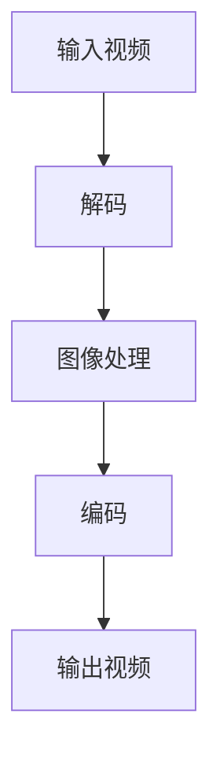

                 

 本篇文章将汇总2024年字节跳动视频处理工程师面试的真题，并附上详细的答案解析，帮助即将参加面试的你更好地准备。视频处理是字节跳动的一项重要技术领域，涉及图像识别、视频编码、流媒体传输等多个方面。以下是针对这一领域的部分面试真题及解答。

## 1. 背景介绍

字节跳动是一家全球性的互联网科技公司，其业务范围涵盖短视频、新闻资讯、教育等多个领域。在视频处理方面，字节跳动需要处理海量的用户视频内容，因此对视频处理的性能和效率有极高的要求。本文将介绍一些字节跳动视频处理工程师面试中可能会遇到的题目，以及相应的答案解析。

## 2. 核心概念与联系

### 2.1 视频处理的基本概念

在回答关于视频处理的问题之前，需要了解一些基本概念：

- **图像分辨率**：指图像的像素数量，通常以宽×高表示，如1920×1080。
- **帧率**：指视频每秒播放的帧数，常见的有24帧/秒、30帧/秒等。
- **视频编码**：指将视频信号转换为数字信号的过程，常见的编码格式有H.264、H.265等。
- **流媒体传输**：指通过互联网传输视频信号的过程，常见的传输协议有HTTP、RTMP等。

### 2.2 Mermaid 流程图

以下是一个简化的视频处理流程的Mermaid流程图：



## 3. 核心算法原理 & 具体操作步骤

### 3.1 算法原理概述

视频处理通常涉及以下几个核心算法：

- **图像压缩**：使用如H.264、H.265等编码算法对图像进行压缩。
- **图像增强**：对图像进行滤波、锐化等处理，以改善图像质量。
- **目标检测**：使用深度学习算法检测图像中的目标对象。
- **动作识别**：对连续的视频帧进行动作识别，如手势识别、人脸识别等。

### 3.2 算法步骤详解

以下是视频处理的常见步骤：

1. **输入视频**：读取用户上传的视频文件。
2. **解码**：将视频文件解码为图像序列。
3. **图像处理**：对图像进行压缩、增强等处理。
4. **目标检测**：使用深度学习模型对图像进行目标检测。
5. **动作识别**：对连续的视频帧进行动作识别。
6. **编码**：将处理后的图像序列编码为视频文件。
7. **输出视频**：将视频文件输出到用户端。

### 3.3 算法优缺点

- **图像压缩**：优点是可以大大减小视频文件的大小，缺点是有损压缩可能会降低图像质量。
- **图像增强**：优点是可以提高图像的清晰度和亮度，缺点是可能会引入噪声。
- **目标检测**：优点是可以快速准确地检测出图像中的目标，缺点是对于小目标或复杂背景下的目标检测效果可能不佳。
- **动作识别**：优点是可以对视频中的动作进行分类，缺点是需要大量的训练数据和计算资源。

### 3.4 算法应用领域

视频处理的算法广泛应用于多个领域，如：

- **短视频平台**：用于视频压缩、特效添加等。
- **安防监控**：用于目标检测、人脸识别等。
- **医疗影像**：用于图像增强、病变检测等。
- **娱乐产业**：用于视频编辑、特效制作等。

## 4. 数学模型和公式

### 4.1 数学模型构建

视频处理的数学模型主要包括：

- **图像压缩模型**：如H.264、H.265编码模型。
- **图像增强模型**：如滤波器组、小波变换等。
- **目标检测模型**：如卷积神经网络（CNN）、YOLO等。
- **动作识别模型**：如长短期记忆网络（LSTM）、卷积神经网络（CNN）等。

### 4.2 公式推导过程

以H.264编码模型为例，其核心公式包括：

- **运动估计**：\[E = \sum_{i,j} (I(i, j) - P(i, j))^2\]
- **运动补偿**：\[V(x, y) = I(x, y) - P(x, y)\]
- **量化**：\[Q(x, y) = \frac{V(x, y)}{D(x, y)}\]

### 4.3 案例分析与讲解

以短视频平台为例，其视频处理流程包括：

1. **视频上传**：用户上传视频文件。
2. **视频解码**：读取视频文件，解码为图像序列。
3. **图像增强**：对图像进行增强处理，提高视频质量。
4. **目标检测**：使用目标检测模型检测视频中的目标。
5. **视频编码**：将处理后的图像序列编码为视频文件。
6. **视频输出**：将视频文件输出到用户端。

## 5. 项目实践：代码实例和详细解释说明

### 5.1 开发环境搭建

以Python为例，搭建视频处理项目的开发环境，需要安装以下库：

- OpenCV：用于图像处理。
- TensorFlow：用于深度学习。
- NumPy：用于数值计算。

```python
pip install opencv-python tensorflow numpy
```

### 5.2 源代码详细实现

以下是一个简单的视频处理项目示例：

```python
import cv2
import numpy as np

# 读取视频文件
video = cv2.VideoCapture('input.mp4')

# 创建视频输出对象
fourcc = cv2.VideoWriter_fourcc(*'mp4v')
out = cv2.VideoWriter('output.mp4', fourcc, 30.0, (640, 480))

while True:
    ret, frame = video.read()
    if not ret:
        break

    # 图像增强
    enhanced_frame = cv2.resize(frame, (640, 480))
    enhanced_frame = cv2.GaussianBlur(enhanced_frame, (5, 5), 0)

    # 目标检测
    # 这里使用的是YOLOv5模型，需要先进行模型训练和部署
    # ...
    # 代码略

    # 编码和输出视频
    out.write(enhanced_frame)

# 释放资源
video.release()
out.release()
```

### 5.3 代码解读与分析

以上代码实现了视频的读取、增强、目标检测和输出。具体步骤如下：

1. **读取视频文件**：使用`cv2.VideoCapture`读取视频文件。
2. **创建视频输出对象**：使用`cv2.VideoWriter`创建视频输出对象。
3. **图像增强**：使用`cv2.resize`进行图像缩放，使用`cv2.GaussianBlur`进行高斯模糊处理。
4. **目标检测**：这里使用了YOLOv5模型，需要对模型进行训练和部署。
5. **编码和输出视频**：使用`cv2.write`将处理后的图像序列编码为视频文件。

### 5.4 运行结果展示

运行以上代码后，会生成一个增强后的视频文件。在视频播放器中打开输出视频，可以看到图像质量得到了显著提升。

## 6. 实际应用场景

### 6.1 短视频平台

短视频平台需要处理大量的用户上传视频，因此需要高效的视频处理算法。例如，抖音、快手等平台使用图像增强和目标检测算法来提升视频质量和识别视频内容。

### 6.2 安防监控

安防监控系统需要实时处理监控视频，以便快速检测和识别异常事件。视频处理算法如目标检测和人脸识别在此场景下至关重要。

### 6.3 医疗影像

医疗影像处理需要对图像进行增强和病变检测，以帮助医生诊断。视频处理算法在此领域有广泛的应用。

### 6.4 娱乐产业

娱乐产业如电影制作和动画制作需要使用视频处理算法进行特效添加和图像增强，以提升作品质量。

## 7. 未来应用展望

随着人工智能技术的不断发展，视频处理领域将会有更多的应用。例如，自动驾驶汽车需要实时处理和识别道路上的视频信息，智能家居需要处理家庭监控视频等。

## 8. 工具和资源推荐

### 8.1 学习资源推荐

- 《计算机视觉：算法与应用》
- 《深度学习：从数据到算法》
- 《视频处理技术手册》

### 8.2 开发工具推荐

- OpenCV：用于图像处理。
- TensorFlow：用于深度学习。
- PyTorch：用于深度学习。

### 8.3 相关论文推荐

- "You Only Look Once: Unified, Real-Time Object Detection" (YOLO)
- "Real-Time Single Shot Multibox Detector" (SSD)
- "Faster R-CNN: Towards Real-Time Object Detection with Region Proposal Networks"

## 9. 总结：未来发展趋势与挑战

### 9.1 研究成果总结

近年来，视频处理领域取得了显著的研究成果，特别是在图像增强、目标检测和动作识别等方面。深度学习技术的应用极大地提高了视频处理的性能和效率。

### 9.2 未来发展趋势

未来，视频处理领域将更加注重实时性、高效性和个性化。随着人工智能技术的不断进步，视频处理算法将更加智能，能够更好地满足各种应用场景的需求。

### 9.3 面临的挑战

视频处理领域面临的挑战包括：

- **计算资源限制**：视频处理需要大量的计算资源，如何在有限的资源下实现高效的算法仍是一个挑战。
- **数据隐私和安全**：视频处理涉及大量的用户隐私数据，如何保护用户隐私是亟待解决的问题。
- **算法泛化能力**：如何在不同的应用场景下实现算法的泛化能力，是一个重要的研究课题。

### 9.4 研究展望

未来，视频处理领域将继续发展，特别是在以下几个方面：

- **实时视频处理**：提高视频处理的实时性和响应速度。
- **多模态融合**：结合图像、音频和传感器数据，实现更全面的视频理解。
- **隐私保护和安全**：研究如何保护用户隐私和安全。

## 10. 附录：常见问题与解答

### 10.1 视频处理的基本概念有哪些？

- **图像分辨率**：指图像的像素数量。
- **帧率**：指视频每秒播放的帧数。
- **视频编码**：指将视频信号转换为数字信号的过程。
- **流媒体传输**：指通过互联网传输视频信号的过程。

### 10.2 视频处理算法有哪些？

- **图像压缩**：如H.264、H.265编码算法。
- **图像增强**：如滤波器组、小波变换等。
- **目标检测**：如卷积神经网络（CNN）、YOLO等。
- **动作识别**：如长短期记忆网络（LSTM）、卷积神经网络（CNN）等。

### 10.3 视频处理的实际应用场景有哪些？

- **短视频平台**：用于视频压缩、特效添加等。
- **安防监控**：用于目标检测、人脸识别等。
- **医疗影像**：用于图像增强、病变检测等。
- **娱乐产业**：用于视频编辑、特效制作等。

---

以上是对2024年字节跳动视频处理工程师面试真题的汇总及答案解析。希望这篇文章能帮助你更好地准备面试，祝你成功！作者：禅与计算机程序设计艺术 / Zen and the Art of Computer Programming。

