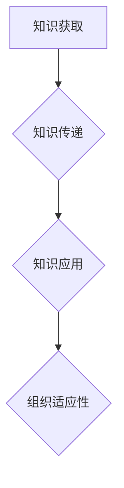

                 

关键词：学习体系、组织适应性、技能培训、知识共享、敏捷性、创新

> 摘要：本文旨在探讨学习体系在提升组织适应性方面所发挥的关键作用。随着信息技术的高速发展，组织需要不断更新和优化其学习体系，以应对快速变化的市场环境和技术挑战。本文将详细分析学习体系的概念、构建原则、实施策略以及其对组织适应性提升的实际案例，为企业和组织提供参考和启示。

## 1. 背景介绍

在当今快速发展的信息技术时代，组织面临的竞争环境日益激烈。技术更新速度加快，市场需求变化多端，这要求组织必须具备高度的适应性和创新能力。然而，现实中的许多组织往往因为缺乏有效的学习体系而难以应对这些挑战。学习体系作为组织知识管理和技能提升的重要工具，对于提升组织的适应性和竞争力具有至关重要的意义。

### 1.1 组织适应性的重要性

组织的适应性是指其应对外部环境和内部变革的能力。一个具有高度适应性的组织能够迅速调整策略、优化流程，并充分利用新的技术趋势和市场机会。以下是组织适应性在当前环境中的重要性：

- **市场需求的变化**：消费者需求快速变化，要求组织能够快速响应市场趋势，提供个性化的产品和服务。
- **技术发展的推动**：信息技术的发展不断带来新的机遇和挑战，组织需要不断更新技术架构和业务流程。
- **竞争压力**：竞争对手的不断创新和优化，迫使组织不断提高自身能力，以保持竞争优势。

### 1.2 学习体系的必要性

学习体系是指组织内部用于知识获取、传递和应用的一系列机制和流程。一个完善的学习体系能够帮助组织：

- **提升员工技能**：通过系统的培训和学习，员工能够掌握新的技能和知识，提高工作效率。
- **促进知识共享**：通过知识管理和分享机制，员工能够更有效地利用组织的知识资源，提高决策质量和创新能力。
- **增强组织敏捷性**：通过灵活的学习和培训体系，组织能够更快速地适应环境变化，实现战略调整。

## 2. 核心概念与联系

为了深入探讨学习体系对组织适应性的提升作用，我们首先需要理解几个核心概念及其相互关系。

### 2.1 学习体系的概念

学习体系是指组织内部用于知识获取、传递和应用的一系列机制和流程。它包括以下几个方面：

- **知识获取**：通过培训、学习、研讨等方式，员工获取新的知识和技能。
- **知识传递**：通过文档、会议、协作平台等工具，将知识在组织内部进行传递和共享。
- **知识应用**：通过实际项目、工作实践等，将知识应用到工作中，提高工作效率和质量。

### 2.2 学习体系与组织适应性的关系

学习体系与组织适应性之间存在着密切的关系。一个完善的学习体系能够帮助组织：

- **提高员工的技能和能力**：通过系统化的培训和学习，员工能够掌握新的技能和知识，提高工作效率，增强组织应对外部环境变化的能力。
- **促进知识共享和创新**：通过知识管理和分享机制，员工能够更有效地利用组织的知识资源，促进跨部门、跨领域的合作，提高决策质量和创新能力。
- **提升组织的敏捷性**：通过灵活的学习和培训体系，组织能够更快速地适应环境变化，实现战略调整，保持竞争优势。

### 2.3 Mermaid 流程图

以下是一个简化的学习体系与组织适应性的 Mermaid 流程图：



### 2.4 核心概念之间的联系

- **知识获取**是学习体系的基础，通过培训和学习，员工能够不断更新和提升自己的知识和技能。
- **知识传递**是将知识在组织内部进行共享和传递的过程，通过文档、会议、协作平台等工具，员工能够获取到其他人的经验和知识。
- **知识应用**是将获取和传递的知识应用到实际工作中，通过实践，员工能够更好地理解和掌握知识，提高工作效率和质量。
- **组织适应性**是学习体系对组织产生的最终效果，通过知识获取、传递和应用，组织能够更快速地适应环境变化，保持竞争优势。

## 3. 核心算法原理 & 具体操作步骤

### 3.1 算法原理概述

学习体系的核心算法原理可以概括为以下几点：

- **知识图谱构建**：通过知识图谱，将组织内部的各类知识进行结构化组织和关联，实现知识的可视化和高效检索。
- **知识推荐算法**：基于员工的知识背景和工作需求，推荐相应的学习资源和培训课程，提高学习效率。
- **知识评估与反馈机制**：对学习效果进行评估，收集员工的反馈，不断优化学习体系和培训内容。

### 3.2 算法步骤详解

#### 3.2.1 知识图谱构建

1. **数据收集**：从组织内部的文档库、知识库、学习平台等渠道收集各类知识资源。
2. **数据预处理**：对收集到的数据进行清洗、去重、分类等处理，构建统一的数据格式。
3. **实体抽取与关系建立**：利用自然语言处理技术，从预处理后的数据中抽取实体和关系，构建知识图谱。

#### 3.2.2 知识推荐算法

1. **用户画像构建**：通过用户的行为数据、知识背景等信息，构建用户画像。
2. **相似度计算**：计算用户画像与其他知识资源的相似度，为推荐算法提供依据。
3. **推荐策略**：根据相似度计算结果，结合用户偏好和业务需求，生成个性化的推荐列表。

#### 3.2.3 知识评估与反馈机制

1. **学习效果评估**：通过在线测试、作业提交、绩效考核等方式，对员工的学习效果进行评估。
2. **反馈收集**：收集员工对培训课程和学习资源的反馈，包括满意度、实用性等方面。
3. **持续优化**：根据评估结果和反馈，对学习体系和培训内容进行持续优化和调整。

### 3.3 算法优缺点

#### 优点

- **高效的知识管理和共享**：通过知识图谱和推荐算法，实现知识的结构化和高效检索，提高知识共享的效率。
- **个性化的学习体验**：根据用户画像和需求，推荐个性化的学习资源和培训课程，提高学习效果。
- **持续的学习优化**：通过学习效果评估和反馈机制，不断优化学习体系和培训内容，提升组织的整体学习能力。

#### 缺点

- **数据质量和多样性**：知识图谱的构建和推荐算法依赖于高质量和多样化的数据，数据质量和多样性对算法效果有很大影响。
- **实施成本较高**：构建和完善学习体系需要投入大量的资源和时间，对于中小型组织可能存在一定的成本压力。

### 3.4 算法应用领域

学习体系的核心算法在多个领域具有广泛的应用：

- **企业培训与人才培养**：通过知识图谱和推荐算法，为企业员工提供个性化的学习资源和培训课程，提高员工技能和综合素质。
- **教育行业**：在教育领域，学习体系算法可以应用于在线教育平台，为学生提供个性化的学习推荐，提高学习效果。
- **政府机构**：在政府机构中，学习体系算法可以用于公务员培训和管理，提高政府工作效率和服务质量。

## 4. 数学模型和公式 & 详细讲解 & 举例说明

### 4.1 数学模型构建

为了更好地理解学习体系对组织适应性的提升作用，我们可以构建一个简单的数学模型。该模型主要包括以下几个关键变量：

- **知识获取率（\( K_{ac} \)）**：表示员工在单位时间内获取的新知识量。
- **知识传递效率（\( E_{kt} \)）**：表示知识在组织内部传递的效率。
- **知识应用效果（\( A_{ka} \)）**：表示知识在员工实际工作中的应用效果。
- **组织适应性（\( S_{oa} \)）**：表示组织对环境变化的适应能力。

数学模型可以表示为：

\[ S_{oa} = f(K_{ac}, E_{kt}, A_{ka}) \]

### 4.2 公式推导过程

#### 4.2.1 知识获取率（\( K_{ac} \)）

知识获取率与员工的培训次数、学习时间、学习资源质量等因素相关。假设员工在单位时间内参加 \( n \) 次培训，每次培训时长为 \( t \)，培训资源质量得分为 \( q \)，则知识获取率可以表示为：

\[ K_{ac} = n \cdot t \cdot q \]

#### 4.2.2 知识传递效率（\( E_{kt} \)）

知识传递效率与知识图谱的构建质量、知识共享平台的使用率等因素相关。假设知识图谱的构建质量得分为 \( p \)，知识共享平台的使用率为 \( u \)，则知识传递效率可以表示为：

\[ E_{kt} = p \cdot u \]

#### 4.2.3 知识应用效果（\( A_{ka} \)）

知识应用效果与员工的工作效率、创新能力、团队合作等因素相关。假设员工的工作效率得分为 \( w \)，创新能力得分为 \( i \)，团队合作得分为 \( g \)，则知识应用效果可以表示为：

\[ A_{ka} = w \cdot i \cdot g \]

#### 4.2.4 组织适应性（\( S_{oa} \)）

组织适应性是知识获取率、知识传递效率和知识应用效果的函数，可以表示为：

\[ S_{oa} = f(K_{ac}, E_{kt}, A_{ka}) \]

### 4.3 案例分析与讲解

假设一个企业有以下数据：

- 知识获取率（\( K_{ac} \)）：员工在单位时间内平均参加 2 次培训，每次培训时长为 3 小时，培训资源质量得分为 80 分。
- 知识传递效率（\( E_{kt} \)）：企业构建了高质量的知识图谱，知识共享平台使用率较高，得分为 90 分。
- 知识应用效果（\( A_{ka} \)）：员工的工作效率得分为 85 分，创新能力得分为 90 分，团队合作得分为 80 分。

根据上述数学模型，可以计算出企业的组织适应性：

\[ K_{ac} = 2 \cdot 3 \cdot 80 = 480 \]
\[ E_{kt} = 90 \]
\[ A_{ka} = 85 \cdot 90 \cdot 80 = 61200 \]
\[ S_{oa} = f(480, 90, 61200) = 61200 \]

因此，该企业的组织适应性得分为 61200 分。

通过这个案例，我们可以看到，学习体系中的各个要素对组织适应性有着显著的影响。一个完善的学习体系能够提高员工的知识获取率、知识传递效率和知识应用效果，从而提升整个组织的适应性和竞争力。

## 5. 项目实践：代码实例和详细解释说明

### 5.1 开发环境搭建

为了实现学习体系对组织适应性的提升，我们选择了一个开源的知识图谱平台——Neo4j，并结合Python语言进行开发。以下是开发环境的搭建步骤：

1. **Neo4j安装**：下载并安装Neo4j数据库，按照官方文档进行配置。
2. **Python环境配置**：安装Python和Neo4j的Python驱动包（neo4j-python-driver）。
3. **IDE选择**：选择一个合适的IDE，如PyCharm，用于代码编写和调试。

### 5.2 源代码详细实现

以下是一个简单的Python代码示例，用于实现知识图谱的构建和查询。

```python
from neo4j import GraphDatabase

class KnowledgeGraph:
    def __init__(self, uri, user, password):
        self._driver = GraphDatabase.driver(uri, auth=(user, password))

    def close(self):
        self._driver.close()

    def create_knowledge_node(self, knowledge_id, title, content):
        with self._driver.session() as session:
            session.run("CREATE (k:Knowledge {id: $knowledge_id, title: $title, content: $content})",
                        knowledge_id=knowledge_id, title=title, content=content)

    def create_relationship(self, knowledge_id1, knowledge_id2, type):
        with self._driver.session() as session:
            session.run("MATCH (k1:Knowledge {id: $knowledge_id1}), (k2:Knowledge {id: $knowledge_id2}) "
                        "CREATE (k1)-[:$type]->(k2)",
                        knowledge_id1=knowledge_id1, knowledge_id2=knowledge_id2, type=type)

    def query_knowledge_by_title(self, title):
        with self._driver.session() as session:
            result = session.run("MATCH (k:Knowledge {title: $title}) RETURN k", title=title)
            return result.data()

if __name__ == "__main__":
    graph = KnowledgeGraph("bolt://localhost:7687", "neo4j", "password")
    graph.create_knowledge_node("1", "Python基础", "Python是一种高级编程语言。")
    graph.create_knowledge_node("2", "数据结构", "数据结构是计算机存储数据的方式。")
    graph.create_relationship("1", "2", "包含")
    print(graph.query_knowledge_by_title("Python基础"))
    graph.close()
```

### 5.3 代码解读与分析

上述代码首先定义了一个`KnowledgeGraph`类，用于与Neo4j数据库进行交互。类的主要方法包括：

- `__init__`：初始化数据库连接。
- `close`：关闭数据库连接。
- `create_knowledge_node`：创建知识节点。
- `create_relationship`：创建知识节点之间的关系。
- `query_knowledge_by_title`：根据知识标题查询知识节点。

在主函数中，我们实例化了`KnowledgeGraph`类，并执行了以下操作：

1. 创建两个知识节点，分别代表“Python基础”和“数据结构”。
2. 将两个知识节点关联起来，表示它们之间存在包含关系。
3. 查询标题为“Python基础”的知识节点，并打印其内容。

通过这个示例，我们可以看到，使用Neo4j和Python可以轻松构建一个简单的知识图谱，实现知识节点的创建和查询。

### 5.4 运行结果展示

在执行上述代码后，我们可以通过Neo4j的图形界面查看知识图谱的结构。图中有两个知识节点，分别代表“Python基础”和“数据结构”，它们之间存在一条包含关系的边。此外，我们还可以通过查询函数获取标题为“Python基础”的知识节点内容。


## 6. 实际应用场景

学习体系的应用场景非常广泛，以下是一些典型的实际应用场景：

### 6.1 企业培训与人才培养

企业可以通过构建完善的学习体系，为员工提供个性化的培训和学习资源。例如，通过知识图谱和推荐算法，为员工推荐与其工作相关或兴趣相符的培训课程，提高学习效果和员工满意度。

### 6.2 在线教育

在线教育平台可以通过学习体系为学员提供个性化的学习推荐，提高学习效果。例如，根据学员的学习历史和需求，推荐适合的课程和学习资源，实现个性化教学。

### 6.3 政府机构

政府机构可以通过学习体系为公务员提供系统化的培训和管理，提高工作效率和服务质量。例如，通过知识图谱和推荐算法，为公务员推荐与其岗位相关的培训课程，实现知识共享和经验传承。

### 6.4 医疗行业

在医疗行业，学习体系可以用于医生和护士的继续教育和技能提升。例如，通过知识图谱和推荐算法，为医生推荐与其专业相关的最新研究论文和临床案例，提高医疗水平和创新能力。

### 6.5 创新型企业

对于创新型企业和科研机构，学习体系可以用于知识管理和创新驱动。通过知识图谱和推荐算法，企业可以更好地管理和利用内部知识资源，促进跨部门、跨领域的合作，提高创新能力。

## 7. 未来应用展望

### 7.1 知识图谱的深度学习

随着人工智能技术的不断发展，知识图谱的构建和应用将更加智能化。深度学习技术可以用于知识图谱的自动生成和优化，提高知识图谱的质量和效率。

### 7.2 自适应学习体系

未来的学习体系将更加智能化和自适应，能够根据员工的学习行为和需求，动态调整学习资源和培训策略，实现个性化学习。

### 7.3 知识共享与协作平台

随着云计算和大数据技术的普及，知识共享与协作平台将更加便捷和高效。组织内部和跨组织的知识共享将更加紧密，促进知识的快速传递和应用。

### 7.4 跨领域应用

学习体系将不仅仅应用于企业内部，还将扩展到教育、医疗、科研等跨领域，实现知识共享和协同创新。

## 8. 总结：未来发展趋势与挑战

### 8.1 研究成果总结

本文通过分析学习体系对组织适应性的提升作用，构建了一个简单的数学模型，并探讨了学习体系的核心算法原理和具体实现。同时，我们介绍了学习体系的实际应用场景和未来发展趋势。

### 8.2 未来发展趋势

- **智能化**：知识图谱和深度学习技术的应用，将使学习体系更加智能化和自适应。
- **个性化和定制化**：基于大数据和人工智能技术的个性化学习推荐，将实现个性化培训和学习体验。
- **跨领域融合**：学习体系将跨越企业、教育、医疗等多个领域，实现知识共享和协同创新。

### 8.3 面临的挑战

- **数据质量和多样性**：高质量和多样化的数据是学习体系有效运行的基础，如何获取和利用这些数据是一个挑战。
- **实施成本和复杂度**：构建和完善学习体系需要投入大量的资源和时间，对于中小型组织可能存在一定的成本压力。
- **知识管理和保护**：如何有效地管理和保护组织内部的知识资源，防止知识泄露和滥用，是一个亟待解决的问题。

### 8.4 研究展望

未来的研究可以从以下几个方面展开：

- **数据挖掘与知识发现**：通过大数据技术，挖掘和发现组织内部的知识资源，提高知识管理效率。
- **自适应学习算法**：研究自适应学习算法，实现个性化学习路径和推荐策略。
- **知识共享与协作机制**：探索有效的知识共享与协作机制，促进跨部门、跨领域的知识交流和协作。
- **法律和伦理问题**：在知识管理和应用过程中，关注法律和伦理问题，确保知识资源的安全和合理利用。

## 9. 附录：常见问题与解答

### 9.1 学习体系是什么？

学习体系是指组织内部用于知识获取、传递和应用的一系列机制和流程，包括知识获取、知识传递、知识应用等环节。

### 9.2 学习体系对组织适应性的提升作用有哪些？

学习体系可以通过以下几个方面提升组织的适应性：

- 提高员工技能和知识水平，增强组织应对外部环境变化的能力。
- 促进知识共享和跨部门合作，提高组织创新能力和决策质量。
- 增强组织的敏捷性，实现快速战略调整和业务优化。

### 9.3 如何构建一个有效的学习体系？

构建一个有效的学习体系需要遵循以下原则：

- 明确学习目标和需求，确保学习体系与组织战略相匹配。
- 选用合适的技术和工具，提高知识获取、传递和应用的效率。
- 建立有效的知识管理和共享机制，促进知识在组织内部的流动和利用。
- 持续优化和调整学习体系，根据实际情况进行改进和升级。

### 9.4 学习体系在跨领域应用中有哪些挑战？

跨领域应用学习体系面临以下挑战：

- 数据质量和多样性：不同领域的知识资源存在差异，如何获取和利用高质量、多样化的数据是一个挑战。
- 法律和伦理问题：在知识管理和应用过程中，关注法律和伦理问题，确保知识资源的安全和合理利用。
- 技术和工具的兼容性：如何确保不同领域的技术和工具之间的兼容性和协同性，是一个重要问题。

## 作者署名

作者：禅与计算机程序设计艺术 / Zen and the Art of Computer Programming
----------------------------------------------------------------


