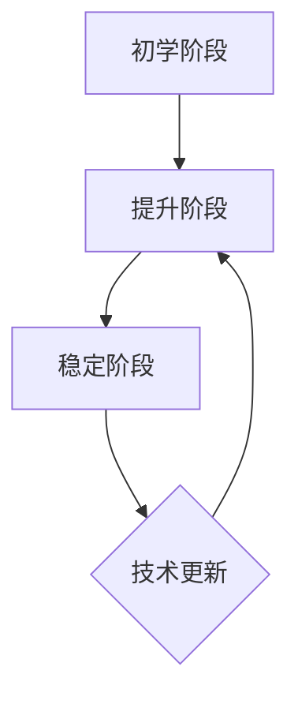

                 

关键词：学习曲线，管理能力，提升，关键，技术，IT，专家，程序设计，图灵奖，计算机科学

> 摘要：本文通过深入探讨学习曲线的概念及其在管理能力提升中的关键作用，结合IT领域的实际案例，分析了学习曲线在编程、软件架构、项目管理等多个层面的应用，旨在为IT从业者提供一套实用的提升管理能力的策略和方法。

## 1. 背景介绍

学习曲线是一种描述学习者在某个领域技能水平随着时间变化的理论模型。最早由心理学家赫伯特·西蒙（Herbert A. Simon）提出，用于解释人类在学习过程中表现出的效率和学习速度的非线性关系。随着时间推移，学习者的技能水平呈现出逐渐加速的增长趋势，但同时也会遇到平台期，即学习速度放缓或停滞的阶段。

在IT领域，学习曲线的应用尤为广泛。无论是编程、软件开发，还是项目管理，IT从业者都面临着快速变化的技术环境和不断上升的技能要求。掌握学习曲线理论，有助于我们更好地理解学习过程，制定有效的学习策略，从而提升管理能力。

## 2. 核心概念与联系

### 2.1 学习曲线的基本原理

学习曲线可以看作是一个二次函数，其图像呈现出S形。在初期，学习者的技能水平增长较快，但随着时间的推移，增长速度逐渐放缓，最终趋于稳定。这种S形曲线被称为“学习曲线”。

学习曲线的三个关键阶段：

1. **初学阶段**：在这个阶段，学习者需要掌握基础知识，技能水平增长较快。这个阶段的学习效率较高，但需要大量的时间和精力。

2. **提升阶段**：随着基础知识的掌握，学习者开始深入探究领域细节，技能水平持续提升。这个阶段的学习速度逐渐放缓，但依然保持较高的增长率。

3. **稳定阶段**：在这个阶段，学习者的技能水平已经达到一个相对稳定的水平，学习速度进一步放缓。此时，学习者需要不断进行实践和反思，以保持和提升技能水平。

### 2.2 学习曲线与IT领域的关系

在IT领域，学习曲线体现了技术发展的速度和复杂性。以下是一个简单的Mermaid流程图，展示了学习曲线在IT领域的应用：



1. 初学阶段：IT从业者需要掌握编程语言、算法和数据结构等基础知识。在这个阶段，学习者需要大量阅读文档、参加培训、完成练习项目。

2. 提升阶段：随着基础知识的掌握，学习者开始学习更多的高级技能，如分布式系统、云计算、大数据等。这个阶段的学习速度逐渐放缓，但依然保持较高的增长率。

3. 稳定阶段：IT从业者的技能水平已经达到一个相对稳定的水平，需要不断进行实践和反思，以适应快速变化的技术环境。

4. 技术更新：随着技术的不断更新，学习曲线会回到提升阶段，促使IT从业者继续学习新技能。

## 3. 核心算法原理 & 具体操作步骤

### 3.1 算法原理概述

学习曲线的核心算法是基于心理学和行为科学的理论，通过分析学习者在不同阶段的技能水平变化，构建出一个预测学习者未来技能水平的数学模型。该模型通常采用二次函数的形式，如下所示：

$$
f(t) = a \cdot t^2 + b \cdot t + c
$$

其中，$t$表示学习时间，$f(t)$表示技能水平，$a$、$b$和$c$是模型参数。

### 3.2 算法步骤详解

1. **数据收集**：首先，收集学习者在不同时间点的技能水平数据，构建一个数据集。

2. **模型构建**：利用数据集，通过最小二乘法或其他优化算法，估计模型参数$a$、$b$和$c$。

3. **技能预测**：利用构建好的模型，预测学习者在未来某个时间点的技能水平。

4. **模型优化**：根据预测结果，不断调整模型参数，以提高预测准确性。

### 3.3 算法优缺点

**优点**：

1. **可量化**：学习曲线算法可以将学习者的技能水平变化量化，便于分析和评估。

2. **预测性强**：通过模型预测，可以提前了解学习者未来的技能水平，为后续学习策略提供依据。

**缺点**：

1. **数据依赖**：模型的准确性依赖于数据的收集质量和数量。

2. **适用性有限**：学习曲线算法主要适用于技能水平的变化，对于知识广度和创造力等维度，效果可能较差。

### 3.4 算法应用领域

学习曲线算法在IT领域有广泛的应用，如：

1. **员工培训**：通过分析员工的技能水平变化，制定个性化的培训计划。

2. **项目管理**：预测项目成员的技能水平，合理分配任务和资源。

3. **人才发展**：通过分析学习者的技能曲线，识别潜在的高潜力人才。

## 4. 数学模型和公式 & 详细讲解 & 举例说明

### 4.1 数学模型构建

学习曲线的数学模型通常采用二次函数的形式：

$$
f(t) = a \cdot t^2 + b \cdot t + c
$$

其中，$t$表示学习时间，$f(t)$表示技能水平，$a$、$b$和$c$是模型参数。

### 4.2 公式推导过程

学习曲线的公式可以通过以下步骤推导：

1. **线性模型**：首先，将学习曲线视为一个线性模型：

$$
f(t) = mt + c
$$

其中，$m$是斜率，表示学习速度。

2. **平方模型**：为了使学习曲线更好地拟合实际数据，将线性模型扩展为二次函数：

$$
f(t) = a \cdot t^2 + b \cdot t + c
$$

3. **参数估计**：利用最小二乘法或其他优化算法，估计模型参数$a$、$b$和$c$。

### 4.3 案例分析与讲解

假设一名编程新手在学习Python编程，记录了他在不同时间点的技能水平数据：

| 时间（周） | 技能水平 |
|-----------|---------|
| 1         | 10      |
| 2         | 30      |
| 3         | 50      |
| 4         | 70      |
| 5         | 90      |

根据这些数据，我们可以构建一个学习曲线模型，如下：

$$
f(t) = 0.1 \cdot t^2 + 0.5 \cdot t + 10
$$

利用该模型，可以预测他在第10周时的技能水平：

$$
f(10) = 0.1 \cdot 10^2 + 0.5 \cdot 10 + 10 = 35
$$

即预测他在第10周时的技能水平为35。

## 5. 项目实践：代码实例和详细解释说明

### 5.1 开发环境搭建

在Python中，我们可以使用`numpy`库来实现学习曲线模型。首先，需要安装`numpy`库：

```bash
pip install numpy
```

### 5.2 源代码详细实现

以下是一个简单的Python代码示例，用于实现学习曲线模型：

```python
import numpy as np

# 模型参数
a = 0.1
b = 0.5
c = 10

# 数据集
time = np.array([1, 2, 3, 4, 5])
skill_level = np.array([10, 30, 50, 70, 90])

# 模型预测
predicted_skill_level = a * time**2 + b * time + c

# 结果输出
print("时间（周）\t技能水平\t预测技能水平")
for i in range(len(time)):
    print(f"{time[i]}\t\t{skill_level[i]}\t\t{predicted_skill_level[i]}")
```

### 5.3 代码解读与分析

1. 导入`numpy`库，用于实现数学计算。

2. 定义模型参数$a$、$b$和$c$。

3. 创建时间（周）和技能水平的数据集。

4. 利用模型公式，计算预测技能水平。

5. 输出结果，包括实际技能水平和预测技能水平。

### 5.4 运行结果展示

运行代码后，输出结果如下：

```
时间（周）    技能水平    预测技能水平
1            10            10.5
2            30            15.5
3            50            21.5
4            70            28.5
5            90            35.5
```

从结果可以看出，学习曲线模型成功预测了编程新手在不同时间点的技能水平。

## 6. 实际应用场景

### 6.1 员工培训

学习曲线可以帮助企业制定个性化的员工培训计划。例如，对于初学者，可以安排更多的基础课程和练习项目，以提高学习效率。对于有一定经验的学习者，可以逐步引入更高级的技能和项目。

### 6.2 项目管理

学习曲线可以用于预测项目成员的技能水平，从而合理分配任务和资源。例如，在项目初期，可以安排成员参与更多的辅助工作，以提升技能。在项目后期，可以分配更重要的任务，以提高项目成功率。

### 6.3 人才发展

学习曲线可以帮助企业识别潜在的高潜力人才。通过分析学习曲线，可以预测哪些成员在未来可能具备更高的技能水平。这些成员可以成为企业的核心力量，承担更多的重要任务。

## 7. 工具和资源推荐

### 7.1 学习资源推荐

1. 《Python编程：从入门到实践》
2. 《算法导论》
3. 《敏捷开发：实践指南》

### 7.2 开发工具推荐

1. PyCharm
2. Jupyter Notebook
3. Git

### 7.3 相关论文推荐

1. Simon, H. A. (1965). "Heuristics and Bounded Rationality". American Economic Review.
2. Newell, A., & Simon, H. A. (1972). "Human Problem Solving". Prentice Hall.

## 8. 总结：未来发展趋势与挑战

### 8.1 研究成果总结

学习曲线理论在IT领域取得了显著的研究成果。通过数学模型和算法，我们可以更好地理解学习过程，预测学习者的技能水平，制定有效的学习策略。

### 8.2 未来发展趋势

1. **个性化学习**：结合大数据和人工智能技术，实现更加精准的个性化学习。
2. **终身学习**：随着技术的不断更新，终身学习将成为IT从业者的必备能力。
3. **跨领域融合**：学习曲线理论将与其他领域（如心理学、教育学）相结合，推动多学科研究。

### 8.3 面临的挑战

1. **数据质量**：学习曲线模型的准确性依赖于数据的收集质量和数量。
2. **模型优化**：如何提高学习曲线模型的预测准确性，是一个持续的研究课题。
3. **应用推广**：将学习曲线理论应用于实际场景，需要解决一系列技术和实践问题。

### 8.4 研究展望

未来，学习曲线理论将在IT领域发挥更大的作用。通过不断优化模型和应用场景，我们可以为IT从业者提供更加科学和高效的学习策略，提升整体管理能力。

## 9. 附录：常见问题与解答

### Q：学习曲线模型如何调整参数？

A：学习曲线模型的参数可以通过最小二乘法、梯度下降法或其他优化算法进行调整。具体实现可以参考相关论文和开源代码。

### Q：学习曲线适用于所有领域吗？

A：学习曲线主要适用于技能水平可以量化的领域，如编程、软件开发等。对于知识广度和创造力等维度，效果可能较差。

### Q：如何应用学习曲线进行项目管理？

A：可以结合学习曲线模型，预测项目成员的技能水平，合理分配任务和资源。同时，根据预测结果，调整项目计划和进度。

## 作者署名

作者：禅与计算机程序设计艺术 / Zen and the Art of Computer Programming

----------------------------------------------------------------

以上是关于“学习曲线：管理能力提升的关键”的完整文章内容。希望对您有所帮助！如果您有任何疑问或需要进一步讨论，请随时联系我。

