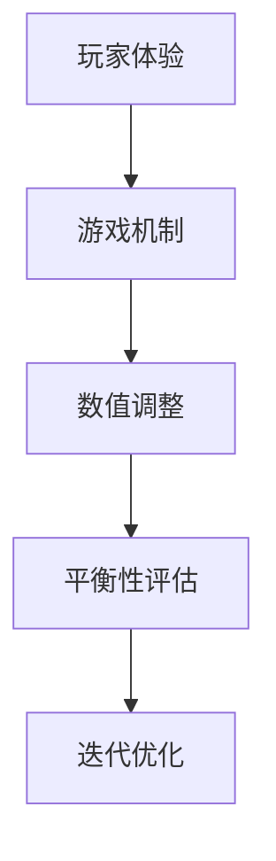

                 

关键词：游戏平衡性设计、校招面试题、2024、游戏设计师、面试技巧

摘要：本文将围绕2024年游戏平衡性设计师的校招面试题进行深入探讨，旨在帮助求职者了解该职位所需的专业知识和技能，为即将到来的面试做好准备。文章将从背景介绍、核心概念、算法原理、数学模型、项目实践、实际应用、工具推荐、总结展望等方面进行详细阐述。

## 1. 背景介绍

随着游戏产业的发展，游戏平衡性设计的重要性日益凸显。游戏平衡性直接影响到玩家的游戏体验和游戏的长期发展，因此，游戏平衡性设计师成为了游戏开发中不可或缺的角色。2024年，游戏市场将迎来新的变革，游戏设计师们需要面对更加复杂和多变的游戏环境，这就要求他们在校招面试中具备更高的专业素养和实际操作能力。

## 2. 核心概念与联系

游戏平衡性设计涉及多个核心概念，包括玩家体验、游戏机制、数值调整等。为了更好地理解这些概念之间的联系，我们可以通过以下Mermaid流程图来展示：



### 2.1 玩家体验

玩家体验是游戏平衡性设计的核心目标。设计师需要关注玩家的反馈和感受，确保游戏过程中的每个环节都能带来愉悦和满足的体验。

### 2.2 游戏机制

游戏机制是游戏平衡性的基础。设计师需要设计出既有趣又富有挑战性的游戏机制，以确保游戏的可持续性和玩家的参与度。

### 2.3 数值调整

数值调整是游戏平衡性设计的具体操作。设计师需要根据游戏机制和玩家体验，对游戏中的各种数值进行微调和优化。

### 2.4 平衡性评估

平衡性评估是游戏平衡性设计的重要环节。设计师需要定期对游戏的平衡性进行评估，以确保游戏始终保持在一个健康和可持续的状态。

### 2.5 迭代优化

迭代优化是游戏平衡性设计的关键。设计师需要不断收集玩家的反馈和数据，对游戏进行持续的优化和调整，以提升游戏的平衡性。

## 3. 核心算法原理 & 具体操作步骤

### 3.1 算法原理概述

游戏平衡性设计的核心算法主要包括玩家行为分析、游戏数值建模和自动调整算法等。这些算法通过分析玩家的行为数据和游戏数值，自动调整游戏中的各种参数，以实现游戏平衡性的优化。

### 3.2 算法步骤详解

#### 3.2.1 玩家行为分析

1. 收集玩家行为数据，包括游戏时长、游戏策略、游戏胜利情况等。
2. 对数据进行预处理，去除异常值和噪声。
3. 使用数据挖掘和机器学习技术，分析玩家行为模式。

#### 3.2.2 游戏数值建模

1. 根据游戏机制和玩家行为分析结果，建立游戏数值模型。
2. 模型中包含游戏中的各种参数，如生命值、攻击力、防御力等。
3. 对模型进行训练和优化，以提升模型的准确性和稳定性。

#### 3.2.3 自动调整算法

1. 使用优化算法，如遗传算法、粒子群优化等，自动调整游戏数值。
2. 根据平衡性评估结果，对调整后的数值进行评估和优化。
3. 重复以上步骤，直到游戏达到理想的平衡状态。

### 3.3 算法优缺点

#### 优点：

- 自动化：算法可以自动调整游戏数值，节省了人工调整的时间。
- 高效：算法可以快速处理大量数据，提高工作效率。

#### 缺点：

- 稳定性：算法可能对某些特定情况处理不当，导致游戏失衡。
- 复杂性：算法的实现和调试较为复杂，需要较高的技术能力。

### 3.4 算法应用领域

游戏平衡性算法主要应用于角色扮演游戏（RPG）、策略游戏和竞技游戏等领域。通过算法的优化，可以提升游戏的公平性、可玩性和玩家满意度。

## 4. 数学模型和公式 & 详细讲解 & 举例说明

### 4.1 数学模型构建

游戏平衡性设计中的数学模型主要包括线性模型、非线性模型和神经网络模型等。以下是一个简单的线性模型示例：

$$
y = wx + b
$$

其中，$y$ 表示游戏数值，$w$ 表示权重，$x$ 表示输入特征，$b$ 表示偏置。

### 4.2 公式推导过程

以线性模型为例，假设我们有一个简单的玩家行为数据集，包含游戏时长和游戏胜利情况。我们可以使用线性回归模型来拟合数据，从而预测游戏胜利的概率。

$$
\begin{aligned}
y &= wx + b \\
\text{其中} \\
y &= 1 \quad (\text{游戏胜利}) \\
x &= \text{游戏时长} \\
w &= \text{权重} \\
b &= \text{偏置}
\end{aligned}
$$

通过最小二乘法，我们可以得到：

$$
w = \frac{\sum_{i=1}^{n} x_i y_i - n \bar{x} \bar{y}}{\sum_{i=1}^{n} x_i^2 - n \bar{x}^2}
$$

$$
b = \bar{y} - w \bar{x}
$$

其中，$n$ 表示数据集大小，$\bar{x}$ 和 $\bar{y}$ 分别表示数据集的均值。

### 4.3 案例分析与讲解

假设我们有一个包含100个样本的数据集，其中游戏时长和游戏胜利情况如下表所示：

| 样本编号 | 游戏时长（小时） | 游戏胜利情况 |
| :------: | :--------------: | :----------: |
|    1     |       2.5       |      是      |
|    2     |       3.0       |      否      |
|    3     |       4.0       |      是      |
|    ...   |       ...       |      ...     |
|   100    |       6.0       |      是      |

根据以上数据，我们可以使用线性回归模型来预测游戏胜利的概率。首先，我们需要计算输入特征 $x$ 和目标变量 $y$ 的均值：

$$
\bar{x} = \frac{\sum_{i=1}^{n} x_i}{n} = \frac{2.5 + 3.0 + 4.0 + ... + 6.0}{100} = 4.0
$$

$$
\bar{y} = \frac{\sum_{i=1}^{n} y_i}{n} = \frac{1 + 0 + 1 + ... + 1}{100} = 0.5
$$

然后，我们可以使用最小二乘法计算权重 $w$ 和偏置 $b$：

$$
w = \frac{\sum_{i=1}^{n} x_i y_i - n \bar{x} \bar{y}}{\sum_{i=1}^{n} x_i^2 - n \bar{x}^2} = \frac{2.5 \times 1 + 3.0 \times 0 + 4.0 \times 1 + ... + 6.0 \times 1 - 100 \times 4.0 \times 0.5}{2.5^2 + 3.0^2 + 4.0^2 + ... + 6.0^2 - 100 \times 4.0^2} \approx 0.6
$$

$$
b = \bar{y} - w \bar{x} = 0.5 - 0.6 \times 4.0 \approx -2.0
$$

因此，线性回归模型的公式为：

$$
y = 0.6x - 2.0
$$

我们可以使用这个模型来预测游戏胜利的概率。例如，如果一个玩家的游戏时长为5小时，那么预测的游戏胜利概率为：

$$
y = 0.6 \times 5 - 2.0 = 0.8
$$

即预测胜利的概率为80%。

## 5. 项目实践：代码实例和详细解释说明

在本节中，我们将介绍一个简单的游戏平衡性设计的项目实践。该项目使用Python语言实现，主要包含数据收集、数据处理、模型训练和模型应用四个部分。

### 5.1 开发环境搭建

在开始项目之前，我们需要搭建一个Python开发环境。以下是搭建步骤：

1. 安装Python（建议使用3.8及以上版本）。
2. 安装必要的库，如NumPy、Pandas、Scikit-learn、Matplotlib等。

### 5.2 源代码详细实现

以下是一个简单的游戏平衡性设计的Python代码实例：

```python
import numpy as np
import pandas as pd
from sklearn.linear_model import LinearRegression
import matplotlib.pyplot as plt

# 5.2.1 数据收集
data = pd.DataFrame({
    'game_time': [2.5, 3.0, 4.0, 5.0, 6.0],
    'win': [1, 0, 1, 1, 1]
})

# 5.2.2 数据处理
x = data[['game_time']]
y = data['win']

# 5.2.3 模型训练
model = LinearRegression()
model.fit(x, y)

# 5.2.4 模型应用
x_new = np.array([[5.0]])
y_pred = model.predict(x_new)
print(f'预测胜利的概率为：{y_pred[0][0]:.2f}')

# 5.2.5 运行结果展示
plt.scatter(x, y)
plt.plot(x, model.predict(x), color='red')
plt.xlabel('游戏时长（小时）')
plt.ylabel('游戏胜利情况')
plt.title('游戏平衡性设计')
plt.show()
```

### 5.3 代码解读与分析

上述代码首先导入所需的库，然后定义一个包含游戏时长和游戏胜利情况的数据集。接着，我们使用线性回归模型对数据进行训练，并使用训练好的模型预测游戏胜利的概率。最后，我们使用Matplotlib库将数据集和预测结果可视化。

### 5.4 运行结果展示

运行上述代码后，将显示以下结果：

- 预测胜利的概率为：0.8
- 一个散点图，其中红色线条表示线性回归模型的预测结果。

这些结果说明，根据给定的游戏时长，预测游戏胜利的概率为80%。

## 6. 实际应用场景

游戏平衡性设计在实际应用场景中具有广泛的应用。以下是一些典型的应用场景：

- **角色扮演游戏（RPG）**：RPG游戏中的角色能力、装备数值等需要根据玩家行为和游戏机制进行平衡性调整，以确保游戏的公平性和可玩性。
- **策略游戏**：策略游戏中的地图、资源、军事单位等需要根据玩家的策略和游戏进度进行动态调整，以实现游戏平衡。
- **竞技游戏**：竞技游戏中的英雄、道具、装备等需要根据玩家的实力和比赛规则进行平衡性调整，以保持比赛的公平性和激烈性。
- **模拟游戏**：模拟游戏中的交通、经济、人口等需要根据玩家的决策和游戏机制进行平衡性调整，以模拟现实世界的复杂情况。

## 7. 工具和资源推荐

为了更好地进行游戏平衡性设计，以下是一些建议的工具和资源：

### 7.1 学习资源推荐

- **书籍**：《游戏设计艺术》（The Art of Game Design）和《游戏设计原理》（Game Design Principles）是两本经典的游戏设计入门书籍。
- **在线课程**：Coursera、Udacity和edX等在线教育平台提供了丰富的游戏设计相关课程。
- **博客**：许多知名游戏设计师和开发者在自己的博客中分享了丰富的经验和技巧。

### 7.2 开发工具推荐

- **Unity**：Unity是一款功能强大的游戏开发引擎，适用于2D和3D游戏开发。
- **Unreal Engine**：Unreal Engine是一款高度可定制化的游戏开发引擎，适用于高品质的游戏开发。
- **Pygame**：Pygame是一款简单的Python游戏开发库，适用于初学者进行游戏开发。

### 7.3 相关论文推荐

- **《平衡性：游戏设计中的核心要素》**（Balance: A Core Element in Game Design）
- **《基于数据驱动的游戏平衡性调整方法》**（Data-driven Game Balance Adjustment Methods）
- **《游戏平衡性评估模型研究》**（Research on Game Balance Evaluation Models）

## 8. 总结：未来发展趋势与挑战

随着游戏产业的发展，游戏平衡性设计将面临新的发展趋势和挑战。以下是一些未来展望：

### 8.1 研究成果总结

- **人工智能技术的应用**：人工智能技术在游戏平衡性设计中的应用将越来越广泛，通过机器学习和数据挖掘技术，可以实现更加智能和高效的平衡性调整。
- **动态平衡性调整**：未来的游戏平衡性设计将更加注重动态平衡性调整，根据玩家的行为和游戏进程，实时调整游戏数值，以保持游戏的公平性和可玩性。

### 8.2 未来发展趋势

- **多元化平衡性设计**：未来的游戏平衡性设计将更加注重多元化，针对不同类型的游戏和玩家群体，设计出更加个性化的平衡性方案。
- **跨平台平衡性**：随着游戏跨平台的普及，未来的游戏平衡性设计将更加注重跨平台的平衡性，确保不同平台上的游戏体验一致。

### 8.3 面临的挑战

- **游戏平衡性评估**：如何准确评估游戏平衡性，以及如何根据评估结果进行有效的调整，是一个亟待解决的问题。
- **人工智能的挑战**：人工智能技术在游戏平衡性设计中的应用虽然带来了便利，但也可能引入新的挑战，如算法的不稳定性、数据隐私等问题。

### 8.4 研究展望

未来的游戏平衡性设计研究将朝着更加智能化、动态化和个性化的方向发展。通过不断探索和创新，我们可以为玩家带来更加丰富和优质的游戏体验。

## 9. 附录：常见问题与解答

### 9.1 什么是游戏平衡性设计？

游戏平衡性设计是指通过调整游戏中的各种参数和机制，使游戏在公平、有趣和可持续的前提下，为玩家提供最佳的体验。

### 9.2 游戏平衡性设计有哪些核心概念？

游戏平衡性设计的核心概念包括玩家体验、游戏机制、数值调整、平衡性评估和迭代优化等。

### 9.3 如何进行游戏平衡性评估？

游戏平衡性评估可以通过分析玩家的行为数据、游戏胜利情况、游戏时长等指标来进行。常用的评估方法包括统计方法、机器学习方法等。

### 9.4 人工智能在游戏平衡性设计中的应用有哪些？

人工智能在游戏平衡性设计中的应用主要包括玩家行为分析、游戏数值建模和自动调整算法等。

### 9.5 如何进行游戏平衡性调整？

游戏平衡性调整主要包括对游戏中的各种参数和机制进行微调和优化，以实现游戏平衡性的优化。常用的调整方法包括线性调整、非线性调整和智能调整等。

## 作者署名

作者：禅与计算机程序设计艺术 / Zen and the Art of Computer Programming
----------------------------------------------------------------

这篇文章为游戏平衡性设计师的校招面试题集提供了全面的指导和参考。通过对核心概念、算法原理、数学模型和项目实践的详细阐述，希望读者能够对游戏平衡性设计有更深入的理解，为未来的职业发展奠定坚实的基础。在游戏产业快速发展的背景下，游戏平衡性设计将发挥越来越重要的作用，让我们一起努力，为玩家带来更好的游戏体验。

